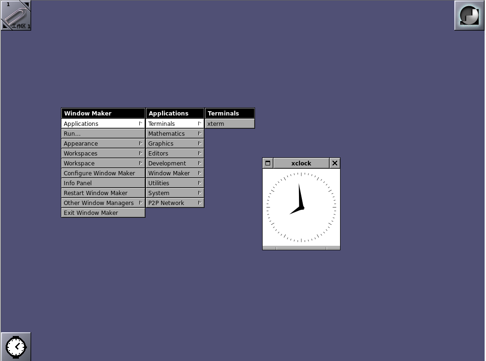
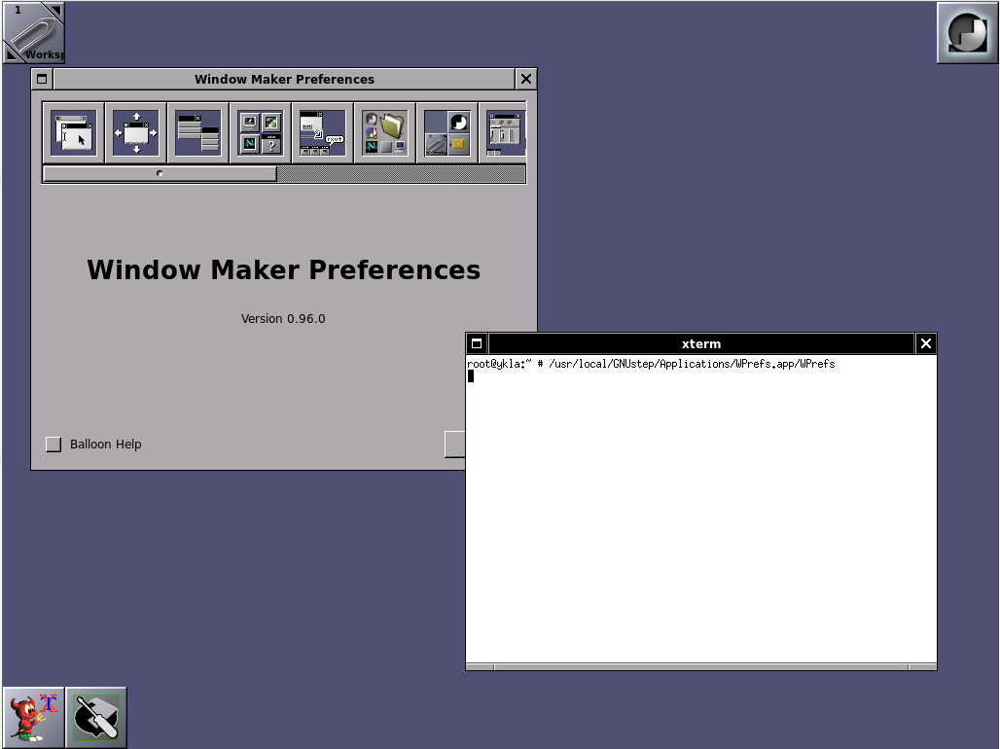

# 7.5 Window Maker

Window Maker 是一款 X11 窗口管理器，其设计目标是重现 NeXTSTEP（macOS 的前身）用户界面与用户体验。

## 安装

- 使用 pkg 安装：

```sh
# pkg install windowmaker wmakerconf xorg lightdm lightdm-gtk-greeter wqy-fonts xdg-user-dirs
```

- 或者使用 Ports：

```sh
# cd /usr/ports/x11/windowmaker/ && make install clean
# cd /usr/ports/x11-wm/wmakerconf/ && make install clean 
# cd /usr/ports/x11/xorg/ && make install clean 
# cd /usr/ports/x11/lightdm/ && make install clean 
# cd /usr/ports/x11/lightdm-gtk-greeter/ && make install clean 
# cd /usr/ports/x11-fonts/wqy/ && make install clean
# cd /usr/ports/devel/xdg-user-dirs/ && make install clean 
```

- 软件包解释：


| 包名                     | 作用说明                                                                 |
|:--------------------------|:-------------------------------------------------------|
| `xorg`                   | X Window 系统                                           |
| `windowmaker`            | X11 窗口管理器 |
| `wmakerconf`             | Window Maker 的配置工具，未作为依赖包安装；包含语言包，但不包含中文 |
| `lightdm`                | 轻量级显示管理器 LightDM |
| `lightdm-gtk-greeter`    | LightDM 的 GTK+ 登录界面插件，如未安装将无法启动 LightDM |
| `wqy-fonts`              | 文泉驿中文字体|
| `xdg-user-dirs`          | 管理用户目录，如“桌面”、“下载”等|


## `startx`

编辑 `~/.xinitrc` 文件，加入下行：

```ini
exec wmaker
```

便于在 TTY 通过 `startx` 命令启动 Window Maker 会话。

### 参考文献

- [How to startx window maker?](https://www.linuxquestions.org/questions/debian-26/how-to-startx-window-maker-230516/)

## 启动项

```sh
# service dbus enable       # 设置 D-Bus 服务开机自启动
# service lightdm enable    # 设置 LightDM 显示管理器开机自启动
```

## 挂载 proc 文件系统

编辑 `/etc/fstab`，加入下行：

```ini
proc           /proc       procfs  rw  0   0
```

挂载 procfs 文件系统到 `/proc`，读写模式。

### 设置中文环境

编辑 `/etc/login.conf`，找到 `default:\` 这一段，将 `:lang=C.UTF-8` 修改为 `:lang=zh_CN.UTF-8`。

刷新用户分类数据库：

```sh
# cap_mkdb /etc/login.conf
```

## 图片




## 故障排除与未竟事宜

### `Could not execute command: exec WPrefs`

可以在终端输入下行，启动 GNUStep WPrefs 应用程序：

```sh
# /usr/local/GNUStep/Applications/WPrefs.app/WPrefs
```



### 无法使用中文环境

Window Maker 本身部分字符串未被包含在 `.po` 文件中 [https://repo.or.cz/wmaker-crm.git/blob/refs/heads/master:/po/zh\_CN.po](https://repo.or.cz/wmaker-crm.git/blob/refs/heads/master:/po/zh_CN.po)，因此在界面显示时可能出现中英文混合的情况。

根据 <https://sourceforge.net/p/wmakerconf/code/HEAD/tree/wmakerconf/trunk/po/>，wmakerconf 自 2007 年以后已停止开发，翻译内容很可能无法被合并。

综上，中文环境处理难度较大，感兴趣的读者可以尝试推进。

### 参考文献

- [windowmaker could not execute wprefs!](https://forums.freebsd.org/threads/windowmaker-could-not-execute-wprefs.92625/)
