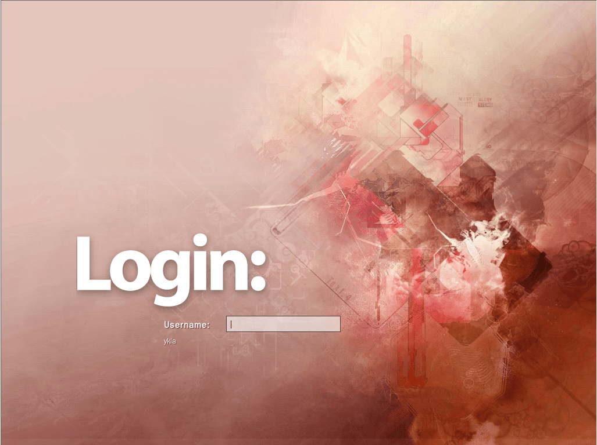
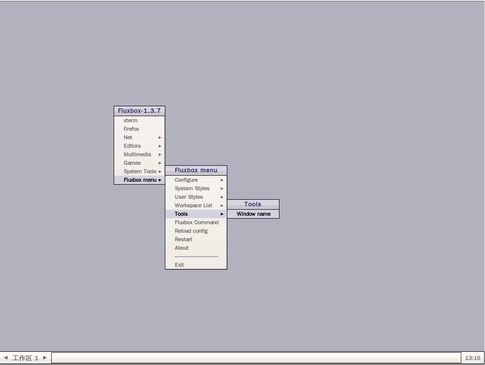

# 7.6 Fluxbox

## 安装

### 使用 pkg 安装

```sh
# pkg install xorg fluxbox fluxbox-tenr-styles-pack slim wqy-fonts xdg-user-dirs
```

### 使用 Ports 安装

```sh
# cd /usr/ports/x11-wm/fluxbox/ && make install clean # fluxbox
# cd /usr/ports/x11-themes/fluxbox-tenr-styles-pack/ && make install clean 
# cd /usr/ports/x11/xorg/ && make install clean 
# cd /usr/ports/x11/slim/ && make install clean 
# cd /usr/ports/x11-fonts/wqy/ && make install clean 
# cd /usr/ports/devel/xdg-user-dirs/ && make install clean 
```

### 软件包说明


| 包名                        | 作用说明                                                                 |
|:-----------------------------|:--------------------------------------------------------------------------|
| `xorg`                      | X Window 系统（X Window System）               |
| `fluxbox`                   | 窗口管理器|
| `fluxbox-tenr-styles-pack`  | Tenner 提供的 Fluxbox 主题包 |
| `slim`                      | 轻量级图形登录管理器|
| `wqy-fonts`                 | 文泉驿中文字体                                            |
| `xdg-user-dirs`             | 管理用户目录，如“桌面”、“下载”等                                         |


## `startx`

编辑 `~/.xinitrc` 文件，加入以下内容（每个用户根据自己的登录用户写入）：

```sh
exec startfluxbox
```

便于在 TTY 直接用命令 `startx` 启动 Fluxbox。

## 启动项

```sh
# service dbus enable  # 启用 D-Bus 服务
# service slim enable  # 启用 slim 登录管理器
```

## 挂载 proc 文件系统

编辑 `/etc/fstab`，加入下行：

```sh
proc           /proc       procfs  rw  0   0
```

挂载 procfs 文件系统到 `/proc`，读写模式。

## 中文配置


编辑 `/etc/login.conf` 文件，找到 `default:\` 这一段，将 `:lang=C.UTF-8` 修改为 `:lang=zh_CN.UTF-8`。


刷新用户分类数据库：

```sh
# cap_mkdb /etc/login.conf
```

## 桌面欣赏





## 故障排除与未竟事宜

### LightDM 和 XDM 均不可用

表现为无法启动 Fluxbox。

待解决。

### 中文界面未启用

待解决。
