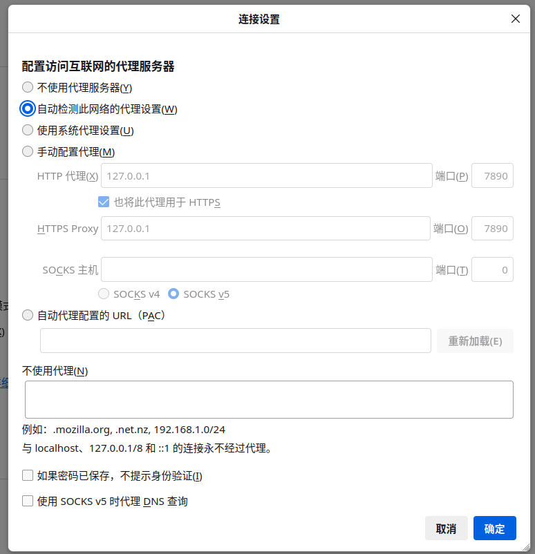

# 7.1 系统代理

代理（Proxy）技术是计算机网络中的基础概念，其核心思想是在客户端与目标服务器之间引入中间节点，由中间节点代为转发请求和响应。

## 代理工作原理

代理的工作流程可概括为：客户端发起请求 → 请求被重定向至代理服务器 → 代理服务器将请求转发至目标服务器 → 目标服务器响应代理服务器 → 代理服务器将响应返回客户端。在此过程中，目标服务器获知的是代理服务器的地址，而非客户端的真实地址。

代理按部署模式可分为三类：

- **正向代理（Forward Proxy）**：客户端显式配置代理地址，代理代表客户端向外部服务器发起请求。本节讨论的系统代理即属于正向代理。正向代理的典型用途包括突破网络访问限制和缓存加速。
- **反向代理（Reverse Proxy）**：代理代表服务器接收客户端请求，客户端不知道真实服务器的地址。反向代理的典型用途包括负载均衡、SSL 终结和静态内容缓存。
- **透明代理（Transparent Proxy）**：客户端无需配置，网络设备（如路由器）将流量重定向至代理。透明代理的典型用途包括企业网络的内容过滤和流量监控。

在配置系统代理前，需查看当前用户正在使用的 shell 类型，因为不同 shell 对环境变量的设置方式存在差异。执行以下命令可查看当前 shell：

```sh
$ echo $SHELL
```

## 配置 HTTP_PROXY 代理

通过设置 HTTP_PROXY、HTTPS_PROXY、ALL_PROXY 等环境变量，可让多数命令行工具通过代理转发流量。以下为配置方法。

### 若使用 sh、Bash 或 Zsh

在 sh、Bash 或 Zsh 中配置代理时，需注意以下事项。

> **注意**
>
> 在 sh、Bash 或 Zsh 中，环境变量 `HTTP_PROXY` 通常使用大写形式。部分应用程序（如 curl、wget）也会识别小写形式 `http_proxy`，但不同程序的行为不一致，建议统一使用大写形式以确保兼容性。

设置 HTTP 代理环境变量，该变量将被当前 shell 及其子进程继承：

```sh
# export HTTP_PROXY=http://192.168.X.X:7890
```

> **警告**
>
> 示例中的 IP 地址和端口号 192.168.X.X:7890 需替换为实际的代理服务端点。

取消已设置的 HTTP 代理环境变量：

```sh
# unset HTTP_PROXY
```

### 若使用 csh

在 csh 或 tcsh 中配置代理时，需注意以下事项。

> **注意**
>
> 在 csh 或 tcsh 中，环境变量 `http_proxy` 必须使用小写形式，大写形式不会生效。

在 csh 或 tcsh 中设置 HTTP 代理环境变量，需使用该 shell 特有的 `setenv` 命令：

```sh
# setenv http_proxy http://192.168.X.X:7890
```

在 csh 或 tcsh 中取消已设置的 HTTP 代理环境变量，使用对应的 `unsetenv` 命令：

```sh
# unsetenv http_proxy
```

## 配置 Git 代理

Git 支持通过 `http.proxy` 和 `core.gitProxy` 等配置项设置代理，详见本书软件管理相关章节。

## 为浏览器配置代理

### Chrome 命令选项

[chromium](https://www.chromium.org/) 是 Google Chrome 浏览器的开源版本，支持多种命令行参数。

Chromium 浏览器在 **~/.config** 等目录下并无代理配置文件，也不支持通过环境变量指定默认代理服务器，但可通过启动参数设置代理。

可通过以下格式指定代理服务器和端口：

```sh
--proxy-server="<IP 地址>:<端口>"
```

启动 Chrome 并使用指定的本地代理服务器：

```sh
$ chrome --proxy-server="127.0.0.1:1234"
```

默认使用 HTTP 协议。指定 SOCKS 代理服务器和端口：

```sh
--proxy-server="socks://<IP 地址>:<端口>"
```

指定 SOCKS4 代理服务器和端口：

```sh
--proxy-server="socks4://<IP 地址>:<端口>"
```

在图形界面下使 Chromium 默认通过代理启动，可通过修改桌面启动文件实现持久化配置。

找到桌面环境为 Chromium 创建的桌面（desktop）文件，通常位于 **~/.local/share/applications/** 目录下：

```sh
~/
└── .local/
    └── share/
        └── applications/
            └── chromium-browser.desktop # Chromium 桌面启动文件
```

使用编辑器打开上述目录下的 Chromium desktop 文件 `chromium-browser.desktop`，找到 `Exec=chrome %U` 这一行，并在其后添加所需参数：

```ini
Comment[zh_CN]=Google web browser based on WebKit
Comment=Google web browser based on WebKit
Encoding=UTF-8
Exec=chrome %U
GenericName[zh_CN]=
......
```

启动 Chromium 并使用指定的代理服务器：

```sh
Exec=chrome %U --proxy-server="192.168.2.163:20172"
```

### 为 Firefox 单独配置代理

Firefox 浏览器在设置页面的网络设置选项卡中提供了图形化代理配置模块。



### 参考文献

- Owynn, graudeejs, rjohn, olli@, Sevendogsbsd, kpedersen. chromium proxy settings page doesn't exist[EB/OL]. [2026-03-25]. <https://forums.freebsd.org/threads/chromium-proxy-settings-page-doesnt-exist.31927/>. 提供了 FreeBSD 下 Chromium 代理配置的实践解决方案。

## 课后习题

1. 修改 Chromium 的 desktop 文件，使其默认使用 SOCKS5 代理启动，验证其 DNS 查询是否通过代理转发，分析 `--proxy-server` 参数对 DNS 解析路径的影响。
2. 为 csh 和 sh 分别编写代理开关脚本，设置代理后使用 `tcpdump` 验证 git、fetch 等命令的实际网络流量路径，分析不同 shell 对环境变量大小写约定的差异及其规范来源。
3. 为 Firefox 编写一个 shell 脚本，通过修改其 `prefs.js` 配置文件实现代理自动切换，对比 Firefox 配置文件方式与 Chromium 命令行参数方式在用户可控性上的差异。
