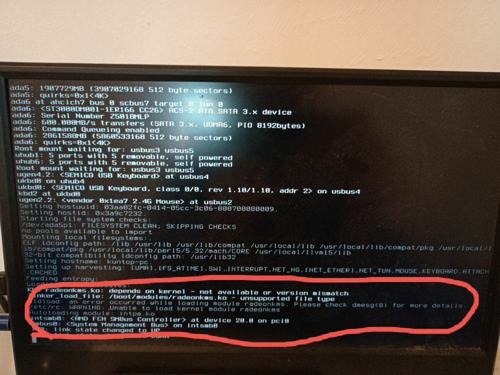

# 7.1 显卡驱动概论

使用 bsdinstall 安装的 FreeBSD 系统不会自动安装图形用户界面。本节介绍如何为图形处理器（GPU）选择和安装驱动程序。

## 何时需要安装显卡驱动？


上图展示了未安装显卡驱动时可能出现的错误界面。

> **警告**
>
> 请勿使用 **sysutils/desktop-installer**，该工具在当前环境下可能引发错误和配置冲突。

## 显卡支持情况

FreeBSD 的 i915 和 AMD 显卡驱动与基本系统分离，以 Port 形式提供，这些驱动移植自 Linux 内核的直接渲染管理器（DRM，Direct Rendering Manager），采用长期支持（Long Term Support，LTS）版本。不同系统版本对应的 Linux 内核版本有所不同。

> **注意**
>
> 使用 Ports 安装时，drm 驱动需要在 **/usr/src** 中有一份当前版本的系统源代码，具体可参考系统更新章节。如果已参考本书其他章节安装，系统中通常已有一份源代码，无需再次获取。

DRM 是 Linux 内核的子系统，负责与现代显卡的 GPU 交互。FreeBSD 在内核中实现了 Linux 内核编程接口（LinuxKPI，Linux Kernel Programming Interface）并移植了 Linux DRM，部分无线网卡驱动也采用了这种移植方式。

> **注意**
>
> 这种移植并不覆盖 Linux 现有的全部 DRM GPU 驱动，目前仅包括 i915、amdgpu 和 radeon，vmwgfx、xe、virtio 等均未移植。这些未移植的 GPU 缺少 DRM KMS 驱动支持，无法在 Wayland 上运行，在 X11 上也只能使用帧缓冲驱动（如 scfb 或 vesa）而非硬件加速驱动。

显卡支持情况：

| Port 名称 | Linux DRM 版本 | 适用 FreeBSD 版本 | 说明 |
| --------- | -------------- | ----------------- | ---- |
| **graphics/drm-515-kmod** | 5.15 LTS | 14.0–15.x | 不支持 FreeBSD 16.0 及以上 |
| **graphics/drm-61-kmod** | 6.1 LTS | 14.0 及以上 | 14.x 的默认选择 |
| **graphics/drm-66-kmod** | 6.6 LTS | 15.0 及以上 | 15.0 的默认选择 |
| **graphics/drm-612-kmod** | 6.12 LTS | 15.1 及以上 | 15.1 及以上的默认选择；Intel Meteor Lake 图形在 6.7 后默认启用；AMD 覆盖 GCN 到 RDNA 4 全部架构（RDNA 4 支持自 Linux 6.12 引入） |
| **graphics/drm-latest-kmod** | 跟踪最新 | 15.1 及以上 | 跟踪 drm-kmod 仓库 master 分支，当前为 Linux 6.12；可能不如 LTS 版本稳定 |

通过元 Port **graphics/drm-kmod** 安装时，系统会根据 OSVERSION 自动选择合适的版本：

| OSVERSION 条件 | 选择的 Port | 对应 FreeBSD 版本 |
| -------------- | ----------- | ----------------- |
| >= 1500509 | drm-612-kmod | 15.1 及以上 |
| >= 1500031 | drm-66-kmod | 15.0 |
| 其余 | drm-61-kmod | 14.x |

如需指定版本，可直接安装对应的 Port。上述 OSVERSION 阈值为 ports 树中的硬编码数值，会随 ports 树更新而变化，以 ports 中的实际 Makefile 为准。

可在 Ports 开发者手册的最后一章中查询 OSVERSION 对应的版本和 Git 提交。

查看本机 `OSVERSION`，显示系统版本构建标识符：

```sh
# uname -U
1500019
```

> **警告**
>
> 每次小版本或大版本升级时，可能需要重新获取系统源代码并重新编译安装显卡驱动模块，方可顺利完成升级并避免停留在黑屏界面；或者也可使用“模块源”方式。

## 加入 video 组

video 组是负责访问 DRM 和 DRI 视频设备的用户组。只有加入该组的用户才能正常启用显卡的硬件加速功能以及 Wayland 会话功能。

需将指定用户添加到 video 用户组：

```sh
# pw groupmod video -m 实际用户名
```

> **警告**
>
> 即使已加入 `wheel` 组，也应再加入 `video` 组，否则视频硬件解码功能可能出现异常，且 Wayland 下普通用户将无权限调用显卡。

## 亮度调节

### 通用设置

一般计算机需要在 **/boot/loader.conf** 文件中启用 ACPI 视频支持：

```sh
# sysrc -f /boot/loader.conf acpi_video_load="YES"
```

ThinkPad 可启用 IBM ACPI 支持和 ACPI 视频支持。

- 在 **/boot/loader.conf** 文件中启用 IBM ACPI 支持：

```sh
# sysrc -f /boot/loader.conf acpi_ibm_load="YES"
```

- 在 **/boot/loader.conf** 文件中启用 ACPI 视频支持：

```sh
# sysrc -f /boot/loader.conf acpi_video_load="YES"
```

### Intel/AMD 显卡

`backlight` 工具自 FreeBSD 13 引入。

```sh
# backlight          # 打印当前亮度
# backlight -q       # 仅输出亮度数值，便于脚本使用
# backlight -i       # 查询背光设备信息（名称、类型）
# backlight decr 20  # 降低 20% 亮度
# backlight +        # 默认调整亮度增加 10%
# backlight -        # 默认调整亮度减少 10%
```

如果上述操作未生效，可检查 **/dev/backlight** 路径下的可用设备。

- 示例（使用 `ls /dev/backlight` 命令查看实际设备）：

设置 amdgpu_bl00 背光亮度为 10：

```sh
# backlight -f /dev/backlight/amdgpu_bl00 10
```

设置 backlight0 背光亮度为 10：

```sh
# backlight -f /dev/backlight/backlight0 10
```

### 参考文献

- Vadot E. backlight -- configure backlight hardware[EB/OL]. (2022-07-19)[2026-03-25]. <https://man.freebsd.org/cgi/man.cgi?query=backlight&sektion=8>. 经测试，此部分教程适用于 Renoir 显卡。

## 状态检查

检查显卡是否已成功驱动：

```sh
$ pciconf -lv | grep -B4 VGA   # 列出系统中所有 VGA 兼容设备及其型号
$ ls -al /dev/dri/card0
lrwxr-xr-x  1 root wheel 8 Jul  2 19:39 /dev/dri/card0 -> ../drm/0

$ ls -al /dev/backlight/backlight0
crw-rw---- 1 root video 1, 177 2025年 8月22日 /dev/backlight/backlight0  # 台式机 HDMI 等输出可能没有
```

显卡驱动加载成功后，系统中将出现 `card0` 设备（默认编号为 `0`，如有第二块显卡则为 `card1`），同时还可能出现 `backlight0` 设备（HDMI 输出下通常不存在该设备）。可使用 `kldstat | grep -E "i915kms|amdgpu|radeonkms"` 进一步确认对应的内核模块已成功加载。

## 故障排除与未竟事宜

> **注意**
>
> 遇到任何问题时，请先使用 Ports 重新编译安装，尤其是在版本升级时。

- 如果显卡驱动存在问题，请直接联系维护者：<https://github.com/freebsd/drm-kmod/issues>。
- 如果笔记本出现唤醒时屏幕无法点亮的问题，可在 **/boot/loader.conf** 文件中添加 `hw.acpi.reset_video="1"` 以在唤醒时重置显示适配器。
- 普通用户可能未加入 `wheel` 组或 `video` 组。如果普通用户未加入 video 组（仅加入 wheel 组不够），KDE 设置中将始终显示显卡驱动为“llvmpipe”，这会影响 Wayland 下普通用户的显示或硬件解码功能。

### KLD XXX.ko depends on kernel - not available or version mismatch.

提示内核版本不符，请先升级系统或使用 Ports 编译安装。可使用 FreeBSD-kmods 仓库提供的内核模块（参见其他章节），应不致出现类似问题。



## 课后习题

1. 使用 `pciconf -lv | grep -B3 display` 查看本机显卡型号，根据显卡品牌（Intel、AMD 或 NVIDIA）安装对应的 DRM 驱动，用 `kldstat` 确认驱动模块已加载。
2. 安装显卡驱动后，检查 **/dev/dri/card0** 设备是否存在，将当前用户加入 `video` 组，重启后运行 `glxinfo | grep "OpenGL renderer"` 确认硬件加速是否生效。
3. 在 **/boot/loader.conf** 中启用 ACPI 视频支持，使用 `backlight` 命令调节屏幕亮度，记录 `backlight decr` 和 `backlight +` 的实际效果。
