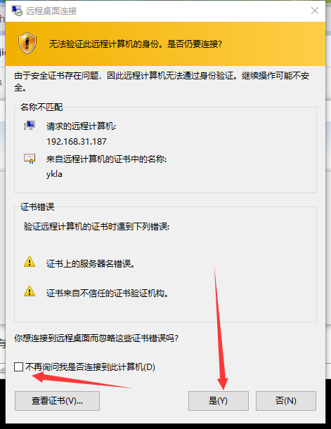
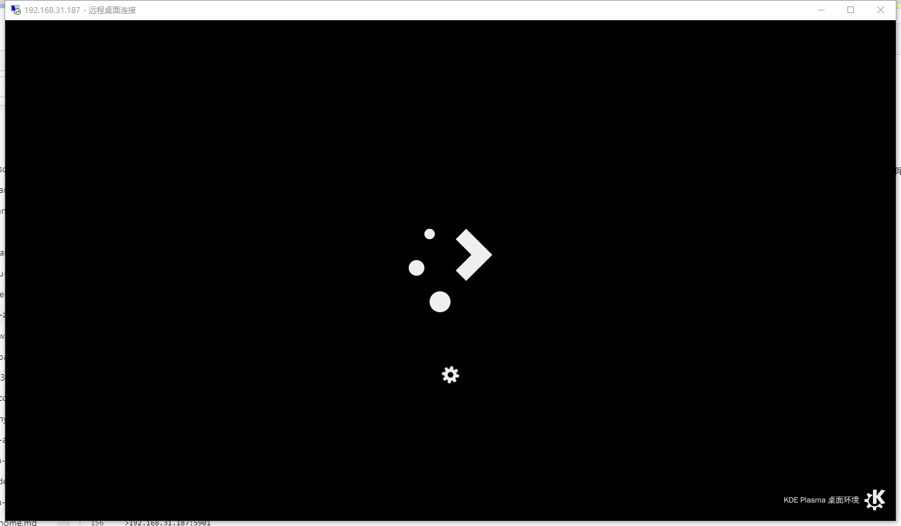
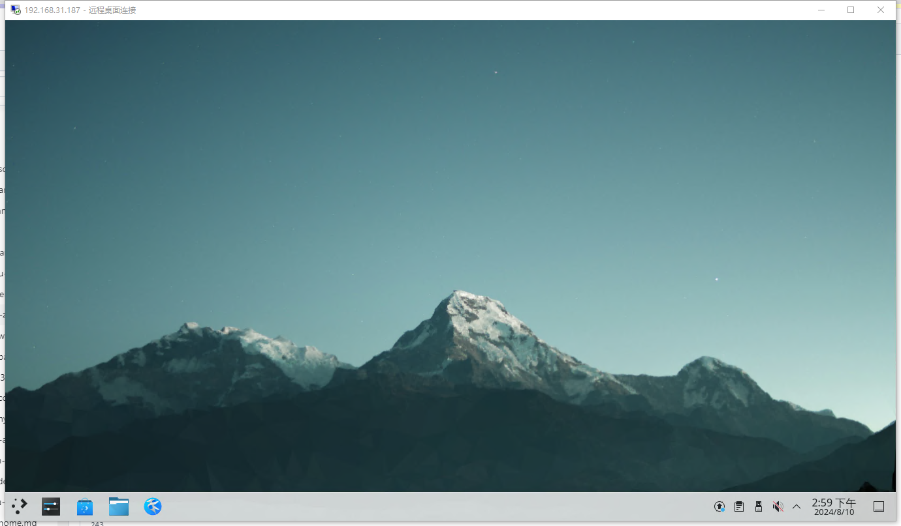
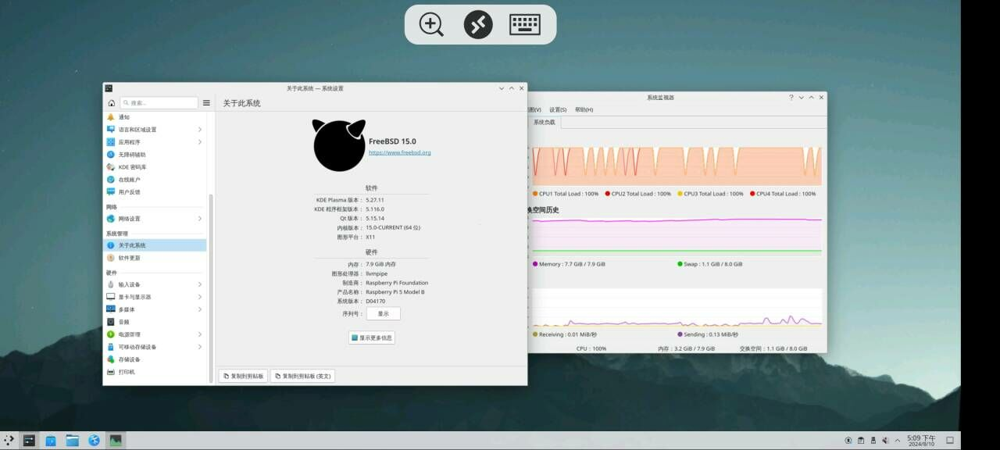
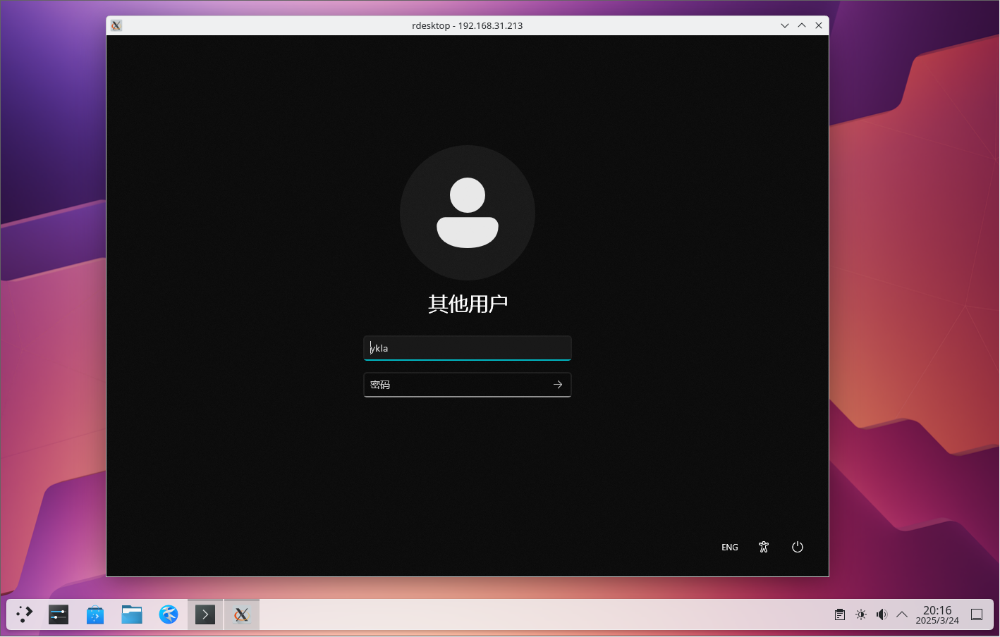
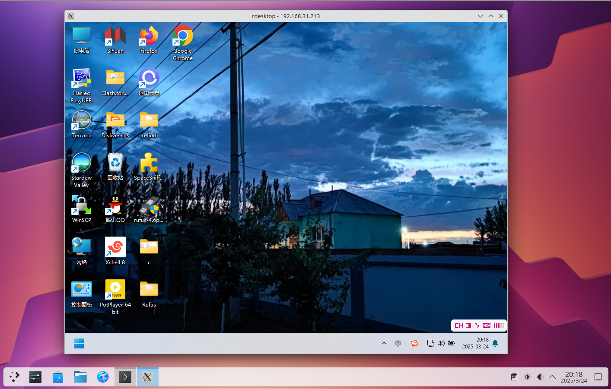
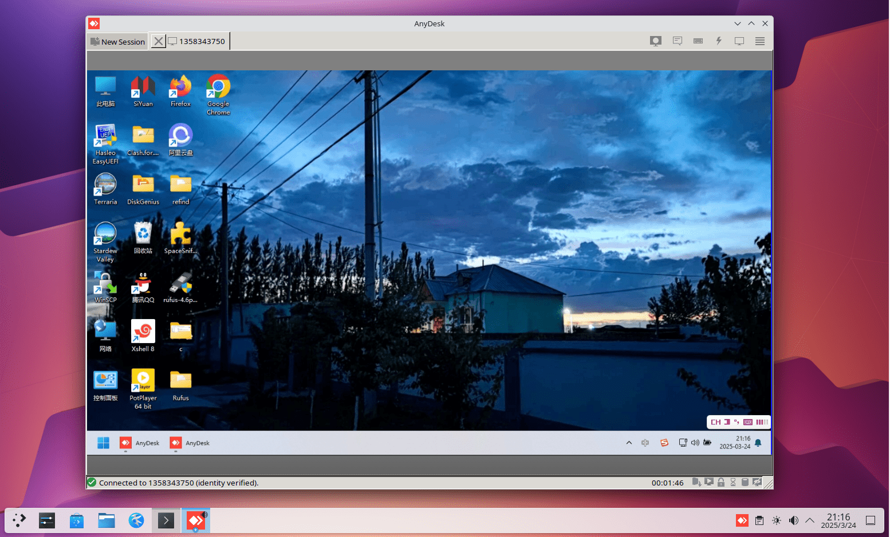

# 7.6 远程桌面

远程桌面访问技术可通过网络从一台设备远程控制另一台设备的桌面环境。远程桌面协议主要分为两类：基于帧缓冲区的协议（如 VNC，定义于 RFC 6143）和基于指令流的协议（如 RDP，基于 ITU-T T.120 协议族（含 T.128，即 T.share）扩展而来）。本节涵盖两种协议在 FreeBSD 下的配置。

## 目录结构

```sh
/
├── home
│   └── ykla
│       └── .vnc
│           ├── passwd              # VNC 密码文件
│           ├── xstartup             # VNC 启动脚本
│           └── config               # VNC 配置文件
│       └── .Xauthority              # X 授权文件
├── usr
│   └── local
│       └── etc
│           └── xrdp
│               ├── xrdp.ini        # XRDP 主配置文件
│               ├── sesman.ini      # XRDP 会话管理器配置
│               └── startwm.sh      # XRDP 启动桌面环境脚本
└── var
    ├── run
    │   ├── sddm                     # SDDM 授权文件目录
    │   ├── lightdm                  # LightDM 授权文件目录
    │   └── user
    │       └── 120
    │           └── gdm              # GDM 授权文件目录
    └── lib
        └── gdm                      # GDM 旧版授权文件目录
```

## x11vnc（FreeBSD 作为被控端，镜像屏幕）

x11vnc 提供屏幕镜像功能，用户操作会同步显示在物理显示器上，物理显示器上的操作在 VNC 客户端中同样可见。建议配合 SSH 隧道或 SSL 加密使用，防止 VNC 流量被嗅探。

若无物理显示器则无法使用 x11vnc，但可使用 HDMI 显卡欺骗器代替物理显示器。

### 安装 x11vnc

- 使用 pkg 安装：

```sh
# pkg install x11vnc
```

- 或使用 Ports 安装：

```sh
# cd /usr/ports/net/x11vnc/
# make install clean
```

### 创建密码

设置 x11vnc 的访问密码：

```sh
$ x11vnc -storepasswd
Enter VNC password:
Verify password:
Write password to /root/.vnc/passwd?  [y]/n y # 输入 y 并回车确认
Password written to: /root/.vnc/passwd
```

### 启动服务器（KDE 6 SDDM）

- 使用指定的密码文件和 SDDM 授权文件启动 x11vnc：

```sh
$ x11vnc -display :0 -rfbauth ~/.vnc/passwd -auth $(find /var/run/sddm/ -type f)
```

> **警告**
>
> 由于 x11vnc 尚不支持 Wayland，如果在 SDDM 左下角选择 `Wayland`，将无法进入桌面。

- 使用指定密码文件和 LightDM 授权文件启动 x11vnc：

```sh
$ x11vnc -display :0 -rfbauth ~/.vnc/passwd -auth /var/run/lightdm/root/:0
```

- 使用指定密码文件和 GDM 授权文件启动 x11vnc：

```sh
$ x11vnc -display :0 -rfbauth ~/.vnc/passwd -auth /var/lib/gdm/:0.Xauth # 或使用 /run/user/120/gdm/Xauthority，具体路径取决于 GDM 版本，可用 ls 查看
```


### 参考文献

- Arch Linux Wiki. X11vnc[EB/OL]. [2026-03-25]. <https://wiki.archlinux.org/title/X11vnc>. Arch Linux 官方维基提供的 X11vnc 配置与使用详细指南。

## TigerVNC（FreeBSD 作为被控端）

启用 VNC 服务端（Ports 中仅剩 [TigerVNC](https://www.freshports.org/net/tigervnc-server/)）。

### 安装 TigerVNC Server

使用 pkg 安装：

```sh
# pkg install tigervnc-server
```

或者使用 Ports 安装：

```sh
# cd /usr/ports/net/tigervnc-server/
# make install clean
```

### 设置

创建 **~/.vnc/** 路径：

```sh
$ mkdir -p ~/.vnc/
```

编辑 **~/.vnc/xstartup** 文件，新增以下行：

```sh
#!/bin/sh
unset SESSION_MANAGER        # 清除 SESSION_MANAGER 环境变量
unset DBUS_SESSION_BUS_ADDRESS  # 清除 DBUS_SESSION_BUS_ADDRESS 环境变量
# 如需使用下方的桌面会话，请先注释或删除 xinitrc 的 exec 行，
# 否则 xinitrc 会替换当前进程，后续桌面会话命令不会被执行
[ -x /etc/X11/xinit/xinitrc ] && exec /etc/X11/xinit/xinitrc  # 如果 xinitrc 可执行则运行
[ -f /etc/X11/xinit/xinitrc ] && exec sh /etc/X11/xinit/xinitrc  # 否则以 sh 运行 xinitrc 文件
xsetroot -solid grey        # 设置 X 根窗口背景为灰色
#exec startplasma-x11 &      # 启动 KDE Plasma（注释示例）
#exec mate-session &         # 启动 MATE 桌面（注释示例）
#exec xfce4-session &        # 启动 XFCE4 桌面（注释示例）
#exec gnome-session &        # 启动 GNOME 桌面（注释示例）
```

删除拟启用桌面会话对应行首的 `#` 注释。

> **警告**
>
> 注意保留 `&` 字符。

设置 xstartup 脚本为可执行权限：

```sh
$ chmod 755 ~/.vnc/xstartup
```

- 在终端执行命令启动 VNC 服务器：

```sh
$ vncserver
```

在显示器 `:1` 上启动 VNC 服务器：

```sh
$ vncserver :1

You will require a password to access your desktops.

Password: # 注意，密码最少六位数！
Verify:
Would you like to enter a view-only password (y/n)? n
A view-only password is not used

New 'ykla:1 (ykla)' desktop is ykla:1

Creating default config /home/ykla/.vnc/config
Starting applications specified in /home/ykla/.vnc/xstartup
Log file is /home/ykla/.vnc/ykla:1.log
```

其中 `:1` 表示 `DISPLAY=:1`，即指定桌面显示编号为 `1`，对应 VNC 服务端口 `5901`。桌面显示编号从 0 开始，但编号 0 对应的端口已由当前桌面占用（除非是镜像 VNC），实际执行时 VNC 服务从 `5901` 开始。连接时必须指定端口 `5901`。

测试：

```sh
$ vncserver :0

Warning: ykla:0 is taken because of /tmp/.X11-unix/X0
Remove this file if there is no X server ykla:0
A VNC server is already running as :0
```

如果启动服务时未指定通信端口，系统将自动分配。

显示当前用户的进程列表：

```sh
$ ps
 PID TT  STAT    TIME COMMAND
……省略无用内容……
4769  0  S    0:02.72 /usr/local/bin/Xvnc :1 -auth /home/ykla/.Xauthority -desktop ykla:1 (ykla)
```

关闭服务请使用命令 `vncserver -kill :1`，必须指定端口号。

- 如果启用了防火墙，以 IPFW 为例，在终端输入命令：

```sh
# ipfw add allow tcp from any to me 5900-5910 in keep-state
```

上述命令表示开放端口 5900-5910，即 DISPLAY 0-10。执行 `ipfw list` 可查看当前所有防火墙规则以确认已生效。

### 参考文献

- FreeBSD Forums. Xfce4 is not displayed correctly when I connect vncviewer (in Linux) to tightvnc-server (on FreeBSD)[EB/OL]. [2026-03-25]. <https://forums.freebsd.org/threads/xfce4-is-not-displayed-correctly-when-i-connect-vncviewer-in-linux-to-tightvnc-server-on-freebsd.85709/>. FreeBSD 官方论坛讨论，解决了 VNC 远程连接中 Xfce4 显示异常的问题。

## XRDP（以 FreeBSD 为被控端）

### 安装 XRDP（基于 KDE6）

使用 pkg 安装：

```sh
# pkg install xorg kde xrdp wqy-fonts xdg-user-dirs pulseaudio-module-xrdp
```

或者使用 Ports 安装：

```sh
# cd /usr/ports/x11/xorg/ && make install clean
# cd /usr/ports/x11/kde/ && make install clean
# cd /usr/ports/net/xrdp/ && make install clean
# cd /usr/ports/x11-fonts/wqy/ && make install clean
# cd /usr/ports/devel/xdg-user-dirs/ && make install clean
# cd /usr/ports/audio/pulseaudio-module-xrdp/ && make install clean
```

查看配置文件：

```sh
# pkg info -D xrdp
```

### 配置 XRDP

配置守护进程：

```sh
# service xrdp enable          # 设置 xrdp 服务开机自启动
# service xrdp-sesman enable   # 设置 xrdp-sesman 服务开机自启动
# service dbus enable          # 设置 D-Bus 服务开机自启动
```

编辑 **/usr/local/etc/xrdp/startwm.sh** 文件，找到 `#### start desktop environment`，修改如下：

```ini
#### start desktop environment
# exec gnome-session              # 启动 GNOME 桌面，需删除开头的 #
# exec mate-session               # 启动 MATE 桌面，需删除开头的 #
# exec start-lumina-desktop       # 启动 Lumina 桌面，需删除开头的 #
# exec ck-launch-session startplasma-x11  # 启动 KDE6 桌面，需删除开头的 #
# exec startxfce4                 # 启动 XFCE 桌面，需删除开头的 #
# exec xterm                      # 启动 XTerm，需删除开头的 #
```

重启系统后生效。

### 配置中文环境（用户使用默认的 sh）

编辑 **/usr/local/etc/xrdp/startwm.sh** 文件，添加或修改以下内容以设置环境变量：

```sh
#### set environment variables here if you want
export LANG=zh_CN.UTF-8
```

设置系统语言为中文。

### 故障排除与未竟事宜

#### XRDP 下没有声音

此问题可通过 Firefox 浏览器缓解。

## 通过 Windows 使用 TigerVNC 远程访问 FreeBSD

下载 TigerVNC 查看器：

下载地址：<https://sourceforge.net/projects/tigervnc/files/stable/>

查看 FreeBSD 的 VNC 端口：

```sh
# sockstat -4l
USER     COMMAND    PID   FD  PROTO  LOCAL ADDRESS         FOREIGN ADDRESS
root     Xvnc        2585 4   tcp4   127.0.0.1:5910        *:*  #VNC 占用
root     xrdp        2580 13  tcp46  *:3389                *:*  #XRDP 占用
root     Xvnc        2016 5   tcp4   *:5901                *:*  #VNC 占用
root     sshd        1164 4   tcp4   *:22                  *:*  #SSH 占用
ntpd     ntpd        1127 21  udp4   *:123                 *:*
ntpd     ntpd        1127 24  udp4   127.0.0.1:123         *:*
ntpd     ntpd        1127 26  udp4   192.168.31.187:123    *:*
root     syslogd     1021 7   udp4   *:514                 *:*
```

### 故障排除与未竟事宜

#### 由于目标服务器积极拒绝，无法连接

非镜像 VNC 连接时必须指定端口，否则默认使用 5900 端口。由于非镜像 VNC 的服务端口并非 5900，连接被拒绝。


示例：

```sh
192.168.31.187:5901
```


#### 通过 VNC 远程访问 FreeBSD 时无声音输出

该问题在本节中尚未解决。

## 通过 Windows 自带的远程桌面连接（RDP）远程访问 FreeBSD


首次登录设备会有安全提示，输入 `yes`，回车后弹出远程桌面窗口。








### 故障排除与未竟事宜

#### 如果 Windows 的远程桌面窗口既不在左上角也未全屏显示，则显示会模糊

应取消勾选“智能调整大小”。


## 使用 Android 通过 XRDP 远程访问 FreeBSD

下载所需软件：

由微软官方开发的手机 RDP 软件：Remote Desktop

- Microsoft Corporation. Remote Desktop[EB/OL]. [2026-03-25]. <https://play.google.com/store/apps/details?id=com.microsoft.rdc.androidx&hl=zh_CN>. 微软官方开发的 Android 远程桌面客户端，支持 RDP 协议连接。

该软件支持 Android 平台 RDP 连接。

将左上鼠标操作改为触摸操作。默认的鼠标操作不够便捷，也可选择通过 OTG 连接鼠标和键盘操控。


连接示意图（后台正在编译 Chromium，因此占用会很高）：



## 通过 FreeBSD 使用 XRDP 远程访问 Windows

### freerdp3

使用 pkg 安装：

```sh
# pkg install freerdp3
```

或者使用 Ports：

```sh
# cd /usr/ports/net/freerdp3/
# make install clean
```

使用 FreeBSD 通过 freerdp3 远程连接到 Windows 11 24H2：

```sh
$ xfreerdp3 /u:ykla /p:z  /v:192.168.31.213

……省略一部分……
441] [19244:dca12700] [ERROR][com.freerdp.crypto] - [tls_print_new_certificate_warn]: Host key verification failed.
Certificate details for 192.168.31.213:3389 (RDP-Server):
        Common Name: DESKTOP-U72I6SS
        Subject:     CN = DESKTOP-U72I6SS
        Issuer:      CN = DESKTOP-U72I6SS
        Valid from:  Mar  4 12:39:28 2025 GMT
        Valid to:    Sep  3 12:39:28 2025 GMT
        Thumbprint:  36:b9:be:66:ab:2b:54:32:28:46:b6:98:68:8d:6f:20:a5:d1:58:8c:09:de:cc:3d:30:e1:06:6f:4f:62:54:de
The above X.509 certificate could not be verified, possibly because you do not have
the CA certificate in your certificate store, or the certificate has expired.
Please look at the OpenSSL documentation on how to add a private CA to the store.
Do you trust the above certificate? (Y/T/N) y # 输入 y 并回车确认连接
```

> **警告**
>
> 通过 `/p` 参数在命令行中直接传递密码，密码会出现在进程列表中（可通过 `ps` 等命令查看），存在安全隐患。
>
> 上述示例中的 **192.168.31.213**、`ykla` 为占位符，须替换为实际的值。示例中省略 `/p` 参数后，执行后程序会交互式提示输入密码，这比在命令行中明文写出密码更安全。

`xfreerdp3 /u:ykla /p:z /v:192.168.31.213` 参数说明：

| 参数 | 含义 | 说明 |
| ---- | ---- | ---- |
| `xfreerdp3` | 命令 | 注意其前缀为 `x` |
| `/u:ykla` | Username 用户名 | `ykla` 是 Windows 的登录名 |
| `/p:z` | Password 密码 | `z` 是 Windows 用户 `ykla` 的登录密码 |
| `/v:192.168.31.213` | Server 服务器 | 替换为实际的 Windows 主机地址 |


#### 参考文献

- Awakecoding. FreeRDP User Manual[EB/OL]. [2026-03-25]. <https://github.com/awakecoding/FreeRDP-Manuals/blob/master/User/FreeRDP-User-Manual.markdown>. GitHub 提供的 FreeRDP 用户手册，包含完整命令说明与实用示例。

#### 故障排除与未竟事宜

测试过程中发现未输入用户名即成功连接，这可能与 FreeBSD 用户名和 Windows 用户名相同有关。

### rdesktop（不支持 NLA）

**net/xrdesktop2** 是 rdesktop 的图形化前端，测试中在打开键盘设置时出现无响应。

---

使用 pkg 安装 rdesktop：

```sh
# pkg install rdesktop
```

或者用 Ports 安装：

```sh
# cd /usr/ports/net/rdesktop/
# make install clean
```

rdesktop 无前端 GUI，需在终端输入命令：

```sh
# rdesktop ip:端口 # 例如 192.168.31.155:3389
```

如果未手动更改 Windows 配置，无须加 `:端口号`。

在测试的 Windows 11 24H2 上会报错：

```sh
$ rdesktop 192.168.31.213
Failed to connect, CredSSP required by server (check if server has disabled old TLS versions, if yes use -V option).
```

根据 rdesktop team. CredSSP does not work[EB/OL]. [2026-04-04]. <https://github.com/rdesktop/rdesktop/issues/71>. 此问题由来已久。

> **危险**
>
> 禁用网络级身份验证（NLA）会使 RDP 服务暴露于严重安全威胁之下，包括但不限于：
>
> - **凭据转发攻击**：禁用 NLA 后，用户凭据将被发送至远程主机并存储于其内存中，攻击者可利用 pass-the-hash 等技术窃取凭据并在会话断开后继续冒充用户。
> - **暴力破解攻击**：缺少会话前身份验证，攻击者可无限制地尝试登录。
> - **拒绝服务攻击**：服务器在未验证身份的情况下即为每个连接分配会话资源。
>
> **强烈建议优先使用支持 NLA/CredSSP 的 freerdp3（见上文），而非禁用 NLA。** 若确需禁用，请在操作完成后立即重新启用，并确保 RDP 端口不直接暴露于公网。

禁用 NLA 的操作步骤如下，在需要远程连接的 Windows 上执行：

```powershell
PS C:\Users\ykla> reg add "HKEY_LOCAL_MACHINE\SYSTEM\CurrentControlSet\Control\Terminal Server\WinStations\RDP-Tcp" /v UserAuthentication /t REG_DWORD /d 0 /f  # 导入相关注册表
操作成功完成。
PS C:\Users\ykla> gpupdate /force  # 强制刷新组策略
正在更新策略...

计算机策略更新成功完成。
用户策略更新成功完成。
```

再测试连接：

```sh
$ rdesktop 192.168.31.213

ATTENTION! The server uses and invalid security certificate which can not be trusted for
the following identified reasons(s);

 1. Certificate issuer is not trusted by this system.

     Issuer: CN=DESKTOP-U72I6SS


Review the following certificate info before you trust it to be added as an exception.
If you do not trust the certificate the connection atempt will be aborted:

    Subject: CN=DESKTOP-U72I6SS
     Issuer: CN=DESKTOP-U72I6SS
 Valid From: Tue Mar  4 20:39:28 2025
         To: Wed Sep  3 20:39:28 2025

  Certificate fingerprints:

       sha1: 599c0e8bbc57c5ee8de8993d5241fb0f0d70e98d
     sha256: 36b9be66ab2b54322846b698688d6f20a5d1588c09decc3d30e1066f4f6254de


Do you trust this certificate (yes/no)? # 输入 yes 并回车
```





#### 故障排除与未竟事宜

##### 视频播放无声音

尚未解决。

#### 参考文献

- Microsoft Corporation. 使用 RDP 连接到 Azure VM 时排查身份验证错误[EB/OL]. (2024-07-30)[2026-03-25]. <https://learn.microsoft.com/zh-cn/troubleshoot/azure/virtual-machines/windows/cannot-connect-rdp-azure-vm>. Microsoft 官方文档提供的 RDP 网络级身份验证（NLA）配置方法与故障排除指南。

## AnyDesk

使用 AnyDesk 可远程访问，FreeBSD 上支持 amd64 和 i386 架构：

由于版权原因（专有软件未经许可禁止分发），必须由用户使用 Ports 自行构建安装：

```sh
# cd /usr/ports/deskutils/anydesk/
# make install clean
```

由于需要接受许可协议才能使用，不可使用 `BATCH=yes` 参数：


查看 AnyDesk 安装后的说明：

```sh
# pkg info -D anydesk
```

提示需要挂载 proc 文件系统，经测试未挂载该文件系统时程序无法正常启动。

```sh
# mount -t procfs proc /proc # 临时挂载，持久化配置可参照上文说明
```

root 用户无法运行 AnyDesk，必须以普通用户身份运行：

```sh
$ anydesk

(<unknown>:18311): Gtk-WARNING **: 21:07:13.540: 无法在模块路径中找到主题引擎：“adwaita”，

……省略一部分……
```

执行命令后弹出的 AnyDesk 主界面：


被连接方必须“接受”（Accept）才能继续连接。

### Windows 通过 AnyDesk 远程访问 FreeBSD


### FreeBSD 通过 AnyDesk 远程访问 Windows



### 故障排除与未竟事宜

#### 通过 AnyDesk 从 FreeBSD 远程连接 Windows 时，无法在 Windows 中移动鼠标

待解决。

## RustDesk 中继服务器

> **注意**
>
> 这是中继 ID 服务器，本身无法被远程控制。

无法使用 RustDesk 控制 FreeBSD。

- 使用 pkg 安装：

```sh
# pkg install rustdesk-server
```

或者使用 Ports 安装：

```sh
# cd /usr/ports/net/rustdesk-server/
# make install clean
```

配置 RustDesk 中继服务器：

创建专用用户运行 RustDesk 中继服务，避免以 root 身份运行：

```sh
# pw useradd rustdesk -s /bin/sh -c "RustDesk Server"
# pw lock rustdesk
```

- 启动 hbbs：

```sh
# su -m rustdesk -c '/usr/local/bin/hbbs'
[2024-08-10 23:02:13.782550 +08:00] INFO [src/common.rs:122] Private key comes from id_ed25519
[2024-08-10 23:02:13.782587 +08:00] INFO [src/rendezvous_server.rs:1191] Key: mgRwOWJy9Vnz3LqQYjtNHwZQYg73uhdj9iCTMmIyoP4=  #	此处是 Key
[2024-08-10 23:02:13.782655 +08:00] INFO [src/peer.rs:84] DB_URL=./db_v2.sqlite3
[2024-08-10 23:02:13.786349 +08:00] INFO [src/rendezvous_server.rs:99] serial=0
[2024-08-10 23:02:13.786381 +08:00] INFO [src/common.rs:46] rendezvous-servers=[]
[2024-08-10 23:02:13.786388 +08:00] INFO [src/rendezvous_server.rs:101] Listening on tcp/udp :21116
[2024-08-10 23:02:13.786391 +08:00] INFO [src/rendezvous_server.rs:102] Listening on tcp :21115, extra port for NAT test
[2024-08-10 23:02:13.786395 +08:00] INFO [src/rendezvous_server.rs:103] Listening on websocket :21118
[2024-08-10 23:02:13.786430 +08:00] INFO [libs/hbb_common/src/udp.rs:35] Receive buf size of udp [::]:21116: Ok(42080)
[2024-08-10 23:02:13.786581 +08:00] INFO [src/rendezvous_server.rs:138] mask: None
[2024-08-10 23:02:13.786594 +08:00] INFO [src/rendezvous_server.rs:139] local-ip: ""
[2024-08-10 23:02:13.786603 +08:00] INFO [src/common.rs:46] relay-servers=[]
[2024-08-10 23:02:13.786703 +08:00] INFO [src/rendezvous_server.rs:153] ALWAYS_USE_RELAY=N
[2024-08-10 23:02:13.786734 +08:00] INFO [src/rendezvous_server.rs:185] Start
[2024-08-10 23:02:13.786793 +08:00] INFO [libs/hbb_common/src/udp.rs:35] Receive buf size of udp [::]:0: Ok(42080)
[2024-08-10 23:09:7.043094 +08:00] INFO [src/peer.rs:102] update_pk 1101115918 [::ffff:192.168.31.90]:37057 b"\x06\xef\x81\xb4\xe2\x9e\xff(\xcb\xd7\x985S\x95)~1O\xe2\xfcu\xeeE\x91\xf1\xf2\xa1\xbe\rk\xcd\xc1" b"\x06\xef\x81\xb4\xe2\x9e\xff(\xcb\xd7\x985S\x95)~1O\xe2\xfcu\xeeE\x91\xf1\xf2\xa1\xbe\rk\xcd\xc1" #	代表设备接入
^C[2024-08-10 23:10:06.746255 +08:00] INFO [src/common.rs:176] signal interrupt
```

- 再启动 hbbr：

```sh
# su -m rustdesk -c '/usr/local/bin/hbbr'
[2024-08-10 22:58:26.593397 +08:00] INFO [src/relay_server.rs:61] #blacklist(blacklist.txt): 0
[2024-08-10 22:58:26.593439 +08:00] INFO [src/relay_server.rs:76] #blocklist(blocklist.txt): 0
[2024-08-10 22:58:26.593445 +08:00] INFO [src/relay_server.rs:82] Listening on tcp :21117
[2024-08-10 22:58:26.593449 +08:00] INFO [src/relay_server.rs:84] Listening on websocket :21119
[2024-08-10 22:58:26.593452 +08:00] INFO [src/relay_server.rs:87] Start
[2024-08-10 22:58:26.593546 +08:00] INFO [src/relay_server.rs:105] DOWNGRADE_THRESHOLD: 0.66
[2024-08-10 22:58:26.593556 +08:00] INFO [src/relay_server.rs:115] DOWNGRADE_START_CHECK: 1800s
[2024-08-10 22:58:26.593559 +08:00] INFO [src/relay_server.rs:125] LIMIT_SPEED: 4Mb/s
[2024-08-10 22:58:26.593564 +08:00] INFO [src/relay_server.rs:136] TOTAL_BANDWIDTH: 1024Mb/s
[2024-08-10 22:58:26.593567 +08:00] INFO [src/relay_server.rs:146] SINGLE_BANDWIDTH: 16Mb/s
^C[2024-08-10 23:10:04.393365 +08:00] INFO [src/common.rs:176] signal interrupt
```

在其他设备上打开 RustDesk 客户端，双方都需填写相同的“ID 服务器（FreeBSD 的 IP 地址或域名）”和“Key”，其余项留空，在控制端输入被控端显示的 ID 即可连接。

### 参考文献

- FreshPorts. rustdesk-server Self hosted RustDesk server[EB/OL]. [2026-03-25]. <https://www.freshports.org/net/rustdesk-server/>. FreshPorts 提供的 RustDesk 中继服务器 port 详情与安装指南。
- Safe Rabbit. 远程控制软件 RustDesk 自建服务器全平台部署及使用教程[EB/OL]. (2024-02-20)[2026-03-25]. <https://www.cnblogs.com/safe-rabbit/p/18020812>. 博客园提供的 RustDesk 自建中继服务器全平台部署与使用详细教程。

## 课后习题

1. 适配更多 VNC Server 到 Ports。
2. 适配 Wayland。
3. 远程桌面协议的多样性（RDP、VNC、SPICE、X11 Forwarding）反映了图形栈的不同抽象层次。比较各协议在带宽效率、安全性与会话持久性上的设计取舍，并分析 FreeBSD 作为远程桌面服务端时在协议选择上的技术制约。
