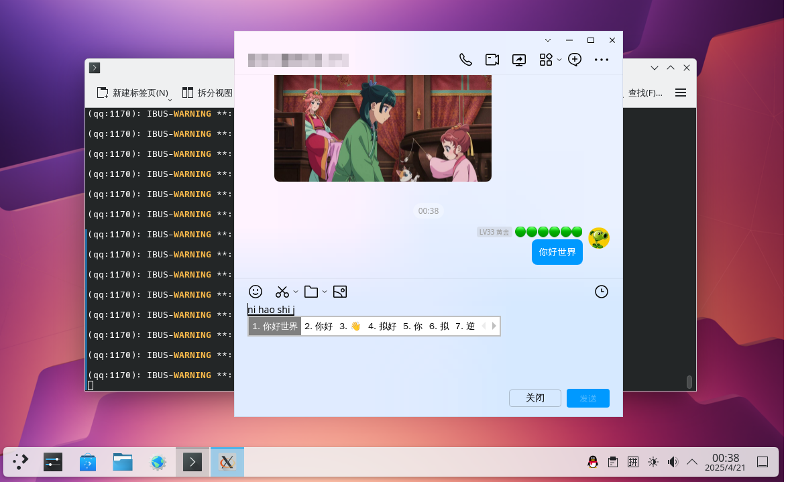
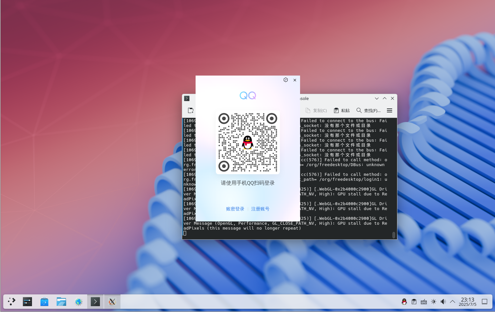
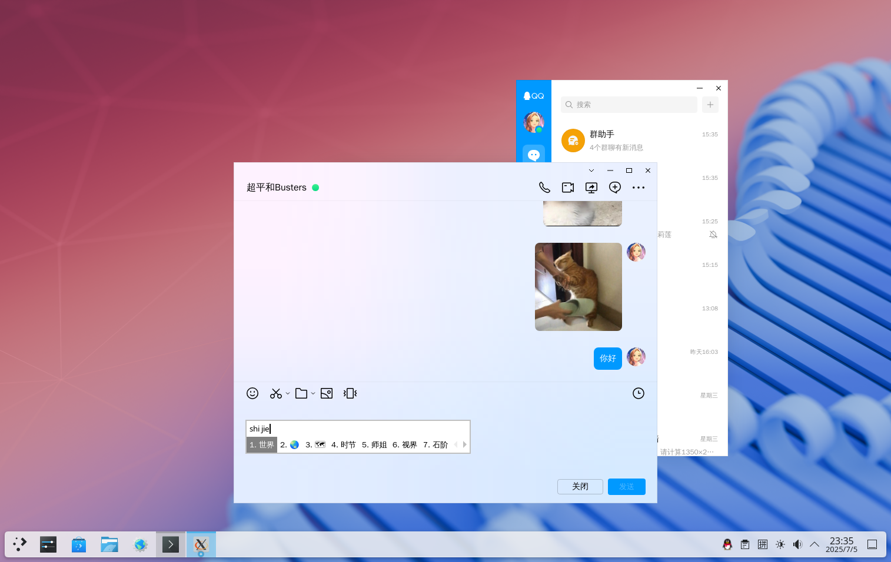

# 8.6 QQ（Linux 版本）


## 基于 Rocky Linux（FreeBSD Port）

>**注意**
>
>请先参照本书其他章节安装 Rocky Linux 兼容层（FreeBSD Port）。

### 安装 rpm 工具

- 使用 pkg 安装

```sh
# pkg install rpm4
```

- 或者使用 Ports 安装：

```sh
# cd /usr/ports/archivers/rpm4/ 
# make install clean
```

### 下载安装 QQ

- 下载 QQ，官方链接：[QQ Linux 版 - 轻松做自己](https://im.qq.com/linuxqq/index.shtml)

```sh
# fetch https://dldir1.qq.com/qqfile/qq/QQNT/Linux/QQ_3.2.17_250521_x86_64_01.rpm # 文章撰写时的链接，实际使用请获取最新版本
```

- 安装 QQ：

```sh
root@ykla:/ # cd /compat/linux/	# 切换到兼容层路径
root@ykla:/compat/linux # rpm2cpio < /home/ykla/QQ_3.2.17_250521_x86_64_01.rpm | cpio -id # 安装 QQ。读者请注意将 QQ 文件路径改为读者本地的路径
./usr/share/icons/hicolor/512x512/apps/qq.png: Cannot extract through symlink usr/share/icons/hicolor/512x512/apps/qq.png
1055863 blocks
```

### 解决依赖库

- 查看依赖：

```sh
# /compat/linux/usr/bin/bash # 切换到兼容层的 shell
bash-5.1# ldd /opt/QQ/qq # 查看 /opt/QQ/qq 可执行文件的动态库依赖
	linux-vdso.so.1 (0x00007fffffffe000)
	libffmpeg.so => /opt/QQ/libffmpeg.so (0x000000080c000000)
	.......此处省略部分输出......
```

可以看到 `ldd` 正常，无需解决依赖问题。

### 解决 fcitx 中文输入法在 QQ 中不能使用的问题

- 在兼容层中安装 `ibus-gtk3` 和 `ibus-libs`，下载安装包后执行：

```sh
# fetch https://dl.rockylinux.org/pub/rocky/9/AppStream/x86_64/os/Packages/i/ibus-gtk3-1.5.25-6.el9.x86_64.rpm   # 下载 ibus-gtk3 RPM 包
# fetch https://dl.rockylinux.org/pub/rocky/9/AppStream/x86_64/os/Packages/i/ibus-libs-1.5.25-6.el9.x86_64.rpm   # 下载 ibus-libs RPM 包
# cd /compat/linux   # 切换到 Linux 兼容目录
# rpm2cpio < /home/ykla/ibus-gtk3-1.5.25-6.el9.x86_64.rpm | cpio -id   # 解压 ibus-gtk3 RPM 包
# rpm2cpio < /home/ykla/ibus-libs-1.5.25-6.el9.x86_64.rpm | cpio -id   # 解压 ibus-libs RPM 包
```

- 接下来：

```sh
# /compat/linux/usr/bin/bash # 切换到 Rocky Linux 的 bash
bash-5.1# gtk-query-immodules-3.0-64 --update-cache   # 刷新缓存
```


### 启动 QQ

在 Linux 兼容环境中启动 QQ，禁用沙箱并启用进程内 GPU：

```sh
$ /compat/linux/opt/QQ/qq --no-sandbox  --in-process-gpu
```

>**注意**
>
>此处请务必以普通用户权限运行 QQ，否则可能无法使用输入法。

>**技巧**
>
>`--no-sandbox` 选项是关闭沙盒。否则无法运行 QQ。
>
>`--in-process-gpu` 选项也是必要的，否则退出 QQ 后可能无法重新打开，需要重启系统才能使用。


fcitx5 输入法正常：



## 基于 ArchLinux 兼容层

请参阅本书中“Linux 兼容层 - Arch Linux 兼容层”部分

```sh
# chroot /compat/arch/ /bin/bash # 进入 Arch 兼容层
# passwd # 为 Arch 的 root 设置一个密码
# passwd test # 为 Arch 的 test 用户设置密码，上述脚本已创建该用户。不设置密码可能无法正常使用 AUR

```

新开一个终端，输入 `reboot` 重启 FreeBSD，否则新设置的密码可能无法生效。

```sh
# chroot /compat/arch/ /bin/bash # 进入 Arch 兼容层
# su test # 此时位于 Arch 兼容层！切换到普通用户才能使用 AUR
$ yay -S linuxqq # 此时位于 Arch 兼容层！此时用户为 test
$ exit # 切换回 root
# # 此时位于 Arch 兼容层，用户已切换回 root
```

启动 QQ 客户端，禁用沙箱并启用进程内 GPU：

```sh
# /opt/QQ/qq --no-sandbox --in-process-gpu  # 此时位于 Arch 兼容层！
```

>**注意**
>
>此处必须以 root 权限运行 QQ，否则可能报错找不到 X11。




## 基于 Ubuntu 兼容层

请先构建 Ubuntu 兼容层环境。

```sh
# chroot /compat/ubuntu/ /bin/bash # 进入 Ubuntu 兼容层
# wget https://dldir1v6.qq.com/qqfile/qq/QQNT/Linux/QQ_3.2.18_250626_amd64_01.deb # 下载 QQ。此时位于 Ubuntu 兼容层。
# apt install ./QQ*.deb  # 在 Ubuntu 兼容层安装 QQ
```

安装依赖文件：

```sh
# apt install libgbm-dev libasound2-dev # 在 Ubuntu 兼容层安装依赖
# ldconfig # 此时位于 Ubuntu 兼容层。刷新动态链接库
```

启动 QQ：

```sh
# /bin/qq --no-sandbox --in-process-gpu # 此时位于 Ubuntu 兼容层
```

>**注意**
>
>此处必须以 root 用户运行 QQ，并确保按照 Ubuntu 兼容层构建教程设置中文字符集（使用脚本时，该过程会自动完成，无需手动操作）。



## 故障排除

### 网络错误

如果系统中有多张网卡，例如一块有线网卡和一块无线网卡，打开 QQ 后可能会出现网络错误提示，此时需要为空闲网卡随机分配一个 IP。

参见《Linux 兼容层故障排除与未竟事宜》

### 中文输入法

>**注意**
>
>不应在兼容层内部安装输入法，因为此操作不会生效。

若你自行构建兼容层，需要在启动 QQ 前，在兼容层内部，可能需要（如果你完全按照本书教程做，就不需要，因为本书中 Fcitx 指定了以下环境变量）设定以下中文环境变量：

```sh
# export LANG=zh_CN.UTF-8   # 设置系统语言为中文
# export LC_ALL=zh_CN.UTF-8 # 设置所有本地化环境变量为中文
```

设置完成后可以使用 `locale` 命令检查。对于兼容层的软件，Fcitx 输入法只有在上述两个变量设置为中文环境时才会生效。

如设置失败，请重启 FreeBSD 系统。

### QQ 闪退

在兼容层中执行以下操作：

```sh
$ rm ~/.config/QQ/crash_files/*                 # 删除 QQ 崩溃文件目录下的所有文件
$ chmod a-wx ~/.config/QQ/crash_files/          # 设置 QQ 崩溃文件目录为不可写不可执行，防止再生成更多崩溃日志造成闪退
```

#### 参考文献

- [Linux 下新 QQ Bug＆Fix 一记（闪退相关）](https://zhuanlan.zhihu.com/p/645895811)
