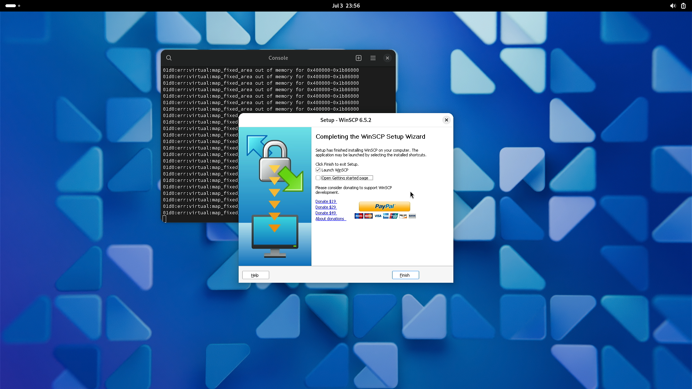
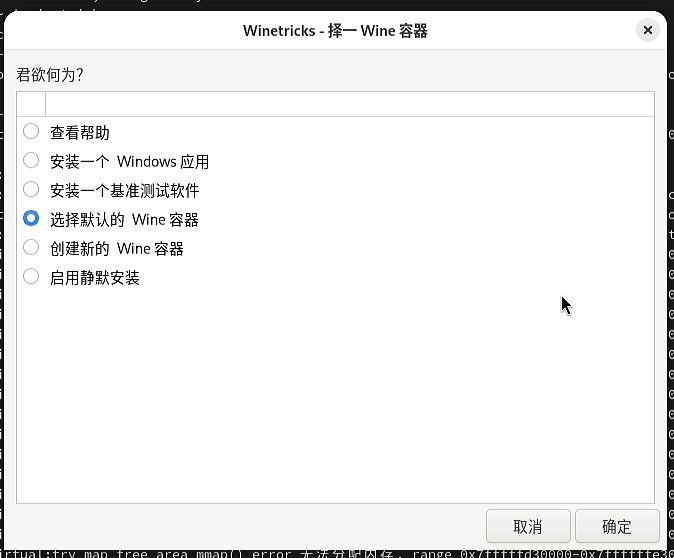

# 8.11 Wine 配置

Wine 是一款能够在 UNIX 及类 UNIX 系统上运行 Microsoft Windows 程序的兼容层软件，通过实现 Windows API 接口，使得在 FreeBSD 系统上运行 Windows 程序成为可能。

本节将介绍 Wine 的安装和配置方法。

本节内容仅在物理机环境中测试通过。由于 Wine 对图形硬件加速的依赖（需要 DRM 驱动支持），虚拟机环境下可能无法正常运行（通常会提示不支持 3D 加速）；虚拟机可能对某些特定 CPU 指令集的支持不完善，这也会导致程序启动失败。

## 安装 Wine

使用 pkg 包管理器安装 Wine 及相关组件：

```sh
# pkg install wine wine-gecko wine-mono
```

> **技巧**
>
> 无论使用 pkg 还是 Ports 安装 Wine，都只会安装 64 位版本。要支持 32 位 Windows 程序，还需要额外运行 `pkg32.sh` 脚本安装 32 位组件（见下文）。推荐使用 pkg 安装以节省编译时间。

> **注意**
>
> 建议安装 wine-gecko，否则首次运行 `winecfg` 时会弹出提示要求安装 Gecko 引擎。wine-gecko 为依赖 Internet Explorer 或 HTML 渲染的 Windows 程序提供支持。

切换到普通用户后，使用 pkg32 脚本安装 32 位 Wine 及 Mesa DRI 图形驱动支持：

```sh
$ /usr/local/share/wine/pkg32.sh install wine mesa-dri
```

### 软件包说明

| 程序 | 说明 |
| ---- | ---- |
| wine | Wine 主程序 |
| wine-gecko | Wine 项目基于 Firefox 的 Gecko 浏览器内核实现的 Internet Explorer 组件 |
| wine-mono | Mono 提供了对 .NET Framework 4.8 及更低版本的支持 |

> **注意**
>
> 如果不执行这一步，将无法支持 32 位 Windows 程序。其中，mesa-dri 提供了显卡硬件加速支持。

## 配置显卡硬件加速

请参考显卡相关章节配置硬件加速。

## 配置 Wine

以下操作均在普通用户权限下进行。

使用指定的 `WINEPREFIX` 目录启动 `winecfg` 配置工具：

```sh
$ WINEPREFIX=$HOME/test wine winecfg
```

> **技巧**
>
>`WINEPREFIX` 是一组目录集合，用于存放 Wine 的相关配置文件以及模拟的 Windows 系统文件。通过设置不同的 WINEPREFIX，可以实现多个配置环境的共存。


如果出现报错，或者命令执行后没有任何响应，则可以执行以下操作来删除默认的 Wine 配置目录，重置 Wine 环境：

```sh
$ rm -rf ~/.wine
```

然后执行以下命令启动 Wine 配置工具，使用默认的 `WINEPREFIX`：

```sh
$ wine winecfg
```

或者执行以下命令

```sh
$ rm -rf $HOME/test                          # 删除指定的 WINEPREFIX 目录，用于重置环境
$ WINEPREFIX=$HOME/test wine winecfg         # 使用新的 WINEPREFIX 目录启动 winecfg 配置工具
```

目录结构：

```sh
~/
├── .wine/ # 默认 Wine 配置目录
└── test/ # 自定义 Wine 配置目录（WINEPREFIX）
```

## 测试运行 WinSCP（32 位 Windows 程序）

> **技巧**
>
> 不需要为 32 位程序单独创建 WINEPREFIX。目前，32 位和 64 位程序可以共存在同一个 WINEPREFIX 中。

由于大多数用户需要运行 32 位 Windows 程序，下面检查示例程序是否满足这一需求：

```sh
$ file winscp.exe  # 查看 winscp.exe 的文件类型
winscp.exe: PE32 executable for MS Windows 6.01 (GUI), Intel i386, 11 sections
```

使用 Wine 安装运行可执行文件 `winscp.exe`：

```sh
$ wine /home/ykla/winscp.exe
```





> **技巧**
>
> 安装成功后，系统会生成对应的图标。经测试，双击该图标即可正常运行程序。

## Winetricks

Winetricks 是一个脚本（约两万行代码），封装了许多与 Wine 相关的实用功能，例如安装和卸载软件、安装字体等，可用于规避许多常见的 Wine 问题。

### 安装 Winetricks

使用 pkg 安装：

```sh
# pkg install winetricks
```

使用 Ports 安装：

```sh
# cd /usr/ports/emulators/winetricks/
# make install clean
```

### 使用 Winetricks 安装中文字体

> **注意**
>
> 下载字体时可能需要连接 GitHub，请确保网络连接正常。

启动 Winetricks 工具，用于安装和配置 Wine 依赖组件：

```sh
$ winetricks
```

> **技巧**
>
> 无需理会其在终端中输出的有关 64 位和 32 位 Wine 的警告信息：
>
>`warning: You are using a 64-bit WINEPREFIX. Note that many verbs only install 32-bit versions of packages. If you encounter problems, please retest in a clean 32-bit WINEPREFIX before reporting a bug.`




这里可以尝试安装列表中的最后两个中文字体。安装完成后，大多数程序即可正常显示中文。

## 故障排除与未竟事宜

### 为 Wine 界面设置中文

该问题尚待进一步验证和解决。

## 课后习题

1. 按照教程步骤安装 Wine 并配置环境，分别测试运行 32 位和 64 位 Windows 程序，对比两者的运行效果和资源占用。
2. 使用 Winetricks 安装中文字体和其他必要组件，测试多个 Windows 程序的中文显示效果。
3. 尝试使用 Wine 运行 Office。
