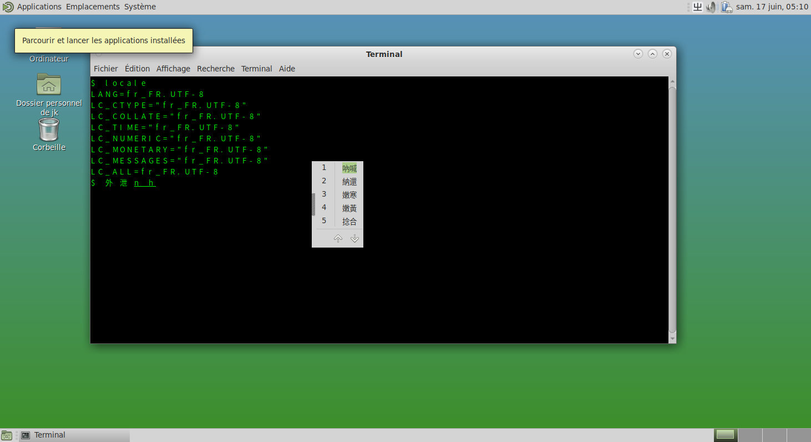

# 8.3 IBus 输入法框架

IBus 即“Intelligent Input Bus”（智能输入总线），是 Linux 及类 UNIX 系统中广泛应用的一种输入法框架体系。

## 安装 IBus 输入法框架

- 使用 pkg 安装：

```sh
# pkg install ibus zh-ibus-libpinyin
```

其中 `zh-ibus-libpinyin` 是智能拼音输入法。

- 或者使用 Ports 安装：

```sh
# cd /usr/ports/textproc/ibus/ && make install clean
# cd /usr/ports/chinese/ibus-libpinyin/ && make install clean
```

可选的输入法包括：

- `chinese/ibus-cangjie` 仓颉输入法
- `chinese/ibus-chewing` 新酷音输入法
- `chinese/ibus-rime` Rime 输入法引擎
- `chinese/ibus-table-chinese` 包含五笔、仓颉等多种输入法

## 配置环境变量

安装完成后，需要配置相应的环境变量以确保 IBus 能够在各种应用程序中正常工作。

- 显示管理器配置路径

1. SDDM、LightDM、GDM 都可以在 `~/.xprofile` 文件中写入 A 组配置
2. LightDM、GDM 可以在 `~/.profile` 文件中写入 A 组配置
3. SDDM 可以在用户登录 shell 的配置文件中写入配置

- Shell 配置路径

1. sh: 在 `~/.profile` 文件写入 A 组配置
2. bash: 在 `~/.bash_profile` 文件或 `~/.profile` 文件写入 A 组配置
3. zsh: 在 `~/.zprofile` 文件写入 A 组配置
4. csh: 在 `~/.cshrc` 文件写入 B 组配置

注销后重新登录，点击 IBus 图标添加所需输入法，即可使用，无需进行中文环境等额外配置。建议在相应的 shell 配置文件中加入以下内容以确保 IBus 正常运行：

- A 组（在 sh、bash、zsh 中）

```ini
export XIM=ibus                     # 设置 X 输入法为 IBus
export GTK_IM_MODULE=ibus           # 设置 GTK 应用使用 IBus 输入法
export QT_IM_MODULE=ibus            # 设置 Qt 应用使用 IBus 输入法
export XMODIFIERS=@im=ibus          # 设置 X 输入法修饰符为 IBus
export XIM_PROGRAM="ibus-daemon"    # 指定 XIM 程序为 ibus-daemon
export XIM_ARGS="--daemonize --xim" # 设置 XIM 启动参数为守护进程模式并启用 XIM
```

- B 组（在 csh 中）

```ini
setenv XIM ibus
setenv GTK_IM_MODULE ibus
setenv QT_IM_MODULE ibus
setenv XMODIFIERS @im=ibus
setenv XIM_PROGRAM ibus-daemon
setenv XIM_ARGS "--daemonize --xim"
```

## 配置 IBus

完成环境变量配置后，通过以下方式设置 IBus。

IBus 设置工具：

```sh
$ ibus-setup
```

## 编码

IBus 要求使用 UTF-8 编码，但对区域设置（如 `C.UTF-8` 或 `zh_CN.UTF-8`）没有限制。



## 课后习题

1. 为 IBus 适配更多主题。
2. 测试 IBus 在不同区域设置（C.UTF-8 与 zh_CN.UTF-8）下的运行情况，验证其对系统编码的要求。
3. 尝试修改 IBus 词库。
