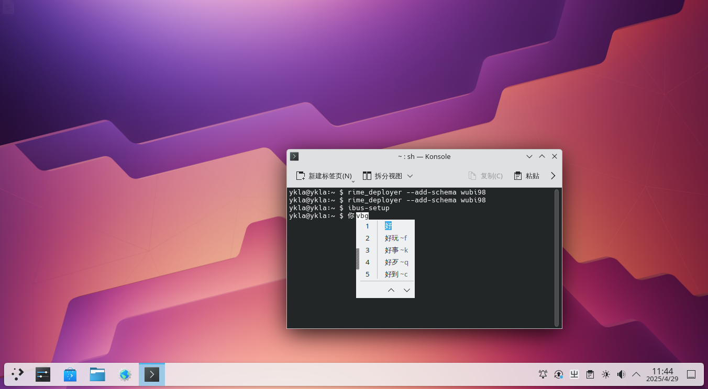
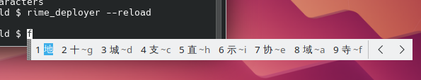

# 8.4 五笔输入法

五笔输入法是中文输入领域中一种常用的形码输入方法。本节将介绍如何在 IBus 和 Fcitx 5 两种主流框架下配置五笔输入法。

## IBus 输入法框架

需要先安装并配置 IBus，本节不做详细说明。

### 安装 Rime 输入法

在 IBus 框架下，通过安装 Rime 输入法来使用五笔输入法。

- 使用 pkg 安装：

```sh
# pkg install zh-ibus-rime
```

或者使用 Port 安装：

```sh
# cd /usr/ports/chinese/ibus-rime/
# make install clean
```

在终端运行初始化命令 `ibus-setup` 添加 `rime` 输入法：


### 配置 Rime 输入法

安装完成后，对 Rime 输入法进行配置以使用五笔输入法。

将 98 五笔码表（`free-bsd-98wubi-tables-master/wubi86.dict.yaml` 文件和 `free-bsd-98wubi-tables-master/wubi86.schema.yaml` 文件——注意：文件名虽为 `wubi86`，但实际内容为 98 五笔码表）复制到 `/usr/local/share/rime-data` 目录下。98 五笔码表下载地址：[FreeBSD-98wubi-tables](https://github.com/FreeBSD-Ask/98-input)。该仓库提供了适用于 FreeBSD 的 98 五笔输入法码表文件。

配置文件结构：

```sh
/usr/local/share/
└── rime-data/
    └── default.yaml # Rime 默认配置文件
```

修改 `/usr/local/share/rime-data/default.yaml` 文件：打开文件找到 `schema_list`，在其下第一行添加 `- schema: wubi98`（注意保持缩进），并删除其他输入方案，如下所示：

```yaml
# Rime default settings
# encoding: utf-8

config_version: '0.40'

schema_list:
  - schema: wubi98

……其余省略……
```

保存后退出。重新部署 Rime 输入法即可。




## Fcitx 5

除了 IBus 外，也可以在 Fcitx 5 输入法框架下使用五笔输入法。

### 安装 Fcitx 5

```sh
# pkg install fcitx5 fcitx5-qt5 fcitx5-qt6 fcitx5-gtk2 fcitx5-gtk3 fcitx5-gtk4 fcitx5-configtool-qt5 fcitx5-configtool-qt6 zh-fcitx5-chinese-addons
```

Fcitx 5 的具体配置步骤本节不做详细说明。

### Fcitx 5 配置 98 五笔

在 Fcitx 5 框架下配置 98 五笔输入法，需要进行以下步骤：

下载所需文件，地址为 <https://github.com/FreeBSD-Ask/98-input>。

- 将 `98五笔/98wbx.conf` 文件复制到 `/usr/local/share/fcitx5/inputmethod/` 下面；
- 将 `98五笔/fcitx-98wubi.png` 和 `org.fcitx.Fcitx5.fcitx-98wubi.png` 图标复制到 `/usr/local/share/icons/hicolor/48x48/apps/` 下面；
- 将 `98五笔/98/wbx.main.dict` 词库放到 `/usr/local/share/libime/` 下面。
- 重启 `fcitx5`，在设置中启用 98 五笔即可。

相关文件结构：

```sh
/usr/local/share/
├── fcitx5/
│   └── inputmethod/
│       └── 98wbx.conf # Fcitx5 98 五笔配置文件
├── icons/
│   └── hicolor/
│       └── 48x48/
│           └── apps/
│               ├── fcitx-98wubi.png # 98 五笔图标
│               └── org.fcitx.Fcitx5.fcitx-98wubi.png # 98 五笔图标
└── libime/
    └── wbx.main.dict # 98 五笔词库
```


#### 附录：王码 98 五笔生成 `.dict` 库方法

使用 libime 工具将 `98wbx.txt` 转换为 `98wbx.main.dict` 字典文件：

```sh
$ libime_tabledict 98wbx.txt 98wbx.main.dict
```

## 配置 Rime 使用 86 五笔

安装并配置好 Fcitx 5，配置步骤从略。

使用 pkg 安装：

```sh
# pkg install zh-fcitx5-rime zh-rime-essay zh-rime-wubi
```

或者使用 Ports 安装：

```sh
# cd /usr/ports/chinese/rime-wubi/ && make install clean
# cd /usr/ports/chinese/fcitx5-rime/ && make install clean
# cd /usr/ports/chinese/rime-essay/ && make install clean
```

加入 Rime 的方法同上，从略。

修改 `/usr/local/share/rime-data/default.yaml` 文件，如下：

```yaml
# Rime default settings
# encoding: utf-8

config_version: '0.40'

schema_list:
  - schema: wubi86

……其他省略……
```

## 配置文件

五笔输入法安装完成后，Rime 的配置文件位置如下：

- IBus 下 Rime 配置文件路径

```sh
$ cd ~/.config/ibus/rime
```

- Fcitx 5 下 Rime 配置文件路径

```sh
$ cd ~/.local/share/fcitx5/rime
```

相关文件结构：

```sh
~/
├── .config/
│   └── ibus/
│       └── rime/ # IBus 下 Rime 配置文件目录
│           └── build/
│               └── ibus_rime.yaml # IBus Rime 配置文件
└── .local/
    └── share/
        └── fcitx5/
            └── rime/ # Fcitx 5 下 Rime 配置文件目录
```

### 修改候选字为 9 行

先切换到上述配置文件目录，再进行下列操作。

#### 方法 ①

使用 `rime_patch` 工具为默认 Rime 输入法生成菜单：

```sh
$ rime_patch default menu
page_size: 9 # 输入后回车
^D # 按 ctrl+D
patch applied.
```

其中：

- `default` 对应 `default.custom.yaml` 文件
- `menu` 对应一级选项，`page_size` 对应二级选项

重启。

#### 方法 ②

使用 rime_patch 工具为默认 Rime 输入法生成带分页大小设置的菜单：

```sh
$ rime_patch default menu/page_size
9 # 输入后回车
^D # 按 ctrl+D
patch applied.
```

重启。

推荐使用方法二进行设置；方法一在较复杂的设置中需要对配置文件格式有一定了解。

### 默认英文输出

使用 `rime_patch` 工具重置 wubi86 输入法的第一个开关配置：

```sh
$ rime_patch wubi86 'switches/@1/reset'
1
^D
patch applied.
```

此处将 patch 应用于 wubi86 输入法（写入 `wubi86.custom.yaml` 文件），大部分选项与输入法相关，少部分选项为全局设置（写入 `default.custom.yaml` 文件）。

重启。

### IBus 横排输出

编辑 `~/.config/ibus/rime/build/ibus_rime.yaml` 文件，将当中的 `horizontal: false` 改为 `horizontal: true` 重新部署输入法或重启。



## 故障排除

上述操作涉及基本系统文件，建议仅修改用户配置，否则会影响全局设置，且在系统更新时容易遭覆盖。

## 参考文献

- catfishjones. 请问 ibus-rime 如何设置输入框横排显示[EB/OL]. [2026-03-25]. <https://github.com/rime/ibus-rime/issues/52>. 该 Issue 提供了 ibus-rime 横排显示的配置方案。
- LEOYoon-Tsaw. Rime_collections/Rime_description.md[EB/OL]. [2026-03-25]. <https://github.com/LEOYoon-Tsaw/Rime_collections/blob/master/Rime_description.md>. 该文档详细介绍了 Rime 输入法的配置格式与选项。
- rime 项目. CustomizationGuide[EB/OL]. [2026-03-25]. <https://github.com/rime/home/wiki/CustomizationGuide>. 该指南阐述了 Rime 输入法的定制方法与技巧。

## 课后习题

1. 下载 98 五笔码表并在 IBus 和 Fcitx5 两种框架下分别完成配置，对比两种框架下的配置流程、文件位置和最终使用效果。
2. 使用 rime_patch 工具修改 Rime 输入法的多个配置选项（如候选字数量、默认输出状态等），验证修改后的行为变化。
3. 尝试创建一个简单的自定义码表，使用 libime_tabledict 工具将其转换为 dict 格式，在 Fcitx5 中测试使用，分析输入法引擎的可扩展性设计。
