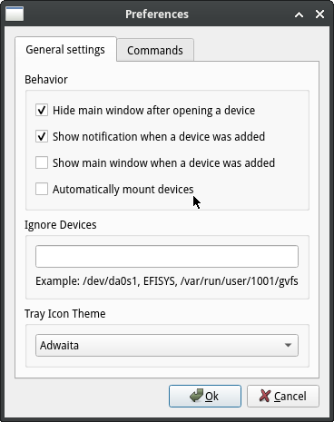
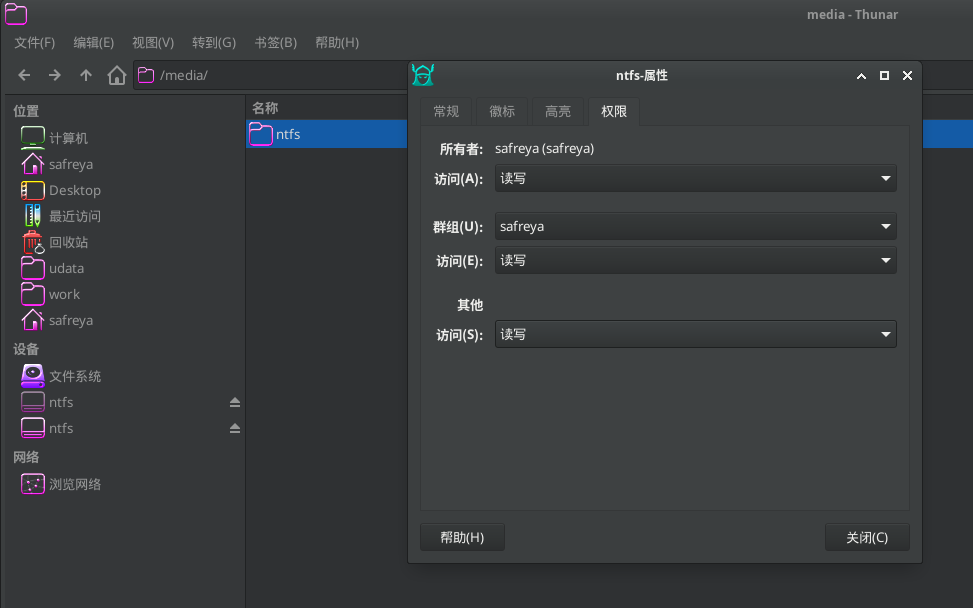

# 8.2 自动挂载文件系统

FreeBSD 提供了多种自动挂载方式供用户选择。

## automount 自动挂载

> **注意**
>
> `automount` 对普通用户的权限控制能力有限，主要以 root 身份执行挂载操作；若需要更精细的权限控制机制，建议使用 DSBMD。

automount 会自动监控设备插入事件并执行挂载操作，默认挂载点位于 `/media` 目录。基本系统已内置。

`/etc/auto_master` 文件控制着 automount 的行为，查看该文件：

```ini
#
# Automounter master map, see auto_master(5) for details.
#
/net		-hosts		-nobrowse,nosuid,intr
#/media		-media		-nosuid,noatime,autoro
#/-		-noauto
```

文件说明：

* **-hosts**
  查询远程 NFS 服务器并映射其导出的共享。

* **-media**
  查询尚未挂载但包含有效文件系统的设备。通常用于访问可移动媒体上的文件。

* **-noauto**
  按照在 `fstab(5)` 中配置为 `noauto` 的文件系统进行挂载。

* **-null**
  禁止 `automountd(8)` 挂载任何内容。

因此，为了自动挂载可移动媒体，需要将文件 `/etc/auto_master` 中 `/media` 行首的注释符号移除，如下：

```sh
/media		-media		-nosuid,noatime
```

然后，将以下内容添加到设备状态监测进程文件 **/etc/devd.conf** 中：

```ini
notify 100 {
	match "system" "GEOM";
	match "subsystem" "DEV";
	action "/usr/sbin/automount -c";
};
```

>**注意**
>
>不要添加到注释符号 `/* */` 中间。

通过将以下行添加到 **/etc/rc.conf** 文件中，可以设置 [autofs(5)](https://man.freebsd.org/cgi/man.cgi?query=autofs&sektion=5&format=html) 在启动时启动：

```ini
autofs_enable="YES"
```

每个可以自动挂载的文件系统都会作为 `/media/` 下的一个目录出现。该目录的名称是文件系统标签。如果标签缺失，目录名称将以设备节点命名。查看挂载文件：

```sh
# ls /media/da0p1/
SpaceSniffer.exe
```

文件系统会在首次访问时自动挂载，并在一段时间的非活动后自动卸载。也可以手动卸载自动挂载的设备：

```sh
# automount -fu
```

### 未竟事项

#### 中文乱码

在`/etc/auto_master` 中 `/media` 行末尾追加 `-L=zh_CN.UTF-8`。注意挂载 FAT32 文件系统时，实际调用的是 mount_msdosfs(8)，因此其他文件系统并不识别该参数，将导致其他设备无法挂载。

参考文献：

- FreeBSD Forums. Autofs. Share your experience[EB/OL]. (2017-06-09) [2026-04-30]. <https://forums.freebsd.org/threads/autofs-share-your-experience.61251/>.

## DSBMD 自动挂载

DSBMD（Desktop Scriptable Block Device Manager Daemon）是 FreeBSD 的介质和文件系统类型检测守护进程，采用客户端-服务器架构设计，允许客户端以受控方式挂载存储设备。其默认配置即可实现基本功能。

### 安装 DSBMD

DSBMD 系统包含守护进程和客户端两部分，可通过以下方式安装：

- 使用 pkg 包管理器安装：

```sh
# pkg install dsbmd       # DSBMD 守护进程
# pkg install dsbmc-cli   # DSBMC 命令行客户端
# pkg install dsbmc       # DSBMC Qt 图形界面客户端
```

- 或者使用 Ports 系统编译安装：

```sh
# cd /usr/ports/filesystems/dsbmd/ && make install clean        # 编译并安装 dsbmd 守护进程
# cd /usr/ports/filesystems/dsbmc-cli/ && make install clean   # 编译并安装 dsbmc 命令行客户端
# cd /usr/ports/filesystems/dsbmc/ && make install clean       # 编译并安装 dsbmc Qt 图形界面客户端
```

客户端可根据实际需求选择安装其中之一。在桌面环境下，推荐使用 `dsbmc` 图形界面客户端以获得更便捷的操作体验。

### 配置 DSBMD

> **技术要点**
>
> DSBMD 系统分为守护进程和客户端两个组成部分。客户端向 DSBMD 发起挂载、卸载或弹出介质的请求，也可设置 CD/DVD 的读取速率；守护进程负责接收并执行这些请求。守护进程作为系统特权进程拥有执行所有操作的权限，而客户端作为普通用户进程受限于系统权限设置。对于权限不足的用户，其挂载请求将由守护进程依据配置文件中的用户和组设定进行权限验证后决定是否允许执行。

守护进程配置文件路径为 `/usr/local/etc/dsbmd.conf`。

默认情况下，属于 `wheel` 和 `operator` 用户组的成员被允许挂载设备。若需授权其他用户挂载权限，可修改配置文件中的相关配置项。

启用守护进程需执行以下命令：

```sh
# service dsbmd enable   # 设置 dsbmd 守护进程开机自启
# service dsbmd start    # 启动 dsbmd 守护进程
```

#### Qt 客户端

`dsbmc` 客户端仅在运行时才会向守护进程发送请求，因此需在桌面环境中启动该客户端程序。

启动 `dsbmc` 后，可在系统托盘区域观察到其图标。


打开主窗口，依次点击 `preferences`→`general settings`，勾选 `automatically mount devices` 以启用自动挂载功能。




插入 U 盘等可移动介质后，系统桌面将显示挂载提示信息：


默认情况下，挂载点位于 `/media` 目录下，且挂载点的属主为发起挂载请求的客户端用户。



##### Xfce 自动启动配置

在 Xfce 桌面环境中，可以配置 `dsbmc` 自动启动。点击 `设置` → `会话和启动`，按如下方式配置：


#### 命令行客户端

启动 `dsbmc-cli` 命令行客户端：

```sh
$ dsbmc-cli
```

常用参数包括：

- `-e`：弹出设备
- `-m`：挂载设备
- `-u`：卸载设备

可在 shell 启动配置文件或桌面启动文件（例如 `~/.xinitrc` 文件、`~/.xprofile` 文件）中添加以下命令：

```ini
dsbmc-cli -a &
```

该配置将以后台方式启动 `dsbmc-cli` 并启用自动连接；`-a` 参数用于启用自动连接模式，使客户端持续监控设备事件并自动执行相应操作，此方式无图形界面提示。

### 守护进程配置详解

默认配置通常可满足基本使用需求；若需进行更细致的挂载控制，则需修改守护进程的配置文件，其路径为 `/usr/local/etc/dsbmd.conf`。

#### usermount 配置项说明

`usermount` 配置项控制是否允许以普通用户身份挂载设备：

```sh
# usermount - Controls whether DSBMD mounts devices as user. This requires the
# sysctl variable vfs.usermount is set to 1.
usermount = true
```

配置文件默认启用了 `usermount` 选项，但要使其生效，还需在系统内核参数中启用 `vfs.usermount`，可在 `/etc/sysctl.conf` 文件中添加以下内容：

```sh
vfs.usermount=1
```

该配置允许普通用户执行文件系统挂载操作。

- 启用 `usermount` 时，挂载程序将以普通用户身份执行；未启用 `usermount` 时，挂载程序以 `root` 特权用户身份执行。
- 无论是否启用 `usermount`，挂载点的属主均为发起请求的客户端用户。

#### 允许自动挂载的用户授权

默认情况下，允许 operator 和 wheel 用户组的成员连接：

```ini
# allow_users - Comma separated list of users who are allowed to connect.
# allow_users = jondoe, janedoe

# allow_groups - Comma separated list of groups whose members are allowed
# to connect.
allow_groups = operator, wheel
```

通过修改 `allow_users` 和 `allow_groups` 配置项，可以管理自动挂载功能的授权用户。

#### 修改挂载点及其下文件目录访问权限（以 NTFS 为例）

以挂载 NTFS 文件系统为例，可以修改文件访问权限为 `640`（rw-r-----），目录访问权限为 `750`（rwxr-x---）。

```ini
# …………以上配置内容省略…………

ntfs_mount_cmd = "/usr/local/bin/ntfs-3g -o \"uid=${DSBMD_UID},gid=${DSBMD_GID}\" ${DSBMD_DEVICE} \"${DSBMD_MNTPT}\""

# …………中间配置内容省略…………

ntfs_mount_cmd_usr = "/sbin/mount_fusefs auto \"${DSBMD_MNTPT}\" ntfs-3g ${DSBMD_DEVICE} \"${DSBMD_MNTPT}\""

# …………以下配置内容省略…………
```

NTFS 的挂载配置包含两种命令形式：启用 `usermount` 时使用 `ntfs_mount_cmd_usr`，否则使用 `ntfs_mount_cmd`。示例如下：

```ini
# …………以上配置内容省略…………

# 使用 ntfs-3g 挂载 NTFS 文件系统，设置挂载后文件权限掩码 fmask=137、目录权限掩码 dmask=027，并指定属主 UID 与 GID
ntfs_mount_cmd = "/usr/local/bin/ntfs-3g -o \"uid=${DSBMD_UID},gid=${DSBMD_GID},fmask=137,dmask=027\" ${DSBMD_DEVICE} \"${DSBMD_MNTPT}\""

# …………中间配置内容省略…………

# 使用 mount_fusefs 以普通用户方式挂载 NTFS 文件系统，设置文件和目录权限掩码 fmask=137、dmask=027
ntfs_mount_cmd_usr = "/sbin/mount_fusefs auto \"${DSBMD_MNTPT}\" ntfs-3g -o fmask=137,dmask=027 ${DSBMD_DEVICE} \"${DSBMD_MNTPT}\""

# …………以下配置内容省略…………
```

此处为 `ntfs-3g` 指定了挂载选项中的文件权限掩码 `fmask=137` 和目录权限掩码 `dmask=027`，用于控制挂载后文件和目录的权限设置。


## 文件结构

```sh
/
├── usr
│   ├── local
│   │   └── etc
│   │       └── dsbmd.conf              # DSBMD 守护进程配置文件
│   └── ports
│       └── filesystems
│           ├── automount               # automount Port 目录
│           ├── dsbmd                   # DSBMD 守护进程 Port 目录
│           ├── dsbmc-cli               # DSBMC 命令行客户端 Port 目录
│           └── dsbmc                   # DSBMC Qt 图形界面客户端 Port 目录
├── etc
│   └── sysctl.conf                       # 系统内核参数配置文件
├── media                                  # 默认挂载点目录
└── home
    └── ykla
        ├── .xinitrc                      # X 初始化配置文件
        └── .xprofile                     # X 会话配置文件
```

## 参考文献

- FreeBSD Project. autofs -- filesystem automounter[EB/OL]. [2026-04-14]. <https://man.freebsd.org/cgi/man.cgi?autofs(5)>. autofs 文件系统手册页，描述自动挂载机制。
- FreeBSD Project. auto_master -- auto_master database[EB/OL]. [2026-04-14]. <https://man.freebsd.org/cgi/man.cgi?auto_master(5)>. 自动挂载主配置文件格式手册页。
- FreeBSD Project. automountd -- daemon handling autofs mount requests[EB/OL]. [2026-04-14]. <https://man.freebsd.org/cgi/man.cgi?automountd(8)>. 自动挂载守护进程手册页。
- FreeBSD Project. mount -- mount file systems[EB/OL]. [2026-04-14]. <https://man.freebsd.org/cgi/man.cgi?mount(8)>. 文件系统挂载命令手册页。
- FreeBSD Project. fstab -- static information about the filesystems[EB/OL]. [2026-04-14]. <https://man.freebsd.org/cgi/man.cgi?fstab(5)>. 文件系统表配置文件格式手册页。
- FreeBSD Project. FreeBSD Handbook, Chapter 19: Storage[EB/OL]. [2026-04-14]. <https://docs.freebsd.org/en/books/handbook/disks/>. FreeBSD 手册中关于存储与文件系统的配置指南。

## 课后习题

1. 在 FreeBSD 系统上配置 DSBMD，创建一个非 wheel 和 operator 组的测试用户，修改 dsbmd.conf 文件授权该用户挂载设备，并验证其是否能正常挂载和卸载 USB 设备。

2. 修改 dsbmd.conf 文件中的 ntfs_mount_cmd 配置项，将挂载权限从默认值修改为更严格的设置，使其适用于大多数环境。

3. 对本节涉及的工具进行安全加固，使其适用于生产环境。
