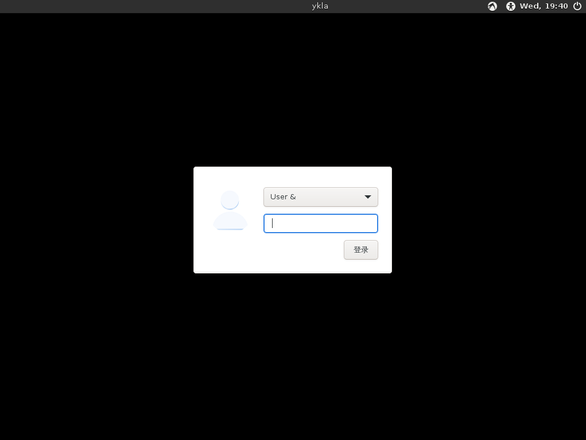
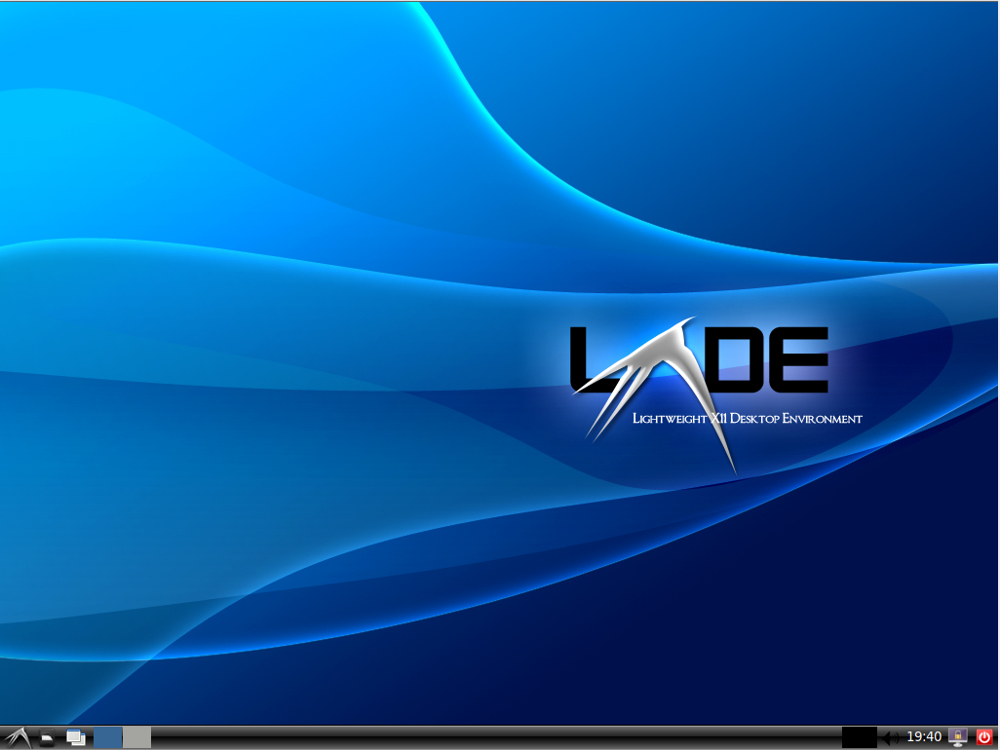
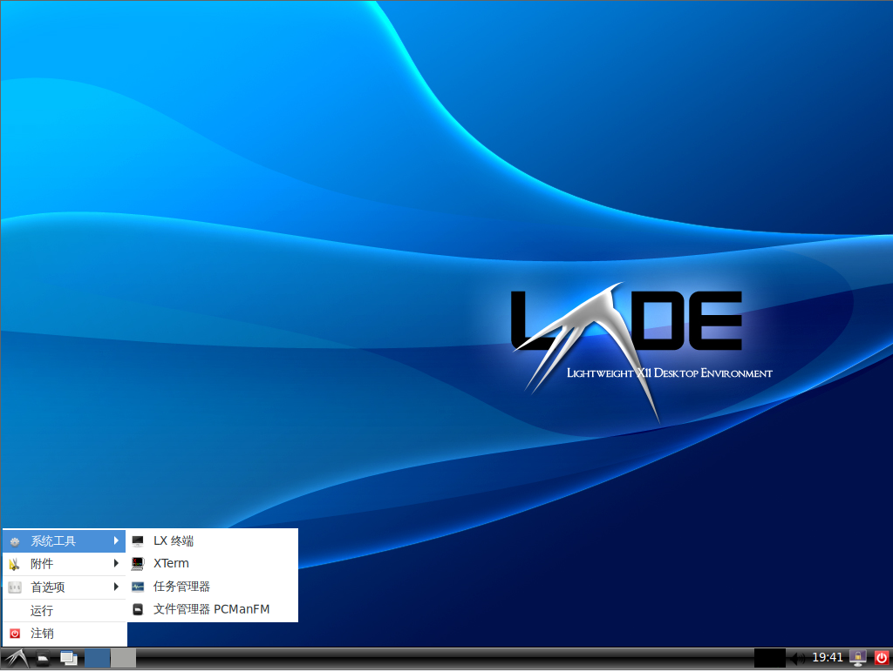

# 8.6 LXQt

LXQt 是一款基于 Qt 的轻量级桌面环境，由 LXDE-Qt 与 Razor-qt 两个项目合并而成（2013 年 7 月宣布合并，2014 年 5 月发布首个版本 0.7.0），专为注重简洁、速度和直观界面的用户设计。与大多数桌面环境不同，LXQt 在性能较弱的计算机上同样运行良好。

## 安装 LXQt 桌面环境

- 通过 pkg 安装：

```sh
# pkg install xorg sddm lxqt gvfs wqy-fonts xdg-user-dirs
```

- 或使用 Ports 安装：

```sh
# cd /usr/ports/x11/xorg/ && make install clean
# cd /usr/ports/x11-wm/lxqt/ && make install clean
# cd /usr/ports/x11-fonts/wqy/ && make install clean
# cd /usr/ports/x11/sddm/ && make install clean
# cd /usr/ports/filesystems/gvfs/ && make install clean
# cd /usr/ports/devel/xdg-user-dirs/ && make install clean
```

### 软件包说明

| 包名 | 功能说明 |
| ---- | -------- |
| `xorg` | X 窗口系统 |
| `sddm` | 显示管理器 |
| `lxqt` | LXQt 桌面环境 |
| `gvfs` | GNOME 虚拟文件系统，LXQt 需要此组件才能打开“计算机”和“网络”位置，否则会提示 `Operation not supported` |
| `wqy-fonts` | 文泉驿中文字体 |
| `xdg-user-dirs` | 管理用户目录，如“桌面”、“下载”等，并处理目录名称的本地化 |

## 服务管理

设置 D-Bus 服务开机自启：

```sh
# service dbus enable
```

设置 SDDM 显示管理器开机自启：

```sh
# service sddm enable
```

## 挂载 proc 文件系统

编辑 **/etc/fstab** 文件，加入下行：

```ini
proc	/proc	procfs	rw	0	0
```

将 `procfs` 文件系统以读写模式挂载到 **/proc**。

## 通过 startx 启动 LXQt

将启动命令写入 **~/.xinitrc** 文件，即可启动 LXQt 桌面环境：

```sh
$ echo "exec ck-launch-session startlxqt" > ~/.xinitrc
```

应以实际登录的账户身份执行上述命令。

## 设置中文环境

### 为 SDDM 显示管理器设置中文环境

```sh
# sysrc sddm_lang="zh_CN"
```


### 为 LXQt 桌面环境设置中文环境

进入 LXQt 后，点击菜单 → “Preferences” → “LXQt Settings” → “Locale” → “Region”，在下拉菜单中选择中文。


## 故障排除与未竟事宜

### 桌面图标不显示

需事先安装所需图标主题。随后：菜单 → “Preferences” → “LXQt Settings” → “Appearance” → “Icons Theme”，选择已安装的图标主题，点击“Apply”后重新登录。

## 附录：LXDE 桌面环境

> **注意**
>
> LXDE 已进入维护模式，开发基本停滞，主要开发者已转向 LXQt。LXDE 最后主要版本为 0.10 系列（约 2021 年发布），此后仅有极少量维护性更新，缺乏新功能开发。建议新用户优先选用 LXQt。

LXDE 是一款轻量级桌面环境，专注于资源利用效率与简洁的交互体验，在低配置硬件平台上表现优异。然而，随着 LXQt 的迁移，LXDE 获得的维护逐渐减少。

### 安装 LXDE 桌面环境

- 使用 pkg 安装：

```sh
# pkg install lxde-meta xorg lightdm lightdm-gtk-greeter wqy-fonts xdg-user-dirs
```

- 或使用 Ports 安装：

```sh
# cd /usr/ports/x11/lxde-meta/ && make install clean
# cd /usr/ports/x11/xorg/ && make install clean
# cd /usr/ports/x11/lightdm/ && make install clean
# cd /usr/ports/x11/lightdm-gtk-greeter/ && make install clean
# cd /usr/ports/x11-fonts/wqy/ && make install clean
# cd /usr/ports/devel/xdg-user-dirs/ && make install clean
```

#### 软件包说明

| 包名 | 作用说明 |
| ---- | -------- |
| `xorg` | X 窗口系统 |
| `lxde-meta` | LXDE 桌面环境的元包 |
| `lightdm` | 轻量级显示管理器 LightDM |
| `lightdm-gtk-greeter` | LightDM GTK+ 登录界面插件，LightDM 需要至少一个 greeter 才能正常工作 |
| `wqy-fonts` | 文泉驿中文字体 |
| `xdg-user-dirs` | 管理用户目录，如“桌面”、“下载”等 |

### startx

编辑 **~/.xinitrc** 文件，添加以下内容，以便通过 startx 命令启动 LXDE 桌面环境：

```sh
exec startlxde
```

### 启动项

设置 D-Bus 服务开机自启：

```sh
# service dbus enable
```

设置 LightDM 显示管理器开机自启：

```sh
# service lightdm enable
```

### 挂载 proc 文件系统

编辑 **/etc/fstab** 文件，加入下行：

```ini
proc           /proc       procfs  rw  0   0
```

### 中文配置

在 **/etc/rc.conf** 文件中加入：

```ini
lightdm_env="LC_MESSAGES=zh_CN.UTF-8"
```

设置 LightDM 环境变量，将系统消息语言指定为中文。

还需要编辑 **/etc/login.conf** 文件，找到 `default:\` 部分，将 `:lang=C.UTF-8` 修改为 `:lang=zh_CN.UTF-8`。最后根据 **/etc/login.conf** 文件重建能力数据库：

```sh
# cap_mkdb /etc/login.conf
```

### 桌面欣赏







### 参考文献

- FreeBSD Project. Install & Configure a Desktop Environment: LXDE[EB/OL]. [2026-03-25]. <https://wiki.freebsd.org/LXDE>. LXDE 桌面环境安装与配置指南。
