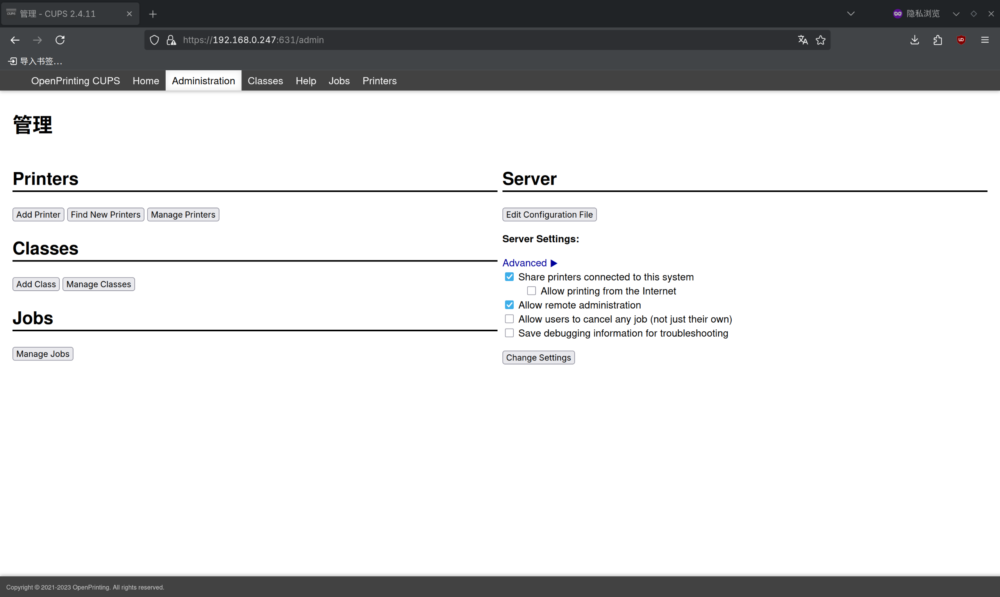
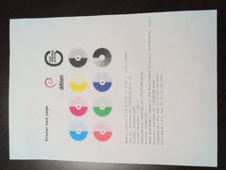

# 9.3 打印机

CUPS 全称为 Common Unix Printing System（通用 Unix 打印系统），支持多种打印协议和打印机设备，并可将打印机通过 IPP 或 SMB 协议共享到网络中。

打印机通过 USB 接入打印服务器（即 FreeBSD）。打印服务器将打印机共享到内网中，供内网内的设备使用。内网中的其他计算机可通过发送广播包，自动查询内网中可用的打印机。

本文在 Android、Apple、Debian 上测试通过，均可正常发现该打印服务器。


## 安装 CUPS（通用 Unix 打印系统）

- 使用 pkg 安装：

```sh
# pkg install cups cups-filters
```

- 或使用 Ports 安装：

```sh
# cd /usr/ports/print/cups/ && make install clean
# cd /usr/ports/print/cups-filters/ && make install clean
```

>**技巧**
>
>若使用桌面环境，请在 Ports 选项界面中选中 `x11`，可在系统中生成添加和配置打印机的应用图标。

软件包说明：

| 软件包         | 作用说明                                |
|:----------------|:------------------------------------------|
| `cups`         | 用于提供 CUPS 服务                        |
| `cups-filters` | 用于支持免驱动打印机（即 IPP Everywhere 协议） |
|`dbus`|Avahi 需要，作为 CUPS 依赖自动安装|
 |`avahi-app`    | Avahi 所需组件，作为 CUPS 的依赖自动安装。用于内网中的打印机自动发现|


>**技巧**
>
>本文将 FreeBSD 配置为打印服务器。若 FreeBSD 仅作为打印客户端，通过 USB 连接打印机进行打印，而不需要共享打印服务，则 avahi-app 和 dbus 并非必需。

>**注意**
>
>若打印机不支持免驱动打印，则需要安装对应的驱动。

## 添加服务

将 dbus、avahi-daemon 和 cupsd 服务设置为系统启动时自动启用，以确保打印服务及其自动发现功能在系统重启后仍可正常使用：

```sh
# service dbus enable           # 设置 D-Bus 服务开机自启动
# service avahi-daemon enable   # 设置 Avahi 守护进程开机自启动（用于网络服务发现）
# service cupsd enable          # 设置 CUPS 打印服务开机自启动
```

启动服务后，其他设备应能够自动发现内网中的共享打印机。尝试打印测试页，测试能否正常打印。

## 向局域网共享打印服务

若未设置“允许局域网访问”，则除 `localhost` 外的其他主机将无法使用该打印服务。

编辑 `/usr/local/etc/cups/cupsd.conf` 文件：

- 在现有的

```ini
Listen localhost:631
Listen /var/run/cups/cups.sock
```

后面添加（IP 为你 FreeBSD 的 IP 地址）：

```ini
Listen IP:631
```

作用：指定 CUPS 打印服务监听的 IP 地址和端口号（631 为默认 IPP 端口）。

- 再将

```ini
# Restrict access to the server...
<Location />
  Order allow,deny
</Location>

# Restrict access to the admin pages...
<Location /admin>
  AuthType Default
  Require user @SYSTEM
  Order allow,deny
</Location>
```

改为

```ini
# Restrict access to the server...
<Location />
  Allow from 192.168.0.0/24   # 允许访问的 IP 网段
  Order allow,deny
</Location>

# Restrict access to the admin pages...
<Location /admin>
  Allow from 192.168.0.0/24   # 允许访问的 IP 网段
  AuthType Default             # 使用默认认证类型
  Require user @SYSTEM         # 仅系统用户可访问
  Order allow,deny
</Location>
```

如此 CUPS 管理页面即可从局域网内远程访问。

## 添加打印机

在浏览器中输入 `http://IP:631`，该地址为打印服务器的管理页面。


点击 `Administration-Add Printer`，根据提示创建打印机。

过程中会提示输入账号和密码，使用 `root` 用户或 `wheel` 组内的用户登录（输入其在 FreeBSD 系统中的账户密码）即可。


点击 `Add Printer`，添加打印机。



本文中使用的打印机型号为 Brother HL L3228CDW。


在创建时，请务必勾选 `Share This Printer`。


选择型号。


如果打印机支持免驱动打印，`Model` 请选择 `Generic IPP Everywhere Printer (en)`；否则需要安装相应驱动，并选择对应的打印机型号。


成功添加打印机！


## KDE 桌面添加打印机

无需额外操作，需要打印的设备通常可自动发现打印服务器，并自动将其加入打印机列表，在打印文件时即可选择。例如在 KDE 桌面上：


## 打印测试页

从内网的 Debian 机器打印测试页：



## 故障排除与未竟事项

### 打印机免驱动支持问题

要确认打印机是否免驱动，可以在 <https://openprinting.github.io/printers/> 查询。以本文使用打印机为例：


惠普（HP）打印机可通过安装 Port `print/hplip` 获得支持。


### FreeBSD 打印的测试页示例

尚待测试。
