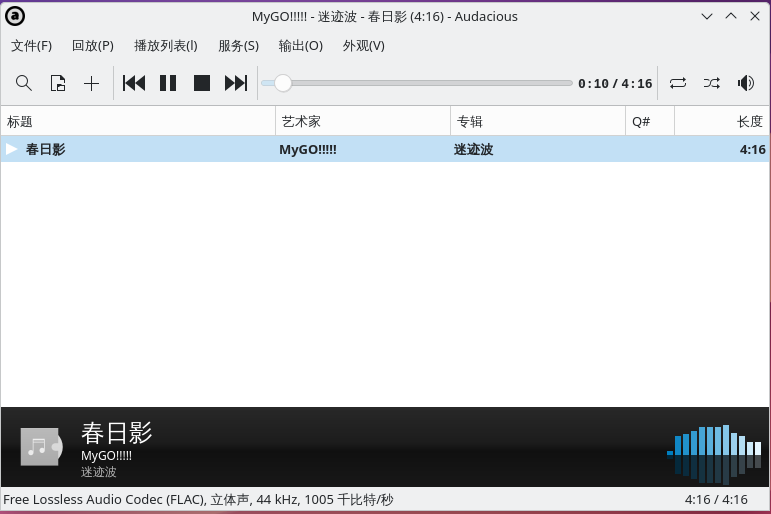
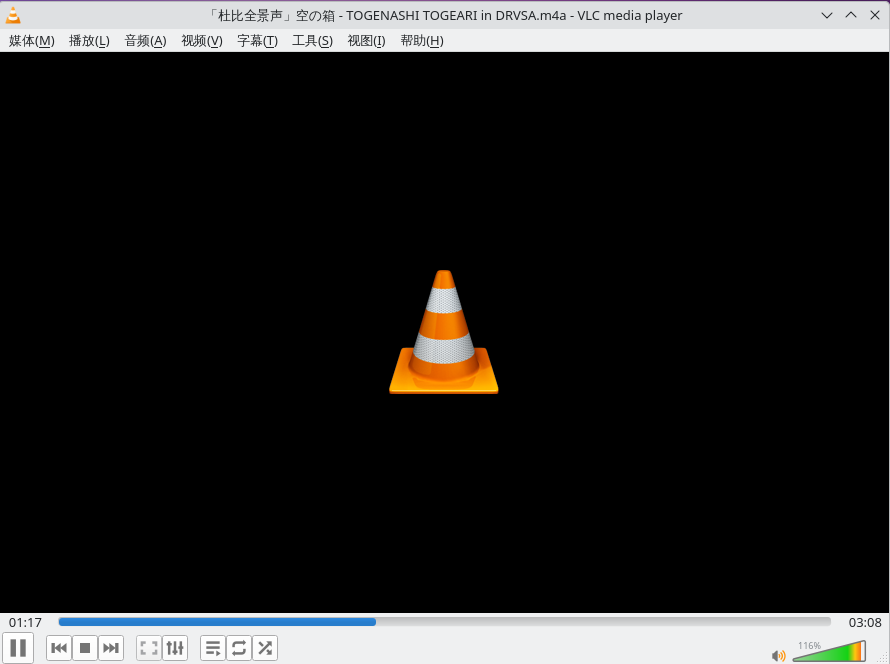

# 9.5 音频播放器

## Audacious

### 安装 Audacious

- 使用 pkg 安装：

```sh
# pkg install audacious audacious-plugins
```

>**注意**
>
>不安装 `audacious-plugins`，则无法打开 `audacious` 主程序。

- 或者使用 Ports 安装：

```sh
# cd /usr/ports/multimedia/audacious/ && make install clean
# cd /usr/ports/multimedia/audacious-plugins/ && make install clean
```

### 使用

测试 `.m4a`（杜比 AC-4 编码）、`.flac`、`.av3a`（AVS2/AVS3 编码）音乐：

>**技巧**
>
>Audacious 仅支持 `.flac`，不支持 `.m4a` 和 `.av3a`。



## VLC

安装等方法见其他章节。FreeBSD 中的 `ffmpeg` 默认构建未启用对 libuavs3d（提供 AVS2/AVS3 解码支持）的支持，本文不再展开相关配置方法。

经过测试，VLC 可以播放 AC-4（m4a）：



## 用 MPD 播放 DSD

Music Player Daemon（MPD）是一款灵活、强大且可扩展的音乐播放器系统，可运行于计算机上，并通过多种客户端进行控制。

MPD 的主要功能包括：支持多种音频格式、客户端—服务器架构、播放列表管理、流媒体支持以及跨平台运行等。

### 准备

需要准备支持 DSD 的声卡或 DAC，以及一段 DSD 音频文件。

以下内容基于 FreeBSD 14.0，外置 DAC 使用海贝 R3（声卡设置基本类似），并使用 OSS 驱动。

### 安装

```sh
# pkg install musicpd
```

或者

```sh
# cd /usr/ports/audio/musicpd/
# make install clean
```

### 硬件设置

查看系统声卡和音频设备状态：

```sh
# cat /dev/sndstat
pcm0: <Realtek ALC269 (Analog 2.0+HP/2.0)> (play/rec) default
pcm1: <Intel Cougar Point (HDMI/DP 8ch)> (play)
pcm2: <USB audio> (play)
No devices installed from userspace.
```

这里要使用的是 pcm2，对应设备文件 `/dev/dsp2`，下面会使用到。

可以使用 `sysctl -d dev.pcm.2` 查看相关硬件参数的含义，摘录关键的三项如下：

```sh
dev.pcm.2.bitperfect: bit-perfect playback/recording (0=disable, 1=enable)
dev.pcm.2.play.vchanrate: virtual channel mixing speed/rate
dev.pcm.2.play.vchanmode: vchan format/rate selection: 0=fixed, 1=passthrough, 2=adaptive
```

如下所示进行设置（可写入 `sysctl.conf` 以实现永久生效）：

```sh
# sysctl dev.pcm.2.bitperfect=1           # 设置声卡 2 为位完美模式
# sysctl dev.pcm.2.play.vchanrate=352800  # 设置声卡 2 播放采样率为 352800 Hz
# sysctl dev.pcm.2.play.vchanmode=1       # 设置声卡 2 播放通道模式
```

参数说明：

- 由于使用的是 OSS 驱动，Music Player Daemon 只能采用 DoP 传输模式，而 DoP 模式要求启用 bitperfect。
- 采样率（vchanrate）：DSD 的采样率为 44.1 kHz 的整数倍，因此不应设置为 48 kHz 的整数倍，否则可能产生杂音；在条件允许的情况下应设置为尽可能高的数值，此处为 352.8 kHz。

- `dev.pcm.2.play.vchanmode`
  - `0`（fixed）：在该模式下，音频设备使用固定的采样率和格式处理多路音频流。
  - `1`（passthrough）：在该模式下，音频设备尽可能保持输入音频流的原始采样率和格式。
  - `2`（adaptive）：在该模式下，音频设备会根据需要自动适配并转换输入音频流的采样率和格式。

>**技巧**
>
>可以用 `dmesg` 查看可用采样率。在播放非 DSD 文件时，采样率和音频文件采样率相同（或整数倍）为宜，这样可以避免重采样造成的音质损失。采样率并非越高越好，可以通过多次尝试找到最合适的设置。

查看内核消息中与 pcm2 声卡相关的日志：

```sh
# dmesg | grep -i pcm2

pcm2 on uaudio0

# dmesg | grep -i uaudio0

uaudio0 on uhub0
uaudio0: <HiBy R3, class 239/2, rev 2.00/ff.ff, addr 1> on usbus1
uaudio0: Play[0]: 384000 Hz, 2 ch, 32-bit S-LE PCM format, 2x4ms buffer. (selected)
uaudio0: Play[0]: 352800 Hz, 2 ch, 32-bit S-LE PCM format, 2x4ms buffer.
uaudio0: Play[0]: 192000 Hz, 2 ch, 32-bit S-LE PCM format, 2x4ms buffer.
uaudio0: Play[0]: 176400 Hz, 2 ch, 32-bit S-LE PCM format, 2x4ms buffer.
uaudio0: Play[0]: 96000 Hz, 2 ch, 32-bit S-LE PCM format, 2x4ms buffer.
uaudio0: Play[0]: 88200 Hz, 2 ch, 32-bit S-LE PCM format, 2x4ms buffer.
uaudio0: Play[0]: 48000 Hz, 2 ch, 32-bit S-LE PCM format, 2x4ms buffer.
uaudio0: Play[0]: 44100 Hz, 2 ch, 32-bit S-LE PCM format, 2x4ms buffer.
uaudio0: Play[0]: 32000 Hz, 2 ch, 32-bit S-LE PCM format, 2x4ms buffer.
uaudio0: No recording.
uaudio0: No MIDI sequencer.
pcm2 on uaudio0
uaudio0: No HID volume keys found.
```

### 基本设置

Music Player Daemon（musicpd）的配置文件为 `/usr/local/etc/musicpd.conf` 。

其中默认使用的部分目录结构如下：

```ini
/var--> mpd --
               |-> music
               |-> .mpd --> playlists
```

上述目录需要自行创建。

```sh
# mkdir -p /var/mpd/music            # 创建 MPD 音乐存放目录
# mkdir -p /var/mpd/.mpd/playlists  # 创建 MPD 播放列表目录
# chown -R mpd:mpd /var/mpd  # 用于将目录的所有者设置为 mpd 用户，避免出现权限问题
# chmod 777 /var/mpd/music  # 用于存放音乐文件，设置为 777 仅为方便增删文件，实际使用中可根据需要自行调整权限。
```


修改 `/usr/local/etc/musicpd.conf` 文件，在 `"Default OSS Device"` 一节后面增加一节：

```ini
audio_output {
        type            "oss"
        name            "OSS Device（dop mode）"
        device          "/dev/dsp2"     # 指定使用的设备，不需要将 dac 或声卡等设置为默认设备，dsp2 专用于播放音乐，默认设备做自己的事就行
        dop             "yes"           # 开启 dop 模式
}
```

>**技巧**
>
>可以指定多个输出设备，并在各类客户端中按需启用或禁用相应的输出设备。


开启 musicpd 服务

```sh
# sysrc musicpd_enable=YES   # 设置 MPD 服务开机自启动
# service musicpd start      # 启动 MPD 服务
```

### 客户端使用

可以使用 ncmpc（字符界面）、MaximumMPD（iPhone）等多种客户端，客户端选择较为丰富。

PC 端的 GUI 客户端建议使用 Cantata（`pkg install cantata`）。

命令行环境下建议安装 mpc（`pkg install musicpc`），适合用于绑定桌面环境的全局快捷键。
