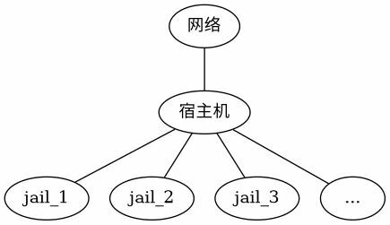
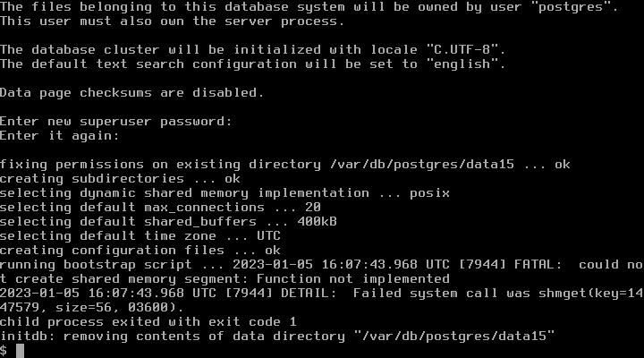
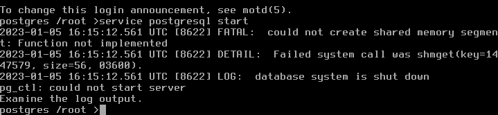

# 第 9.6 节 使用 qjail 管理 jail

qjail 是 jail 环境的部署工具，分支自 ezjail 3.1。jail 管理工具有 ezjail、 qjail、 iocage 等。ezjail 在 2015 年更新到 3.4.2 后一直没有更新，2018 年做过一次错误更新，不过好像也不是作者写的。ezjail 的 ports 更新依赖 portsnap，这个现在已经不建议使用了，将被废弃。iocage 可依赖于 zfs 文件系统，使用 ufs 文件系统的并不能使用。qjail 则在这些方面不存在问题。ezjail 并不支持 jail 的 vnet 功能，iocage 和 qjail 则支持。ezjail 和 qjail 使用 sh 编写，iocage 使用 python 编写。

下文中部署的 jail 在概念上结构如下图：



文中会用到 pf 防火墙，使用其它防火墙的可以自行尝试进行防火墙相关配置

## 预留 jail 的 ip

`/etc/rc.conf` 文件中写入

```shell-session
cloned_interfaces="lo1"  # 克隆出 lo1 ，尽量和宿主机网络配置分开。注意，如果要生成多个端口，也应该在同一行中描述，以空格隔开，而不是另外创建一行，如 cloned_interfaces="lo1 lo2" 。分成多行写，只会有一行生效。
ifconfig_lo1_alias0="inet 192.168.1.0-9" # 宿主机 ip 为 10.0.2.15, 选择该网段是为了和宿主机网段分开，可自行斟酌
```

运行

```shell-session
# service netif restart
```

lo1 将获得 10 个 ip 地址，下面将用 1-9 这 9 个 ip 给 jail 使用。

## 安装 qjail 工具

```shell-session
# pkg install qjail
```

启用 qjail

```shell-session
# sysrc qjail_enable=YES
```

## 部署 qjail 使用的目录结构

使用 qjail 前首先要部署 qjail 使用的目录结构，有两种方式：

### 从官方镜像站自动下载（可选）

```shell-session
# qjail install
```

此时 qjail 会从 FreeBSD 官网下载 base.txz 文件，示例输出如下：

```shell-session
root@freebsd:~ # qjail install
resolving server address: ftp.freebsd.org:80
requesting http://ftp.freebsd.org/pub/FreeBSD/releases/amd64/amd64/13.1-RELEASE/base.txz
remote size / mtime: 195363380 / 1652346155
...
```

### 从境内镜像站下载（可选）

因境内网络问题，也可以用镜像手动进行，以中国科学技术大学镜像为例（下载文件是注意版本号，qjail 要求文件版本与宿主机一致，这里是 FreeBSD amd64 13.1)

```shell-session
# fetch https:://mirrors.ustc.edu.cn/freebsd/release/amd64/13.1-RELEASE/base.txz
# qjail install base.txz
```

部署好 qjail 的目录结构后 `/usr/jails` 目录下会自动生成 `sharedfs` `template` `archive` `flavors` 四个目录：

- **sharedfs** 包含一份只读的操作系统可执行库文件，挂载为 nullfs ，在各 jail 之间共享，以节省存储空间的使用。

- **template** 包含操作系统的配置文件，将被复制到每个 jail 的基本文件系统中

- **archive** 保存 jail archive 命令产生的存档文件

- **flavors** 包含系统风格（ flavors ）和用户创建的自定义风格，其实就是自己定义的配置文件等

## 部署 jail

```shell-session
# qjail create -n lo1 -4 192.168.1.1 jail1
```

`-n` 指定使用 lo1 作为网络接口，`-4` 指定 ipv4 地址。

生成 jail1 后，`/usr/jails/` 目录下对应生成 `jail1` 目录( `/usr/jails/jail1/`),保存相应文件。

可以在上面提到的 `flavors` 目录中建立自己的配置文件以便在部署 jail 时复制到新的 jail 中。

如，新建 `/usr/jails/flavors/default/usr/local/etc/pkg/repos/FreeBSD.conf` ,那么之后再新建 jail 时，会自动把这个文件复制到对应的 jail 中，即

```shell-session
# qjail create -n lo1 -4 192.168.1.2 jail2
```

建立 jail2 后，自动建立 `/usr/jails/jail2/usr/local/etc/pkg/repos/FreeBSD.conf` ,既修改了之后所有 jail 的默认 pkg 镜像。但对应 jail1 并没有生成这个文件，因为生成 jail1 时，还没有在 flavors 目录中写入相应文件。

## qjail 基本使用

列出 qjail 管理的 jail

```shell-session
# qjail list
```

启用 jail

```shell-session
# qjail start # 启动所有 jail
# qjail start jail1 # 启动 jail1
```

停止 jail

```shell-session
# qjail stop # 停止所有 jail
# qjail stop jail1 # 停止 jail1
```

重启 jail

```shell-session
# qjail restart # 重启所有 jail
# qjail restart jail1 # 重启 jail1
```

进入 jail 控制台

```shell-session
# qjail console jail1  # 进入 jail1 控制台
```

进入 jail 控制台后，此时是 jail 中的 root 帐号（进入 jail 的控制台，不需要输入密码），因 jail 可能开启对外服务，为安全考虑建议设置帐号密码

备份 jail

```shell-session
# qjail archive -A  # 备份所有 jail
# qjail archive jail1  # 备份 jail1
```

从备份中恢复 jail

```shell-session
# qjail restore jail1  # 从备份中恢复 jail1
```

删除 jail

```shell-session
# qjail delete jail1  # 删除 jail1
# qjail delete -A     # 删除所有 jail
```

## 更新 jail

下面更新 jail 的部分不针对单个 jail ，而是针对每个 jail ，因为这些文件利用 nullfs 共享一份。

### 更新 jail 中的基本系统

既上面提到的 sharedfs 中的文件

```shell-session
# qjail update -b
```

### 更新 ports

这里有`-p`（小写） 、 `-P`（大写）两个选项，`-p`（小写）使用 portsnap 更新 jail 的 ports tree，`-P`（大写）使用宿主机的 ports tree 更新 jail 的 ports。如果主机已有 ports，则建议使用 `-P`（大写），避免两次下载 ports。

```shell-session
# qjail update -P  # 这里注意大写
```

### 更新系统源代码

```shell-session
# qjail update -S # 大写
```

### 更新过程（推荐）

```shell-session
# pkg install gitup
```

开始更新：

```shell-session
# freebsd-update fetch install
# gitup src
# gitup ports
# qjail stop
# qjail update -b
# qjail update -S
# qjail update -P
# qjail start
```

## jail 设置

qjail 可以用 `qjail config` 命令对每个 jail 另作设置，运行 `qjail config` 前须选停用指定的 jail。

`qjail config` 命令选项较多，这里列出几个常用的，更多的请参考手册页

[qjail --	Utility	for deployment of jail environments](https://www.freebsd.org/cgi/man.cgi?query=qjail&manpath=FreeBSD+13.1-RELEASE+and+Ports)

### 1 `-h`

```shell-session
# qjail config -h jail1
```

快速开启 jail1 的 ssh 服务,新建一个 wheel 组用户，用户名和密码同 jail 名，首次用这个用户登录要求修改密码。也可以在登录 jail 控制台后，自行配置 sshd 服务。

### 2 `-m` `-M`

```shell-session
# qjail config -m jail1
```

设置 jail1 需手动启动（manual 状态），`qjail_enable="YES"` 写入 `/etc/rc.conf` 后在系统启动时会自动启动各个 jail ，设为手动启动后则不会在系统启动时自动启动相应的 jail ，须用 `qjail start jailname` 启动。

对应小写的 `-m` 选项，有大写的 `-M` 选项，作用为关闭手动启动状态，即清除 manual 状态，可以在系统启动时自动启用 jail。qjail 中有大量类似的选项，小写字母的选项启用某个功能，大写字母的选项关闭对应功能。如果下文中同时出现小写和大写的选项就不在过多作出说明。

### 3 `-r` `-R`

```shell-session
# qjail config -r jail1
```

将 jail1 设为不允许启动（norun 状态），相当于禁用该 jail。

### 4 `-y` `-Y`

```shell-session
# qjail config -y jail1
```

启用该 jail 的 SysV IPC,在 jail 中安装 postgresql 时，需要打开这个选项，postgresql 运行基于这个功能。

## 网络设定

这里作个提示，有的教程里会教你用 `qjail config -k jailname` 打开 raw_sockets 功能来打开外网访问的能力，其实这里是个误解，raw_sockets 只是像 ping 一类的工具需要使用而已，并不是说网络访问一定要打开 raw_sockets 。而且在 jail 中打开 raw_sockets 本身有安全风险，这是 jail 环境默认的一种安全设计。所以除非是你一定要在 jail 中用 ping 一类的工具，不管是用什么方式构建的 jail 都是不建议打开 raw_sockets 功能的。

此时的 jail 还不能连接网络，因为 jail 绑定在 lo1 网络接口上，lo1 并不能直接访问外网，接下来通过 pf 设定网络, 其中 `em0` 为外网接口

在 `/etc/pf.conf` 中写入

```shell-session
nat pass on em0 inet from lo1 to any -> em0  # 使 jail 可以访问网络，从 lo1 接口发出的连接通过 nat 转发到 em0
rdr pass on em0 inet proto tcp from any to em0 port 22 -> 192.168.1.1 port 22  # 使宿方机外可以访问指定 jail，端口重定向，把连接到 em0 上22端口上的 tcp 连接重定向到 192.168.1.1 地址（即 jail1 ）的22端口上
```

```shell-session
# sysrc pf_enable=YES
# service pf start
```

此时，绑定在 lo1 上的 jail 可以访问宿主机外网络，宿主机外网络可以通过宿主机 22 号端口连接 jail1 的 22 号端口。

## 示例：部署 postgresql 的 jail

假设已经如上文所述预留 jail ip，并成功运行 `qjail install` 命令

这里以 postgresql 15 为例，其它版本也适用

宿主机中操作

```shell-session
# qjail create -n lo1 -4 192.168.1.3 postgres
# qjail config -y postgres   #  开启 SysV IPC
# qjail start postgres
```

编辑 `/etc/pf.conf`

```shell-session
nat pass on em0 inet from lo1 to any ->em0  # 上文已作说明
rdr pass on em0 inet proto tcp from any to em0 port 5432 -> 192.168.1.3 port 5432 # 不建议写下此句，作用为使宿方机外可以访问 jail 中的 postgresql，此处应考虑安全和实际需要开启端口转发，不建议直接向外提供 postgresql 连接
```

启用 pf

```shell-session
# service pf start
```

进入名为 postgres 的 jail 的控制台

```shell-session
# qjail console postgres
```

jail 控制台中的操作

下面命令皆在 jail 控制台下运行，pkg 安装是否使用镜像可自行决定，如果使用镜像可以在 jail 控制台中如同宿主机般进行设置，请参考相关文章。

```shell-session
# pkg install postgresql15-server
# sysrc postgresql_enable=YES
# mkdir -p -m 0700 /var/db/postgres/data15     # 注意版本号
# chown postgres:postgres /var/db/postgres/data15  # 这个目录应属于 postgres 用户
# su postgres   # 这里切换到 postgres 用户，注意下面提示符的变化
$ initdb -A scram-sha-256 -E UTF8 -W -D /var/db/postgres/data15
$ exit   #  回到 jail root 用户，注意提示符变化
# service postgresql start
```

这里使用 initdb 而不是使用安装时提示的 `/usr/local/etc/rc.d/postgresql initdb` 是为了避免之后设置数据库密码时，来回修改 `pg_hba.conf` 文件，现对选项作简要说明:

- **`-A`** 为本地用户指定在 pg_hba.conf 中使用的默认认证方法

- **`-E`** 选择模板数据库的编码。

- **`-W`** 让 initdb 提示要求为数据库超级用户给予一个口令

- **`-D`** 指定数据库集簇应该存放的目录

至此 postgresql 服务已经可以运行

如果在上面的过程中忘记使用 `qjail config -y postgres` 命令开启 SysV IPC，那么可能会出现下面的错误：

初始化数据库集簇时的错误



启动 postgresql 时的错误



此时在宿主机控制台下执行 `qjail config -y postgres` 即可修正错误，具体如下：

```shell-session
# qjail stop postgres
# qjail config -y postgres
# qjail start postgres
```

再次进入 jail 的控制台就可以正常初始化数据库集簇和运行 postgresql 服务了。
