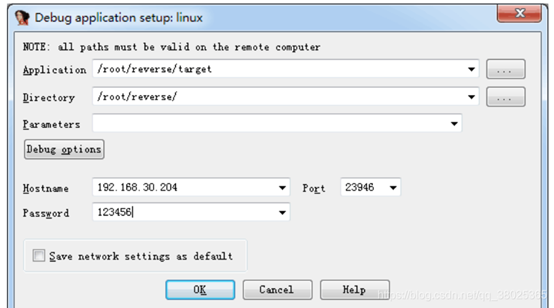
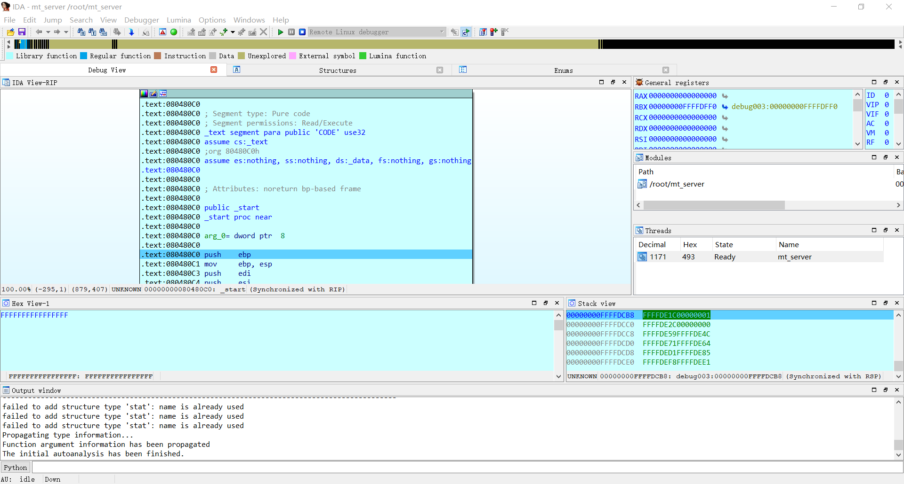

# 第十节 通过 IDA 7 调试 FreeBSD

**注意：Windows 、IDA 、FreeBSD、FreeBSD 兼容层 均需要 64 位，否则可能无法正常使用。**

首先在 Windwos  系统里 IDA 的安装路径里找到 dbgsrv 文件夹里的 linux\_server64 文件。

复制到 **FreeBSD** 里，可以用 Winscp

那就复制 linux\_server64 和你需要远程调试的文件 target（假设）到  /root/reverse 文件夹里（文件夹任意），给权限 777，并且运行 linux\_server64。

并且运行，参考红色方框。

请用 64位的 IDA， 按照如下截图操作。

第一个是要调试的文件在虚拟机里的位置。

第二个是要调试的文件在虚拟机里的路径

这里 target 就是具体要调试的文件。

第三个是要传递给 main 函数的参数，一般不写。

然后是 FreeBSD 系统的主机 ip 地址，监听的端口号和密码（即 SSH 密码，这里是 root 用户的，因为 linux\_server64 文件运行在 root 用户下）

在 FreeBSD 系统终端 ifconfig- a 可以查看到自己的 ip 地址

成功结果如下：

