# 第〇节 图解安装

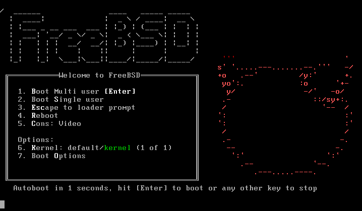

推荐等待十秒即可进入，也可以直接回车进入。

|      选项      |      解释     |
| :----------: | :---------: |
| ACPI Support |   ACPI 支持   |
|   Safe Mode  |     安全模式    |
|  Single User |    单用户模式    |
|    Verbose   | 啰嗦模式，显示更多输出 |

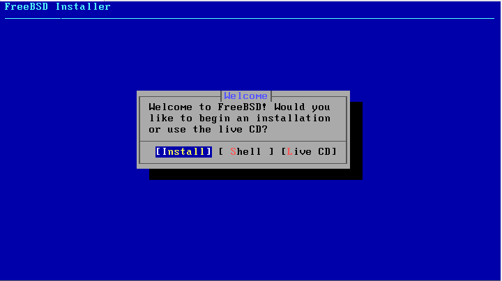

选择 `install`,按下 回车键 进行安装。

这里是设置键盘，直接回车即可。

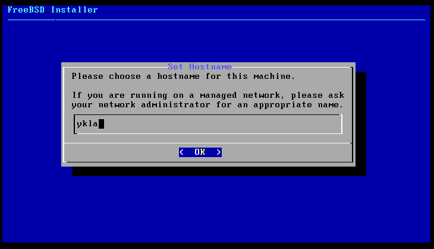

此处是设置主机名。

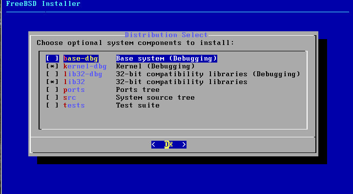

推荐：只选 `src` 以及 `lib32` 。即使选了 `ports` 也不会安装的，还是空的。

|     选项     |                      解释                     |
| :--------: | :-----------------------------------------: |
|  base-dbg  |           激活调试符号的基础工具，如 cat、ls 等           |
| kernel-dbg |                激活内核和模块的调试符号                |
|  lib32-dbg | 用于在激活调试符号的 64 位版本的 FreeBSD 上运行 32 位应用程序的兼容库 |
|    lib32   |     用于在 64 位版本的 FreeBSD 上运行 32 位应用程序的兼容库    |
|    ports   |                    ports                    |
|     src    |                    系统源代码                    |
|    tests   |                     测试工具                    |

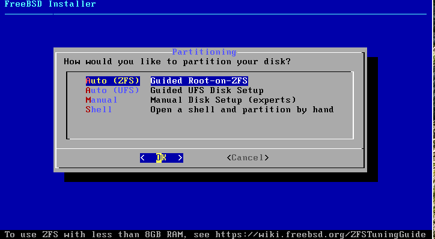

推荐：文件分区详解在第 6 章。这里推荐选择 auto ZFS/UFS，一般来说内存小于 8GB 的应该选择 UFS，内存 8G 及以上的应该选用 ZFS。允许手动分区解压 txz 文件以自定义。

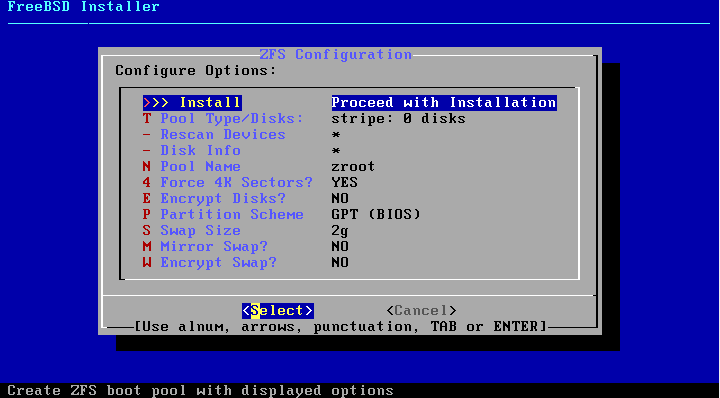

现代计算机应该选择 UEFI+GPT。较老的计算机应该选择保持与图片一致的选项（GPT(BIOS)）。

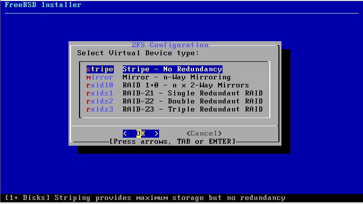

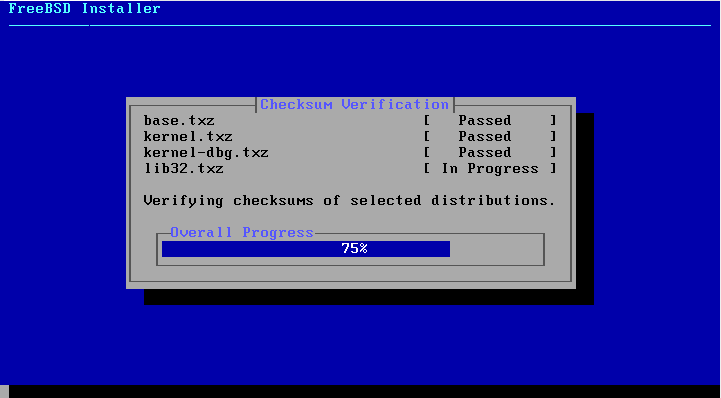

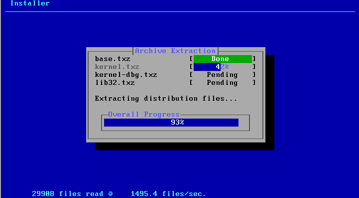

此处输入 root 密码，密码不会显示在屏幕上，且要求重复输入两次以确认一致性。密码强度默认无要求。

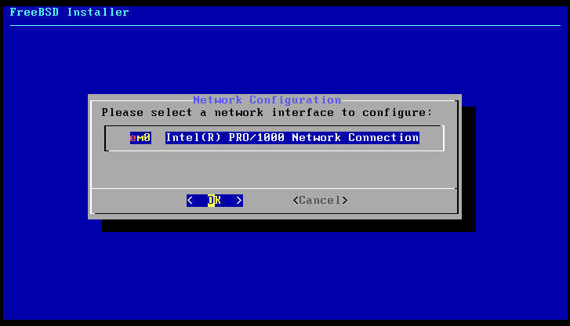

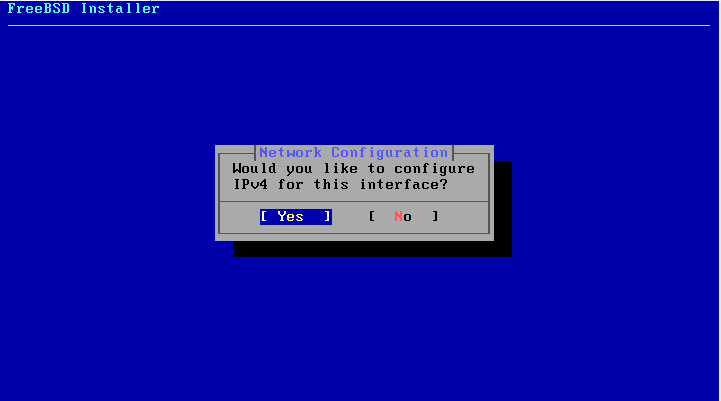

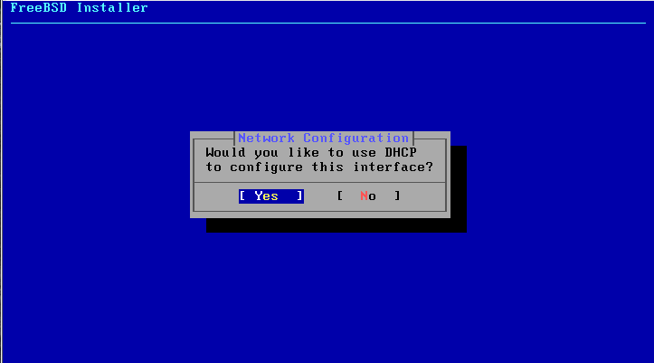

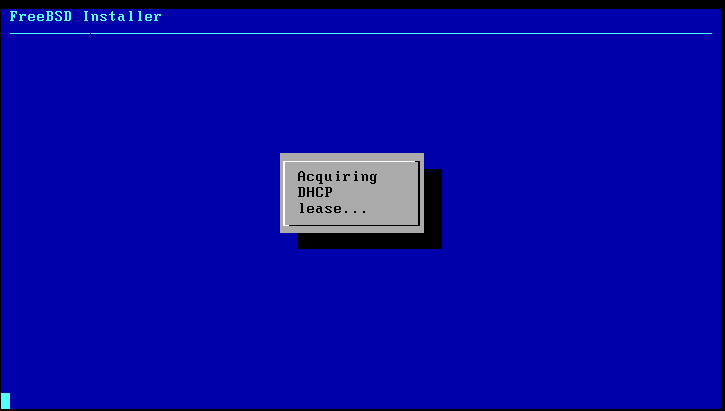

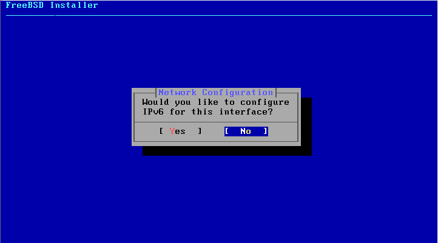

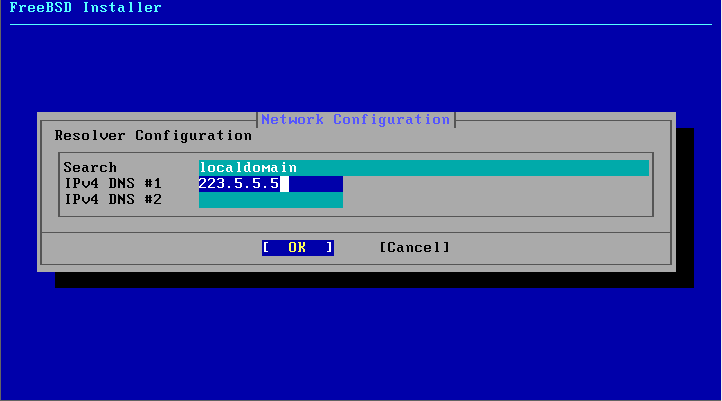

保持 DHCP 获取的 DNS 即可，也可以使用其他 DNS。

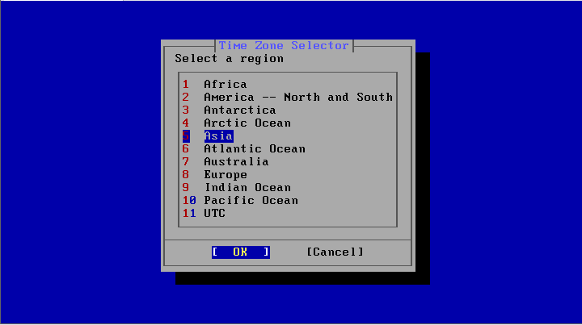

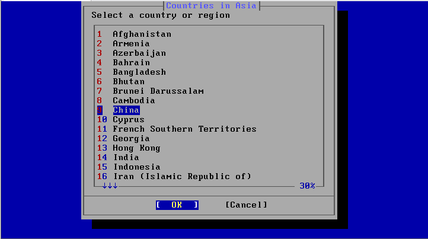

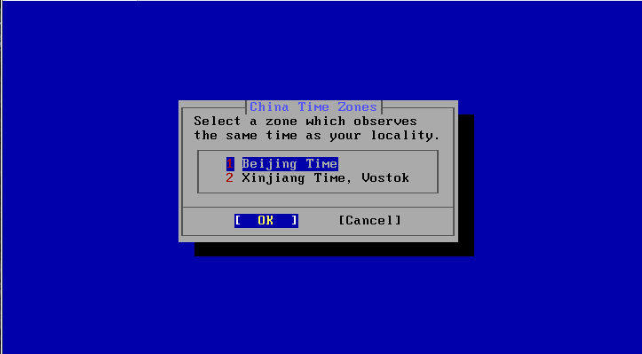

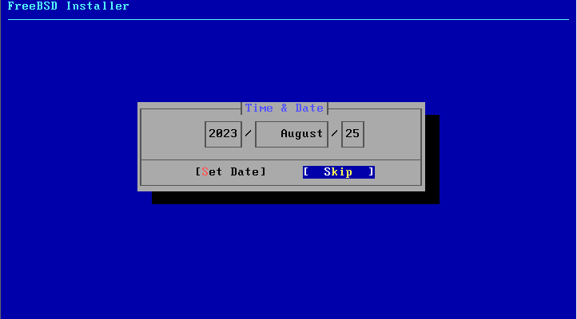

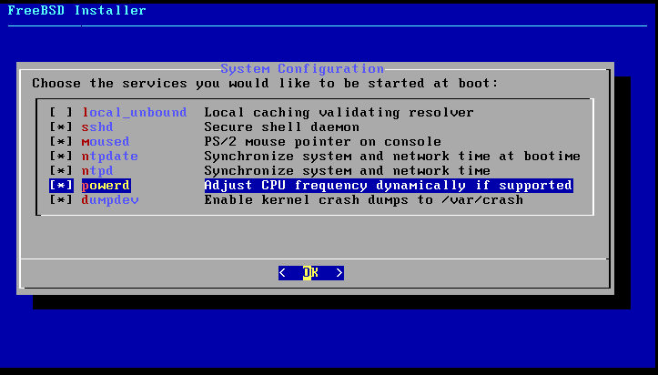

不建议选`local_unbound`，会影响 DNS，见 [https://bugs.freebsd.org/bugzilla/show\_bug.cgi?id=262290](https://bugs.freebsd.org/bugzilla/show\_bug.cgi?id=262290) 。

虚拟机不需要选 `powerd`。

|       选项       |                        解释                       |
| :------------: | :---------------------------------------------: |
| local\_unbound | 启用 DNS 本地非绑定。这是基本系统预置的 unbound，仅用于本地缓存转发解析器使用。注意：如果开启，你的系统将不会正确联网，需要手动配置 DNS。如果你不知道这是什么不建议开启 |
|      sshd      |                    开启 ssh 服务                    |
|     moused     |                   在 tty 界面显示鼠标                  |
|     ntpdate    |                 启用启动时的自动时钟同步功能                 |
|      ntpd      |            用于自动时钟同步的网络时间协议（NTP）守护程序          |
|     powerd     |                       电源管理                      |
|     dumpdev    |                  启用崩溃转储，用于调试系统                  |

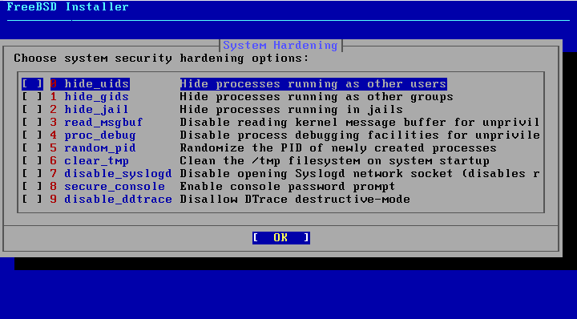

推荐选择：这里是安全增强选择，应该选择 `disable_sendmail`，如果不禁止这个服务会使你在每次开机的时候卡上几分钟，而且这个服务本身没什么用，发邮件用的。

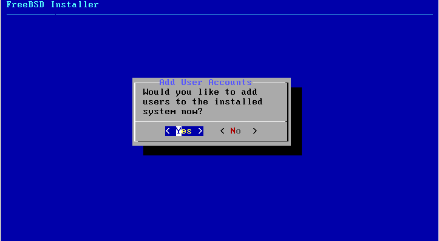

这个菜单选项是用来创建普通用户的。root 敢死队可以无视之。需要注意的是，最好将该用户其加入 wheel 组，其他参数可以保持默认设置不变。在 FreeBSD 14 及以后，所有用户的 shell 都被统一为了 sh。

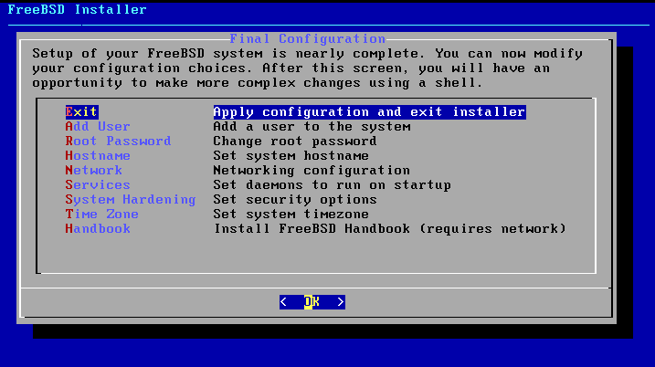

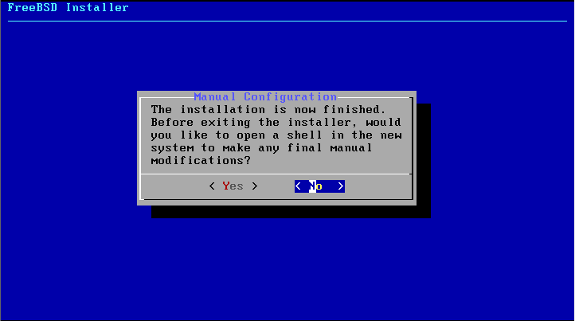

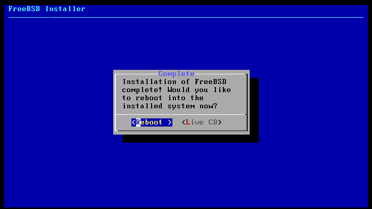
