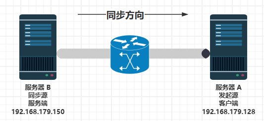

# 第十一节 rsync 同步服务




### （一）：背景环境介绍

服务器A、服务器B 均为 `FreeBSD-12.2-RELEASE-amd64-dvd1`

服务器A（发起端）：`192.168.100.10/24`

服务器B（同步源）：`192.168.100.20/24`

**需求：**实现服务器B的数据同步到服务器A上

### （二）服务器B（同步源）配置

#### 1：安装rsync软件包

```
# pkg install -y rsync
```

#### 2：查询已安装rsync软件包的信息

```
# pkg info | grep rsync 
rsync-3.2.3            
```

#### 3：新建需要备份的文件夹`test`，并且设置其属主为root，以及在其内部新建测试文件

```
# mkdir test
# chown root /home/test/
# touch txt001 /home/test/
```

#### 4：编辑`rsyncd.conf`文件

```
# ee /usr/local/etc/rsync/rsyncd.conf

uid = root  //服务端操作系统的用户
gid = wheel  //服务端操作系统的用户的组
use chroot = yes  //禁锢在源目录
address = 192.168.100.20  //监听地址
port 873   //用于通信的TCP端口，缺省是873
log file = /var/log/rsyncd.log     //日志文件位置
pid file = /var/run/rsyncd.pid     //存档进程ID的文件位置
hosts allow = 192.168.100.0/24     //允许访问的客户机地址

[testcom]      //共享模块名称，自定义的名称，不一定要与同步目录相同
path = /home/test         //同步的目录名，必须是uid参数指定的用户和gid参数指定的组
comment = testcombackup   //模块说明文字     
read only = yes      //是否为只读
dont compress   = *.gz *.tgz *.zip *.z *.Z *.rpm *.deb *.bz2   //同步时不再压缩的文件类型

auth users = root    //授权账户
secrets file = /etc/rsyncd_users.db          //定义rsync客户端用户认证的密码文件
```

#### 5：**创建授权备份账户认证的密码文件**

```
# ee /etc/rsyncd_users.db

root:12345678          //格式：授权账户用户名：密码
```

#### 6：**修改数据文件权限**

```
# chmod 600 /etc/rsyncd_users.db
```

**7：rsync的服务名是rsyncd，启动rsync服务程序**

```
# rsync --daemon    //启动服务

# sysnc rsyncd_enable="YES"  //设置开机自启动

# /usr/local/etc/rc.d/rsyncd start //启动服务
```

#### 8：**查看rsync运行端口号**

```
# sockstat | grep rsync
root     rsync      1185  4  dgram  -> /var/run/logpriv
root     rsync      1185  5  tcp4   192.168.100.20:873    *:* 
```

#### 9：**防火墙放行rsync服务**

```
# ee /etc/ipfw.rules 

IPF="ipfw -q add"
ipfw -q -f flush

#loopback 
$IPF 10 allow all from any to any via lo0
$IPF 20 deny all from any to 127.0.0.0/8
$IPF 30 deny all from 127.0.0.0/8 to any
$IPF 40 deny tcp from any to any frag

# statefull
$IPF 50 check-state
$IPF 60 allow tcp from any to any established
$IPF 70 allow all from any to any out keep-state
$IPF 80 allow icmp from any to any

# open port for ssh
$IPF 110 allow tcp from any to any 22 out
$IPF 120 allow tcp from any to any 22 in

# open port for rsync
$IPF 130 allow tcp from any to any 873 in  

# deny and log everything 
$IPF 500 deny log all from any to any
```

### （二）服务器A（发起端）配置

#### 1：**创建本地文件夹/home/testBackUp/并设置好相关权限**

```
# mkdir testBackUp
# chown root:root testBackUp
```

#### 2：**发起端访问同步源，将文件下载到本地/home/testBackUp/下载目录下，需要人机交互手动输入密码**

```
rsync -avz root@192.168.100.20::testcom /home/testBackUp     
```

#### 3：查看同步情况

```
# ls -l /home/testBackUp/
total 0
-rw-r--r-- 1 root root 0 Feb  2 22:27 txt001
```


