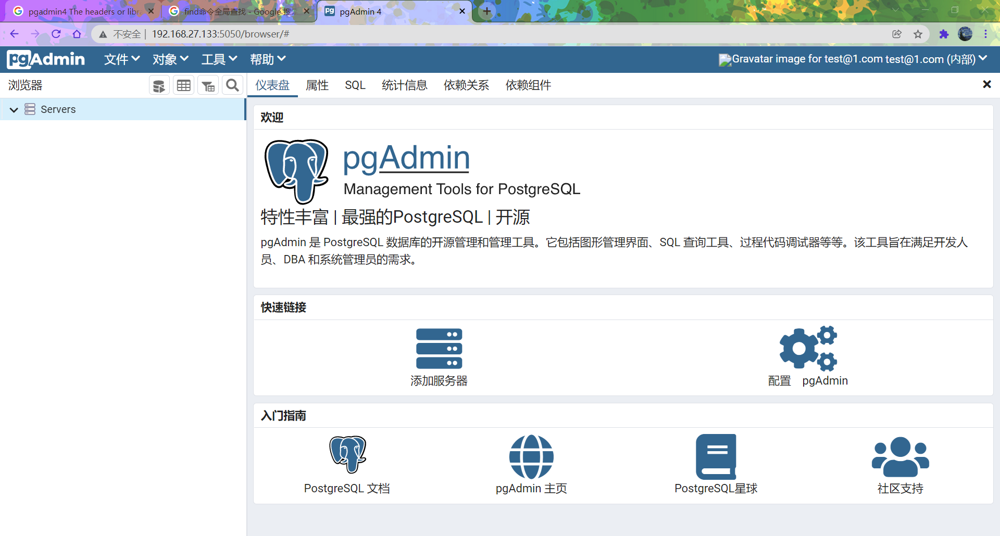
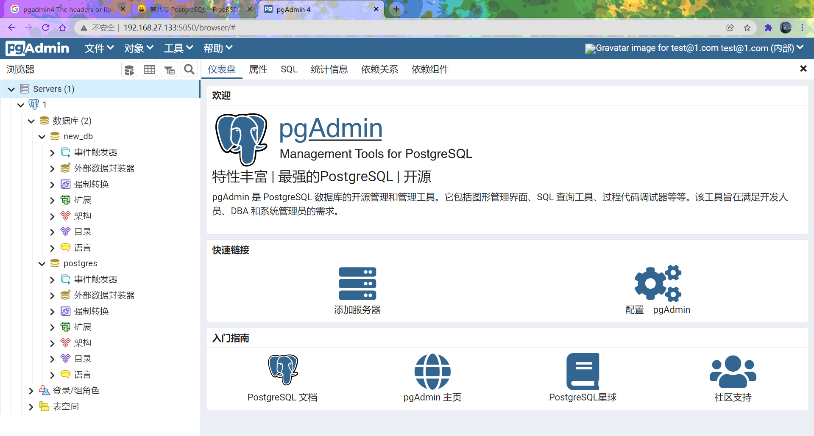

# 第八节 PostgreSQL 与 pgAdmin4

##  PostgreSQL

PostgreSQL 是一款自由的对象-关系型数据库，最早发布于 1989 年 6 月。
在 FreeBSD 上，提供了 9.6、10、11、12、13、14 共计 6 个大版本可选。

### postgresql 安装示例，6个版本都如此。

#### 安装：二选一

```
# pkg install -y postgresql96-server
```

或者

```
cd /usr/ports/databases/postgresql96-server/ && make install clean
```

#### 加入启动项

```
# sysrc postgresql_enable=YES
```

#### 初始化数据库

```
/usr/local/etc/rc.d/postgresql initdb
```

示例输出：

```
root@ykla:~ # /usr/local/etc/rc.d/postgresql initdb
The files belonging to this database system will be owned by user "postgres".
This user must also own the server process.

The database cluster will be initialized with locales
  COLLATE:  C
  CTYPE:    C.UTF-8
  MESSAGES: C.UTF-8
  MONETARY: C.UTF-8
  NUMERIC:  C.UTF-8
  TIME:     C.UTF-8
The default text search configuration will be set to "english".

Data page checksums are disabled.

creating directory /var/db/postgres/data96 ... ok
creating subdirectories ... ok
selecting default max_connections ... 100
selecting default shared_buffers ... 128MB
selecting default timezone ... PRC
selecting dynamic shared memory implementation ... posix
creating configuration files ... ok
running bootstrap script ... ok
performing post-bootstrap initialization ... ok
syncing data to disk ... ok

WARNING: enabling "trust" authentication for local connections
You can change this by editing pg_hba.conf or using the option -A, or
--auth-local and --auth-host, the next time you run initdb.

Success. You can now start the database server using:

    /usr/local/bin/pg_ctl -D /var/db/postgres/data96 -l logfile start

root@ykla:~ # 
```

#### 登录使用

Postgresql 默认是没有 root 用户的，需要使用其创建的 postgres 用户登录。

示例输出:

```
root@ykla:~ # psql
psql: FATAL:  role "root" does not exist
```

正确用法：

```
#切换用户
root@ykla:~ # su - postgres  

#启动服务
$ /usr/local/bin/pg_ctl -D /var/db/postgres/data96 -l logfile start

#创建新用户 ykla，并设置密码
$ createuser -sdrP ykla
Enter password for new role: 
Enter it again: 
$ 
#创建数据库
$ createdb new_db
#登录进数据库并将数据库权限赋予用户 ykla。
$ psql
psql (9.6.24)
Type "help" for help.

postgres=# ALTER USER ykla WITH ENCRYPTED PASSWORD 'password';
ALTER ROLE
postgres=# 
postgres=# GRANT ALL PRIVILEGES ON DATABASE new_db TO ykla;
GRANT
#退出数据库
postgres=# q
$exit
root@ykla:~ #
```

## 安装 pgAdmin4

以下教程以 FreeBSD 13.0 为基准。

pgAdmin4 是用于管理 PostgreSQL 数据库服务器的最流行的开源应用程序。pgAdmin4 提供功能丰富的图形用户界面，轻松管理数据库。 它是用 Python 和 Javascript / jQuery 编写的。 它可以在多种环境中使用，如 Linux，Windows，Unix，可在桌面和服务器模式下使用。

**注意：在安装 pgAdmin4 前先行安装 PostgreSQL 数据库，否则安装 pgAdmin4 会失败。**

pgAdmin4 需要在 python 环境下运行，并且安装时要通过 python 的 pip 进行安装，所以先安装 python。
本文用的默认版本是 Python3.8，请注意，FreeBSD 13 系统上默认没有 python 环境。
可通过以下命令查看：

```
# python
python: Command not found   #说明当前没有 python 命令
```

### 安装 Python 及 pip

```
# pkg install python
```

pip 是 Python 包的包管理器。它用于安装和管理 Python 包和依赖包的关系。

virtualenv 用来建立一个虚拟的 python 环境，一个专属于项目的 python 环境。

本文实际安装过程中是通过 virtualenv 创建独立的 Python 环境来安装 pgAdmin4。

从 py38-pip 包安装 pip：

```
# pkg install py38-pip   
```

### 安装配置 virtualenv

使用 virtualenv 创建独立的 Python 环境。 
Virtualenv 会创建一个自己的 Python 安装的环境，它不支持具有全局或另一个虚拟环境的库。 
运行以下命令来安装 Virtualenv。

```
# pkg install py38-virtualenv （本次安装 python 版本是 3.8 故使用 py38）
```

通过运行以下命令为 pgAdmin4 创建虚拟环境

```
# virtualenv-3.8 pgadmin4
```

如果创建完成则有如下显示，在 root 用户的根目录下生成了一个名为 `pgadmin4` 的虚拟环境。

```
Using base prefix '/usr/local'
New python executable in /home/vagrant/pgadmin4/bin/python3.8
Also creating executable in /home/vagrant/pgadmin4/bin/python
Installing setuptools, pip, wheel…done.
done.
```

### 安装 sqlite3

```
#pkg install py38-sqlite3
```

激活创建的虚拟环境.

```
#source pgadmin4/bin/activate.csh 
```

你会看到 shell 已经变为（pgadmin4）（以下操作均在该 shell 下进行）

实例如下：

```
(pgadmin4) root@ykla:~ # 
```

### 安装 pgAdmin4：

现在 pip 源一律要求使用 https，由于缺少 SSL 证书还需要安装。

```
(pgadmin4) root@ykla:~# pkg install ca_root_nss
```

然后对 pip 进行换源，此处使用清华源：

```
pip config set global.index-url https://pypi.tuna.tsinghua.edu.cn/simple
```

其中有依赖 openjpeg，先进行安装

```
(pgadmin4) root@ykla:~# pkg install openjpeg
```

如果报错：


```
WARNING: Retrying (Retry(total=3, connect=None, read=None, redirect=None, status=None)) after connection broken by 'SSLError(SSLCertVerificationError(1, '[SSL: CERTIFICATE_VERIFY_FAILED] certificate verify failed: certificate is not yet valid (_ssl.c:1136)'))': /simple/pgadmin4/
```

是由于时间不正确引发的，先同步时间:

```
ntpdate ntp.api.bz
(pgadmin4) root@ykla:~#  ntpdate ntp.api.bz
17 Dec 16:35:36 ntpdate[1453]: step time server 114.118.7.161 offset +401965.911037 sec
```

然后再安装 pgAmdin4 及其依赖环境 rust：

```
(pgadmin4) root@ykla:~# pkg install rust
(pgadmin4) root@ykla:~# pip install pgadmin4
```

**注意：如果内存不足（小于 4GB）且没有 swap，会提示 killed，如出现该问题请先添加一块 swap。**

### 配置并运行 pgAdmin4

安装完成后为 pgAdmin4 创建配置文件,复制 pgAdmin4 配置文件：

```
(pgadmin4) root@ykla:~# cp ./pgadmin4/lib/python3.8/site-packages/pgadmin4/config.py  ./pgadmin4/lib/python3.8/site-packages/pgadmin4/config_local.py
```

使用 ee 编辑器编辑配置文件的本地副本。

```
(pgadmin4) root@ykla:~# ee ./pgadmin4/lib/python3.8/site-packages/pgadmin4/config_local.py
```

找到 `DEFAULT_SERVER` 将默认服务器侦听地址更改为 `0.0.0.0`。找到 `DEFAULT_SERVER_PORT` 可改应用程序监听的端口。

实例如下:

```
DEFAULT_SERVER = '0.0.0.0' 
DEFAULT_SERVER_PORT = 5050
```

手动创建软件目录：

```
(pgadmin4) root@ykla:~# mkdir  -p /var/lib/pgadmin   
(pgadmin4) root@ykla:~# mkdir /var/log/pgadmin
```

配置文件编辑完成后执行以下命令来初始化账号和登录密码。

```
(pgadmin4) root@ykla:~# pgadmin4
```

显示实例如下：

```
NOTE: Configuring authentication for SERVER mode.
Enter the email address and password to use for the initial pgAdmin user account:
Email address: your_email		//输入你的邮件地址
Password: your_new_password		//输入你的登录密码
Retype password:			//再次输入密码
Starting pgAdmin 4. Please navigate to http://0.0.0.0:5050 in your browser.
```

现在我们已经安装并运行了 pgAdmin4，并可以通过 `http://ip:5050` 访问 Web 控制面板：






## 保持 pgAdmin4 后台运行

如果服务关闭下次要运行时需使用 pgadmin4 的安装用户（此处是 `root`）进入根目录，执行如下命令：

```
root@ykla:~# source pgadmin4/bin/activate.csh
(pgadmin4) root@ykla:~# pgadmin4 & 
```

提示：`&` 表示后台运行

服务启动后在当前界面中输入 `&` 按回车键,可切换至前台命令行，让服务程序在后台运行。

## 升级 pgAdmin4

本文测试如果直接使用 pip 升级后还是提示旧版本。

pgadmin4 更新频率较高，如需升级要先删除原有用 virtualenv 创建的 pgadmin4 目录然后用安装用户再次执行如下指令：

```
root@ykla:~# virtualenv-3.8 pgadmin4 
```

虚拟目录创建完成后激活

```
root@ykla:~# source pgadmin4/bin/activate.csh
```

激活后不要开启服务，直接执行升级

```
(pgadmin4) root@ykla:~# pip install --upgrade pgadmin4 
```

完成升级后启动服务

```
(pgadmin4) root@ykla:~# pgadmin4
```

登录帐号和密码还是原来的(登陆后再无更新提示，查看版本已是为最新)。
