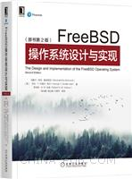

# 第八节 参考资料与贡献者名单

## 『学习资源』 

　　相关书籍：《 Absolute FreeBSD 3rd 》《FreeBSD操作系统设计与实现（原书第2版）》。旧的变化也不是很大。不像 linux 有这么多入门书籍，什么 XX 秒精通 Linux，Linux XX 学，_linux_ 。当然上边这些书，学 Linux 的也尽量别看，质量太差。但是由于历史上的原因，看 UNIX 相关书籍即可。

在线试读 [http://images.china-pub.com/ebook8080001-8085000/8084481/ch01.pdf](http://images.china-pub.com/ebook8080001-8085000/8084481/ch01.pdf)

## 贡献者名单（以下排名不分前后）

[凌莞](https://clansty.com)

[星不萌](https://www.moebsd.cn)

QQ 雨天 2477294049

[liulitchi](https://github.com/liulitchi)

[peiyafei](https://github.com/peiyafei)

[ykla](https://github.com/ykla)
