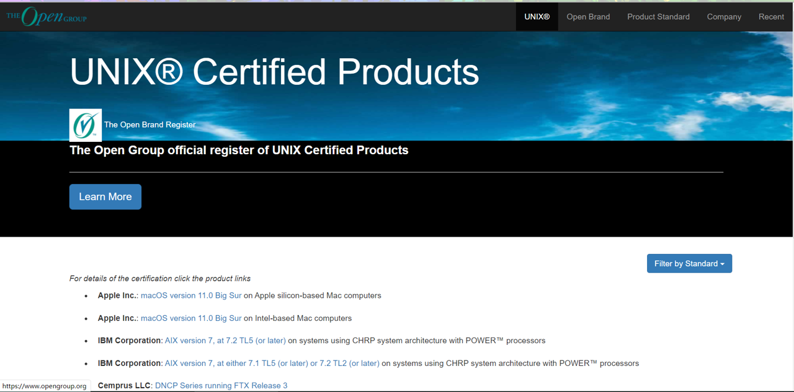

# 第一节 什么是 UNIX

从前是一个操作系统。最后由 C 语言改写产生。——AT&T 公司

现在是一个标准规范和商业商标。更是一种哲学思想，软件工程原则。

**那么，现在到底什么是 UNIX？**

查询网址：[http://www.opengroup.org/openbrand/register](http://www.opengroup.org/openbrand/register)

1、符合单一 UNIX 规范

2、交钱认证

----

**以下为详细说明：**

### 1.Unix的前身
1964 年麻省理工学院推出的 CTSS（兼容分时系统），是当时最有创造性的操作系统，有了 CTSS 这种高效的操作系统，麻省理工学院的研究人员决定做一个更好的版本。他们开始设计 Multics 系统。Mutlics 意思是多路复用信息和计算服务。

Multics 意图创造强悍的新软件和比肩 IBM 7094功能更丰富的新硬件，麻省理工学院邀请了两家公司来帮忙。*美国通用电气公司* 该公司负责设计及生产有全新硬件特性、能更好地支撑分时及多用户体系的计算机，贝尔实验室在计算机发展早期就开发了自己的操作系统，因此麻省理工邀请了贝尔实验室共同开发 Multics。

最终 Multics 的开发陷入了困境，Multics 设计了大量的程序及功能，经常塞入很多不同的东西进去，导致系统过于复杂。1969 年，由于在贝尔实验室看来作为一套信息处理工具，它已经无法为实验室提供计算服务的目标，它的设计太昂贵了，于是在同年4月，贝尔实验室退出 Multics 项目，只剩麻省理工和美国通用电器公司继续开发。

### 2.“UNICS”

贝尔实验室退出 Multics 开发项目后，项目组成员肯·汤普逊（Kenneth Lane Thompson）找到一台 DEC PDP-7 型计算机，这台计算机性能不算强大，只有4KB内存，但是图形界面比较美观，汤普逊用他写了个太空游戏（Space Travel），PDP-7 有个问题就是磁盘转速远远低于计算机的读写速度，为了解决这个问题，汤普逊写了磁盘调度算法来提高磁盘总吞吐量。

如何测试这个新的算法？需要往磁盘上装载数据，汤普逊需要写一个批量写数据的程序。

他需要写三个程序，每周写一个；创建代码的编辑器；将代码转换为 PDP-7 能运行的机器语言汇编器；再加“内核的外层——操作系统就完成了”

新的PDP-7操作系统编写没多时，汤普逊和几个同事讨论，当时新系统还没有名字，当时它被命名为“UNICS”，UNICS 最后改名为**UNIX**，这个名字更加方便记忆。

