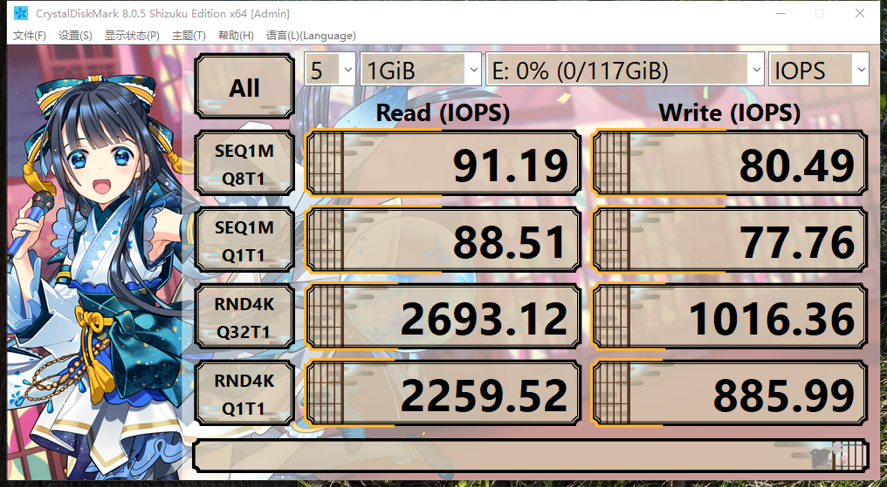
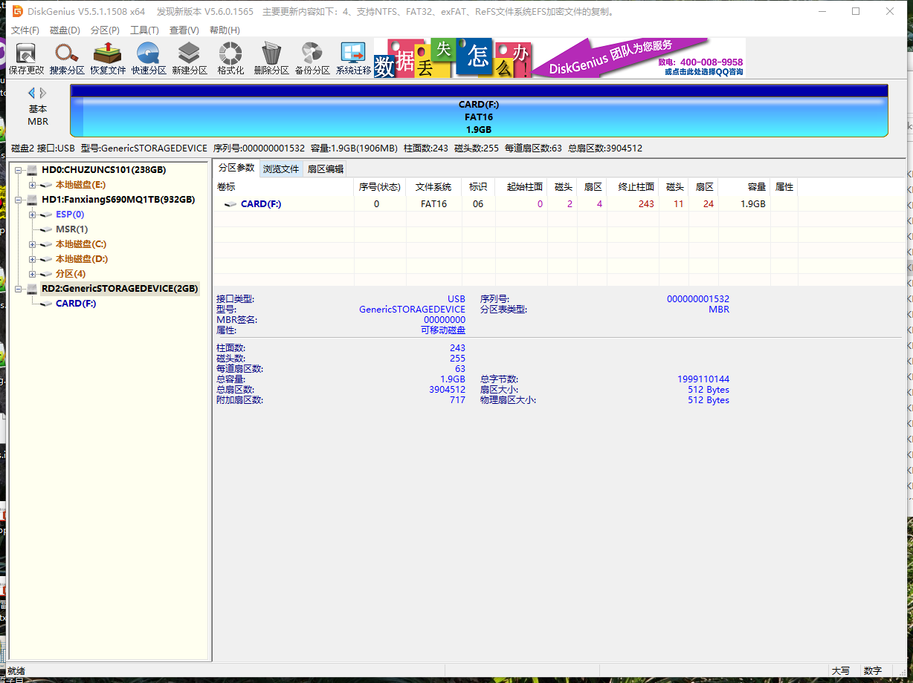
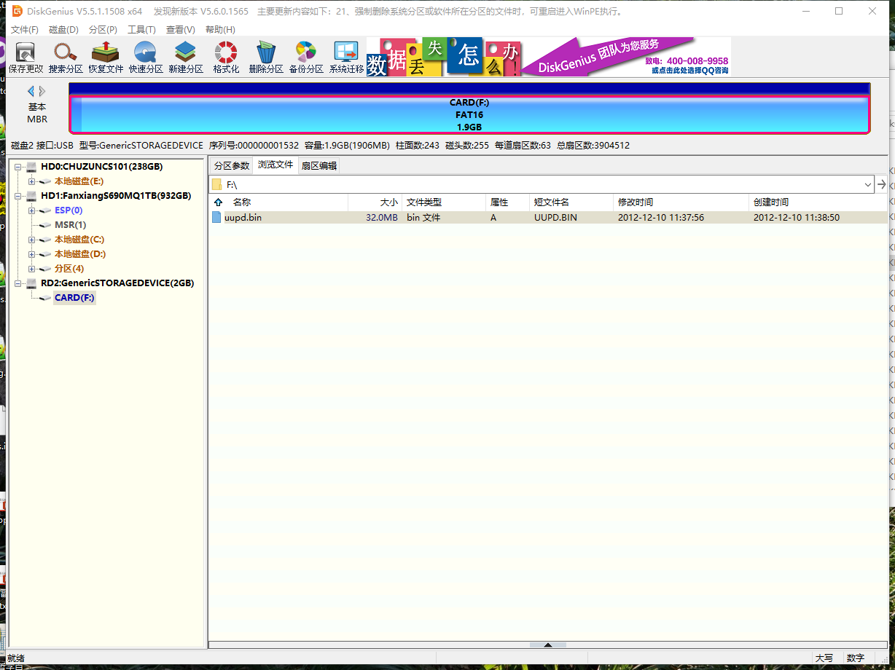
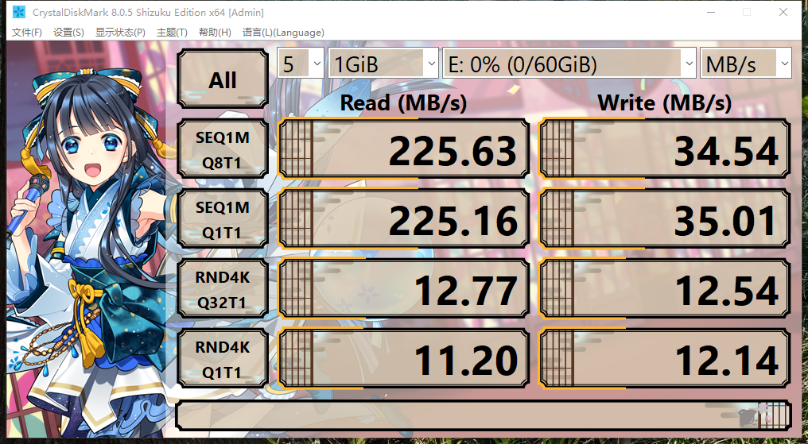
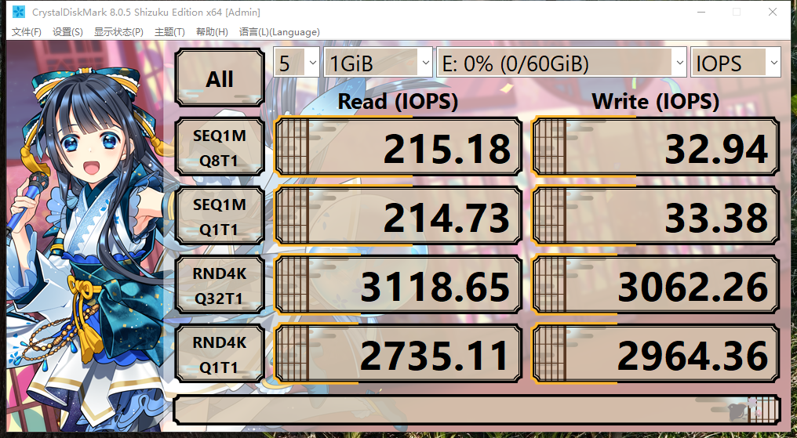

# microSD 卡参数简介

除总线、接口与协议的概念辨析外，了解存储设备的参数也是计算机系统结构的重要组成部分。本节将以 microSD 卡为例，详细介绍其各项参数的含义与选购要点。

存储卡规范是由 [SD 协会](https://www.sdcard.org/) 制定的。

SD 卡的标准较为复杂。即使与 USB-IF 协会制定的 USB 标准相比，其复杂程度也难分伯仲。

SD 卡标准之所以显得复杂，根源在于：随着技术发展，SD 卡协会既不会弃用既有旧标准（如放弃英制单位、改用公制单位），也很少对原有标准进行升级（如提升版本号）。而是另行制定更高等级的新标准。**SD 卡存在多种并行的度量衡体系，其量程各有重叠和差异。**

图中是一张 microSD（Micro Secure Digital，微型 SD）卡，常用于树莓派和手机等设备。

> **注意**
>
> 仅最老款的树莓派使用标准 SD 卡，目前标准 SD 卡“大卡”主要用于相机。

microSD 通常也称为 TF 卡（TF 是 SanDisk 最初的商品名 TransFlash，后被 SD 协会采纳并更名为 microSD，二者是完全相同的物理产品），也常被称作手机存储卡。

这块闪迪的 microSD 卡标注了以下信息：

- `SanDisk Ultra`：`SanDisk` 是品牌名“闪迪”的英文名称；`Ultra` 是闪迪的产品型号系列，通常译为“至尊高速”。
- `128 GB`：存储卡的容量是 128 GB。
- `C10`（`10` 被圆形“C”符号环绕）：该参数在当前产品中的参考意义不大，目前市售存储卡几乎全部标注为 C10，低于该等级的产品已较为少见。
- `U1`（`1` 被圆形“U”符号环绕）：`U1` 的最低持续写入速度为 10 MB/s，`U3` 为 30 MB/s。**不存在 U2 等级**。目前仅有 U1 和 U3，通常只有较老产品或低速产品会标注 U1。
- `microSDXC`：表示该卡容量位于超过 32 GB 至 2 TB 范围内（市场上常见产品从 64 GB 起步）；4 GB–32 GB 的规格称为 microSDHC。其余规格目前已基本见不到——容量不超过 2 GB（microSD）或容量大于 2 TB（microSDUC）。该参数在实际选购中意义不大，因为存储卡本身已明确标注了容量大小。SD 协会（SD Association）定义：SDHC 标准为超过 2 GB 至 32 GB，SDXC 标准为超过 32 GB 至 2 TB。
- `1`（位于 XC 右侧、U1 下方）：表示使用 UHS-I 总线，理论最高速率为 104 MB/s；UHS-II 的理论速率为 312 MB/s。该总线规格决定了存储卡的理论速度上限。
- `A1`：表示应用性能等级，主要反映随机读写能力。目前仅有 A1 和 A2 两个等级；未标注则表示未达到 A1。树莓派官方建议使用 A2 等级的存储卡。

## 其他参数说明

- `667x`、`1066x`：雷克沙会标 667x 或 1066x。这种标识方法主要源自光驱倍速体系，目前仅在光盘设备等领域沿用，属于较为古老的标注方式（起源于 20 世纪 80 年代）。

① 667x = 150 KB/s × 667 ≈ 100 MB/s；

② 1066x = 150 KB/s × 1066 ≈ 156 MB/s。

- `V30`：新产品一般将 `U3` 标为 `V30`。不必刻意选择 V60，该等级产品价格较高（普通 A2 存储卡约 1 元/GB，V60 约 3 元/GB，且 V60 与 A2 规格通常不共存）。V90 等级的 microSD 卡目前较为少见；低于 V30 的也较为少见，一般就标注为 `U1`。

速率标准换算：***C10 = U1 = V10*** 这三个等级含义相同，但通常会同时标注。

这块闪迪 microSD 存储卡上标注了 7 项参数，其中有 4 项在实际使用中的参考价值较低。从参数来看，这款存储卡整体性能较为普通，并无明显优势。

## 存储卡挑选总结

对于树莓派，主要关注容量（推荐至少 32 GB）、连续读写性能（至少 V30）以及随机读写性能（A2）。但目前市面上的存储卡普遍采用这一标注方式。而且除树莓派 5 之外，其他设备（如 Switch）本身大多无法达到 SD 卡设计的总线速率，**因此在实际选购时，主要关注 A1 或 A2 这一参数即可。**

## 是否符合标称参数？

**扩容卡似乎已不再是常态**

在过去，廉价的大容量存储卡往往是扩容卡。但这类卡连树莓派启动盘制作工具都通不过，因为该工具内置了镜像校验程序。如果标称容量和实际容量不符，就无法完成镜像写入。因此，对于树莓派不必考虑这种问题。

另外现在的存储颗粒已经非常廉价了，一般不至于再这么做。如果标称容量并非明显异常（如超过 128 GB 却价格极低），一般不存在此类问题。

**部分标称参数与实际测试不符且会出现掉盘现象**

**移速（MOVE SPEED）**

移速（MOVE SPEED）这张卡的测试速度甚至高于部分三星产品。~~这是用空间换时间了吗？~~ 某些 A2 存储卡，实际测试 4K 读写只有不到 1.5 MB/s，这已不单纯是参数虚标的问题。

经过实测，移速 128 G A2 U3 V30 128 G 存储卡，仅仅写入约 60 GB 就会掉盘。

## 如何测试存储卡和硬盘？

可使用 `CrystalDiskInfo` 查看硬盘的 S.M.A.R.T. 信息及基本参数；还可使用 `CrystalDiskMark` 测试硬盘和存储卡的读写（请使用 USB 3.0 及以上规格的读卡器）。

上述两款软件由同一位开发者开发，但其[官方网站](https://crystalmark.info/en/)包含较多广告内容，可能导致用户误下载非官方文件。

请从 **[这里](https://sourceforge.net/projects/crystaldiskinfo)** 下载 CrystalDiskInfo；请从 **[这里](https://sourceforge.net/projects/crystaldiskmark/files/)** 下载 CrystalDiskMark。

不建议直接访问其官方网站，因为最终下载链接仍会跳转至上述页面。

在撰写本节时，下载使用的是 `CrystalDiskInfo9_3_2Shizuku.exe` 和 `CrystalDiskMark8_0_5Shizuku.exe`。由于界面配色不同，如不需要额外的视觉效果，可分别选择“CrystalDiskInfo9_3_2.exe”、“CrystalDiskMark8_0_5.exe”代替。

在选购固态硬盘时，不能仅关注读写速度，更重要的是要看固态硬盘的主控、NVMe 协议版本及支持状态。

例如，大多数小众品牌固态硬盘都不支持 ASPM（Active State Power Management，活动状态电源管理）技术。此技术能在保证固态硬盘运行效率的情况下尽可能地对固态硬盘进行降温。在实际测试中可使硬盘温度降低约 20℃。

而一些小众品牌固态硬盘，因为无法很好地适配，开启后就会掉盘，于是主动在固态硬盘的固件中关闭该技术。还有一些小众品牌固态硬盘仍在使用 NVMe 1.4 协议版本。甚至存在多块硬盘使用相同序列号的情况——而硬盘序列号的重要性不亚于网卡的 MAC 地址，原则上不应重复，否则可能导致系统无法正确识别多块硬盘。

### 使用 CrystalDiskInfo 查看梵想 S690（1 TB）NVMe SSD PCIe 4.0 硬盘参数

### 使用 CrystalDiskMark 测试梵想 S690（1 TB）NVMe SSD PCIe 4.0 读写速率

### 使用 CrystalDiskMark 测试雷克沙 1066x A2 U3 128 GB 存储卡读写速率（使用 USB 3.0 读卡器）

雷克沙 1066x A2 U3 128 GB 存储卡实际测试结果与标称参数存在严重偏差：标称 A2 等级应达到随机读取 4000 IOPS、随机写入 2000 IOPS，但实测随机读写性能均仅为标称值的一半。

### 标称速度超过 104 MB/s 的 microSD 存储卡在常规使用场景下意义有限

一方面因为使用的不是超频读卡器（即雷克沙配套的读卡器，用于支持其自定义协议）；另一方面，因为 UHS-I 协议的理论速度上限为 104 MB/s（SDR104）。任何存储卡在理论上无法超越这个速度，除非使用 UHS-II（两排金手指）。但是 microSD 极少使用 UHS-II（虽然市场上有少量 UHS-II microSD 产品，如至誉 Catalyst 系列和 Sabrent Rocket 系列，但价格较高且选择有限），UHS-II 主要用于标准大小的 SD 卡（相机使用）。

因此，市面上无论是三星还是闪迪，只要其标称速度超过 UHS-I 的理论上限且并非 UHS-II 产品，通常都是通过非标准协议实现的。**这种非标准协议只有他们的官方读卡器才能支持（售价极高且一般捆绑销售）。其他设备都不支持这种速率，故没有意义。**

### 使用 CrystalDiskMark 测试三星 BAR 升级版 + USB 3.1 闪存盘 64 G 读写速率

即金属款。

## 参考文献

- Kingston Technology. SD 卡和 microSD 卡类型指南[EB/OL]. [2026-03-25]. <https://www.kingston.com/cn/blog/personal-storage/microsd-sd-memory-card-guide>. 介绍各类 SD 卡的规格分类与适用场景。
- Kingston Technology. SD 卡和 microSD 卡速度等级指南[EB/OL]. [2026-03-25]. <https://www.kingston.com/cn/blog/personal-storage/memory-card-speed-classes>. 解读速度等级标识的含义与选购参考。
- Kingston Technology. 了解 SD 卡和 microSD 卡的命名惯例和标签[EB/OL]. [2026-03-25]. <https://www.kingston.com/cn/blog/personal-storage/microsd-sd-memory-card-naming-conventions>. 说明存储卡产品标签中各字段所代表的性能参数。
- odinkuo. 電腦概論中的考古題，關於光碟機的倍數是指什麼[EB/OL]. [2026-03-25]. <https://www.mobile01.com/topicdetail.php?f=300&t=2126605&p=3>. 解释光驱倍速概念及其与原始 CD 传输速率的换算关系。
- RC丸钢. 移速（MOVE SPEED）64 GB TF（MicroSD）存储卡测试[EB/OL]. [2026-03-25]. <https://www.bilibili.com/read/mobile?id=21681916>. 对移速品牌 TF 卡的实际读写速度进行测试与评价。
- SilentNocturne. 移速这个卡虚标了，速度只有标注的二分之一[EB/OL]. [2026-03-25]. <https://post.smzdm.com/talk/p/az6o8zkr/>. 指出移速存储卡实测速度与标称值存在较大差距。
- 远航的加菲猫. Mvespeed 移速 400G 内存卡简单测评[EB/OL]. [2026-03-25]. <https://post.smzdm.com/p/arq759g7/>. 对大容量移速存储卡的容量与性能进行实测。
- 尼奥叔叔. 移速 TF 卡翻不翻车？看来没翻（附游戏测试）[EB/OL]. [2026-03-25]. <https://post.smzdm.com/p/awzqn9z4/>. 从游戏加载角度验证移速 TF 卡的实际使用体验。
- Western Digital. 闪迪至尊超极速移动 ™ microSDXC™ UHS-I 存储卡: 128GB[EB/OL]. [2026-03-25]. <https://www.westerndigital.com/zh-cn/products/memory-cards/sandisk-extreme-pro-uhs-i-microsd?sku=SDSQXCY-128G-ZN6MA>. 参见注释 8：“采用专利技术”。
- 滕飞et. 存储卡也超频？实测结果非常意外[EB/OL]. [2026-03-25]. <https://mp.weixin.qq.com/s/CMioVrUx0YJbF_v7zvQMRA>. 实测发现部分存储卡在特定条件下可超出标称速度运行。
- Samsung. BAR 升级版 + USB3.1 闪存盘[EB/OL]. [2026-03-25]. <https://www.samsung.com.cn/memory-storage/usb-flash-drive/usb-3-1-flash-drive-bar-plus-64gb-titanium-gray-muf-64be4-cn/>. 三星 USB 3.1 闪存盘产品规格与性能参数。
- 参见 SD Association. Capacity SD/SDHC/SDXC/SDUC[EB/OL]. [2026-04-16]. <https://www.sdcard.org/developers/sd-standard-overview/capacity-sd-sdhc-sdxc-sduc/>. 该页面定义 SD/SDHC/SDXC/SDUC 容量标准。
- Lexar. Lexar Professional 667x microSDXC UHS-I 产品规格[EB/OL]. [2026-04-16]. <https://resources.lexar.com/download/236/667x-microsdxc/1963/lexar-productsheet-pro-667x-microsd-en-201911.pdf>. 该文档为雷克沙 667x microSD 卡产品规格表。雷克沙官方 667x 存储卡标称读取速度为 100 MB/s。
- SD Association. SD Specifications[EB/OL]. [2026-04-18]. <https://www.sdcard.org/developers/sd-standard-overview/>. SD 卡容量标准与速度等级定义。
- B&H Photo Video. UHS-II microSDXC Memory Cards[EB/OL]. [2026-04-18]. <https://www.bhphotovideo.com/c/buy/micro-sd-cards/ci/39505/cp/13296+3496+23730+39505>. UHS-II microSD 产品存在。
