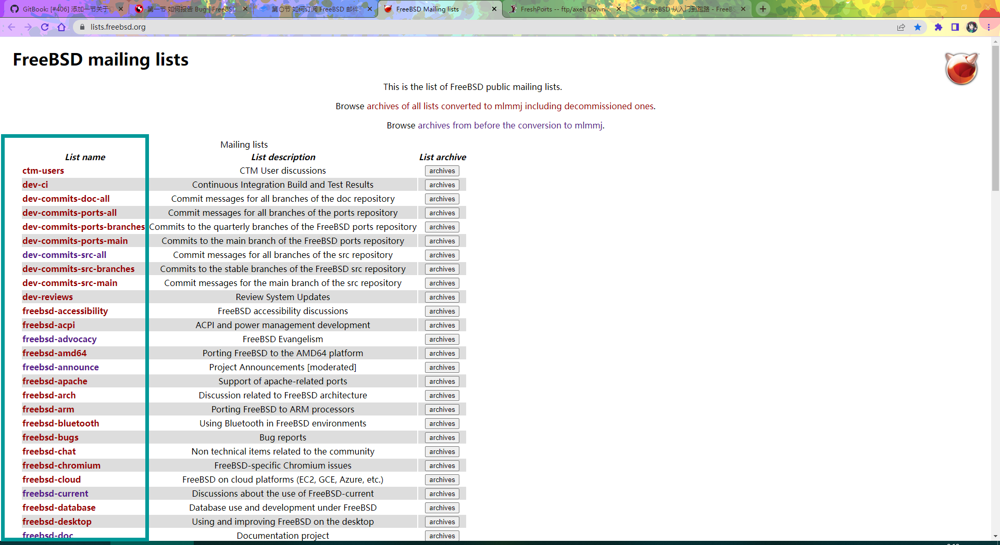
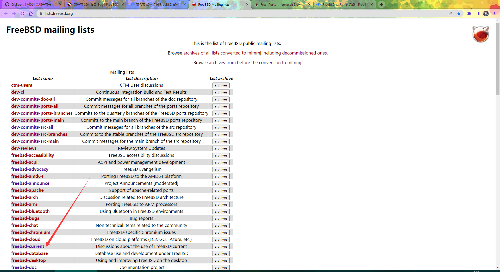
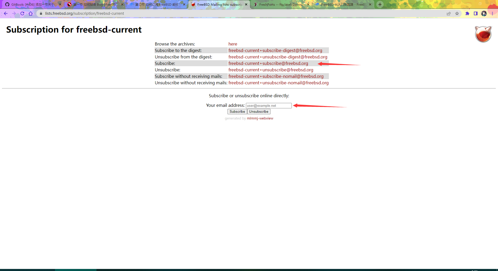

# FreeBSD 邮件列表订阅

## 概述

可在 [https://lists.freebsd.org/](https://lists.freebsd.org/) 查阅 FreeBSD 邮件列表，这是 FreeBSD 社区技术讨论与决策沟通的主要平台。

### 邮件列表选择建议

不同邮件列表有不同的受众和讨论主题：

| 邮件列表 | 用途 |
|---|---|
| **freebsd-current** | 用于讨论 FreeBSD 当前开发分支（-CURRENT）的相关话题，适合关注最新开发动态的用户和开发者 |
| **freebsd-stable** | 用于讨论 FreeBSD 稳定分支（-STABLE）的相关话题 |
| **freebsd-questions** | 适合初学者和一般用户提问 |
| **freebsd-doc** | 文档相关讨论 |
| **freebsd-ports** | Ports 相关讨论 |

建议根据自身需求选择合适的邮件列表订阅。希望全面了解 FreeBSD 开发现状的用户，可优先考虑订阅 freebsd-current。

订阅只需输入邮箱即可，随后将收到一封回信，根据回信中的要求向指定邮箱发送一封任意内容的邮件，即可收到订阅成功的确认信息。

如果要将摘要订阅改为全文订阅，向相应的 Subscribe 邮箱地址（例如 freebsd-doc 对应 `freebsd-doc+subscribe@freebsd.org`）重新发送一封任意内容的邮件即可。

邮件应使用英语撰写；如果不熟悉，可借助 [https://deepl.com](https://deepl.com) 翻译。遇到问题时，建议先通过邮件咨询，再提交 Bug 报告，以避免重复。

如有回复要求提供更多信息，请及时响应并耐心等待。

## 图解说明

打开 [https://lists.freebsd.org/](https://lists.freebsd.org/) 找到要订阅的邮件列表（以 freebsd-current 为例）：

点击红色文字进入：

向该行列出的邮箱地址发送邮件，邮件主题无特定要求。用户将收到一封回信，其中提供了另一个邮箱地址，用户需再次向该地址发送邮件确认，邮件主题同样无特定要求。

完成以上步骤即可加入邮件列表。如果发送邮件后未收到回复，请手动向 subscribe 所示的邮箱发送邮件，邮件主题和内容无特定要求。

如需测试邮件能否被接收，请按照上述步骤订阅后，向 [freebsd-test](https://lists.freebsd.org/subscription/freebsd-test) 发送测试邮件。

## 规则

本节内容引自 FreeBSD 手册。

- 如果被管理员书面警告两次后仍有违规（即第三次违规），将被所有邮件列表封禁。
- 如需闲聊，请访问 [https://lists.freebsd.org/subscription/freebsd-chat](https://lists.freebsd.org/subscription/freebsd-chat)
- 除非必要，不应在两个以上的邮件列表上发帖。
- 严禁发布广告（非 FreeBSD 相关内容），违反者将立即被封禁。
- 使用英语。
- 严禁人身攻击和谩骂。尊重他人隐私，不应发表私密邮件。

## FreeBSD 社区准则（CoC）

原文见 [FreeBSD Community Code of Conduct](https://www.freebsd.org/internal/code-of-conduct/)，该准则旨在确立 FreeBSD 社区的包容性与尊重性行为准则。

### FreeBSD 社区行为规范（CoC）

FreeBSD 社区始终致力于成为一个包容和尊重的社区，我们希望在社区发展和演变的过程中，这一点不会改变。为此，我们要求大家遵守一些基本规则：

- 友善耐心；
- 欢迎他人；
- 体贴他人；
- 尊重他人；
- 谨慎选择言辞，对他人保持友善；
- 意见不同时，学会换位思考。

这并不是一份禁止行为的详尽清单。请将其理解为一种指导原则，旨在使交流与参与社区活动更为便利。

此行为规范适用于 FreeBSD 项目管理的所有场合。这些场合包括在线聊天、邮件列表、Bug 跟踪器、FreeBSD 活动（如开发者会议和社交活动），以及项目创建的其他用于沟通的论坛。它适用于您在这些空间中的所有交流和行为，包括电子邮件、聊天、言论、幻灯片、视频、海报、标语，甚至您在这些空间中展示的 T 恤。此外，若在这些空间外发生违反此行为规范的行为，在极端情况下也可能影响某人参与上述场合的能力。

如果您认为某人在违反行为规范，请通过发送电子邮件到 [conduct@FreeBSD.org](mailto:conduct@freebsd.org) 向我们报告。更多详细信息，请参见我们的 [报告指南](https://www.freebsd.org/internal/conduct-reporting/)。

- **友善耐心。**
- **欢迎他人。** 我们努力成为一个欢迎和支持各种背景和身份的人的社区。这包括但不限于任何种族、民族、文化、国籍、肤色、移民状态、社会和经济阶层、教育水平、性别、性取向、性别认同和表达、年龄、体型、家庭状况、政治信仰、宗教信仰以及心理和身体能力的成员。
- **体贴他人。** 您的工作将被他人使用，而您也将依赖他人的工作。您做出的任何决定都会影响用户和同事，应考虑这些后果。请记住，我们是一个全球性的社区，因此您可能并非用别人的母语与其交流。
- **尊重他人。** 我们并不总是意见一致，但不同意见不是不良行为的借口。我们可能会感到沮丧，但我们不能让沮丧变成个人攻击。记住，让人感到不舒服或受到威胁的社区不是一个高效的社区。FreeBSD 社区的成员在与其他成员以及与 FreeBSD 社区外的人打交道时，应该保持尊重。
- **谨慎选择言辞，对他人保持友善。** 不应侮辱或贬低其他参与者。骚扰和其他排他性行为是不可接受的。这包括但不限于：
  - 针对他人的暴力威胁或言语。
  - 歧视性笑话和语言。
  - 发布色情或暴力内容。
  - 发布（或威胁发布）他人的个人身份信息（“人肉搜索”）。
  - 个人侮辱，特别是使用种族主义或性别歧视的词汇。
  - 不受欢迎的性别关注。
  - 提倡或鼓励上述行为。
- **一般而言，如果有人要求您停止，请停止。** 被要求停止后仍继续者，视为骚扰。
- **意见不合时，尽量理解差异的成因。** 社交和技术上的分歧时常发生，FreeBSD 也不例外。重要的是建设性地解决分歧和不同的观点。请记住，我们各有不同。FreeBSD 的力量来自其多样化的社区，成员来自各种背景。不同的人对问题有不同的看法。不能理解某人为何持有某种观点，并不意味着他们错了。不应忘记，犯错是人之常情，互相指责无济于事。应专注于帮助解决问题，并从错误中学习。

#### 有问题吗？

如果您有任何问题，请随时通过电子邮件 [conduct@FreeBSD.org](mailto:conduct@freebsd.org) 联系 FreeBSD 行为规范委员会。

## 课后习题

1. 浏览 FreeBSD 邮件列表归档，选取某一技术讨论主题，追溯其讨论历史并分析决策过程。
2. 对比 FreeBSD 邮件列表行为准则与其他开源项目的行为规范，分析两者在社区治理模式上的差异及其原因。
3. 模拟一个技术问题场景，撰写符合邮件列表规范的提问邮件，并规划后续跟进策略。
