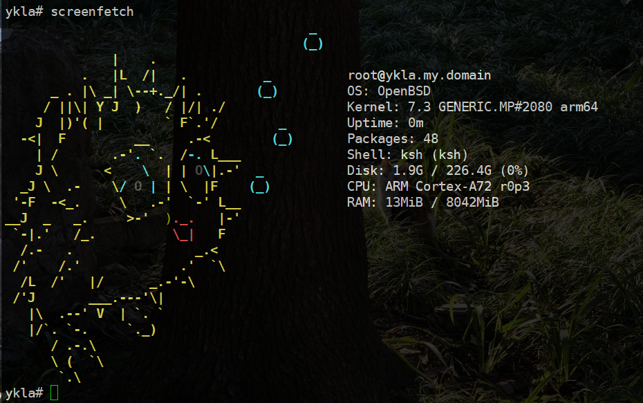
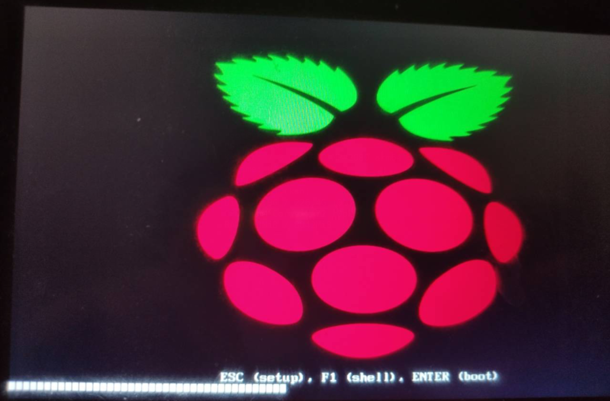
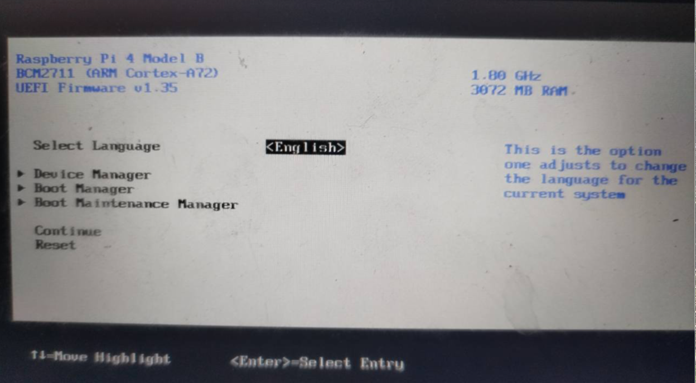
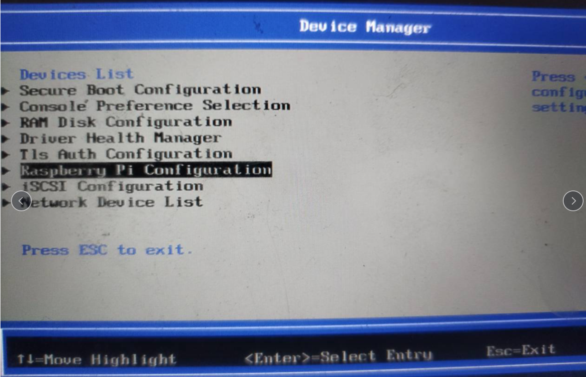
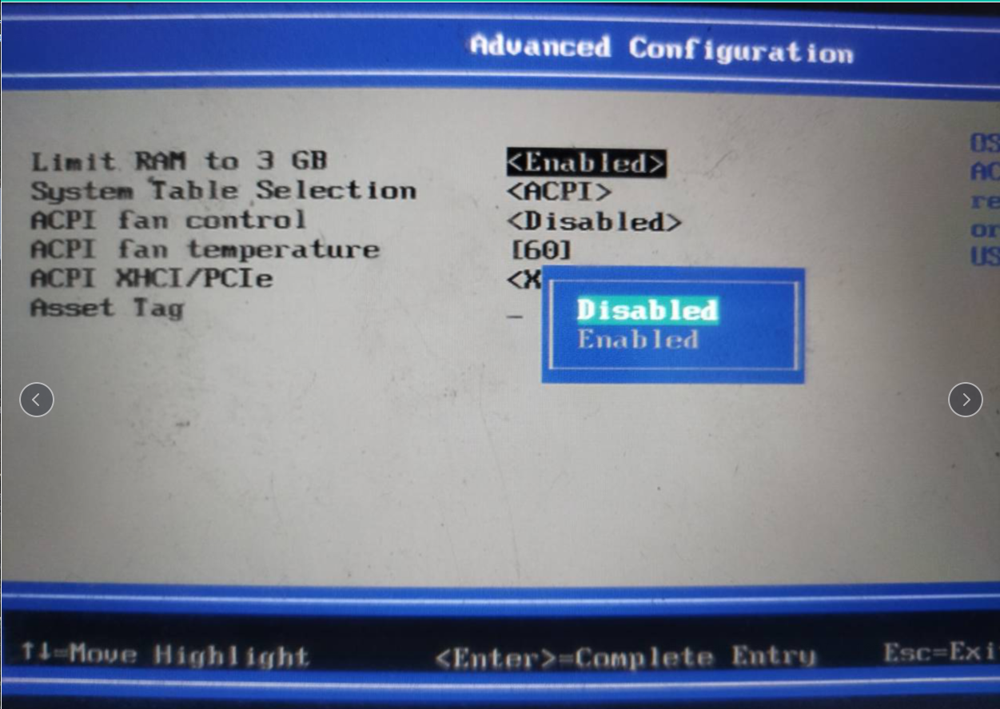

# 在树莓派上安装 OpenBSD

本节介绍如何在树莓派（Raspberry Pi）上安装 OpenBSD 系统，以树莓派 4B 为例提供详细的安装流程与技术要点。

## 树莓派 4B 8 GB V1.5 安装 OpenBSD 7.3

本节以树莓派 4B 为例，介绍 OpenBSD 系统在该平台上的具体安装步骤与配置方法。

OpenBSD 系统当前支持树莓派的以太网卡、Wi-Fi、TF 卡及 USB 3.0 设备。

首先需要两个存储设备，可以是两个 U 盘，或者一个 U 盘加一张存储卡。因为 OpenBSD 的镜像与 FreeBSD 不同，它不是预构建的，需要用户自行安装。其中一个设备作为安装盘，另一个作为系统盘。本示例中使用两个 U 盘进行安装。

按照常规方法下载 [https://ftp.openbsd.org/pub/OpenBSD/7.3/arm64/install73.img](https://ftp.openbsd.org/pub/OpenBSD/7.3/arm64/install73.img)，并使用 Rufus 将其刻录到 U 盘中。刻录完成后，删除 FAT 分区中除 `efi` 文件夹以外的所有文件。

UEFI 固件文件结构：

```sh
FAT 分区/
└── efi/
```

下载树莓派 UEFI 固件：[https://github.com/pftf/RPi4/releases](https://github.com/pftf/RPi4/releases)。本文使用的版本为 RPi4_UEFI_Firmware_v1.35.zip。

下载完成后，将 UEFI 固件解压到前述 FAT 分区中。然后按常规方法启动并安装 OpenBSD。安装完成后，取出系统盘，并以相同方法处理 FAT 分区。



## 在 UEFI 固件中解除内存限制

树莓派默认的 UEFI 固件有内存限制，需要手动解除才能使用全部内存。

开机时按 `ESC` 键进入 UEFI 固件设置界面。

选择 Device Manager > Raspberry Pi Configuration > Advanced Configuration：

```text
Limit RAM to 3 GB        --->  "Disabled"
```

按 `F10` 后输入 `Y` 以保存设置。然后按 `ESC` 返回 UEFI 设置首页，选择 `Reset` 以退出并重启系统。









## 参考文献

- OpenBSD Project. INSTALL.arm64[EB/OL]. (2024-03-25)[2026-03-25]. <https://ftp.openbsd.org/pub/OpenBSD/7.3/arm64/INSTALL.arm64>. OpenBSD arm64 架构官方安装指南，提供详细步骤。
- OpenBSD Project. OpenBSD/arm64[EB/OL]. (2024-03-25)[2026-03-25]. <https://www.openbsd.org/arm64.html>. OpenBSD arm64 平台支持说明，列出兼容硬件。
- Reddit. OpenBSD 7.1 on Raspberry PI 4B 8GB[EB/OL]. (2024-03-25)[2026-03-25]. <https://www.reddit.com/r/openbsd/comments/xcudgr/openbsd_71_on_raspberry_pi_4b_8gb/>. 社区实践经验，记录树莓派 4B 上 OpenBSD 的安装过程。
- MTSAPV. OpenBSD On A Raspberry Pi 4[EB/OL]. (2024-03-25)[2026-03-25]. <https://www.mtsapv.com/rpi4obsd/>. 树莓派 4 上 OpenBSD 安装与配置的技术指南。
- Raspberry Pi Foundation. 树莓派官方文档简体中文版[EB/OL]. (2024-03-25)[2026-03-25]. <https://rpicn.bsdcn.org>. 树莓派硬件与使用的中文参考文档。

## 课后习题

1. 比较树莓派 4B 在 FreeBSD、NetBSD 和 OpenBSD 下的硬件支持情况（如 Wi-Fi、USB 3.0、GPIO 等）。

2. 修改树莓派 UEFI 固件配置，编写自动化脚本在启动时自动加载 OpenBSD 内核，无需手动干预。
