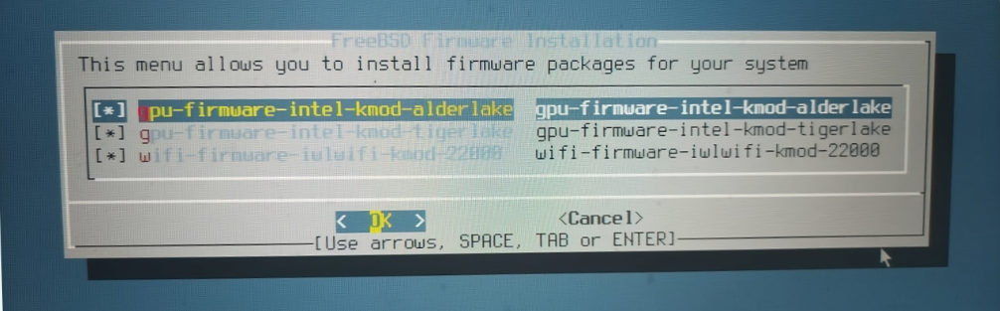

# FreeBSD 13/14 安装指南

这些 RELEASE 系统也可以用于生产环境，不过优先级低于最新的 RELEASE。

## 使用 bsdinstall 开始安装

>**技巧**
>
>视频教程见 [FreeBSD 14.2 基础安装配置教程](https://www.bilibili.com/video/BV1STExzEEhh)（物理机）、[002-VMware17 安装 FreeBSD14.2](https://www.bilibili.com/video/BV1gji2YLEoC)（虚拟机）。

---

以下安装说明基于 `FreeBSD-14.3-RELEASE-amd64-disc1.iso`。`-dvd1.iso` 和 `-memstick.img` 大同小异。

>**警告**
>
>本文基于 VMware 17 进行演示（使用 UEFI）。
>
>若是物理机，请考虑使用 [rufus](https://rufus.ie/zh/) + [img 镜像](https://download.freebsd.org/ftp/releases/ISO-IMAGES/14.3/FreeBSD-14.3-RELEASE-amd64-memstick.img)。


> **警告**
>
> 如果要在 VMware 虚拟机使用 UEFI，必须使用 FreeBSD 13.0-RELEASE 及以上，否则启动会花屏。

## 启动安装盘


此界面无需任何操作，等待十秒，可自动进入 `1. Boot Installer [Enter]`；亦可以直接按 **回车键** 进入。

按 **空格键** 可暂停，可选定以下选项。

>**技巧**
>
>如果按其他任意键会进入提示符 `OK`，可输入 `menu` 再按 **回车键** 返回菜单。

以下操作：按最开头的数字可进行选定。`on` 代表已开启，`off` 代表已关闭。

|     选项     |                                   解释                                    |
| :----------: | :----------------------------------------------------------------------- |
|`1. Boot Installer [Enter]`|用于安装系统|
| `2. Boot Single user` |  单用户模式，找回 root 密码和修复磁盘时会用到 |
|  `3.Escape to loader prompt`   |           离开菜单，进入命令模式，进入后输入 `reboot` 回车可重启                                |
| `4.Reboot`  |        重启                      |
|  `5. Cons: Video`    |    选择输出模式：视频（`Video`）、串口（`Serial`）、同时输出，但串口优先（`Dual (Serial primary)`）、同时输出，但视频优先（`Dual (Video primary)` 可选）                         |
|`6. Kernel: default/kernel (1 of 1)`|选择要启动的内核|


|**`7. Boot Options`**|启动参数|
| :----------: | :----------------------------------------------------------------------- |
|`1. Back to main menu [Backspace]`|按 **删除键** 可返回上级菜单 |
|`2. Load System Defaults`|恢复默认配置|
|`3. ACPI`|Advanced Configuration and Power Management Interface，高级配置和电源接口|
|`4. Safe Mode`|安全模式|
|`5. Single user`|单用户模式|
|`6. Verbose`|啰嗦模式，增加更多调试信息输出|


>**警告**
>
>需要指出，某些教程要求人们关闭 ACPI，这样做现在是没有任何依据的。除非你不是 x86，否则对于现代计算机绝没有关闭的道理。ACPI 和电源状态、设备节能、多处理器支持等功能密切相关。应该将此选项视为遗留功能，只有不支持 UEFI 的上古计算机才应考虑。
>
>如果出现 ACPI 报错，也是非常正常的事情。大部分情况下并不会影响使用。一般通过更新 BIOS 即可解决。在极个别情况下可能需要修补 SSDT 和 DSDT，黑苹果的玩家对此应该并不陌生，甚至是家常便饭。

## 使用 `bsdinstall` 进行安装流程

在回车或等待一段时间（10 秒）后，会自动进入下面的界面。


>**技巧**
>
>这个界面是由工具 `bsdinstall` 提供的。
>
>本章将指导用户如何使用该工具来进行 FreeBSD 的安装。该工具不仅存在于安装镜像中，安装完成后你在新装系统中依然可以找到它，并且还可用它来执行普通的安装流程（请记住这一点，在高级的安装方式中很有用）。
>
> `bsdinstall` 工具本质上是由一系列 sh 脚本构成的，其源代码位于 [usr.sbin/bsdinstall](https://github.com/freebsd/freebsd-src/tree/main/usr.sbin/bsdinstall)，脚本在“scripts”文件夹下。

欢迎菜单。

`欢迎使用 FreeBSD！你想要开始安装还是使用 Live 系统？`

选中左侧 `install`，按下 **回车键** 可进行安装；中间 `Shell` 是命令行；右侧 `Live System` 是 LiveCD 模式。

>**技巧**
>
>以下若无特别说明，按 **TAB 键** 或者 **方向键** 可选择不同条目；按 **回车键** 可以选定高亮条目；

>**技巧**
>
>注意观察图片中的红色加粗大写首字母，如 `Install`、`Shell` 和 `Live System` 中的 **`I`**、**`S`**、**`L`** 分别是红色加粗大写的。若你直接按键盘上面的对应按键（无论大小写），均会选定并直接进入该界面。


>**警告**
>
>无论在任何步骤，按 **ESC 键** 均 **不能** 返回上一菜单，都会直接跳到下一步直至退出安装或结束安装。

## 设定键盘布局


`FreeBSD 系统控制台驱动程序默认使用标准` US `（美式）键盘布局。可以在下面选择别的键盘布局。`

这里是键盘布局菜单，直接按 **回车键** 使用默认键盘布局即可（因目前中国使用美式键盘布局）。

## 设定主机名


`请选择此机器的主机名。如果你正运行在受管理的网络上，请向你的网络管理员询问合适的名称。`

此处为设置主机名菜单。

>**警告**
>
>**不要** 在这一步直接按 **回车键**！这样会导致主机名为空！登录管理器 sddm 会无法启动。

>**警告**
>
>官方手册上说的是错的（`Amnesiac`），如果你不设置主机名，那么你的主机名不会被赋予任何值（不会给你分配 `Amnesiac`！），因为 FreeBSD 源码已经假设你会通过 DHCP 分配该值了。根据目前的源代码逻辑，只要你使用了 DHCP，也不会有任何报错提示主机名为空，当且仅当你没有网络时，才会在登录时将 login 信息打印为 `Amnesiac`，并打印一条报错信息。

### 参考信息

- [If the hostname is not set for the host, the value "Amnesiac" should be written to rc.conf.](https://bugs.freebsd.org/bugzilla/show_bug.cgi?id=286847)，笔者发现的 bug
- [libexec/getty/main.c](https://github.com/freebsd/freebsd-src/blob/80c12959679ab203459dc20eb9ece3a7328b7de5/libexec/getty/main.c#L178)，`Amnesiac` 源码
- [bsdinstall: Warn if hostname is empty](https://github.com/freebsd/freebsd-src/pull/1700)，笔者的 PR


## 选择安装组件


`选择要安装的可选系统组件`

>**技巧**
>
>以下若无特别说明，按 **空格键** 可以选中条目——就是让 `[ ]` 变成 `[ * ]`。
>
>推荐：在默认的基础上，**额外** 选中 `src` 即可。因为部分显卡驱动（如 `drm`）和其他程序需要 `src`，经测试 `lib32` 后期安装无效。

>**警告**
>
>**不要** 选择 `kernel-dbg`、`lib32`、`src` 以外的组件，需要联网安装，极慢。如有需要可以自己后期安装。
>
> 如果在安装中出现应该选用哪个镜像站这个问题，是因为你全选了组件，请不要这样做。


|    选项    |                                 解释                                  |
| :--------: | :------------------------------------------------------------------- |
|  `base-dbg`  |                 基本系统调试工具                |
| `kernel-dbg` |                       内核调试工具                        |
| `lib32-dbg`  | 32 位应用程序的兼容库的调试工具 |
|   `lib32`    |        用于在 64 位 FreeBSD 上运行 32 位应用程序的兼容库        |
|   `ports`    |                                 ports                                 |
|    `src`     |                              系统源代码                               |
|   `tests`    |                               测试工具                                |

## 分配磁盘空间

FreeBSD 14.2 RELEASE 的 `/` 分区支持 UFS 和 ZFS 两种文件系统。旧版 FreeBSD 系统 root 分区仅支持 UFS 一种文件系统：`bsdinstall` 从 10.0 [开始](http://svn.freebsd.org/viewvc/base?view=revision&revision=256361) 支持 zfs，手动安装的话至迟 8.0 就 [可以](https://blog.delphij.net/posts/2008/11/zfs-1/) 用 zfs 作为根分区了。


分区菜单。`你希望如何分区你的磁盘？`

|配置选项 | 中文说明|
|---|---|
|`Auto (ZFS) – Guided Root-on-ZFS`|自动 (ZFS) – 引导式 ZFS root 分区|
|`Auto (UFS) – Guided UFS Disk Setup`|自动 (UFS) – 引导式 UFS 磁盘设置|
|`Manual – Manual Disk Setup (experts)`|手动 – 手动磁盘设置（适合专家）|
|`Shell – Open a shell and partition by hand`|Shell – 打开 Shell 并手动分区|

文件系统详解见其他章节（可手动分区解压 `txz` 文件以自定义，参见其他章节）。这里，推荐选择默认选项 `auto ZFS`：一般来说，内存小于 8GB 的应该选择 UFS，内存 8G 及以上的应该选用 ZFS。


手动分区和 Shell 分区参见手动安装 FreeBSD 相关章节。


### Auto (ZFS)（使用 ZFS 作为 `/` 文件系统）

>**技巧**
>
>经过测试，实际上 256M 内存也能用 ZFS（UEFI）；若使用旧的 BIOS，128M 内存足矣。

> **注意**
>
>如果使用手动分区一直提示分区表损坏（`corrupted`）或类似字样，请先退出重启，进入 shell 模式，刷新分区表：
>
> ```sh
> # gpart recover ada0
> ```
>
> 你在手动安装的时候可以判断是哪块硬盘，以确定 `ada0` 这个参数是多少。
>
>如果不确定自己的硬盘是哪块（比如分不清是 `da0` 还是 `nvme0` 之类的）：可使用图片中的命令查看。
>
>
>
>
> 刷新后，输入 `bsdinstall` 即可进入安装模式。
>
> 原因详情见 [FreeBSD 手册](https://handbook.bsdcn.org/di-18-zhang-cun-chu/18.3.-tiao-zheng-he-zeng-jia-ci-pan-da-xiao.html)，但是我认为这是一个 bug。


`正在探测设备，请稍候（这可能需要一些时间）……`


现代（近十几年内的）计算机应该选择 `GPT+UEFI`。请勿使用默认选项！这样会产生一个 512KB 的 `freebsd-boot` 多余分区。

较老的计算机（如 2013 年以前的）才应该选择选项 `GPT(BIOS)`——此默认选项同时兼容二者。


|配置选项 | 中文 | 说明|
|---|---|---|
|`>> Install Proceed with Installation`| >> 安装 继续安装||
|`T Pool Type/Disks: stripe: 0 disks` |存储池类型/磁盘：条带化：0 块磁盘 | 详细说明见下|
|`- Rescan Devices *` |- 重新扫描设备 *||
|`- Disk Info *` |- 磁盘信息 *||
|`N Pool Name zroot` |存储池名称 `zroot`|默认池名 `zroot`|
|`4 Force 4K Sectors? YES` |强制 4K 扇区？是|4K 对齐|
|`E Encrypt Disks? NO` |加密磁盘？否 | 加密后的登录系统方案请参照本书其他文章|
|`P Partition Scheme` |GPT (UEFI) 分区方案 GPT (UEFI)|只有老电脑才需要 `GPT (BIOS+UEFI)` 等选项|
|`S Swap Size 2g` |交换分区大小 2g|如果你的确不需要 Swap，`Swap Size` 输入 `0` 或 `0G` 即可不设置交换分区。|
|`M Mirror Swap? NO`| 交换分区镜像？否 | 是否在多个磁盘之间镜像交换分区，若选否，则每个磁盘的交换分区是独立的|
|`W Encrypt Swap? NO` |加密交换分区？否 |  |


>**技巧**
>
>如果在此处设置 `P Partition Scheme` 为 `GPT (UEFI)` 而非其他，后续分区与系统更新过程会更加简单。

>**注意**
>
>最好想清楚再设置 `Swap Size`（即交换分区）的大小（一般理论是内存的两倍，但由于设计问题，不应超过 64G），因为 zfs、ufs 文件系统都是不能缩小文件系统的，而 `dd` 一个 swap 文件或文件系统会有负面作用。

>**技巧**
>
>如果分不清应该后续选择哪块磁盘，可以在此步选择 `- Disk Info *`，查看磁盘信息：
>
>
>
>此界面，选中磁盘按 **回车键** 可查看详情；选中 `<Back>` 可返回上一菜单。
>
>
>
>此界面按 **上下方向键** 可浏览。按 **回车键** 可返回到上一菜单。


`选择虚拟设备类型：`

|配置选项 | 中文 | 特点|
|---|---|---|
|`Stripe` |条带化，即 `RAID 0` |无冗余，一块硬盘即可|
|`mirror` |镜像，即 `RAID 1` | n 路镜像，最少需要 2 块硬盘|
|`raid10` |RAID 1+0 | n 组 2 路镜像，最少需要 4 块硬盘（要求偶数块硬盘）|
|`raidz1`| RAID-Z1 | 单冗余 RAID，最少需要 3 块硬盘|
|`raidz2` |RAID-Z2 | 双冗余 RAID，最少需要 4 块硬盘|
|`raidz3` |RAID-Z3 | 三重冗余 RAID，最少需要 5 块硬盘|

我们直接按 **回车键** 使用默认的 `Stripe` 即可。


选中你的硬盘，直接按 **回车键** 即可。

>**技巧**
>
>如果你要将系统安装到 U 盘或移动硬盘，但系统并未识别出来，请重新插拔一下存储设备。然后按上面的 `- Rescan Devices *`，重新扫描下设备，应该就可以了。

>**注意**
>
>如果你的硬盘是 eMMC，可能会出现三个选项，类似于 `mmcsd0`、`mmcsd0boot0` 和 `mmcboot1`。请选择 `mmcsd0`。另外如果多硬盘与 eMMC 共存，若另一块硬盘分区量大于 5 个，eMMC 中的 FreeBSD 会卡在 `Mounting from zfs:zroot/ROOT/default failed with error 22: retrying for 3 more seconds`。且若手动指定，会直接 Panic。疑似 Bug，但我不知道如何报告，无法获取进一步的细节。


`最后机会！你确定要销毁以下磁盘的当下内容吗：`

这是最后一次警告与确认。你的确已经备份完成，指定磁盘全盘都会被格式化。按 **方向键** 和 **Tab 键** 可左右切换到 `<YES>`，按 **回车键** 可选定之。

>**警告**
>
>这是全盘安装，会丢失所有数据！非全盘安装请参考本书其他文章。

#### ZFS 加密分区后如何解密

如果在安装 FreeBSD 的时候选择了 ZFS 磁盘加密，那么如何挂载该磁盘呢？

NVMe 硬盘 ZFS 加密后的磁盘结构（同时加密了交换空间）：

|     分区类型      | 挂载点 |             设备              |
| :---------------: | :----: | :---------------------------: |
| freebsd-boot /EFI |        |          /dev/nda0p1          |
|    freebsd-zfs    |   /    | /dev/nda0p2、/dev/nda0p2.eli |
|   freebsd-swap    |        | /dev/nda0p3、/dev/nda0p3.eli  |

浏览 EFI 分区会发现并无特殊之处，同正常安装一样。启动时会提示输入密码以挂载根分区。

如果是在 LiveCD 挂载，也很简单，也不需要密钥。执行命令：

```sh
# geli attach /dev/nda0p2
```

然后输入正确的密码即可通过命令 `# zfs mount zroot/ROOT/default` 导入磁盘即可。

### Auto (UFS)（使用 UFS 作为 `/` 文件系统）


`你想如何对你的磁盘进行分区？`

>**技巧**
>
>若选择 `Partition`（分区），选项同下文。


`你是想使用整个磁盘还是将其分区以与其他操作系统共享？使用整个磁盘将擦除当前存储在那里的所有目录。`


`为该卷选择分区方案`

|英文 | 中文 | 注释|
|---|---|---|
|`APM Apple Partition Map`|苹果分区表 | 苹果 `PowerPC` 用（2006 以前）|
|`BSD BSD Labels`|BSD 磁盘标签 | 仅 BSD 可识别|
|`GPT GUID Partition Table`|GPT 全局唯一标识分区表 | 现代计算机使用（2013+）|
|`MBR DOS Partitions`|MBR 主引导记录分区表 | 老式计算机使用（XP、Win7 年代）|


`请审查磁盘设置。若无问题，可点击 “Finish”（完成）按钮`

|英文 | 中文|
|---|---|
|`Create`|创建|
|`Delete`|删除|
|`Modify`|调整|
|`Revert`|还原|
|`Auto`|自动|
|`Finish`|完成|


`你的更改不会被保存到磁盘。如果你选择了覆盖现有数据。它将被删除。你确定要提交你的更改吗？`

|英文 | 中文|
|---|---|
|`Commit`|提交|
|`Revert & Exit`|还原并退出|
|`Back`|返回|


初始化磁盘——此界面一闪而过

---

校验相关分发文件包：


解压并安装相关分发文件包：


## 设置 root 密码


`请选择系统管理账户（root）的密码：输入的字符不可见。正在更改要安装的系统的 root 密码。`

此处输入 root 密码，密码不会显示在屏幕上，输入后就是 **什么也没有**，其他地方的密码亦如此。要求重复输入两次以确认一致性。密码强度默认无要求。

## 网卡设置

### 以太网卡设置


`请选择一个网络接口进行配置`

即选择网卡。按 **方向键** 可切换，按 **回车键** 可选定。


`你希望为此接口配置 IPv4 吗？`

配置 IPv4。按 **回车键** 可选定。


`你希望使用 DHCP 配置此接口吗？`

配置使用 DHCP。按 **回车键** 可选定。


`你希望为此接口配置 IPv6 吗？`

配置 IPv6。因本教程未使用 IPv6，故选 `No`，按 **回车键** 可选定。如有需要可自行配置 IPv6。


`配置解析器`

一般保持 DHCP 获取的 DNS 即可，也可以使用其他 DNS。此处使用了阿里 DNS `223.5.5.5`。按 **方向键** 可切换，按 **回车键** 可选定。

### 无线网卡/ WiFi 设置

>**警告**
>
>由于 [Missing CN regulatory domain and 11ac/DFS support in regdomain.xml](https://bugs.freebsd.org/bugzilla/show_bug.cgi?id=289202)，故此部分存在问题，请跳过。

>**注意**
>
>建议跳过此部分，重启进入系统后再参照无线网络相关内容进行设置（尤其是博通网卡用户）。否则可能会无限卡住或直接 Panic。


`请选择网络接口进行配置`

>**警告**
>
>由于 [Bug 287538 - Installer error on setting regdomain](https://bugs.freebsd.org/bugzilla/show_bug.cgi?id=287538)，目前选择任何无线电区域，都会报错如下：
>
>```sh
>Error while applying chosen settings  
>(unknown regdomain Expected  eval: Use: not found)
>```
>
>15.0 已经修复。


`更改地区/国家（FCC/US）？`

修改 WiFi 区域码，按回车确认。


`选择你的区域码`

我们应该选 `NONE ROW`。


`选择你的地区`

选择区域：


`等待 5 秒钟，正在扫描无线网络……`

扫描。

>**技巧**
>
>只要能识别出来网卡，肯定就是能用的，但是在安装系统的时候不一定能够正确搜索出 WiFi。请你置空，安装完成后重启到新系统，再参照 WiFi 章节进行处理。

在列表中找寻你的 WiFi，找不到的话请你换下路由器的信道。


`选择你要连接的无线网络`

输入 WiFi 密码即可连接：


`你想要为此接口配置 IPv4 吗？`

配置 IPv4。按 **回车键** 可选定。


`你希望使用 DHCP 配置此接口吗？`

配置使用 DHCP。按 **回车键** 可选定。


`你希望为此接口配置 IPv6 吗？`

配置 IPv6。因本教程未使用 IPv6，故选 `No`，按 **回车键** 可选定。如有需要可自行配置 IPv6。


`配置解析器`

一般保持 DHCP 获取的 DNS 即可，也可以使用其他 DNS。此处使用了阿里 DNS `223.5.5.5`。按 **方向键** 可切换，按 **回车键** 可选定。

### 参考文献

- [Regulatory Domain Support](https://wiki.freebsd.org/WiFi/RegulatoryDomainSupport)
- [main/lib/lib80211/regdomain.xml](https://github.com/freebsd/freebsd-src/blob/main/lib/lib80211/regdomain.xml)，regdomain.xml 在源代码的位置
- [regdomain.xml --	802.11 wireless	regulatory definitions](https://man.freebsd.org/cgi/man.cgi?query=regdomain&sektion=5)，对应编码请参考系统中的 `/etc/regdomain.xml` 文件
- [阿里公共 DNS](https://www.alidns.com/)


## 时区设置


`选择地区`

设置时区。中国位于 `5 Asia`（亚洲）。按 **方向键** 可切换，按 **回车键** 可选定。


`设置国家或区域`

中国选择 `9 China`（中国）。按 **方向键** 可切换，按 **回车键** 可选定。


中国统一使用东八区时间，即北京时间，请选择 `1 Beijing Time`（北京时间）。按 **方向键** 可切换，按 **回车键** 可选定。


`时区缩写 'CST' 看起来合理吗？`

我们使用中国标准时间：China Standard Time（CST），没有问题，按 **回车键** 选定 `Yes`。


`时间与日期`

按 **回车键** 即可。


`时间与日期`

按 **回车键** 即可。

## 启动服务设置


`选择你希望在开机时启动的服务`

>**警告**
>
>**不要全选！**
>
>**不要** 选 `local_unbound`，会影响 DNS，见 [Bug 262290 - After a normal FreeBSD installation and reboot, /etc/resolv.conf will be changed](https://bugs.freebsd.org/bugzilla/show_bug.cgi?id=262290)。除非你知道这是什么。


|     选项      |                                                                                  解释                                                                                   |
| :-----------: | :------------------------ |
| `local_unbound` | 启用 Unbound。这是基本系统预置的 unbound，仅用于本地缓存转发解析器使用。注意：如果开启，你的系统将不会正确联网，需要手动配置 DNS。如果你不知道这是什么不建议开启 |
|     `sshd`      |                                                                              开启 ssh 服务                                                                              |
|    `moused`     |                                                                           在 tty 界面显示鼠标                                                                           |
|     `ntpd`      |                                                              用于自动时钟同步的网络时间协议（NTP）守护程序                                                              |
|`ntpd_sync_on_start`|开机同步时间|
|    `powerd`     |                                                                                电源管理，CPU 频率动态调整                                                                                 |
|    `dumpdev`    |                                                                       启用崩溃转储，用于调试系统                                                                        |

## 安全加固


`选择系统安全加固选项`

这里是安全加固部分，可根据需要自行选定。

>**技巧**
>
>在 FreeBSD 14 以前版本的安装中，在这一步会出现 `disable_sendmail`，请选定之，如果不禁止这个服务会使你在每次开机的时候卡上几分钟，而且这个服务本身没什么用，发邮件用的。

|选项 | 解释|
| :-----------: | :------------------------ |
|`0 hide_uids`|隐藏其他用户的进程|
|`1 hide_gids`|隐藏其他组的进程|
|`2 hide_jail`|隐藏 jail 中的进程|
|`3 read_msgbuf`|禁止非特权用户读取内核消息缓冲区（一般用 `dmesg` 查看）|
|`4 proc_debug`|禁用非特权用户的进程调试功能|
|`5 random_pid`|进程的 PID 随机化|
|`6 clear_tmp`|在开机时清除 `/tmp`|
|`7 disable_syslogd`|禁用 Syslogd 网络套接字（禁用远程日志记录）|
|`8 secure_console`|启用控制台密码（单用户模式下也需要 root 密码）|
|`9 disable_ddtrace`|禁止 DTrace 破坏性（destructive）模式|


## 安装固件


自动检测安装所需固件（14.2 [引入](https://cgit.freebsd.org/src/commit/?id=03c07bdc8b31)）。

**此图片来自虚拟机安装界面**。



**此图片来自物理机安装界面（使用采集卡）**


>**警告**
>
>你最好在这一步取消勾选，即不安装任何固件（安装了也是有问题的），否则你会无限期卡在这里，因为网络问题。如果你不记得需要安装什么，可以在安装好后用命令 `fwget` 看一下。
>
>
>
>**此图片来自物理机安装界面（使用采集卡）**

## 创建普通用户


`你现在希望向已安装的系统添加用户吗？`

如需创建，请按 **回车键** 选 `Yes`；如果不需要普通用户，~~是 root 敢死队~~，请用 **方向键** 选 `No`。


>**技巧**
>
>绝大多数登录管理器都是默认禁止 root 用户登录。换言之，如果不进行一定的修改（参见其他章节），在默认状态下，你可能无法用 root 登录桌面。~~虽然在默认状态下 FreeBSD 不带桌面，或者还可以直接 `startx`~~。


>**警告**
>
>如果你要创建普通用户，请务必将其加入到 `wheel` 组和 `video` 组（仅 wheel 不足以使用）中（参见箭头处）。否则将可能无法正常使用命令 su，无法调用 GPU。


```sh
FreeBSD Installer # FreeBSD 安装程序
========================
Add Users # 添加用户

Username: ykla # 此处输入用户名。只能使用小写字母（不支持非拉丁字符，如中日韩俄）或数字，且不能以连字符 - 开头。最大长度为 16 个字符（历史原因）
Full name: # 此处输入用户全名 ① 可留空。不能使用英文冒号 : 字符。
Uid (Leave empty for default):  # 用户 UID，留空将使用默认值。手动设置时必须小于 32000。
Login group [ykla]: # 用户主组
Login group is ykla. Invite ykla into other groups? []: wheel video # 此处输入“wheel video”（两个单词之间有个空格），邀请用户“ykla”加入附加组“wheel”和“video”
Login class [default]: # 用户分级
Shell (sh csh tcsh nologin) [sh]: # 用户默认 shell，默认是 sh
Home directory [/home/ykla]: # 用户主（家）目录，普通用户默认在 /home 下面
Home directory permissions (Leave empty for default): # 用户主（家）目录权限，留空将使用默认值
Use password-based authentication? [yes]:  # 是否启用密码验证
Use an empty password? (yes/no) [no]:  # 是否使用空密码，即密码为空
Use a random password? (yes/no) [no]:  # 是否使用随机密码。若设置 yes 将生成随机字符串用作密码。该密码会回显到标准输出。②
Enter password:  # 输入密码，密码不显示在屏幕上，也不会是 ****，就是什么也没有
Enter password again:  # 重复输入密码，密码不显示在屏幕上，也不会是 ****，就是什么也没有
Lock out the account after creation? [no]: # 创建账户后锁定账户（禁用该账户）
Username    : ykla # 设定的用户名
Password    : ***** # 设定的用户密码
Full Name   : # 设定的用户全名
Uid         : 1001 # 设定的用户 UID
ZFS dataset : zroot/home/ykla # 主（家）目录所在的 zfs 数据集，自 15.0 引入
Class       :  # 设定的用户分级
Groups      : ykla wheel video # 设定所在的用户组
Home        : /home/ykla # 设定的用户主（家）目录
Home Mode   :  # 设定的用户主（家）目录权限
Shell       : /bin/sh # 设定的用户默认的 shell
Locked      : no # 是否锁定（禁用）用户
OK? (yes/no) [yes]: # 上述设置有无问题
adduser: INFO: Successfully added (ykla) to the user database. # 已成功将 ykla 添加到用户数据库
Add another user? (yes/no) [no]: # 是否还要再添加其他用户
```

- ① 如果用户全名为空（即不设置），系统会分配一个默认值 `User &`。这是早期 Unix 的行为（Gecos 字段）。由 [freebsd-src/blob/main/usr.sbin/pw/pw_user.c](https://github.com/freebsd/freebsd-src/blob/main/usr.sbin/pw/pw_user.c)，文件中的 `static struct passwd fakeuser` 这部分代码实现。

- ② 如果设置使用随机密码，在最后的部分会输出：`adduser: INFO: Password for (ykla) is: D1MnujkWMv/m`（adduser：信息：用户 (ykla) 的密码是：D1MnujkWMv/m）。

其他参数可以保持默认设置不变。在 FreeBSD 14 及以后，所有用户的默认 shell 都被统一为了 `sh`。

最后会询问 `Add another user？ (yes/no) [no]`，按 **回车键** 即可完成创建；

若输入 `yes`，按 **回车键** 可创建第二个普通用户。

### 参考文献

- [man adduser(8)](https://man.freebsd.org/cgi/man.cgi?adduser(8))


## 完成安装


`你的 FreeBSD 系统设置即将完成。你现在可以修改你的配置选项。此菜单之后，你可使用 shell 进行更复杂的更改。`

按 **回车键** 可结束安装。


`安装现已完成。在退出安装程序前，你是否想在新系统中打开 shell 以进行最后的手动修改？`

按 **回车键** 可完成安装。


`FreeBSD 安装完成！你现在是否希望重新启动并进入已安装的系统？`

按 **回车键** 可重启进入新安装的系统。

## 欢迎来到 FreeBSD 世界

安装后重启到 FreeBSD 新系统：


完全启动后：

>**技巧**
>
>FreeBSD 基本系统并无图形界面，亦未安装 Xorg，所以就是这个样子的。


输入用户名 `root` 和安装的时候设置的 `root` 密码登录到系统。

>**技巧**
>
>密码是不会显示在屏幕上的，也不会是 `***`，就是什么也没有，输入了回车即可。


