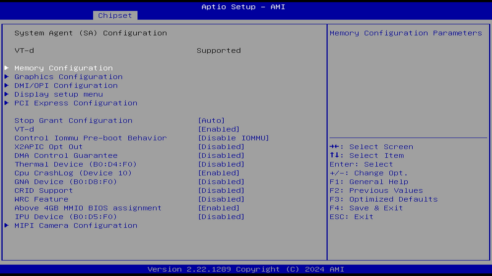
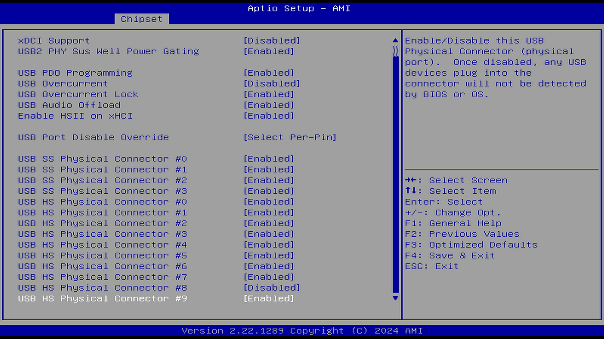

# UEFI/BIOS 注解（基于 AMI BIOS）

## 警告与免责声明

默认值通常提供了最佳性能，可在一般情况下确保系统稳定性。除非你熟悉 BIOS 设置，否则请务必使用默认值，以避免系统损坏或启动失败。

BIOS 界面、选项和设置可能因系统不同而有所差异。

本注解基于公开资料及作者个人理解整理，可能存在技术误差或表达不当或致命错误。BIOS 作为计算机硬件的关键底层固件，其设置直接影响系统稳定性和硬件安全。错误或不当配置可能导致系统崩溃、硬件损坏、数据丢失甚至设备无法启动等严重后果。本文件所述产品/系统仅限经过专门培训、具备相关资质的专业人员按照相关文档中的要求，尤其是其中的警告信息和安全指示进行操作。“具备资质的专业人员”是指那些基于其培训和经验，能够识别作业中存在的风险并避免潜在危害的人员。作者及发布单位对因依赖本注解内容而引发的任何形式或直接或间接的损失或损害不承担责任。使用前请务必做好数据备份，确保相关设置与设备兼容，并在受控环境中谨慎测试。

## 说明

### 为什么选择 AMI BIOS

根据 [The World Runs on AMI](https://www.ami.com/about-us/) 官网介绍，全球 70% 的服务器平台都采用 AMI 软件。

根据 [安迈信息科技（昆山）有限公司](https://www.ami.com.cn/) 官网介绍，AMI 为 BIOS 业界的公认领导者之一，市场占有率超过 65％。

市场上大部分英特尔迷你主机的 BIOS 都是 AMI BIOS。

因此对 AMI BIOS 进行注解是有普遍意义的。

### 技术信息

- 此注解主要面向 Intel 英特尔 x86 平台。对 AMD 平台仅具有一定的参考价值。
- 此注解主要基于 AMI BIOS 5.27。
- 文中 (R) 标志是 ®，代表注册商标；tm 是 ™，表明该图形或文字是作为商标使用的，并不是已注册的商标，一般指已向商标局发出注册申请但尚未正式注册的商标。
- 置灰的选项表示在当前状态下不可被选中。
- 带有“▶”符号的项目，表示该选项包含子菜单。

### BIOS 与 UEFI 简介

BIOS：Basic Input/Output System，基本输入输出系统，多采用汇编语言编写。BIOS 最早出现于 20 世纪 70 年代。

UEFI：Unified Extensible Firmware Interface，统一可扩展固件接口，多采用 C/C++ 编写。UEFI 的原型 EFI 最早出现在 20 世纪末。

目前主流电脑（大概从 2013 年起）配备的都是 UEFI，而不是传统的 BIOS。也就是说，现在很多人可能根本没见过真正的 BIOS，但是出于习惯（界面和操作逻辑都类似），我们仍将 UEFI 统称作 BIOS 或 UEFI BIOS。

## Main（主菜单）

​​

### 顶部标题

Aptio Setup - AMI

Aptio 设置 - AMI

## 菜单选项

| 英文菜单    | 中文翻译   |
| ----------- | ---------- |
| Main        | 主菜单     |
| Advanced    | 高级       |
| Chipset     | 芯片组     |
| Security    | 安全性     |
| Boot        | 启动       |
| Save & Exit | 保存并退出 |

### 主页面内容

#### BIOS Information（BIOS 信息）

- BIOS Vendor（BIOS 厂商）: American Megatrends（安迈科技）
- Core Version（核心版本）: 5.27
- Compliancy（兼容性）: UEFI 2.8; PI 1.7
- Project Version（项目版本）: X4-V004
- Build Date and Time（构建日期和时间）: 03/05/2025 21:22:06（2025 年 03 月 05 日 21:22:06）
- M/B Name（主板名称）: RAXDA X4
- Access Level（访问级别）: Administrator（管理员）

#### Processor Information（处理器信息）

- Name（名称）: AlderLake ULX
- Type（类型）: Intel(R) N100
- Speed（频率）: 800 MHz
- ID（编号）: 0xB06E0
- Stepping（步进）: A0

#### Memory Information（内存信息）

- Memory RC Version（内存 RC 版本）: 0.0.4.73
- Total Memory（总内存）: 16384 MB
- Memory Frequency（内存频率）: 4800 MHz

#### Language and Time（语言与时间）

- System Language（系统语言）: [English]（[英语]）

- System Date（系统日期）: [Sat 07/19/2025]（[2025 年 07 月 19 日 星期六]）

- System Time（系统时间）: [04:49:48]

### 右侧帮助信息

Choose the system default language 选择系统默认语言

### 键盘帮助（底部右侧）

- →↑↓←: Select Screen / Item

  →↑↓←：选择页面 / 项目

- Enter: Select

  Enter：选择

- +/-: Change Opt.

  +/-：更改选项

- F1: General Help

  F1：常规帮助

- F2: Previous Values

  F2：上一次的值

- F3: Optimized Defaults

  F3：加载优化默认值

- F4: Save & Exit

  F4：保存并退出

- ESC: Exit

  ESC：退出

- K/k 对右上角的提示内容向上翻页
- M/m：对右上角的提示内容向下翻页

### 底部版本信息

Version 2.22.1289 Copyright (C) 2025 AMI

版本 2.22.1289 版权所有 (C) AMI 2025 

## Advanced（高级）

重复内容不译出。

​​

### CPU Configuration（CPU 配置）

​​

​​

#### Efficient-core Information（能效核心信息）

​​

| 英文选项                   | 中文翻译     | 数值与单位（中英一致） |
| -------------------------- | ------------ | ---------------------- |
| Efficient-core Information | 能效核心信息 | —                      |
| L1 Data Cache              | L1 数据缓存  | 32 KB × 4              |
| L1 Instruction Cache       | L1 指令缓存  | 64 KB × 4              |
| L2 Cache                   | L2 缓存      | 2048 KB                |
| L3 Cache                   | L3 缓存      | 6 MB                   |

#### Performance-core Information（性能核心信息）

| 英文原文                     | 中文翻译                    |
| ---------------------------- | --------------------------- |
| ID                           | ID（识别码）                |
| Brand String                 | 品牌字符串                  |
| VMX                          | 虚拟化技术（VMX）           |
| SMX/TXT                      | 安全模式扩展 / 信任执行技术 |
| TXT Crash Code               | TXT 崩溃代码                |
| TXT SPAD                     | TXT SPAD（特殊寄存器）      |
| Boot Guard Status            | 启动保护状态                |
| Boot Guard ACM Policy Status | 启动保护 ACM 策略状态       |
| Boot Guard SACM Information  | 启动保护 SACM 信息          |

#### C6DRAM（C6 节能状态下的 DRAM 控制）

选项：

Disable（禁用）

Enable（启用）

说明：

本项是 C-state（C 状态）选项。

选择“启用”以在 CPU 进入 C6 状态时将 DRAM 内容移动到 PRM 内存中。

_C6_ 是最深级别的休眠，此时 CPU 的供电减少为 0，通常会降低 80%-90% 的功耗。

#### CPU Flex Ratio Override（CPU 可变倍频覆盖）

选项：

Disable（禁用）

Enable（启用）

说明：

启用此选项才会出现：CPU Flex Ratio Settings（CPU 可变倍频设置）。

#### CPU Flex Ratio Settings（CPU 可变倍频设置）

说明：

CPU Flex Ratio Settings（CPU 可变倍频设置）选项：

CPU 是按特定主频进行主频高低调节的（即有特定档位的变速不是无级变速）。对于 Intel 来说，不带“K”的处理器，其倍频是锁定的，修改了也是无效的。

CPU Flex Ratio Override 即 CPU 倍频设置，仅当此选项为 Enable 时，方可设置 CPU Flex Ratio Settings，即“手动设置 CPU 倍频”。

该数值必须介于最大能效比（LFM，即最低主频）和硬件设定的最大非睿频比率（HFM，即默频）之间（最低主频 ≤ 你设置的值 ≤ 默频）。

CPU 主频 \= 基准时钟（Base Clock，即外频，BIOS 中是 100 MHz _）_ × 倍频（Multiplier）

例如，CPU 倍频为 46x，基本时钟速度为 100 MHz，则时钟速度为 4.6GHz。

因此需要 x 10 来计算即可。

最高主频一般可通过官方 CPU 数据表查询，Intel 参见 [https://www.intel.cn/content/www/cn/zh/ark.html#@Processors](https://www.intel.cn/content/www/cn/zh/ark.html#@Processors)

一般 Intel 和 AMD 的最低主频均为 800MHz，可通过系统命令查询。

#### Hardware Prefetcher（硬件预取）

选项

Disable（禁用）

Enable（启用）

说明：

硬件预先访存技术。用于开启或关闭 MLC 流式预取器。在 CPU 处理指令或数据之前，它将这些指令或数据从内存预取到 L2 缓存中，借此减少内存读取的时间，帮助消除潜在的瓶颈。

#### Adjacent Cache Line Prefetch（相邻的高速缓存行预先访存）

选项

Disable（禁用）

Enable（启用）

说明：

可针对需要顺序内存访问高利用率的应用程序优化系统，能加快读取速度。如果该功能设置为 Disabled（禁用），CPU 将预取一个缓存行（64 字节）。如果设置为 Enabled（启用），CPU 将预取两个缓存行（共 128 字节）。

因为此选项在某些情况下会对性能造成负面影响（涉及 False Sharing，假共享），可对需要随机内存访问高利用率的应用程序（如数据库，科学计算等）禁用此选项。

#### Intel (VMX) Virtualization Technology（Intel 虚拟化技术）

选项

Disable（禁用）

Enable（启用）

说明：

该技术能使单个系统显示为软件中的多个独立系统。这能让多个独立的操作系统在单个系统上同时运行。

启用后，VMM 系统（虚拟机监控器）可以使用处理器对虚拟化的支持（虚拟机扩展 VMX），并利用 Vanderpool 技术（VT）硬件所提供的附加功能。

#### PECI（英特尔平台环境控制接口）

选项

Disable（禁用）

Enable（启用）

说明：

PECI，Platform Environment Control Interface，英特尔平台环境控制接口。

PECI 是英特尔专有接口，提供英特尔处理器和外部组件如超级 IO（SIO）和嵌入式控制器（EC）之间的通信通道，以提供处理器温度、超频、可配置 TDP 和内存限制控制机制和许多其他服务。PECI 用于平台热管理以及处理器功能和性能的实时控制和配置。

#### AVX（Intel 高级矢量扩展）

选项

Disable（禁用）

Enable（启用）

说明：

Intel 高级矢量扩展（Intel's Advanced Vector Extensions，AVX），是一组指令集。可以加速工作负载和用例的性能，如科学模拟、金融分析、人工智能 (AI) /深度学习、3D 建模和分析、图像和音频/视频处理、密码学和数据压缩等。

#### Active Efficient-cores（启用能效核心）

选项

ALL

3

2

1

1

说明：

即开启多少个能效核心（小核）。可完全关闭（即不使用小核）——如果你有大核的话。有的处理器是纯小核。

#### BIST（内置的自检程序）

选项

Disable（禁用）

Enable（启用）

说明：

Built-in Self Test，内置的自我测试程序。

#### AP threads Idle Manner（AP 线程空闲模式）

选项：

HALT Loop

MWAIT Loop

RUN Loop

说明：

选择启用以开启 AP 线程的空闲模式。

HALT Loop：让 CPU 进入 C1/C1E 休眠状态，但是不再继续进入更深的休眠状态

MWAIT Loop：MWAIT 指令让 CPU 停止执行，直到被监控的内存区域开始写入

RUN Loop：确保 CPU 始终处于运行状态，不进入空闲循环

AP 线程待机模式-等待运行信号。

C 状态相关设置。应用处理器（Application Processor，AP）。在计算机系统中，除引导处理器外的所有其他处理器都称为应用处理器。参见 [https://uefi.org/specs/PI/1.8/V2_DXE_Boot_Services_Protocols.html](https://uefi.org/specs/PI/1.8/V2_DXE_Boot_Services_Protocols.html?)

#### AES（AES 加密）

选项

Disable（禁用）

Enable（启用）

说明：

AES（Advanced Encryption Standard，高级加密标准），AES 被广泛接受为政府和行业应用的标准，并广泛部署在各种协议中。

此处是指 CPU 指令集。启用后（Enabled），将通过硬件支持安全加密方法 AES（高级加密标准），从而加快加密与解密的速度。

#### MachineCheck（机器检查）

选项

Disable（禁用）

Enable（启用）

说明：

这是一个调试选项。

MCE，Machine Check Exception，机器检查

MCE 是用来报告内部错误的一种硬件方式 。提供能够检测和报告硬件（机器）的错误机制，如系统总线错误、ECC 错误、奇偶校验错误、缓存错误、TLB 错误等。当发现错误时，拒绝机器重启以收集相关信息进行排错。参见 [x86 服务器 MCE（Machine Check Exception）问题](https://ilinuxkernel.com/?p=303)

#### MonitorMwait（Monitor/Mwait 指令）

选项

Disable（禁用）

Enable（启用）

说明：

启用或禁用 Monitor/Mwait 指令。

Monitor 指令用于监控某个内存区域的写入操作，而 MWait 指令则让 CPU 停止运行，直到该监控区域开始被写入。

这个是配合上面的 AP threads Idle Manner（AP 线程空闲模式）一起使用的。增强型 vSphere 计算（Enhanced vMotion Compatibility，EVC）也需要开启该选项。

#### CPU SMM Enhancement（CPU SMM 增强）

SMM，即 System Management Mode 系统管理模式，SMM 模式具有比内核模式更高的特权级别，是 CPU 的最高运行权限，运行在内核模式下的内核驱动程序只能通过 SMI 中断来访问运行在 SMM 模式下的 UEFI 固件运行时服务。参见 [以 Protocol 为中心的 UEFI 固件 SMM 提权漏洞静态检测](https://www.secrss.com/articles/53078)

#### AC Split Lock（AC 对 Split‑Lock 的处理）

选项：

Disable（禁用）

Enable（启用）

说明：

Split Lock 指跨越两个 cache line 的原子操作（如 lock add，xchg 等），在传统机制下会锁住整个总线，导致性能显著下降。

启用后，当检测到 split‑lock 操作时，会触发对齐异常，而不是锁总线。这对对实时性能或云平台尤为重要。

### Power & Performance（电源与性能）

​​

‍

| 英文术语                       | 中文翻译                            |
| ------------------------------ | ----------------------------------- |
| CPU - Power Management Control | CPU 电源管理控制                    |
| GT - Power Management Control  | 核显电源管理控制（GT 电源管理控制） |

#### CPU - Power Management Control（CPU 电源控制管理）

​​

​​

​​

##### Boot performance mode（引导性能模式）

选项：
Max Battery（节能模式）

Max Non-Turbo Performance（最大非睿频性能模式）

Turbo Performance（睿频性能模式）

说明：

在进入操作系统前选择 CPU 的性能状态。

选择 BIOS 在从复位向量（CPU 用来开始执行指令的固定内存地址）开始时设置的性能状态。

最大非睿频性能模式，能使 CPU 运行于固定的时钟频率，从而提供更稳定、更可预测的结果，有助于改善实时性。

##### Intel(R) SpeedStep(tm)（英特尔 SpeedStep 技术）

选项

Disable（禁用）

Enable（启用）

说明：

Intel SpeedStep 技术可使系统自动调节处理器电压和核心频率（使操作系统能够控制和选择 P-state），以降低功耗和减少散热。开启后可固定 CPU 睿频倍频。

让处理器在多个频率和电压点之间切换。在禁用的情况下，CPU 会按照最高频率和电压运行，避免 CPU 频率变化，有助于改善实时性。

##### Race To Halt (RTH)（一种快速休眠技术）

选项

Disable（禁用）

Enable（启用）

说明：

启用或禁用 Race to Halt（RTH）功能。RTH 会动态提高 CPU 频率，以更快进入封装级 C 状态，从而降低整体功耗。（RTH 通过 MSR 寄存器 1FC 的第 20 位控制）

是否启动 CPU 省电功能。当 CPU 有任务时全速运行，完成后进入极低功耗状态。

##### Intel(R) Speed Shift Technology（一种极速变频技术）

选项

Disable（禁用）

Enable（启用）

说明：

启用后将开放 CPPC v2 接口，允许硬件控制 P 状态。

该技术通过硬件控制的 P 状态使处理器能更快地选择其最佳工作频率和电压以实现最佳性能和能效。此功能可让用户更精准地控制 CPU 的频率，使其能够迅速跃升至最大时钟速度。

若要支持 Intel Turbo Boost Max（ITBMT，英特尔睿频加速 Max）3.0 技术，则必须开启此项。若处理器不支持 ITBMT 3.0，此项将呈现灰色，不可设定状态。

ITBMT 3.0 能识别处理器上性能最佳的内核，同时通过提高利用电源和散热器空间时所必需的频率，提高这些内核的性能。由于生产差异，处理器内核的最大潜在频率各不相同。ITBMT 3.0 可识别 CPU 上最多两个速度最快的内核，称为“青睐的内核”。然后，它会对这些内核（或该内核）应用频率提升，并将关键工作负载分配到它们。ITBMT 3.0 旨在充分利用每个内核的最高频率，参见 [英特尔® 睿频加速 Max 技术 3.0技术常见问题解答](https://www.intel.cn/content/www/cn/zh/support/articles/000021587/processors.html)。

关闭有助于改善实时性，CPU 频率和电压不会被动态调整。

##### Per Core P state OS control mode（每核心 P 状态控制）

选项

Disable（禁用）

Enable（启用）

说明：

如果启用，频率将是动态调整的；如果禁用，所有核心都将随最忙的核心一道全速运行。

使用此功能可启用或禁用每个核心 P 状态的操作系统控制模式。

禁用时将设置命令 0x06 的第 31 位为 1，当该位被设置后，所有核心将采用最高核心（最忙碌的那个）的请求作为统一的电压频率请求。

当启用时，每个物理 CPU 核心可以以不同的频率运行。

如果禁用，处理器封装内的所有核心将以所有活动线程中解析出的最高频率运行。

##### HwP Autonomous Per Core P State（HwP 自动控制下的每核心性能状态）

选项

Disable（禁用）

Enable（启用）

说明：

这是 Intel 第 12 代和第 13 代 处理器配备的技术。

禁用每核心自主 P 状态（Autonomous PCPS）后，所有核心将始终请求相同的性能状态值。HWP（Hardware Controlled Performance States，硬件性能状态）可操作系统通过 MSR 中的能效偏好字段（EPP）设置其对性能或节能的偏好。启用 HWP 后，处理器将自行根据工作负载的需求，独立选择最合适的性能状态。参见 Empowering Mixed-criticality Industrial Realtime Computing on Performance Hybrid Architecture with Intel's Dynamic Frequency Scaling Evolution [https://builders.intel.com/docs/networkbuilders/empowering-mixed-criticality-industrial-real-time-computing-with-intel-s-dvfs-evolution-1712135964.pdf](https://builders.intel.com/docs/networkbuilders/empowering-mixed-criticality-industrial-real-time-computing-with-intel-s-dvfs-evolution-1712135964.pdf)

对性能一致性有要求的用户（如实时计算等）可能需要关闭此选项。

##### HwP Autonomous EPP Grouping（HwP 自动控制下的 EPP 分组）

选项

Disable（禁用）

Enable（启用）

说明：

此选项依赖“HwP Autonomous Per Core P State（硬件自动控制的每核心性能状态）”，HwP Autonomous Per Core P State 开启时设置本选项才有意义。

启用 EPP 分组自主功能后，所有具有 EPP 的核心将请求相同的性能偏好值。

禁用 EPP 分组自主功能后，具有 EPP 的各个核心将不一定会请求相同的性能偏好值。

对性能一致性有要求的用户（如实时计算等）可能需要禁用此选项。

##### EPB override over PECI（通过 PECI 覆盖 EPB 设置）

选项

Disable（禁用）

Enable（启用）

说明：

此选项依赖于 PECI（平台环境控制接口）。

EPB，Performance and Energy Bias Hint：性能与能耗偏好提示能让软件指定其对处理器中性能与功耗权衡的偏好。

参见 [Intel Performance and Energy Bias Hint](https://docs.kernel.org/admin-guide/pm/intel_epb.html)。

是否允许系统通过 PECI 接口修改处理器的 EPB 设置，从而实现更精确的能效控制。

启用时会发送 pcode 命令 0x2b，子命令 0x3 设置为 1。此功能允许通过 OOB（带外）方式控制 EPB 的 PECI 覆盖。

##### HwP Lock（HwP 锁定）

选项

Disable（禁用）

Enable（启用）

说明：

保护硬件性能状态设置不被外部修改的开关。

##### HDC Control（HDC 控制）

选项

Disable（禁用）

Enable（启用）

说明：

HDC，Hardware Duty Cycling，英特尔硬件占空比调节技术。

开启可通过硬件自动调节占空比以节能，关闭功耗增加但也许性能更稳定。

开启：需要操作系统本身支持才生效。

##### Turbo mode（睿频模式）

选项

Disable（禁用）

Enable（启用）

说明：

允许 CPU 在节能模式下，仍然能短时提升性能。

##### View/Configure Turbo Options（查看/配置睿频选项）

​​

当前睿频设置：

| 项目                | 数值     |
| ------------------- | -------- |
| 最大睿频功率限制    | 4095.875 |
| 最小睿频 ​ 功率限制 | 0.0      |
| 封装 TOP 限制       | 6.0      |
| 功率限制 1          | 6.0      |
| 功率限制 2          | 25.0     |

###### Turbo Ratio Limit Options（睿频倍率限制选项）

​​

​​

当前睿频倍率限制设置。E 核心即小核，能效核心。

​`NumcoreX`​ 定义核心范围后，对应的 `RatioX`​ 生效。按活跃核心数独立配置睿频限制。

E-core Turbo Ratio Limit Numcores：能效核心睿频限制。在启用睿频时，E 核支持的最大活动核心数量。如果设置为 2，则最多支持 2 个小核同时进行睿频；如果值为零，则忽略此条目。

E-core Turbo Ratio Limit Ratio：能效核心睿频限制。此选项依赖于 E-core Turbo Ratio Limit Numcores。为不同数量的活动 E 核设置最大加速倍频。1 个 E 核多少倍频，2 个 E 核多少倍频，以此类推。最大值固定为 85，与核心扩展模式无关。

###### Energy Efficient P-state（节能 P 状态）

选项

Disable（禁用）

Enable（启用）

说明：

当 P-state 功能设置为 0 时：

- 将禁用对 ENERGY_PERFORMANCE_BIAS MSR 的访问；
- CPUID 的 Function 6 的 ECX 寄存器第  3 位将为 0，表示系统不支持能源效率策略设置。

当设置为 1 时：

- 将开启对 ENERGY_PERFORMANCE_BIAS MSR 的访问，允许系统设置和读取能源性能偏好值。
  简单来说：

- 0 → 禁用能源效率策略相关接口，不支持节能偏好设置。
- 1 → 启用 ENERGY_PERFORMANCE_BIAS 接口，可以调整节能与性能之间的偏好。

###### Package Power Limit MSR Lock（封装功耗限制寄存器锁定）

选项

Disable（禁用）

Enable（启用）

说明：

启用此功能后，`PACKAGE_POWER_LIMIT`​ 寄存器（MSR）将被锁定，若需解锁该寄存器，必须重启系统。

启用将不允许系统或软件在运行时修改功耗限制；禁用将允许动态修改功耗限制参数。

###### Power Limit 1 Override（功耗限制 1 覆盖）

选项

Disable（禁用）

Enable（启用）

说明：

此选项依赖 Platform PL1 Enable（启用平台 PL1）。

如果此选项被禁用，BIOS 将会使用默认值来配置功耗限制 1（Power Limit 1）和功耗限制 1 时间窗口（Power Limit 1 Time Window）。该选项可用于解锁功耗墙。

###### Power Limit 1（PL1，功耗限制 1）

该选项依赖于 Power Limit 1 Override（功耗限制 1 覆盖）。

请注意单位：1W \= 1000mW。如 5W 应设置此选项为 5000。如果设置为 `0`​，表示不启用自定义功耗限制，BIOS 将保留默认值。Platform Power Limit 1（平台功耗限制 1），单位为毫瓦（mW）。BIOS 在设置时会四舍五入到最接近的 1/8 瓦（0.125W）。

当超出限制时，CPU 的倍频会在经过一段时间后降低。下限可保护 CPU 并节省功耗，而上限则有助于提升性能。

###### Power Limit 1 Time Window（功耗限制 1 时间窗口）

选项

单位是秒。1-128 秒可选。

该值的范围可以是 0 到 128。`0`​ 表示使用默认值。

说明：

PL 1 是长期的功耗限制。

此设置表示在多长的时间窗口内，应维持平台的 TDP（热设计功耗）值。

###### Power Limit 2 Override（功耗限制 2 覆盖）

选项

Disable（禁用）

Enable（启用）

说明：

此选项依赖 Platform PL2 Enable（启用平台 PL2）。

如果此选项被禁用，BIOS 将会使用默认值来配置功耗限制 2（Power Limit 2）。该选项可用于解锁功耗墙。

###### Power Limit 2（PL2，功耗限制 2）

选项

请注意单位：1W \= 1000mW。如 5W 应设置此选项为 5000。如果设置为 `0`​，表示不启用自定义功耗限制，BIOS 将保留默认值。Platform Power Limit 2（平台功耗限制 2），单位为毫瓦（mW）。BIOS 在设置时会四舍五入到最接近的 1/8 瓦（0.125W）。

说明：

该选项依赖于 Power Limit 2 Override（功耗限制 2 覆盖）。

Power Limit 2（PL2）是短时功耗限制，允许 CPU 在短时间内突破 PL1，提供更高性能。

设定在超过长时间功率限制时，降低 CPU 倍频之前的时间长度。

###### Energy Efficient Turbo（睿频节能）

选项

Disable（禁用）

Enable（启用）

说明：

该功能会在合适的时候主动降低睿频频率以提升能效。建议仅在需要保持睿频频率恒定的超频场景下禁用，其他情况下请保持启用。

##### CPU VR Settings（CPU 电压调节器设置）

​​

Current VccIn Aux Icc Max（CPU 输入电压辅助最大电流）：108

###### PSYS Slope（PSYS 平台电源变化率）

PSYS 平台电源变化率以 1/100 为单位定义，范围为 0 到 200。

例如，要设置变化率为 1.25，输入 125。设置为 0 表示自动（AUTO）。该设置通过 BIOS VR mainbox 命令 0x9 进行控制。

参见 [第 10 代英特尔 ® 酷睿 ™ 处理器系列](https://www.intel.cn/content/dam/www/public/cn/zh/documents/datasheets/10th-gen-core-families-datasheet-vol-1-datasheet.pdf)。

###### PSYS Offset（PSYS 平台电源偏移量）

PSYS 平台电源偏移量以 1/1000 为单位定义，范围为 0 到 63999。例如，要设置偏移量为 25.348，输入 25348。该设置通过 BIOS VR mainbox 命令 0x9 进行控制。

###### PSYS Prefix（PSYS 平台电源前缀）

选项：

​`+`​

​`-`​

设置前缀，可以为正值或负值。

此项是搭配 PSYS Offset（PSYS 平台电源偏移量）使用的，用于指定是加上偏移量还是减去偏移量。

###### PSYS Pmax Power（PSYS 平台电源最大功率）

PSYS 平台电源最大功率（Pmax）以 1/8 瓦为单位定义，范围为 0 到 8192。

例如，要设置最大功率为 125 瓦，输入 1000（即 1000 × 1/8 \= 125 瓦）。设置为 0 表示自动（AUTO）。该设置通过 BIOS VR mainbox 命令 0xB 进行控制。

作用未知。

###### Min Voltage Override（覆盖最低电压）

选项

Disable（禁用）

Enable（启用）

说明：

覆盖当前的最低电压。启用以在运行时和 C8 节能状态中覆盖其最低电压。

###### Min Voltage Runtime（运行时的最低电压）

此选项依赖 Min Voltage Override（覆盖最低电压）。

运行时最低电压。范围为 0 至 1999mV，以 1/128 伏为增量单位。输入单位为毫伏(mV)。

###### Min Voltage C8（C8 节能状态的最低电压）

此选项依赖 Min Voltage Override（覆盖最低电压）。

C8 节能状态的最低电压。范围为 0 至 1999mV，以 1/128 伏为增量单位。输入单位为毫伏(mV)。

###### VccIn Aux Icc Max（CPU 输入电压辅助最大电流）

此选项用以调整 VccIn Aux 供电轨的最大电流限制，可用于超频或高负载机器。

设置 VccIn Aux（CPU 输入电压辅助最大电流）的最大 Icc 值，以 1/4A 为增量单位。范围为 0 至 512。

例如：若要设置 ICCMax 为 32A，则输入 128（32\*4）。

###### VccIn Aux IMON Slope（CPU 输入电压辅助电流检测变化率）

该选项影响系统读取电流值的准确性和调控精度。

IMON 即电流检测。该功能是一项电源管理特性，能让处理器通过 SVID 接口、借助 IMVP9.1 控制器读取 VCCIN Aux 的平均电流。

VCCIN AUX IMON 变化率，以 1/100 为增量单位。范围为 0-200。例如：若要设置 1.25 的变化率，则输入 125。输入 0 表示自动（AUTO），使用 BIOS VR mailbox 命令 0x18。

###### VccIn Aux IMON Offset（CPU 输入电压辅助电流检测偏移量）

用于修正或校准 CPU 电源轨（VCCIN Aux）上读取到的平均电流值。

VCCIN Aux IMON 偏移量，以 1/1000 为增量单位。范围为 0-63999。例如：若要设置 25.348 的偏移量，则输入 25348。IMON 使用 BIOS VR mailbox 命令 0x18。

###### VccIn Aux IMON Prefix（CPU 输入电压辅助电流检测前缀）

选项：

​`+`​

​`-`

说明：

此选项和 VccIn Aux IMON Offset（CPU 输入电压辅助电流检测偏移量） 相关。​

设置前缀，可以为正值或负值。

用于设置是加上偏移量还是减去偏移量。

###### Vsys/Psys Critical（系统电压/平台功耗临界功能）

选项：

Disabled（禁用）

Psys Critical（平台功耗临界）

Vsys Critical（系统电压临界）

说明：

该功能用于启用 Vsys/Psys Critical（临界）监控功能。当启用此功能时，系统会根据设定的阈值监控平台电源状态，以便在电压或功耗超过安全范围时采取保护措施（例如限制性能、触发告警、避免过载等）。

###### 详细说明

##### Vsys/Psys Full Scale（Vsys/Psys 满量程值）

此选项依赖 Vsys/Psys Critical（系统电压/平台功耗临界功能）。

需要 Vsys/Psys 的满量程数值。

Vsys/Psys 临界值 \= 临界阈值 ÷ 满量程值。

Vsys 的输入单位为毫伏（mV），Psys 的输入单位为毫瓦（mW），或在 ATX12VO 电源架构下为百分比（%）。

###### Vsys/Psys Critical Threshold（Vsys/Psys 临界阈值）

此选项依赖 Vsys/Psys Critical（系统电压/平台功耗临界功能）。

需要输入 Vsys/Psys 的临界阈值。

Vsys/Psys 临界比值 \= 临界阈值 ÷ 满量程值。

Vsys 的输入单位为毫伏（mV），Psys 的输入单位为毫瓦（mW），或在 ATX12VO 架构下为百分比（%）。

###### Assertion Deglitch Mantissa（断言消隐尾数）

主要用于控制信号“断言”（assertion）过程中的消隐（deglitch）行为。用以设置断言信号消隐时间，作用是平衡电路中的噪声抑制与信号响应速度。

断言消隐尾数 0x4F[7-3]（存储在 MSR/寄存器地址 0x4F 的第 7 至第 3 位）。断言消隐= 2µs × 尾数 × 2^(指数)

Assertion Deglitch Mantissa（断言消隐指数）

此选项需搭配选项 Assertion Deglitch Mantissa（断言消隐尾数）使用。

断言消隐指数 0x4F[3-0]（存储在 MSR/寄存器地址 0x4F 的第 3 至第 0 位）。断言消隐 = 2µs × 尾数 × 2^(指数)。

###### De assertion Deglitch Mantissa（解除消隐尾数）

信号解除激活时的消隐时间计算参数。类似上方的断言消隐。

断言消隐尾数 0x49[7-3]（存储在 MSR/寄存器地址 0x49 的第 7 至第 3 位）。断言消隐= 2µs × 尾数 × 2^(指数)

###### De assertion Deglitch Mantissa（断言消隐指数）

断言消隐指数 0x49[3-0]（存储在 MSR/寄存器地址 0x49 的第 3 至第 0 位）。断言消隐 \= 2µs × 尾数 × 2\^(指数)。

###### VR Power Delivery Design（电源调节器供电架构设计）

选项：

AUTO (0)：使用主板 ID 自动确定主板设计。

其他值：将覆盖主板 ID 逻辑，强制指定设计配置。

说明：

自定义 VR 供电设计值，此选项主要用于验证场景。

该功能用于控制用于 VR 设置覆盖值的 ADL 台式机主板设计。此选项将根据主板 ID 来判断使用哪种主板设计。

###### Acoustic Noise Settings（声学噪音设置）

​​

选项

Disable（禁用）

Enable（启用）

说明：

Acoustic Noise Mitigation（噪声抑制功能）：启用此选项可减轻特定型号的 CPU 在深度 C 状态时的噪声问题。

开启此选项，方可设置下方选项：

- Pre Make Time（预触发时间）：设置最大预触发随机化时间（微刻度单位）。范围为 0-255。该参数用于声学噪声抑制的动态周期调整（DPA）调校。
- Ramp Up Time（上沿时间）：指 CPU 或电源性能从低到高的过渡时间。设置最大上升沿随机化时间（微刻度单位）。有效范围 0-255。该参数用于声学噪声抑制的动态周期调校（DPA）优化。
- Ramp Down Time（下沿时间）：指 CPU 或电源性能从高到低的过渡时间。设置最大下降沿随机化时间（微刻度单位）。有效范围 0-255。该参数用于声学噪声抑制的动态周期调校（DPA）优化。
- IA VR Domain（Intel Architecture Voltage Regulator，处理器计算核心电压调节域）

  - Disable Fast PKG C State Ramp for  
    VccIn Domain（禁用快速 PKG C 状态切换）：选项：FALSE/TRUE。FALSE: 在深度 C 状态下启用快速切换；TRUE: 在深度 C 状态下禁用快速切换
  - Slow Slew Rate for IA Domain（处理器核心电压调节域慢速压摆率设置）：选项：Fast/2、Fast/4、Fast/8、Fast/16。设置深度封装 C 状态切换的 VR VccIn（CPU 主供电输入电压）慢速压摆率。慢速压摆率 \= 快速模式压摆率 / 等分系数（可选 2/4/8/16），通过降低压摆率减轻声学噪声。

- GT VR Domain（Graphics Technology Voltage Regulator，核显电压调节域）

  - Disable Fast PKG C State Ramp for  
    VccIn Domain（禁用快速 PKG C 状态切换）：选项：FALSE/TRUE。FALSE: 在深度 C 状态下启用快速切换；TRUE: 在深度 C 状态下禁用快速切换
  - Slow Slew Rate for GT Domain（  
    核显电压调节域慢速压摆率设置）：选项：Fast/2、Fast/4、Fast/8、Fast/16。设置深度封装 C 状态切换的 VR GT（核显电压调节域）慢速压摆率。慢速压摆率 \= 快速模式压摆率 / 等分系数（可选 2/4/8/16），通过降低压摆率减轻声学噪声。

###### Core/IA VR Settings（核心/英特尔架构电压调节设置）

​​

​​

| 英文参数                  | 中文参数           |    数值 |
| :------------------------ | :----------------- | ------: |
| VR Config Enable          | 启用电压调节配置   | Enabled |
| Current AC Loadline       | 当前交流负载线     |     500 |
| Current DC Loadline       | 当前直流负载线     |     500 |
| Current Psi1 Threshold    | 当前 PSI1 阈值     |       0 |
| Current Psi2 Threshold    | 当前 PSI2 阈值     |      20 |
| Current Psi3 Threshold    | 当前 PSI3 阈值     |       4 |
| Current Imon Slope        | 当前电流检测变化率 |       0 |
| Current Imon Offset       | 当前电流检测偏移量 |       1 |
| Current VR Current Limit  | 当前电压调节器限制 |     148 |
| Current Tdc Current Limit | 当前热设计电流限制 |     208 |
| Current Voltage Limit     | 当前电压限制       |    1600 |

VR Config Enable（启用电压调节配置）

选项

Disable（禁用）

Enable（启用）

是以下选项存在的先决条件。

- AC Loadline（交流负载线）：交流负载线以 0.01 毫欧（1/100 mOhms）为单位定义（取值范围：0–6249（对应 0–62.49 毫欧）。该配置通过 BIOS mailbox 命令 0x2 实现。数值换算关系：

  - ​`100`​ \= 1.00 毫欧（mOhm）
  - ​`1255`​ \= 12.55 毫欧（mOhm）
    -​`0`​​ 表示自动/硬件默认值（AUTO/HW default）

- DC Loadline（直流负载线）：直流负载线以 0.01 毫欧（1/100 mOhms）为单位定义（取值范围：0–6249（对应 0–62.49 毫欧）。该配置通过 BIOS mailbox 命令 0x2 实现。数值换算关系：

  - ​`100`​ \= 1.00 毫欧（mOhm）
  - ​`1255`​ \= 12.55 毫欧（mOhm）
  - ​​`0`​​ 表示自动/硬件默认值（AUTO/HW default）

- PS Current Threshold1（即 Power Stage Current Threshold1，电源阶段电流阈值 1）：此值以每 1/4 安培为单位递增，例如设置为 400 表示电流阈值为 100 安培（400 × 0.25A）。其取值范围为 0 到 512，对应实际电流为 0 到 128 安培。设置为 0 表示启用自动模式（AUTO）。该参数通过 BIOS VR mailbox 命令 0x3 进行设置。

- PS Current Threshold2（即 Power Stage Current Threshold2，电源阶段电流阈值 2）：此值以每 1/4 安培为单位递增，例如设置为 400 表示电流阈值为 100 安培（400 × 0.25A）。其取值范围为 0 到 512，对应实际电流为 0 到 128 安培。设置为 0 表示启用自动模式（AUTO）。该参数通过 BIOS VR mailbox 命令 0x3 进行设置。
- PS Current Threshold3（即 Power Stage Current Threshold3，电源阶段电流阈值 3）：此值以每 1/4 安培为单位递增，例如设置为 400 表示电流阈值为 100 安培（400 × 0.25A）。其取值范围为 0 到 512，对应实际电流为 0 到 128 安培。设置为 0 表示启用自动模式（AUTO）。该参数通过 BIOS VR mailbox 命令 0x3 进行设置。
- PS3 Enable（Power Stage 3，电源阶段 3）：启用/禁用。该配置通过 BIOS 电压调节器 mailbox 命令 0x3 实现。
- PS4 Enable（Power Stage 4，电源阶段 4）：启用/禁用。该配置通过 BIOS 电压调节器 mailbox 命令 0x3 实现。
- IMON Slope（电流检测变化率）：此值以 1/100 为增量单位定义，取值范围为 0 到 200。例如，要设置变化率为 1.25，则输入 125。设置为 0 表示自动模式（AUTO）。此参数通过 BIOS VR mailbox 命令 0x4 进行配置。用于高精度电源校准。
- IMON Offset（电流检测偏移量）：此值以 1/1000 为单位定义，取值范围为 0 到 63999。例如，如果要设置偏移量为 25.348，则应输入数值 25348。此参数通过 BIOS VR mailbox 命令 0x4 进行配置。用于微调 VR（电压调节器）的电流感应值，以提高功耗报告的准确性或满足电源调校需求。

  - IMON Prefix（电流检测前缀）：`+`​/`-`。用设置加/减​电流检测偏移量。

- VR Current Limit（电压调节器当前限制）：电压调节器电流限制（Icc Max）代表允许 CPU 在任意时刻瞬间拉取的最大电流。该值以 1/4 安培（A）为单位定义，例如输入 `400`​ 表示 100 A（400 × 0.25A）。取值范围为 0–512，对应实际电流 0–128 A；输入 `0`​ 表示启用自动模式。该设置通过 BIOS VR mailbox 命令 ​`0x6`​​ 进行控制。
- VR Voltage Limit（电压调节器电压限制）：Voltage Limit (VMAX)这是用于设置电压调节器（VR）允许的最大瞬时输出电压，单位为毫伏（mV）。其取值范围为 0–7999 mV。此设置通过 BIOS VR mailbox 命令 0x8 进行控制。
- TDC Enable（Thermal Design Current，热设计电流）：CPU 平均*电流*不能超过此值。选项：Disable（禁用）/Enable（启用）。此选项决定了：

  - TDC Current Limit（热设计电流当前限制）：以 1/8 安培（A）为递增单位定义，取值范围为 0–32767。例如，如果要设置最大瞬时电流为 125 A，应输入 1000（1000 × 0.125 A \= 125 A）。输入 `0`​ 表示设置为自动模式（0 A）。该参数通过 BIOS 的 VR mailbox 命令 ​`0x1A`​​ 进行配置。
  - TDC Time Window（热设计电流时间窗口）：值：1-448。电压调节器热设计电流时间窗口限制。是指在特定时间内，CPU 可承受的最大电流（TDC Current Limit）所允许的持续时间。其单位为毫秒（ms），用于控制 CPU 在高负载下的电流限制响应时间。
  - TDC Lock（锁定热设计电流）:启用/禁用。可锁定持续电流上限，防止损坏芯片。

- IRMS：启用/禁用。IRMS \= 电流（电流的符号是 I）有效值（Current Root Mean Square），实时电流有效值监测。

###### GT VR Settings（核显电压调节设置）

​​

​​

所有选项均参见 Core/IA VR Settings（核心/英特尔架构电压调节设置）。

###### RFI Settings（Radio Frequency Interference，射频干扰设置）

​​

RFI Current Frequency（当前 RFI 频率）：139.200MHz

- RFI Frequency（RFI 频率）：设置目标 RFI 频率（Set desired RFI Frequency）

  - 调节单位：以 100 千赫兹（100KHz）为步进
  - 频率范围：130 MHz 至 160 MHz
  - 默认硬件频率：139.6 MHz
  - 输入值 = 目标频率（MHz） × 10
  （例如：需设置 139.6 MHz 时 → 输入 1396）

- RIVR Spread Spectrum（Fully Integrated Voltage Regulator，全集成电压调节器）：启用/禁用。全集成电压调节器展频。可降低峰值辐射强度，减少对特定频率的干扰。

- RFI Spread Spectrum（RFI 射频展频）。0.5%-6%。用于缓解电磁干扰（EMI）。

##### Platform PL1 Enable（启用平台 PL1）

选项

Disable（禁用）

Enable（启用）

说明：

这是是否允许修改 PL1 的总开关。是启用/禁用平台功耗限制  1（Platform Power Limit 1，PL1）的编程设置。

启用（Enabled）：BIOS 会激活并写入 PL1 值，处理器会在指定时间窗口内以该值限制平均功耗。 

禁用（Disabled）：BIOS 不编程 PL1，此时处理器将使用默认或平台固件设定的限制值。

##### Platform PL1 Power（平台 PL1 功耗）

说明：

此选项依赖 Platform PL1 Enable（启用平台 PL1），这是 BIOS 存储的待生效 PL1 值（可能执行）。实际执行的是 Power Limit 1（如已设置）。

平台功耗限制  1”（Platform Power Limit 1，简称 PL1）以毫瓦（mW）为单位设置。BIOS 在编程时会将其四舍五入到最接近的  1/8 瓦。你可以在由 `PACKAGE_POWER_SKU_MSR`​ 指定的最小功耗限制和最大功耗限制之间设置任意值。例如，如果你想设置为  12.50  瓦，就输入  `12500`​。该设置会成为处理器 RAPL 算法（用于监控功耗并控制频率和电压的闭环控制算法）中的新 PL1 值。

##### Platform PL1 Time Window（平台 PL1 窗口时间）

说明：

此选项依赖 Platform PL1 Enable（启用平台 PL1）。

平台功耗限制 1 时间窗口，单位为秒。该值的范围为 0 到 128。0 表示使用默认值。该选项用于指定平台 TDP（热设计功耗）应当维持的时间窗口。

##### Platform PL2 Enable（启用平台 PL2）

选项

Disable（禁用）

Enable（启用）

说明：

这是是否允许修改 PL2 的总开关。是启用/禁用平台功耗限制  2（Platform Power Limit 2，PL2）的编程设置。

启用（Enabled）：BIOS 会激活并写入 PL2 值，处理器会在指定时间窗口内以该值限制平均功耗。

禁用（Disabled）：BIOS 不编程 PL2，此时处理器将使用默认或平台固件设定的限制值。

##### Platform PL2 Power（平台 PL2 功耗）

说明：

此选项依赖 Platform PL2 Enable（启用平台 PL2），这是 BIOS 存储的待生效 PL2 值（可能执行）。实际执行的是 Power Limit 2（如已设置）。
平台功耗限制  2（Platform Power Limit 2，简称 PL2）以毫瓦（mW）为单位设置。BIOS 在编程时会将其四舍五入到最接近的  1/8 瓦。你可以在由 `PACKAGE_POWER_SKU_MSR`​ 指定的最小功耗限制和最大功耗限制之间设置任意值。例如，如果你想设置为  12.50  瓦，就输入  `12500`​。该设置会成为处理器 RAPL 算法（用于监控功耗并控制频率和电压的闭环控制算法）中的新 PL2 值。

##### Power Limit 4 Override（PL4 覆盖，功耗限制 4 覆盖）

Power Limit 4（功耗限制 4），单位为毫瓦（mW）。BIOS 在编程时会四舍五入到最接近的 1/8 瓦。例如：如果要设置为 12.50W，应输入 12500。如果该数值设置为 0，BIOS 将保留默认值。

##### Power Limit 4（PL4，功耗限制 4）

Power Limit 4（功耗限制 4），单位为毫瓦（mW）。BIOS 在编程时会四舍五入到最接近的 1/8 瓦。例如：如果要设置为 12.50W，应输入 12500。如果该数值设置为 0，BIOS 将保留默认值。

##### Power Limit 4 Lock（PL4，锁定功耗限制 4）

选项

Disable（禁用）

Enable（启用）

说明：

是否允许在操作系统中动态修改 PL4 设置。Power Limit 4 MSR 601h Lock（功耗限制 4 锁定寄存器）
当启用此选项时，PL4（功耗限制 4）配置将在操作系统运行期间被锁定，不可更改；当禁用此选项时，操作系统运行期间仍可以更改 PL4 配置。

启用 \= 锁定；禁用 \= 可调。

##### C states（C 状态）

选项

Disable（禁用）

Enable（启用）

说明：

当启用时，所有 CPU 核心进入 C 状态（空闲状态）时，CPU 会自动切换到最低运行频率以降低功耗。

该选项允许在 CPU 并未 100% 利用时，让其进入 C 状态（低功耗空闲状态），以降低整体功耗。

注：CPU/封装睡眠状态：

C0 - 活动： CPU 打开并运行。

C1 - 自动停止： 内核时钟已关闭。处理器没有执行指令，但几乎可以立即返回到执行状态。某些处理器还支持增强型 C1 状态 （C1E），以降低功耗。

C2 - 停止时钟： 内核时钟和总线时钟已关闭。该处理器保持所有软件可见状态，但可能需要更长的时间才能唤醒。

C3 - 深度睡眠： 时钟生成器已关闭。处理器无需保持其高速缓存一致性，但能保持其他状态。某些处理器具有 C3 状态（深度睡眠、深度睡眠）的变体，与唤醒处理器所需的时间不同。

C4 - 更深度的睡眠： 降低 VCC

DC4 - 更深度的 C4 睡眠： 进一步减少 VCC

参见 [处理器深度和深度睡眠状态之间的差异](https://www.intel.cn/content/www/cn/zh/support/articles/000006619/processors/intel-core-processors.html)

该选项决定了以下选项：

###### Enhanced C-states（增强型 C 状态，即 C1E）

选项：

Disable（禁用）

Enable（启用）

说明：

启用/禁用 C1E 功能。

当启用时，所有 CPU 核心进入 C 状态（空闲状态）时，CPU 会自动切换到最低运行频率以降低功耗。

###### C-State Auto Demotion（C 状态自动降级）

选项：

Disable（禁用）

C1

说明：

使用此功能可以防止 CPU 频繁进入 C 状态，从而改善延迟表现。意味着当 CPU 处于深度 C 状态（如 C6 或更深）时，如果系统认为需要更快地响应，CPU 会自动降级到 C1 状态。

###### C-State Un-demotion（C 状态取消降级）

选项：

Disable（禁用）

C1

说明：

当处理器在检测到先前的 C 状态降级决策不合适时，自动恢复到原本请求的更深 C 状态。配置处理器 C 状态不自动降级。

###### Package C-State Demotion（封装 C 状态自动降级）

选项：

Disable（禁用）

Enable（启用）

说明：

当一颗 CPU 的所有核心进入深度 C 状态时，那么整个 CPU 的 package（CPU 封装，指整块 CPU）就可以进入这些状态。

###### Package C-State Un-demotion（封装 C 状态取消降级）

选项：

Disable（禁用）

Enable（启用）

说明：

配置 CPU 封装 C 状态不自动降级。

##### CState Pre-Wake（C 状态预唤醒）

选项：

Disable（禁用）

Enable（启用）

说明：

其作用是减少 CPU 从深度 C 状态（如 C6、C7）恢复时的延迟。启用此功能时，系统会在 CPU 进入深度空闲状态之前，提前进行一些准备工作，以便在需要时能够更快地恢复到活动状态。
若禁用：会将 POWER_CTL 寄存器（MSR 0x1FC）的第 30 位设置为 1，从而禁用 C 状态预唤醒（Cstate Pre-Wake）功能。

##### IO MWAIT Redirection（IO MWAIT 重定向）

选项：

Disable（禁用）

Enable（启用）

说明：

设置后，系统将把发送到 IO 寄存器的 IO_read 指令映射到 MWAIT（偏移量），映射地址为 PMG_IO_BASE_ADDRBASE + 偏移量。

通过将 I/O 读操作重定向到 MWAIT，系统可以在等待 I/O 操作完成时降低功耗，提升能效。

开启后，处理器将进入最低功耗的空闲状态，直到发生指定的事件。

##### Package C State Limit（封装 C 状态限制）

选项：

C0 / C1 / C2 / C3 / C6 / C7 / C7S / C8 / C9 / C10 / Cpu Default / Auto

说明：

最大封装 C 状态限制设置。

指定处理器在空闲时可以进入的最深电源管理状态。该设置影响整个处理器包（Package）的电源管理行为，而不仅仅是单个核心。

对 CPU、PCIe、内存、显卡的 C 状态支持。

CPU 默认：保持出厂默认值；

自动：初始化为可用的最深封装 C 状态限制。

##### C6/C7 Short Latency Control (MSR 0x60B)（C6/C7 短时延迟控制）

快速中断响应

- Time Unit：时间单位：用于 IRTL（Interrupt Response Time Limit，中断响应时间限制）值的第 12 到第 10 位的度量单位。这是一种用于设置响应中断最大允许延迟的机制。单位 ns 代表纳秒。
- Latency：中断响应时间限制值（IRTL）的第 [9:0] 位，输入范围为 0 到 1023。配合上面设定的“时间单位”，来确定 CPU 从进入低功耗状态（如 C-state）到能够响应中断的最大延迟时间。

##### C6/C7 Long Latency Control (MSR0x60C)（C6/C7 长时延迟控制）

深度休眠后的中断响应

选项同上。

##### C8 Latency Control (MSR 0x633)（C8 延迟控制）

选项同上。

##### C9 Latency Control (MSR 0x634)

C9 延时控制

选项同上。

##### C10 Latency Control (MSR 0x635)（C10 延时控制）

选项同上。

##### Thermal Monitor（热量监控程序）

选项：

Disable（禁用）

Enable（启用）

说明：

此选项和 PECI 相关设置存在关联。

Intel CPU 热量监控程序/过温防护功能。当温度过高时会对 CPU 进行降频降速以降温。

##### Interrupt Redirection Mode Selection（选择逻辑中断的重定向模式）

选项：

Fixed Priority（固定优先级）

Round robin（轮询）

Hash Vector（哈希向量）

No Change（不改变）

说明：

- Fixed Priority 为固定优先级，中断固定重定向到特定处理器核心，适合高确定性任务。

- Round robin 为轮询，中断在多个处理器间轮流分配。

- Hash Vector 利用哈希算法将中断分布到多个 CPU（适合多队列网卡）

- No Change 保留现有设置，不更改中断路由策略

##### Timed MWAIT（定时 MWAIT）

选项：

Disable（禁用）

Enable（启用）

说明：

此选项和 MWAIT 相关设置有关。

是否允许操作系统使用带定时功能的 MWAIT 进入深度空闲状态。若禁用则采用普通中断。

##### Custom P-state Table（添加自定义 P 状态表）

​​

###### Number of custom P states

设置自定义 P 状态（性能状态）的数量。至少必须存在 2 个状态。P 状态越多频率调节越精细化。

0 代表禁用此选项。

##### EC Turbo Control Mode（EC 睿频控制模式）

选项：

Disable（禁用）

Enable（启用）

###### AC Brick Capacity（交流电源适配器容量）

选项：

90W AC Brick

65W AC Brick

75W AC Brick

说明：

指定交流电源适配器（AC 适配器）容量，即交流电源适配器（AC Brick） 的额定功率容量（W）

###### EC Polling Period（嵌入式控制器 EC 轮询周期）

查询（轮询）EC 状态或数据的时间间隔

数值从 1 到 255，对应时间范围为 10 毫秒 到 2.55 秒（1 个计数单位 \= 10 毫秒）。

###### EC Guard Band Value（嵌入式控制器 EC 保护带值）

用于定义在执行关键操作（如电源管理、系统初始化、硬件检测等）时，嵌入式控制器（EC）允许的最大误差范围。

计数范围从 1 到 20，对应的功率范围为 1 W 到 20 W。

###### EC Algorithm Selection（嵌入式控制器算法选择）

用于选择算法的数值范围是 1 到 10。每个数值代表一种不同的嵌入式控制器（EC）运行策略。

##### Energy Performance Gain（能效性能增益）

选项：

Disable（禁用）

Enable（启用）

说明：内存电源相关设置。

作用未知

###### EPG DIMM Idd3N（主动待机电流）

来自数据手册的主动待机电流（Active standby current，Idd3N），单位为毫安。必须以每个 DIMM（内存条）为单位进行计算。

###### EPG DIMM Idd3P（主动掉电电流）

来自数据手册的主动掉电电流（Active power-down current，Idd3P），单位为毫安。必须以每个 DIMM（内存条）为单位进行计算。

##### Power Limit 3 Settings（电源限制 3 设置，PL3）

超短峰值功率限制，用于极短时间内处理高强度突发工作

​​

##### Power Limit 3 Override

覆盖电源限制 3，PL 3

选项参数均同 PL1。

##### CPU Lock Configuration（CPU 锁定设置）

​​

###### CFG Lock（CFG 锁）

选项：

Disable（禁用）

Enable（启用）

说明：

关闭或者开启 MSR 0xe2 寄存器，电源管理相关。控制 MSR 0xE2 的低 16 位（bits[15:0]）开关。

MSR 0xE2 是 Model Specific Register 的一个寄存器位数锁定，属于非标准寄存器，是用来控制 CPU 的工作环境和读取工作状态，例如电压、温度、功耗等非程序性指标。如果 CFG Lock 是开启状态（即 MSR 0xE2 是被锁定的），那么 MSR 0xE2 就是只读的。

如果使用黑苹果（Hackintosh），则需要关闭此选项，允许系统写入此寄存器。

Hyper V 可能某些功能需要关闭此选项。

###### Overclocking Lock（超频锁定）

超频锁定（位于 FLEX_RATIO MSR 寄存器的第 20 位，地址为 194）

Intel 处理器带 K 才能超频。

#### GT - Power Management Control（核显电源管理控制）

Intel Graphics Technology 即 GT，图形技术。

##### Maximum GTT frequency（图形执行管理器最大频率）

GTT：Graphics Translation Table，图形执行管理器

用户限制的最大 GT 频率。可选择 200MHz（RPN）或 400MHz（RP0）。超出范围的数值将被限制到该 SKU 支持的最小值或最大值。

##### Disable Turbo GT frequency（禁用显卡睿频）

选项：

Disable（禁用）

Enable（启用）

说明：

启用：禁用显卡睿频。禁用：显卡频率不受限制。

### PCH-FW Configuration（平台控制器中枢和固件配置）

PCH：Platform Controller Hub，平台控制器中枢（即南桥）。简而言之，芯片组-固件配置

#### ME State（Intel 管理引擎状态）

选项：

Disable（禁用）

Enable（启用）

说明：

开启或关闭 ntel 管理引擎。

ME：Intel Management Engine，Intel 管理引擎状态。英特尔 ® 管理引擎是一个嵌入式微控制器（集成在某些英特尔芯片组上），运行一个轻量级微内核操作系统，为基于英特尔 ® 处理器的计算机系统提供各种功能和服务。

参见 [什么是英特尔 ® 管理引擎？](https://www.intel.cn/content/www/cn/zh/support/articles/000008927/software/chipset-software.html)

#### ME Unconfig on RTC Clear（当重置 RTC 时不会重置 ME）

选项：

Disable（禁用）

Enable（启用）

说明：

当设置为 Disabled 时，在执行 RTC Clear（清除实时时钟 RTC 的随机存取内存）操作后不会重置/清除配置 ME。

当设置为 Enable 时，在执行 RTC Clear（清除实时时钟 RTC 的随机存取内存）操作后会重置/清除配置 ME。

#### Comms Hub Support（Comms 总线支持）

选项：

Disable（禁用）

Enable（启用）

说明：

部分嵌入式设备需要此总线，常见于工业物联网。按需开启。

#### JHI Support（JHI 支持）

选项：

Disable（禁用）

Enable（启用）

说明：

需要操作系统支持。工业物联网可能会用到此选项，按需开启。

JHI：Intel® DAL（Dynamic Application Loader） Host Interface Service，Intel 动态应用加载器主机接口服务

英特尔 ® 动态应用加载器（Intel® DAL）是英特尔 ® 平台的一项独特功能，适用于多种形态的设备，包括工作站、台式机、笔记本、平板电脑和物联网设备。它可用于在英特尔 ® 融合安全与管理引擎固件上运行小段 Java\* 代码。

参见 [Intel® Dynamic Application Loader](https://www.intel.com/content/www/us/en/developer/tools/dal/overview.html)

#### Core Bios Done Message（核心 BIOS 初始化完成信息）

选项：

Disable（禁用）

Enable（启用）

说明：

BIOS 在完成核心 DXE 阶段后向 ME / BMC 发出的信号，意味着系统已完成对 Option ROM 的初始化。

是否将核心 BIOS 初始化完成信息发送给 Intel 管理引擎。作用：触发安全策略（如 KCS Trust）、同步双方状态，保障后续启动与管理流程顺利进行。

参见 https://github.com/Intel-BMC/host-misc-comm-manager

#### Firmware Update Configuration（固件更新配置）

配置 Intel 管理引擎技术参数。

##### ME FW Image Re-Flash（Intel 管理引擎映像重新刷写）

选项：

Disable（禁用）

Enable（启用）

控制是否允许重新刷写 Intel 管理引擎的固件的开关。

##### FW Update（固件更新）

选项：

Disable（禁用）

Enable（启用）

说明：

控制是否允许更新 Intel 管理引擎的固件。

#### PTT Configuration（Intel 可信平台技术配置）

PTT：Platform Trust Technology，Intel 可信平台技术。如果要安装 Windows 11，需要开启此功能。

英特尔 ® PTT 是符合 2.0 规范并提供与独立 TPM 相同的功能的集成 TPM，只是它驻留在系统的固件中，因此无需专用处理或内存资源。

参见 [什么是可信平台模型 （TPM） 及其与英特尔 ® Platform Trust Technology （英特尔 ® PTT） 的关系？](https://www.intel.cn/content/www/cn/zh/support/articles/000094205/processors/intel-core-processors.html)

##### TPM Device Selection（TPM 设备选择）

选项：

dTPM

PTT

PTT 在 SkuMgr 中启用 PTT。

dTPM 1.2 在 SkuMgr 中禁用 PTT。

警告！如果要禁用 PTT/dTPM，那么存储在其中的所有数据都将丢失（如 BitLocker 恢复密钥）。

SkuMgr 是 BIOS 中的一个模块，用于管理系统的硬件配置和功能启用。

TPM 或受信任的平台模块是一种驻留在计算机主板或其处理器中的物理或嵌入式安全技术（微控制器）。TPM 使用加密技术来帮助在电脑上安全地存储基本和关键信息，以启用平台身份验证。

#### FIPS Configuration（联邦信息处理标准配置）

FIPS 140-2（Federal Information Processing Standard 140-2），联邦信息处理标准(FIPS) 出版物吧 140-2 是美国政府标准，它定义了信息技术产品中加密模块的最低安全要求

联邦信息处理标准（FIPS） 指定了联邦政府对加密模块的要求。

##### FIPS Mode Select（联邦信息处理标准模式选择）

选项：

Disable（禁用）

Enable（启用）

说明：

在启用 FIPS 模式后，系统将强制使用符合 FIPS 认证的加密算法和操作，确保数据处理的安全性和合规性。

#### ME Debug Configuration（Intel 管理引擎调试配置）

##### HECI Timeous（HECI 超时）

选项：

Disable（禁用）

Enable（启用）

说明：

HECI，Host Embedded Controller Interface，增强型主机控制器接口。EHCI 控制 USB 2.0。

控制 HECI 发送/接收超时。

启用此功能后，如果主机操作系统在规定时间内未能与管理引擎建立通信，系统可能会中止该过程并报告超时错误。

增强型主机控制器接口（EHCI）规范描述了通用串行总线（USB）修订版 2.0 的主机控制器的寄存器级接口。该规范包括对系统软件和主机控制器硬件之间的硬件和软件接口的描述。

参见 [Enhanced Host Controller Interface Specification](https://www.intel.com/content/www/us/en/products/docs/io/universal-serial-bus/ehci-specification.html)

##### Force ME DID Init Status（强制初始化 Intel 管理引擎（ME）的设备标识符）

选项：

Disable（禁用）

Enable（启用）

说明：

启用此选项后，系统会在启动时强制初始化 Intel 管理引擎的设备标识符

##### CPU Replaces Polling Disable（禁用 CPU 更换轮询）

选项：

Disable（禁用，禁止 CPU 替代轮询，由其他机制处理轮询任务）

Enable（启用，允许 CPU 进行替代式轮询操作）

说明：

启用此选项将禁用 CPU 更换轮询循环。此设置多见于嵌入式 / IoT 或服务器硬件。

##### ME DID Message（Intel 管理引擎的设备标识符信息）

选项：

Disable（禁用）

Enable（启用）

说明：

控制 Intel 管理引擎的设备标识符消息（禁用将阻止发送设备标识符消息）。Intel 管理引擎需要开启此选项。

##### HECI Message check Disable（禁用 HECI 信息检查）

选项：

Disable（禁用）

Enable（启用）

说明：

HECI 是 USB 2.0 控制器。

BIOS 在自检后等待 Intel 管理引擎应答的总线校验机制。

设置此选项可在发送 BIOS 启动路径消息时禁用消息校验。

##### MBP HOB Skip（跳过 MBP HOB）

选项：

Disable（禁用）

Enable（启用）

说明：

MBP，Memory Based Protection Hand‑Off Blocks，基于内存的保护接续块

启用后，BIOS 在启动过程中会跳过 Intel 管理引擎的 Memory‑Based Protection（MBP）的 HOB 区域（主要用于描述内存保护区域的信息），即不创建或不处理该区域内的 HOB（Hand‑Off Blocks）。

调试 Intel 管理引擎用。

##### HECI2 Interface Communication（HCEI2 接口通信）

选项：

Disable（禁用）

Enable（启用）

说明：

添加和移除 PCI 空间中的 HECI2 设备。

HCEI2（Host Embedded Controller Interface 2，主机嵌入式控制器接口 2）接口通信是 Intel 管理引擎与操作系统之间的通信接口。Intel 管理引需要此选项。

##### KT Device（KT 设备）

控制 KT 设备

Disable（禁用）

Enable（启用）

说明：

KT 设备即 Intel 管理引擎的硬件接口设备，操作系统通过该设备与 Intel 管理引擎进行通信。

##### DOI3 Setting for HECI Disable（DOI3 设置：用于禁用 HECI）

选项：

Disable（禁用）

Enable（启用）

说明：

软禁用英特尔管理引擎。

软禁用的工作原理是让系统固件通过主机嵌入式控制器接口（HECI）发送“SET_ME_DISABLE”命令。这会命令管理引擎进入禁用状态。管理引擎将保持禁用状态，直到发送“ENABLE”命令。此方法被视为一种通用方法，因为它不需要实现特定于平台或处理器的代码。

参见 [Disabling the Intel Management Engine (ME)](https://kb.protectli.com/kb/me-disable/)

##### MCTP Broadcast Cycle（MCTP 周期性广播）

选项：

Disable（禁用）

Enable（启用）

说明：

管理组件传输协议广播周期及设置 PMT 为总线所有者。用于配置管理组件传输协议（MCTP）的周期性广播。

MCTP（Management Component Transport Protocol，管理组件传输协议）是一种独立于物理介质的协议，用于计算机系统中各部件之间的信息交互。此协议独立于底层物理总线，是一种独立于总线的“数据链路层”协议。

Intel 管理引擎的设备发现和管理功能需要。

参见 [H3C HDM MCTP 技术白皮书-6W101](https://www.h3c.com/cn/Service/Document_Software/Document_Center/Home/Public/00-Public/Learn_Technologies/White_Paper/H3C_HDM_MCTP_WP-848/)

#### Anti-Rollback SVN Configuration（防回滚 SVN 配置）

Anti-Rollback SVN Configuration 是一个用于配置 Intel 管理引擎（ME） 固件版本控制的选项。该功能通过引入安全版本号（SVN），防止系统降级至较旧或潜在存在安全漏洞的固件版本，从而增强系统的安全性。

##### Automatic HW-Enforced Anti-Rollback SVN（自动硬件强制防回滚 SVN）

选项：

Disable（禁用）

Enable（启用）

说明：

启用后，将自动激活硬件强制的防回滚机制：一旦平台成功运行过某个版本的 ME 固件，所有具有更低 ARB-SVN（防回滚安全版本号）的固件将被禁止执行。

##### Set HW-Enforced Anti-Rollback for Current SVN（为当前 SVN 设置硬件强制防回滚机制）

选项：

Disable（禁用）

Enable（启用）

说明：

为当前 ARB-SVN 值（ARB 即 Anti-Rollback，反回滚）启用硬件强制的防回滚机制。具有较低 ARB-SVN 的固件将被禁止执行。该值在命令发送后将恢复为禁用状态。

#### OEM Key Revocation Configuration（OEM 密钥吊销配置）

“OEM Key Revocation Configuration BIOS” 是 BIOS/UEFI 中管理 OEM 密钥吊销机制的选项，通常用于控制是否启用针对预装系统 OEM 密钥或证书的废止管理。

让 BIOS 通过 HECI 指令吊销（作废）CSME/ME 中的 OEM 密钥，以提升平台安全、避免旧/受损密钥继续被信任。

安全启动会用到。

##### Automatic OEM Key Revocation（OEM 密钥自动吊销）

选项：

Disable（禁用）

Enable（启用）

说明：

启用后，BIOS 将自动发送 HECI 命令以吊销 OEM 密钥。

##### Invoke OEM Key Revocation（手动触发 OEM 密钥吊销）

选项：

Disable（禁用）

Enable（启用）

说明：

启用将发送 HECI 命令以吊销 OEM 密钥。

### Intel® Time Coordinated Computing（TCC，公共英特尔 ® 时序协调计算）

Intel® 时间协调计算（Intel® TCC）能为实时应用提供优化的计算和时间性能，支持基于无线和有线融合网络的 IEEE\* 802.1 时间敏感网络（TSN）。

参见 [公共英特尔 ® 时序协调计算 （TCC） 用户指南](https://www.intel.cn/content/www/cn/zh/content-details/851159/public-intel-time-coordinated-compute-tcc-user-guide.html)、[Step 7: Configure Intel® TCC Tools in BIOS](https://www.intel.com/content/www/us/en/docs/tcc-tools/tutorial-vtune-profiler/2022-2/step-7-configure-intel-tcc-tools-in-bios.html)

#### Intel® TCC Mode（Intel TCC 模式）

选项：

Disable（禁用）

Enable（启用）

说明：

控制 Intel® TCC 模式。启用后，系统将修改相关设置以提升实时性能。启用 Intel® TCC 模式时，下方将显示完整的设置列表及其当前状态。

#### Software SRAM（软 SRAM）

选项：

Disable（禁用）

Enable（启用）

说明：

SRAM 即静态随机存取存储器。

软件 SRAM 使您能够为实时应用分配低延迟的内存缓冲区。软件 SRAM 是一种利用硬件能力的软件构造，通过将物理地址空间的一部分分配到缓存中，使这些地址不太可能被自身或其他进程驱逐。

启用后将分配 1 路 LLC（最后一级缓存）；如果可用缓存配置子区域（Cache Configuration subregion）存在，则将根据该子区域进行分配。

#### Data Streams Optimizer（数据流优化器）

选项：

Disable（禁用）

Enable（启用）

说明：

控制由数据流优化器工具所选的调优配置。该工具通过多种调优配置，指导 BIOS 将特定值写入寄存器，从而提升处理器子系统之间的数据传输效率。

启用后将使用 DSO 子区域对系统进行调优。DSO 设置将覆盖与 Intel® TCC 模式存在重叠的设置。

#### TCC Error Log（TCC 错误日志）

选项：

Disable（禁用）

Enable（启用）

说明：

Intel® TCC 错误日志功能可让您查看 BIOS 启动过程中发生的错误。启用后将把 TCC 流程中的错误转储到内存。

#### Intel® TCC Authentication Menu（Intel TCC 认证菜单）

##### IO Fabric Low Latency（IO Fabric 低延迟模式）

选项：

Disable（禁用）

Enable（启用）

说明：

IO Fabric 即 I/O 架构。

启用此选项将关闭部分 PCH IO 架构中的电源管理功能。该选项提供了最激进的 IO Fabric 性能设置，但不支持 S3 睡眠状态。适用于高性能/实时计算。

##### GT CLOS（图形技术服务类别）

选项：

Disable（禁用）

Enable（启用）

说明：

Graphics Technology (GT) Class of Service，图形技术服务类别

控制图形技术（GT）服务类别。启用后将减少图形的 LLC 分配，以最小化图形工作负载对 LLC（最后一级缓存）的影响。可提高实时性能和系统响应速度。

###### RAPL PL 1 enable（启用内存运行平均功率限制 1）

长期功率限制，平均功耗

###### RAPL PL 2 enable（启用内存运行平均功率限制 2）

短期功率限制，峰值功耗

### Trusted computing（可信计算）

#### Security Device Support（安全设备支持）

选项：

Disable（禁用）

Enable（启用）

说明：

禁用后，操作系统将不会显示安全设备。TCG EFI 协议和 INT1A 接口将不可用。

启用后，以下所有项目将可用：

##### SHA256 PCR Bank（SHA256 PCR 存储单元）

选项：

Disable（禁用）

Enable（启用）

说明：

TPM 所需的一种算法。随意修改可能影响 BitLocker 恢复密钥的有效性（与特定算法存在绑定关系）。

##### SHA384 PCR Bank（SHA384 PCR 存储单元）

同上。

##### SM3_256 PCR Bank（SM3_256 PCR 存储单元）

同上。

##### Pending Operation（待执行操作）

选项：

None（无）

TPM Clear（重置 TPM）

为安全设备安排操作。注意：您的计算机将重启以完成安全设备状态的更改。以更改安全设备的状态。

##### Platform Hierarchy（平台层级）

选项：

Disable（禁用）

Enable（启用）

说明：

是否允许平台固件使用 TPM 进行密钥管理和固件验证。

平台层级即受平台制造商控制的 TPM 2.0 密钥管理层次。由平台固件控制，主要用于系统启动过程中的安全验证。

##### Storage Hierarchy（存储层级）

选项：

Disable（禁用）

Enable（启用）

说明：

在 TPM 2.0 中，存储层级用于存储密钥、策略和授权值，供平台所有者使用。由平台所有者控制，主要用于密钥和策略管理。启用后，操作系统可以使用 TPM 进行密钥存储和策略管理。

##### Endorsement Hierarchy（批准层级）

选项：

Disable（禁用）

Enable（启用）

说明：

由 TPM 制造商控制，主要用于认证 TPM 的真实性。

##### Physical Presence Spec Version（物理存在规范版本）

选项：

1.2

1.3

说明：

选择此项目将告知 OS 支持 PPI（Physical Presence Interface，物理存在接口）规范版本 1.2 或 1.3。请注意，一些 HCK 测试（一种用于验证硬件设备和驱动程序与 Windows 操作系统的兼容性的测试框架，用于获得数字证书）可能不支持版本 1.3。
物理状态接口利用行业标准的高级配置和电源接口 （ACPI） 在作系统和 BIOS 之间提供通信机制，使作系统和 BIOS 能够协作，提供简单直接的平台用户体验来管理 TPM，而无需牺牲安全性。

##### Device Select（设备选择）

选项：

Auto（自动）

TPM 1.2

TPM 2.0

说明：

使用此项选择支持的 TPM 设备。TPM 1.2 将仅支持 TPM 1.2 设备，TPM 2.0 将仅支持 TPM 2.0 设备，自动（Auto）模式则同时支持两者；在默认情况下，如果未找到 TPM 2.0 设备，将选中 TPM 1.2 设备。

### ACPI Settings（ACPI 设置）

ACPI：Advanced Configuration and Power Interface，高级配置与电源接口

​​

#### Enable ACPI Auto Configuration（启用 ACPI 自动配置）

选项：

Disable（禁用）

Enable（启用）

说明：

是否允许系统自动配置 ACPI，此选项决定了此页面全部选项。

##### Enable Hibernation（启用休眠）

选项：

Disable（禁用）

Enable（启用）

是否允许系统进入休眠（操作系统 S4 睡眠状态）的功能。此选项还依赖操作系统的实现。

##### ACPI Sleep State（ACPI 睡眠状态）

选项：

Suspend Disabled 关闭挂起

S3 (Suspend to RAM) S3 挂起到内存

说明：

选择按下挂起（SUSPEND）按钮（睡眠键）时系统将进入的最高 ACPI 睡眠状态。

##### Lock Legacy resources（锁定传统资源）

选项：

Disable（禁用）

Enable（启用）

说明：

防止操作系统更改串行、并行或磁盘控制器的资源。现代计算机可禁用此选项。

##### Wake up By PCIE LAN（PCIE LAN 唤醒）

选项：

Disable（禁用）

Enable（启用）

说明：

Wake on LAN, WOL

网络唤醒功能

##### Restore AC Power Loss（交流电断电恢复）

选项：

Power Off：若系统电源中断后再次连接电源，计算机保持关机状态，不会自动开机

Power On：若系统电源中断后再次连接电源，计算机会自动开机，不需要按压机箱上的开机键

Last State：若系统电源中断后再次连接电源，计算机会恢复到关机前的状态

说明：

用于控制当电源恢复时系统的启动行为的选项。若启用此功能，当电源中断后再次连接时，主板会自动恢复系统的运作，并自动重新启动。这对于在意外的停电或电源中断后迅速恢复系统运行很有用。

如果电源中断前，系统是开机，睡眠，或休眠其中的一种状态，那么电源中断后再次连接电源后，系统恢复至对应状态

如果电源中断前，系统是关机状态，那么电源中断后再次连接电源后，系统状态还是关机状态

选项设定的情境要求主板完全断电（建议等待 30 秒），在主板完全断电后再重新连接电源，以确保该功能生效。也就是说断电后立即上电也许不会生效

参考文献：[[主板]BIOS 选项-Restore AC Power Loss 功能介绍](https://www.asus.com.cn/support/faq/1049855/)

##### Resume On RTC Alarm（RTC 定时唤醒）

选项：

Disable（禁用）

Enable（启用）

说明：

RTC 是 BIOS 的实时时钟，用于存储时间数据。定时开机。

- RTC Alarm Date (Days)，选项：Everyday（每天），1-31 天。
- RTC larm Time (Hours)小时
- RTC Alarm Time (Minutes) 分
- RTC Alarm Time (seconds) 秒

如设置 Everyday、13、14、15，那么设备则会在每日 13 时 14 分 15 秒开机。

### Serial Port Console Redirection（串口控制台重定向）

串口重定向相关选项设置

#### Console redirections（COMx 的控制台重定向）

选项：

Disable（禁用）

Enable（启用）

说明：

串口 x 控制台的重定向开关设置，将控制台信息重定向到指定的串口中。此选项决定了：

#### Console Redirection Settings（COMx 的串口控制台重定向参数设置）

该设置指定主机和远程计算机（用户正在使用的计算机）之间如何交换数据。两台计算机应使用相同或兼容的设置。

##### Console redirections EMS（COMx 的 Windows 紧急管理控制台重定向）

选项：

Disable（禁用）

Enable（启用）

说明：

EMS 控制台重定向开关。

紧急管理控制台是一种在 Windows 操作系统中将控制台输出重定向到串口的技术。

##### Console Redirection Settings（COMx 的控制台重定向设置）

###### Terminal Type（终端类型）

选项：

VT100：ASCII 字符集

VT100+：扩展的 VT100，用于支持颜色显示、功能键  
等。

VT-UTF8：使用 UTF8 编码映射 unicode 字符到 1 个或多  
个字节。

ANSI：扩展 ASCII 字符集。

说明：

通过此选项可选择仿真类型，BIOS 仿真类型必须与终端程序中选择的模式相匹配。

###### Bits per second（每秒传输比特数/波特率）

选项：

9600

19200

38400

57600

115200

说明：

每秒传输比特数配置，传输速率必须和对端口串口匹配，超长或嘈杂的线路可能需要较低的速度。

###### Data bits（数据位）

选项：

7

8

说明：

串口数据位宽设置，每字节中实际数据所占的比特数配置。

###### Parity（奇偶校验）

选项：

None：无

Even（偶校验）：如果数据位中 1 的个数是偶数，则奇偶位为 0。

Odd（奇校验）：如果数据位中 1 的个数是奇数，则奇偶位为 0。

Mark（奇偶校验）：奇偶位始终为 1。

Space（存储器奇偶校验）：奇偶位始终为 0。

###### Stop Bits（停止位）

选项：

1

2

说明：

停止位用于指示串行数据包的结束。（起始位则表示数据包的开始）标准设置为 1 个停止位。与较慢的设备通信时，可能需要超过 1 个停止位。

###### Flow Control（流控制）

选项：

None（无）

Hardware RTS/CTS：通过硬件请求发送协议/清除发送协议进行流量控制。开启该功能后，如果使用了不支持硬件流控的串口设备（如 USB 转串口线缆）或者未连接串口线缆，可能会导致无法加载板载和外接 PCIe 设备 OptionROM、屏幕黑屏光标闪烁等问题。

说明：

流控制设置，流控可以防止由于缓冲区溢出而导致的数据丢失。

在发送数据时，如果接收端的缓冲区已满，可以发送一个“停止”信号来暂停数据传输。一旦缓冲区有空位，再发送一个“开始”信号以重新启动数据传输。

硬件流控使用 RTS#（请求发送）和 CTS#（清除发送）线路来发送这些开始/停止信号。

###### VT-UTF8 Combo Key Support（VT-UTF8 组合键支持）

选项：

Disable（禁用）

Enable（启用）

说明：

启用对 ANSI/VT100（一种早期终端协议标准）终端的 VT‑UTF8 组合键（比如 Ctrl + Alt + 某键）支持。

###### Recorder Mode（记录器模式）

选项：

Disable（禁用）

Enable（启用）

说明：

当启用此模式时，仅发送文本数据。该功能用于捕获终端数据。

###### Resolution 100x31（扩展终端分辨率到 100×31）

选项：

Disable（禁用）

Enable（启用）

说明：

将终端分辨率扩展到 100 列 × 31 行。

###### Putty Keypad（Putty 的功能键和键盘）

选项：

VT100：模拟 DEC VT100 终端，通常用于早期 UNIX 系统。

Intel Linux：模拟 Linux 虚拟终端（如命令行控制台）

XTERMR6：模拟 Xterm R6 终端

SCO：模拟 SCO UNIX 环境

ESCN：使用小键盘时总是发送前缀 `ESC`​

VT400：模拟 DEC VT400 终端

说明：

Putty 的功能键和键盘设置。

Putty 是 Windows 上一款常用的终端模拟器。

##### Console Redirection Settings (EMS)（Windows 紧急管理控制台重定向设置）

###### Out-of-Band Mgmt Port（）

选项：

COM0

COM1

说明：

该功能用于选择客户端服务器中的串口，以供 Microsoft Windows 紧急管理服务（EMS）用于与远程主机服务器通信。

###### Terminal Type EMS（Windows 紧急管理控制台终端类型）

同上，见 Terminal Type（终端类型）。

###### Bits per second（每秒传输比特数/波特率）

同上，见 Bits per second（每秒传输比特数/波特率）。

###### Flow Control（控制流）

选项：

None

Hardware RTS/CTS

Software Xon/Xoff（软 XON/XOFF）

说明：同上，见 Flow Control（控制流）。

### Acoustic Management Configuration（声学管理配置）

用于控制机械硬盘（HDD）噪声的设置。

需要有机械硬盘才能进行相关设置，否则会提示 HDD not found（找不到机械硬盘）

#### Automatic Acoustic Management（自动声学管理）

选项：

Disable（禁用）

Enable（启用）

说明：

大多数现代硬盘驱动器都能够降低磁头移动速度以减少其噪音输出。可设定的值取决于磁盘，某些磁盘可能不支持此功能。

### AMI Graphic Output Protocol Policy（AMI 显卡输出协议行为）

AMI 是此 BIOS 开发商安迈。Graphic Output Protoco 即 GOP。

黑苹果可能会用到此设置。用于控制 BIOS 的输出画面。

#### Output Select（输出选择）

BIOS 输出显卡。

会列出所有接入的显卡。

#### Brightness Settings（亮度设置）

选项：

20/40/60/80/100/120/140/160/180/200/220/240/255

说明：

BIOS 输出亮度。

#### BIST Enable（启用）

选项：

Disable（禁用）

Enable（启用）

说明：

启动或停止集显上的 BIST（内建自检）。

### USB Configuration（USB 配置）

​​

#### Legacy USB Support（传统引导下的 USB 支持）

选项：

Disable（禁用）

Enable（启用）

Auto（自动）

说明：

对非 UEFI 下的 USB 支持行为（鼠标和键盘等）。

AUTO 选项：如果没有连接 USB 设备，将禁用传统（Legacy）支持。

禁用选项：USB 设备仅在 EFI 应用中可用，BIOS 阶段不可使用。

#### XHCI hand-off（xHCI 控制权切换）

选项：

Disable（禁用）

Enable（启用）

说明：

EHCI 用于支持 USB 2.0，xHCI 用于支持 USB 3.0。

xHCI Hand Off：USB 控制器接口手动传递

此选项提供您选择是否针对不支持 xHCI Hand-off 功能的操作系统，强制开启此功能。这是针对不支持 xHCI 接管（xHCI hand-off）的操作系统的一种变通方案。XHCI 的所有权应由 XHCI 驱动程序接管。

XHCI Hand-off 选项的作用是在操作系统不支持 xHCI 的情况下，是否让 BIOS 控制 USB 3.0 控制器。

禁用 XHCI Hand-off：启动时由 BIOS 接管 USB 控制器，可能会将 USB 3.0 降为 USB 2.0，适用于原生不支持 USB 3.0 的旧系统（如 XP）。因此当系统不支持 xHCI 时，USB 3.0 装置在启动阶段或进入系统前可能无法正常使用。 

启用 XHCI Hand-off：启动后由操作系统接管 USB 3.0 控制器，适用于原生支持 xHCI 的系统；如果系统对 xHCI 的支持损坏，可能导致 USB 设备无法使用。

#### USB Mass Storage Driver Support（USB 大容量存储驱动支持）

选项：

Disable（禁用）

Enable（启用）

说明：

是 BIOS/UEFI 对 USB 大容量存储设备（如 U 盘、移动硬盘）的支持。

关闭后无法从 USB 启动系统，即无法使用 USB 设备安装系统。

#### USB hardware delays and time-outs:（USB 硬件延迟和超时）

设置 USB 传输控制信息、中断信息的超时时间。

##### USB Transfer time-out（USB 传输超时）

选项（单位 sec 是秒）：

1 sec

5 sec

10 sec

20 sec

说明：

设置控制传输、批量传输和中断传输的超时时间。

##### Device reset time-out（设备恢复超时）

选项（单位 sec 是秒）：

10 sec

20 sec

30 sec

40 sec

说明：

USB 大容量存储设备启动命令超时时间。遇到老旧或启动较慢的 USB 存储设备时，可适当增加超时时间。

如果设备在该时间内未响应启动命令，系统会判定设备启动失败，可能导致设备无法正常识别或使用。

##### Device power-up delay（设备上电延迟）

选项：

Auto（自动）

Manual（手动）

说明：

设置设备在正确向主机控制器报告自身之前所允许的最长时间。

“Auto”模式使用默认值（对于根端口为 100 毫秒， 对于集线器端口则采用集线器描述符中的延迟值）。

即：

- 在系统启动或设备初始化时，设置等待设备完成上电准备的时间。

- 确保设备有足够时间完成内部启动过程，避免因为过早访问导致识别失败或异常。

##### Device power-up delay in seconds（设备上电延迟的秒数）

选项：

1-40（单位秒）

说明：

此选项依赖 Device power-up delay（设备上电延迟）。

### Network Stack configuration（网络堆栈设置）

​​

#### Network Stack（网络堆栈）

选项：

Disable（禁用）

Enable（启用）

说明：

网络启动相关设置。

指定是否启用（Enabled） UEFI 网络栈以允许通过 UEFI 进行网络访问）。当设置为 Disabled 时，将无法通过 PXE 使用 UEFI 进行系统安装。

此选项决定了以下选项：

##### Ipv4 PXE Support（Ipv4 PXE 启动支持）

选项：

Disable（禁用）

Enable（启用）

说明：

PXE（预启动执行环境）是一项由 Intel 开发的网络启动协议，它能让计算机通过网络从远程服务器获取操作系统并进行引导安装。这个是 PXE 协议，是传统的网络启动方法。

##### Ipv4 HTTP Support（Ipv4 HTTP 启动支持）

选项：

Disable（禁用）

Enable（启用）

说明：

如果禁用，将不会创建 IPv4 HTTP 启动选项。这个是 HTTP 协议，是新的网络启动方法。

##### Ipv6 PXE Support（Ipv6 PXE 启动支持）

同上。

##### Ipv6 HTTP Support（Ipv6 HTTP 启动支持）

同上。

##### PXE boot wait time（PXE 启动等待时间）

值：0-5 秒。

等待按 ESC 键取消 PXE 启动的时间设置。

也就是说如果设置为 5，则必须在 5 秒内按 ESC 键终止 PXE 启动流程，超过 5 秒就启动 PXE 了。

##### Media detect count（介质检测数）

值：1-50

检测介质存在次数。

在启动过程中，系统会多次检查启动设备（如硬盘、光驱或网络介质）是否已连接或准备就绪。

### CSM Configuration（CSM 配置）

CSM：Compatibility Support Module，兼容性支持模块。

​​

#### CSM Support（CSM 支持）

选项：

Disable（禁用）

Enable（启用）

说明：

兼容模式支持开关设置，UEFI 兼容性支持模块，对不支持 UEFI 的操作系统提供兼容性支持。

该选项决定了以下选项：

##### GateA20 Active（A20 地址线激活）

选项：

Upon Request：基于需要

Always：始终

说明：

A20 地址线的控制模式设置。

A20 是一根地址线，这根地址线控制系统对于 1MB 以上的那部分内存空间如何进行访问。控制是否允许 CPU 访问 1MB 以上的内存区域。

##### INT19 Trap Response（INT19 中断捕获响应）

选项：

Immediate：立即响应

Postponed：推迟响应

说明：

中断、捕捉信号响应设置。BIOS 通过可选 ROM 对 INT19 trapping 作出的响应。

当选项 ROM 捕获 INT 19h 中断时，BIOS 会立即执行该中断请求。这意味着设备的启动代码会在 BIOS 处理其他启动选项之前被执行。

当选项 ROM 捕获 INT 19h 中断时，BIOS 会将该请求延迟到传统启动阶段（Legacy Boot）期间再执行。这通常用于 RAID 控制器、网络适配器等设备，以便在操作系统加载之前初始化硬件。

如果在启动过程中遇到设备初始化问题，尝试将此选项设置为 Postponed，以延迟设备初始化。

##### HDD Connection Order（机械硬盘连接顺序）

选项：

Adjust（调整）

Keep（保持）

说明：

此选项依赖 Boot option filter（启动选项过滤）

“80h” 是传统 BIOS 中代表第一块硬盘（通常是主启动盘）的编号。

某些操作系统需要调整硬盘驱动器的句柄，例如操作系统安装在 80h 号驱动器上。

##### Boot option filter（启动选项限制）

选项：

UEFI Only：UEFI 模式

Legacy Only：传统模式

UEFI and Legacy：UEFI 和传统模式并存

说明：

启动模式设置，控制设备 Legacy 或 UEFI 模式启动策略。

##### Option ROM execution（可选 ROM 执行）

选项：

Manual：手动

Auto：自动

说明：

Option ROM 执行策略，该选项控制系统 Legacy Option ROM 或 UEFI Option ROM 的优先级。

Option ROM 是一种嵌入在主板或扩展设备（如显卡、网卡、RAID 控制器）上的固件程序。

设置该选项为 Auto 时，UEFI Option ROM 会在 UEFI 模式下运行，Legacy Option ROM 会在 Legacy 模式下运行；

设置该选项为手动时，用户可以根据情况选择运行 UEFI Option ROM 或者 Legacy Option ROM，若设置错误会使得某些 Option ROM 无法运行。

建议该选项设置为 Auto 模式。

决定了以下选项：

###### Network（网络）

选项：

Do not launch：不执行

Legacy：Legacy 模式，加载网卡的 Legacy Option ROM

UEFI：UEFI 模式，加载网卡的 UEFI Option ROM

说明：

网卡 Option Rom 执行方式设置

###### Storage（存储）

存储设备 Option Rom 执行方式设置，选项参数同上

###### Video（显卡）

显卡设备 Option Rom 执行方式设置，选项参数同上

###### Other PCI devices（其他 PCI 设备）

其他 PCI 设备的 Option Rom 执行方式设置，选项参数同上

### NVMe configuration（NVMe 配置）

​​

​​

#### Self Test Option（自我测试选项）

选项：

Short（简单）

Extended（扩展）

说明：

此选项和 Run Device Self Test（运行设备自我测试）有关。

请选择执行快速自检（Short Self Test）或扩展自检（Extended Self Test）。

快速自检大约需要几分钟完成，而扩展自检则需要更长时间。

#### Self Test Action（自我测试行为）

选项：

Controller Only Test（仅控制器测试）

Controller and NameSpace test（控制器和命名空间测试）

说明：

此选项和 Run Device Self Test（运行设备自我测试）有关。

控制器和命名空间测试要更长时间才能完成。

#### Run Device Self Test（运行设备自我测试）

此选项依赖 Self Test Option（自我测试选项）和 Self Test Action（自我测试行为）

执行用户选择的“选项”和“操作”对应的设备自检程序。按下 Esc 键可中止测试。下面显示的结果为设备中最近一次自检的记录。

##### Short Device Selftest Result 简单自我测试

Not Available：不可用，即未测试过。

##### Extended Device Selftest Result 扩展自我测试

Not Available：不可用，即未测试过。

### SDIO Configuration（SDIO 配置）

SDIO 参数配置。

SDIO（Secure Digital Input and Output），即安全数字输入输出接口。 SDIO 协议是由 SD 卡协议演进而来，向下兼容 SD 卡协议。一般嵌入式设备会使用。

#### SDIO Access Mode（SDIO 访问模式）

选项：

Auto（自动）

ADMA（高级 DMA 模式）

SDMA

PIO

说明：

Auto（自动）：如果控制器支持 DMA，就以 DMA 模式访问 SD 设备；否则使用 PIO 模式

SDMA：是 SD/eMMC 控制器中的一种基础的 DMA 模式

ADMA：采用 ADMA（Advanced DMA）或 ADMA2 协议，支持描述符表、散列表调度等特性，适合大块数据或复杂控制，性能更优

PIO：通过 CPU 按指令逐字节处理 USB/SD 设备数据，CPU 参与度高，速度慢，但兼容性强

#### Bus 0 Dev 1A Func 0

列出的 eMMC 设备：

##### eMMC Y20128（125.0GB）

选项：

Auto（自动）

Floppy（软盘）

Forced FDD（强制将该设备模拟为软盘）

Hard Disk（硬盘）

说明：

大容量存储设备模拟类型。

用于将 eMMC 存储模拟为不同的设备。

Auto（自动）：小于  530 MB 的设备将被识别为软盘（Floppy）。

Forced FDD：可以将硬盘驱动器强制以软盘方式启动。

### Main Thermal Configuration（主要热管理配置）

#### Critical Temperature (°C)（临界温度）

选项：

90 / 95 / 100 / 105 / 110 / 115 / 117 / 119 （单位是摄氏度）

Disabled（禁用）

说明：

启用后，超过此阈（yù）值后，支持 ACPI 的操作系统将执行关键关机操作。允许的范围为 90℃ 至 119℃（含）。

#### Passive Cooling Temperature (°C)（被动冷却温度）

选项：

80 / 85 / 90 / 95 / 100 / 105 / 107 / 109 （单位是摄氏度）

Disabled（禁用）

说明：

启用后，超过此阈值后，支持 ACPI 的操作系统开始降低 CPU 速度。允许的范围为 80℃ 至 109℃（含）。

#### TC1（热常数 1：ACPI 被动冷却公式的一部分）

ACPI 被动冷却公式参见 [11.1.5.1. Processor Clock Throttling](https://uefi.org/htmlspecs/ACPI_Spec_6_4_html/11_Thermal_Management/thermal-control.html) 。

默认为 1

#### TC2（热常数 2：ACPI 被动冷却公式的一部分）

默认为 1

#### TSP (tenths of second)（十分之一秒）

被动冷却时的温度采样周期。单位是 100 毫秒，即 0.1 秒。

默认为 5

### LVDS Configuration（LVDS 配置）

LVDS，low-voltage differential singal，低压差分信号

一般笔记本屏幕使用 LVDS 接口和主板相连。所以这部分主要用于设置内置的显示器面板。

#### LVDS interface（LVDS 接口）

选项：

Enabled 启用

Disabled 禁用

此选项决定了以下选项：

##### Edid Mode（EDID 模式）

选项：

External（扩展）

Default（默认）

Custom（自定义）

说明：

EDID（Extended Display Identification Data，扩展显示标识数据）包含显示器的分辨率、厂商名称和序列号等信息。

选择用于内部平板显示屏的 EDID。根据所选设置，以下部分选项或全部选项可能会出现或隐藏。

##### EDID（扩展显示标识数据）

选项：

640x480 / 800x480 / 800x600 / 1024x600 / 1024x768 / 1280x720 / 1280x800 /1280x1024 / 1366x768 / 1400x900 / 1600x900 / 1680x1050 / 1920x1080

说明：

仅当 Edid Mode（EDID 模式）选择 Default 才会出现本项。

设置内置显示器的 EDID 分辨率。

##### Color Mode（色彩模式）

选项：

VESA 24bpp（美国标准，VESA 标准的 24 位色深格式）

JEIDA 24bpp（日本标准，JEIDA 标准的 24 位色深格式）

18 bpp（18 位色深格式）

说明：

选择 LVDS 接口的色深。对于 24 位色深，还可以选择 LVDS 通道的色彩映射方式，即选择是否兼容 VESA 标准或 JEIDA 标准。

##### Interface（接口）

选项：

Single Channel（单通道）

Dual Channe（双通道）

说明：

配置 LVDS 接口为单通道或双通道模式。

##### DE Polarity（数据使能极性）

选项：

Active High（高电平有效）

Active Low（低电平有效）

说明：

判断“使能状态”是对应信号的高电平还是低电平。

##### V-Sync Polarity（垂直同步极性）

选项：

Negative（负极性）

Positive（正极性）

说明：

定义显示器垂直同步信号的电平触发方式。

##### H-Sync Polarity（水平同步极性）

选项：

Negative（负极性）

Positive（正极性）

说明：

定义显示器水平同步信号的电平触发方式。

##### LVDS Advanced Options（LVDS 高级选项）

###### Spreading Depth（扩频深度）

选项：

No Spreading（无扩频）

0.5%

1.0%

1.5%

2.0%

2.5%

说明：

设置 LVDS 时钟频率用于扩频的带宽百分比。用于减小电磁干扰。

###### Output Swing（输出摆幅）

选项：

150 mV / 200 mV / 250mV / 300 mV / 350 mV /400 mV / 450 mV

说明：

设置 LVDS（低压差分信号）接口的差分输出摆幅

输出摆幅分为正向和负向摆幅，也就是 VP+ ,VP-。输出摆幅指的是信号从最低电压到最高电压之间的电压差，也就是输出信号的电压幅度范围。

用于改善传输质量与信号完整性，调节得当可提升图像或数据传输稳定性。

###### T3 Timing（T3 延时）

参考文献 [LVDS 接口液晶屏点屏流程详解](https://www.cnblogs.com/yuanqiangfei/p/11654412.html)，下同

选项范围：

0-255（以 50 毫秒为单位表示）

说明：

面板电源序列中最小 T3 时序限制。默认值为 10（即 500 毫秒）。

用于控制 LVDS 信号输出到背光开启之间的时间延迟

###### T4 Timing（T4 延时）

选项范围：

0-255（以 50 毫秒为单位表示）

说明：

T4 表示从停止发送 LVDS 数据到关闭背光之间的最小延迟时间。

面板电源序列中最小 T4 时序限制。默认值为 2（即 100 毫秒）。

###### T12 Timing（T12 延时）

选项范围：

0-255（以 50 毫秒为单位表示）

说明：

从关闭面板电源（VDD）之后，到下一次重新开启电源（VDD）之前，必须等待的最小时间间隔。

面板电源序列中最小 T12 时序限制。默认值为 20（即 1 秒）。

###### T2 Delay（T2 延迟）

选项：

Enabled（启用）

Disabled（禁用）

说明：

LVDS T2 延迟（LVDS T2 Delay）是指从 T-CON（Timing Controller）芯片上电到 LVDS 数据输出之间的最小延迟时间。此设置用于确保 T-CON 芯片完成初始化并稳定输出数据，以避免显示异常，如花屏或闪烁。

启用后，T2 延迟增加 20 毫秒，误差范围为正负 50%。

###### T5 Delay（T5 延迟）

选项：

Enabled（启用）

Disabled（禁用）

说明：
从关闭背光电源到停止输出 LVDS 数据之间的延迟时间。

启用后，T5 延迟增加 20 毫秒，误差范围为正负 50%。

###### P/N Pairs Swapping（P/N 对交换）

选项：

Enabled（启用）

Disabled（禁用）

说明：

启用或禁用 LVDS 差分对的交换（正极<——>负极）。

控制交换 LVDS 信号对的 P 和 N 引脚与否。

用于调整 LVDS 信号极性匹配。

###### Pairs Order Swapping（差分对顺序交换）

选项：

Enabled（启用）

Disabled（禁用）

说明：

控制指定的信号线对顺序。LVDS 通道差分对的顺序交换（例如 A 与 D 互换，B 与 CLK 互换，C 与 C 互换）。

###### Bus Swapping（总线交换）

选项：

Enabled（启用）

Disabled（禁用）

说明：

将 LVDS 信号线路中的奇数通道和偶数通道进行互换。总线交换（奇数总线与偶数总线互换）。

###### Firmware PLL（固件级锁相环）

选项：

0: +/- 1.56%

1: +/- 3.12%

2: +/- 6.25%

3: +/- 12.5%

4: +/- 25%

5: +/- 50%

6: +/- 100%

说明：

配置 LVDS 接口的时钟源和频率范围。

LVDS（低压差分信号）接口的时钟信号通常由锁相环（PLL，Phase-Locked Loop）生成。  
Firmware PLL 指的是通过固件（BIOS）对 PLL 参数进行调节，以优化时钟频率和信号稳定性。

### Embedded Controller（嵌入式控制器）

#### Embedded Controller information（嵌入式控制器信息）

显示嵌入式控制器信息

#### Power Fail Resume Type（断电恢复类型）

选项：

Always ON

Always OFF

Last State

说明：

指定在电源故障（G3 状态，完全断电）后重新加电时系统应进入的状态。

如果是无电池运行模式（Batteryless Operation），芯片组在电源故障后总是自动开机（即 Always ON）：因此，选择“Always OFF”恢复类型或者“Last State”且上一次状态为关机时，那么系统将自动开机后立即关闭.

#### No C-MOS battery handling（无 CMOS 电池处理逻辑）

选项：

Enabled（启用）

Disabled（禁用）

说明：

在没有 CMOS 电池的系统中（例如服务器或嵌入式设备），芯片组通常会在断电后自动上电：  
因此，如果将恢复类型设置为 “Always OFF”，或者设置为 “Last State” 且上一次状态为关机，那么系统将自动开机后立即关闭。

#### LID_BTN# Configuration（LID_BTN# 信号配置）

选项：

Force Open（强制开启）

Force Closed（强制关闭）

Normal Polarity（正常极性）

Inverted Polarity（反转极性）

说明：

LID_BTN# 是笔记本等设备上的“盖子开关”信号（LID Button），通常用于感知盖子是否关闭。

配置 LID_BTN# 信号为始终开启或关闭（无论引脚电平如何），或者配置引脚的极性：高电平 \= 打开（正常），低电平 \= 打开（反转）。

#### LID_BTN# Wake Configuration（LID_BTN# 唤醒配置）

选项：

No Wake（不唤醒）

Only From S3（仅从 S3 唤醒）

Wake From S3/S4/S5（从 S3/S4/S5 唤醒）

说明：

控制屏盖打开时是否自动唤醒系统。

配置 LID_BTN# 信号的唤醒功能（当前未强制设置为“开启”或“关闭”时）。根据引脚配置，当屏幕盖处于开启状态时，它可以使系统从睡眠状态唤醒。

#### OUT 80 serial redirection port（BIOS OUT 80 串口重定向端口）

选项：

None（无）

1

2

1+2

说明：

在 BIOS 中，"OUT 80h"通常指的是将数据写入 I/O 端口 0x80，这是一个用于调试的标准端口。通过向该端口写入特定的值，系统可以在启动过程中输出调试信息，帮助开发人员定位问题。
调试用。选择将 OUT 80（POST 代码）重定向到哪个 E.C. UART（串口）。

#### Hardware Monitor（硬件监控）

显示监控的硬件参数和设置。

#### Reset Causes Handling（重置原因处理）

用于指定系统在重启时如何响应不同的重置原因。该功能主要用于嵌入式系统或服务器中，以便在系统重启时进行适当的诊断或日志记录。

##### Reset Button Pressed（重置按钮被按下）

选项：

Happened（发生）：按下了重置按钮

Not Happened（未发生）：重置按钮没被按下

说明：

系统是否检测到机箱上的硬件重置按钮被按下。

##### Clear from log（日志清除）

选项：

Enabled（启用）

Disabled（禁用）

说明：

清除 BIOS 中的系统事件日志。

重启后生效。

##### WDT Timeout Expired（看门狗定时器超时触发）

选项：

Happened（发生）：看门狗定时器超时了

Not Happened（未发生）：看门狗定时器未超时

##### Power Failure（电源故障）

选项：

Happened（发生）：电源故障了

Not Happened（未发生）：电源未故障

##### E.C. soft reset（嵌入式控制器软重置）

说明：

Happened（发生）：嵌入式控制器软重置过

Not Happened（未发生）：嵌入式控制器软未重置过

#### Super IO Configuration（超级 I/O 配置）

参考文献：[BIOS 实战之 Super IO-Smart Fan](https://blog.csdn.net/u011397314/article/details/111147528)

用于管理主板上的传统 I/O 接口，如串口（COM）、并口（LPT）、PS/2 键盘/鼠标、红外接口（IR）以及环境控制器（EC）等。这些接口通常由 Super I/O 芯片控制，负责处理低速 I/O 设备的通信。

##### Serial Port x（串口 x）

###### Address（地址）

选项：

0x3F8 / 0x3E8 / 0x2F8 / 0x2F0 / 0x2E8 / 0x2E0 / 0x2A8 / 0x2A0 / 0x288 / 0x280

说明：

串口 I/O 基线地址，用于指定串口通信的 I/O 地址。

###### IRQ（来自设备的中断请求）

选项：

3 / 4 / 5 / 6 / 7 / 10 / 11 / 14 / 15

说明：

串口 I/O IRQ（Interrupt Request，来自设备的中断请求），定义串口通信中断请求的硬件资源。

参见 [什么是 IRQ？](https://www.kernel.org/doc/html/v6.9/translations/zh_CN/core-api/irq/concepts.html)

#### External FAN/PWM Settings（外部风扇／PWM 设置）

当 SMARC（Smart Mobility ARChitecture，智能移动架构）相关配置中的 PWM／风扇管理启用时可见。

参考文献：[PWM 信号占空比，如何影响散热风扇速度？](https://post.smzdm.com/p/a5p056o3/)

##### FAN_PWMOUT device type(FAN_PWMOUT 设备类型)

选项：

3-WIRE FAN（3 线风扇）

4-WIRE FAN（4 线风扇）

Generic PWM（通用 PWM）

说明：

风扇 PWM（脉宽调制）输出接口。指定风扇类型。

##### Automatic Temperature FAN Control（风扇自动温度控制）

选项：

Enabled（启用）

Disabled（禁用）

说明：

热反馈风扇控制是一种基于温度传感器反馈来动态调节风扇转速的控制机制。

##### FAN PWM Frequency（风扇 PWM 频率）

选项范围：

1-60000

说明：

设置 FAN_PWMOUT 信号的频率。典型值为 100（用于三线风扇）/ 20000（用于四线风扇）。

##### FAN Duty Cycle (%)（风扇占空比）

选项范围：

1-100

说明：

脉冲信号（PWM）高电平的时间占整个周期的比例，来控制风扇的转速。

设置 FAN_PWMOUT 信号的占空比。当占空比增加时，风扇接收到的有效电流增加，转速也随之提升；反之，占空比减少时，风扇转速会降低。简言之，占空比越大，风扇转速越高。

#### Watchdog Configuration（看门狗配置）

选项：

Enabled（启用）

Disabled（禁用）

说明：

看门狗定时器机制

#### GPIO Configurations（GPIO 配置）

GPIO，General Purpose Input Output：通用输入/输出。一般嵌入式设备才有。

##### GPIOx（GPIO x）

###### Configuration（配置）

选项：

Input（输入模式）

Output Low（输出低电平）：输出固定的物理低电平（通常是 0 V）。

Output High（输出高电平）：输出固定的物理高电平（通常是 Vcc）。

Output Last（保持上次输出状态）：与上次启动时的状态保持一致，不做更改。

说明：

将引脚配置为输入或带固定初始值的输出。

#### MAC address(es) visualization（MAC 地址显示）

显示 MAC 地址

#### SMARC Related Configuration（SMARC 相关配置）

用于将 GPIO 分配给不同的功能。

##### HD Audio Reset（HDA 重置）

选项：

Enabled（启用）

Disabled（禁用）

说明：

当该引脚配置为音频模式时，音频控制器和 Codec 会正常工作；但如果将其配置为通用 GPIO 用途，则音频功能将无法启用

启用此选项后，GPIO4 将被用作高清音频复位信号。GPIO4 → HDA_RST#（高清音频复位引脚）。

##### PWM/FAN Management（PWM/风扇管理）

选项：

Enabled（启用）

Disabled（禁用）

说明：

启用此选项后，GPIO5 将被用作 PWM / 风扇输出信号。GPIO5 → PWM_OUT（脉宽调制输出）。

##### Tachometer（转速计）

选项：

Enabled（启用）

Disabled（禁用）

说明：

启用此选项后，GPIO6 将被用作转速计输入。GPIO6 → TACHIN。

#### USB Port Enabling（USB 端口使能）

选项：

Enabled（启用）

Disabled（禁用）

说明：

禁用／启用载板上每个 USB 端口的 VBUS 电源（USB 供电线 +5V）

### RAM Disk Configuration（内存盘配置）

添加或移除内存盘。

#### Disk Memory Type:（磁盘内存类型）

选项：

Boot Service Data（启动服务数据）

Reserved（保留）

说明：

指定从系统可用内存池中使用的内存类型，以创建磁盘。

#### Create Raw（创建 Raw）

创建一个裸内存盘。

#### Create from file（从文件中创建）

从指定文件创建内存盘。

#### Remove selected RAM disk(s)（移除所选的内存盘）

移除所选的内存盘

### Tls Auth Configuration（Tls 认证配置）

用以支持 IPv4 或 IPv6 HTTP 启动。

通过“Tls 认证配置”界面，可以进行 TLS 认证的相关配置。

TLS，Transport Layer Security 传输层安全性协议是一种广泛采用的安全性协议，旨在促进互联网通信的私密性和数据安全性。

​​

#### Server CA Configuration（服务器端 CA 设置）

服务器端 CA 证书配置菜单。

CA(Certification Authority)认证机构：CA 是可信任的第三方机构，它负责颁发数字证书并验证证书申请者的身份。CA 是数字证书体系中的最高权威，其颁发的数字证书被广泛接受和信任。数字证书中包含了 CA 的公钥和数字签名，用于验证证书的真实性和完整性。

CA 证书是网络环境中具体身份的合法性证明。

​​

##### Enroll Cert（导入证书）

​​

###### Enroll Cert Using File（通过文件系统导入证书）

###### Cert GUID（证书 GUID）

设置证书的 GUID（Globally Unique Identifier，全局唯一标识符）

GUID 是一种由算法生成的唯一标识。

###### Commit Changes and Exit（保存并退出）

###### Discard Changes and Exit（放弃保存并退出）

##### Delete Cert（删除证书）

当存在证书时，“删除证书”界面中会显示证书列表；不存在证书时，界面则不显示内容。通过该界面，可删除已加载的证书。

​​

#### Client CA Configuration（客户端 CA 设置）

空。

### Intel(R) Ethernet Controller I226-V - 10:02:B5:86:0E:F9（Intel 以太网控制器）

显示以太网卡相关信息。

​​

| 英文        | 中文      | 值                                        |
| ----------- | --------- | ----------------------------------------- |
| UEFI Driver | UEFI 驱动 | Intel(R) 2.5G Ethernet Controller 0.10.04 |
| Device Name | 设备名称  | Intel(R) Ethernet Controller I226‑V       |
| Link Status | 链路状态  | [Disconnected]（未连接）                  |
| MAC Address | MAC 地址  | 10:02:B5:86:0E:F9                         |

### Driver Health（驱动健康）

驱动程序/控制器的健康状态

​​

​​

## Chipset（芯片组）

芯片组设置信息

​​

### System Agent (SA) Configuration（系统代理配置）

在 Intel CPU 架构中（第二代 Sandy Bridge 及以后），System Agent 是一个集成在 CPU 芯片内部的模块，它包含了：

- 内存控制器 (IMC - Integrated Memory Controller)
- PCIe Root Complex (用于 CPU 直连的 PCIe 通道，如 PEG - PCI Express Graphics)
- 显示引擎 (如果 CPU 有核显)
- 与 Ring Bus 或 Mesh 的接口
- 电源管理逻辑等

参见 [BIOS PCIe 配置里的 LTR Snoop Latency value of SA PCIE](https://www.cnblogs.com/wanglouxiaozi/p/18946234)

​​

#### Memory Configuration（内存配置）

内存配置参数

​​

##### Memory Thermal Configuration（内存热效应配置）

###### Memory Power and Thermal Throttling（内存功耗与热容忍）

​​

###### DDR PowerDown and idle counter（DDR 省电模式与空闲计数器）

选项：

BIOS

PCODE

说明：

DDR：Double Data Rate SDRAM，双倍数据速率同步动态随机存取内存，即 DDR 内存

此功能用于决定由 BIOS 还是硬件控制 DDR 的省电模式与空闲计数器。当选择 “PCODE” 时，由硬件算法控制这些模式；当选择 “BIOS” 时，则由 BIOS 控制这些模式。默认设置为 “BIOS”。

###### For LPDDR Only: DDR PowerDown and idle（仅适用于 LPDDR：DDR 省电与空闲控制）

选项：

BIOS

PCODE

说明：

LPDDR：Low Power Double Data Rate SDRAM，低功耗内存，适用于笔记本平板等移动平台

仅适用于 LPDDR：

BIOS：由 BIOS 控制 DDR 的 CKE 模式和空闲计时器值。

PCODE：由硬件算法管理这些模式。

###### REFRESH_2X_MODE（REFRESH 2X 模式）

选项：

Disabled（禁用）

Enabled for WARM or HOT（仅当温或热时开启）

Enabled HOT only（仅当热时开启）

说明：

此功能用于启用 REFRESH 2X 模式，当温度处于“温”或“热”的状态时，通过提高 DRAM 的刷新率来维持可接受的整体错误率。

禁用

当热状态为“温”或“热”时，iMC 启用 2 倍刷新率模式

仅当热状态为“热”时，iMC 启用 2 倍刷新率模式

默认设置为 “Disabled”（禁用）。

###### SelfRefresh Enable（启用自刷新）

选项：

Enabled（启用）

Disabled（禁用）

说明：

DDR 自刷新。

根据 DDR 的存储单元结构，电容会缓慢的泄露电荷，此时存储的数据就会丢失，因此就需要自刷新，即充电，通过充电保持数据信号。

###### SelfRefresh IdleTimer（自刷新定时器）

范围：

[64K-1；512]，单位为 DLCK800s，（默认值为 512）

DLCK800s：表示以 DDR 800MHz 时钟周期（即 1 DLCK800 ≈ 1.25ns）为单位的时间间隔。

说明：

DDR 定时自刷新。

###### Throttler CKEMin Defeature（禁用节流器 CKEMin 功能）

选项：

Enabled（启用）

Disabled（禁用）

说明：

用于控制内存低功耗设置。CKE 模式。

CKEMin：Clock Enable Minimum，时钟使能最小值

在进入低功耗状态之前，时钟信号保持开启（使能）的最短时间或最低限度，确保数据传输或内存操作的完整性和稳定性。

###### Throttler CKEMin Timer（节流器 CKEMin 计时器）

CKEMin 的计时器数值，范围 [255；0]。要求最小值为 SC_ROUND_T（系统时钟周期的数量） + BYTE_LENGTH（4）（字节长度，一般是 4）。

###### Allow Opp Ref Below Write Threhold（允许在写入阈值以下的机会刷新）

选项：

Enabled（启用）

Disabled（禁用）

说明：

禁用设置时，集成内存控制器在空闲时不会完成自刷新。

当设置为 Enabled 时，集成内存控制器在空闲一段时间后可能进入自刷新模式。

参见 [PowerEdge: DRAM Refresh and Opportunistic Self-Refresh](https://infohub.delltechnologies.com/zh-cn/l/cpu-best-practices-3/poweredge-dram-refresh-and-opportunistic-self-refresh/)

允许在不退出低功耗状态（power down）的情况下进行机会性刷新（opportunistic refreshes）

###### Write Threshold（写入阈值）

配合 Allow Opp Ref Below Write Threhold（允许在写入阈值以下的机会刷新）使用。

在 CKE（时钟使能）为低电平期间，允许累积的写入次数（内存控制器允许积累的最大写入操作次数。一旦达到此阈值，内存控制器可能会强制退出低功耗模式，处理积累的写入操作），直到重新使能 CKE（CKE 被置为高电平）。

###### For LPDDR Only: Throttler CKEMin Defeature（仅 LPDDR：禁用节流器 CKEMin）

同 Throttler CKEMin Defeature（禁用节流器 CKEMin 功能）。

###### For LPDDR Only: Throttler CKEMin Timer（仅 LPDDR：节流器 CKEMin 计时器）

同 Throttler CKEMin Timer（节流器 CKEMin 计时器）。

###### Memory Thermal Management（内存热效应管理）

选项：

Enabled（启用）

Disabled（禁用）

说明：

Intel® Memory Thermal Management，Intel 内存热效应管理。参见 [12th Generation Intel® Core™ Processors](https://edc.intel.com/content/www/tw/zh/design/ipla/software-development-platforms/client/platforms/alder-lake-desktop/12th-generation-intel-core-processors-datasheet-volume-1-of-2/011/intel-memory-thermal-management/)。一系列控制内存温度的措施。

###### PECI Injected Temperature（通过 PECI 传入温度）

选项：

Enabled（启用）

Disabled（禁用）

说明：

通过 PECI 向处理器传入的内存温度。在典型服务器或嵌入式系统平台中，BMC（或 EC）或管理引擎可以通过 PECI 将 CPU 和内存的温度数据汇总，并提供给风扇控制或功耗管理模块

###### EXTT# via TS-on-Board（通过板载温度传感器连接 EXTT#）

选项：

Enabled（启用）

Disabled（禁用）

说明：

启用或禁用将板载温度传感器（TS-on-Board）的 ALERT# 和 THERM# 信号路由到 PCH 上的 EXTTS# 引脚。

板载温度传感器（TS‑on‑Board）用于检测 PCB 或模块温度。若要让系统统一协调管理风扇或功耗策略，就需要将这些信号注入至 PCH。

###### EXTT# via TS-on-DIMM（通过内存上的温度传感器 连接 EXTT#）

选项：

Enabled（启用）

Disabled（禁用）

说明：

将 DIMM（内存）上的温度传感器（TS-on-DIMM）的 ALERT# 信号路由到芯片组（PCH）的 EXTT# 引脚。

###### Virtual Thermal Sensor (VTS)（虚拟温度传感器）

选项：

Enabled（启用）

Disabled（禁用）

说明：

虚拟温度传感器 (VTS) 是一款软件，可实时准确地监控零部件在运行条件下的生命周期的粒度热行为。调试用。

##### Memory Training Algorithm（内存训练算法）

选项：

Enabled（启用）

Disabled（禁用）

说明：

内存初始化和测试。内存训练是平台对你或 XMP 配置文件设置的时序和速度进行测试的过程。

​​

​​

​​

###### Early Command Training（早期命令训练）

选项：

Enabled（启用）

Disabled（禁用）

说明：

在系统启动时对 DRAM 命令时序进行优化

###### SenseAmp Offset Training（感应放大器偏移训练）

选项：

Enabled（启用）

Disabled（禁用）

说明：

作用未知。

###### Early ReadMPR Timing Centering 2D（内存初始化的早期阶段时序中心化 2D）

选项：

Enabled（启用）

Disabled（禁用）

说明：

2D（Two-Dimensional）：表示训练同时作用于两个维度——驱动强度和终端电阻。

作用未知。

###### Read MPR Training（读多用途寄存器训练）

选项：

Enabled（启用）

Disabled（禁用）

说明：

Multi Purpose Register，多用途寄存器

作用未知。

###### Receive Enable Training（接收使能训练）

选项：

Enabled（启用）

Disabled（禁用）

说明：

作用未知。

###### Jedec Write Levelling（JEDEC 写入校准）

选项：

Enabled（启用）

Disabled（禁用）

说明：

JEDEC，Joint Electron Device Engineering Council，联合电子设备工程委员会，发布了一系列 JEDEC 标准。

作用未知。

###### Early Write Time Centering 2D（早期写入时序中心化 2D）

选项：

Enabled（启用）

Disabled（禁用）

说明：

作用未知。

###### Early Read Time Centering 2D（早期读取时序中心化 2D）

选项：

Enabled（启用）

Disabled（禁用）

说明：

作用未知。

###### Write Timing Centering 1D（写入时序中心化 1D）

选项：

Enabled（启用）

Disabled（禁用）

说明：

作用未知。

###### Write Voltage Centering 1D（写入电压中心化 1D）

选项：

Enabled（启用）

Disabled（禁用）

说明：

作用未知。

###### Read Timing Centering 1D（读取时序中心化 1D）

选项：

Enabled（启用）

Disabled（禁用）

说明：

作用未知。

###### Dimm ODT Training\*（内存模块终端电阻训练）

选项：

Enabled（启用）

Disabled（禁用）

说明：

ODT（On-Die Termination，片内端接技术）是在内存芯片内部集成的终端电阻，可改善信号完整性。

通过训练优化 ODT 数值。

###### Max RTT_WR（最大 RTT_WR）

此项依赖 Dimm ODT Training\*（Dimm ODT 训练）。

选项：

ODT Off（禁用 ODT）

120 ohms（Ω）

说明：

设定内存芯片内部终端电阻的 WR（写入端接电阻）。

###### DIMM RON Training\*（内存模块 RON 训练）

选项：

Enabled（启用）

Disabled（禁用）

说明：

控制内存模块（DIMM）上的 RON 终端电阻训练开关。

作用未知。

###### Write Drive Strength/Equalization 2D\*（写入驱动强度/均衡 2D\*）

选项：

Enabled（启用）

Disabled（禁用）

说明：

作用未知。

###### Write Slew Rate Training\*（写入上升/下降斜率训练\*）

选项：

Enabled（启用）

Disabled（禁用）

说明：

优化写入信号的上沿与下沿

###### Read ODT Training\*（读取终端电阻训练\*）

选项：

Enabled（启用）

Disabled（禁用）

说明：

作用未知。

###### Read Equalization Training\*（读取均衡训练\*）

选项：

Enabled（启用）

Disabled（禁用）

说明：

作用未知。

###### Read Amplifier Training\*（读取放大器训练）

选项：

Enabled（启用）

Disabled（禁用）

说明：

训练 DRAM 读取路径中的感应放大器电路

###### Write Timing Centering 2D（写入时序中心化 2D）

选项：

Enabled（启用）

Disabled（禁用）

说明：

作用未知。

###### Read Timing Centering 2D（读取时序中心化 2D）

选项：

Enabled（启用）

Disabled（禁用）

说明：

作用未知。

###### Command Voltage Centering（命令信号电压中心化）

选项：

Enabled（启用）

Disabled（禁用）

说明：

优化命令信号参考电压的设置。

###### Write Voltage Centering 2D（写入电压中心化 2D）

选项：

Enabled（启用）

Disabled（禁用）

说明：

优化写入操作中数据线参考电压和驱动强度的设置

###### Read Voltage Centering 2D（读取电压中心化 2D）

选项：

Enabled（启用）

Disabled（禁用）

说明：

优化读取操作中数据线参考电压和驱动强度的设置

###### Late Command Training（后期命令训练）

选项：

Enabled（启用）

Disabled（禁用）

说明：

优化命令信号在写入操作中的时序和信号完整性

###### Round Trip Latency（RTL 往返延迟）

选项：

Enabled（启用）

Disabled（禁用）

说明：

训练内存 RTL，优化信号往返延迟时间，从而降低内存延迟

###### Turn Around Timing Training（切换延迟训练）

选项：

Enabled（启用）

Disabled（禁用）

说明：

作用未知。

###### CMD CTL CLK Slew Rate Training（命令控制时钟上升/下降速率训练）

选项：

Enabled（启用）

Disabled（禁用）

说明：

作用未知。

###### CMD/CTL DS & E 2D（命令/控制信号驱动强度与均衡 2D）

选项：

Enabled（启用）

Disabled（禁用）

说明：

CMD/CTL：指内存控制器与内存模块之间传输命令和控制信号的线路。

###### Read Timing Centering 1D（读取时序中心化 1D）

选项：

Enabled（启用）

Disabled（禁用）

说明：

减少时序误差并提升读取可靠性

###### TxDqTCO Comp Training\*（TxDqTCO Comp 训练\*）

选项：

Enabled（启用）

Disabled（禁用）

说明：

优化命令信号到数据总线传播延迟

###### ClkTCO Comp Training\*（ClkTCO Comp 训练\*）

选项：

Enabled（启用）

Disabled（禁用）

说明：

优化时钟到数据总线传播延迟

###### TxDqsTCO Comp Training*（TxDqsTCO Comp 训练*）

选项：

Enabled（启用）

Disabled（禁用）

说明：

内存控制器到数据总线信号的传输延迟

###### VccDLL Bypass Training\*（VccDLL 旁路训练\*）

选项：

Enabled（启用）

Disabled（禁用）

说明：

优化 DLL 电压控制的设置

###### CMD/CTL Drive Strength Up/Dn 2D（CMD/CTL 驱动强度上升/下降 2D）

Enabled（启用）

Disabled（禁用）

说明：

对命令和控制信号的驱动强度进行训练

###### DIMM CA ODT Training（DIMM CA ODT 训练）

选项：

Enabled（启用）

Disabled（禁用）

说明：

优化命令/地址总线的 ODT 特性

###### PanicVttDnLp Training*（PanicVttDnLp 训练*）

选项：

Enabled（启用）

Disabled（禁用）

说明：

作用未知。

###### Read Vref Decap Training（读取 Vref Decap 训练）

选项：

Enabled（启用）

Disabled（禁用）

说明：

优化解耦电容路径

###### Vddq Training（Vddq 训练）

选项：

Enabled（启用）

Disabled（禁用）

说明：

针对 VDDQ 的调校

###### Duty Cycle Correction Training（占空比校正训练）

选项：

Enabled（启用）

Disabled（禁用）

说明：

自动校正 DDR/LPDDR 系统中的时钟信号占空比

###### Rank Margin Tool Per Bit（按位排名边际工具）

选项：

Enabled（启用）

Disabled（禁用）

说明：

Margin 测试是电子系统中中评估设备在参数偏离标称值时的工作能力。

###### DIMM DFE Training（DIMM DFE 训练）

选项：

Enabled（启用）

Disabled（禁用）

说明：

用于 DDR 的 Decision Feedback Equalizer（决策反馈均衡器）训练，缓解信号衰减和码间干扰问题

###### EARLY DIMM DFE Training（早期 DIMM DFE 训练）

选项：

Enabled（启用）

Disabled（禁用）

说明：

在内存系统启动时的早期进行的训练。

###### Tx Dqs Dcc Training（Tx DQS DCC 校准训练）

选项：

Enabled（启用）

Disabled（禁用）

说明：

用于 Tx DQS 信号的占空比校正

###### DRAM DCA Training（内存 DCA 校准训练）

选项：

Enabled（启用）

Disabled（禁用）

说明

优化占空比

###### Write Driver Strength Training（写入驱动强度训练）

选项：

Enabled（启用）

Disabled（禁用）

说明

调整写入信号强度。

###### Rank Margin Tool（排名边际工具）

同 Rank Margin Tool Per Bit（按位排名边际工具）

###### Memory Test（内存测试）

选项：

Enabled（启用）

Disabled（禁用）

说明

内存测试训练

###### DQS OFFSET ADJUST Training（DQS 偏移调整训练）

选项：

Enabled（启用）

Disabled（禁用）

说明

在 DDR 中，DQS 信号主要作用是用来在一个时钟周期内准确的区分出每个数据传输周期，从而便于接收方准确接收数据。

高级内存信号时序调整

###### DIMM SPD Alias Test（DIMM SPD 别名测试）

选项：

Enabled（启用）

Disabled（禁用）

说明

SPD，Serial Presence Detect，串行存在检测，包含了内存的品牌、容量、时序、电压等参数。

这项测试用于检测内存模块的 SPD 信息是否存在别名或冲突，即确保每个内存模块的 SPD 信息是唯一且正确的。

###### Receive Enable Centering 1D（接收使能中心化 1D）

选项：

Enabled（启用）

Disabled（禁用）

说明

优化接收使能信号的时序对齐

###### Retrain Margin Check（重新训练边际检查）

选项：

Enabled（启用）

Disabled（禁用）

说明

###### Write Drive Strength Up/Dn independently（独立设置上沿和下沿的写入驱动强度）

选项：

Enabled（启用）

Disabled（禁用）

说明：

分别设置上沿和下沿的写入驱动强度。

###### Margin Check Limit（边际检查限制）

选项：

Disabled（禁用）

L1

L2

Both

说明：

功能未知

###### Margin Check Limit L2（边际检查限制 L2）

此选项依赖于 Margin Check Limit 的选项 L2。

L2 检查阈值是 L1 检查阈值的倍数。例如，200 表示是 2 倍的 L1 检查阈值。

##### Debug Value（调试值）

调试和优化 DDR 内存性能的设置项

##### MRC ULT Safe Config（MRC ULT 安全配置）

选项：

Enabled（启用）

Disabled（禁用）

说明

ULT：Ultra‑Low TDP，低功耗移动平台

MRC：Memory Reference Code，BIOS 内存参考代码。用于初始化内存控制器并优化读/写时序和电压以获得最佳表现。

在功耗和热设计受限的条件下保障启动可靠性。安全配置即保守配置。

##### LPDDR DqDqs Re-Training（LPDDR DQ‑DQS 再训练）

选项：

Enabled（启用）

Disabled（禁用）

说明

LPDDR4/4X 内部没有 DLL 来稳定 DQS 与 CK 之间的相位关系，因温度、电压和工艺变化，tDQS‑CK（读路径）和 tDQS2DQ（写路径）会产生漂移，影响数据锁存位置，从而导致读写错误。因此需要 动态重新训练，以保证稳定性和可靠性。

参见 [LPDDR4---retraining](https://blog.csdn.net/qq_33473931/article/details/138251131)

##### Safe Mode Support（安全模式支持）

选项：

Enabled（启用）

Disabled（禁用）

说明

该选项将用于绕过那些可能影响内存参考代码 MRC 稳定性的问题

启用此选项可能有助于绕过某些已知问题。

##### Memory Test on Warm Boot（在热启动时进行内存测试）

选项：

Enabled（启用）

Disabled（禁用）

说明

重新断电后上电是冷启动，例如您点击关机按钮关机后开机。

重启是热启动，其全程不断电，只清空内存。

控制热启动时是否进行内存训练

##### Maximum Memory Frequency（最大内存频率）

选项：

Auto（自动）

1067, 1333, 1400,1600, 1800, 1867, 2000, 2133, 2200, 2400, 2600, 2667, 2800, 2933, 3000, 3200, 3467, 3600,3733, 4000, 4200, 4267, 4400, 4600, 4800, 5000, 5200, 5400, 5600, 5800, 6000, 6200, 6400,  
10000, 12800

说明：

最大内存频率，单位 Mhz

##### LP5 Bank Mode（LPDDR5 Bank 模式）

选项：

Auto（自动）

LP5 8 Bank Mode

LP5 16 Bank Mode

LP5 BG Mode

说明：

根据内存频率进行选择。

内存 Bank 的电脑系统与内存之间数据总线的基本工作单位。参见 [什么是内存 BANK](https://iknow.lenovo.com.cn/spider/detail/kd/030022)

##### Frequency Limit for Mixed 2DPC DDR4（混合 2DPC DDR4 内存条的频率限制）

值：

0-65535

0\=Auto（自动）

说明：

2DPC：每个通道插两根内存条

Mixed：插入两个不同品牌或频率/容量的内存条

覆盖混合 2DPC 配置或非 POR 2DPC 配置下的降频限制。0 表示自动决定，否则指定内存速度（单位：MT/s）。

##### Frequency Limit for Mixed 2DPC DDR5 1 Rank 8GB and 8GB（混合 2DPC DDR5 单排 8GB 与 8GB 配置的频率限制）

值：

0-65535

0\=Auto（自动）

说明：

2DPC DDR5 1 Rank：在每个内存通道（DPC）中各插入一根 8GB 容量、单排名（1R）的内存条，共两根，组成双通道配置。

##### Frequency Limit for Mixed 2DPC DDR5 1 Rank 16GB and 16GB（混合 2DPC DDR5 单排 16GB 与 16GB 配置的频率限制）

值：

0-65535

0\=Auto（自动）

说明：

2DPC DDR5 1 Rank：在每个内存通道（DPC）中各插入一根 16GB 容量、单排名（1R）的内存条，共两根，组成双通道配置。

##### Frequency Limit for Mixed 2DPC DDR5 1 Rank 8GB and 16GB（混合 2DPC DDR5 单排 8GB 与 16GB 配置的频率限制）

值：

0-65535

0\=Auto（自动）

说明：

可覆盖混合模式下的 2DPC 配置或非 POR 情况下的 2DPC 配置所默认降低的内存速度。

##### Frequency Limit for Mixed 2DPC DDR5 2 Rank（混合  2DPC DDR5 双面内存配置的频率限制）

值：

0-65535

0\=Auto（自动）

说明：

Mixed 2DPC：指每个内存通道插入两根不同规格（如品牌、容量、rank）的 DDR5 模块，共四根内存条

可覆盖混合模式下的 2DPC 配置或非 POR 情况下的 2DPC 配置所默认降低的内存速度。

##### LCT Cmd Eye Width（LCT Cmd 眼宽）

值：

0-65535

0\=Auto（自动）

说明：

眼宽（Eye Width）： 眼宽是指眼图中信号时钟周期的宽度，即从信号的一个边沿（上升沿或下降沿）到下一个相同边沿的水平距离。眼宽的大小反映了信号的时序稳定性即信号的边沿是否清晰且稳定。

参见：[10 分钟教会你看眼图，太有用了！！](https://www.eet-china.com/mp/a35960.html)​[DisplayPort 测试中的眼高和眼宽分别是什么？ - 高速信号测试](https://www.claudelab.com/article-item-161.html)

##### HOB Buffer Size（HOB 缓冲区总大小）

选项：

Auto（自动）

1B

1KB

最大值（假设 HOB 总大小为 63KB）

说明：

HOB：Hand-Off-Block，是 UEFI 启动流程中用于在 PEI 阶段向 DXE 阶段传递配置信息和系统资源数据的机制

##### Max TOLUD（最大 TOLUD）

选项：

Dynamic（动态），1 GB, 1.25 GB, 1.5 GB, 1.75 GB, 2 GB, 2.25 GB, 2.5 GB, 2.75 GB, 3 GB, 3.25 GB, 3.5 GB

说明：

设置 TOLUD 的最大值。动态分配会根据已安装图形控制器所需的最大 MMIO 长度，自动调整 TOLUD。

参见 [为何系统识别不全？4GB 内存终极解迷](https://memory.zol.com.cn/130/1302306_all.html#p1302306)
Top of Low Usable DRAM (TOLUD)，低地址段内存顶端，表示 4GB 以下的可用 DRAM 最大地址边界。其描述的是可设定地址的物理内存总量。TOLUD 寄存器会始终在 4GB 内存地址以下工作。

##### SA GV（SAVG）

Disabled —— 禁用

Enabled —— 启用

Fixed to 1st Point —— 固定到第 1 点

Fixed to 2nd Point —— 固定到第 2 点

Fixed to 3rd Point —— 固定到第 3 点

Fixed to 4th Point —— 固定到第 4 点

说明：

是否启动 System Agent Geyserville (SAGV)，系统会根据负载动态调整电压. 及频率，或固定在特定的控制点。

参见 [12th Generation Intel® Core™ Processors](https://edc.intel.com/content/www/us/en/design/ipla/software-development-platforms/client/platforms/alder-lake-desktop/12th-generation-intel-core-processors-datasheet-volume-1-of-2/011/011/sagv-points/)、[一种借助 SAGV 降低 System Agent 功耗的方式](https://blog.xzr.moe/archives/348/)

SAGV（System Agent Geyserville）是一种使 SoC 能根据内存带宽利用率和/或各类工作负载的延迟需求，动态调整系统代理（System Agent）工作点（电压/频率）的技术，采用动态电压频率调节（DVFS）来提高能效。Pcode 启发式算法通过周期性评估内存利用率和 IA 停顿情况，负责请求合适的 Qclock 工作点。

SAGV 功能可以为内存频率配置四个频点，分别被称为低/中/高/最大频率点，系统会根据对内存带宽/延时的需求，动态的在这四个频率点之间选择频率。对于每个频率点，你还可以通过 Gear 模式来指定内存控制器和内存时钟速度之间的分频比。具体频率参见英特尔手册。

-LowBW— 低频点，最低功耗点。特点是低功耗、低带宽、高延迟。系统在低到中等带宽消耗时会保持在此点。
-MedBW— 在功耗与性能之间取得平衡的调优点。
-HighBW— 特点是高功耗、低延迟、中等带宽，同时也用作 RFI（射频干扰）缓解点。
-MaxBW / lowest latency— 最低延迟点，带宽低但功耗最高。

动态 Gear 技术：内存控制器可以以 DRAM 速度的 1:1（Gear-1，传统模式）、1:2（Gear-2 模式）或 1:4（Gear-4 模式）比例运行。Gear 比例指的是 DRAM 速度与内存控制器时钟的比值。内存控制器通道宽度等于 DDR 通道宽度乘以 Gear 比例。

##### First Point Frequency（第 1 点频率）

值：

0-65535

为指定点设置频率

0 表示由内存参考代码 MRC 自动选择

须填写具体频率的整数值，例如：1333。

##### First Point Gear（第 1 点 Gear）

选项：

0：Auto

1-G1

2-G2

3-G3

4-G4

说明：

SAGV 第一点的 Gear 速率。

##### Second Point Frequency（第 2 点频率）

同 First Point Frequency（第 1 点频率）。

##### Second Point Gear（第 2 点 Gear）

同 First Point Gear（第 1 点 Gear）

##### Third Point Frequency（第 3 点频率）

同 First Point Frequency（第 1 点频率）。

##### Third Point Gear（第 3 点 Gear）

同 First Point Gear（第 1 点 Gear）

##### Fourth Point Frequency（第 4 点频率）

同 First Point Frequency（第 1 点频率）。

##### Fourth Point Gear（第 4 点 Gear）

同 First Point Gear（第 1 点 Gear）

##### SAGV Switch Factor IA（SAGV 切换因子 IA）

值：

1-50

用于触发上下切换的 IA（智能加速器）负载百分比的 SAGV 切换因子，根据系统负载（如内存带宽、延迟需求、IA Stall 等）动态调整 System Agent 电压与频率

##### SAGV Switch Factor GT（SAGV 切换因子 GT）

值：

1-50

用于触发上下切换的 GT（核显）负载百分比的 SAGV 切换因子

##### SAGV Switch Factor IO（SAGV 切换因子 IO）

值：

1-50

用于触发上下切换的 IO 负载百分比的 SAGV 切换因子

##### SAGV Switch Factor Stall（SAGV Stall 百分比阈值）

值：

1-50

触发升频和降频所需的 IA/GT 停滞百分比阈值（SAGV 切换因子）

##### Threshold For Switch Up（触发升频所需的持续时间阈值）

值：

1-50

在高负载持续达到多少毫秒后，SAGV 将触发升频

##### Threshold For Switch Down（触发降频所需的持续时间阈值）

值：

1-50

在高负载持续达到多少毫秒后，SAGV 将触发降频

##### Retrain on Fast Fail（快速失败时重新训练）

选项：

Enabled（启用）

Disabled（禁用）

说明：

如果软件内存测试（SW MemTest）在快速流程（Fast flow）期间失败，则以冷启动模式重新启动 MRC。

##### DDR4_1DPC(DDR4 1DPC 性能特性)

选项：

Disabled（禁用）

Enabled on DIMM0 only（仅 DIMM0 启用）

Enabled on DIMM1 only（仅 DIMM1 启用）

Enabled（启用）

说明：

DDR4 1DPC 性能特性，针对双排（2R）内存条（DIMMs）。该特性可以仅在 DIMM0 或 DIMM1 上启用，或者同时在两个插槽上启用。

##### Row Hammer Mode（行敲击模式）

选项：

Disabled（禁用）

RFM（Row Hammer Prevention Mode，行敲击防护模式）

pTRR（pseudo Target Row Refresh，伪目标行刷新）

说明：

行敲击防护模式（Row Hammer Prevention Mode）。如果该模式不可用，RFM 将回退到 pTRR。

行敲击：一种针对 DRAM 内存的攻击或故障现象，通过反复快速访问某一行内存，可能导致相邻内存行的数据发生位翻转（数据破坏）。

参见 [RowHammer 攻击：内存的隐形威胁](https://www.cnblogs.com/zhanggaoxing/p/18099550)

##### RH LFSR0 Mask（行敲击 pTRR 的 LFSR0 掩码）

1/2\^1, 1/2\^2, 1/2\^3, 1/2\^4, 1/2\^5, 1/2\^6, 1/2\^7, 1/2\^8, 1/2\^9, 1/2\^10, 1/2\^11, 1/2\^12, 1/2\^13, 1/2\^14, 1/2\^15

控制行敲击防护机制中 pTRR 的触发频率；

##### RH LFSR1 Mask（行敲击 pTRR 的 LFSR1 掩码）

同 RH LFSR0 Mask（行敲击 pTRR 的 LFSR0 掩码）。

##### MC Refresh Rate（内存控制器刷新速率）

选项：

NORMAL Refresh（正常刷新）

2x Refresh（2 倍刷新）

4x Refresh（4 倍刷新）

说明：

MC，Memory Controller，内存控制器

为防止 DRAM 中的数据因为电容泄漏而丢失，必须定期刷新。

##### Refresh Watermarks（刷新水位线）

选项：

Low（低）

High（高）

说明：

设置刷新恐慌水位线（Refresh Panic Watermark）和刷新高优先级水位线（Refresh High-Priority Watermark）为高或低值。控制 DRAM 刷新策略。

##### LPDDR ODT RttWr（LPDDR 写入终端电阻）

值：

0-255

说明：

为 LPDDR4 / LPDDR5 设置初始 RttWr（写终端电阻）ODT（片上终端）覆盖值，单位为欧姆。取值范围 0x01 到 0xFF，默认值 0 表示自动。

调试用。

##### LPDDR ODT RttCa（LPDDR RttCa 片的 ODT）

值：

0-255

说明：

用于 LPDDR4/LPDDR5 的初始 RttCa 片上终端电阻（ODT）覆盖值，单位为欧姆。范围为  0x01 至 0xFF，默认值 0 表示自动（AUTO）。

调试用。

##### Exit On Failure (MRC)（内存训练失败后退出）

选项：

Enabled（启用）

Disabled（禁用）

说明：

当 MRC 训练失败时，系统将立刻退出训练流程并重启系统。

##### New Features 1 - MRC（MRC 新功能 1）

选项：

Enabled（启用）

Disabled（禁用）

说明：

启用此选项可能会引入新的内存训练特性或优化

##### New Features 2 - MRC（MRC 新功能 2）

同 New Features 1 - MRC（MRC 新功能 1）

##### Ch Hash Override（覆盖通道哈希）

选项：

Enabled（启用）

Disabled（禁用）

说明：

在多通道内存系统中，内存控制器通过特定的映射策略（如哈希算法）将内存地址分配到不同的内存通道，以实现负载均衡和性能优化。该设置允许用户覆盖默认的通道映射策略。

##### Ch Hash Support（通道哈希支持）

选项：

Enabled（启用）

Disabled（禁用）

说明：

这是个只读设置，无法修改。

启用/禁用通道哈希支持。注意：仅在内存交织（Memory Interleaving，即通过在不同内存上的交错访问来提高内存访问性能的技术）模式下有效。

##### Ch Hash Mask（通道哈希掩码）

值：

1-16383

这是个只读设置，无法修改。

设置要包含在 XOR 函数中的位。注意：位掩码对应的是位 [19:6]。

自定义用于通道地址哈希的地址位范围。

##### Ch Hash Interleaved Bit（通道哈希交织的位）

选项：

BIT6, BIT7, BIT8, BIT9, BIT10, BIT11, BIT12, BIT13

说明：

这是个只读设置，无法修改。

选择用于通道交织模式的位。注意：BIT7 对应以 2 个缓存行粒度进行通道交错，BIT8 对应 4 个缓存行，BIT9 对应 8 个缓存行。

##### Extended Bank Hashing（扩展存储单元哈希）

选项：

Enabled（启用）

Disabled（禁用）

说明：

通过选择更多地址位参与哈希运算，从而创建更复杂的 bank 映射模式；

##### Per Bank Refresh（每存储单元刷新）

选项：

Enabled（启用）

Disabled（禁用）

说明：

启用或禁用每个 bank 的刷新（Per Bank Refresh）。此选项仅影响支持 PBR（Per Bank Refresh，每 bank 刷新）技术的内存类型，例如 LPDDR4、LPDDR5 和 DDR5。

当使用全 bank 刷新（All-bank refresh）时，所有的 bank 在发出刷新指令前必须先被预充电（precharge）。这意味着在刷新操作（如 16 Gb 的 DRAM 中为 tRFC ≈ 280 ns）期间，所有 bank 都无法使用。全 bank 刷新会使整个 DRAM 在约 7% 的时间内不可用。

而使用每 bank 刷新（Per-bank refresh）时，系统会对每个 bank 单独发出刷新命令。这样，在某个 bank 正在刷新时，其它 bank 仍然可以继续工作。每 bank 刷新的持续时间较短（如 16 Gb 的 DRAM 中为 tRFCpb ≈ 140 ns），因此每个 bank 的不可用时间约为 3.5%。

使用每 bank 刷新（Per-Bank Refresh）可以减少，甚至消除由于刷新操作带来的性能损失。

参见 [DDRMC5 Memory Controller](https://docs.amd.com/r/en-US/pg456-integrated-mc/Transaction-Size)

##### VC1 Read Metering（VC1 读取计量功能）

选项：

Enabled（启用）

Disabled（禁用）

说明：

硬件行为调优项，RdMeter

##### Strong Weak Leaker（强/弱泄漏）

值：

1-7

说明：

用于设定内存泄漏检测机制的灵敏度

##### Power Down Mode（CKE 电源关闭模式控制）

选项：

Auto（自动）

No Power Down（禁用 CKE 电源关闭模式）

APD（Active Power-Down，活动电源关闭模式，开启 DLL）

PPD-DLLoff（Precharge Power-Down with DLL Off，预充电低功耗模式，关闭 DLL）

说明：

当启用该选项后，内存控制器会使用 CKE 上升沿信号（Clock Enable）来控制 DRAM 是否进入低功耗电源关闭模式

它控制内存在处于活动待机状态时是否进入低功耗模式。

##### Pwr Down Idle Timer（低功耗模式空闲计时器）

值：

0-255

说明：

该计时器决定了系统在空闲状态下等待多长时间后自动进入低功耗状态，以降低能耗。

最小值应等于最坏情况下的往返延迟（Roundtrip delay）加上突发长度（Burst Length）。

0 表示自动（AUTO）：对于 ULX/ULT 平台为 64，对于 DT/Halo 平台为 128。

ULT \= Ultra Low TDP 超低 TDP; ULX \= Ultra Low eXtreme TDP 极限 TDP

##### Page Close Idle Timeout（页面关闭空闲超时）

选项：

Enabled（启用）

Disabled（禁用）

说明：

当内存控制器检测到某个页面（Page）在一段时间内没有被访问时，会自动关闭该页面，以释放资源并降低功耗。

##### Memory Scrambler（内存扰频）

选项：

Enabled（启用）

Disabled（禁用）

说明：

实际的物理内存单元排列通常不与外部看到的逻辑地址顺序一致（这意味着相邻的逻辑地址不一定对应物理上相邻的内存单元）。内存系统会将外部提供的逻辑地址映射（翻译）成内部实际访问的物理地址，这个过程称为地址扰乱

内存扰频可提高内存测试的覆盖率和有效性。需要提供地址映射信息来确保测试的准确性和完整性。

参见 [study and implementation of bist for 65nm high speed memory](https://repository.nirmauni.ac.in/jspui/bitstream/123456789/150/1/04MEC005.pdf)

##### Force ColdReset（强制冷重置）

选项：

Enabled（启用）

Disabled（禁用）

说明：

对 DDR 内存执行完整的初始化过程，包括断电后重新上电或复位所有寄存器和状态。

强制冷重置（Force ColdReset）或选择 MrcColdBoot 模式，当在内存参考代码（MRC）执行期间需要进行冷启动（Coldboot）时使用。注意：如果系统中存在管理引擎（ME）5.0MB 版本，则必须使用强制冷重置（ForceColdReset）！

##### Controller 0, Channel 0 Control（控制器 0 通道 0 控制）

选项：

Enabled（启用）

Disabled（禁用）

说明：

控制控制器 0 通道 0 开关。

##### Controller 0, Channel 1 Control（控制器 0 通道 1 控制）

同上。

##### Controller 0, Channel 2 Control（控制器 0 通道 2 控制）

同上。

##### Controller 0, Channel 3 Control（控制器 0 通道 3 控制）

同上。

##### Controller 1, Channel 0 Control（控制器 1 通道 0 控制）

同上。

##### Controller 1, Channel 1 Control（控制器 1 通道 1 控制）

同上。

##### Controller 1, Channel 2 Control（控制器 1 通道 2 控制）

同上。

##### Controller 1, Channel 3 Control（控制器 1 通道 3 控制）

同上。

##### Force Single Rank（强制单 Rank）

选项：

Enabled（启用）

Disabled（禁用）

说明：

启用后，每个 DIMM 中只会使用 Rank 0。

##### In-Band ECC Support（IBECC 带内 ECC 支持）

选项：

Enabled（启用）

Disabled（禁用）

说明：

一般是 DDR5/LPDDR 用。In-Band ECC：IBECC，带内错误纠正代码。DDR5/LPDDR 内置 IBECC 技术。如果内存配置为非对称（asymmetric，内存混用），则该功能将被启用。

使用此技术可在内存传输过程中实时检测和纠正数据错误，提高系统的稳定性和数据完整性。

但 IBECC 会明显降低内存效率，根据实际测试最高可降低五分之一的内存性能。

##### Memory Remap（内存重映射）

选项：

Enabled（启用）

Disabled（禁用）

说明：

4GB 以上内存重映射。该功能允许系统将物理内存地址空间中 4GB 以上的内存重新映射，使操作系统能够识别和使用超过 4GB 的内存容量。

##### Time Measure（时间测量）

选项：

Enabled（启用）

Disabled（禁用）

说明：

启用/禁用打印执行 MRC 所花费的时间。

##### Fast Boot（快速启动）

选项：

Enabled（启用）

Disabled（禁用）

说明：

启用/禁用 MRC 的快速通道。意思就是关闭每次启动时的内存训练。

##### Rank Margin Tool Per Task（每任务的边际排名）

选项：

Enabled（启用）

Disabled（禁用）

说明：

启用/禁用在每个主要训练步骤运行 Rank Margin Tool（RMT）边际排名工具。

##### Training Tracing（训练跟踪）

选项：

Enabled（启用）

Disabled（禁用）

说明：

启用/禁用在每个主要训练步骤打印当前的训练状态。

##### Lpddr Mem WL Set（设定内存写入延迟）

选项：

Set A

Set B

说明：

仅适用于 LPDDR，内存写入延迟设置选择（默认使用 A，如果内存设备支持，则使用 B）。

##### BDAT Memory Test Type（BDAT 内存测试类型）

说明：

只读选项，无法设置。

Rank Margin Tool Rank（边际排名工具 Rank 级别）

Rank Margin Tool Bit（边际排名工具 Bit 级别）

Margin 2D（二维扫描）

说明：

BDAT：BIOS Data ACPI Table，BIOS 数据 ACPI 表

该设置决定了在 BDAT（BIOS 数据 ACPI 表）中填充何种类型的内存训练数据。

##### Rank Margin Tool Loop Count（边际排名工具循环计数）

值：

0-32

说明：

指定在边际排名工具测试中使用的循环次数。0 表示自动（AUTO）。

##### ECC DFT（ECC 的可测试性设计）

选项：

Enabled（启用）

Disabled（禁用）

说明：

使用 DFT（Design for Test，可测试性设计）检测时 ECC 本身电路是可用无误的。

##### Write0（写零）

选项：

Enabled（启用）

Disabled（禁用）

说明：

LP5/DDR5 的 Write0，是一种 Write Pattern Command，即全零写入模式。当有效地使用时，该命令可以通过不在总线上传输数据来节省功耗。

##### Periodic DCC（定期 DCC）

选项：

Enabled（启用）

Disabled（禁用）

说明：

定期运行占空比校正器（Duty‑Cycle Corrector）

Periodic DCC 能在运行一段时间后自动重新校准，确保输出时钟占空比保持正确，从而提升稳定性和信号完整性

##### LPMode（功能未知）

选项：

Auto（自动）

Enabled（启用）

Disabled（禁用）

说明：

控制 LPMode

功能未知

##### PPR Enable（启用 PPR）

选项：

Enabled（启用）

Hard PPR（hPPR，硬 PPR）

说明：
PPR，Post Package Repair，封装后修复。

参见 [FQXSFMA0026I：DIMM [arg1] 自我修复，尝试进行封装后修复（PPR）成功。[arg2]](https://pubs.lenovo.com/sr635-v3/zh-CN/FQXSFMA0026I)

PPR 会在可能的情况下永久修复出错的行。PPR 是一种内存自我修复过程，在该过程中，系统会将对故障存储单元或地址行的访问替换为对 DRAM 设备中备用行的访问。

##### SAM Overlaoding（SAM 过载）

选项：

Enabled（启用）

Disabled（禁用）

说明：

启用：复制 SAGV 频率点。禁用：不复制。

作用未知。

#### Graphics Configuration（显卡配置）

核显配置参数

##### Graphics Turbo IMON Current（显卡睿频电流检测电流值）

选项范围：

14-31

说明：

设置显卡在睿频模式下的电流限制。

##### Skip Scanning of External Gfx Card（跳过扫描外部显卡）

选项：

Enabled（启用）

Disabled（禁用）

说明：

禁用独显，只使用核显。

启用此选项后，系统将不会扫描 PEG（PCI Express Graphics）（PCIe x16，一般是显卡插槽）和 PCH PCIe 端口（如 PCIe x1、x4、x8）上的外部显卡。

##### Primary Display（主显示）

选项：

Auto（自动）

IGFX（Integrated Graphics，核显）

PEG（x 16 插槽，直连 CPU）

PCI

说明：

设置哪个显卡设备作为主显示设备。

##### External Gfx Card Primary Display Conf（外部显卡主显示配置）

选项：

Auto（自动）

PCIEx（选择 PCIE 通道）

说明：

外部显卡主显示配置

##### Internal Graphics（核显）

选项：

Auto（自动）

Disabled（禁用）

Enabled（启用）

说明：

根据设置选项保持启用核显。

##### GTT Size（图形转换表大小）

选项：

2 MB

4 MB

8 MB

说明：

整个 GTT 所能寻址的范围就代表了 GPU 逻辑寻址空间。

用于设置显存大小。映射系统内存到 GPU 的虚拟地址空间

参考文献：[https://github.com/freelancer-leon/notes/blob/master/kernel/graphic/Linux-Graphic.md](https://github.com/freelancer-leon/notes/blob/master/kernel/graphic/Linux-Graphic.md)

动态显存技术（Dynamic Video Memory Technology）不再是在内存中为 GPU 开辟专用显存，而是显存和系统按需动态共享整个主存。

GTT：Graphics Translation Table，图形转换表，又称 GART（Graphics Address Remapping Table）是动态显存技术的核心。

##### Aperture Size（显存孔径）

值：

256 MB

说明：

Proxmox VE 或其他虚拟化平台可能会用到此选项。

选择显示内存占用大小。在系统内存中为 GPU 分配的地址空间。使用此选项设置必须留给图形引擎（GFX Engine）的内存总大小。主内存区域中为图形保留的最大大小，操作系统可将其用作显存。

参见 [What is IGD Aperture Size?](https://www.intel.com/content/www/us/en/support/articles/000028294/graphics.html)

用于指定分配给集成显卡的 PCIe 基址寄存器 (BAR) 或访问窗口的大小。

对于集成显卡的 PCIe BAR/访问窗口，有以下两种使用场景：

1. 应用程序需要直接访问专用于集成显卡的系统内存。
2. 应用程序需要对图形数据进行 de‑swizzle 或 linearize 视图（仅适用于 Windows® 7 及更早版本，不适用于 Windows® 10）。

应用程序通过访问 BAR，与专用于集成显卡的系统内存或用于 de‑swizzle 的常规系统内存交互。较大的 IGD Aperture Size 并不总是最佳选择，因为它会增加系统地址空间中 BAR 的占用。

核显显存孔径（默认）\= 256 MB（适用于第  10  代及更早  Intel®  处理器）。

注意，核显的总显存大小取决于操作系统，而不等同于此项。

##### PSMI SUPPORT（PSMI 支持）

选项：

Enabled（启用）

Disabled（禁用）

说明：

PSMI，Power Supply Management Interface，电源供应管理接口

控制 PSMI 开关。

PSMI 是一个用于管理和监控电源供应器状态的接口。它允许主机系统通过 SMBus（System Management Bus）或 I²C 与电源供应器进行通信，从而获取实时的电流、电压、功耗、风扇转速和温度等信息。需要操作系统支持。

##### DVMT Pre-Allocated（DVMT 预分配）

选项：

64M / 96M / 128M / 160M / 192M / 224M / 256M / 288M / 320M / 352M / 384M / 416M / 448M / 480M / 512M

说明：

此值若设置为 512MB 意味着系统内存将永远失去 512M，即使显卡并未占用这么内存作为显存。

选择核显使用的 DVMT 5.0 预分配（固定）显存大小。黑苹果可能需要调大此值。系统在启动时预先保留一部分固定大小的系统内存，专门用作显存。

DVMT，Dynamic Video Memory，动态视频内存技术。DVMT 动态分配系统内存以用作视频内存。

参考文献：[关于旧型英特尔 ® 图形产品内存的常见问题解答](https://www.intel.cn/content/www/cn/zh/support/articles/000006532/graphics/legacy-graphics.html)

##### DVMT Total Gfx Mem（DVMT 总计显存）

选项：

128M

256M

MAX（最大值）

说明：

选择核显设备使用的 DVMT 5.0 总显存大小。显卡在运行时最多可使用的动态显存总量。

可用于图形的动态内存区域的最大大小。当某个软件应用需要图形资源时，可以请求更多内存作为图形内存使用。当该应用关闭后，占用的图形内存将被释放，并重新供操作系统使用。

##### DiSM Size (GB)（DiSM 大小）

值：

0-7（GB）

说明：

2LM 模式下的 DiSM 大小

Intel 傲腾持久内存在 2LM 模式（即傲腾作为系统内存使用）下，分配给图形用途的内存空间大小。

##### Intel Graphics Pei Display Peim（Intel 显卡 PEI 显示 PEIM 模块）

选项：

Enabled（启用）

Disabled（禁用）

说明：

PEIM，Pre‑EFI Initialization Module”，预 EFI 初始化模块，是在 PEI（Pre‑EFI Initialization）阶段运行的小型固件驱动模块，承担硬件早期初始化任务

控制是否在 PEI 阶段使用核显显示输出。

##### VDD Enable（启用 VDD）

选项：

Enabled（启用）

Disabled（禁用）

说明：

是否允许 BIOS 对 VDD（电压）参数的强制控制。

##### Configure GT for use（配置核显以供使用）

选项：

Enabled（启用）

Disabled（禁用）

说明：

在 BIOS 中启用或禁用核显配置。

##### RC1p Support（RC1p 支持）

选项：

Enabled（启用）

Disabled（禁用）

说明：

如果启用了 RC1p，并且满足其他条件，则向 PMA 发送 RC1p 频率请求。

PAM，Power Management Agent，电源管理代理。

##### PAVP Enable（启用 PAVP）

选项：

Enabled（启用）

Disabled（禁用）

说明：

参见：[使用英特尔 ® 显卡播放蓝光光盘常见问题解答](https://www.intel.cn/content/www/cn/zh/support/articles/000006968/graphics.html)

PAVP，Protected Audio Video Path，受保护的音频视频路径。

这是一种英特尔开发的数字版权管理（DRM）技术，在播放蓝光光盘或高清视频时可能会用到。

##### Cdynmax Clamping Enable（启用集成显卡动态最大时钟频率限制）

Cdynmax 指的是集成显卡（Graphics）动态最大时钟频率（Clock Dynamic Maximum）；

选项：

Enabled（启用）

Disabled（禁用）

说明：

是否限制集成显卡的最大时钟频率。

##### Cd Clock Frequency（核显的时钟频率）

选项：

172.8 MHz / 307.2 MHz / 556.8 MHz / 652.8 MHz / 最大核显时钟频率（基于参考时钟）

说明：

Cd，Clock Domain”，表示时钟域，通常用于描述 CPU、内存和集成显卡等组件的时钟频率

##### GT PM Support（核显电源管理支持）

选项：

Enabled（启用）

Disabled（禁用）

说明：

控制核显电源管理开关。

是否允许核显根据当前负载自动调整功耗。

##### Skip Full CD Clock Init（跳过完整时钟初始化）

选项：

Enabled（启用）

Disabled（禁用）

说明：

启用：跳过完整的时钟初始化；

禁用：如果未被图形预初始化模块初始化，则执行完整的时钟初始化。

##### VBT Select（选择 VBT）

选项：

eDP

MIPI

说明：

VBT，Video BIOS Table，显卡 BIOS 表。

选择 GOP 驱动程序的 VBT，VBT 的内容与驱动程序或内核版本无关。

这是专属于 Intel 的配置选项表，用于 Intel 的视频 BIOS 和 Intel 的图形驱动程序。

VBT 是一个包含平台和主板特定配置的二进制数据块，提供给驱动程序，以便在操作系统启动之前正确初始化显示硬件。

##### Enable Display Audio Link in Pre-OS（在系统启动前阶段启用 Display Audio Link）

选项：

Enabled（启用）

Disabled（禁用）

控制在系统启动前阶段启用 Display Audio Link 的开关。

##### IUER Button Enable（启用专用按钮）

选项：

Enabled（启用）

Disabled（禁用）

说明：

启用专用按钮。

作用未知。

##### LCD Control（LCD 液晶显示器控制）

###### Primary IGFX Boot Display（核显主输出显示）

选项：

VBIOS Default（VBIOS 默认）

EFP

LFP

EFP3

EFP2

EFP4

说明：

选择将在 POST 期间激活的视频设备。如果存在外置显卡，则此设置无效。根据您的选择，将出现辅助启动显示设备选项。VGA 模式仅支持主显示设备。

###### LCD Panel Type（LCD 液晶显示器显示类型）

选项：

VBIOS Default

640x480 LVDS

800x600 LVDS

1024x768 LVDS

1280x1024 LVDS

1400x1050 LVDS 1

1400x1050 LVDS 2

1600x1200 LVDS

1280x768 LVDS

1680x1050 LVDS

1920x1200 LVDS

1600x900 LVDS

1280x800 LVDS

1280x600 LVDS

2048x1536 LVDS

1366x768 LVDS

说明：

选择液晶面板类型，用于内置显卡设备，请通过选择相应的设置项来指定。

用于设置 LCD 输出模式。

###### Panel Scaling（显示缩放）

选项：

Auto（自动）

Off（关）

Force Scaling（强制缩放）

说明：

选择核显设备使用的液晶面板缩放选项。

###### Backlight Control（背光控制）

选项：

PWM Inverted（反转）

PWM Normal（正常）

说明：

背光控制

###### Active LFP（激活 LFP）

选项：

No LVDS: VBIOS 不启用 LVDS

Int‑LVDS: VBIOS 通过 集成 编码器启用 LVDS 驱动

SDV0 LVDS: VBIOS 通过 SDV0 编码器启用 LVDS 驱动

No eDP: VBIOS 不启用 eDP

eDP Port‑A: LFP 由 来自 Port‑A 的 Int‑DisplayPort 编码器驱动

说明：

LFP，Low-Voltage Differential Signaling Panel，内置显示器

选择要使用的 LFP 配置。

用于指定内置显示器与核显之间的连接方式。

###### Panel Colour Depth（显示色深）

选项：

18 bit（18 位）

24 bit（24 位)

说明：

设置内置显示器的色深

###### Backlight Brightness（背光亮度）

值：

0-255

说明：

设置内置显示器的背光亮度

##### Intel(R) UltraBook Event Support（Intel 超极本事件支持）

超极本（UltraBook）是英特尔在很久以前（2010）推出的电脑品牌。

###### TUER Slate Enable（启用平板模式）

选项：

Enabled（启用）

Disabled（禁用）

说明：

启用平板模式按钮

###### IUER Dock Enable（启用扩展坞）

选项：

Enabled（启用）

Disabled（禁用）

说明：

启用扩展坞

#### DMI/OPI Configuration（DMI/OPI 配置）

Direct Media Interface (DMI)/On Package Interface (OPI，封装版的 DMI) 相关配置。

##### CDR Relock for CPU DMI（CPU DMI 的时钟数据恢复重新锁定）

选项：

Enabled（启用）

Disabled（禁用）

说明：

CDR，Clock Data Recovery，时钟数据恢复。在高速串行接口（如 DMI）中，接收方从输入的数据流中提取出时钟信号，使得数据能被正确地采样。

Relock，重新锁定，当链接不稳定、时钟漂移、链路训练之后，系统会重新同步和校准接收方时钟以恢复数据可靠性。

启用或禁用 CPU DMI 接口的 CDR Relock（时钟数据恢复重新锁定）功能。

##### DMI Gen3 Eq Phase 2（DMI Gen3 链路上的动态均衡的第 2 阶段）

选项：

Auto（自动）

Enabled（启用）

Disabled（禁用）

说明：

EQ，Equalization：均衡

DMI Gen3 链路上的动态均衡的第 2 阶段。

Phase 2 是链路均衡中的一个过程，参见 [Gen3 的链路均衡](https://www.intel.cn/content/www/cn/zh/docs/programmable/683621/current/link-equalization-for-gen3.html)

Equalization 是高速串行总线（如 PCIe Gen3/4、DMI Gen3）中确保信号完整性的重要过程。它被分为 四个阶段（Phases），每个阶段在链路训练（Link Training）过程中扮演着不同角色：Phase 0, Phase 1, Phase 2, Phase 3. Phase 0

##### DMI Gen3 Eq Phase 3（DMI Gen3 链路上的动态均衡的第 3 阶段）

参见 DMI Gen3 Eq Phase 2（DMI Gen3 链路上的动态均衡的第 2 阶段）

##### DMI Gen3 ASPM（DMI Gen3 链路的 ASPM）

选项：

Disabled（禁用）

Auto（自动）

ASPM L0s

ASPM L0sL1

说明：

DMI Gen3 链路的主动状态电源管理。

参见 DMI Link ASPM Control（DMI 链路 ASPM 控制）

##### DMI ASPM（DMI ASPM）

参见 DMI Link ASPM Control（DMI 链路 ASPM 控制）

##### DMI Gen3 L1 Exit Latency（DMI Gen3 链路 L1 退出中断延迟）

数值未知。

设置 DMI Gen3 在退出 L1 状态时的延迟参数

##### New FOM for CPU DMI（为 CPU DMI 链路设置新的 FOM）

选项：

Enabled（启用）

Disabled（禁用）

说明：

FOM，Figure of Merit，品质因数，表示接收到的信号质量。可根据均衡反馈设置更优 FOM，以获得更佳的信号质量。

参见 [PCIe 学习笔记（4）链路均衡介绍](https://blog.csdn.net/yumimicky/article/details/148234345)

##### DMI Advanced Menu（DMI 高级菜单）

​​

​​

###### DMI Gen4 EQ Mode（DMI Gen4 动态均衡模式）

选项：

Disabled（禁用）

Fixed EQ（固定的动态均衡）

HW EQ（硬件动态均衡）

说明：

作用未知。

###### DMI Gen4 TRC0 Cpre Lan0（DMI Gen4 通道 0 发射器前/后游标系数值）

DMI Gen4 通道发射器前/后游标系数值

###### DMI Gen4 TRC0 Cpost Lan0（DMI Gen4 通道 0 发射器前/后游标系数值）

同上。

###### DMI Gen4 TRC0 Cpre Lan1（DMI Gen4 通道 1 发射器前/后游标系数值）

同上。

###### DMI Gen4 TRC0 Cpost Lan1（DMI Gen4 通道 1 发射器前/后游标系数值）

同上。

###### DMI Gen4 TRC0 Cpre Lan2（DMI Gen4 通道 2 发射器前/后游标系数值）

同上。

###### DMI Gen4 TRC0 Cpost Lan2（DMI Gen4 通道 2 发射器前/后游标系数值）

同上。

###### DMI Gen4 TRC0 Cpre Lan3（DMI Gen4 通道 3 发射器前/后游标系数值）

同上。

###### DMI Gen4 TRC0 Cpost Lan3（DMI Gen4 通道 3 发射器前/后游标系数值）

同上。

###### DMI Gen4 TRC0 Cpre Lan4（DMI Gen4 通道 4 发射器前/后游标系数值）

同上。

###### DMI Gen4 TRC0 Cpost Lan4（DMI Gen4 通道 4 发射器前/后游标系数值）

同上。

###### DMI Gen4 TRC0 Cpre Lan5（DMI Gen4 通道 5 发射器前/后游标系数值）

同上。

###### DMI Gen4 TRC0 Cpost Lan5（DMI Gen4 通道 5 发射器前/后游标系数值）

同上。

###### DMI Gen4 TRC0 Cpre Lan6（DMI Gen4 通道 6 发射器前/后游标系数值）

同上。

###### DMI Gen4 TRC0 Cpost Lan6（DMI Gen4 通道 6 发射器前/后游标系数值）

同上。

###### DMI Gen4 TRC0 Cpre Lan7（DMI Gen4 通道 7 发射器前/后游标系数值）

同上。

###### DMI Gen4 TRC0 Cpost Lan7（DMI Gen4 通道 7 发射器前/后游标系数值）

同上。

DMI Gen3 TRC0 Cpre Lan0（DMI Gen3 通道 0 发射器前/后游标系数值） \*

DMI Gen3 通道发射器前/后游标系数值

作用未知。

###### DMI Gen3 TRC0 Cpost Lan0（DMI Gen3 通道 0 发射器前/后游标系数值）

同上。

###### DMI Gen3 TRC0 Cpre Lan1（DMI Gen3 通道 1 发射器前/后游标系数值）

同上。

###### DMI Gen3 TRC0 Cpost Lan1（DMI Gen3 通道 1 发射器前/后游标系数值）

同上。

###### DMI Gen3 TRC0 Cpre Lan2（DMI Gen3 通道 2 发射器前/后游标系数值）

同上。

###### DMI Gen3 TRC0 Cpost Lan2（DMI Gen3 通道 2 发射器前/后游标系数值）

同上。

###### DMI Gen3 TRC0 Cpre Lan3（DMI Gen3 通道 3 发射器前/后游标系数值）

同上。

###### DMI Gen3 TRC0 Cpost Lan3（DMI Gen3 通道 3 发射器前/后游标系数值）

同上。

###### DMI Gen3 TRC0 Cpre Lan4（DMI Gen3 通道 4 发射器前/后游标系数值）

同上。

###### DMI Gen3 TRC0 Cpost Lan4（DMI Gen3 通道 4 发射器前/后游标系数值）

同上。

###### DMI Gen3 TRC0 Cpre Lan5（DMI Gen3 通道 5 发射器前/后游标系数值）

同上。

###### DMI Gen3 TRC0 Cpost Lan5（DMI Gen3 通道 5 发射器前/后游标系数值）

同上。

###### DMI Gen3 TRC0 Cpre Lan6（DMI Gen3 通道 6 发射器前/后游标系数值）

同上。

###### DMI Gen3 TRC0 Cpost Lan6（DMI Gen3 通道 6 发射器前/后游标系数值）

同上。

###### DMI Gen3 TRC0 Cpre Lan7（DMI Gen3 通道 7 发射器前/后游标系数值）

同上。

###### DMI Gen3 TRC0 Cpost Lan7（DMI Gen3 通道 7 发射器前/后游标系数值）

同上。

###### PEG Port Feature Configuration（PCG 端口功能配置）

选项：

Enabled（启用）

Disabled（禁用）

说明：

PCI Express Graphics，显卡插槽（x16 PCIe）端口功能配置。

- Detect Non-Compliance Device（检测不规范的设备）

可增强对工业类 PCIe 设备、定制硬件、采集卡的兼容性。

#### Stop Grant Configuration（停止授予指令配置）

选项：

Auto（自动）

Manual（手动）

说明：

“Stop Grant mode” 是一种低功耗状态（即“停止授予（指令）”模式。），为大多数现代 x86 微处理器所支持。进入该模式的切换是由硬件控制的。

当 CPU 检测到 系统空闲（如操作系统空闲线程运行），它可以通过硬件机制进入该模式以降低功耗。

#### VT-d（英特尔 ® 定向 I/O 架构虚拟化技术/IOMMU）

VT-d 即 Intel IOMMU 技术。

VT-d，Intel® Virtualization Technology for Directed I/O，英特尔 ® 定向 I/O 架构虚拟化技术。虚拟机会用到。用于提高系统的安全性和可靠性，并改善 I/O 设备在虚拟化环境中的性能。

VT-d 是一个位于 CPU、内存和 I/O 设备之间的硬件设备，VT-d 的主要功能就是将 I/O 设备的 DMA 访问请求和中断请求重定向到 VMM 设定好的 VM 中。

参见 [Intel VT-d（1）- 简介](https://zhuanlan.zhihu.com/p/50640466)、[定向 I/O 架构规范英特尔 ® 虚拟化技术](https://www.intel.cn/content/www/cn/zh/content-details/774206/intel-virtualization-technology-for-directed-i-o-architecture-specification.html)

虚拟机监控器（VMM）系统可以使用 VT-d 来管理多个虚拟机对同一物理 I/O 设备的访问（即硬件直通）。

#### Control Iommu Pre-boot Behavior（控制 IOMMU 预启动行为）

选项：

Disable IOMMU（禁用 IOMMU）

Enable IOMMU during boot（启动时启用 IOMMU）

说明：

如果在 DXE 阶段安装了 DMAR 表，且在 PEI 阶段安装了 VTD_INFO_PPI，则在预启动环境中启用 IOMMU。

雷电 4 所需，在固件阶段尽早启用 IOMMU 可以缓解 PCIe 设备上的恶意 Option ROM，这些 ROM 在作系统加载之前不应该进行 DMA（防止 DMA 攻击）。

#### X2APIC Opt Out（是否关闭第二代高级可编程中断控制器）

选项：

Enabled（启用）

Disabled（禁用）

说明：

X2APIC，Second-Generation Advanced Programmable Interrupt Controller，第二代高级可编程中断控制器，是 xAPIC 架构的扩展，用于支持处理器的 32 位 APIC 地址能力及相关增强功能。中断重映射（Interrupt remapping）使得 x2APIC 能够支持扩展后的 APIC 地址空间，用于外部中断，而无需对中断源（例如 I/OxAPIC 和 MSI/MSIX 设备）进行硬件更改。

控制 X2APIC_OPT_OUT 标志位

用于控制针对 VT-d 功能是否启用 x2APIC 支持。虚拟化中的设备直通可能会用到此选项。

#### DMA Control Guarantee（DMA 控制保护/内存访问保护）

选项：

Enabled（启用）

Disabled（禁用）

说明：

控制 DMA_CONTROL_GUARANTEE 标志位

借助此功能，操作系统和系统固件可在以下情形中保护系统，以防范针对所有支持 DMA 的设备的恶意和非预期直接内存访问 (DMA) 攻击：  
在启动过程中。

在操作系统运行时，防范连接到可轻松访问且支持 DMA 功能的内部/外部端口（例如，M.2 PCIe 插槽和 Thunderbolt™3）的设备进行的恶意 DMA。

参见 [适用于 OEM 的内核 DMA 保护（内存访问保护）](https://learn.microsoft.com/zh-cn/windows-hardware/design/device-experiences/oem-kernel-dma-protection)

#### Thermal Device B0:D4:F0（热管理设备 B0:D4:F0）

选项：

Enabled（启用）

Disabled（禁用）

说明：

启用／禁用 SA 热管理设备。

SA Thermal Device 是处理器内部的一个关键组件，用于监测系统代理（System Agent）的温度。

对于 ICL A0 步进（Ice Lake，第三代英特尔处理器）版本，始终启用。

#### Cpu Crashlog (Device 10)（CPU Crashlog 设备）

选项：

Enabled（启用）

Disabled（禁用）

说明：

CrashLog 功能旨在供 OEM 使用，用于对故障进行初步分诊和一级调试。

CrashLog 使 BIOS 或操作系统能够收集故障数据，其目的在于对这些数据进行收集、分类，并分析故障趋势。

CrashLog 是一种机制，可将调试信息集中到一个位置，并通过多种方式（包括故障系统的 BIOS 和操作系统）访问这些数据。

CrashLog 的启动由 Crash Data Detector（故障数据检测器）触发，当检测到错误条件（如 TCO 看门狗超时、机器检查异常等）时启动。

Crash Data Detector 会将错误状况通知 Crash Data Requester（故障数据请求器），由其从多个不同的 IP 或 Crash Node（故障节点）中收集 Crash Data（故障数据），并在系统重置前将这些数据存储至 Crash Data Storage（片上 SRAM）。

在系统重启后，Crash Data Collector（故障数据收集器）会从 Crash Data Storage 中读取故障数据，并将其提供给软件或上传至中央服务器，用于追踪错误频率和趋势。

参见 [12th Generation Intel® Core™ Processors](https://edc.intel.com/content/www/us/en/design/ipla/software-development-platforms/client/platforms/alder-lake-desktop/12th-generation-intel-core-processors-datasheet-volume-1-of-2/011/platform-crashlog/)

#### GNA Device（B0:D8:F0）(高斯与神经网络加速器设备)

选项：

Enabled（启用）

Disabled（禁用）

说明：

SA GNA Device.

GNA，Gaussian and Neural Accelerator，英特尔高斯与神经网络加速器。高斯指高斯模型（Gaussian Model），是一种基于高斯分布（正态分布）的数学模型。

这是一个在实际处理器芯片内的人工智能（AI）协处理器（神经网络处理）。主要用于加速语音识别、噪声抑制、语音唤醒等 AI 工作负载。

#### CRID Support（兼容版本标识支持）

选项：

Enabled（启用）

Disabled（禁用）

说明：

系统报告最初发布的芯片组版本标识和 CPU 兼容版本标识

启用／禁用 SA CRID 和 TCSS CRID 控制，以支持 Intel SIPP。

Intel SIPP，The Intel Stable IT Platform Program，英特尔 ® 稳定 IT 平台计划，是 vPro® platform 的一部分。参见 [借助英特尔 ® 稳定 IT 平台计划实现可靠的稳定性](https://www.intel.cn/content/www/cn/zh/architecture-and-technology/vpro/stable-it-platform-program/overview.html)、[什么是英特尔 ® vPro®？](https://www.intel.cn/content/www/cn/zh/architecture-and-technology/vpro/what-is-vpro.html)

英特尔 ® 稳定 IT 平台计划（英特尔 ® SIPP）能让 IT 部门至少在 15 个月内或在下一代产品发布之前，几乎不用修改平台组件和驱动程序。

#### WRC Feature（写缓存功能）

选项：

Enabled（启用）

Disabled（禁用）

说明：

启用／禁用 IOP 的 SA HRC（写缓存）功能。启用后，支持最多 10 个设备分配到环路并进入 LLC（最后一级缓存）。

WRC，write cache，写缓存。WRC 功能启用 Intel® 数据直通 I/O 技术（Intel® DDIO），使 I/O 设备能够利用最后一级缓存（LLC）作为中间缓冲区。此功能不对每个 CPU 的最后一级缓存进行分区。

参见 [https://webdls.ieiworld.com/data/\_prod-detail-feature/DRPC-DEV-KIT/Real-Time-Tuning-Guide-11th-Gen-Intel-Core-Processors-1.4.pdf](https://webdls.ieiworld.com/data/_prod-detail-feature/DRPC-DEV-KIT/Real-Time-Tuning-Guide-11th-Gen-Intel-Core-Processors-1.4.pdf)、[file:///D:/improving-real-time-performance-of-codesys-control-applications-with-intel-s-real-time-technologies-1723443578.pdf](file:///D:/improving-real-time-performance-of-codesys-control-applications-with-intel-s-real-time-technologies-1723443578.pdf)

#### Above 4GB MIIO BIOS assignment（BIOS 4GB 以上 MMIO 分配）

选项：

Enabled（启用）

Disabled（禁用）

说明：

在 32 位模式下，PCIe 设备在进行内存映射 I/O（MMIO）时最多只能使用到 4GB 的内存地址空间，因为大于 4GB 的地址空间属于 64 位系统才能使用的范围。

在 BIOS 中启用此选项，可以让 64 位 PCIe 设备使用大于 4GB 的地址空间，但操作系统也必须是 64 位系统才能完全支持。

目前该功能通常用于同时使用多张显卡的情况；该功能对于游戏和加密货币挖矿等高性能应用特别有用。如果使用核显，则不必开启此功能。

参见 [BIOS Above 4GB MMIO BIOS Assignment / Above 4G Decoding](https://432hz.myqnapcloud.com:81/WordPress/above-4gb-mmio-bios-assignment-and-above-4g-decoding/)

启用／禁用 4GB 以上的内存映射 I/O（Memory Mapped I/O） BIOS 分配。

当 Aperture Size（显存孔径）设置为 2048MB 时，该功能会自动启用。

#### IPU Device (B0:D5:F0) (IPU 设备)

选项：

Enabled（启用）

Disabled（禁用）

说明：

IPU，Infrastructure Processing Unit，英特尔智能处理单元。

IPU 是一种专门为网络处理设计的处理器，它包含了专门的硬件加速功能，用于提升数据处理和传输效率。

参见 [英特尔 ® Infrastructure Processing Unit（英特尔 ® IPU）](https://www.intel.cn/content/www/cn/zh/products/details/network-io/ipu.html)

#### MIPI Camera Configuration（MIPI 摄像头配置）

MIPI，Mobile Industry Processor Interface，移动行业处理器接口。

MIPI 是一套协议/标准，用于规范化设备内部接口，如摄像头、显示屏等。在嵌入式设备上很常见，如树莓派。

MIPI 包含 CSI，摄像头接口（Camera Serial Interface）、DSI：显示接口（Display Serial Interface），用于连接显示屏幕等。

​​

##### CVF Support（CVF 支持）

选项：

Enabled（启用）

Disabled（禁用）

说明：

启用／禁用通过本地 I/O 或 USB I/O 扩展方式的 CVF 功能。

CVF：Intel Clover Falls，英特尔推出的 AI 协处理器。是一种英特尔集成传感器解决方案。参见 [Dell Laptop Camera Not Working in Teams, Zoom, and Windows Camera Application](https://www.dell.com/support/kbdoc/en-hk/000248760/laptop-mipi-camera-may-not-work-under-windows?lwp=rt)

##### Control Logic 1（控制逻辑 1）

选项：

Enabled（启用）

Disabled（禁用）

说明：

功能未知。

##### Control Logic 2（控制逻辑 2）

同上。

##### Control Logic 3（控制逻辑 3）

同上。

##### Control Logic 4（控制逻辑 4）

同上。

##### Camera 1（摄像头 1）

选项：

Enabled（启用）

Disabled（禁用）

说明：

控制检测到的第一个摄像头。

##### Link option（链路选项）

Camera 1（摄像头 1）启用后才有此项。用于设置摄像头 1 的链路参数。

​​

###### Sensor Model（传感器模型）

选项：

IMX135, OV5693, IMX179, OV8858, OV2740-IVCAM,OV9728, IMX188, IMX208, OV5670, OV8865, HM2051, OV2742,OV9234, OV8856, OV16860, IMX362, IMX488,OVTI01AS, OV13858, OVTI5678, OVTI9738, HIMAX11B1, User Custom（用户自定义）

说明：
选择摄像头的传感器模型。

###### Lanes Clock division（通道时钟分频）

4 4 2 2, 4 4 3 1, 4 4 4 0, 8 0 2 2, 8 0 3 1,8 0 4 0

设置每个通道的时钟分频。

###### CRD Version（CRD 版本）

PTC, CRD-D, CRD-G, Kilshon-PPV, CRD-G2

作用未知。

###### GPIO control（GPIO 控制）

选项：

No Control Logic（无控制逻辑）

Control Logic 1（控制逻辑 1）

Control Logic 2（控制逻辑 2）

Control Logic 3（控制逻辑 3）

Control Logic 4（控制逻辑 4）

说明：

选择 GPIO 控制逻辑

###### Camera position（摄像头机位）

选项：

Front（前）

Back（后）

说明：

摄像头机位

###### Flash Support（闪光灯支持）

选项：

Driver default（驱动默认）

Disabled（禁用）

Enabled（启用）

说明：

作用未知。

###### Privacy LED（隐私指示灯）

选项：

Driver default：使用驱动程序的默认设置。

ILEDA 16mA：设置 ILEDA 引脚的电流为 16 毫安。

ILEDB 2mA：设置 ILEDB 引脚的电流为 2 毫安。

ILEDB 4mA：设置 ILEDB 引脚的电流为 4 毫安。

ILEDB 8mA：设置 ILEDB 引脚的电流为 8 毫安。

ILEDB 16mA：设置 ILEDB 引脚的电流为 16 毫安

说明：

设置隐私指示灯的电流。

###### Rotation（旋转）

选项：

90

180

270

说明：

设置图像旋转角度。

###### Camera module name（摄像头模块名称）

自定义摄像头模块名称

###### MIPI port（MIPI 端口）

选择链路。

###### LaneUsed（已使用的通道）

选项：

x1

x2

x3

x4

说明：

已使用的通道数

###### PortSpeed（端口速率）

选项：

0 : Sensor Default（传感器默认）

1 : <416Mbps

2 : <1.5Gbps

3 : <2Gbps

4 : <2.5Gbps

5 : <4Gbps

6 : >4Gbps

说明：

端口速率

###### MCLK（主时钟）

MCLK，Master Clock，主时钟

具体频率取决于传感器的要求。

###### EEPROM Type（EEPROM 类型）

EEPROM，Electrically Erasable Programmable read only memory：带电可擦可编程只读存储器，一般是存储 ROM 的。

ROM_NONE, ROM_OTP, ROM_EEPROM_16K_64, ROM_EEPROM_16K_16, ROM_OTP_ACPI_ACPI, ROM_ACPI, ROM_EEPROM_BRCA016GWZ, ROM_EEPROM_24AA32, ROM_EEPROM_CAT24C08, ROM_EEPROM_M24C64, ROM_EEPROM_DW98068, ROM_EEPROM_CAT24C16, ROM_EEPROM\_ CAT24C64, ROM_EEPROM_24AA16

选项 EEPROM 类型。

###### VCM Type（VCM 类型）

VCM，Voice Coil Motor，音圈电机。摄像头的自动对焦功能会用到 VCM

VCM_NONE , VCM_AD5823, VCM_DW9714, VCM_AD5816, VCM_DW9719, VCM_DW9718, VCM_DW98068, VCM_WV517S, VCM_LC898122XA, VCM_LC898212AXB, VCM_RESERVED1,VCM_RESERVED2, VCM_AK7371, VCM_BU64297GWZ

选项 VCM 类型

###### Number of I2C Components（I²C 组件数量）

设置 I²C 组件数量。

###### I2C Channel（I²C 通道）

选项：

I²C0, I²C1, I²C2, I²C3, I²C4, I²C5

说明：

设定 I²C 通道

###### I2C Address（I²C 地址）

###### Device Type（I²C 设备类型）

Sensor（传感器）, VCM, EEPROM, EEPROM_EXT1, EEPROM_EX2, EEPROM_EXT3, EEPROM_EXT4, EEPROM_EXT5,EEPROM_EXT6, EEPROM_EXT7, IO Expander, Flash

###### Flash Driver Selection（闪光灯驱动选择）

选项：

Disabled (禁用)

External（外置）

Internal PMIC（内置电源管理集成电路）

说明：闪光灯驱动选择

##### Camera 2（摄像头 2）

选项：

Enabled（启用）

Disabled（禁用）

说明：

启用后选项同 Camera 1（摄像头 1）。

##### Camera 3（摄像头 3）

选项：

Enabled（启用）

Disabled（禁用）

说明：

启用后选项同 Camera 1（摄像头 1）。

##### Camera 4（摄像头 4）

选项：

Enabled（启用）

Disabled（禁用）

说明：

启用后选项同 Camera 1（摄像头 1）。

### PCH-IO Configuration（平台控制总线配置）

PCH，Platform Controller Hub，平台路径控制器，即南桥。这个设置即主板 I/O 设置。

​​

​​

#### PCI Express Configuration（PCIe 配置）

PCIe（Peripheral Component Interconnect Express，外围组件快速互连）是一种高带宽扩展总线，通常用于连接显卡、固态硬盘以及采集卡和无线网卡等外设。

参见 [什么是 PCIe 4.0 和 5.0？](https://www.intel.cn/content/www/cn/zh/gaming/resources/what-is-pcie-4-and-why-does-it-matter.html)

​​

##### Fia Programming（Fia 编程）

选项：

Enabled（启用）

Disabled（禁用）

说明：

对于每个 PCIe 根端口，如果该项启用，BIOS 会加载对应的 FIA（Flexible I/O Adapter）配置。平台在初始化时通过 FIA 设置决定 root port 的 lane 分配、启用状态、速率桥接等。

##### DMI Link ASPM Control（DMI 链路 ASPM 控制）

选项：

Disabled（禁用）

L0s

L1

LosL1

Auto（自动）

说明：

主动状态电源管理（ASPM）是一种针对 PCIe 设备的电源管理机制，旨在设备处于完全活动状态时实现节能。

此选项同时控制了 CPU 和芯片组 DMI 链路的 ASPM。

并非所有 PCIe 通道都以相同的方式工作——CPU PCIe 通道直接与 CPU 连接，而芯片组通道（也就是“PCH 通道”/南桥）通过主板的芯片组，经由 DMI (Direct Media Interface，直接媒体接口) 链路连接到 CPU。DMI 其实就是一种 PCIe 通道。

对 DMI 链路主动状态电源管理（Active-state power management，ASPM）的控制。

PCI Express 2.0 规范规定了两种低功耗模式：L0s 和 L1 模式。

对于 英特尔 ® Arc™ 显卡，所有大于 G2 的电源状态都需要 ASPM L1。这意味着必须启用 ASPM L1 和全局作系统设置才能支持英特尔 Arc 显卡低功耗模式。

参考文献：[英特尔 ® 处理器的直接媒体接口 （DMI） 是什么？](https://www.intel.cn/content/www/cn/zh/support/articles/000094185/processors.html)

##### Port8xh Decode（PCIE 8xh 端口解码）

选项：

Enabled（启用）

Disabled（禁用）

说明：

打开/关闭 PCIE 8xh 端口解码。

PCIe\* 根端口在设置了 MPC.P8XDE 后，会专门解码并响应地址范围为 80h 到 8Fh 的 I/O 周期。这些 I/O 周期的响应不受标准 PCI 的 I/O 基址/限制寄存器以及 I/O 空间使能字段的限制。这使得 POST 卡可以直接作为 PCI Express 设备连接到根端口，或者通过 PCI Express\* 到 PCI 桥接器以 PCI 卡的形式连接。

所有对该地址范围的 I/O 读写操作都会被原封不动地转发到链路上。连接的设备必须能在 I/O 读操作时返回之前写入的值。BIOS 需要确保同一时刻最多只有一个根端口被启用以响应端口 8xh 范围内的 I/O 周期。

主要用于系统启动和诊断。

参见 [Port 8xh Decode](https://edc.intel.com/content/www/us/en/design/ipla/software-development-platforms/client/platforms/tiger-lake-mobile-y/intel-500-series-chipset-family-on-package-platform-controller-hub-datasheet-v/006/port-8xh-decode/)

##### Compliance Test Mode（合规测试模式）

选项：

Enabled（启用）

Disabled（禁用）

说明：

使用合规负载板时启用。

用于 PCIe 电气一致性测试的功能。

##### PCIe function swap（PCIe 功能交换）

选项：

Enabled（启用）

Disabled（禁用）

说明：

当禁用时，防止 PCIe 根端口功能切换。如果启用了除第 0 功能之外的任何功能，第 0 功能仍将保持可见。

##### PCIe EQ settings（PCIe 均衡设置）

###### PCIe EQ override（覆盖 PCIe 均衡配置）

选项：

Enabled（启用）

Disabled（禁用）

说明：

决定了以下选项：

###### PCIe EQ method（PCIe 均衡方式）

参见 DMI Gen4 EQ Mode（DMI Gen4 动态均衡模式）。

###### PCIe EQ mode（PCIe 均衡模式）

选项：

Use presets during EQ

Use coefficients during EQ

说明：

选择 EQ 模式。预设模式 —— 根端口将在均衡（EQ）过程中使用预设值；系数模式 —— 根端口将在均衡过程中使用系数。

###### EQ PH1 downstream port transmitter preset（在均衡第 1 阶段中下游端口发射器预设值）

选择在均衡第 1 阶段中将使用的预设值。

###### EQ PH1 upstream port transmitter present（在均衡第 1 阶段中上游端口发射器预设。）

选择在均衡第 1 阶段中将使用的预设值。

##### CDR Relock（时钟数据恢复重新锁定）

参见 CDR Relock for CPU DMI（CPU DMI 的时钟数据恢复重新锁定）。

###### Enable EQ phase 2 local transmitter override（启用均衡第二阶段本地发射器覆盖）

选项：

Enabled（启用）

Disabled（禁用）

说明：

均衡第二阶段本地发射器覆盖可用于调试 PCI 设备均衡过程中的问题。

###### Number of presents or coefficients used during phase 3（在第三阶段使用的预设值或系数的数量）

选择在均衡的第三阶段将使用多少个预设值或系数。请注意，您必须将列表中的所有条目设置为有效值。此字段的解释取决于 PCIe 均衡模式。

###### Preset 0

第 0 阶段是链路均衡的第一个阶段。

###### Preset 2

同上。

###### Preset 3

同上。

###### Preset 4

同上。

###### Preset 5

同上。

###### Preset 6

同上。

###### Preset 7

同上。

###### Preset 8

同上。

###### Preset 9

同上。

###### Preset 10

同上。

##### Assertion on Link Down GPIOs（当 GPIO 链路下拉时发生中断）

选项：

Enabled（启用）

Disabled（禁用）

说明：

通过触发一个或多个 GPIO 引脚来发出信号通知或中断

##### PCI Express Slot Selection（PCIe 插槽选择）

选项：

M2（M.2 连接器）

CEMX4 slot（4 通道 PCI Express 插槽，用于连接标准尺寸的 PCIe 扩展卡）

说明：

选择 PCIe 插槽的物理接口。

##### PCI Express Root Port x（PCIe 根端口 x）

为每调单独 PCIe 根端口设置的参数。

###### PCI Express Root Port x（PCIe 根端口 x）

选项：

Enabled（启用）

Disabled（禁用）

说明：

控制这条 PCI Express 根端口的开关。

###### Connection Type（连接类型）

选项：

Built-in（内置）

Slot（插槽）

说明：

内置设备（Built-In）：该根端口连接了一个内置设备，Slot Implemented 位（表示和当前端口相连的是一个 PCIe 插槽，而不是 PCIe 设备）将被清除。

插槽（Slot）：该根端口连接了一个用户可访问的插槽，Slot Implemented 位将被设置。

###### ASPM（主动状态电源管理）

参见 DMI Link ASPM Control（DMI 链路 ASPM 控制）。

###### L1 Substates（L1 子状态）

选项：

Disabled

L1.1

L1.1 & L1.2

说明：

PCIe L1 子状态选择。

L1 子状态是在标准 L1 低功耗状态的基础上进一步细分的多个更深层次的节能状态。启用此功能可以使 PCIe 链路进入更深层次的低功耗状态，如 L1.1 和 L1.2，从而实现更高效的电源管理。

###### L1 Low（L1 低功耗子状态）

选项：

Enabled（启用）

Disabled（禁用）

说明：

L1 低功耗子状态开关。

###### ACS（访问控制服务）

选项：

Enabled（启用）

Disabled（禁用）

说明：

ACS，Access Control Services Extended Capability，访问控制服务扩展能力

PCIe 和服务器规范中定义的访问控制服务（ACS）功能是维护 IOMMU 组内隔离的硬件标准。

如果没有原生的 ACS，或者硬件供应商没有提供相反的确认，IOMMU 组内的任何多功能设备都存在暴露函数间点对点 DMA 的风险，这些 DMA 操作发生在 IOMMU 保护之外，从而使 IOMMU 组扩展到包括缺乏适当隔离的函数。

增强 IO 虚拟化用。

参见 [A.2.2.4. Access Control Services (ACS) Capability Structure](https://www.intel.com/content/www/us/en/docs/programmable/683059/24-3/access-control-services-acs-capability.html)、[Hardware Considerations for Implementing SR-IOV](https://docs.redhat.com/zh-cn/documentation/red_hat_virtualization/4.2/html/hardware_considerations_for_implementing_sr-iov/index)

###### PTM（精确时间测量）

选项：

Enabled（启用）

Disabled（禁用）

说明：

PTM，Precision Time Measurement，精确时间测量

参见 [F-Tile Avalon® Streaming Intel® FPGA IP for PCI Express\* User Guide](https://www.intel.com/content/www/us/en/docs/programmable/683140/25-1/precision-time-measurement-ptm-58323.html)

精确时间测量（PTM）使得多个具有独立本地时钟的组件之间能够实现精确的事件协调。通常，由于各自时钟对时间的值和变化速率的认知不同，实现这种精确协调是非常困难的。为了解决这一限制，PTM 允许组件计算其本地时间与共享的 PTM 主时间之间的关系：PTM 主时间是与 PTM 根节点相关联的独立时间域。每个 PTM 根节点为一个 PTM 层级提供 PTM 主时间。

PTM 请求者指能够作为终端点或上游端口关联的消费者使用 PTM 的功能。PTM 响应者指能够为根端口或根复合体提供 PTM 主时间的功能。PTM 根节点是 PTM 层级的 PTM 主时间来源，同时也是 PTM 响应者。F-Tile PCIe 硬件 IP 支持作为终端点模式或 PTM 请求者使用 PTM。

一种用于在 IP 和 FPGA 核架构之间进行精确时间测量的功能。

###### DPC（下行端口控制）

选项：

Enabled（启用）

Disabled（禁用）

说明：

DPC，Downstream Port Containment，下行端口控制

DPC 是 PCIe 标准的建议扩展，设计用于自动禁止发生非致命(或致命)错误后的链路以便防止可能扩散的数据损坏以及在软件支持时启动错误恢复。

###### EPDC（增强型下行端口控制）

EDPC，Enhanced Downstream Port Containment，增强型下行端口控制

- Hot Plug（热插拔）

热插拔又称为带电插拔或热替换，是指在不切断设备电源的情况下，将主控板、接口板、光模块等部件插入或拔出设备。

选项：

Enabled（启用）

Disabled（禁用）

说明：

控制 PCIe 热插拔。

- URR（PCIe 不支持的请求报告）

URR，Unsupported Request Reporting，PCI Express 不支持的请求报告。用于报告不可纠正的错误状态寄存器，非致命 PCIe 错误

Enabled（启用）

Disabled（禁用）

说明：

参见 [为什么使用适用于 PCI Express* 的 英特尔 ® FPGA P-Tile/H-Tile 、Avalon® 流传输和 Avalon® 内存映射 IP 时，在高级错误报告 （AER） 中记录非严重 PCIe* 错误？](https://www.intel.cn/content/www/cn/zh/support/programmable/articles/000080831.html)

- FER（PCIe 设备致命错误报告）

FER，Device Fatal Error Reporting，设备致命错误报告

选项：

Enabled（启用）

Disabled（禁用）

说明：

PCI Express 设备致命错误报告。

- NFER（PCIe 设备非致命错误报告）

选项：

Enabled（启用）

Disabled（禁用）

说明：

NFER，PCI Express Device Non-Fatal Error Reporting，设备非致命错误报告

- CER（PCIe 设备可纠正错误报告）

PCIe 的错误可以分为两种类型：可纠正错误（Correctable Errors）和不可纠正错误（Uncorrectable Errors）。

参见 [PowerEdge：管理可纠正错误阈值事件的第 14 代英特尔和第 15 代服务器](https://www.dell.com/support/kbdoc/zh-cn/000194574/poweredge-%E7%AE%A1%E7%90%86%E5%8F%AF%E7%BA%A0%E6%AD%A3%E9%94%99%E8%AF%AF%E9%98%88%E5%80%BC%E4%BA%8B%E4%BB%B6%E7%9A%84%E7%AC%AC-14-%E4%BB%A3%E8%8B%B1%E7%89%B9%E5%B0%94%E5%92%8C%E7%AC%AC-15-%E4%BB%A3%E6%9C%8D%E5%8A%A1%E5%99%A8)

选项：

Enabled（启用）

Disabled（禁用）

说明：

CER，Correctable Error Reporting，可纠正错误报告

- CTO（PCIe 完成超时）

TO，timeout

CT，Completion Timer，完成计时

选项：

Enabled（启用）

Disabled（禁用）

说明：

PCIe 设备发出的请求中有些请求需要 Completer 反馈 Completion，此时 Requester 会等待 Completion 再进行下一步操作。在某些异常情况下，比如配置不当、系统故障等，Requeser 无法收到或收齐 Completion。

为了不影响进一步使用，需要一种超时退出机制让 Requester 从这种等待状态恢复过来，这就是 Completion Timeout 机制（完成超时退出机制）。

参见 [【PCIe】PCIe 完成超时机制](https://www.cnblogs.com/linhaostudy/p/18958287)

- SEFE（在发生致命错误时触发根 PCIe 系统错误）

选项：

Enabled（启用）

Disabled（禁用）

说明：

SEFE，System Error on Fatal Error，致命错误时触发系统错误。

在发生致命错误时触发根 PCIe 系统错误，通知系统发生了严重的硬件或链路故障。

- SENFE（在发生非致命错误时触发根 PCIe 系统错误）

选项：

Enabled（启用）

Disabled（禁用）

说明：

SENFE，System Error on Non-Fatal Error，非致命错误时触发系统错误。

在发生非致命错误时触发根 PCIe 系统错误

- SECE（在发生可纠正错误时触发根 PCIe 系统错误）

选项：

Enabled（启用）

Disabled（禁用）

说明：SECE，System Error on Correctable Error，发生可纠正错误时触发系统错误

在发生可纠正错误时触发根 PCIe 系统错误

- PME SCI（PCIe 的电源管理中断和系统控制中断）

参见 [[维修资料] 关于电路图中的 SMI、SCI、PME#三个信号的功能解释](https://www.chinafix.com/thread-1205171-1-1.html)

选项：

Enabled（启用）

Disabled（禁用）

PME，Power Management Events，电源管理事件。电源管理中断。

SCI，System Control Interrupt，系统控制中断。SCI# 主要是在进入 ACPI 后，ACPI 用的中断信号。

PCIe 的 PME 和 SCI 开关。

- Advanced Error Reporting（高级错误报告）

选项：

Enabled（启用）

Disabled（禁用）

Advanced Error Reporting 即 AER，

每个符合 PCI Express 标准的设备都必须实现基本级别的错误管理，并且可以选择性地实现高级错误管理。PCI Express 高级错误报告功能（Advanced Error Reporting Capability，AER）是一种可选的扩展能力，可由支持高级错误控制与报告的 PCI Express 设备功能实现。

参见 [P-Tile Avalon® Memory-mapped Intel® FPGA IP for PCI Express\* User Guide](https://www.intel.com/content/www/us/en/docs/programmable/683268/21-1-4-0-0/advanced-error-reporting-aer.html)

###### PCIe Speed（PCIe 速率）

选项：

Auto（自动）

Gen1：PCIe 1.0（2.5 GT/s）

Gen2：PCIe 2.0（5.0 GT/s）

Gen3：PCIe 3.0（8.0 GT/s）。

说明：

控制 PCIe 速率。

###### Transmitter Half Swing（发送器半摆幅模式）

选项：

Enabled（启用）

Disabled（禁用）

说明：

PCIe 物理层的发送器。如何选取输出摆幅模式的方法是特定于具体实现的。

###### Detect Timeout（检测超时）

值：

0000-FFFF

步长 \= 0001

单位为毫秒

说明：

参考代码等待链路退出检测状态的时间。

在假设端口无设备并可能禁用端口之前，会先检测已启用端口的状态。

###### Extra Bus Reserved（保留额外总线）

值：

0-7，步长 1

说明：

此根桥后方桥接器保留的额外总线（范围 0 到 7）。此选项提供您选择保留给其他接口的总线数量

###### Reserved Memory（保留内存）

值：

1-14，步长 1

说明：

此根桥保留的内存范围（1 到 20 MB）。

###### Reserved I/O（保留 I/O）

值：

04-14，步长 4

说明：

此根桥保留的 I/O 范围（4K、8K、12K、16K 或 20K）。

###### PCIEx CLKREQ Mapping Override（PCIe CLKREQ# 映射覆盖）

No CLKREQ

自定义数值

PCIE CLKREQ 覆盖，用于默认平台映射。设备通过 CLKREQ#管脚通知主机其需要使用时钟信号，以便退出低功耗状态或保持链路活跃。

###### PCH PCIe LTR Configuration（PCH PCIe 延迟容忍报告配置）

LTR，Latency Tolerance Reporting，延迟容忍报告

LTR 是一种新机制，使 Endpoint 能够传递其对内存读写和中断的延迟需求信息，可用于提高系统的电源管理效率。

###### LTR（延迟容忍报告）

选项：

Enabled（启用）

Disabled（禁用）

说明：

控制 LTR 开关。

- Snoop Latency Override（覆盖侦听延迟）

Disabled（禁用）

Manual（手动）

Auto（自动）

在多核 CPU 和缓存一致性系统中，“Snoop” 指的是一个核心的缓存监视其他核心或外部代理（如 PCIe 设备通过 DMA）对共享内存的访问，以维护所有缓存数据的一致性。Snoop 操作需要时间，会引入延迟。 这个延迟就是 Snoop Latency。

这个 BIOS 设置项不是 PCIe 设备报告的 LTR 值本身。它是系统 (具体是 SA 内的 PCIe 控制器/电源管理逻辑) 在评估 PCIe 设备 LTR 要求时，需要额外考虑的一个内部延迟补偿值。

参见 [BIOS PCIe 配置里的 LTR Snoop Latency value of SA PCIE](https://www.cnblogs.com/wanglouxiaozi/p/18946234)

- Non Snoop Latency Override（覆盖非侦听延迟）

Disabled（禁用）

Manual（手动）

Auto（自动）

当北桥芯片接收到非侦听读取请求时，它不会侦听处理器的缓存，而是直接从直接内存访问（DMA）缓冲区中读取数据。

###### LTR Lock（锁定 LTR）

选项：

Enabled（启用）

Disabled（禁用）

说明：

锁定 PCIe LTR 的配置。

###### Peer Memory Write（PCIe P2P DMA 点对点内存写入）

选项：

Enabled（启用）

Disabled（禁用）

说明：

Peer Memory Write，PCIe Peer-to-Peer(PCIe P2P) DMA，PCIe 点对点 DMA。

参见 [Peer Memory Write Enable](https://jasonyychiu.blogspot.com/2021/03/peer-memory-write-enable.html)

P2P（点对点）通信可使 PCIe 设备之间无需经过内存，直接将数据传输给对方（例如 NVMe SSD ↔️ PCIe GPU），从而实现 PCIe 总线上不同设备之间的数据共享。

##### PCIE clocks（PCIe 时钟）

​​

###### ClockO assignment（时钟 0 分配）

选项：

Platform-POR（平台上电复位）

Enabled（启用）

Disabled（禁用）

说明：

Platform-POR：时钟根据主板布局分配给 PCIe 接口或 LAN。

启用（Enabled）：即使未使用，也保持时钟启用状态。

禁用（Disabled）：关闭时钟。

禁用 clock1 会禁用 LAN 控制器，但不会禁用其根端口。

参见 [What is “clock0 assignment” and “ClkReq for clock0” BIOS options?](https://winraid.level1techs.com/t/what-is-clock0-assignment-and-clkreq-for-clock0-bios-options/104666)

###### ClkReq for ClockO（时钟 0 的时钟请求引脚）

选项：

Platform-POR（平台上电复位）

Disabled（禁用）

说明：

Platform-POR \= 会根据主板布局，将 CLKREQ 信号分配给 CLKSRC。

Disabled \= 不使用 CLKREQ 信号。

PCIe 中的 CLKREQ# 管脚（Clock Request Pin，时钟请求引脚）用于管理 PCIe 链路中的时钟信号，以实现电源管理。

#### SATA Configuration（SATA 配置）

SATA，Serial Advanced Technology Attachment，串行 ATA，串行高级技术附件。SATA 是一种基于行业标准的串行硬件驱动器接口。

##### SATA Controller(s)（SATA 控制器）

选项：

Enabled（启用）

Disabled（禁用）

说明：

控制 SATA 设备开关。

##### SATA Mode Selection（SATA 模式选择）

选项

AHCI（Advanced Host Controller Interface，高级主机控制接口）

RAID（Redundant Array of Independent Disks，独立磁盘冗余阵列）

IDE (Integrated Drive Electronics，集成磁盘电子接口)

说明：

需要操作系统支持，否则可能无法启动。选择存储设备与计算机连接的标准方式。

一般只有非常老旧的计算机才会使用 IDE 接口。

正常的计算机一般都是 AHCI。大部分非 Windows 操作系统（本身也需要驱动才能支持）都与 RAID 模式不兼容。

并且这个 RAID，一般叫做 Fake-RAID/hardware-assisted software RAID，伪 RAID，不是真正的硬 RAID。

参见 [Install Arch Linux with Fake RAID](https://wiki.archlinuxcn.org/wiki/Install_Arch_Linux_with_Fake_RAID)

##### SATA Test Mode(SATA 测试模式)

选项：

Enabled（启用）

Disabled（禁用）

说明：

BIOS 的 SATA 测试模式（回环）

启用或禁用 SATA 接口的回环测试模式的选项。该模式主要用于硬件验证和调试，帮助开发人员检查 SATA 接口的功能和性能。

##### Aggressive LPM Support（主动进入链路低功耗状态 ALPM 支持）

选项：

Enabled（启用）

Disabled（禁用）

说明：

Aggressive LPM Support，ALPM

使 PCH 主动让 SATA 总线进入链路低功耗状态。此功能仅在 AHCI 模式下受支持。

当该功能设置为 Enabled（启用）时，SATA AHCI 控制器将管理 SATA 链路的电源使用。在 I/O 长时间无活动的情况下，控制器会将链路置于低功耗模式；而当 I/O 活动恢复时，控制器会将链路恢复为活动状态。该选项可设为 Disabled（禁用）或 Enabled（启用）。

##### Software Preserve（软件保留）

Unknown（未知）

此项不可设置。

作用未知。

##### Port x（端口 x）

选项：

Enabled（启用）

Disabled（禁用）

说明：

控制特定的 SATA 端口开关。

##### Hot Plug（热插拔）

参见 PCIe 下面的 Hot Plug（热插拔）。

##### Configured as eSATA（配置为 eSATA）

选项：

此项不可设置。

说明：

Hot Plug support。支持热插拔

eSATA 的全称是 External Serial ATA（外部串行 ATA），它是 SATA 接口的外部扩展规范。换言之，eSATA 就是"外置"版的 SATA，它是用来连接外部而非内部 SATA 设备。

参见 [eSATA 接口的介绍和使用](https://www.dell.com/support/kbdoc/zh-cn/000127522/esata-%E6%8E%A5%E5%8F%A3%E7%9A%84%E4%BB%8B%E7%BB%8D%E5%92%8C%E4%BD%BF%E7%94%A8)

##### External（外置）

选项：

Enabled（启用）

Disabled（禁用）

将此端口标记为外置端口。启用或禁用对外部 SATA 设备的支持。

##### Spin Up Device（启动设备转动）

选项：

Enabled（启用）

Disabled（禁用）

说明：控制 PCH 是否初始化该设备。选择 [Enabled] 将在边沿检测从 0 变为 1 时，开始为设备执行 COMRESET 初始化顺序。

##### SATA Device Type（SATA 设备类型）

选项：

Hard Disk Drive，HDD，机械硬盘

Solid State Drive，SSD，固态硬盘

说明：

使用此功能可指定 SATA 接口连接的硬盘类型。

##### Topology（拓扑结构）

选项：

Unknown（未知）

ISATA

Flex-灵活模式

Direct connect：直连

M2：M.2

说明：

物理硬件接口。识别 SATA 拓扑结构类型。

##### SATA Port 0 DevSlp（SATA 端口 0 的设备休眠）

选项：

Enabled（启用）

Disabled（禁用）

说明：

启用/禁用 SATA 端口 0 的 DevSlp（设备休眠）功能。要使 DevSlp 正常工作，硬盘和 SATA 端口都必须支持 DevSlp 功能，否则可能会出现意外行为。启用前请确认主板设计是否支持此功能。

设备睡眠（或 DevSleep / DevSlp）是某些 SATA 设备中的一种新功能，它允许设备进入低功耗的“设备睡眠”状态。例如，在 DevSleep 模式下，Intel® 固态硬盘 Pro 2500 系列（2.5 英寸）的功耗仅为 5 毫瓦，而处于空闲状态时的功耗为 55 毫瓦。

设备睡眠是 SATA 标准的一部分，理论上所有 SATA 设备（无论固态硬盘还是机械硬盘）均应支持。

参见 [什麼是 dev 睡眠功能以及如何禁用 dev 睡眠功能](https://www.intel.com.tw/content/www/tw/zh/support/articles/000024170/memory-and-storage.html)

##### DITO Configuration（驱动空闲超时配置）

选项：

Enabled（启用）

Disabled（禁用）

说明：

DTIO，Drive Idle Timeout，驱动空闲超时

DITO 是指某个端口在硬件可以自动进入 DevSleep 状态之前必须保持空闲的时间。

参见 [https://www.intel.com/content/dam/www/public/us/en/documents/technical-specifications/serial-ata-ahci-tech-proposal-rev1_3_1.pdf](https://www.intel.com/content/dam/www/public/us/en/documents/technical-specifications/serial-ata-ahci-tech-proposal-rev1_3_1.pdf)

##### DTIO Value（驱动空闲超时时间）

设置 DTIO 值。这是一个最低的时间要求，但不意味着达到此时间就睡眠。

##### DM value（设备睡眠模式时间）

DM，Device Sleep Mode Value，设备睡眠模式时间

空闲的时间达到此值就会进入睡眠状态。

#### USB Configuration（USB 配置）

​​

##### XDCI Support（XDCI 支持）

选项：

Enabled（启用）

Disabled（禁用）

说明：

xDI，eXtensible Device Controller Interface，可扩展的设备控制器接口

USB OTG 设备支持。

可扩展设备控制器接口（Extensible Device Controller Interface，简称 xDCI）是一种接口规范，定义了用于通用串行总线（USB 3）的设备控制器，该控制器能够与兼容 USB 1.x、2.0 和 3.x 的设备进行通信。

当计算机作为设备连接到另一台计算机时（例如，平板电脑连接到台式机），xDCI 控制器将在设备端被激活，并与另一台计算机的主机进行通信。

xDCI 控制器支持的最大链路速率为 USB 3.2 Gen 1x1（5Gbps）。

注意：这些控制器作为独立的 PCI 功能集成在处理器芯片内部，用于支持具备 USB-C\* 功能的端口。

参见 [12th Generation Intel® Core™ Processors](https://edc.intel.com/content/www/tw/zh/design/ipla/software-development-platforms/client/platforms/alder-lake-desktop/12th-generation-intel-core-processors-datasheet-volume-1-of-2/011/extensible-device-controller-interface-xdci/)

##### USB2 PHY Sus Well Power Gating（USB 2.0 物理层的 Sus Well 电源门控）

选项：

Enabled（启用）

Disabled（禁用）

说明：

此项对 PCH-H 无影响。USB 2.0 物理层的 Sus Well 电源门控

节能选项。

##### USB PDO Programming（USB PDO 编程）

选项：

Enabled（启用）

Disabled（禁用）

说明：

PDO，Power Data Objects，供电数据对象

USB PD 2.0 通过 USB PDO 来提供标准功能（电源协议功率等）。

此策略选项设置后，BIOS 会在 PEI 阶段配置端口禁用覆盖（Port Disable Override，PDO）寄存器。

如果禁用此选项，BIOS 将不会在 PEI 阶段配置 PDO，并保持 PDO 寄存器未锁定，以便后续进行配置。

若禁用此选项，则平台代码必须在启动操作系统之前自行设置该寄存器。

##### USB Overcurrent（USB 过流）

选项：

Enabled（启用）

Disabled（禁用）

说明：

选择“Disabled”（禁用）将进行基于引脚的调试。如果启用了基于引脚的调试但未禁用 USB 过流功能，USB DbC（USB Debug Class）将无法正常工作。英特尔 DCI DbC 可通过 USB 端口调试英特尔 x86 平台。

##### USB Overcurrent Lock（USB 过流锁定）

选项：

Enabled（启用）

Disabled（禁用）

说明：

可防止电流超过预设的最大限流值。

选择“Enabled”（启用）表示使用过流功能。启用此项后，XHCI 控制器将读取并使用过流引脚映射数据。

此选项用于控制 USB 是否应将过流引脚映射编程到 xHCI 控制器中。

禁用此功能将关闭过流检测功能。

过流引脚映射数据包含在各端口结构中（例如 USB30_PORT_CONFIG 的 OverCurrentPin 字段）。

在默认情况下，过流功能应保持启用，仅在 OBS 调试使用时禁用。

启用：将在相应的 xHCI 控制器寄存器中编程 USB 过流引脚映射

禁用：清除过流引脚映射，允许 OBS 使用过流引脚

##### USB Audio Offload（USB 音频卸载）

选项：

Enabled（启用）

Disabled（禁用）

说明：

硬件卸载的音频处理允许在计算机的主 CPU 之外执行主要音频处理任务。简而言之，这是一项使用声卡进行的音频硬件加速功能。音频处理的大部分工作不再交由 CPU 来完成，

参见 [Hardware-Offloaded 音频处理](https://learn.microsoft.com/zh-cn/windows-hardware/drivers/audio/hardware-offloaded-audio-processing)

##### Enable HSII on xHCI（对 xHCI 启用 HSII）

选项：

Enabled（启用）

Disabled（禁用）

说明：

HSII，HS Interrupt IN Alarm

启用/禁用 HSII 功能。启用该功能可能会导致功耗增加。

作用未知。参见 [https://raw.githubusercontent.com/intel/FSP/master/TigerLakeFspBinPkg/Docs/TigerLake_FSP_Integration_Guide.pdf](https://raw.githubusercontent.com/intel/FSP/master/TigerLakeFspBinPkg/Docs/TigerLake_FSP_Integration_Guide.pdf)

##### xHCI Compliance Mode（xHCI 合规模式）

选项：

Enabled（启用）

Disabled（禁用）

说明：

xHCI（eXtensible Host Controller Interface）是 USB 3.0 及更高版本的主机控制器接口规范。

合规模式用于测试 USB 控制器和设备是否符合 USB 标准规范，通常用于硬件开发和调试阶段。

##### USB3 Link Speed Selection（USB3 链路速率选择）

GEN1：5 Gbps

GEN2：10 Gbps

说明：

设置 USB3 链路速率

##### USB Port Disabled Override（USB 端口禁用覆盖）

选项：

Disabled（禁用）

Select Per-Pin（逐引脚选择）

说明：

有选择地启用或禁用相应的 USB 接口，使其是否向控制器报告设备连接状态。

​​

以上选项重复的忽略。

###### USB SS Physical Connector #0（USB 3.0 物理连接 0 号）

选项：

Enabled（启用）

Disabled（禁用）

说明：

SS，SuperSpeed，超速，代表 USB 3.0 规范

启用或禁用此 USB 物理连接器（物理端口）。一旦禁用，插入该连接器的任何 USB 设备都不会被 BIOS 或操作系统检测到。

###### USB HS Physical Connector #0（USB 2.0 物理连接 0 号）

选项：

Enabled（启用）

Disabled（禁用）

说明：

HS，High Speed，高速，代表 USB 2.0 规范

启用或禁用此 USB 物理连接器（物理端口）。一旦禁用，插入该连接器的任何 USB 设备都不会被 BIOS 或操作系统检测到。

#### Security Configuration（安全配置）

​​

##### RTC Memory Lock（RTC 内存锁定）

选项：

Enabled（启用）

Disabled（禁用）

说明：

实时时钟内存锁定

用于保护存储在 RTC RAM 中的特定内存区域。启用后将锁定 RTC RAM 的低/高 128 字节区块中的 38h 到 3Fh 字节。防止未经授权的访问和修改。

启用后可能无法修改主机或 RTC 中的时间。

##### BIOS Lock（BIOS 锁定）

选项：

Enabled（启用）

Disabled（禁用）

说明：

启用此功能是确保闪存的 SMM（系统管理模式）保护所必需的。启用此功能后，只有在 SMM 中运行的代码才能修改 BIOS 区域。

启用后无法使用工具刷写/更新 BIOS。

##### Force unlock on all GPIO pads（强制解锁所有 GPIO 引脚）

选项：

Enabled（启用）

Disabled（禁用）

说明：

启用后，BIOS 将强制所有 GPIO 引脚处于解锁状态。

黑苹果可能会用到此选项，否则触控板可能无法使用。

#### HD Audio Configuration（HDA 高清音频配置）

选项：

Enabled（启用）

Disabled（禁用）

说明：

HD Audio，HDA，高清音频，其实就是核显自带的声卡。

控制 HD-Audio 设备的检测。启用后，以下相关的菜单项将会出现。

以下重复选项不列出。

​​

##### Audio DSP（音频数字信号处理器）

选项：

Enabled（启用）

Disabled（禁用）

说明：

DSP，Digital Signal Processors，数字信号处理器。

控制音频数字信号处理器开关。它较大的作用是提升音响喇叭的输出功率，使所有扬声器保持一致

###### HDA Link（HDA 链路）/ Audio Link Mode（音频链路模式）

选项：

HD Audio Link：HDA 链路

SSP (I2S)：I²S，串行音频接口

SoundWire：MIPI 协会推出的关于音频的规范

Advanced Link Config：高级链路配置

说明：

选择链接模式：

1）HDA-Link（SDIO-1），DMIC[0-1]

2）SSP[0-5]，DMIC[0-1]

3）SNDW[1-4]

4）“Advanced” 模式可分别启用每个接口

DMIC，Digital Microphone，数字麦克风

SNDW，SoundWire

###### DMIC #0（数字麦克风 0 号）

同上。

SSP #0 (串行音频接口 0 号)

同上。

SNDW #0 （SoundWire 0 号）

同上。

##### HDA-Link Codec Select（HDA 链路编解码器选择）

选项：

Platform Onboard：平台板载，主板自带的音频芯片

External Kit：外置套件

说明：

选择使用平台板载编解码器（仅安装一个 Verb 表）还是外部编解码器套件（安装多个 Verb 表）。

##### HD Audio Advanced Configuration（HDA 高级配置）

HD Audio 子系统高级配置设置

​​

###### iDisplay Audio Disconnect（断开 iDisplay 音频）

选项：

Enabled（启用）

Disabled（禁用）

说明：

iDisplay：Integrated Display Audio，iGPU（核显）的音频。

断开 SDI2 信号以隐藏（禁用）iDisplay 音频编解码器。

控制核显接入显示器后是否启用音频。当启用此选项时，系统会断开显示器的音频连接，可能导致通过 HDMI 和 DisplayPort 输出的音频信号无法传输到显示器（即核显声卡没声音）。

###### Codec Sx Wake Capability（编解码器 Sx 唤醒能力）

选项：

Enabled（启用）

Disabled（禁用）

说明：

在 Sx（即 S1、S2、S3 等）状态下检测由编解码器发起的唤醒的能力（例如通过调制解调器编解码器）。

此设置控制音频编解码器在系统处于低功耗睡眠状态时是否能够触发系统唤醒。

###### PME Enable（启用电源管理事件）

选项：

Enabled（启用）

Disabled（禁用）

说明：

PME，Power Management Event，电源管理事件

启用在 POST 期间通过 PME 唤醒 HD Audio 控制器。

控制系统是否允许在 POST（Power-On Self-Test）期间通过 PME 事件唤醒 HD Audio 控制器。

启用此选项后，系统可以在启动过程中接收来自音频控制器的电源管理事件，从而触发唤醒操作。

###### HD Link Frequency（HD 链路频率）

选项：

6 MHz

12 MHz

24 MHz

说明：

选择 HD Audio Link 频率。仅在 HAD 编解码器支持所选频率时适用。必须选择正确的选项，否则会没声音。

###### iDisplay Audio Link Frequency（iDisplay 音频链路频率）

选项：

48 MHz

96 MHz

说明：

核显音频链路频率。

必须选择正确的选项，否则会没声音。

###### iDisplay Audio Link T-Mode（iDisplay 音频链路 T-模式）

选项：

2T：每个时钟周期传输 2 个数据位。

4T：每个时钟周期传输 4 个数据位。

8T：每个时钟周期传输 8 个数据位。

16T：每个时钟周期传输 16 个数据位。

说明：

指示 SDI 是以 1T、2T（CNL）模式，还是以 2T、4T、8T（ICL）模式运行。

CNL：Cannon Lake 架构，部分第八代 Intel 酷睿处理器代号

ICL：Ice Lake 架构，第十代 Intel 酷睿处理器代号

必须选择正确的选项，否则会没声音。

###### Autonomous Clock Stop SNDW #x（SoundWire 链路编号 x 的自主时钟停止）

选项：

Enabled（启用）

Disabled（禁用）

说明：

SoundWire 链路编号 x 的自主时钟停止。“x”表示链路编号。

控制是否启用 SoundWire 链路的自主时钟停止功能。当启用此功能时，特定的 SoundWire 链路（如 LINK4）在不活动时会自动停止时钟，以降低功耗。此功能适用于支持自主时钟停止的 SoundWire 编解码器。

###### Data on Active Interval Select SNDW #x（SoundWire 链路编号 x 活跃间隔期间选择时钟周期的数据）

选项：

3：在活动间隔期间使用 3 个时钟周期进行数据传输。

4：在活动间隔期间使用 4 个时钟周期进行数据传输。

5：在活动间隔期间使用 5 个时钟周期进行数据传输。

6：在活动间隔期间使用 6 个时钟周期进行数据传输。

说明：

选择在 SoundWire 链路的活动间隔期间传输数据的时钟周期数。配置取决于具体设备。

###### Data on Delay Select SNDW #x（SoundWire 链路编号 x 的延迟选择时钟周期数据）

选项：

2：在活动间隔期间使用 2 个时钟周期进行数据传输。

3：在活动间隔期间使用 3 个时钟周期进行数据传输。

说明：

该设置允许用户为指定的 SoundWire 链路（例如 SNDW #1、SNDW #2 等）配置数据传输的延迟周期数。配置取决于具体设备。

##### HDA Codec ALC245 Configuration（HDA 编解码器 ALC245 配置）

选项：

No Dmic to codec（不配置数字麦克风）

4 Dmic to codec（2 个数字麦克风通道）

2 Dmic to codec（4 个数字麦克风通道）

说明：
配置数字麦克风接入 ALC245

#### THC Configuration（触控主机控制器配置）

THC，Touch Host Controller，触控主机控制器

触控主机控制器（Touch Host Controller） 是芯片组（PCH）中的一个 IP 模块，用于与触控设备（例如：触控屏、触控板等）进行通信。

参见 [Intel Touch Host Controller (THC)](https://docs.kernel.org/hid/intel-thc-hid.html)

​​

##### THC Port Configuration（触控主机控制器端口配置）

选项：

None（无）

THC0（控主机控制器端口 0）

说明：

为触控主机控制器分配端口。

#### SerialIo Configuration（串行 IO 配置）

​​

​​

##### I2C3 Controller（I²C3 控制器）

选项：

Enabled（启用）

Disabled（禁用）

说明：

以下设备相互依赖：I2C0 和 I2C1-2-3。用于连接低速外围设备。

控制 I²C3 总线开关。触摸屏、触摸板、RTC 等可能会用到。

##### SPI1 Controller（SPI1 控制器）

选项：

Enabled（启用）

Disabled（禁用）

说明：

以下设备相互依赖：UART0、UART1 和 SPI0-1

控制 SPI1 总线开关。用于连接高速外围设备。

##### SPI2 Controller（SPI2 控制器）

选项：

Enabled（启用）

Disabled（禁用）

说明：

依赖于：PCI 模式下的热管理子系统。如果启用了 PSE SPI0、PWM 或 TGPIO，则 SPI2 将被禁用。

控制 SPI2 总线开关。

用于连接高速外围设备。

##### UART0 Controller（串口 0 控制器）

选项：

Enabled（启用）

Disabled（禁用）

说明：

控制串口 0 开关。

以下设备相互依赖：UART0、UART1 和 SPI0-1

当以下情况出现时，UART0（00:30:00）无法被禁用：子设备被启用，例如 CNVi 蓝牙（\_SB.PC00.UA00.BTH0）

当以下情况出现时，UART0（00:30:00）无法被启用：启用了 I²S 音频编解码器（\_SB.PC00.I2C0.HDAC）

##### UART1 Controller（串口 1 控制器）

选项：

Enabled（启用）

Disabled（禁用）

Comm. Port (COM)

说明：

用于与外部设备进行串行通信。

以下设备相互依赖：UART0、UART1 和 SPI0-1

##### GPIO IRQ Route（GPIO 中断路由）

选项：

IRQ14

IRQ15

说明：

将所有 GPIO 路由到一个中断。

##### Serial IO I2Cx Settings（串行 IO I²Cx 设置）

查看 I²Cx 设置。

##### Serial IO SPIx Settings（串行 IO SPIx 设置）

查看 SPIx 设置。

##### Serial IO UARTx Settings（串行 IO 串口 x 设置）

查看串口 x 设置。

​​

###### Hardware Flow Control（硬件流控）

选项：

Enabled（启用）

Disabled（禁用）

说明：

启用后，将额外配置两个 GPIO 引脚，用作 UART 的 RTS/CTS 信号支持 UART 硬件流控。流控本身可以控制数据传输的进度，进而防止数据丢失。

参见 [什么是硬件流控制](https://www.cnblogs.com/liyu925/p/4671911.html)

###### DMA Enable（启用 DMA）

选项：

Enabled（启用）

Disabled（禁用）

说明：

启用：操作系统的 UART 驱动将在可能的情况下使用 DMA。

禁用：操作系统的 UART 驱动将强制使用 PIO 模式。

PIO，The Programmed Input/Output，编程输入/输出。关闭后由 PIO 设计实例执行从主机处理器到目标器件的内存传输。

###### Power Gating（电源门控）

选项：

Enabled（启用）支持休眠/唤醒

Disabled（禁用）不节能，设备始终工作

Auto（自动）

说明：

禁用（Disabled）：不支持 \_PS0 / \_PS3，设备在初始化后会停留在 D0 状态。

启用（Enabled）：启用 \_PS0 和 \_PS3，用于支持将设备从复位状态中恢复。

自动（Auto）：如果设备在第一次电源门控（PG）之前就已初始化，通过 ACPI 自动检测 \_PS0 和 \_PS3。

如果设备已经被使用（通过 DBG2），则禁用电源门控（PG）。

##### WITT/MITT I2C Test Device（WITT/MITT I²C 测试设备）

选项：

Enabled（启用）

Disabled（禁用）

说明：

启用 SIO（Super I/O，超级 I/0）I²C WITT 设备，并选择使用哪个控制器。
Windows I²C 测试工具（Windows I²C Test Tool，WITT）和多接口测试工具（Multi-Interface Test Tool，MITT）是一种测试工具，用于验证简单外围总线的硬件和软件。

##### WITT/MITT SPI Test Device（WITT/MITT SPI 测试设备）

选项：

Enabled（启用）

Disabled（禁用）

说明：

启用 SIO SPI WITT 设备，并选择使用哪个控制器。

##### UART Test Device（串口测试设备）

选项：

Enabled（启用）

Disabled（禁用）

说明：

启用 SIO UART 测试设备，并选择使用哪个控制器。

##### LPSS Device D3 State（LPSS 设备 D3 状态）

选项：

Enabled（启用）

Disabled（禁用）

说明：

操作系统启动前的 LPSS D3 状态（D3 是低功率设备的最低功率状态）。就是让该设备在 OS 启动前处于哪种子状态，影响其初始化与唤醒行为。

LPSS，Low Power Subsystem，低功率子系统

参考文献：[设备低功率状态](https://learn.microsoft.com/zh-cn/windows-hardware/drivers/kernel/device-sleeping-states)

##### Additional Serial IO devices（附加串行 IO 设备）

选项：

Enabled（启用）

Disabled（禁用）

说明：

启用后，ACPI 将报告连接到串行 IO 的附加设备。

启用该设置后，BIOS 会在操作系统启动之前将 LPSS（Serial IO）总线上的控制器（如 I²C、SPI、UART、GPIO 等）通过 ACPI 表（如 DSDT、SSDT）枚举并报告。这样操作系统在启动时能识别并管理这些设备。参见 [ACPI Specification 概述(基于 ACPI_Spec_6_4_Jan22)](https://blog.csdn.net/anqi8955/article/details/120162679)

##### SerilaIO timing parameters（串行 IO 时序参数）

选项：

Enabled（启用）

Disabled（禁用）

说明：

启用所有串行 IO 控制器的附加时序参数。每个控制器的默认值可在各自的设置中更改。更改此设置后需要重启才能生效。

#### SCS Configuration（存储与通信子系统配置）

SCS：Storage and Communication Subsystem，存储与通信子系统。

​​

##### eMMC 5.1 Controller（eMMC 5.1 控制器）

选项：

Enabled（启用）

Disabled（禁用）

说明：

控制 eMMC 5.1 控制器开关。

##### eMMC 5.1 HS400 Mode（eMMC 5.1 HS400 模式）

选项：

Enabled（启用）

Disabled（禁用）

说明：

控制 eMMC 5.1 HS400 模式（总线速度）开关。

HS400，是一种 eMMC 的 HS400 数据传输模式，为 eMMC 数据总线工作于双边采样(DDR)模式下的数据传输模式，带宽可达 400MB/s。

##### Enable HS400 software tuning（启用 HS400 软件调优）

选项：

Enabled（启用）

Disabled（禁用）

说明：

软件调优应提高 eMMC HS400 的稳定性，但会以增加启动时间为代价。

##### Driver Strength（驱动强度）

选项：

33

40

50

单位：欧姆 Ω

说明：

##### UFS 2.0 Controller 1（UFS 2.0 控制器 1）

选项：

Enabled（启用）

Disabled（禁用）

说明：

UFS，Universal Flash Storage，通用闪存存储。UFS 是一种存储标准。一般应用于嵌入式。

控制 UFS 2.0 控制器 1 开关。

##### SDCard 3.0 Controller（SD 卡 3.0 控制器）

选项：

Enabled（启用）

Disabled（禁用）

说明：

控制 SCS SDHC 3.0（UHS-I）控制器开关。传输速率最高可达 104 MB/s。

#### ISH Configuration（整合传感器中枢配置）

ISH，Integrated Sensor Hub，整合传感器中枢。ISH 内置于 PCH 中，且依赖 PCI 总线。

参见 [Intel Integrated Sensor Hub](https://docs.kernel.org/hid/intel-ish-hid.html)、[ISH Micro-Controller](https://edc.intel.com/content/www/us/en/design/products/platforms/processor-and-core-i3-n-series-datasheet-volume-1-of-2/002/ish-micro-controller/)

ISH（集成传感器 Hub）由一个微控制器驱动运行。

- 这个微控制器核心可以在本地完成对传感器数据的聚合与处理，  
  从而减轻主处理器负担，降低整个平台的平均功耗。
- 核心内部集成了一个本地 APIC（高级可编程中断控制器），  
  它可以从系统的 IOAPIC 接收消息（例如中断事件）。
- 此微控制器还包含一个本地启动 ROM（Boot ROM），  
  其中集成了用于初始化的固件（FW）。

传感器集线器（Sensor Hub）能将传感器轮询和算法处理的任务卸载给一个专用的低功耗协处理器。这能让核心处理器可以更频繁地进入低功耗模式，从而延长电池续航时间。

目前有许多厂商提供符合 HID Sensor 使用规范的外部传感器集线器。这些设备常见于平板电脑、二合一可转换笔记本电脑以及嵌入式产品中。

​​

##### ISH Controller（整合传感器中枢控制器）

选项：

Enabled（启用）

Disabled（禁用）

说明：

控制整合传感器中枢控制器（ISH）设备开关。

##### PDT Unlock Message（解锁 PDT 消息）

选项：

Enabled（启用）

Disabled（禁用）

说明：

启用 \= 向 ISH 发送 PDT 解锁消息。

消息发送后，该字段会自动恢复为禁用状态。

作用未知。

##### SPI_0

选项：

Enabled（启用）

Disabled（禁用）

说明：

引脚配置说明

Enabled（启用）：表示该引脚被配置为 ISH 的原生功能。

Enabled（启用）呈灰色：说明存在冲突，例如另一个 SerialTo 控制器占用了该引脚，必须禁用那个控制器才能配置这个引脚为 ISH 功能。

| ISH 功能  | 与其共享的设备接口 | 适用芯片组     |
| --------- | ------------------ | -------------- |
| ISH UART0 | LPSS I2C2          | PCH-H          |
| ISH UART1 | LPSS UART1         | 不区分         |
| ISH I2C2  | LPSS I2C5 或 I2C3  | PCH-LP / PCH-H |

为了防止引脚冲突让用户手动决定引脚由 ISH 使用还是由其他低功耗控制器（如 I2C、UART）使用。

##### UART0

同上

##### UART1

同上

##### I2C0

同上

##### I2C1

同上

##### I2C2

同上

##### GP_0

GP，GPIO

同上

##### GP_1

同上

##### GP_2

同上

##### GP_3

同上

##### GP_4

同上

##### GP_5

同上

##### GP_6

同上

##### GP_7

同上

#### Pch Thermal Throttling（PCH 热容忍）

PCH 热容忍控制。

​​

##### Thermal Throttling Level（热容忍级别）

选项：

Suggested Setting（推荐设置）

Manual（手动）

说明：

以下选项仅当本项选择 Manual（手动）才会出现。

###### Thermal Throttling（热容忍）

选项：

Enabled（启用）

Disabled（禁用）

说明：

控制热容忍开关。

###### TT Status 13（同步电源管理状态 13）

选项：

Enabled（启用）

Disabled（禁用）

说明：

PM Sync 状态 13 将强制系统至少进入 T2 状态。

PM Sync，Power Management synchronization，同步电源管理

###### Thermal Throttling Lock（热容忍锁定）

选项：

Enabled（启用）

Disabled（禁用）

说明：

锁定整个热容忍寄存器。

###### T0 Level（T0 级别）

如果温度触发点（Trip Point Temperature）小于等于 T0 级别，系统处于 T0 状态。

###### T1 Level（T1 级别）

如果温度触发点（Trip Point Temperature）大于 T0 级别且小于等于 T1 级别，系统处于 T1 状态。

###### T2 Level（T2 级别）

如果温度触发点（Trip Point Temperature）大于 T1 级别且小于等于 T2 级别，系统处于 T2 状态。

##### DMI Thermal Settings（DMI 热管理设置）

选项：

Suggested Setting（推荐设置）

Manual（手动）

说明：

以下选项仅当本项选择 Manual（手动）才会出现。

###### DMI Thermal Sensor Autonomous Width（DMI 热传感器自动数据链路宽度宽度协商）

选项：

Enabled（启用）

Disabled（禁用）

说明：

启用/禁用由热传感器发起的自动数据链路宽度协商。即 DMI 热传感器自动数据链路宽度宽度调整功能。

###### Thermal Sensor 0 Width（热传感器 0 数据链路宽度宽度）

选项：

x1

x2

x4

x8

x16

说明：

当热传感器的输出为 T0 时，确定 DMI 链路宽度。

###### Thermal Sensor 1 Width（热传感器 1 数据链路宽度宽度）

同上。

###### Thermal Sensor 2 Width（热传感器 2 数据链路宽度宽度）

同上。

###### Thermal Sensor 3 Width（热传感器 3 数据链路宽度宽度）

同上。

##### SATA Thermal Setting（SATA 热管理设置）

选项：

Suggested Setting（推荐设置）

Manual（手动）

说明：

SATA 控制器的热节流配置，包括控制器 1-3。

以下选项仅当本项选择 Manual（手动）才会出现。

​​

###### T1 Multiplier（T1 端口复用器）

选项：

x1

x2

x4

Disabled（禁用）

说明：

配置 SATA 端口 T1 Multipler 值。Multipler，SATA 端口复用器，它使多路 SATA 设备能够连接到一个 SATA 主端口上。

###### T2 Multipler（T2 端口复用器）

同上。

###### T3 Multipler（T3 端口复用器）

同上。

###### Alternate Fast Init Tdispatch（SATA 端口备用快速初始化）

选项：

Enabled（启用）

Disabled（禁用）

说明：

打开/关闭 SATA 端口备用快速初始化。

作用未知。

###### Tdispatch（SATA 端口备用快速初始化值）

选项：

~32ms

~128ms

~8ms

说明：

设置 SATA 端口备用快速初始化值。

作用未知。

###### Tinactive（SATA 端口 Tinactive 的值）

选项：

~32ms

~128ms

~8ms

说明：

设置 SATA 端口 Tinactive 的值。

作用未知。

#### Skip VCC_AUX Configuration（跳过 VCC_AUX 辅助电源轨配置）

选项：

Enabled（启用）

Disabled（禁用）

说明：

VCC_AUX，辅助电源轨为 FPGA 内部各种逻辑资源模块提供电源。

参见 [Cyclone® V SoC 设备中使用的 VCC_AUX 和 VCC_AUX_SHARED 电源轨是什么？](https://www.intel.cn/content/www/cn/zh/support/programmable/articles/000086743.html)

作用未知。

#### FIVR Configuration（全集成电压调节模块配置）

FIVE，Fully Integrated Voltage Regulators，全集成电压调节模块

处理器集成了多个电压轨，以降低平台的物料清单（BOM）成本，让主板设计变简单，减少了主板上的元器件。并支持处理器可以利用的额外电压级功能。

PCH 上集成了 FIVR，包括 VNN/V1P05，这些电压由 VCCIN_Aux 提供电源。VCCIN_Aux 还为 CPU 内的 VCCSA 电压轨供电。除了 VCCSA 的 FIVR 外，计算芯片（compute die）还集成了另外 4 个 FIVR，分别为 VCCCORE、VCCSA、VCCL2、VCCGT 和 VCCRING 供电，这些电压均从平台上的 VCCIN VR 衍生而来。每个 FIVR 都能控制特定的电压轨。

参见 [Fully Integrated Voltage Regulator (FIVR)](https://edc.intel.com/content/www/us/en/design/ipla/software-development-platforms/servers/platforms/intel-pentium-silver-and-intel-celeron-processors-datasheet-volume-1-of-2/fully-integrated-voltage-regulator-fivr/)

​​

​​

##### External V1P05 Rail S×/S0ix Configuration（外部 V1P05 电压轨 S×/S0ix 配置）

V1P05，VCCRAM，属于外部旁路电压轨

###### Enable Rail in S0i1/S0i2（启用 S0i1/S0i2 状态下的电压轨）

选项：

Enabled（启用）

Disabled（禁用）

说明：

启用与对应的 S×/S0ix 状态相关的外部 V1P05 电压轨。S0ix 即现代待机。

###### Enable Rail in S0i3（启用 S0i3 状态下的电压轨）

同上。

###### Enable Rail in S3（启用 S3 状态下的电压轨）

同上。

###### Enable Rail in S4（启用 S4 状态下的电压轨）

同上。

###### Enable Rail in S5（启用 S5 状态下的电压轨）

同上。

###### Enable Rail in S0（启用 S0 状态下的电压轨）

同上。

##### External Vnn Rail S×/S0ix Configuration（外部 Vnn 电压轨 S×/S0ix 配置）

重复选项忽略。

###### External Vnn Rail Voltage Configuration at S0 and S0ix（外部 Vnn 电压轨在 S0 和 S0ix 状态下的电压配置）

选项：

0.78V@Bypass - 0.78V@Bypass - 1.05V@Internal

1.05V@Bypass - 1.05V@Bypass - 1.05V@Internal

说明：

为外部电压轨配置 TARGET_VOLT_LEVEL

作用未知。

##### External Rails Voltage and Current Settings（外部电压轨的电压与电流设置）

###### External V1P05 Icc Max Value（外部 V1P05 ICC 最大值）

外部 V1P05 电压轨的 ICC（静态供电电流）最大值，单位为毫安（mA）。接受的取值范围为 0 到 500 mA。

###### External Vnn Icc Max Value（外部 Vnn ICC 最大值）

外部 Vnn 电压轨的 ICC（静态供电电流）最大值，单位为毫安（mA）。接受的取值范围为 0 到 500 mA。

##### VCC_AUX Voltage rail timing configuration（VCC_AUX 电压轨的时序配置）

指定 VCCAUX 电源轨的电压。有关当前器件系列的详细信息，请参阅该器件的数据手册。

参见 [Altera® Quartus® Prime Standard Edition Settings File Reference Manual](https://www.intel.com/content/www/us/en/docs/programmable/683084/current/vccaux-user-voltage.html)

###### Retention to Low Current Mode（Retention 从关闭状态到低功耗模式的时间）

Retention，Retention（保留）寄存器，是一种低功耗设计技术。

Retention 至低功耗模式

从关闭状态（0V）过渡到高电流模式电压的时间，单位为微秒（μs）。该字段的步进为 1 微秒。

###### Retention to High Current Mode（Retention 到高功耗模式的时间）

从保持模式电压（Retention Mode Voltage）过渡到高电流模式电压（High Current Mode Voltage）的时间，单位为微秒（μs）。

该字段的步进为 1 微秒。

###### Low to High Current Mode（从低功耗到高功耗模式的时间）

从低电流模式电压（Low Current Mode Voltage）过渡到高电流模式电压（High Current Mode Voltage）的时间，单位为微秒（μs）。

该字段的步进为 1 微秒。

###### Off to High Current Mode（从关闭状态到高电流模式电压的时间）

从关闭状态（0V）过渡到高电流模式电压的时间，单位为微秒（μs）。

该字段的步进为 1 微秒。

值为 0 表示禁止过渡到 0V。该数值必须大于或等于 VccST 板上 FET 的上升时间（FET ramp time）。

##### FIVR Dynamic PM（FIVR 动态功率管理器）

选项：

Enabled（启用）

Disabled（禁用）

说明：

FIVR Dynamic PM，Fully Integrated Voltage Regulators Dynamic Power Management，FIVR 动态功率管理器

利用 FIVR 内部机制（AVS、DVFS、各轨电流监控等）对系统各个电压轨进行精细控制和快速切换。

##### VCCST ICCMax Control（FIVR VCCST 最大 ICC 控制）

选项：

Enabled（启用）

Disabled（禁用）

说明：

VCCST Voltage：信号维持电压

控制 CPU 待机电压轨的最大电流上限设置。

#### PMC Configuration（电源管理控制器配置）

PMC，Power management controller，电源管理控制器

​​

##### PMC ADR Configuration（电源管理控制器 ADR 控制）

异步内存刷新（ADR）功能提供了一种机制，在即将发生全局重置或交流电源故障的情况下，能够在非易失性内存配置中，保护易失性内存子系统中的关键数据。

进入 ADR 状态会强制将特定 ADR 保护的 CPU 内部“写缓冲区”中的数据刷新出去。任何不在这些被 ADR 保护的缓冲区中的写入数据（概念上称为“ADR 保护缓冲区”）在重置或断电时都会丢失。

CPLD（复杂可编程逻辑器件）必须能够检测交流电源故障或即将发生的全局重置，并向 PCH 断言 ADR_TRIGGER 信号。

当 PCH 检测到 ADR_TRIGGER 被断言时，会通过 PM_SYNC 链路通知 CPU，并启动 ADR 计时器。

一旦 CPU 收到通知，就会将 ADR 保护写缓冲区中的数据刷新出去。  
当 ADR 计时器超时后，PCH 会断言 ADR_COMPLETE 信号，从而触发 NVDIMM 上的 SAVE 引脚。

​​

###### ADR enable（启用 ADR）

选项：

Platform-PDR（平台预设）

Enabled（启用）

Disabled（禁用）

说明：

控制异步内存刷新开关。ADR，Asynchronous DRAM Refresh，异步内存刷新。参见“计算机组成原理”相关书籍。

###### Host Partition Reset ADR Enable（发生 Host 分区复位时触发 ADR）

选项：

Platform-PDR（平台预设）

Enabled（启用）

Disabled（禁用）

说明：

功能未知。

###### ADR timer 1 expire time（ADR 定时器 1 到期时间）

输入期望的 ADR 定时器到期时间，有效取值范围为 1 到 256。输入的时间将根据 ADR 定时器的时间单位进行缩放。

###### ADR timer 2 time unit（ADR 定时器 2 时间单元）

选项：

[1us]  
[10us]  
[100us]  
[1ms]  
[10ms]  
[100ms]  
[1s]  
[10s]

说明：

功能未知

#### PCH Lan controller（PCH 局域网控制器）

选项：

Enabled（启用）

Disabled（禁用）

说明：

控制内置网卡开关。

以下项目仅在您将 PCH LAN 控制器设置为 [启用] 时才会显示。

##### LAN Wake From DeepSx（通过网络从 DeepSx 唤醒）

选项：

Enabled（启用）

Disabled（禁用）

说明：

DeepSx，深度睡眠模式。

通过网络从 DeepSx 唤醒功能。

##### Wake on LAN Enable（启用 WoL）

参见 WoL（网络唤醒）。

##### SLP_LAN# Low on DC Power（在低直流电力状态下的 SLP_LAN# 功能）

选项：

Enabled（启用）

Disabled（禁用）

说明：

此项目可让您启用或关闭在低直流电力状态下的 SLP_LAN# 功能。SLP_LAN# 信号为低（低电平拉低）时，将关闭网卡的物理电源轨，减少功耗。

#### Sensor Hub Type（传感器中枢类型）

选项：

None（无）

I2C

USB

说明：

选择 “None” 将隐藏 “I2C Sensor Hub” 设置选项；

选择 “I2C” 将隐藏 “ALS” 设置选项；

选择 “USB” 将同时隐藏 “I2C” 和 “ALS” 两个设置选项。

#### DeepSx Power Policies（深度睡眠电源策略）

选项：
Disabled（禁用）

Enable in S4-S5-Battery（在 S4–S5 电池模式下启用）

Enable in S5-Battery（在 S5 电池模式下启用）

Enable in S4-S5（在 S4–S5 状态下启用）

Enable in S5（在 S5 状态下启用）

说明：

配置深度睡眠模式，若启用设备会自动切换到空闲状态，这是一种功耗最低的模式。

某些功能（例如 Wake on LAN）由于需要设备某些部分保持活动，因此在此状态下将不再可用。

#### Wake on WLAN and BT Enable（启用无线局域网和蓝牙唤醒）

参见 WoL（网络唤醒）。

#### Disable DSX ACPRESENT PullDown（在退出 DeepSx 或 G3 状态时，禁用 PCH 内部的 ACPRESENT 下拉电阻）

选项：

Enabled（启用）

Disabled（禁用）

说明：

在退出 DeepSx 或 G3 状态时，禁用 PCH 内部的 ACPRESENT 下拉电阻。这意味着在系统从深度睡眠（DeepSx）或完全关机（G3）状态恢复时，PCH 不会主动拉低 ACPRESENT 信号线（桥的适配器检测信号）。
启用此选项可能会导致某些功能（例如 Wake on LAN）在系统处于低功耗状态时无法正常工作。

#### Port 80h Redirection（端口 80h 重定向）

选项：

LPC Bus

PCIE Bus

说明：

LPC，Low Pin Count，英特尔低引脚数总线

控制 Port 80h 的周期发送位置。调试用。

#### Enhance Port 80h LPC Decoding（增强端口 80h LPC 解码）

选项：

Enabled（启用）

Disabled（禁用）

说明：

增强 Port 80h 的 LPC 解码功能：支持 LPC 总线后端对 Port 80h 的字（word）/双字（dword）解码。调试用，可支持更多调试硬件。

#### Compatible Revision ID（CRID 兼容版本 ID）

选项：

Enabled（启用）

Disabled（禁用）

说明：

Compatible Revision ID，CRID：兼容版本 ID。RID 寄存器的默认上电值为 SRID。该值根据产品的版本（stepping）进行分配。

#### Legacy IO Low Latency（传统 IO 低延迟）

选项：

Enabled（启用）

Disabled（禁用）

说明：

设置以启用传统 IO 的低延迟。某些系统无论功耗如何都需要更低的 IO 延迟。这是在功耗与 IO 延迟之间的权衡。

有一定证据表明启用该选项可以改善游戏体验。

#### PCH Cross Throttling（PCH 交叉节流）

选项：

Enabled（启用）

Disabled（禁用）

说明：

只有 UTL 支持此功能。UTL 是什么未知。

为了防止过热，对 PCH 功率进行节流管理。

PCH 交叉节流可能导致总线和外设性能受限，影响实时任务的执行。禁用后避免总线带宽受限，确保实时任务对总线和外设的访问效率。

用于控制系统中多个设备共享 PCIe 根节点时的分配分配，当多个设备同时向根节点发送数据的时候，PCH Cross Throttling 可以通过降低每个设备的带宽，来保证整体带宽的均衡分配，避免任何一个设备的带宽占用过度。

参见 [【实时性】实时性优化的一些参数设置和心得](https://blog.csdn.net/qq_31985307/article/details/130791459)、[【原创】有利于提高 xenomai /PREEMPT-RT 实时性的一些配置建议](https://www.cnblogs.com/wsg1100/p/12730720.html)

#### PCH Energy Reporting（PCH 能耗报告）

选项：

Enabled（启用）

Disabled（禁用）

说明：

用于监测能耗的 PCH 能耗报告功能

启用能耗报告。BIOS 提示必须设置为启用。此选项仅供测试用途。

#### LPM S0i2.0（链路低功耗状态 S0i2.0）

选项：

Enabled（启用）

Disabled（禁用）

启用/禁用 S0ix 子状态。

此设置仅用于测试目的。

在量产环境中应启用 S0ix 子状态。

#### LPM S0i3.0（链路低功耗状态 S0i3.0）

同上。

#### C10 Dynamic threshold adjustment（C10 动态阈值调整）

选项：

Enabled（启用）

Disabled（禁用）

说明：

C10 状态。

#### IEH Mode（隔离执行加固模式）

选项：

Bypass Mode（旁路模式）

Disabled（禁用）

说明：

IEH，Isolated Execution Hardening 隔离执行加固

IEH 模式，可提升系统安全性。

#### Enable TC0 Timer（启用 TC0 计时器）

选项：

Enabled（启用）

Disabled（禁用）

说明：

启用/禁用 TCO 计时器。禁用时，将关闭 PCH ACPI 计时器，停止 TCO 计时器，并且不会发布 ACPI MDAT 表。

#### Pcie PLL SSC（PCIe PLL 扩频时钟）

选项：

Auto（自动）

Disabled（禁用）

0.0%-2.0%，步进 0.1

说明：

PCIe PLL 扩频百分比。AUTO —— 保持硬件默认值，不由 BIOS 覆盖。

功能未知。

#### IOAPIC 24-119 Entries（IOAPIC 24-119 条目）

选项：

Enabled（启用）

Disabled（禁用）

说明：

IRQ24–119 可能会被 PCH 设备使用。禁用这些中断可能会导致某些设备无法正常工作。

是否使用超过 24 个 IOAPIC 项以确保兼容性。I/O APIC 包含一个重定向表，用于将来自外部总线的中断路由到一个或多个本地 APIC。控制 IOAPIC 24–119 项可扩展至 PIROI–PIROX 与否。

#### Enable 8254 Clock Gate（启用 8254 时钟门控）

选项：

Enabled（启用）

Disabled（禁用）

说明：

在早期阶段启用／禁用 8254 时钟门控。启用 8254CGE（CGE，Clock Gating Enable，启用时钟门控）是支持 SLP_SO 所必需的。平台也可以在后期阶段禁用该策略并设置 8254CGE。

8254 是一种 PIT（Programmable Interval Timer，可编程定时器），它利用若干个寄存器来进行定时和计时的操作。GATE 门控信号实现定时控制与事件计数功能。

#### Lock PCH Sideband Access（锁定 PCH 侧带访问）

选项：

Enabled（启用）

Disabled（禁用）

说明：

侧带信号用于处理器与 PCH 之间的通信。

锁定 PCH 侧带访问，包括特定端点（例如 PSFx）的侧带接口锁定和侧带 PortID 掩码。如果已设置 POSTBOOT SAI，则该选项无效。

#### Flash Protection Range Registers (FPRR)（Flash 保护范围寄存器）

选项：

Enabled（启用）

Disabled（禁用）

说明：

BIOS 写保护机制。可防止恶意软件对 BIOS 进行直接篡改。Flash 保护范围寄存器。

#### SPD Write Disable（SPD 写保护）

选项：

True（启用）

False（禁用）

说明：

参见 [What is SPD?](https://www.lenovo.com/us/en/glossary/spd/)

BIOS 提示：出于安全考虑，必须设置 SPD 写保护位。

SPD 代表串行存在检测（Serial Presence Detect），是一种标准化的方法，用于访问计算机内存模块的信息。SPD 数据存储在内存上的 EEPROM 芯片中，允许系统 BIOS 读取内存的详细信息，如速度、容量和时序，从而确保内存的最佳性能和兼容性。

禁用可影响 XMP（英特尔 ® 至尊内存配置文件）设置，即内存超频。

#### LGMR（LPC 内存范围解码）

选项：

Enabled（启用）

Disabled（禁用）

说明：

LGMR，LPC Memory Range Decode，LPC 内存范围解码

用于 LPC 内存范围解码的 64KB 内存块。允许系统将 64KB 的内存块映射到 LPC 接口。调试用。低针数总线（LPC）是一种传统总线，是为取代工业标准架构（ISA）总线而开发的。嵌入式控制器（EC）、基板管理控制器（BMC）和超级 I/O（SIO）是通过低针数总线（LPC）连接到芯片组的。

#### HOST_C10 reporting to Target（向目标设备报告 HOST_C10）

选项：

Enabled（启用）

Disabled（禁用）

说明：

此选项启用通过 eSPI 虚拟线向目标设备报告 HOST_C10 状态。eSPI 是 Intel 推出的新一代总线接口，用于替代 LPC。

eSPI，Enhanced Serial Peripheral Interface，增强型串行外设接口

参见 [增强型串行外设接口 （eSPI） 接口基本规格（适用于客户端和服务器平台）](https://www.intel.cn/content/www/cn/zh/content-details/841685/enhanced-serial-peripheral-interface-espi-interface-base-specification-for-client-and-server-platforms.html)

#### OS IDLE Mode（系统待机状态）

选项：

Enabled（启用）

Disabled（禁用）

说明：

#### S0ix Auto Demotion（S0ix 自动降级）

选项：

Enabled（启用）

Disabled（禁用）

说明：

主机在进入 S0ix 低功耗状态失败时，自动降级（Auto-Demotion）到较浅层低功耗状态（如 S0 Idle / S0i1 / S0i0 等）。

#### Latch Events C10 Exit（退出 C10 状态时锁存事件）

选项：

Enabled（启用）

Disabled（禁用）

说明：

在退出 C10 状态时锁存事件。

功能未知。

#### Extend BIOS Range Decode（扩展 BIOS 解码范围）

选项：

Enabled（启用）

Disabled（禁用）

说明：

启用此项后，落入特定内存区域的内存周期（memory cycles）将被重定向到 SPI 闪存控制器。

作用未知。

#### ACPI L6D PME Handling（ACPI 中 L6D（_L6D）PME 事件处理）

选项：

Enabled（启用）

Disabled（禁用）

说明：

BIOS 可以通过 ACPI 代码将特定方法关联到某个特定的 GPE。在本例中，\_L6D 是一个电平触发事件的方法。BIOS-ACPI 可以检查每个需要通过 GPE 唤醒的设备的 PMEENABLE 和 PMESTATUS。

作用未知。

#### Beep On（蜂鸣器）

选项：

Enabled（启用）

Disabled（禁用）

说明：

开关蜂鸣器。

#### PSE Configuration（可编程服务引擎配置）

PSE：Programmable Service Engine，可编程服务引擎

参见 [借助英特尔的首个物联网增强型平台，推动性能、集成和多功能性](https://www.intel.cn/content/www/cn/zh/products/docs/processors/embedded/enhanced-for-iot-platform-brief.html)

英特尔 ® 可编程服务引擎是专为物联网功能打造的卸载引擎，采用了 ARM Cortex-M7 微控制器。该引擎可为物联网应用程序提供独立的低 DMIPS 计算和低速输入/输出，还能为实时计算和时间敏感型同步提供专门服务。

英特尔 ® 可编程服务引擎配备了新的功能，如远程带外设备管理、网络代理、嵌入式控制器精简版和传感器控制中心。通过开源代码或预置固件二进制，可以使用灵活的编程方式对其进行配置，从而满足应用需求，并运行基于 ARM 的实时应用程序。

##### PSE Controller（可编程服务引擎控制器）

选项：

Enabled（启用）

Disabled（禁用）

说明：

启用或禁用英特尔 ® 可编程服务引擎（PSE）。启用后，将显示以下菜单项。

###### LOG OUTPUT OFFSET（日志输出偏移）

确定内存中 PSE 日志输出区域的偏移量

###### LOG OUTPUT SIZE（日志输出大小）

确定内存中 PSE 日志输出区域的大小限制

###### Shell（PSE Shell）

选项：

Enabled（启用）

Disabled（禁用）

说明：

PSE Shell

###### Eclite

选项：

Enabled（启用）

Disabled（禁用）

说明：

PSE Eclite 服务。嵌入式控制器替代方案。参见 [Intel ISHTP eclite controller Driver](https://www.kernelconfig.io/config_intel_ishtp_eclite)

用于访问 PSE（可编程服务引擎）——一种类似嵌入式控制器的 IP，通过 ISHTP（集成传感器集线器传输协议）从平台获取电池、温度和 UCSI（USB Type-C 连接器系统软件接口）相关数据。

对于不想在英特尔 Elkhart Lake 平台（J/N 系列 ATOM E 系列）上使用独立嵌入式控制器的用户，可以利用作为 PSE 子系统一部分的集成解决方案 ECLite。

###### CPU Temp Read（CPU 温度读取）

选项：

Enabled（启用）

Disabled（禁用）

说明：

PSE Eclite CPU 温度读取。

###### OOB（远程带外管理）

选项：

Enabled（启用）

Disabled（禁用）

说明：

OOB，remote out-of-band，远程带外管理
PSE OOB 服务。专为物联网（IoT）和嵌入式应用设计。

###### WoL（网络唤醒）

选项：

Enabled（启用）

Disabled（禁用）

说明：

PSE GBE Wake On Lan（WoL），PSE 千兆网网络唤醒。

###### PSE Debug (JTAG/SWD) Enable（启用 PSE JTAG/SWD 调试）

SWD（Serial Wire Debug，串行线调试）和 JTAG（Joint Test Action Group，联合测试工作组)）是两种常用的调试接口协议。

选项：

Enabled（启用）

Disabled（禁用）

说明：

控制 PSE JTAG/SWD 调试开关。

###### PSE JTAG/SWD PIN MUX（PSE JTAG 引脚多路复用）

选项：

Enabled（启用）

Disabled（禁用）

说明：

控制 PSE JTAG 引脚多路复用（Pin Mux）。如果 Sci 引脚多路复用已启用，则不允许启用此项。

###### CAN0（CAN0 总线）

选项：

None（无）

PSE owned（PSE 所有权）

Host owned（主机所有权）

说明：

CAN0 与 I²S0 及 TGPIO 16-17 存在引脚冲突。控制 CAN0 总线的所有权。

###### CAN1（CAN1 总线）

选项：

None（无）

PSE owned（PSE 所有权）

Host owned（主机所有权）

说明：

CAN1 与 I²S0 以及 TGPIO 14-15 存在引脚冲突。控制 CAN1 总线的所有权。

###### DMA0（DMA0 通道）

选项：

None（无）

PSE owned（PSE 所有权）

Host owned（主机所有权）

说明：

选择 DMA0 的所有权。

###### DMA1（DMA1 通道）

选项：

None（无）

PSE owned（PSE 所有权）

Host owned（主机所有权）

说明：

选择 DMA1 的所有权。

###### DMA2（DMA2 通道）

None（无）

PSE owned（PSE 所有权）

Host owned（主机所有权）

说明：

选择 DMA2 的所有权。

###### GBE0（GBE 0 千兆网）

选项：

None（无）

PSE owned（PSE 所有权）

Host owned（主机所有权）

说明：

选择 GBE0 的所有权。

###### PSE GBE0 DLL Override（PSE GBE0 DLL 覆盖）

选项：

Enabled（启用）

Disabled（禁用）

说明：

启用或禁用 PSE GBE0 的 DLL（Delay-Locked Loop，延迟锁相环）。启用此功能前，必须先启用 GBE0。

###### PSE GBE0 Tx_Delay（PSE GBE0 Tx 延时）

配置 DLL 从属模块中的延迟元件总数。默认值为 16，最小值为 1，最大值为 63。

###### GBE2（GBE 2 千兆网）

选项：

None（无）

PSE owned（PSE 所有权）

Host owned（主机所有权）

说明：

选择 GBE2 的所有权。

###### PSE GBE1 DLL Override（PSE GBE1 DLL 覆盖）

选项：

Enabled（启用）

Disabled（禁用）

说明：

启用或禁用 PSE GBE1 的 DLL（延迟锁相环）。要启用此功能，必须先启用 GBE1 控制器。

###### PSE GBE1 Tx_Delay（PSE GBE1 Tx 延时）

配置 DLL 从属模块中延迟元件的总数量。默认值为 16，最小值为 1，最大值为 63。

###### GPIO/TGPIO 0 MUX SELECTION（GPIO/TGPIO 0 多路复用选择）

选项：

LOWER（低区段）

MID（中区段）

TOP（顶区段）

All GPIO（所有 GPIO）

说明：

TGPIO：Time-Aware GPIO，时间感知 GPIO。

Lower：TGPIO(0-19),GPIO(20-29)

Mid：TGPIO(0-9,20-29),GPIO(10-19)

Top：TGPIO(10-29) GPIO(0-9)

All：GPIO(0-29)

###### GPIO/TGPIO 0 Pin Selection（GPIO/TGPIO 0 引脚选择）

启用或禁用单个 GPIO/TGPIO 0 引脚。

###### GPIO/TGPIO 1 MUX SELECTION（GPIO/TGPIO 1 多路复用选择）

选项：

LOWER（低区段）

MID（中区段）

TOP（顶区段）

All GPIO（所有 GPIO）

说明：

Lower: TGPIO(30-49) GPIO(50-59)

Mid: TGPIO(30-39, 50-59) GPIO(40-49)

Top: TGPIO(40-59) GPIO(30-39)

All:GPIO(30-59)

###### GPIO/TGPIO 1 Pin Selection（GPIO/TGPIO 1 引脚选择）

启用或禁用单个 GPIO/TGPIO 1 引脚。

###### List of PSE peripherals that can generate interrupts（可以产生中断的 PSE 外设列表）

选项：

Enabled（启用）

Disabled（禁用）

说明：

为可以产生中断的 PSE 外设设置中断模式。

启用 \= 中断设置为 SB 模式；SB 模式（Sideband Mode）：也称为传统的 INTx 中断，这种方式存在中断线数量有限、共享资源等限制。

禁用 \= MSI 模式；MSI 模式（Message Signaled Interrupts，消息信号中断），引入于 PCI 2.2 规范，支持更高效的中断处理

###### DMA Test（DMA 测试）

选项：

Enabled（启用）

Disabled（禁用）

说明：

DMA 测试设备。

#### TSN GBE Configuration（时间敏感网络千兆以太网配置）

TSN：Time Sensitive Network，时间敏感网络

GBE：Gigabit Ethernet，千兆以太网

##### PCH TSN LAN Controller（平台控制器中枢的时间敏感网络局域网控制器）

选项：

Enabled（启用）

Disabled（禁用）

说明：

启用/禁用时间敏感局域网控制器。

##### PCH TSN GBE Multi-Vc（平台控制器中枢的时间敏感网络千兆以太网多虚拟通道）

选项：

Enabled（启用）

Disabled（禁用）

说明：

控制时间敏感网络多虚拟通道

##### PCH TSN GBE SGMII Support（平台控制器中枢的时间敏感网络千兆以太网 SGMII 模式支持）

选项：

Enabled（启用）

Disabled（禁用）

说明：

SGMII：Serial Gigabit Media Independent Interface，串行千兆媒体独立接口，可促进网络设备之间的高速通信。

为 PCH TSN GBE 启用/禁用 SGMII 模式。处于同一 PLL 公共通道上的 SGMII 模式端口必须使用相同的链路速度。如果 TSN 端口使用了相同的 PLL 公共通道，可能需要禁用 SATA 或 UFS。请确保 IFWI 为 SGMII 设置了正确的引导配置。确保 Flex IO 通道分配不为 NONE。

##### PCH TSN Link Speed（平台控制器中枢的时间敏感网络链接速率）

选项：

24MHz 2.5Gbps

24MHz 1Gbps

38.4MHz 2.5Gbps

38.4MHz 1bps

说明:

PCH TSN 链路速度配置

##### PCH TSN GBE x Multi-Vc（台控制器中枢的时间敏感网络千兆以太网 x 的多虚拟通道）

选项：

Enabled（启用）

Disabled（禁用）

说明：

启用/禁用 TSN 多虚拟通道。TSN GBE x 必须归主机所有。

##### PCH TSN GBE x SGMII Support（平台控制器中枢的时间敏感网络千兆以太网 x 的 SGMII 模式支持）

选项：

Enabled（启用）

Disabled（禁用）

说明：

启用/禁用 PCH TSN GBE x 的 SGMII 模式。处于 SGMII 模式且使用同一 PLL 公共通道的端口必须使用相同的链路速率。由于该 TSN 端口使用相同的 PLL 公共通道，必须禁用 UFS。请确保 IFWI 已为 SGMII 正确设置了跳线。请确保 Flex IO 通道分配不为 NONE。

##### PCH TSN GBE x Link Speed（平台控制器中枢的时间敏感网络 x 的链接速率）

选项：

24MHz 2.5Gbps

24MHz 1Gbps

38.4MHz 2.5Gbps

38.4MHz 1bps

说明：

PCH TSN GBE x 链路速率配置

#### PCIe Ref Pll SSC（PCIe 参考锁相环扩频百分比）

SSC：Spread Spectrum Clocking，扩频时钟

PLL：Phase Locked Loop，锁相环

#### Flash Protection Range Registers (FPRR)（闪存保护范围寄存器）

关闭后可使用 FPT 工具直接修改 BIOS，无需编程器。

#### PinCntrl Driver GPIO Scheme（引脚控制驱动 GPIO 方案）

## Security（安全）

参见 [如何设置或解决忘记 BIOS 密码/UEFI 密码/开机密码](https://www.asus.com.cn/support/faq/1046347/)

BIOS (基本输入/输出系统) 密码是一种安全功能，用来阻止计算机启动时未经授权的访问。BIOS 密码也称为系统设置密码、UEFI 密码、开机密码、安全密码。

当设备启动时，它会提示用户输入 BIOS 密码，只有在输入正确的密码后，才能访问和修改 BIOS 设置，以及进入操作系统。这提供了一层额外的安全性，防止未经授权的人员更改硬件配置或启动过程。

​​

密码说明（Password Description）：

若仅设置了管理员密码，则仅限定进入设置程序(BIOS 或 UEFI)。您必须输入管理员密码才能读取和修改 BIOS 设置。

若仅设置了用户密码，则此为开机密码，并且需在开机进入 Windows 或进入 BIOS 时输入此密码。在 BIOS 设置中，使用者将拥有管理员权限。

如果您同时设置管理员密码和用户密码。当您进入 BIOS 设置时，您必须输入管理员密码才能读取和变更 BIOS 设置。若输入的是用户密码，您仅能浏览而不能修改 BIOS 设置。

只有当您的设备处于未设置 BIOS 密码的状态时，您才可以设置新的 BIOS 密码。

密码长度要求：

最短长度：3

最长长度：20

如果确认不再使用密码，请在 New Password (新密码)的字段中保留空白（直接回车即可）。清除密码时，将会出现是否确定要清除密码的确认，请点击 Ok。

### Administrator Password（管理员密码）

设置管理员密码。

### User Password（用户密码）

设置用户密码。

### HDD Security Configuration（硬盘安全配置）

此选项只有在连接硬盘时，才会出现。此选项列出所有已连接的硬盘清单，并可针对选择的硬盘设定密码。若设置了 HDD 密码，启动设备或进入 BIOS 设置时，系统会要求输入 HDD 密码。只有在正确的密码输入后，硬盘才会解锁，允许设备正常启动或访问存储在硬盘上的数据。

注意：此硬盘锁是直接将密码写死在硬盘的固件区的。即使将硬盘拆走，接到另一个电脑上，硬盘也是不可能被识别出来的。

​​

包括机械硬盘和固态硬盘。图中是固态硬盘。

HDD 密码说明：

可设置、修改和清除硬盘用户密码和主密码。

用户密码是启用硬盘安全功能的前提。

如果已设置主密码（可选），也可用其解锁硬盘。

| 项目                                | 状态                    |
| ----------------------------------- | ----------------------- |
| 支持安全功能（Security Supported）  | 是（Yes）               |
| 安全功能启用（Security Enabled）    | 否（No）                |
| 安全锁定（Security Locked）         | 否（No）                |
| 安全冻结（Security Frozen）         | 否（No）                |
| 用户密码状态（HDD User Pwd Status） | 未安装（NOT INSTALLED） |
| 主密码状态（HDD Master Pwd Status） | 已安装（INSTALLED）     |

设置硬盘密码后，建议重启系统以确保设置生效。

在 BIOS 中“放弃更改”或“保存更改”不会影响已设置或移除的硬盘密码。

如果“设置用户密码”（Set User Password）选项被隐藏，请重启系统以重新启用该选项。

若要清除硬盘密码，只需要将硬盘主密码的新密码设置为空（在输入密码的地方直接回车）。

### Secure Boot（安全启动）

配置安全启动参数。安全启动共有 4 种模式，Setup Mode、User Mode、Audit Mode、Deployed Mode。系统处于用户模式（User Mode）时，才能启用安全启动。

​​

#### Secure Boot（安全启动）

选项：

Enabled（启用）

Disabled（禁用）

说明：

对于非 Windows 操作系统（如 Linux、FreeBSD 等），通常需要关闭此项才能被引导。

当启用此项、平台密钥（Platform Key，PK）已注册且系统处于用户模式时，安全启动功能处于激活状态。更改模式需要重启。平台密钥（Platform key，PK）在平台的所有者和平台固件之间建立信任关系，平台所有者将密钥的一半注册到平台固件中

当未注册 PK 时，安全启动在 Setup Mode 模式下运行，在修改 PK、KEK、DB 和 DBX 变量时 BIOS 无需认证，此时通过编写 PK、KEK、DB 和 DBX 变量来配置安全启动策 略。BIOS 可工作在 Setup Mode 和 Audit Mode 模式，且从 Setup Mode 模式可以直接修改为 Audit Mode。

当注册了 PK 后，且 BIOS 在 User Mode 模式下运行时，User Mode 模式要求所有可执行文件在运行之前都要经过认证。此时 BIOS 可工作在 User Mode 和 Deployed Mode 模式下，且从 User Mode 模式可以直接修改为 Deployed Mode。

Audit Mode 是 Setup Mode 的一种延伸，Deployed Mode 是 User Mode 的一种延伸。Audit Mode 和 User Mode 都可以直接转换到 Deployed Mode，但 Deployed Mode 转换到其他安全模式需要删除 PK 或者是特定安全转换方法。

注意，如果安全启动默认为开启状态且无法关闭，你可能需要先设置一个 Administrator Password（管理员密码）/User Password（用户密码）才能对其进行关闭，你可以在关闭安全启动后再取消密码设置。同样的，如果无法开启安全启动，你可能也需要先行设置 Administrator Password（管理员密码）/User Password（用户密码）。

#### Secure Boot Mode（安全启动模式）

选项：

Standard（标准）

Custom（自定义）

说明：

安全启动模式选择器

在自定义模式下，物理存在的用户可以在无需完全认证的情况下配置安全启动策略变量。在自定义模式下多种指令可以灵活使用。在自定义模式下更新 PK、KEK 变量不需要原始 PK 签署，且更新 Image signature database (db/dbx) 或 Authorized Timestamp Database (dbt) 也不需要 PK 或 KEK 的签署

标准模式：是 UEFI 规范描述的默认模式

#### Restore Factory Keys（恢复出厂密钥）

选项：

Yes（是）

No（否）

说明：

强制系统进入用户模式。安装出厂默认的安全启动的密钥数据库。

#### Reset To Setup Mode（重置为设置模式）

选项：

Yes（是）

No（否）
说明：

从 NVRAM（非易失性随机存取内存，BIOS/UEFI 固件设置通常存储在里面）删除所有安全启动密钥数据库

#### Key management（密钥管理）

对安全启动的密钥进行管理,包括密钥的查看，添加，删除，授权和恢复出厂设置等操作

​​

##### Factory Key Provision（下发出厂密钥）

选项：

Enabled（启用）

Disabled（禁用）

说明：

在平台重启后且系统处于设置模式时，安装出厂默认的安全启动密钥。

##### Restore Factory Keys（恢复出厂密钥）

选项：

Yes（是）

No（否）

说明：

强制系统进入用户模式。安装出厂默认的安全启动密钥数据库。

##### Reset To Setup Mode（重置为设置模式）

选项：
Yes（是）

No（否）

说明：

从 NVRAM 中删除所有安全启动的密钥数据库。

##### Enroll Efi Image（注册 EFI 映像）

文件系统映像

允许该镜像在安全启动模式下运行。将 PE 镜像的 SHA256 哈希证书注册到授权签名数据库（db）中。

##### Remowe 'UEFI CA' from DB（从数据库中删除 UEFI CA）

对于已经启用 Device Guard（微软的一种增强系统安全的技术）的系统，授权签名数据库（db）中不应包含“Microsoft UEFI CA”证书。

##### Restore DB defaults（恢复默认数据库）

将授权签名数据库（DB）变量恢复到出厂默认值。

##### PK（平台密钥）

Set New Var：设置新变量

Append Key：追加密钥

注册出厂默认值或从文件加载证书：

1. 公钥证书格式包括：  
    a）EFI_SIGNATURE_LIST  
    b）EFI_CERT_X509（DER 编码）  
    c）EFI_CERT_RSA2048（二进制）  
    d）EFI_CERT_SHAxxx
2. 经过认证的 UEFI 变量
3. EFI PE/COFF 镜像（SHA256），密钥来源：出厂、外部、混合

##### Key Exchange Keys (密钥交换密钥）

同上。

##### Authorized Signatures（授权签名）

同上。

##### Forbidden Signatures（禁止签名）

同上。

##### Authorized Timestamps（授权时间戳）

同上。

##### OS Recovery Signatures（操作系统恢复签名）

## Boot（启动）

​​

### Setup Prompt Timeout（设置提示超时时间）

值：

0-65535（秒）

说明：

Setup 提示超时设置，设置等待 Setup 激活键的时间，最大值为 65535 秒，表示无限等待。

### Bootup NumLock State（启动时 NumLock 键状态）

选项：

On（开）

Off（关）

说明：

选择键盘 NumLock 状态（锁定/解锁小键盘）。设备启动后，将数字小键盘切换为开启（On，数字输入）或关闭（Off，导航功能）。导航功能：按数字键可上下左右移动界面。

### Quiet Boot（安静启动）

选项：

Enabled（启用）

Disabled（禁用）

说明：

安静模式启动开关设置

设置为 Enabled，开机 Logo 显示为制造商设置的 Logo，设置 Disabled，开机画面为文本模式 Post 界面。在自检期间，启用时（Enabled）显示启动徽标；禁用时（Disabled）则以文本模式显示启动信息。

### Fast Boot（快速启动）

选项：

Enabled（启用）

Disabled（禁用）

说明：

启用或禁用启动时仅初始化启动活动选项所需的最小设备集合。对 BBS 启动选项（非 UEFI 启动项）无效。如果使用外置显卡，则其 VBIOS 需要支持 UEFI GOP。

警告：开启此项后可能再也无法进入 BIOS，因为开启快速启动后，系统在启动阶段会忽略所有 USB 设备——比如键盘。一般来说要么重置 COMS，要么使用 Windows 的高级启动进入 UEFI 固件设置：参见 [Windows 11/10 如何进入 BIOS 设置界面](https://www.asus.com.cn/support/faq/1008829/)。需要注意的是，此方法并非万能，因为部分主板无法通过此方法进入 BIOS。

### SATA Support（SATA 支持）

选项：

Last Boot SATA Devices Only（仅最后启动的 SATA 设备）

All SATA Devices（全部 SATA 设备）

说明：

如果选择“仅最后启动的 SATA 设备”，则在 POST 过程中仅会检测并显示上次启动所使用的 SATA 设备。

如果选择“全部 SATA 设备”，则所有 SATA 设备都会在操作系统和 POST 过程中可用。

### NVMe Support（NVMe 支持）

选项：

Enabled（启用）

Disabled（禁用）

说明：

若禁用，NVMe 设备将被跳过。m2 固态硬盘一般使用此协议。

### USB Support（USB 支持）

选项：

Disabled（禁用）

Full Initial（完全初始化）

Partial Initial（部分初始化）

说明：

如果禁用，所有 USB 设备（含鼠标键盘等）在操作系统启动前都不可用。

如果部分初始化，USB 大容量存储设备（U 盘等）和特定的 USB 端口/设备在操作系统启动前不可用。

如果启用，所有 USB 设备在操作系统和启动自检（POST）过程中均可用。

### PS2 Devices Support（PS2 设备支持）

选项：

Enabled（启用）

Disabled（禁用）

说明：

若禁用，PS2 设备将被跳过。很老（大概 2009 年左右就被淘汰了）的鼠标键盘摇杆使用此协议。

### Network Stack Driver Support（网络协议栈驱动支持）

选项：

Enabled（启用）

Disabled（禁用）

说明：

PXE 需要。若禁用，网络协议栈驱动将被跳过。

### Redirection Support（重定向支持）

选项：

Enabled（启用）

Disabled（禁用）

说明：

若禁用，重定向功能将被跳过。

### Boot Option #1（启动项 1）

选项：

Hard Disk0（硬盘 0）

Hard Disk1（硬盘 1）

eMMC（嵌入式 eMMC）

CD/DVD（光学介质/光盘）

SD（存储卡）

USB Device（USB 设备，如 U 盘）

Network（网络启动）

Other Device（其他设备）

Disabled（禁用）

说明：

设置系统启动顺序。

### Boot Option #2（启动项 2）

同上。

### Boot Option #3（启动项 3）

同上。

### Boot Option #4（启动项 4）

同上。

### Boot Option #5（启动项 5）

同上。

### Boot Option #6（启动项 6）

同上。

### Boot Option #7（启动项 7）

同上。

### Boot Option #8（启动项 8）

同上。

### Boot Option #9（启动项 9）

同上。

### UEFI EMMC Drive BBS Priorities（UEFI EMMC 驱动 BBS 优先级）

指定来自可用 UEFI eMMC 驱动的启动设备优先顺序。

### UEFI SD Drive BBS Priorities（UEFI SD 驱动 BBS 优先级）

指定来自可用 UEFI SD 驱动的启动设备优先顺序。

## Save & Exit（保存与退出）

​​

| 英文                                          | 中文翻译                    |
| --------------------------------------------- | --------------------------- |
| Save Changes and Exit                         | 保存更改并退出系统设置      |
| Exit system setup after saving the changes.   | 保存更改后退出系统设置      |
| Discard Changes and Exit                      | 放弃更改并退出系统设置      |
| Exit system setup without saving any changes. | 未保存任何更改退出系统设置  |
| Save Changes and Reset                        | 保存更改并重启系统          |
| Reset the system after saving the changes.    | 保存更改后重启系统          |
| Discard Changes and Reset                     | 放弃更改并重启系统          |
| Reset the system without saving any changes.  | 未保存任何更改重启系统      |
| Save Changes                                  | 保存当前所有设置更改        |
| Discard Changes                               | 放弃当前所有设置更改        |
| Restore Defaults                              | 恢复/加载所有设置项的默认值 |
| Save as User Defaults                         | 将当前更改保存为用户默认值  |
| Restore User Defaults                         | 恢复用户默认值至所有设置项  |
| List of EFI boot managers available           | 可用 EFI 启动管理器列表     |
| Boot override to selected boot manager        | 启动覆盖到选定的启动管理器  |

‍
