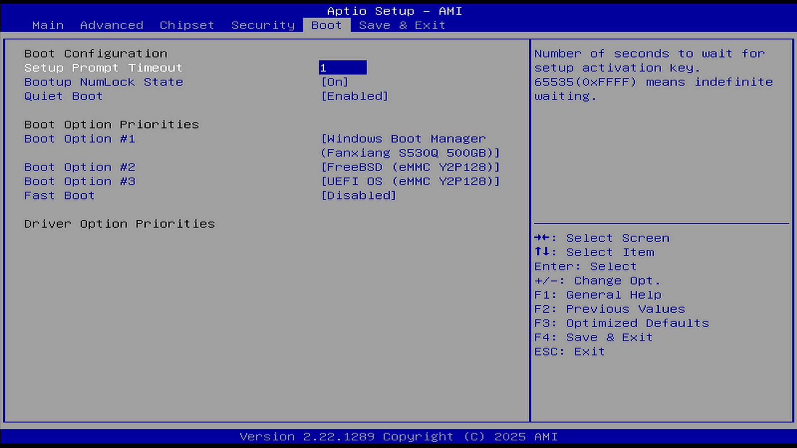

# Boot 启动

本节介绍 BIOS（基本输入输出系统，Basic Input/Output System）中与启动相关的设置选项，包括启动超时、启动设备顺序、USB（通用串行总线，Universal Serial Bus）支持等重要配置。

## Setup Prompt Timeout（设置 Setup 提示超时时间）

本选项用于配置进入 BIOS 设置界面的等待时间。用户可根据实际需求调整该时间值，以便在开机时有足够时间按下相应按键进入 BIOS 设置界面。

可设置的值范围如下：

0—65535 秒

具体说明：

Setup 提示超时设置，用于设置等待 Setup 激活键的时间，最大值为 65535 秒，表示无限等待。

## Bootup NumLock State（启动时 NumLock 状态）

本选项用于设置系统启动后数字小键盘的状态。用户可以根据日常使用习惯，选择启动后数字小键盘的默认状态。

可用选项如下：

On（开）

Off（关）

具体说明：

选择键盘 NumLock 状态（锁定或解锁数字小键盘）。设备启动后，可将数字小键盘设置为开启（On，用于数字输入）或关闭（Off，用于导航功能）。导航功能指通过数字键实现界面的上下左右移动。

## Quiet Boot（静默启动）

本选项用于控制启动过程中是否显示详细的自检信息。通过该设置，用户可以选择启动时显示制造商 Logo 还是详细的硬件自检信息。

可用选项如下：

Enabled（启用）

Disabled（禁用）

具体说明：

用于设置是否启用静默启动模式。

设置为 Enabled 时，开机将显示制造商提供的 Logo；设置为 Disabled 时，开机画面为文本模式的 POST（加电自检，Power-On Self-Test）界面。

## Fast Boot（快速启动）

本选项用于优化系统启动速度，但可能会影响部分硬件的初始化。启用该功能可以显著缩短开机时间，但需要注意可能带来的兼容性问题。

可用选项如下：

Enabled（启用）

Disabled（禁用）

具体说明：

用于启用或禁用在启动过程中仅初始化启动活动选项所需的最小设备集合。该设置对 BBS（BIOS 启动规范，BIOS Boot Specification）启动选项（非 UEFI（统一可扩展固件接口，Unified Extensible Firmware Interface）启动选项）无效。如果使用外置显卡，则其 VBIOS（视频 BIOS，Video BIOS）需要支持 UEFI GOP（图形输出协议，Graphics Output Protocol）。

警告：开启此选项后可能无法再次进入 BIOS，因为启用快速启动后，系统在启动阶段会忽略所有 USB 设备（如键盘）。通常可通过重置 CMOS（互补金属氧化物半导体，Complementary Metal-Oxide-Semiconductor），或使用 Windows 的高级启动功能进入 UEFI 固件设置。参见：华硕公司. Windows 11/10 如何进入 BIOS 设置界面[EB/OL]. [2026-03-26]. <https://www.asus.com.cn/support/faq/1008829/>。提供通过 Windows 高级启动功能进入 BIOS 设置的详细步骤。需要注意的是，此方法并非对所有主板均有效，部分主板仍无法通过该方式进入 BIOS。

## SATA Support（SATA 支持）

本选项用于配置 SATA（串行高级技术附件，Serial Advanced Technology Attachment）设备的检测范围。用户可以根据实际需求，选择在启动时检测全部 SATA 设备还是仅检测上一次启动使用的设备。

可用选项如下：

Last Boot SATA Devices Only（仅最后启动的 SATA 设备）

All SATA Devices（全部 SATA 设备）

具体说明：

如果选择“仅最后启动的 SATA 设备”，则在 POST 过程中仅检测并显示上一次启动时使用的 SATA 设备。

如果选择“全部 SATA 设备”，则所有 SATA 设备都会在 POST 过程中被检测到，并在操作系统中可用。

## NVMe Support（NVMe 支持）

本选项用于启用或禁用 NVMe（非易失性内存主机控制器接口规范，Non-Volatile Memory Express）设备的支持。NVMe 是一种高速存储协议，常用于现代 M.2 固态硬盘，用户可根据硬件配置选择是否启用。

可用选项如下：

Enabled（启用）

Disabled（禁用）

具体说明：

若禁用，NVMe 设备将被跳过。M.2 固态硬盘通常使用该协议。

## USB Support（USB 支持）

本选项用于配置 USB 设备在启动过程中的初始化程度。用户可以根据实际使用需求，选择 USB 设备的初始化级别，以平衡启动速度和设备可用性。

可用选项如下：

Disabled（禁用）

Full Initial（完全初始化）

Partial Initial（部分初始化）

具体说明：

如果禁用，所有 USB 设备（包括键盘、鼠标等）在操作系统启动前均不可用。

> **警告**
>
> 在部分机器上，该选项一旦关闭可能无法再次启用，具体请参考 BIOS 右上角的提示信息。由于现代设备通常不再提供 PS/2 接口，可能会导致系统无法正常操作。

如果选择部分初始化，则 USB 大容量存储设备（如 U 盘）以及部分 USB 端口或设备在操作系统启动前不可用。

如果启用，所有 USB 设备在操作系统和启动自检（POST）过程中均可用。

## PS2 Devices Support（PS/2 设备支持）

本选项用于配置 PS/2 接口设备的支持。PS/2 是一种较早的输入设备接口，主要用于连接鼠标和键盘，现代设备已较少使用。

可用选项如下：

Enabled（启用）

Disabled（禁用）

具体说明：

若禁用，PS/2 设备将被跳过。较早期的鼠标、键盘或摇杆设备使用该协议，该接口大约在 2009 年前后逐渐被淘汰。现代设备通常不再提供 PS/2 接口，因此该选项在多数情况下意义不大。

## Network Stack Driver Support（网络协议栈驱动支持）

本选项用于启用网络启动所需的协议栈驱动。该功能主要用于 PXE 网络启动场景，用户可根据实际需求选择是否启用。

可用选项如下：

Enabled（启用）

Disabled（禁用）

具体说明：

该功能为 PXE（预启动执行环境，Preboot Execution Environment）启动所必需。若禁用，网络协议栈驱动将被跳过。

## Redirection Support（重定向支持）

本选项用于启用或禁用控制台重定向功能。控制台重定向常用于远程管理场景，用户可根据实际需求选择是否启用。

可用选项如下：

Enabled（启用）

Disabled（禁用）

具体说明：

若禁用，重定向功能将被跳过。

## Boot Option #1（启动选项 1）

本选项用于设置系统启动时的第一启动设备。用户可以根据自身需求，优先选择从指定设备启动系统。

可用选项如下：

Hard Disk0（硬盘 0）

Hard Disk1（硬盘 1）

eMMC（嵌入式 eMMC）

CD/DVD（光学介质/光盘）

SD（存储卡）

USB Device（USB 设备，如 U 盘）

Network（网络启动）

Other Device（其他设备）

Disabled（禁用）

具体说明：

用于设置系统的启动顺序。

## Boot Option #2（启动选项 2）

本选项用于设置系统启动时的第二启动设备。当第一启动设备不可用时，系统将尝试从该设备启动。

可用选项及说明同 Boot Option #1。

## Boot Option #3（启动选项 3）

本选项用于设置系统启动时的第三启动设备。当前两个启动设备均不可用时，系统将尝试从该设备启动。

可用选项及说明同 Boot Option #1。

## Boot Option #4（启动选项 4）

本选项用于设置系统启动时的第四启动设备。当前三个启动设备均不可用时，系统将尝试从该设备启动。

可用选项及说明同 Boot Option #1。

## Boot Option #5（启动选项 5）

本选项用于设置系统启动时的第五启动设备。当前四个启动设备均不可用时，系统将尝试从该设备启动。

可用选项及说明同 Boot Option #1。

## Boot Option #6（启动选项 6）

本选项用于设置系统启动时的第六启动设备。当前五个启动设备均不可用时，系统将尝试从该设备启动。

可用选项及说明同 Boot Option #1。

## Boot Option #7（启动选项 7）

本选项用于设置系统启动时的第七启动设备。当前六个启动设备均不可用时，系统将尝试从该设备启动。

可用选项及说明同 Boot Option #1。

## Boot Option #8（启动选项 8）

本选项用于设置系统启动时的第八启动设备。当前七个启动设备均不可用时，系统将尝试从该设备启动。

可用选项及说明同 Boot Option #1。

## Boot Option #9（启动选项 9）

本选项用于设置系统启动时的第九启动设备。当前八个启动设备均不可用时，系统将尝试从该设备启动。

可用选项及说明同 Boot Option #1。

## UEFI EMMC Drive BBS Priorities（UEFI EMMC 驱动 BBS 优先级）

本选项用于配置 eMMC（嵌入式多媒体卡，Embedded MultiMediaCard）设备的启动优先级。通过该设置，用户可以灵活调整多个 eMMC 设备的启动顺序，满足不同场景下的使用需求。

用于指定来自可用 UEFI eMMC 设备的启动优先顺序。

## UEFI SD Drive BBS Priorities（UEFI SD 驱动 BBS 优先级）

本选项用于配置 SD 卡设备的启动优先级。通过该设置，用户可以根据自身需求，合理安排 SD 卡的启动优先次序。

指定来自可用 UEFI SD 驱动的启动设备优先顺序。
