# DragonFly BSD 导论

## DragonFly BSD 概述

DragonFly BSD（蜻蜓 BSD）是一款从 FreeBSD 4.8 复刻诞生的类 Unix 操作系统。该项目由曾参与开发 Amiga（上世纪比较火的电脑）的 Matthew Dillon（毕业于伯克利大学）于 2003 年 6 月启动，在 2003 年 7 月发布在 [FreeBSD 邮件列表](https://lists.freebsd.org/pipermail/freebsd-current/2003-July/006889.html) 上。

Dillon 启动 DragonFly BSD 项目是因为他觉得 FreeBSD 5 开发人员选择了一种开发并行计算的方式（例如 SMP 对称多处理），这会降低系统性能。Dillon 试图影响 FreeBSD 项目的设计原则，并与 FreeBSD 开发人员发生争执，他被剥夺了直接编辑源代码的权力。尽管如此，DragonFly BSD 和 FreeBSD 项目仍在合作修复一些错误和更新驱动程序。

DragonFly BSD 因继续 FreeBSD 4 开始的道路而受到阻碍，DragonFly BSD 的开发在几个方面与 FreeBSD 基本系统有很大不同，包括轻量级内核线程实现和 HAMMER 文件系统。DragonFly BSD 的许多设计概念借鉴了 AmigaOS 的解决方案。

DragonFly BSD 自带 i915 显卡驱动，架构仅支持 x86-64。DragonFly BSD 无 Linux 兼容层。DPorts 可与 FreeBSD Ports 兼容。需要注意地是，DragonFly BSD 的驱动支持相当落后，显卡驱动平均落后 10 年左右。

捐赠 DragonFly BSD：<https://www.dragonflybsd.org/donations/>，看起来只支持国际 Paypal。我方已经发邮件说过此事了，并无任何反馈。

> **注意**
>
> DragonFly BSD 的文档较为陈旧，但这无法匹配其真实的开发进度，其实 DragonFly BSD 的开发还是比较积极的。不要被 DragonFly BSD 陈旧的官方文档所劝退。

### 参考文献

- [DragonFlyBSD Updates Its Graphics Drivers With New GPU Support But Still Years Behind](https://www.phoronix.com/news/DragonFlyBSD-DRM-Linux-4.20.17)，2025 年，DragonFly BSD DRM 驱动程序代码方才与 Linux 4.20.17 中的代码同步。

## 安装 DragonFly BSD

安装视频：[安装 DragonFly BSD 6.4](https://www.bilibili.com/video/BV1BM41187pD/)

DragonFly BSD **RELEASE** 版本下载页面在 <https://www.dragonflybsd.org/download/>。开发版 **Bleeding-edge** 下载页面在 <https://docs.dragonflybsd.org/user-guide/download/>

U 盘安装应使用 `USB: dfly-x86_64-6.4.0_REL.img as bzip2 file`：解压出 `dfly-x86_64-6.4.0_REL.img` 使用 Rufus 刻录 U 盘。

本文使用 `Uncompressed ISO: dfly-x86_64-6.4.0_REL.iso`。

---

### 启动安装盘

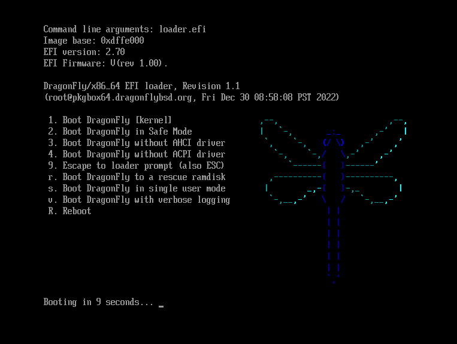  

输入用户名 `installer`（即安装的意思）开始安装。

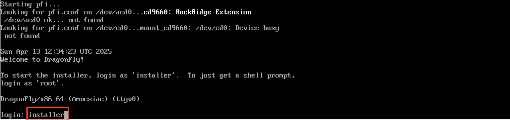  

选择 `Install DragonFly BSD`（安装 DragonFly BSD）。

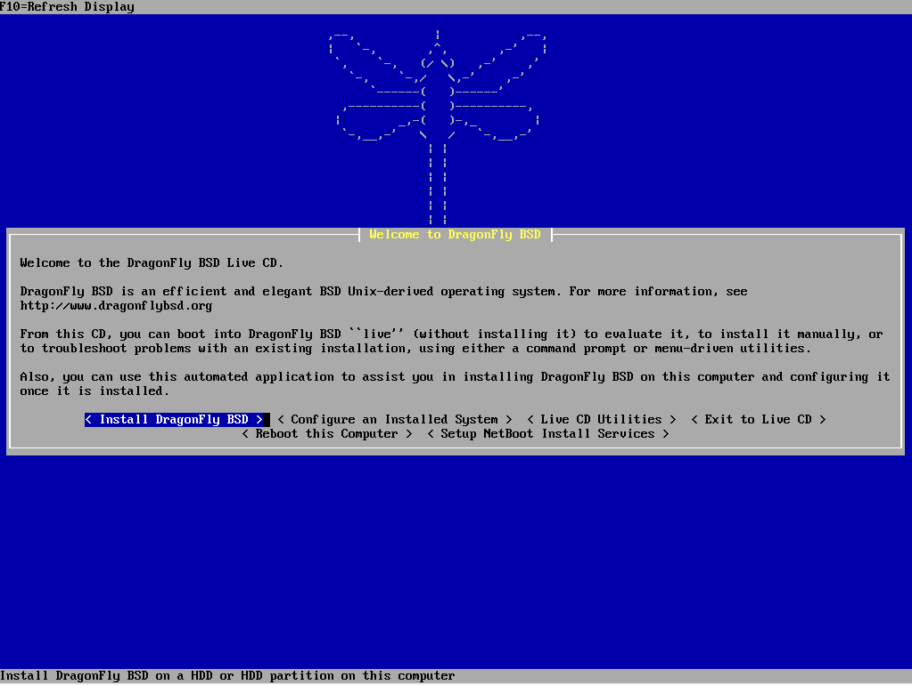  

选择 `Install DragonFly BSD`（安装 DragonFly BSD）。

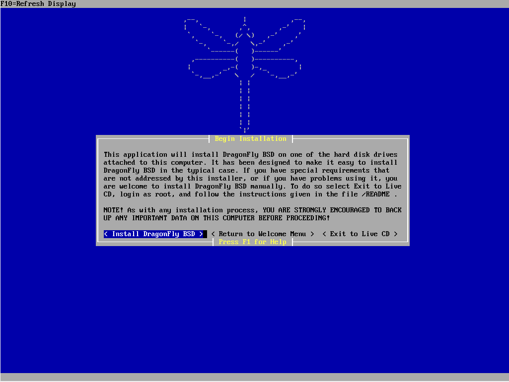  

### 写入硬盘与引导

本文基于 UEFI，我们选择 `UEFI`。新电脑（2016+）都应选择 UEFI。

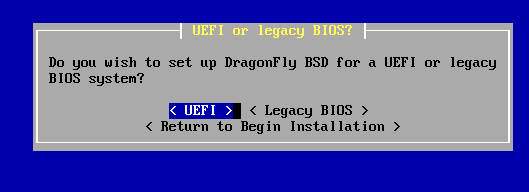  

选择要安装的硬盘。

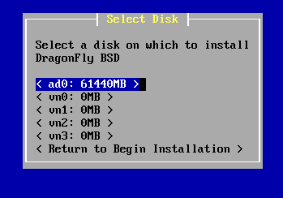  

确认硬盘。

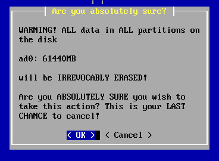  

格式化完成。

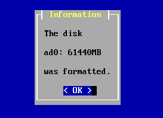  

选择文件系统，此处我们选择 `HAMMER2`

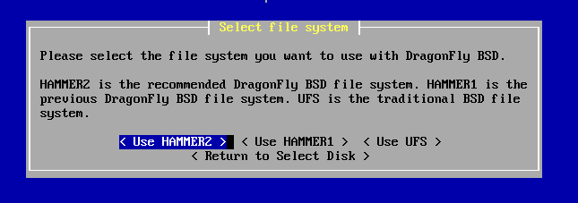  

进行分区操作，完毕后选择 `Accept and Create`（确认并创建）

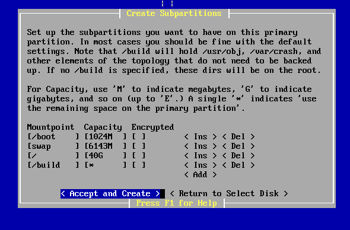

一些警告信息，点 `OK` 确认

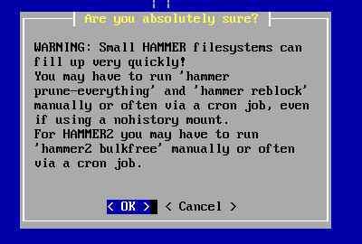  

`Begin Installing Files`（开始安装文件）

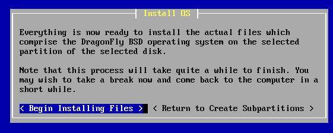  

正在解压缩文件到硬盘：

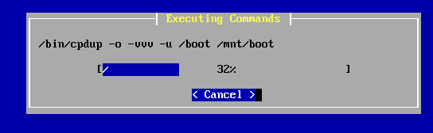

### 配置系统

选择 `Configure this System`（配置此系统）

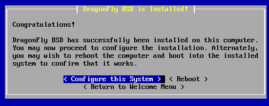  

配置时区（`Select timezone`）：

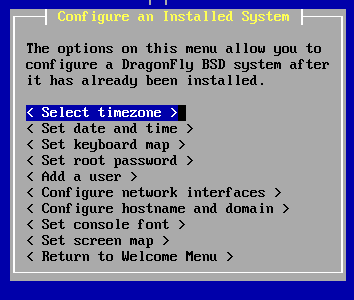  

选择 `No`，手动配置时区：

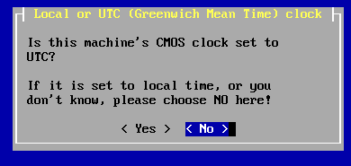

选择 `Asia`，亚洲

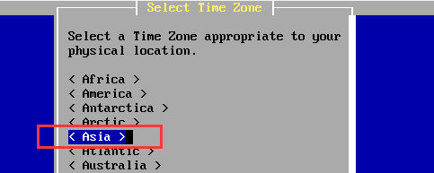  

选择 `Shanghai`，上海，即北京时间

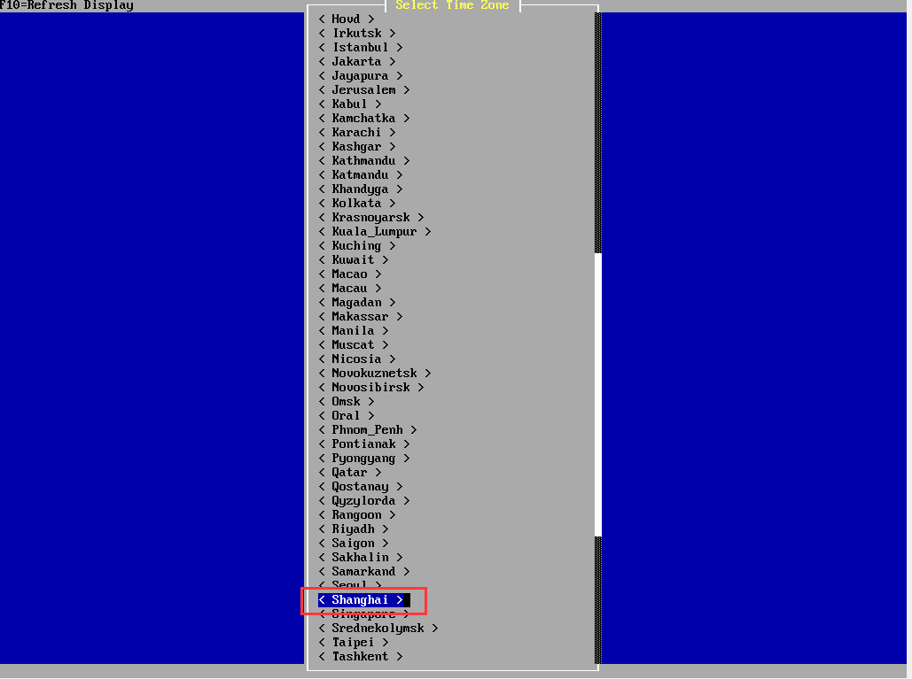  

时区配置完成。

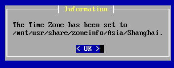  

设置日期和时间（`Set date and time`）：

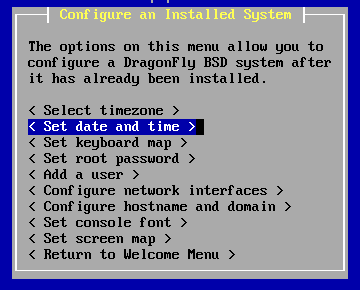  

点击 `OK` 完成配置。

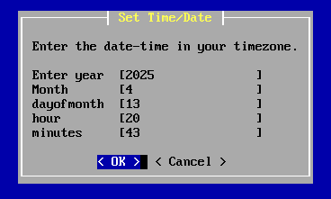

时间和日期配置完成。

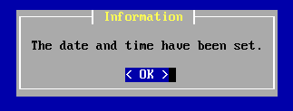  

键盘布局（`Set keyboard map`）无需配置，默认即可。

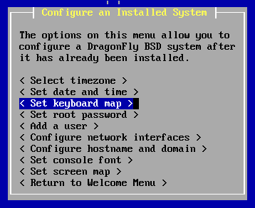  

设置 root 密码（`Set root password`）：

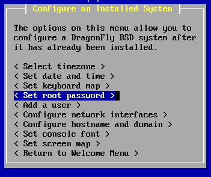

输入密码并确认：

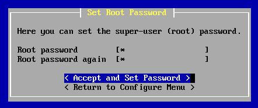  

root 密码设置完成。


添加用户：

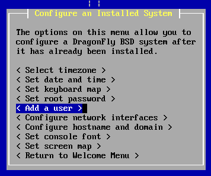

设置完成后点 `Accept and Add`（确认并添加）

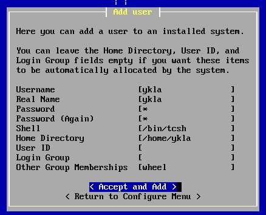  

用户添加成功。

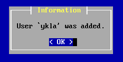

配置网络（`Configure network interface`）：

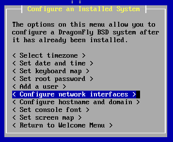  

选择网卡接口

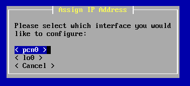  

使用 DHCP

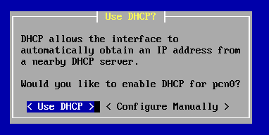  

配置完成。

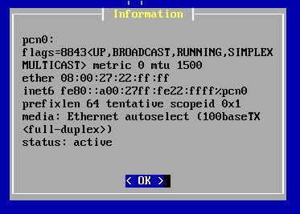  

设置主机名和域名。

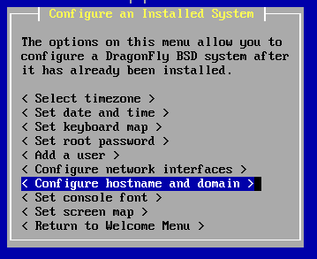

### 结束安装

完成设置。

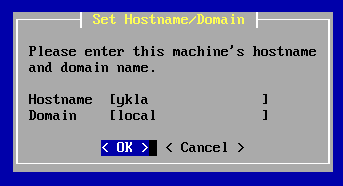  

结束安装。

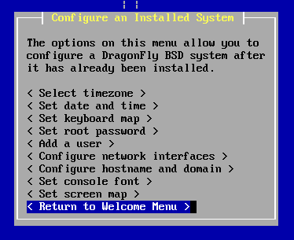

重启：

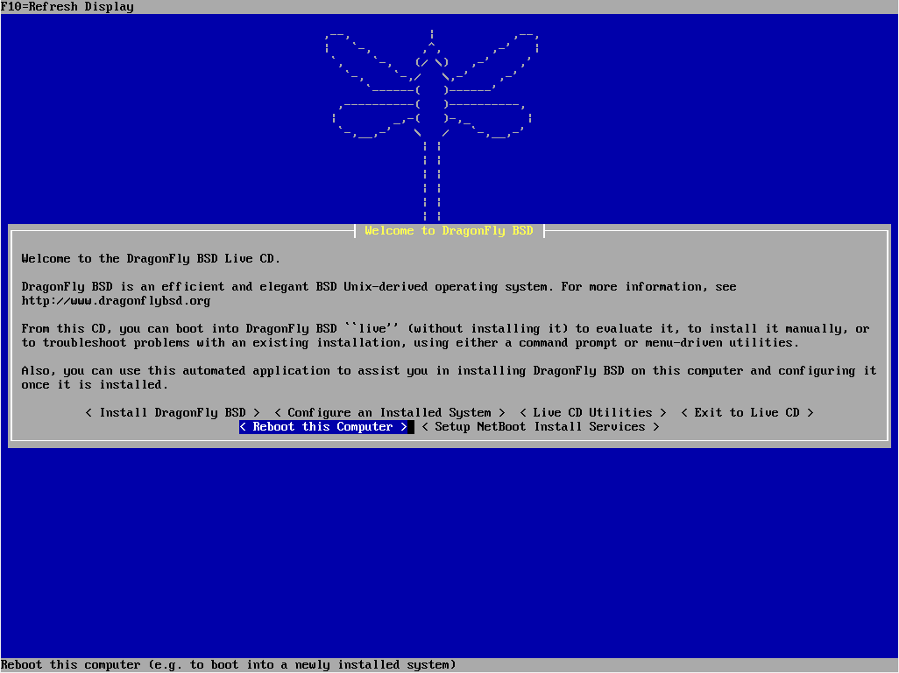  

确认重启

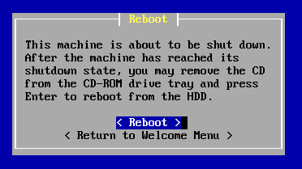  

### 开机

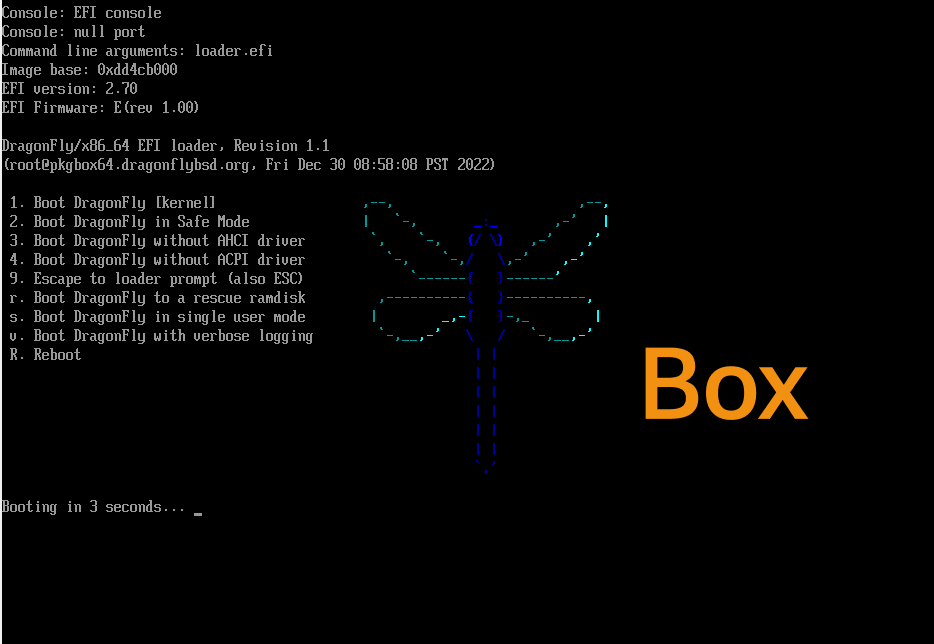  

输入用户名 `root`，输入设置的密码，回车即可登录。

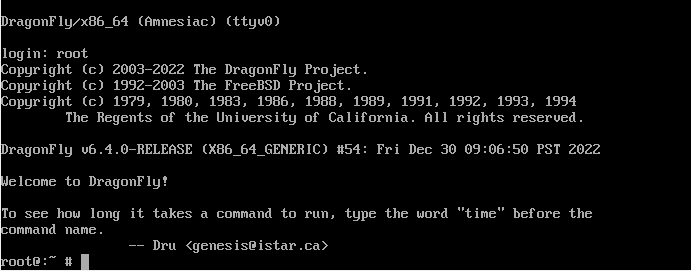

### 故障排除与未竟事宜

- 好像配置不成功，没有输入密码就登录了 root 账户。
- VMware 17 安装失败，无论 UEFI 与否。
- 似乎不支持 NVMe？


## 配置 DragonFly BSD


### 网络

```sh
# dhclient 网卡接口名称
```

网卡接口名称可通过命令 `ifconfig` 判断。

### 软件源

```sh
# ee /usr/local/etc/pkg/repos/df-latest.conf
```

找到国内的镜像站，将 `no` 改成 `yes`，将之前的源改为 `no`。

>**注意**
>
>DragonFlyBSD 6.4 中移除了该镜像站，需要手动配置。参考 <https://mirror.sjtu.edu.cn/docs/dragonflybsd/dports>。

### 中文环境

`/etc/csh.cshrc` 中添加：

```sh
setenv LANG "zh_CN.UTF-8"
```

在 `/etc/profile` 文件中找到相关条目修改如下（**待测试**）：

```sh
export LANG="zh_CN.UTF-8"
export LC_ALL="zh_CN.UTF-8"
export LC_CTYPE="zh_CN.UTF-8"
```

### intel i915kms 显卡

[根据硬件说明](https://www.dragonflybsd.org/docs/supportedhardware)，DragonFly BSD 6.4 显卡只支持到了英特尔第八代（Coffeelake）处理器。

```sh
# kldload drm
```

持久化，将：

```
drm_load="YES"
```

放在 `/etc/rc.conf`。

