# DragonFly BSD 系统导论

## DragonFly BSD 概述

DragonFly BSD（蜻蜓 BSD）是一款基于 FreeBSD 4.8 衍生而来的类 UNIX 系统。该项目由 Matthew Dillon（曾参与 Amiga 开发，毕业于加州大学伯克利分校）于 2003 年 6 月启动，并于 2003 年 7 月正式发布于 [FreeBSD 邮件列表](https://lists.freebsd.org/pipermail/freebsd-current/2003-July/006889.html)。

Dillon 启动 DragonFly BSD 项目的核心动因在于对 FreeBSD 5 中采用的 SMP（对称多处理）并行计算架构存在不同技术判断。SMP 是指多个处理器共享同一内存空间的架构设计，他认为该设计可能引入不必要的性能开销。这一技术分歧导致与 FreeBSD 核心开发团队的讨论，并最终促成独立项目的形成。尽管存在技术路径差异，DragonFly BSD 与 FreeBSD 项目在错误修复和驱动程序更新等领域仍保持协作关系。

DragonFly BSD 在继承 FreeBSD 4 技术路线的同时，在多个关键系统层面进行了创新性设计，包括轻量级内核线程实现机制和 HAMMER/HAMMER2 文件系统等核心组件。DragonFly BSD 的部分设计理念受到了 AmigaOS 架构的启发。

从硬件支持现状来看，DragonFly BSD 自带 i915 显卡驱动，架构仅支持 x86-64 平台，未提供 Linux 兼容层。其 DPorts 软件包系统与 FreeBSD Ports 保持兼容。需注意 DragonFly BSD 的驱动支持存在一定滞后性，特别是显卡驱动的更新节奏相对较慢。

捐赠 DragonFly BSD：[Sponsoring projects](https://www.dragonflybsd.org/donations/)，目前仅支持国际 PayPal。

> DragonFly BSD 的文档相对陈旧，但这并不能反映其实际开发进度。DragonFly BSD 的开发仍然活跃，不应因官方文档的陈旧而被劝退。

## 安装 DragonFly BSD

了解 DragonFly BSD 的基本信息后，可开始系统安装。以下介绍安装步骤：

安装视频：[安装 DragonFly BSD 6.4](https://www.bilibili.com/video/BV1BM41187pD/)

DragonFly BSD **RELEASE** 版本下载页面在 <https://www.dragonflybsd.org/download/>。开发版 **Bleeding-edge** 下载页面在 <https://docs.dragonflybsd.org/user-guide/download/>。

U 盘安装应使用 `USB: dfly-x86_64-6.4.0_REL.img as bzip2 file`：先解压出 `dfly-x86_64-6.4.0_REL.img`，然后使用 Rufus 将其刻录到 U 盘。IMG 镜像与 ISO 镜像不同：IMG 是原始磁盘镜像格式，包含完整的分区表和文件系统结构，适合直接写入 USB 存储设备。

本文示例使用 `Uncompressed ISO: dfly-x86_64-6.4.0_REL.iso`。

---

### 启动安装盘

准备好安装介质后，启动安装程序。

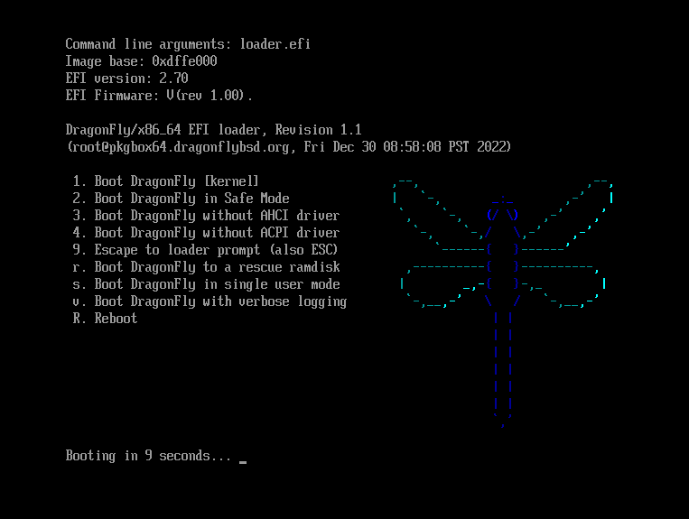

输入用户名 `installer`（即安装的意思）开始安装。

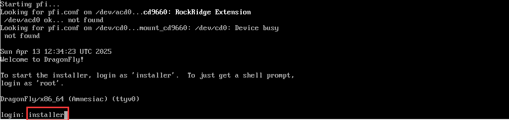

选择 `Install DragonFly BSD`（安装 DragonFly BSD 系统）。

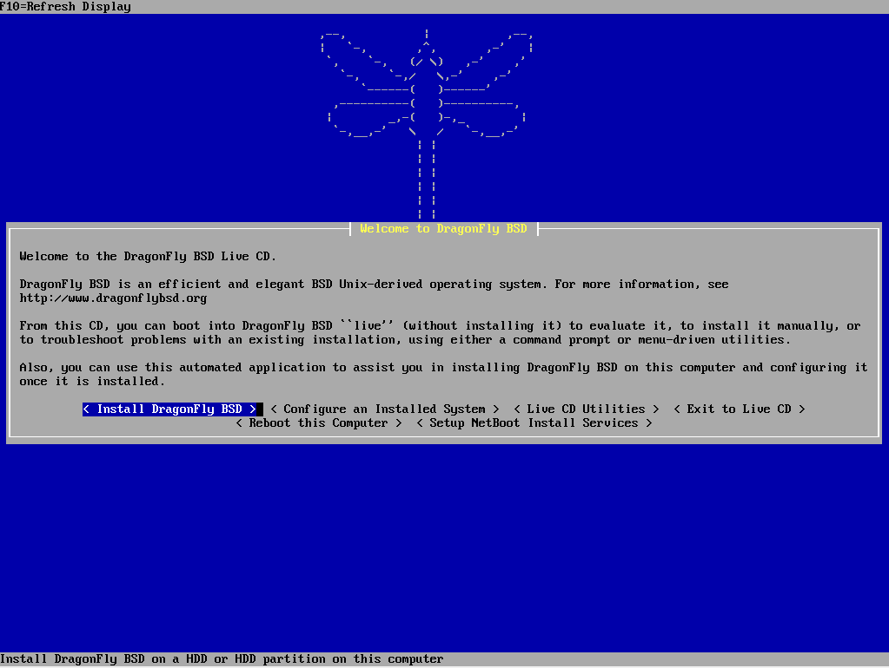

选择 `Install DragonFly BSD`（安装 DragonFly BSD）。

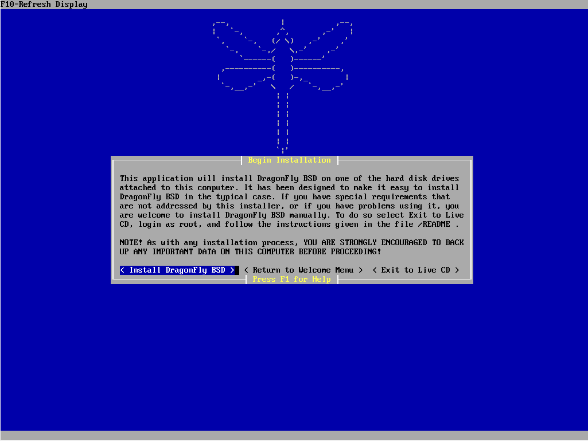

### 写入硬盘与引导

完成初始引导后，需进行硬盘写入和引导配置。本文基于 UEFI，选择 `UEFI`。新电脑（2016+）均应选择 UEFI。UEFI（统一可扩展固件接口）是传统 BIOS 的替代方案，提供了更现代的启动机制。

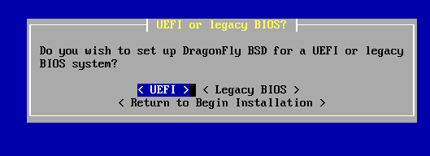

选择要安装的硬盘。

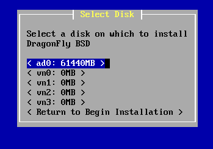

确认硬盘。

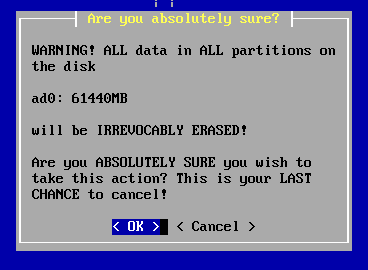

格式化完成。

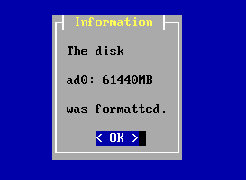

选择文件系统，此处选择 `HAMMER2`。HAMMER2 是 DragonFly BSD 开发的下一代文件系统，支持快照、校验和等特性。

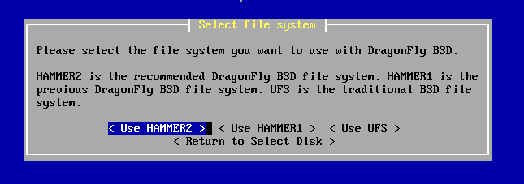

进行分区操作，完毕后选择 `Accept and Create`（确认并创建）。

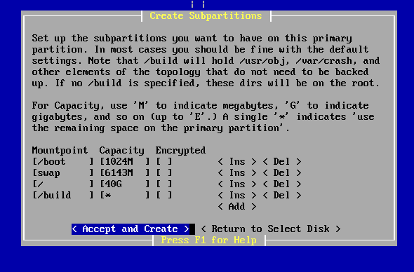

警告信息，点击 `OK` 确认。

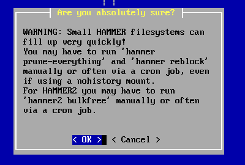

`Begin Installing Files`（开始安装文件）。

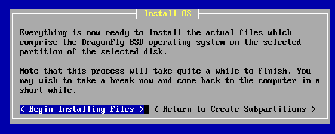

正在将文件解压到硬盘。

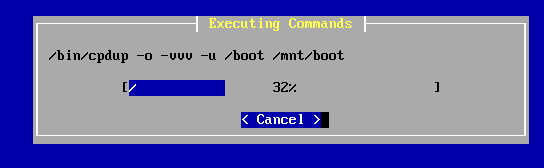

### 配置系统

文件安装完成后，需对系统进行基本配置。选择 `Configure this System`（配置此系统）。

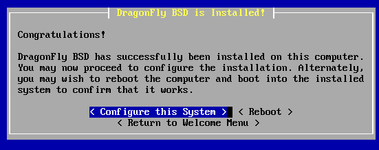

配置时区（`Select timezone`）：

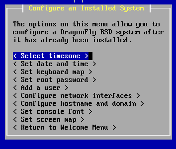

选择 `No`，手动配置时区：

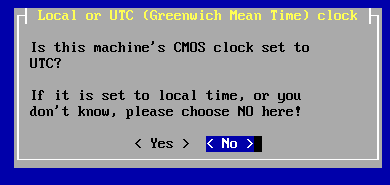

选择 `Asia`，亚洲：

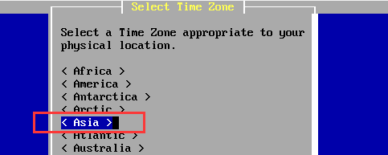

选择 `Shanghai`，上海，即北京时间：

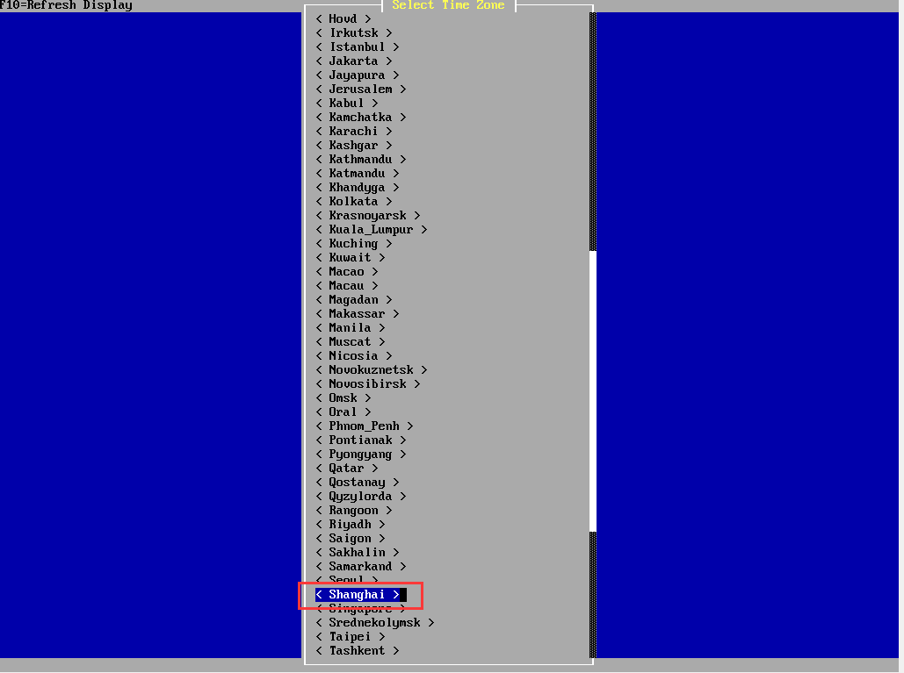

时区配置完成。

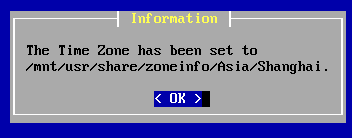

设置日期和时间（`Set date and time`）：

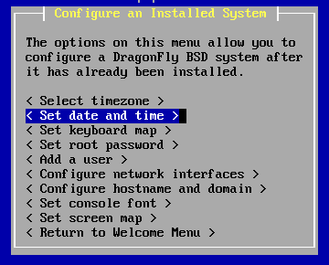

点击 `OK` 完成配置。

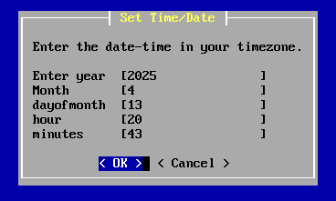

时间和日期配置完成。


键盘布局（`Set keyboard map`）无需配置，使用默认设置即可。

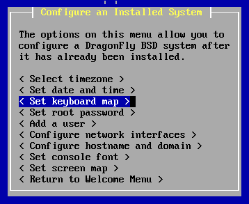

设置 root 密码（`Set root password`）：

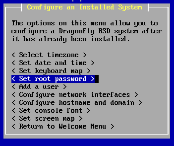

输入密码并确认：

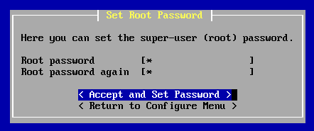

root 密码设置完成。


添加用户：

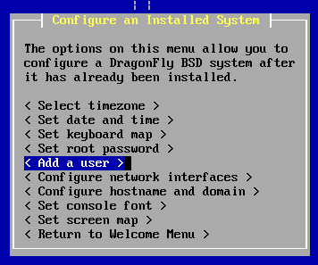

设置完成后点击 `Accept and Add`（确认并添加）：

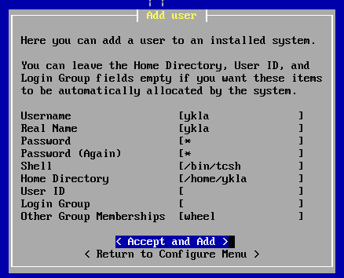

用户添加成功。

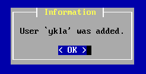

配置网络（`Configure network interface`）：

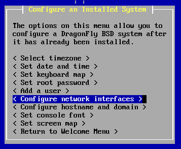

选择网卡接口：

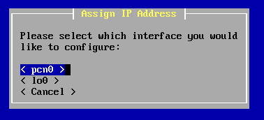

使用 DHCP：

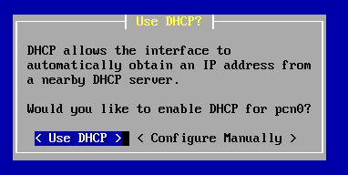

配置完成。

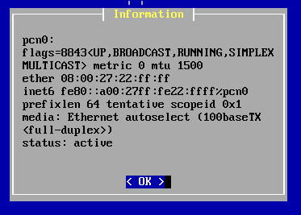

设置主机名和域名：

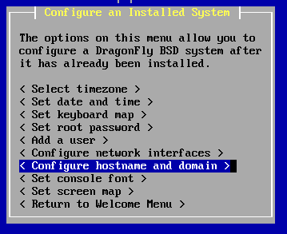

### 结束安装

系统配置完成后，结束安装流程。

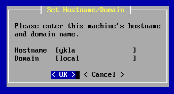

结束安装。

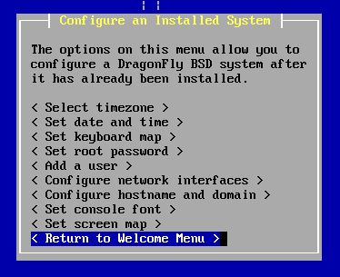

重启：

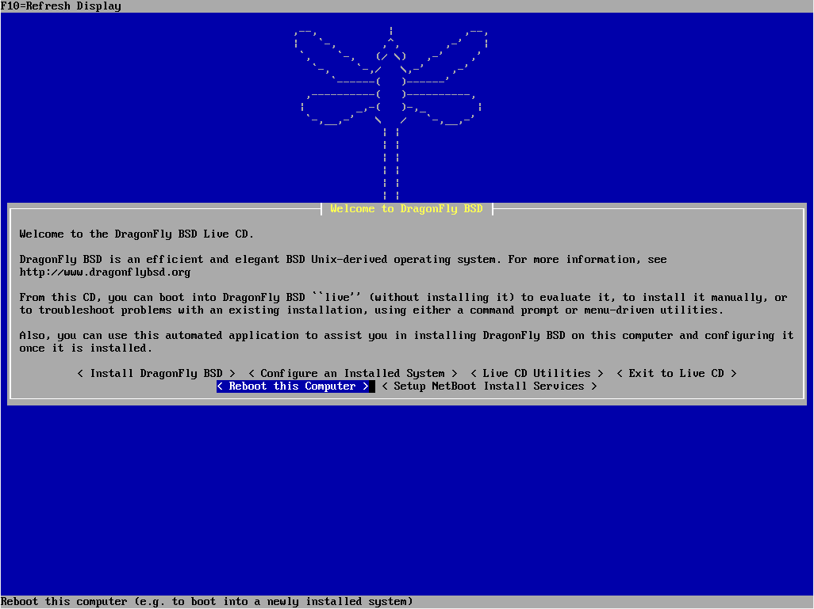

确认重启。

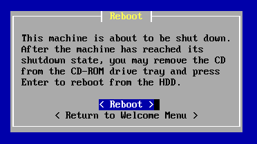

### 开机

系统重启后，进入 DragonFly BSD 系统。

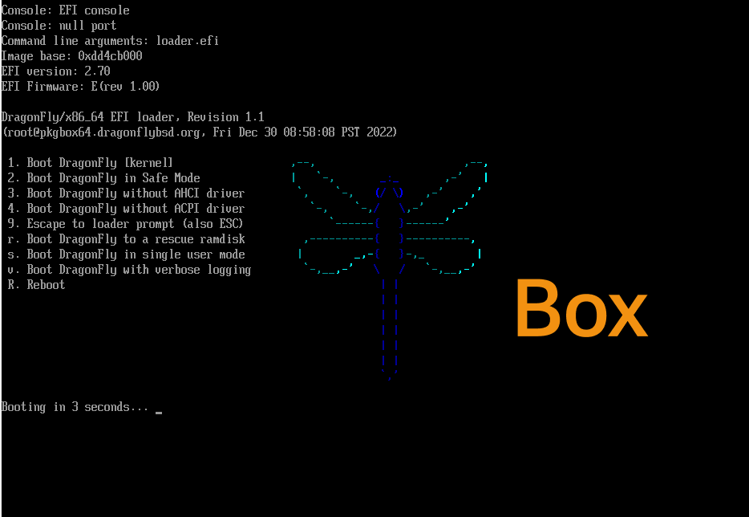

输入用户名 `root` 及设置的密码，回车即可登录。首次登录后，建议创建普通用户用于日常操作，以提高系统安全性。

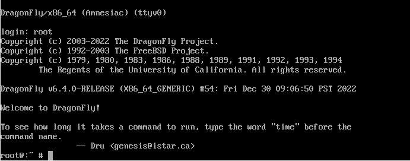

### 故障排除与未竟事宜

在安装和使用 DragonFly BSD 的过程中，可能会遇到各类问题。以下列出已知问题和注意事项：

- 配置似乎未成功，未输入密码就登录了 root 账户。
- VMware 17 安装失败，无论是否使用 UEFI。
- 对于 NVMe 存储设备的支持可能有限，建议查阅官方硬件兼容性列表。

## 配置 DragonFly BSD

完成系统安装后，需对 DragonFly BSD 进行基本系统配置。以下介绍配置方法：

### 网络

网络配置是系统配置的重要组成部分。使用 DHCP 为指定网卡接口获取 IP 地址：

```sh
# dhclient 网卡接口名称
```

网卡接口名称可通过命令 `ifconfig` 查看。

### 软件源

配置合适的软件源可提高软件安装和更新速度。可使用 ee 编辑器编辑 pkg 仓库配置文件 `/usr/local/etc/pkg/repos/df-latest.conf`，找到其中的国内镜像站：将 `no` 改为 `yes`，将之前的源改为 `no`。

```sh
/usr/local/
└── etc/
    └── pkg/
        └── repos/
            └── df-latest.conf  # DragonFly BSD pkg 仓库配置文件
```

> **注意**
>
> 在 DragonFly BSD 6.4 中，该镜像站已被移除，需要手动配置。请读者参考 <https://mirror.sjtu.edu.cn/docs/dragonflybsd/dports>。

### 中文环境

中文环境相关文件结构：

```sh
/etc/
├── csh.cshrc  # C Shell 系统配置文件
└── profile     # POSIX Shell 系统配置文件
```

为了更好地使用中文，还需要配置系统的中文环境。在 `/etc/csh.cshrc` 文件中添加：

```ini
setenv LANG "zh_CN.UTF-8"
```

用于在 C Shell 中将系统语言环境设置为中文 UTF-8。

在 `/etc/profile` 文件中找到相关条目，并按如下方式修改（**需测试**）：

```ini
export LANG="zh_CN.UTF-8"       # 设置系统语言环境为中文 UTF-8
export LC_ALL="zh_CN.UTF-8"     # 设置所有本地化环境变量为中文 UTF-8
export LC_CTYPE="zh_CN.UTF-8"   # 设置字符类型本地化为中文 UTF-8
```

### Intel i915kms 显卡驱动

DragonFly BSD 对 Intel 显卡有特定的支持要求。[根据硬件说明](https://www.dragonflybsd.org/docs/supportedhardware)，DragonFly BSD 6.4 显卡只支持到英特尔第八代（Coffeelake）处理器。

## 参考文献

- Michael Larabel. DragonFlyBSD Updates Its Graphics Drivers With New GPU Support But Still Years Behind[EB/OL]. (2024-06-11)[2026-03-25]. <https://www.phoronix.com/news/DragonFlyBSD-DRM-Linux-4.20.17>. 2025 年，DragonFly BSD DRM 驱动程序代码方才与 Linux 4.20.17 中的代码同步。
- Booting, UEFI, and text consoles[EB/OL]. (2017-09-14)[2026-03-25]. <https://www.dragonflydigest.com/2017/09/14/booting-uefi-and-text-consoles/>. 详述了 DragonFly BSD 的 UEFI 启动机制与文本控制台配置方法。

## 课后习题

1. 在 QEMU 或 VirtualBox 中安装 DragonFly BSD 并使用 HAMMER2 文件系统，查找 HAMMER2 的相关文档，尝试创建一个快照并验证其功能。

2. 查找 DragonFly BSD 中与 SMP 相关的内核源代码或文档，对比其与 FreeBSD 的并行计算架构设计差异，分析技术分歧会导致社区分裂的原因。
