# FreeBSD 桌面发行版评述

除 FreeBSD 本身外，还有诸多基于 FreeBSD 的桌面发行版，为用户群体提供了友好且易用的桌面体验。

这些桌面发行版构成了 FreeBSD 技术生态的重要组成部分，满足了不同用户群体的使用需求。

## GhostBSD

GhostBSD 是一款历史较为悠久的 FreeBSD 桌面发行版，其首个测试版本发布于 2009 年，1.5 版本于 2010 年推出。

GhostBSD 官网为 [https://www.ghostbsd.org](https://www.ghostbsd.org)。其口号为“A simple, elegant desktop BSD Operating System”，意为“简洁而优雅的 BSD 桌面操作系统”，提供友好的桌面用户体验。

GhostBSD 曾基于 TrueOS（另一款消逝的桌面发行版），也曾使用 GNOME 作为桌面。GhostBSD 这一名称与早期 Windows 平台上常用的 Ghost 软件并无任何关联，其含义为“(G)nome (host)ed by Free(BSD)”（由 FreeBSD 驱动的 GNOME 桌面），而当前所使用的 MATE 桌面环境亦源自 GNOME 项目。GhostBSD 默认配置了 Linux 兼容层，但其使用方式与常规目录结构不同，且无法通过 chroot 直接进入，对 deb、rpm 文件的处理也无明显反馈。GhostBSD 使用 FreeBSD 的 pkg（默认软件源为 GhostBSD 镜像站）和 Ports，同时也提供了官方的图形化软件管理工具及自有的二进制软件包。

GhostBSD 的下载地址为 <https://www.ghostbsd.org/download>。GhostBSD 官方仅提供基于 MATE 桌面环境的安装镜像，社区则提供了基于 Xfce 的版本。GhostBSD 是一款滚动发行版，但更新节奏相对缓慢，基于 FreeBSD 最新的 STABLE 分支。常见问题文档在 [FAQ](https://ghostbsd-documentation-portal.readthedocs.io/en/latest/user/FAQ.html)。该文档汇总了 GhostBSD 系统使用中的常见问题与解决方案。可以看到系统默认未安装编译工具，需要通过命令 `sudo pkg install -g 'GhostBSD*-dev'` 进行安装。

GhostBSD 至少需要 4 GB 内存才能完成安装，因为系统启动后会以内存盘方式运行。内存盘是指将部分内存作为磁盘使用的技术，用于提高系统运行速度。

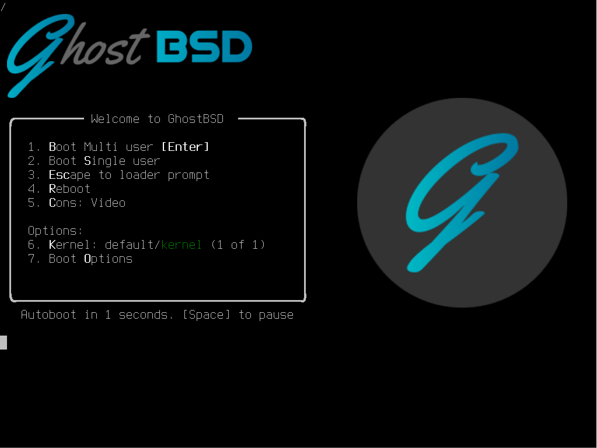

在从 ISO 启动时即可验证这一点，将文件复制到内存盘的过程需要等待较长时间。

开始安装：

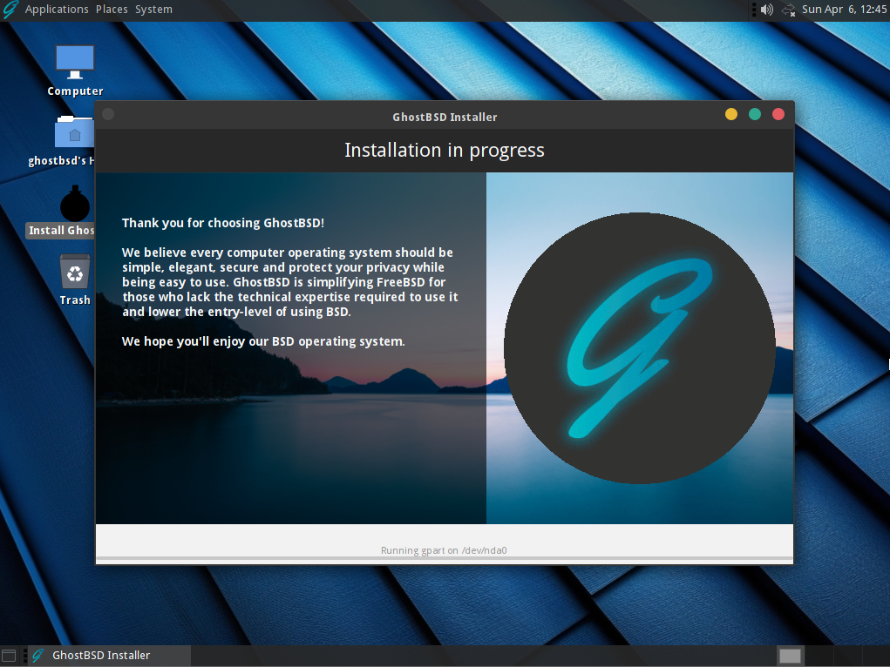

GhostBSD 默认使用的 shell 是与 POSIX 不兼容的 [fish shell](https://fishshell.com/)。fish shell 是一款注重用户体验的现代命令行 Shell。

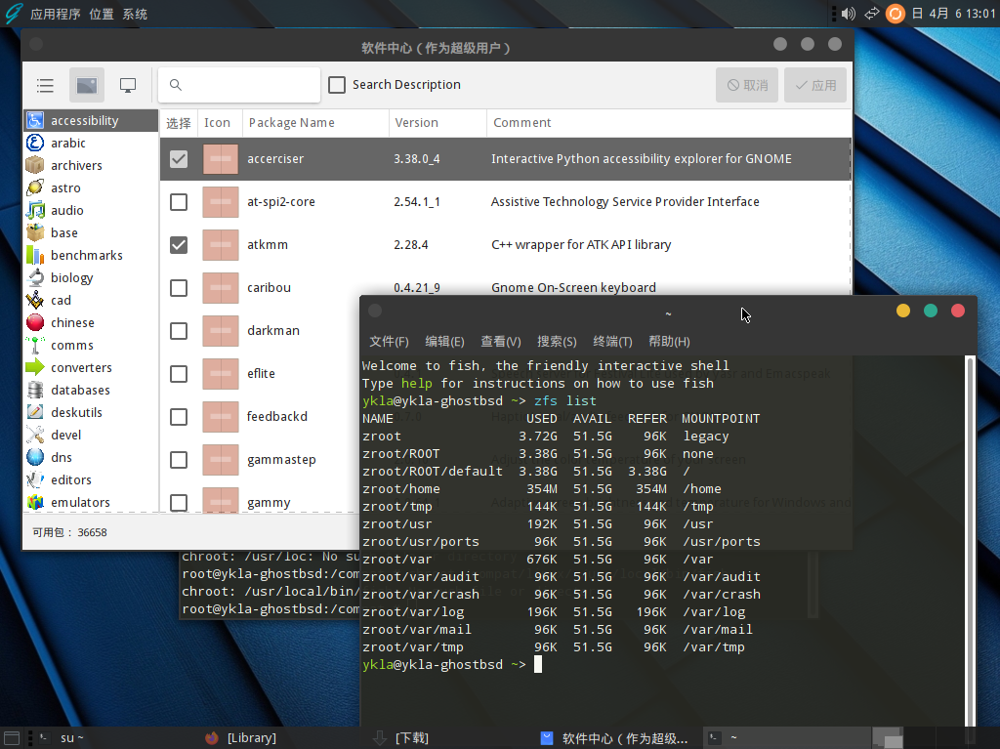

## NomadBSD

NomadBSD 是一款专为移动使用设计的 FreeBSD 发行版。NomadBSD 始于 2018 年。“Nomad”意为“游牧者、经常迁移的人”，对应其面向 U 盘的即插即用设计理念。

NomadBSD 的官网为 [https://nomadbsd.org](https://nomadbsd.org)。NomadBSD 基于 FreeBSD 最新的 RELEASE 版本，2 GB 内存即可运行，主要设计用于 LiveCD 场景，以测试 FreeBSD 的硬件兼容性，专为移动使用场景设计。

NomadBSD 的下载地址为 [https://nomadbsd.org/download.html](https://nomadbsd.org/download.html)（页面右侧的 MANIFEST 文件列出了预装的软件）。

NomadBSD 默认采用 Xfce 桌面。

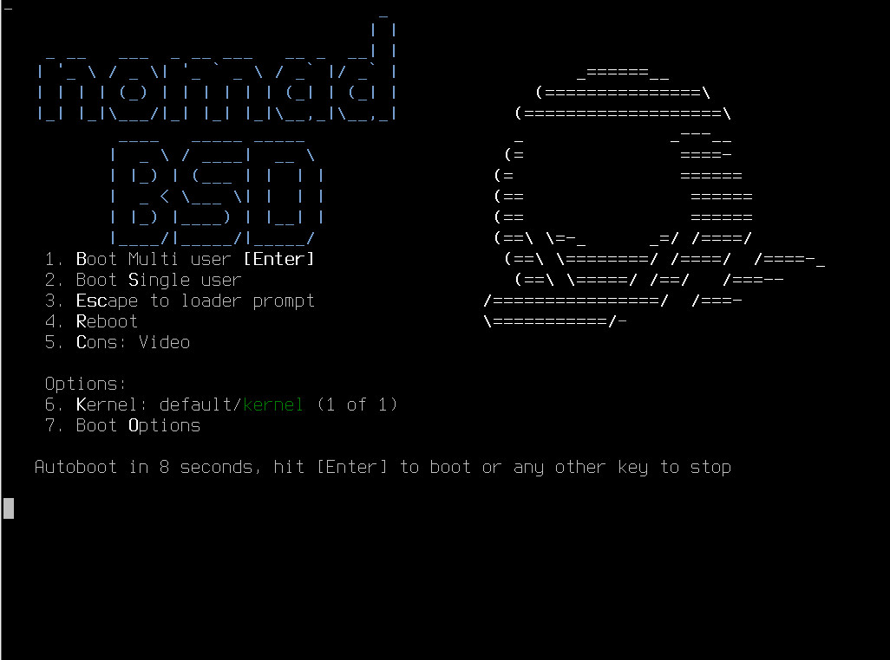

系统支持对默认 Shell 进行自定义配置。

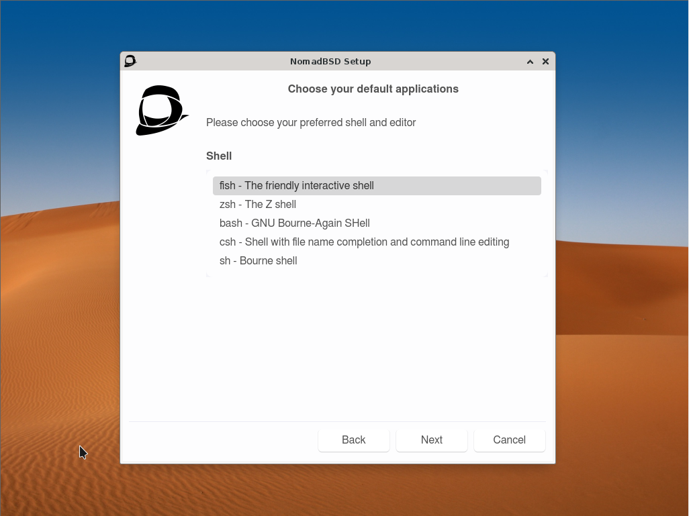

输入法功能存在异常。

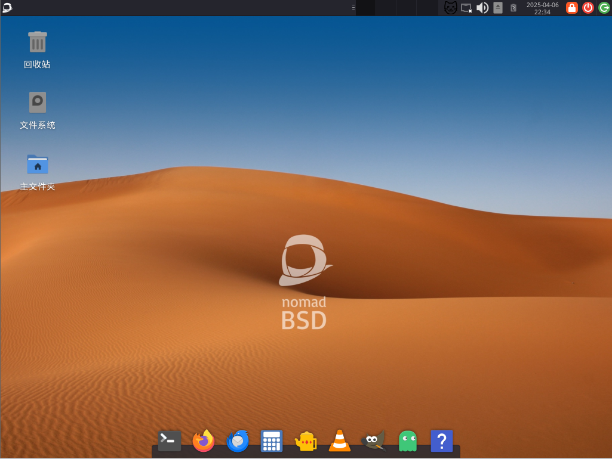

## MidnightBSD

MidnightBSD 是另一款具有特色的 FreeBSD 桌面发行版。MidnightBSD 的官网为 [https://www.midnightbsd.org](https://www.midnightbsd.org)。MidnightBSD 也是一款基于 Xfce 桌面环境的发行版。~~起个名字真是太难了，而创始人的第一只猫的名字是 Midnight（即午夜，可能因为是只黑猫），所以就叫 MidnightBSD 啦。~~

MidnightBSD 始于 2006 年，拥有自己的二进制软件包系统——[mports](https://www.midnightbsd.org/documentation/mports/index.html)，该系统提供独立的软件包管理机制，安装过程中该选项默认启用。

MidnightBSD 的安装界面与 FreeBSD 基本一致，采用经典的蓝底白字文本界面。普通用户的默认 Shell 为 [mksh](https://github.com/MirBSD/mksh)。mksh 是 MirBSD 项目开发的 Korn Shell 实现。

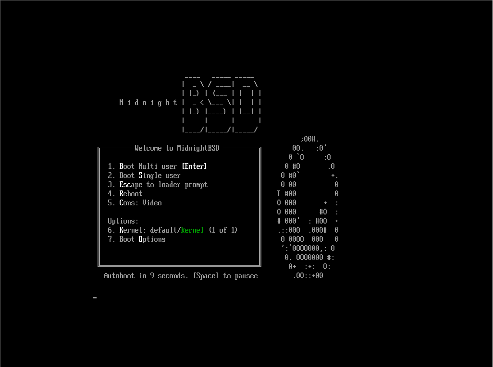

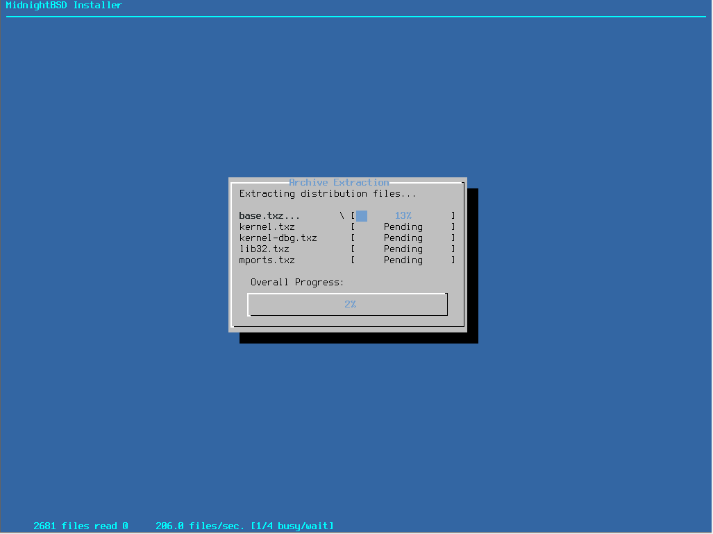

系统在首次启动时需要回答较多配置问题，例如镜像服务器所在地区、隐私数据收集选项、硬件信息提交、是否安装特定组件以及是否启用图形化桌面等。可在其 ISO 镜像里的 `/etc/rc.d/firstboot` 文件中查看首次启动配置逻辑，该脚本负责处理系统首次启动时的配置流程。系统默认启用了 IPFW 防火墙。

若选择启用图形化桌面，系统会在安装过程中联网下载 midnightbsd-desktop 软件包，即使配置了代理，下载速度仍然较慢。pkg 命令在该系统中不可用，其功能由 mport 命令替代。通过用户级别设置更改系统语言的方法未能生效。

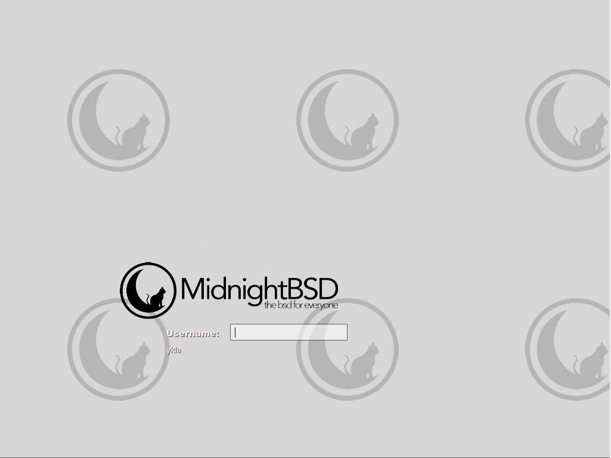

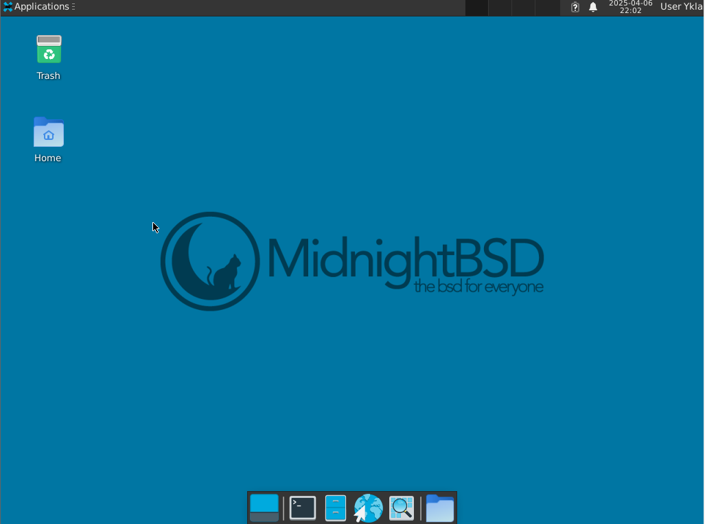

## helloSystem

helloSystem 是一款较新的 FreeBSD 桌面发行版，具有独特的设计风格。helloSystem 始于 2020 年。helloSystem 在设计理念上类似于 Linux 生态中的 [Pear OS](https://pearos.xyz)。Pear OS 是一款模仿 macOS 界面风格的 Linux 发行版。

从项目活跃度的角度观察，helloSystem 项目的开发进度在一段时间内相对平缓。该项目团队尚未注册 helloSystem.org 域名。

helloSystem 的官网为 <https://hellosystem.github.io/docs>，同时也是他们的文档网站。下载地址位于 [GitHub Releases 页面](https://github.com/helloSystem/ISO/releases)。

helloSystem 的设计原则主要面向 macOS 用户，可概括为“桌面风格 Mac 化的 FreeBSD”。设计哲学是“少而精”。

helloSystem 基于 FreeBSD `RELEASE` 版本。默认 Shell 是 zsh。安装了 sudo。

helloSystem 运行时通常需要 4-8 GB 内存。helloSystem 在界面设计和交互逻辑上与传统发行版存在明显差异：例如，在终端中，快捷键 Ctrl+C 用于复制而非中断程序，Caps Lock 键默认无效，只能通过 Shift 键输入大写字母。屏幕缩放功能也存在明显限制，无法自定义缩放比例。

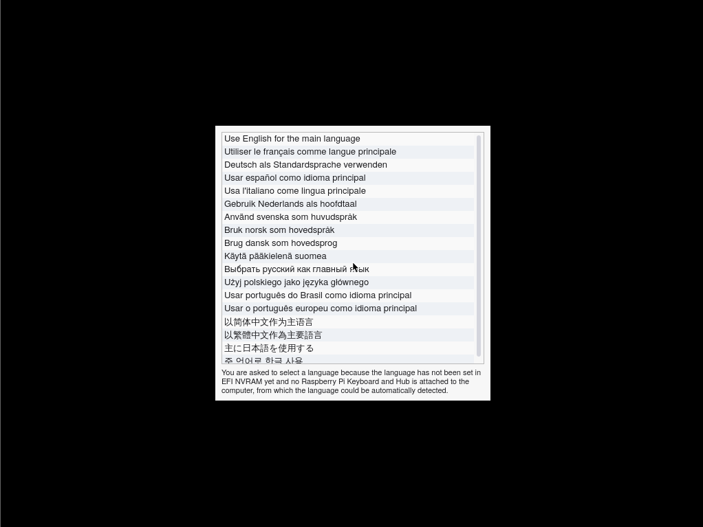

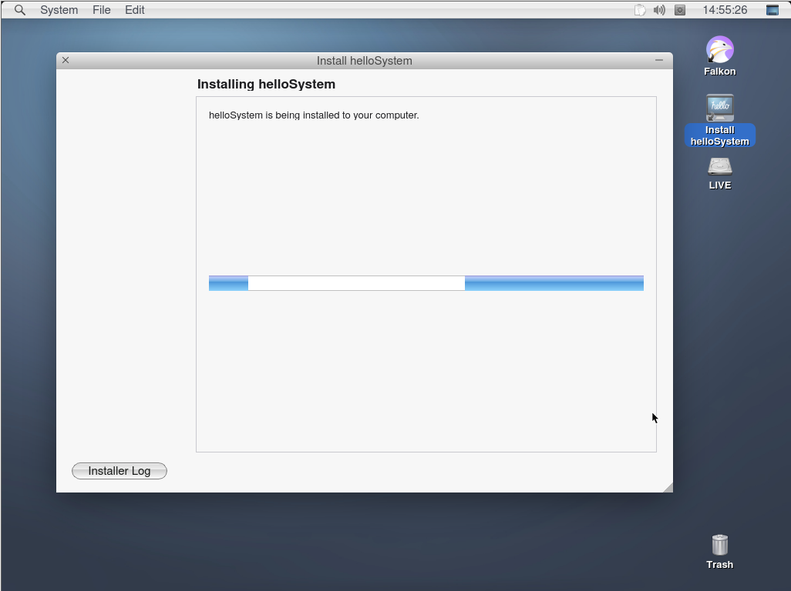

系统无法正常设置界面语言，基于用户级别的语言设置同样未生效。

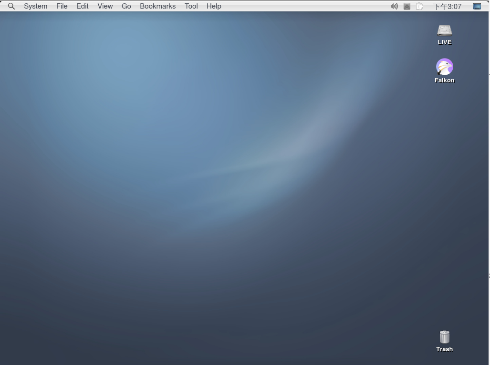

## 参考文献

- The Register. Say helloSystem: Mac-like FreeBSD project emits 0.5 release[EB/OL]. (2021-06-16)[2026-04-18]. <https://www.theregister.com/2021/06/16/hellosystem_maclike_freebsd_project_05/>. 报道 helloSystem 0.5 版本发布及其打造类 macOS 桌面体验的目标。
- TURGEON E. GhostBSD: From Usability to Stability[EB/OL]. FreeBSD Foundation, 2025. [2026-04-18]. <https://freebsdfoundation.org/wp-content/uploads/2025/04/turgeon.pdf>. GhostBSD 项目创始人的官方演讲，项目首个测试版本发布于 2009 年。
- MidnightBSD Project. About MidnightBSD[EB/OL]. [2026-04-18]. <https://www.midnightbsd.org/about/>. MidnightBSD 官方关于页面，项目以创始人 Lucas Holt 的第一只猫 Midnight 命名。
- PHORONIX. helloSystem Wants To Be The “macOS of BSDs” With A Polished Desktop Experience[EB/OL]. (2021-02-12)[2026-04-18]. <https://www.phoronix.com/news/helloSystem-BSD>. helloSystem 由 AppImage 创始人 Simon Peter 发起。

## 课后习题

1. 在 VirtualBox 或 QEMU 中安装 GhostBSD，尝试使用其默认的 Linux 兼容层运行一个简单的 Linux 程序（如 busybox）。

2. 研究 NomadBSD 的 LiveCD 机制，查看其 `/etc/rc.d/firstboot` 等启动脚本，分析它如何实现 U 盘即插即用的设计。
