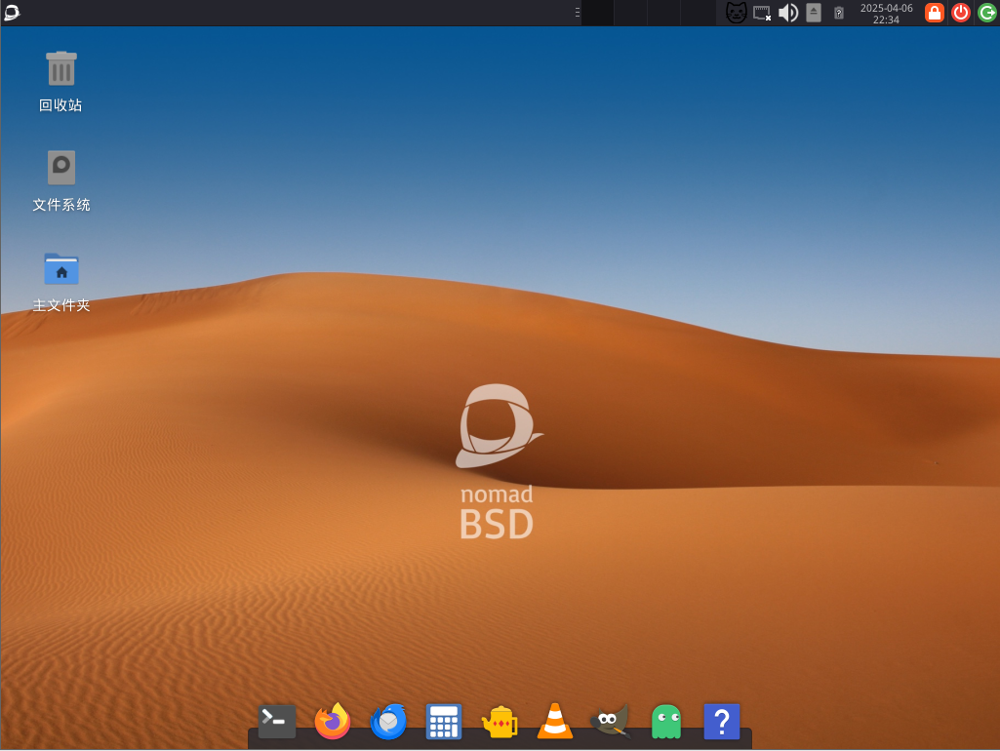

# FreeBSD 桌面发行版评述

## GhostBSD

GhostBSD 始于 2010 年。

GhostBSD 官网为 <https://www.ghostbsd.org>。其口号为“A simple, elegant desktop BSD Operating System”，即“GhostBSD 是一款简洁又优雅的 BSD 桌面操作系统”。

GhostBSD 曾基于 TrueOS（又一款消逝的桌面发行版），也曾使用 Gnome 作为桌面。GhostBSD 这个名字和以前 Windows 上常用的 Ghost 并无任何关联，实则意为 `(G)nome (host)ed by Free(BSD)`（由 FreeBSD 驱动的 Gnome 桌面），而如今 MATE 桌面亦是 Gnome 的延续。GhostBSD 默认配置了 Linux 兼容层（不知道怎么用。和普通的目录都不一样，Chroot 不进去，打开 deb、rpm 都没反应），使用 FreeBSD 的 pkg（默认源是 GhostBSD 镜像站）和 ports，也有 GhostBSD 自己的二进制软件包的官方图形化软件。

GhostBSD 下载地址在 <https://www.ghostbsd.org/download>。GhostBSD 官方只提供了基于 MATE 桌面的安装镜像，社区提供了 XFCE 桌面。GhostBSD 是一款滚动发行版，但滚动速度较缓慢，基于最新的 `STABLE` 分支。常见问题文档在 [FAQ](https://ghostbsd-documentation-portal.readthedocs.io/en/latest/user/FAQ.html)。可以看到默认没有编译工具需要通过命令 `sudo pkg install -g 'GhostBSD*-dev'` 安装。

GhostBSD 至少需要 4GB 内存才能安装，因为启动后它会从内存运行。

在从 ISO 启动的时候就能验证这一点，会在复制文件到内存盘的时候等待很久。开始安装：

GhostBSD 的 shell 是不与 POSIX 兼容的 [fish shell](https://fishshell.com/)。

## NomadBSD

NomadBSD 始于 2018 年。Nomad 即“游牧人，经常迁移的人”，对应了其面向 U 盘，即插即用的设计。

NomadBSD 的官网为 <https://nomadbsd.org>。NomadBSD 基于 FreeBSD 最新 `RELEASE` 版本。2G 内存即可安装，设计用于 LiveCD，测试 FreeBSD 硬件兼容性。

NomadBSD 下载地址为 <https://nomadbsd.org/download.html>（页面右侧 	`MANIFEST` 为预装的软件）。NomadBSD 默认采用 XFCE 桌面。

看起来还可以自定义 shell。

输入法有问题。

## MidnightBSD

MidnightBSD 的官网为 <https://www.midnightbsd.org>。MidnightBSD 也是一款基于 XFCE 的发行版。因为起个名字真是太难了，而创始人的第一只猫叫 Midnight（即午夜，可能因为是只黑猫），所以就叫 MidnightBSD 啦。

MidnightBSD 始于 2006 年。有自己的二进制软件包格式——[mports](https://www.midnightbsd.org/documentation/mports/index.html)。安装的时候默认选中。

MidnightBSD 安装界面和 FreeBSD 一样，经典的蓝底黑字。普通用户默认 shell 是 [mksh](https://github.com/MirBSD/mksh)

第一次启动的时候要回答相当多的问题：例如镜像地址是 US UK 还是哪，隐私收集，硬件信息，是否安装某某某，是否开启图形化桌面云云……（你可以看其 ISO 镜像里的 `/etc/rc.d/firstboot` 文件）默认启用了 ipfw 防火墙。

若选择了开启图形化，是现场开始联网安装 `midnightbsd-desktop`，即使使用了代理其下载速度也不能令人满意。`pkg` 命令不能使用，替代命令是 `mport`。通过用户分级方式更改语言的方法无效。

## helloSystem

helloSystem 始于 2021 年。helloSystem 是 BSD 界的 [Pear OS](https://pearos.xyz)。

helloSystem 似乎已经停滞了有一段时间了。该团队甚至连 `helloSystem.org` 这个域名都没有注册过。

helloSystem 的官网为 <https://hellosystem.github.io/docs>，同时也是他们的文档网站。下载地址在 [Github 上面](https://github.com/helloSystem/ISO/releases)。

helloSystem 的设计原则是面向 Mac 用户，简而言之即桌面 Mac 化的 FreeBSD。设计哲学是“少而精”。

helloSystem 基于 FreeBSD `RELEASE` 版本。默认 shell 是 zsh。安装了 sudo。

helloSystem 需要 4-8G 内存才能运行。helloSystem 各种设计以及交互逻辑都同传统的发行版不一致，例如在终端中，快捷键 **ctrl**+**c** 是“复制”而不是“中断程序”、**CAPS** 大写键无效，只能按 **SHIFT** 才能大写…… 屏幕缩放也有很大的问题，不能自定义缩放比例。

无法设置语言。用户分级设置无效。

