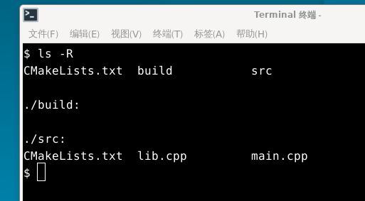
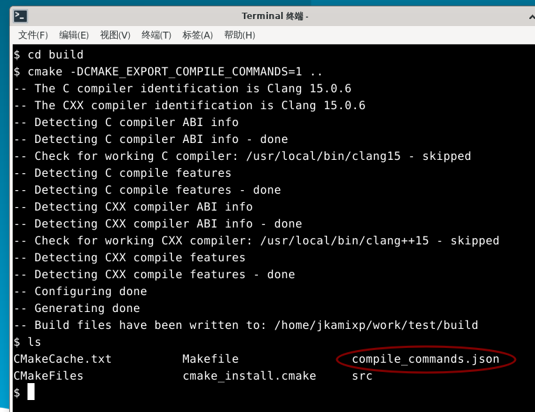
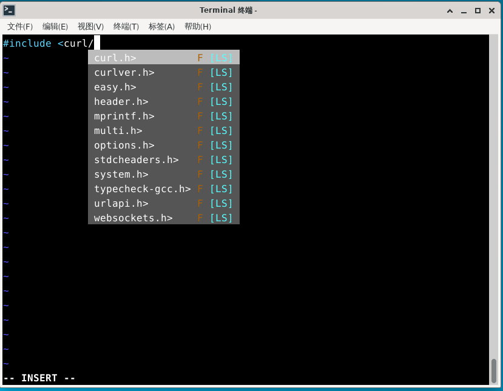
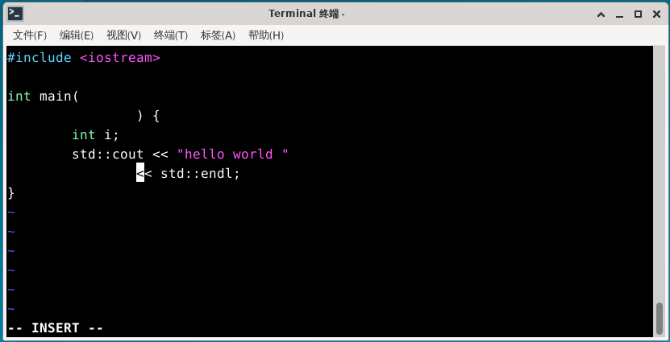
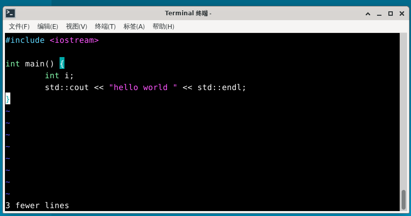
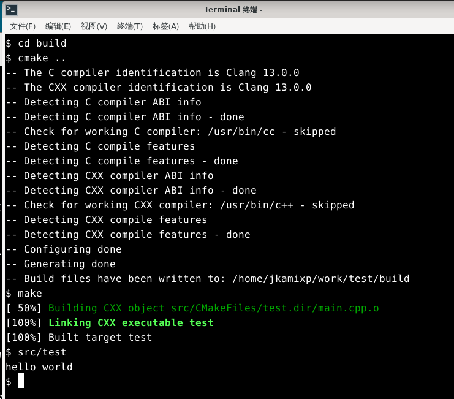
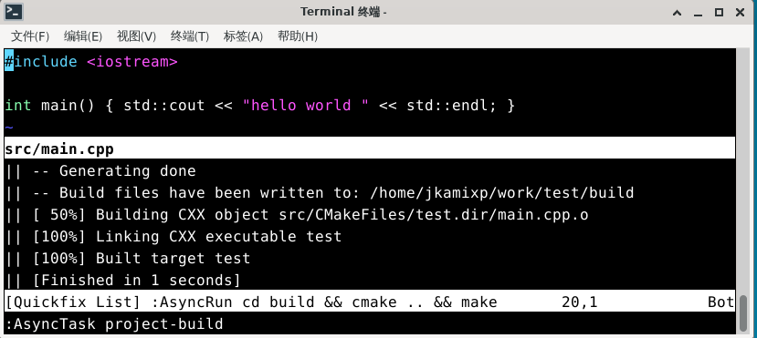
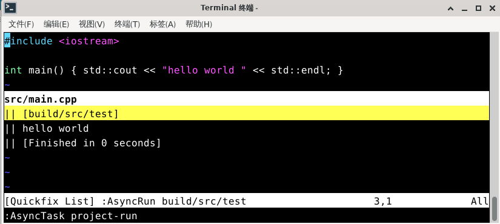

# Vim 开发环境配置

Vim 是一款模态文本编辑器，自 1991 年发布以来，通过配置和插件生态系统，可构建为定制化的集成开发环境（IDE）。

> **思考题**
>
> 从工具哲学视角审视，过度投入于编辑器的美化和配置而忽视实际的编程生产力提升，是一种值得反思的工具使用倾向。
>
> 工具的选择应区分探索性使用与生产性使用：前者源于技术好奇心，后者则服务于特定工程目标。专业主义不仅体现于正式场合，同样适用于业余爱好者的探索活动。
>
> 如何看待工具优化与实际生产力之间的平衡？

## 安装 Vim 及插件管理器

在开始配置之前，需要先安装 Vim 及其插件管理器。

### 安装 Vim

首先需要安装 Vim 编辑器本身。FreeBSD 系统默认提供 vi 编辑器，Vim 是 vi 的增强版本，提供更多功能。使用 pkg 安装：

```sh
# pkg install vim
```

或者使用 Ports 安装：

```sh
# cd /usr/ports/editors/vim/ 
# make install clean
```

### 安装 Vim 插件管理器

Vim 的功能可通过插件进行扩展，需先安装插件管理器以统一管理。此处将安装 Vim 插件管理器 vim-plug。若使用其他插件管理器，请自行调整：

```sh
$ mkdir -p ~/.vim/autoload   # 创建 Vim 自动加载目录
$ fetch -o ~/.vim/autoload/plug.vim https://raw.githubusercontent.com/junegunn/vim-plug/master/plug.vim   # 下载 vim-plug 插件管理器到指定目录
```

配置文件结构：

```sh
~/.vim/
├── autoload/
│   └── plug.vim    # vim-plug 插件管理器文件
├── plugged/        # 插件安装目录
├── coc-settings.json  # coc.nvim 配置文件
└── tasks.ini      # asynctasks.vim 全局任务配置
```

## coc.nvim 添加 clangd 补全

代码补全是开发环境的核心功能，coc.nvim 可为 Vim 提供强大的智能补全能力。Coc.nvim 是一款基于 Node.js 的智能补全插件，适用于 Vim 和 Neovim，支持完整的 LSP（Language Server Protocol，语言服务协议）。LSP 是一种用于编辑器与语言服务之间通信的开放协议，它将代码分析、补全、跳转定义等功能从编辑器中分离出来，由独立的语言服务提供。其配置方式和插件系统整体风格类似 VS Code。clangd 用于为 C/C++ 提供 LSP 支持。

使用 pkg 安装 coc.nvim 依赖，请参照本书 Node.js 相关章节安装 npm，其中 Node.js 作为依赖会自动安装。

在 `~/.vimrc` 文件中写入：

```ini
call plug#begin('~/.vim/plugged')           # 初始化 vim-plug 并指定插件安装目录
Plug 'neoclide/coc.nvim', {'branch':'release'}  # 安装 coc.nvim 插件的 release 分支
call plug#end()                             # 结束插件安装块
```

进入 `vim`，输入以下命令，使用 vim-plug 安装配置的所有插件：

```sh
:PlugInstall
```

插件安装完成后，继续在 Vim 中安装 JSON、clangd、CMake 补全插件：

```sh
:CocInstall coc-json coc-clangd coc-cmake
```

配置 clangd 补全：

```sh
:CocConfig
```

打开配置文件后，输入并保存（也可以手动编辑 `~/.vim/coc-settings.json` 文件写入）：

```json
{
	"clangd.path":"clangd20"
}
```

此时已经可以通过 Coc.nvim 使用代码补全功能。

---

对简单的小程序，在源文件目录下新建 `compile_flags.txt` 文件，输入：

```sh
-I/usr/local/include
```

如此可在 coc 中对 `/usr/local/include` 下的头文件进行补全（指定编译器搜索头文件的路径为 `/usr/local/include`）。

对于复杂项目，应使用 `compile_commands.json` 文件来配置补全。clangd 会在文件所在目录的父目录及名为 `build/` 的子目录中查找。例如，正在编辑 `$SRC/gui/window.cpp` 时，clangd 会依次查找 `$SRC/gui/`、`$SRC/gui/build/`、`$SRC/`、`$SRC/build/` 等目录。

以 CMake 项目为例，在项目文件夹下，项目结构如下：



```sh
$ mkdir build                    # 创建构建目录 build
$ cd build                        # 进入构建目录
$ cmake -DCMAKE_EXPORT_COMPILE_COMMANDS=1 ..   # 生成构建系统，并导出编译命令到 compile_commands.json
```

或者在 `CMakeLists.txt` 中添加：

```ini
set(CMAKE_EXPORT_COMPILE_COMMANDS ON)
```

这样可自动生成 `compile_commands.json` 文件，有了这个文件再编辑源文件时就可以使用补全功能了。

CMake 默认使用系统自带的 Clang 编译器，可以通过以下方式指定使用 clang20：

```ini
$ export CC=clang20       # 设置 C 编译器为 clang20
$ export CXX=clang++20    # 设置 C++ 编译器为 clang++20
```

再执行 `cmake` 以使用 clang20。

可以在 `.xprofile` 等文件中写入：

```ini
export CC=clang20       # 设置 C 编译器为 clang20
export CXX=clang++20    # 设置 C++ 编译器为 clang++20
```

以使 clang20 和 clang++20 成为默认编译器，但具体是否设置应根据项目要求决定。



此时已生成 `compile_commands.json` 文件，可在 Vim 中进行补全。



> **注意**
>
> 以下操作在 sh/bash/zsh 中使用，csh/tcsh 请做相应改动。请确保已正确配置 shell 环境。

## 代码格式化

代码格式化可统一代码风格，提升代码可读性。vim-clang-format 多年未更新，因此对新版 clang-format 支持存在问题（clang-format15 可正常使用，而 clang-format17 和 clang-format19 可能存在异常）。这是由于 vim-clang-format 插件与新版 clang-format 的命令行接口变化不兼容所致。因此推荐使用 vim-codefmt。

### vim-codefmt 代码格式化

vim-codefmt 是 Google 开发的代码格式化插件。在 `~/.vimrc` 文件中加入：

```ini
Plug 'google/vim-maktaba'   # 安装 Google 的 vim-maktaba 插件
Plug 'google/vim-codefmt'   # 安装 Google 的 vim-codefmt 插件，用于代码格式化
Plug 'google/vim-glaive'    # 安装 Google 的 vim-glaive 插件
```

同时在 `~/.vimrc` 文件中设置如下：

```sh
call glaive#Install()

Glaive codefmt clang_format_executable="/usr/local/bin/clang-format19"
Glaive codefmt clang_format_style="{BasedOnStyle: LLVM, IndentWidth: 4}"

augroup autoformat_settings
  autocmd FileType c,cpp AutoFormatBuffer clang-format
  autocmd InsertLeave *.h,*.hpp,*.c,*.cpp :FormatCode
augroup END
```

- 第一条 Glaive 语句用于设置 clang-format 执行文件路径。
- 第二条 Glaive 语句设置格式化的风格样式。也可以设为 `"file"` 或 `"file:<format_file_path>"`。参考 ClangFormatStyleOptions[EB/OL]. [2026-03-25]. <https://clang.llvm.org/docs/ClangFormatStyleOptions.html>.
- 第一条 autocmd 设置在文件类型为 c/cpp 时启用 vim-codefmt 的 AutoFormatBuffer clang-format。
- 第二条 autocmd 设置在文件后缀为 `.h`、`.hpp`、`.c`、`.cpp` 时，退出插入模式后执行 `:FormatCode` 命令。

---

保存 `~/.vimrc` 文件后，使用 vim-plug 安装配置的所有 Google 插件：

```sh
:PlugInstall
```

此时可以在退出插入模式后自动格式化代码，也可以在 Vim 中手动执行 `:FormatCode` 命令进行格式化。

### vim-clang-format 代码格式化

除了 vim-codefmt 外，vim-clang-format 也是一个常用的代码格式化插件。clang-format 代码格式化需要安装 vim-clang-format。

在 `~/.vimrc` 文件中加入以下行，以安装 vim-clang-format 插件，用于自动格式化代码：

```sh
Plug 'rhysd/vim-clang-format'
```

并在 `~/.vimrc` 文件中设置：

```ini
let g:clang_format#code_style = "google"                     # 设置 clang-format 使用 Google 风格
let g:clang_format#command = "clang-format15"                # 指定 clang-format 命令版本
let g:clang_format#auto_format = 1                            # 启用自动格式化功能
let g:clang_format#auto_format_on_insert_leave = 1           # 在离开插入模式时自动格式化代码
```

保存 `~/.vimrc` 文件后，使用 vim-plug 安装 vim-clang-format 插件：

```sh
:PlugInstall
```

安装插件后即可使用，例如：



退出插入模式



## asynctasks.vim 构建任务系统

构建任务管理可简化编译、运行和测试等工作流程。插件 asynctasks.vim 为 Vim 引入类似 VSCode 的 tasks 任务系统，以统一方式系统化管理各类编译、运行、测试和部署任务。

安装插件：

```ini
Plug 'skywind3000/asynctasks.vim'   # 安装 asynctasks.vim 插件，用于异步任务管理
Plug 'skywind3000/asyncrun.vim'     # 安装 asyncrun.vim 插件，用于异步运行外部命令
```

在 `~/.vimrc` 文件中设置：

```ini
let g:asyncrun_open = 6                                  # 设置 asyncrun 输出窗口行为（6 表示自动打开在底部）
let g:asyncrun_rootmarks = ['.git', '.svn', '.root', '.project']  # 指定项目根目录标识文件
```

其中 `asyncrun_rootmarks` 用于指定标记项目根目录的文件/文件夹。

`asynctasks.vim` 在每个项目根目录下放置 `.tasks` 文件以描述该项目的局部任务，同时维护一份 `~/.vim/tasks.ini` 的全局任务配置，以适配通用性较强的项目，避免每个项目重复编写 `.tasks` 配置。

Vim 可使用 `:AsyncTaskEdit` 编辑本地任务，使用 `:AsyncTaskEdit!` 编辑全局任务。

例如：

```ini
[project-build]
command=cd build && cmake .. && make     # 在当前项目的根目录运行 make
cwd=$(VIM_ROOT)

[project-run]
command=src/test                         # <root> 是 $(VIM_ROOT) 的别名，更便于书写
cwd=<root>
```

参考文献：

- asynctasks.vim - 现代化的构建任务系统[EB/OL]. [2026-03-25]. <https://github.com/skywind3000/asynctasks.vim/blob/master/README-cn.md>. 该插件为 Vim 提供了类似 VSCode 的任务系统，统一管理编译、运行等工作流程。

## 最后以最简单的 C++ hello world 项目为例

为了更好地理解上述配置的使用方法，以下以最简单的 C++ 项目为例，展示整个开发环境的使用流程。项目文件结构如下：

```sh
/home/j/
└── project/
    ├── CMakeLists.txt  # 主项目 CMake 配置文件
    ├── src/
    │   ├── CMakeLists.txt  # 子项目 CMake 配置文件
    │   └── main.cpp       # 源文件
    └── build/              # 构建目录
```

- `/home/j/project/CMakeLists.txt` 文件

```cmake
cmake_minimum_required(VERSION 3.10)      # 指定 CMake 最低版本要求为 3.10
project(test)                              # 定义项目名称为 test

set(CMAKE_EXPORT_COMPILE_COMMANDS ON)       # 启用生成 compile_commands.json 文件

include_directories(/usr/local/include)    # 添加头文件搜索路径 /usr/local/include
add_subdirectory(src)                       # 添加 src 子目录作为构建子目录
```

- `/home/j/project/src/CMakeLists.txt` 文件

```sh
add_executable(test main.cpp)   # 将 main.cpp 编译为可执行文件 test
```

- `/home/j/project/src/main.cpp` 文件

```cpp
#include <iostream>   // 引入标准输入输出库

int main() { 
    std::cout << "hello world" << std::endl;   // 输出 "hello world" 并换行
    return 0;                                  // 返回 0 值表示程序正常结束
}
```

编译运行：

```sh
$ cd /home/j/project/build   # 进入构建目录
$ cmake ..                   # 运行 CMake 配置上级目录的项目
```

生成程序文件 `/home/j/project/build/src/test`，然后正常运行即可。



或者在 Vim 中运行 `:AsyncTask project-build` 和 `:AsyncTask project-run`：





## 未竟事项

本文介绍了 Vim 开发环境的基础配置，但还有一些内容需要进一步完善。

### 后续工作方向

本章节聚焦于 Vim 作为开发环境的基础配置，以下方向值得进一步探索：

- **扩展功能范围**：当前配置主要涵盖代码补全和格式化，未来可纳入运行、调试、自动化构建、GUI 集成以及 AI 辅助编程等功能模块。

感兴趣者可参与上述内容的撰写，并通过 Pull Request 方式贡献。

## 课后习题

1. 为 Vim 配置调试支持，集成 GDB 或 LLDB 插件，在 hello world 项目中设置断点并验证调试器行为。

2. 修改 asynctasks.vim 构建任务系统，新增测试任务并验证运行。
