# Advanced（高级）

重复内容不再译出。

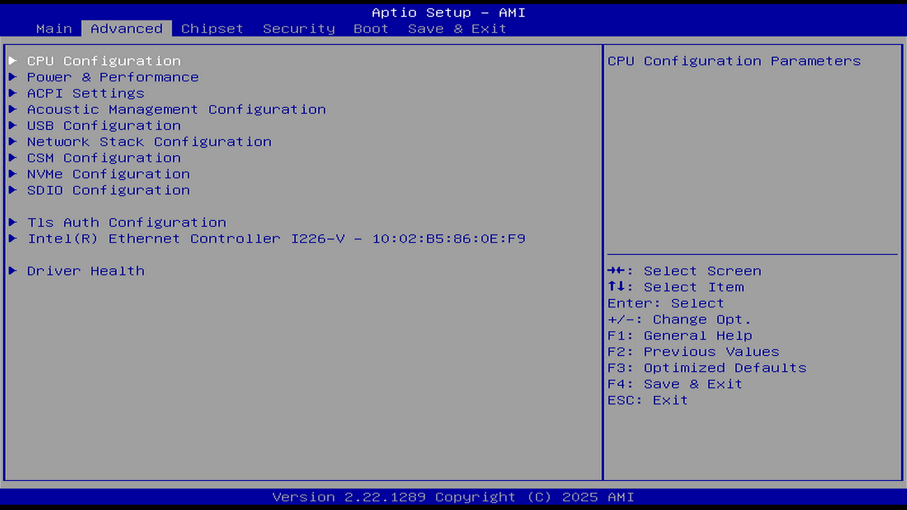

## Connectivity Configuration（连接性配置）

主要是面向英特尔无线网卡、蓝牙和 WWAN 模块（如 GPRS/3/4/5G 模块）的相关配置。

### CNVi CRF Present（显示是否存在 CNVi 模块）

CNVi（Connectivity Integration），英特尔®集成连接技术。

CRF（Companion RF，辅助射频模块），实际上指无线网卡（现代无线网卡通常与蓝牙功能集成在同一模块中）。

用于显示系统中是否存在 CNVi 模块。

英特尔 ® 集成连接将 Wi-Fi 和 Bluetooth® 技术的关键元件转移到英特尔 ® 处理器上。该解决方案由以下部分组成：

- CNVi，英特尔处理器的集成无线 IP 部分
- M.2 外形配套的 RF (CRF) 模块（2230 和 1216 焊接）。事实上，尽管这些无线网卡的物理规格为 M.2，但它们只能被特定的英特尔处理器所支持，AMD 处理器无法使用。

参见 [什么是英特尔 ® 集成连接 (CNVi) 和配套 RF (CRF) 模块？](https://www.intel.cn/content/www/cn/zh/support/articles/000026155/wireless.html) [备份](https://web.archive.org/web/20260120162551/https://www.intel.cn/content/www/cn/zh/support/articles/000026155/wireless.html)。

### CNVi Configuration（CNVi 配置）

#### CNVi Mode（CNVi 模式）

选项：

Auto Detection（自动检测）

Disable Integrated（禁用集成）

说明：

Auto Detection（自动检测）意味着如果发现独立方案，将默认启用该方案。否则将启用集成方案（CNVi）；

Disable Integrated（禁用集成）则会禁用集成方案。

注意：当 CNVi 存在时，用于比特率配置的 GPIO 引脚会被占用。

#### MfUart1 type（带外通信的 UART 类型）

选项：

- ISH Uart0：ISH UART0（集成传感器中心的 UART0）
- SerialIO Uart2：SerialIO UART2（串行输入输出控制器的 UART2）
- Uart over external pads：通过外部引脚的 UART
- Not connected：未连接

说明：

这是一个测试选项，用于配置 Wi-Fi 辅助带外通信所使用的 UART 类型。

#### Wi-Fi Core（无线核心）

选项：

Disable（禁用）

Enable（启用）

说明：

此选项用于启用或禁用 CNVi 中的 Wi-Fi。

#### BT Core（蓝牙核心）

选项：

Disable（禁用）

Enable（启用）

说明：

BT（Bluetooth，蓝牙）。

此选项用于启用或禁用 CNVi 中的蓝牙。

#### BT Audio Offload（蓝牙音频分发/A2DP）

选项：

Disable（禁用）

Enable（启用）

说明：

BT Audio Offload（A2DP），英特尔蓝牙音频分发技术，参见 [示范影片：以 Intel® Bluetooth® 音频卸除省电（A2DP） （MP4）](https://www.intel.cn/content/www/cn/zh/content-details/751466/demo-video-power-saving-with-intel-bluetooth-audio-offload-a2dp-mp4.html)。硬件卸载的音频处理允许在计算机的主 CPU 之外执行主要音频处理任务：即将蓝牙传输音频的解码放到 DSP 进行处理，可降低处理器的负载并省电。参见 [Hardware-Offloaded 音频处理](https://learn.microsoft.com/zh-cn/windows-hardware/drivers/audio/hardware-offloaded-audio-processing) [备份](https://web.archive.org/web/20260120163041/https://learn.microsoft.com/zh-cn/windows-hardware/drivers/audio/hardware-offloaded-audio-processing)。

该功能可将来自蓝牙设备的 HFP 格式音频输入传送至音频 DSP，并通过 A2DP 格式以高能效方式将音频输出至蓝牙设备。

此功能仅支持 Intel® Wireless-AX 22560 网卡。

#### BT RF-Kill Delay Time（蓝牙射频关闭延迟时间）

其具体作用尚不明确。

### RFI Mitigation（射频干扰缓解）

选项：

Disable（禁用）

Enable（启用）

说明：

启用或禁用 DDR 射频干扰抑制功能，用于控制内存模块的抗射频干扰功能。

该射频干扰缓解功能可能会导致 DDR 运行速度暂时降低。

### CoExistence Manager（共存管理）

选项：

Disable（禁用）

Enable（启用）

说明：

共存管理器可缓解英特尔 WWAN（无线广域网，如蜂窝网络 2G/3G/4G/5G）与英特尔 WLAN（Wi-Fi/蓝牙）之间的无线电共存问题。

### Preboot BLE（预启动蓝牙）

选项：

Disable（禁用）

Enable（启用）

说明：

此选项用于启用预启动蓝牙功能。

其具体作用尚不明确。

### Discrete Bluetooth Interface（独立蓝牙接口）

选项：

Disable（禁用）

USB

说明：

要选择蓝牙接口，必须启用 SerialIo UART0。

### BT Tile Mode（蓝牙 Tile 模式）

选项：

Disable（禁用）

Enable（启用）

说明：

Tile 是由 Tile 公司开发的一款小型蓝牙跟踪器，可用于查找丢失的物品。

启用后，可通过智能手机上的 Tile 应用定位你的计算机。

### Advanced settings（高级设置）

选项：

Disable（禁用）

Enable（启用）

说明：

配置无线设备的 ACPI 对象。

### WWAN Configuration（WWAN 配置）

### WWAN Device（WWAN 设备）

选择 M.2 WWAN 设备选项以启用 4G 7360/7560（英特尔）或 5G M80（联发科）调制解调器。

#### Firmware Flash Device（固件闪存设备）

选项：

Disable（禁用）

Enable（启用）

说明：

控制 WWAN 固件闪存设备开关。

功能未知。

#### Wireless CNV Config Device（无线 CNV 配置设备）

选项：

Disable（禁用）

Enable（启用）

说明：

WCCD ACPI 设备节点设置。

其具体作用尚不明确。

#### WWAN Reset Workaround（WWAN 重置变通方案）

选项：

Disable（禁用）

Enable（启用）

说明：

启用此变通方案将使 BIOS 在执行 WWAN 设备加电序列之前，拉高 FULL\_CARD\_POWER\_OFF#、PERST# 和 RESET#WWAN 信号，禁用此选项则不会对其施加任何影响。

其具体作用尚不明确。

#### WA - WWAN OEM SVID（WWAN 模块所使用的 OEM 子厂商 ID）

显示 WWAN 模块所使用的 OEM 子厂商 ID。

#### WA - WWAN SVID Detect Timeout（检测 WWAN OEM 子厂商信息的超时时间）

用于检测 WWAN OEM 子厂商 ID（SVID）的超时数值（以毫秒为单位）。请注意，这只是针对 OEM 的变通方案。

## CPU Configuration（CPU 配置）

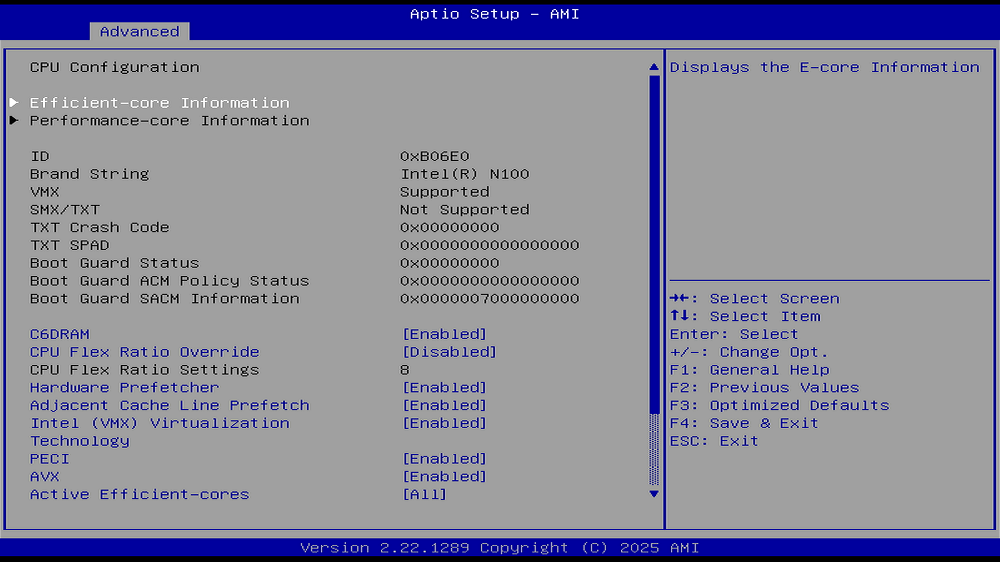

### Efficient-core Information（能效核心信息）

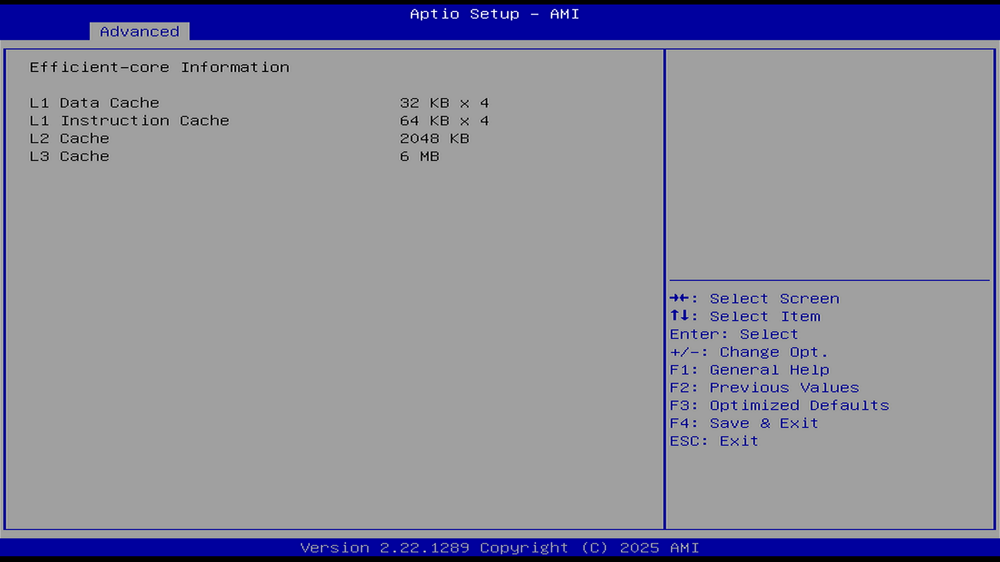

| 英文选项                   | 中文翻译     | 数值与单位（中英一致） |
| -------------------------- | ------------ | ---------------------- |
| Efficient-core Information | 能效核心信息 | —                      |
| L1 Data Cache              | L1 数据缓存  | 32 KB × 4              |
| L1 Instruction Cache       | L1 指令缓存  | 64 KB × 4              |
| L2 Cache                   | L2 缓存      | 2048 KB                |
| L3 Cache                   | L3 缓存      | 6 MB                   |

能效核心（E 核心/小核）：

- 物理尺寸更小，多个小核封装只占用一个大核的物理空间。
- 旨在最大限度地提高 CPU 效率（以每瓦性能为衡量标准）。
- 小核与大核协同工作，用于加速计算资源消耗较大的任务（例如视频渲染）。
- 经过优化，可高效运行后台任务。简单的任务可以分载到小核上，例如，处理 Discord 或杀毒软件，从而使大核能够自由发挥游戏性能。
- 每个能效核心只能运行单个软件线程。

参见 [什么是性能混合架构？](https://www.intel.cn/content/www/cn/zh/support/articles/000091896/processors.html) [备份](https://web.archive.org/web/20260120162022/https://www.intel.cn/content/www/cn/zh/support/articles/000091896/processors.html)

### Performance-core Information（性能核心信息）

| 英文原文                     | 中文翻译                    |
| ---------------------------- | --------------------------- |
| ID                           | ID（识别码）                |
| Brand String                 | 品牌字符串                  |
| VMX                          | 虚拟化技术（VMX）           |
| SMX/TXT                      | 安全模式扩展 / 信任执行技术 |
| TXT Crash Code               | TXT 崩溃代码                |
| TXT SPAD                     | TXT SPAD（特殊寄存器）      |
| Boot Guard Status            | 启动保护状态                |
| Boot Guard ACM Policy Status | 启动保护 ACM 策略状态       |
| Boot Guard SACM Information  | 启动保护 SACM 信息          |

性能内核（P 内核/大核）：

- 物理尺寸上更大的高性能内核，专为保持效率的同时实现原始速度而设计。
- 针对高睿频频率和高 IPC（每周期指令数）进行了调整。
- 非常适合处理许多游戏引擎需要的繁重单线程工作。
- 支持超线程，这意味着大核可同时运行两个软件线程（英特尔 ® Core™ Ultra 处理器（系列 2）除外）

参见 [什么是性能混合架构？](https://www.intel.cn/content/www/cn/zh/support/articles/000091896/processors.html) [备份](https://web.archive.org/web/20260120162022/https://www.intel.cn/content/www/cn/zh/support/articles/000091896/processors.html)

### C6DRAM（C6 节能状态下的 DRAM 控制）

选项：

Disable（禁用）

Enable（启用）

说明：

本项是 C-state（C 状态）选项。

选择“启用”以在 CPU 进入 C6 状态时将 DRAM 内容移动到 PRM 内存中。

C6 是最深级别的休眠状态，此时 CPU 核心供电接近关闭，通常可降低约 80%～90% 的功耗。

### SW Guard Extension（英特尔 SGX 技术）

选项：

Disable（禁用）

Enable（启用）

说明：

SW Guard Extension（SGX），即英特尔软件防护扩展，是一种较新的可信计算技术（提出于 2013 年，逐步应用于 2015 年前后）。

SGX 能够在计算平台上提供一个可信的隔离空间，保障用户关键代码和数据的机密性和完整性。

要启用英特尔 SGX 选项，处理器必须支持 SGX，内存条必须兼容（每个 CPU 插槽最少 8 个完全相同的内存条，在永久性内存配置上不受支持），必须在优化程序模式下设置内存操作模式，必须启用内存加密，并且必须禁用节点交叉存取。

参见：

- [英特尔 ® Software Guard Extensions（英特尔 ® SGX）](https://www.intel.cn/content/www/cn/zh/products/docs/accelerator-engines/software-guard-extensions.html)
- 王鹃, 樊成阳, 程越强, 赵波, 韦韬, 严飞, 张焕国, 马婧. SGX 技术的分析和研究. 软件学报, 2018, 29(9): 2778-2798.<http://www.jos.org.cn/1000-9825/5594.htm>
- Wei ZHENG, Ying WU, Xiaoxue WU, Chen FENG, Yulei SUI, Xiapu LUO, Yajin ZHOU. A survey of Intel SGX and its applications. Front. Comput. Sci., 2021, 15(3): 153808 <https://doi.org/10.1007/s11704-019-9096-y>
- トラストを確立する技術の概要 <https://www.jnsa.org/seminar/pki-day/2021/data/0415miyazawa.pdf>

### CPU Flex Ratio Override（CPU 可变倍频覆盖）

选项：

Disable（禁用）

Enable（启用）

说明：

启用此选项才会出现：CPU Flex Ratio Settings（CPU 可变倍频设置）。

### CPU Flex Ratio Settings（CPU 可变倍频设置）

说明：

CPU Flex Ratio Settings（CPU 可变倍频设置）选项：

CPU 是按特定主频进行主频高低调节的（即有特定档位的变速不是无级变速）。对于 Intel 来说，不带“K”的处理器，其倍频是锁定的，修改了也是无效的。

CPU Flex Ratio Override 即 CPU 倍频设置，仅当此选项为 Enable 时，方可设置 CPU Flex Ratio Settings，即“手动设置 CPU 倍频”。

该数值必须介于最大能效比（LFM，即最低主频）和硬件设定的最大非睿频比率（HFM，即默频）之间（最低主频 ≤ 你设置的值 ≤ 默频）。

CPU 主频 = 基准时钟（Base Clock，即外频，BIOS 中通常为 100 MHz）× 倍频（Multiplier）。

例如，CPU 倍频为 46x，基本时钟速度为 100 MHz，则时钟速度为 4.6GHz。

因此直接将倍频数值乘以 100 MHz 即可得到主频。

最高主频一般可通过官方 CPU 数据表查询，Intel 参见 [https://www.intel.cn/content/www/cn/zh/ark.html#@Processors](https://www.intel.cn/content/www/cn/zh/ark.html#@Processors)

一般 Intel 和 AMD 的最低主频均为 800MHz，可通过系统命令查询。

### Hardware Prefetcher（硬件预取）

选项

Disable（禁用）

Enable（启用）

说明：

需要处理器支持才有此选项。

硬件预取技术。用于开启或关闭 MLC 流式预取器。在 CPU 处理指令或数据之前，它将这些指令或数据从内存预取到 L2 缓存中，借此减少内存读取的时间，帮助消除潜在的瓶颈。

### Adjacent Cache Line Prefetch（相邻的高速缓存行预先访存）

选项

Disable（禁用）

Enable（启用）

说明：

需要处理器支持才有此选项。

可针对需要顺序内存访问高利用率的应用程序优化系统，能加快读取速度。如果该功能设置为 Disabled（禁用），CPU 将预取一个缓存行（64 字节）。如果设置为 Enabled（启用），CPU 将预取两个缓存行（共 128 字节）。

因为此选项在某些情况下会对性能造成负面影响（涉及 False Sharing，假共享），可对需要随机内存访问高利用率的应用程序（如数据库，科学计算等）禁用此选项。

### Intel (VMX) Virtualization Technology（Intel 虚拟化技术）

选项

Disable（禁用）

Enable（启用）

说明：

需要处理器支持才有此选项。

该技术能使单个系统显示为软件中的多个独立系统。这能让多个独立的操作系统在单个系统上同时运行。

启用后，VMM 系统（虚拟机监控器）可以使用处理器对虚拟化的支持（虚拟机扩展 VMX），并利用 Vanderpool 技术（VT）硬件所提供的附加功能。

### PECI（英特尔平台环境控制接口）

选项

Disable（禁用）

Enable（启用）

说明：

PECI，Platform Environment Control Interface，英特尔平台环境控制接口。

PECI 是英特尔专有接口，提供英特尔处理器和外部组件如超级 IO（SIO）和嵌入式控制器（EC）之间的通信通道，以提供处理器温度、超频、可配置 TDP 和内存限制控制机制和许多其他服务。PECI 用于平台热管理以及处理器功能和性能的实时控制和配置。

### AVX（Intel 高级矢量扩展）

选项

Disable（禁用）

Enable（启用）

说明：

Intel 高级矢量扩展（Advanced Vector Extensions，AVX）是一组指令集。可以加速工作负载和用例的性能，如科学模拟、金融分析、人工智能 (AI) /深度学习、3D 建模和分析、图像和音频/视频处理、密码学和数据压缩等。

### Active Performance-cores（激活的性能核心）

选项

ALL（全部）

说明：

每个处理器封装中要启用的 P-core（性能核心）数量。注意：会同时考虑 P 核心和 E 核心的数量。当两者都设置为 0 时，BIOS 会启用所有核心。

### Active Efficient-cores（激活的能效核心）

选项

ALL（全部）

3

2

1

说明：

每个处理器封装中要启用的 E-core（能效核心/小核）数量。如果你有大核的话，可完全关闭（即不使用小核）。

但是有的处理器是纯小核。

注意：该设置会同时考虑 P 核心和 E 核心的数量。当两者都设置为 0 时，BIOS 会启用所有核心。

### Hyper-Threading（英特尔 ® 超线程技术/英特尔 ® HT 技术）

选项

Disable（禁用）

Enable（启用）

说明：

英特尔 ® 超线程技术是一项硬件创新，能在每个内核上都运行多个线程。可使一个物理内核表现的如同两个“逻辑内核”一样。

参见 [什么是超线程？](https://www.intel.cn/content/www/cn/zh/gaming/resources/hyper-threading.html) [备份](https://web.archive.org/web/20260120161952/https://www.intel.cn/content/www/cn/zh/gaming/resources/hyper-threading.html)

### BIST（内置自检程序）

选项

Disable（禁用）

Enable（启用）

说明：

Built-in Self Test（BIST），内置自检程序。

### AP threads Idle Manner（AP 线程空闲模式）

选项：

HALT Loop

MWAIT Loop

RUN Loop

说明：

选择相应选项以配置 AP 线程的空闲模式。

HALT Loop：让 CPU 进入 C1/C1E 休眠状态，但是不再继续进入更深的休眠状态

MWAIT Loop：MWAIT 指令让 CPU 停止执行，直到被监控的内存区域开始写入

RUN Loop：确保 CPU 始终处于运行状态，不进入空闲循环

该项用于配置 AP 线程的待机行为，即等待运行信号。

C 状态相关设置。应用处理器（Application Processor，AP）。在计算机系统中，除引导处理器外的所有其他处理器都称为应用处理器。参见 [https://uefi.org/specs/PI/1.8/V2_DXE_Boot_Services_Protocols.html](https://uefi.org/specs/PI/1.8/V2_DXE_Boot_Services_Protocols.html?) [备份](https://web.archive.org/web/20260120210442/https://uefi.org/specs/PI/1.8/V2_DXE_Boot_Services_Protocols.html)

### AES（AES 加密）

选项

Disable（禁用）

Enable（启用）

说明：

AES（Advanced Encryption Standard，高级加密标准），AES 被广泛接受为政府和行业应用的标准，并广泛部署在各种协议中。

此处是指 CPU 指令集。启用后（Enabled），将通过硬件支持安全加密方法 AES（高级加密标准），从而加快加密与解密的速度。

### MachineCheck（机器检查）

选项

Disable（禁用）

Enable（启用）

说明：

这是一个调试选项。

MCE，Machine Check Exception，机器检查

MCE 是用来报告内部错误的一种硬件方式。提供能够检测和报告硬件（机器）的错误机制，如系统总线错误、ECC 错误、奇偶校验错误、缓存错误、TLB 错误等。当发现错误时，拒绝机器重启以收集相关信息进行排错。参见 [x86 服务器 MCE（Machine Check Exception）问题](https://ilinuxkernel.com/?p=303)

### MonitorMwait（Monitor/Mwait 指令）

选项

Disable（禁用）

Enable（启用）

说明：

启用或禁用 Monitor/Mwait 指令。

Monitor 指令用于监控某个内存区域的写入操作，而 MWait 指令则让 CPU 停止运行，直到该监控区域开始被写入。

这个是配合上面的 AP threads Idle Manner（AP 线程空闲模式）一起使用的。增强型 vSphere 计算（Enhanced vMotion Compatibility，EVC）也需要开启该选项。

### Intel® Trusted Execution Technology（英特尔可信执行技术/TXT）

选项

Disable（禁用）

Enable（启用）

说明：

要启用此英特尔 TXT 选项，必须启用虚拟化技术以及进行预启动测量的 TPM 安全保护。

Intel® Trusted Execution Technology，英特尔 ® TXT。一种非常老（2007）的可信计算技术，参见 SW Guard Extension（英特尔 SGX 技术）。

参见 [英特尔 ® Trusted Execution Technology（英特尔 ® TXT）概述](https://www.intel.cn/content/www/cn/zh/support/articles/000025873/processors.html) [备份](https://web.archive.org/web/20260120162019/https://www.intel.cn/content/www/cn/zh/support/articles/000025873/processors.html)

### Alias Check Request（别名检查请求）

选项

Disable（禁用）

Enable（启用）

说明：

此项可以启用英特尔 ® TXT Alias 测试。如果系统没有启用 TXT，这些更改将不会起作用。

### DPR Memory Size (MB) （DMA 内存受保护范围）

值：

0-255，步进 1

说明：

DPR：DMA Protected Range：内核直接内存访问受保护范围。

DMA 受保护范围（DPR）是一段连续的物理内存区域，其最后一个字节位于 TXT 段（TSEG）起始地址之前一个字节的位置，并且该区域受到所有 DMA 访问的保护。

参见 [Where to read about DMA Protected Range (DPR)?](https://community.intel.com/t5/Software-Archive/Where-to-read-about-DMA-Protected-Range-DPR/td-p/922654) [备份](https://web.archive.org/web/20260120162633/https://community.intel.com/t5/Software-Archive/Where-to-read-about-DMA-Protected-Range-DPR/td-p/922654)

### Reset AUX Content（重置 AUX 内容）

选项

Yes（是）

No（否）

说明：

使用此功能来重置 TPM 辅助内容。重置 AUX 内容后，英特尔 ® TXT 可能无法正常工作。

### CPU SMM Enhancement（CPU SMM 增强）

SMM 代码访问是一种特殊的操作模式，由 BIOS 用于处理电源和硬件管理功能。

SMM，即 System Management Mode 系统管理模式，SMM 模式具有比内核模式更高的特权级别，是 CPU 的最高运行权限，运行在内核模式下的内核驱动程序只能通过 SMI 中断来访问运行在 SMM 模式下的 UEFI 固件运行时服务。参见 [以 Protocol 为中心的 UEFI 固件 SMM 提权漏洞静态检测](https://www.secrss.com/articles/53078)。

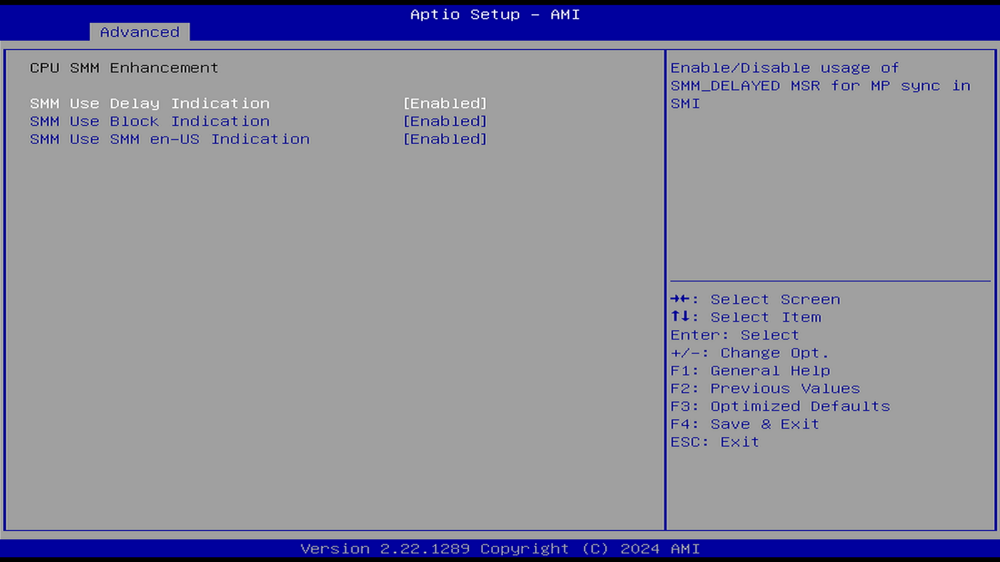

#### SMM Use Delay Indication（SMM 使用延迟指示）

选项：

Disable（禁用）

Enable（启用）

说明：

启用 SMM 使用延迟指示，以检查线程在进入 SMM 时是否会被延迟。

进入系统管理模式（SMM）会发生在指令边界处。当一个逻辑处理器正在执行包含大量内部操作流程的指令时，该处理器对 SMI（系统管理中断）的响应将会被延迟。参见 [34.17.2  SMI Delivery Delay Reporting](https://xem.github.io/minix86/manual/intel-x86-and-64-manual-vol3/o_fe12b1e2a880e0ce-1280.html)。

#### SMM Use Block Indication（SMM 使用阻塞指示）

选项：

Disable（禁用）

Enable（启用）

说明：

检查某个线程是否被阻止进入 SMM。

#### SMM Use SMM en-US Indication（使用美式英语显示 SMM 指示）

选项：

Disable（禁用）

Enable（启用）

说明：

用美式英语表达或说明 SMM 指示的用法。

### AC Split Lock（AC 对 Split‑Lock 的处理）

选项：

Disable（禁用）

Enable（启用）

说明：

Split Lock 指跨越两个 cache line 的原子操作（如 lock add，xchg 等），在传统机制下会锁住整个总线，导致性能显著下降。

启用后，当检测到 split‑lock 操作时，会触发对齐异常，而不是锁总线。这对对实时性能或云平台尤为重要。

### Total Memory Encryption（英特尔总内存加密技术）

选项：

Disable（禁用）

Enable（启用）

说明：

配置英特尔总内存加密（TME），以防止物理攻击对 DRAM 数据的侵害。

启用或禁用英特尔总内存加密 (TME) 和多租户（英特尔 ® TME-MT）。当选项设置为已禁用时，BIOS 将同时禁用 TME 和 TME-MT 技术。

## Power & Performance（电源与性能）

| 英文术语                       | 中文翻译                            |
| ------------------------------ | ----------------------------------- |
| CPU - Power Management Control | CPU 电源管理控制                    |
| GT - Power Management Control  | 核显电源管理控制（GT 电源管理控制） |

### CPU - Power Management Control（CPU 电源控制管理）

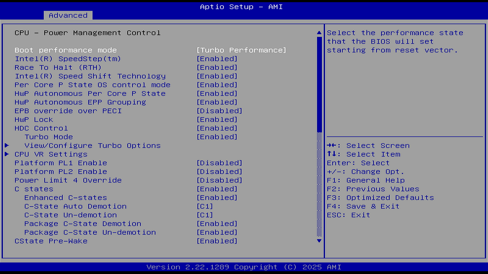

#### Boot performance mode（引导性能模式）

选项：
Max Battery（节能模式）

Max Non-Turbo Performance（最大非睿频性能模式）

Turbo Performance（睿频性能模式）

说明：

在进入操作系统前选择 CPU 的性能状态。

选择 BIOS 在从复位向量（CPU 用来开始执行指令的固定内存地址）开始时设置的性能状态。

最大非睿频性能模式，能使 CPU 运行于固定的时钟频率，从而提供更稳定、更可预测的结果，有助于改善实时性。

#### Intel(R) SpeedStep(tm)（英特尔 SpeedStep 技术）

选项

Disable（禁用）

Enable（启用）

说明：

Intel SpeedStep 技术可使系统自动调节处理器电压和核心频率（允许操作系统控制和选择 P 状态），以降低功耗和散热需求。开启后可固定 CPU 睿频倍频。

让处理器在多个频率和电压点之间切换。在禁用的情况下，CPU 会按照最高频率和电压运行，避免 CPU 频率变化，有助于改善实时性。

#### Race To Halt (RTH)（一种快速休眠技术）

选项

Disable（禁用）

Enable（启用）

说明：

启用或禁用 Race to Halt（RTH）功能。RTH 会动态提高 CPU 频率，以更快进入封装级 C 状态，从而降低整体功耗。（RTH 通过 MSR 寄存器 1FC 的第 20 位控制）

是否启动 CPU 省电功能。当 CPU 有任务时全速运行，完成后进入极低功耗状态。

#### Intel(R) Speed Shift Technology（一种极速变频技术）

选项

Disable（禁用）

Enable（启用）

说明：

启用后将开放 CPPC v2 接口，允许硬件控制 P 状态。

该技术通过硬件控制的 P 状态使处理器能更快地选择其最佳工作频率和电压以实现最佳性能和能效。此功能可让用户更精准地控制 CPU 的频率，使其能够迅速跃升至最大时钟速度。

若要支持 Intel Turbo Boost Max（ITBMT，英特尔睿频加速 Max）3.0 技术，则必须开启此项。若处理器不支持 ITBMT 3.0，此项将呈现灰色，不可设定状态。

ITBMT 3.0 能识别处理器上性能最佳的内核，同时通过提高利用电源和散热器空间时所必需的频率，提高这些内核的性能。由于生产差异，处理器内核的最大潜在频率各不相同。ITBMT 3.0 可识别 CPU 上最多两个速度最快的内核，称为“青睐的内核”。然后，它会对这些内核（或该内核）应用频率提升，并将关键工作负载分配到它们。ITBMT 3.0 旨在充分利用每个内核的最高频率，参见 [英特尔 ® 睿频加速 Max 技术 3.0 技术常见问题解答](https://www.intel.cn/content/www/cn/zh/support/articles/000021587/processors.html) [备份](https://web.archive.org/web/20260120161917/https://www.intel.cn/content/www/cn/zh/support/articles/000021587/processors.html)。

关闭该功能有助于改善实时性，此时 CPU 频率和电压不会被动态调整。

#### Per Core P state OS control mode（每核心 P 状态控制）

选项

Disable（禁用）

Enable（启用）

说明：

如果启用，频率将是动态调整的；如果禁用，所有核心都将随最忙的核心一道全速运行。

使用此功能可启用或禁用每个核心 P 状态的操作系统控制模式。

禁用时将设置命令 0x06 的第 31 位为 1，当该位被设置后，所有核心将采用最高核心（最忙碌的那个）的请求作为统一的电压频率请求。

当启用时，每个物理 CPU 核心可以以不同的频率运行。

如果禁用，处理器封装内的所有核心将以所有活动线程中解析出的最高频率运行。

#### HwP Autonomous Per Core P State（HwP 自动控制下的每核心性能状态）

选项

Disable（禁用）

Enable（启用）

说明：

这是 Intel 第 12 代和第 13 代 处理器配备的技术。

禁用每核心自主 P 状态（Autonomous PCPS）后，所有核心将始终请求相同的性能状态值。HWP（Hardware Controlled Performance States，硬件性能状态）可操作系统通过 MSR 中的能效偏好字段（EPP）设置其对性能或节能的偏好。启用 HWP 后，处理器将自行根据工作负载的需求，独立选择最合适的性能状态。参见 Empowering Mixed-criticality Industrial Realtime Computing on Performance Hybrid Architecture with Intel's Dynamic Frequency Scaling Evolution [https://builders.intel.com/docs/networkbuilders/empowering-mixed-criticality-industrial-real-time-computing-with-intel-s-dvfs-evolution-1712135964.pdf](https://builders.intel.com/docs/networkbuilders/empowering-mixed-criticality-industrial-real-time-computing-with-intel-s-dvfs-evolution-1712135964.pdf) [备份](https://web.archive.org/web/20251207044722/https://builders.intel.com/docs/networkbuilders/empowering-mixed-criticality-industrial-real-time-computing-with-intel-s-dvfs-evolution-1712135964.pdf)

对性能一致性有要求的用户（如实时计算等）可能需要关闭此选项。

#### HwP Autonomous EPP Grouping（HwP 自动控制下的 EPP 分组）

选项

Disable（禁用）

Enable（启用）

说明：

此选项依赖“HwP Autonomous Per Core P State（硬件自动控制的每核心性能状态）”，HwP Autonomous Per Core P State 开启时设置本选项才有意义。

启用 EPP 分组自主功能后，所有具有 EPP 的核心将请求相同的性能偏好值。

禁用 EPP 分组自主功能后，具有 EPP 的各个核心将不一定会请求相同的性能偏好值。

对性能一致性有要求的用户（如实时计算等）可能需要禁用此选项。

#### EPB override over PECI（通过 PECI 覆盖 EPB 设置）

选项

Disable（禁用）

Enable（启用）

说明：

此选项依赖于 PECI（平台环境控制接口）。

EPB，Performance and Energy Bias Hint：性能与能耗偏好提示能让软件指定其对处理器中性能与功耗权衡的偏好。

参见 [Intel Performance and Energy Bias Hint](https://docs.kernel.org/admin-guide/pm/intel_epb.html) [备份](https://web.archive.org/web/20260120162143/https://docs.kernel.org/admin-guide/pm/intel_epb.html)。

是否允许系统通过 PECI 接口修改处理器的 EPB 设置，从而实现更精确的能效控制。

启用时会发送 pcode 命令 0x2b，子命令 0x3 设置为 1。此功能允许通过 OOB（带外）方式控制 EPB 的 PECI 覆盖。

#### HwP Lock（HwP 锁定）

选项

Disable（禁用）

Enable（启用）

说明：

保护硬件性能状态设置不被外部修改的开关。

#### HDC Control（HDC 控制）

选项

Disable（禁用）

Enable（启用）

说明：

HDC，Hardware Duty Cycling，英特尔硬件占空比调节技术。

开启可通过硬件自动调节占空比以节能，关闭功耗增加但也许性能更稳定。

开启：需要操作系统本身支持才生效。

#### Turbo mode（睿频模式）

选项

Disable（禁用）

Enable（启用）

说明：

允许 CPU 在节能模式下，仍然能短时提升性能。

#### View/Configure Turbo Options（查看/配置睿频选项）

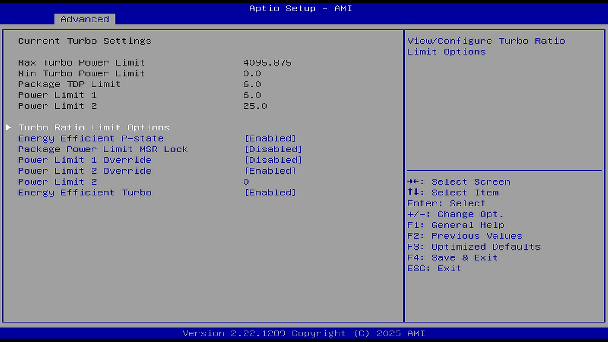

当前睿频设置：

| 项目                | 数值     |
| ------------------- | -------- |
| 最大睿频功率限制    | 4095.875 |
| 最小睿频  功率限制 | 0.0      |
| 封装 TOP 限制       | 6.0      |
| 功率限制 1          | 6.0      |
| 功率限制 2          | 25.0     |

##### Turbo Ratio Limit Options（睿频倍率限制选项）

当前睿频倍率限制设置。E 核心即小核，能效核心。

`NumcoreX` 定义核心范围后，对应的 `RatioX` 生效。按活跃核心数独立配置睿频限制。

E-core Turbo Ratio Limit Numcores：能效核心睿频限制。在启用睿频时，E 核支持的最大活动核心数量。如果设置为 2，则最多支持 2 个小核同时进行睿频；如果值为零，则忽略此条目。

E-core Turbo Ratio Limit Ratio：能效核心睿频限制。此选项依赖于 E-core Turbo Ratio Limit Numcores。为不同数量的活动 E 核设置最大加速倍频。1 个 E 核多少倍频，2 个 E 核多少倍频，以此类推。最大值固定为 85，与核心扩展模式无关。

##### Energy Efficient P-state（节能 P 状态）

选项

Disable（禁用）

Enable（启用）

说明：

当 P-state 功能设置为 0 时：

- 将禁用对 ENERGY_PERFORMANCE_BIAS MSR 的访问；
- CPUID 的 Function 6 的 ECX 寄存器第  3 位将为 0，表示系统不支持能源效率策略设置。

当设置为 1 时：

- 将开启对 ENERGY_PERFORMANCE_BIAS MSR 的访问，允许系统设置和读取能源性能偏好值。
  简单来说：

- 0 → 禁用能源效率策略相关接口，不支持节能偏好设置。
- 1 → 启用 ENERGY_PERFORMANCE_BIAS 接口，可以调整节能与性能之间的偏好。

##### Package Power Limit MSR Lock（封装功耗限制寄存器锁定）

选项

Disable（禁用）

Enable（启用）

说明：

启用此功能后，`PACKAGE_POWER_LIMIT` 寄存器（MSR）将被锁定，若需解锁该寄存器，必须重启系统。

启用将不允许系统或软件在运行时修改功耗限制；禁用将允许动态修改功耗限制参数。

##### Power Limit 1 Override（功耗限制 1 覆盖）

选项

Disable（禁用）

Enable（启用）

说明：

此选项依赖 Platform PL1 Enable（启用平台 PL1）。

如果此选项被禁用，BIOS 将会使用默认值来配置功耗限制 1（Power Limit 1）和功耗限制 1 时间窗口（Power Limit 1 Time Window）。该选项可用于解锁功耗墙。

##### Power Limit 1（PL1，功耗限制 1）

该选项依赖于 Power Limit 1 Override（功耗限制 1 覆盖）。

请注意单位：1W \= 1000mW。如 5W 应设置此选项为 5000。如果设置为 `0`，表示不启用自定义功耗限制，BIOS 将保留默认值。Platform Power Limit 1（平台功耗限制 1），单位为毫瓦（mW）。BIOS 在设置时会四舍五入到最接近的 1/8 瓦（0.125W）。

当超出限制时，CPU 的倍频会在经过一段时间后降低。下限可保护 CPU 并节省功耗，而上限则有助于提升性能。

PL1 是平均功耗的限制阈值，不会被超过 —— 英特尔推荐设置为等于处理器的基础功耗（即 TDP）。PL1 不应高于散热方案的散热能力上限。参见 [12th Generation Intel® Core™ Processors](https://edc.intel.com/content/www/us/en/design/ipla/software-development-platforms/client/platforms/alder-lake-desktop/12th-generation-intel-core-processors-datasheet-volume-1-of-2/011/package-power-control/)。

实现 Intel® Turbo Boost 技术 2.0 通常只需正确配置 PL1、PL2 和 Tau 参数。

##### Power Limit 1 Time Window（功耗限制 1 时间窗口）

选项

单位是秒。1-128 秒可选。

该值的范围可以是 0 到 128。`0` 表示使用默认值。

说明：

PL 1 是长期的功耗限制。

此设置表示在多长的时间窗口内，应维持平台的 TDP（热设计功耗）值。

##### Power Limit 2 Override（功耗限制 2 覆盖）

选项

Disable（禁用）

Enable（启用）

说明：

此选项依赖 Platform PL2 Enable（启用平台 PL2）。

如果此选项被禁用，BIOS 将会使用默认值来配置功耗限制 2（Power Limit 2）。该选项可用于解锁功耗墙。

##### Power Limit 2（PL2，功耗限制 2）

选项

请注意单位：1W \= 1000mW。如 5W 应设置此选项为 5000。如果设置为 `0`，表示不启用自定义功耗限制，BIOS 将保留默认值。PL2 单位为毫瓦（mW）。BIOS 在设置时会四舍五入到最接近的 1/8 瓦（0.125W）。

说明：

该选项依赖于 Power Limit 2 Override（功耗限制 2 覆盖）。

Power Limit 2（PL2）是短时功耗限制，用于允许 CPU 在短时间内突破 PL1，从而提供更高性能。一旦超过该阈值，PL2 快速功耗限制算法将尝试限制超过 PL2 的功耗峰值。

该参数用于设定在超过长期功耗限制后，CPU 在降低倍频之前所允许的时间长度。

##### Energy Efficient Turbo（睿频节能）

选项

Disable（禁用）

Enable（启用）

说明：

该功能会在合适的时候主动降低睿频频率以提升能效。建议仅在需要保持睿频频率恒定的超频场景下禁用，其他情况下请保持启用。

#### CPU VR Settings（CPU 电压调节器设置）

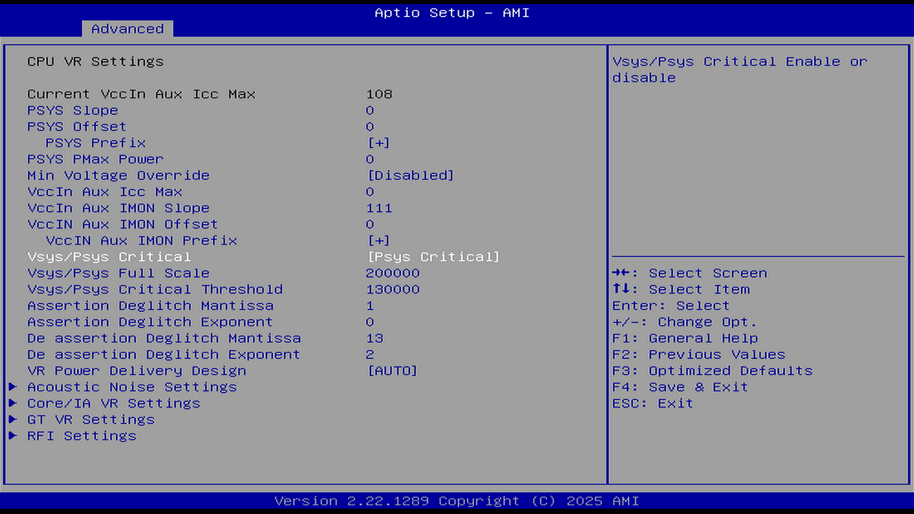

Current VccIn Aux Icc Max（CPU 输入电压辅助最大电流）：108

##### PSYS Slope（PSYS 平台电源变化率）

PSYS 平台电源变化率以 1/100 为单位定义，范围为 0 到 200。

例如，要设置变化率为 1.25，输入 125。设置为 0 表示自动（AUTO）。该设置通过 BIOS VR mailbox 命令 0x9 进行控制。

参见 [第 10 代英特尔 ® 酷睿 ™ 处理器系列](https://www.intel.cn/content/dam/www/public/cn/zh/documents/datasheets/10th-gen-core-families-datasheet-vol-1-datasheet.pdf) [备份](https://web.archive.org/web/20260120162514/https://www.intel.cn/content/dam/www/public/cn/zh/documents/datasheets/10th-gen-core-families-datasheet-vol-1-datasheet.pdf)。

##### PSYS Offset（PSYS 平台电源偏移量）

PSYS 平台电源偏移量以 1/1000 为单位定义，范围为 0 到 63999。例如，要设置偏移量为 25.348，输入 25348。该设置通过 BIOS VR mailbox 命令 0x9 进行控制。

##### PSYS Prefix（PSYS 平台电源前缀）

选项：

`+`

`-`

设置前缀，可以为正值或负值。

此项是搭配 PSYS Offset（PSYS 平台电源偏移量）使用的，用于指定是加上偏移量还是减去偏移量。

##### PSYS Pmax Power（PSYS 平台电源最大功率）

PSYS 平台电源最大功率（Pmax）以 1/8 瓦为单位定义，范围为 0 到 8192。

例如，要设置最大功率为 125 瓦，输入 1000（即 1000 × 1/8 \= 125 瓦）。设置为 0 表示自动（AUTO）。该设置通过 BIOS VR mailbox 命令 0xB 进行控制。

其具体作用在公开文档中未有明确说明。

##### Min Voltage Override（覆盖最低电压）

选项

Disable（禁用）

Enable（启用）

说明：

覆盖当前的最低电压。启用后，可在运行时和 C8 节能状态中覆盖最低电压限制。

##### Min Voltage Runtime（运行时的最低电压）

此选项依赖 Min Voltage Override（覆盖最低电压）。

运行时最低电压。范围为 0 至 1999mV，以 1/128 伏为增量单位。输入单位为毫伏 (mV)。

##### Min Voltage C8（C8 节能状态的最低电压）

此选项依赖 Min Voltage Override（覆盖最低电压）。

C8 节能状态的最低电压。范围为 0 至 1999mV，以 1/128 伏为增量单位。输入单位为毫伏 (mV)。

##### VccIn Aux Icc Max（CPU 输入电压辅助最大电流）

此选项用以调整 VccIn Aux 供电轨的最大电流限制，可用于超频或高负载机器。

设置 VccIn Aux（CPU 输入电压辅助最大电流）的最大 Icc 值，以 1/4A 为增量单位。范围为 0 至 512。

例如：若要设置 Icc Max 为 32 A，则输入 128（32 × 4）。

##### VccIn Aux IMON Slope（CPU 输入电压辅助电流检测变化率）

该选项影响系统读取电流值的准确性和调控精度。

IMON 即电流检测。该功能是一项电源管理特性，能让处理器通过 SVID 接口、借助 IMVP9.1 控制器读取 VCCIN Aux 的平均电流。

VCCIN AUX IMON 变化率，以 1/100 为增量单位。范围为 0-200。例如：若要设置 1.25 的变化率，则输入 125。输入 0 表示自动（AUTO），使用 BIOS VR mailbox 命令 0x18。

##### VccIn Aux IMON Offset（CPU 输入电压辅助电流检测偏移量）

用于修正或校准 CPU 电源轨（VCCIN Aux）上读取到的平均电流值。

VCCIN Aux IMON 偏移量，以 1/1000 为增量单位。范围为 0-63999。例如：若要设置 25.348 的偏移量，则输入 25348。IMON 使用 BIOS VR mailbox 命令 0x18。

##### VccIn Aux IMON Prefix（CPU 输入电压辅助电流检测前缀）

选项：

`+`

`-`

说明：

此选项和 VccIn Aux IMON Offset（CPU 输入电压辅助电流检测偏移量）相关。

设置前缀，可以为正值或负值。

用于指定对测量值是加上偏移量还是减去偏移量。

##### Vsys/Psys Critical（系统电压/平台功耗临界功能）

选项：

Disabled（禁用）

Psys Critical（平台功耗临界）

Vsys Critical（系统电压临界）

说明：

该功能用于启用 Vsys/Psys Critical（临界）监控功能。当启用此功能时，系统会根据设定的阈值监控平台电源状态，以便在电压或功耗超过安全范围时采取保护措施（例如限制性能、触发告警、避免过载等）。

##### 详细说明

#### Vsys/Psys Full Scale（Vsys/Psys 满量程值）

此选项依赖 Vsys/Psys Critical（系统电压/平台功耗临界功能）。

需要 Vsys/Psys 的满量程数值。

Vsys/Psys 临界值 \= 临界阈值 ÷ 满量程值。

Vsys 的输入单位为毫伏（mV），Psys 的输入单位为毫瓦（mW），或在 ATX12VO 电源架构下为百分比（%）。

##### Vsys/Psys Critical Threshold（Vsys/Psys 临界阈值）

此选项依赖 Vsys/Psys Critical（系统电压/平台功耗临界功能）。

需要输入 Vsys/Psys 的临界阈值。

Vsys/Psys 临界比值 \= 临界阈值 ÷ 满量程值。

Vsys 的输入单位为毫伏（mV），Psys 的输入单位为毫瓦（mW），或在 ATX12VO 架构下为百分比（%）。

##### Assertion Deglitch Mantissa（断言消隐尾数）

主要用于控制信号“断言”（assertion）过程中的消隐（deglitch）行为。用以设置断言信号消隐时间，作用是平衡电路中的噪声抑制与信号响应速度。

断言消隐尾数 0x4F[7-3]（存储在 MSR/寄存器地址 0x4F 的第 7 至第 3 位）。断言消隐= 2µs × 尾数 × 2^(指数)

Assertion Deglitch Mantissa（断言消隐指数）

此选项需搭配选项 Assertion Deglitch Mantissa（断言消隐尾数）使用。

断言消隐指数 0x4F[3-0]（存储在 MSR/寄存器地址 0x4F 的第 3 至第 0 位）。断言消隐 = 2µs × 尾数 × 2^(指数)。

##### De assertion Deglitch Mantissa（解除消隐尾数）

信号解除激活时的消隐时间计算参数。类似上方的断言消隐。

断言消隐尾数 0x49[7-3]（存储在 MSR/寄存器地址 0x49 的第 7 至第 3 位）。断言消隐= 2µs × 尾数 × 2^(指数)

##### De assertion Deglitch Exponent（断言消隐指数）

断言消隐指数 0x49[3-0]（存储在 MSR/寄存器地址 0x49 的第 3 至第 0 位）。断言消隐 \= 2µs × 尾数 × 2\^(指数)。

##### VR Power Delivery Design（电源调节器供电架构设计）

选项：

AUTO (0)：使用主板 ID 自动确定主板设计。

其他值：将覆盖主板 ID 逻辑，强制指定设计配置。

说明：

自定义 VR 供电设计值，此选项主要用于验证场景。

该功能用于控制用于 VR 设置覆盖值的 ADL 台式机主板设计。此选项将根据主板 ID 来判断使用哪种主板设计。

##### Acoustic Noise Settings（声学噪音设置）

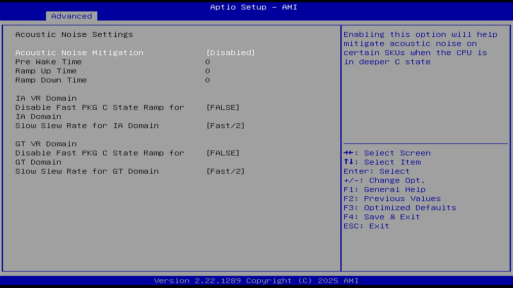

选项

Disable（禁用）

Enable（启用）

说明：

Acoustic Noise Mitigation（噪声抑制功能）：启用此选项可减轻部分 CPU 在深度 C 状态下可能出现的噪声问题。

开启此选项，方可设置下方选项：

- Pre Make Time（预触发时间）：设置最大预触发随机化时间（微刻度单位）。范围为 0-255。该参数用于声学噪声抑制的动态周期调整（DPA）调校。
- Ramp Up Time（上沿时间）：指 CPU 或电源性能从低到高的过渡时间。设置最大上升沿随机化时间（微刻度单位）。有效范围 0-255。该参数用于声学噪声抑制的动态周期调校（DPA）优化。
- Ramp Down Time（下沿时间）：指 CPU 或电源性能从高到低的过渡时间。设置最大下降沿随机化时间（微刻度单位）。有效范围 0-255。该参数用于声学噪声抑制的动态周期调校（DPA）优化。
- IA VR Domain（Intel Architecture Voltage Regulator，处理器计算核心电压调节域）

  - Disable Fast PKG C State Ramp for  
    VccIn Domain（禁用快速 PKG C 状态切换）：选项：FALSE/TRUE。FALSE: 在深度 C 状态下启用快速切换；TRUE: 在深度 C 状态下禁用快速切换
  - Slow Slew Rate for IA Domain（处理器核心电压调节域慢速压摆率）：选项：Fast/2、Fast/4、Fast/8、Fast/16。设置深度封装 C 状态切换的 VR VccIn（CPU 主供电输入电压）慢速压摆率。慢速压摆率 \= 快速模式压摆率 / 等分系数（可选 2/4/8/16），通过降低压摆率减轻声学噪声。

- GT VR Domain（Graphics Technology Voltage Regulator，核显电压调节域）

  - Disable Fast PKG C State Ramp for  
    VccIn Domain（禁用快速 PKG C 状态切换）：选项：FALSE/TRUE。FALSE: 在深度 C 状态下启用快速切换；TRUE: 在深度 C 状态下禁用快速切换
  - Slow Slew Rate for GT Domain（  
    核显电压调节域慢速压摆率设置）：选项：Fast/2、Fast/4、Fast/8、Fast/16。设置深度封装 C 状态切换的 VR GT（核显电压调节域）慢速压摆率。慢速压摆率 \= 快速模式压摆率 / 等分系数（可选 2/4/8/16），通过降低压摆率减轻声学噪声。

##### Core/IA VR Settings（核心/英特尔架构电压调节设置）

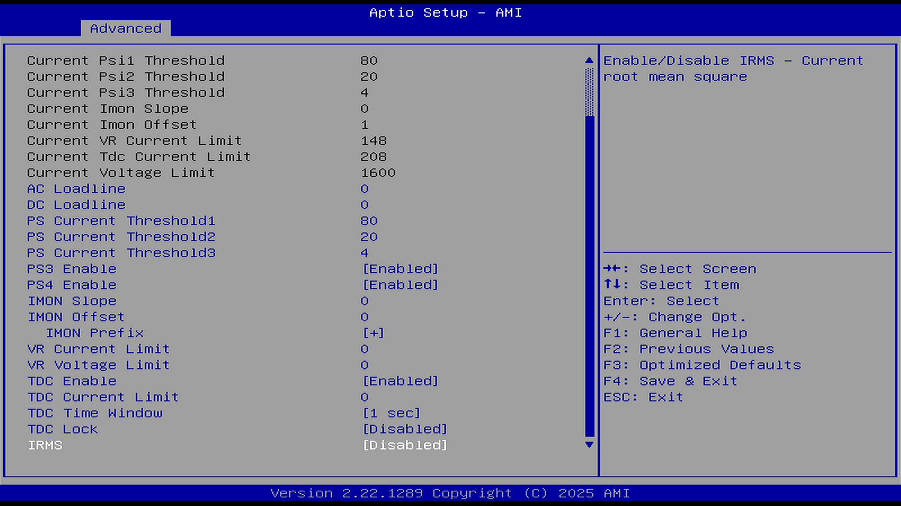

| 英文参数                  | 中文参数           |    数值 |
| :------------------------ | :----------------- | ------: |
| VR Config Enable          | 启用电压调节配置   | Enabled |
| Current AC Loadline       | 当前 AC 负载线     |     500 |
| Current DC Loadline       | 当前 DC 负载线     |     500 |
| Current Psi1 Threshold    | 当前 PSI1 阈值     |       0 |
| Current Psi2 Threshold    | 当前 PSI2 阈值     |      20 |
| Current Psi3 Threshold    | 当前 PSI3 阈值     |       4 |
| Current Imon Slope        | 当前电流检测变化率 |       0 |
| Current Imon Offset       | 当前电流检测偏移量 |       1 |
| Current VR Current Limit  | 当前电压调节器限制 |     148 |
| Current Tdc Current Limit | 当前热设计电流限制 |     208 |
| Current Voltage Limit     | 当前电压限制       |    1600 |

VR Config Enable（启用电压调节配置）

选项

Disable（禁用）

Enable（启用）

是以下选项存在的先决条件。

- AC Loadline（AC 负载线）：AC 负载线以 0.01 毫欧（1/100 mOhms）为单位定义（取值范围：0–6249（对应 0–62.49 毫欧）。该配置通过 BIOS mailbox 命令 0x2 实现。数值换算关系：

  - `100` \= 1.00 毫欧（mOhm）
  - `1255` \= 12.55 毫欧（mOhm）
  -`0` 表示自动/硬件默认值（AUTO/HW default）

因为直流电压降（电路长度愈增加，其电压会愈下降，导致其两端电压不同）问题，英特尔将主板到 CPU 之间的物理电阻抽象为虚拟电阻（即 AC/DC Loadline），即不考虑实际物理电阻的实现究竟是多少（每块主板都不同），来拟合 CPU 倍频所需的电压功率，这样不同的主板的主板供电模块的掉压行为就是一致的。AC Loadline 是升压负载线，DC 是降压负载线。

负载线（AC/DC）应通过 VRTT 工具进行测量，并通过 BIOS 的负载线覆盖设置选项进行相应配置。AC 负载线会直接影响工作电压（AC），DC 负载线则会影响功率测量（DC）。与按 POR 阻抗设计的主板相比，采用较低 AC 负载线的优秀主板设计能够在功耗、性能和散热方面实现改进。参见 [VCCCORE DC Specifications](https://edc.intel.com/content/www/de/de/design/products/platforms/details/raptor-lake-s/13th-generation-core-processors-datasheet-volume-1-of-2/vcccore-dc-specifications/) [备份](https://web.archive.org/web/20260120162645/https://edc.intel.com/content/www/de/de/design/products/platforms/details/raptor-lake-s/13th-generation-core-processors-datasheet-volume-1-of-2/vcccore-dc-specifications/)、[Intel CPU AC / DC Loadline、防掉壓 CEP 觀念原理 一次講完](https://forum.gamer.com.tw/C.php?bsn=60030&snA=644011) [备份](https://web.archive.org/web/20260120210027/https://forum.gamer.com.tw/C.php?bsn=60030&snA=644011)、[从头开始讲 Loadline](https://tieba.baidu.com/p/8328546013)。

Intel 建议 AC Loadline 与 DC Loadline 取值一致（AC = DC）。警告：一般不建议修改 AC/DC Loadline。

- DC Loadline（DC 负载线）：DC 负载线以 0.01 毫欧（1/100 mOhms）为单位定义（取值范围：0–6249（对应 0–62.49 毫欧）。该配置通过 BIOS mailbox 命令 0x2 实现。数值换算关系：

  - `100` \= 1.00 毫欧（mOhm）
  - `1255` \= 12.55 毫欧（mOhm）
  - `0` 表示自动/硬件默认值（AUTO/HW default）

- PS Current Threshold1（即 Power Stage Current Threshold1，电源阶段电流阈值 1）：此值以每 1/4 安培为单位递增，例如设置为 400 表示电流阈值为 100 安培（400 × 0.25A）。其取值范围为 0 到 512，对应实际电流为 0 到 128 安培。设置为 0 表示启用自动模式（AUTO）。该参数通过 BIOS VR mailbox 命令 0x3 进行设置。

- PS Current Threshold2（即 Power Stage Current Threshold2，电源阶段电流阈值 2）：此值以每 1/4 安培为单位递增，例如设置为 400 表示电流阈值为 100 安培（400 × 0.25A）。其取值范围为 0 到 512，对应实际电流为 0 到 128 安培。设置为 0 表示启用自动模式（AUTO）。该参数通过 BIOS VR mailbox 命令 0x3 进行设置。
- PS Current Threshold3（即 Power Stage Current Threshold3，电源阶段电流阈值 3）：此值以每 1/4 安培为单位递增，例如设置为 400 表示电流阈值为 100 安培（400 × 0.25A）。其取值范围为 0 到 512，对应实际电流为 0 到 128 安培。设置为 0 表示启用自动模式（AUTO）。该参数通过 BIOS VR mailbox 命令 0x3 进行设置。
- PS3 Enable（Power Stage 3，电源阶段 3）：启用/禁用。该配置通过 BIOS 电压调节器 mailbox 命令 0x3 实现。
- PS4 Enable（Power Stage 4，电源阶段 4）：启用/禁用。该配置通过 BIOS 电压调节器 mailbox 命令 0x3 实现。
- IMON Slope（电流检测变化率）：此值以 1/100 为增量单位定义，取值范围为 0 到 200。例如，要设置变化率为 1.25，则输入 125。设置为 0 表示自动模式（AUTO）。此参数通过 BIOS VR mailbox 命令 0x4 进行配置。用于高精度电源校准。
- IMON Offset（电流检测偏移量）：此值以 1/1000 为单位定义，取值范围为 0 到 63999。例如，如果要设置偏移量为 25.348，则应输入数值 25348。此参数通过 BIOS VR mailbox 命令 0x4 进行配置。用于微调 VR（电压调节器）的电流感应值，以提高功耗报告的准确性或满足电源调校需求。

  - IMON Prefix（电流检测前缀）：`+`/`-`。用设置加/减电流检测偏移量。

- VR Current Limit（电压调节器当前限制）：电压调节器电流限制（Icc Max）代表允许 CPU 在任意时刻瞬间拉取的最大电流。该值以 1/4 安培（A）为单位定义，例如输入 `400` 表示 100 A（400 × 0.25A）。取值范围为 0–512，对应实际电流 0–128 A；输入 `0` 表示启用自动模式。该设置通过 BIOS VR mailbox 命令 `0x6` 进行控制。
- VR Voltage Limit（电压调节器电压限制）：Voltage Limit（VMAX）：用于设置电压调节器（VR）允许的最大瞬时输出电压。单位为毫伏（mV）。其取值范围为 0–7999 mV。此设置通过 BIOS VR mailbox 命令 0x8 进行控制。
- TDC Enable（Thermal Design Current，热设计电流）：CPU 平均 *电流* 不能超过此值。选项：Disable（禁用）/Enable（启用）。此选项决定了：

  - TDC Current Limit（热设计电流当前限制）：以 1/8 安培（A）为递增单位定义，取值范围为 0–32767。例如，如果要设置最大瞬时电流为 125 A，应输入 1000（1000 × 0.125 A \= 125 A）。输入 `0` 表示设置为自动模式（0 A）。该参数通过 BIOS 的 VR mailbox 命令 `0x1A` 进行配置。
  - TDC Time Window（热设计电流时间窗口）：值：1-448。电压调节器热设计电流时间窗口限制。是指在特定时间内，CPU 可承受的最大电流（TDC Current Limit）所允许的持续时间。其单位为毫秒（ms），用于控制 CPU 在高负载下的电流限制响应时间。
  - TDC Lock（锁定热设计电流）:启用/禁用。可锁定持续电流上限，防止损坏芯片。

- IRMS：启用/禁用。IRMS \= 电流（电流的符号是 I）有效值（Current Root Mean Square），实时电流有效值监测。

##### GT VR Settings（核显电压调节设置）

所有选项均参见 Core/IA VR Settings（核心/英特尔架构电压调节设置）。

##### RFI Settings（Radio Frequency Interference，射频干扰设置）

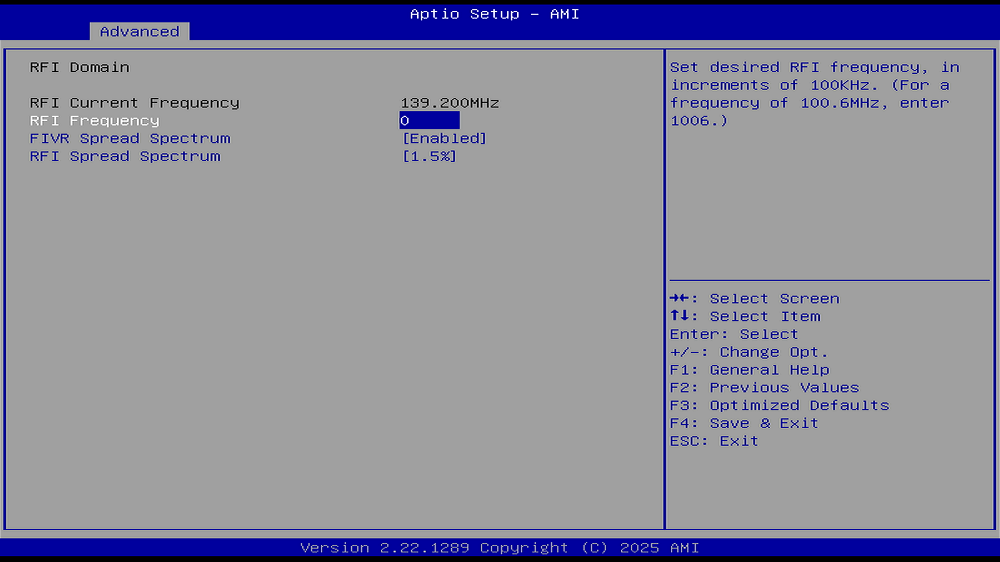

RFI Current Frequency（当前 RFI 频率）：139.200MHz

- RFI Frequency（RFI 频率）：设置目标 RFI 频率（Set desired RFI Frequency）

  - 调节单位：以 100 千赫兹（100KHz）为步进
  - 频率范围：130 MHz 至 160 MHz
  - 默认硬件频率：139.6 MHz
  - 输入值 = 目标频率（MHz） × 10
  （例如：需设置 139.6 MHz 时 → 输入 1396）

- RIVR Spread Spectrum（Fully Integrated Voltage Regulator，全集成电压调节器）：启用/禁用。全集成电压调节器展频。可降低峰值辐射强度，减少对特定频率的干扰。

- RFI Spread Spectrum（RFI 射频展频）。0.5%-6%。用于缓解电磁干扰（EMI）。

#### Platform PL1 Enable（启用平台 PL1 / PsysPL1）

选项

Disable（禁用）

Enable（启用）

说明：

这是是否允许修改 PL1 的总开关。是启用/禁用平台功耗限制  1（Platform Power Limit 1，PL1）的编程设置。

启用（Enabled）：BIOS 会激活并写入 PL1 值，处理器会在指定时间窗口内以该值限制平均功耗。

禁用（Disabled）：BIOS 不编程 PL1，此时处理器将使用默认或平台固件设定的限制值。

处理器引入了 Psys（平台功耗）机制，以增强对处理器功耗的管理。Psys 信号需要来自兼容的充电电路，并接入 IMVP9（电压调节器）。该信号将通过 SVID 向处理器提供整个平台的热相关总功耗信息（包括处理器及平台其余部分）。

#### Platform PL1 Power（平台 PL1 / PsysPL1 功耗）

说明：

此选项依赖 Platform PL1 Enable（启用平台 PL1），这是 BIOS 存储的待生效 PL1 值（可能执行）。实际执行的是 Power Limit 1（如已设置）。

平台功耗限制  1”（Platform Power Limit 1，简称 PL1）以毫瓦（mW）为单位设置。BIOS 在编程时会将其四舍五入到最接近的  1/8 瓦。你可以在由 `PACKAGE_POWER_SKU_MSR` 指定的最小功耗限制和最大功耗限制之间设置任意值。例如，如果你想设置为  12.50  瓦，就输入  `12500`。该设置会成为处理器 RAPL 算法（用于监控功耗并控制频率和电压的闭环控制算法）中的新 PL1 值。

此值是平台平均功耗不会被超过的阈值 —— 英特尔推荐设置为等于平台的散热能力。参见 [Platform Power Control](https://edc.intel.com/content/www/us/en/design/ipla/software-development-platforms/client/platforms/alder-lake-desktop/12th-generation-intel-core-processors-datasheet-volume-1-of-2/011/platform-power-control/)

#### Platform PL1 Time Window（平台 PL1 / PsysPL1 窗口时间）

说明：

此选项依赖 Platform PL1 Enable（启用平台 PL1）。

平台功耗限制 1 时间窗口，单位为秒。该值的范围为 0 到 128。0 表示使用默认值。该选项用于指定平台 TDP（热设计功耗）应当维持的时间窗口。

#### Platform PL2 Enable（启用平台 PL2 / PsysPL2）

选项

Disable（禁用）

Enable（启用）

说明：

这是是否允许修改 PL2 的总开关。是启用/禁用平台功耗限制  2（Platform Power Limit 2，PL2）的编程设置。一旦功耗超过该阈值，PsysPL2 快速功耗限制算法将尝试限制超出 PsysPL2 的功耗峰值。

启用（Enabled）：BIOS 会激活并写入 PL2 值，处理器会在指定时间窗口内以该值限制平均功耗。

禁用（Disabled）：BIOS 不编程 PL2，此时处理器将使用默认或平台固件设定的限制值。

#### Platform PL2 Power（平台 PL2 / PsysPL2 功耗）

说明：

此选项依赖 Platform PL2 Enable（启用平台 PL2），这是 BIOS 存储的待生效 PL2 值（可能执行）。实际执行的是 Power Limit 2（如已设置）。
平台功耗限制  2（Platform Power Limit 2，简称 PL2）以毫瓦（mW）为单位设置。BIOS 在编程时会将其四舍五入到最接近的  1/8 瓦。你可以在由 `PACKAGE_POWER_SKU_MSR` 指定的最小功耗限制和最大功耗限制之间设置任意值。例如，如果你想设置为  12.50  瓦，就输入  `12500`。该设置会成为处理器 RAPL 算法（用于监控功耗并控制频率和电压的闭环控制算法）中的新 PL2 值。

#### Power Limit 4 Override（PL4 覆盖，功耗限制 4 覆盖）

Power Limit 4（功耗限制 4），单位为毫瓦（mW）。BIOS 在编程时会四舍五入到最接近的 1/8 瓦。例如：如果要设置为 12.50W，应输入 12500。如果该数值设置为 0，BIOS 将保留默认值。

#### Power Limit 4（PL4，功耗限制 4）

Power Limit 4（功耗限制 4），单位为毫瓦（mW）。BIOS 在编程时会四舍五入到最接近的 1/8 瓦。例如：如果要设置为 12.50W，应输入 12500。如果该数值设置为 0，BIOS 将保留默认值。

PL4 是一个理论上不允许被超过的功耗限制。PL4 功耗限制算法会提前限制频率，以防止功耗峰值超过 PL4。

#### Power Limit 4 Lock（PL4，锁定功耗限制 4）

选项

Disable（禁用）

Enable（启用）

说明：

是否允许在操作系统中动态修改 PL4 设置。Power Limit 4 MSR 601h Lock（功耗限制 4 锁定寄存器）

当启用此选项时，PL4（功耗限制 4）配置将在操作系统运行期间被锁定，不可更改；当禁用此选项时，操作系统运行期间仍可以更改 PL4 配置。

启用表示锁定；禁用表示可调整。

#### C states（C 状态）

选项

Disable（禁用）

Enable（启用）

说明：

英特尔开发的处理器电源管理机制——C 状态架构，可以在基本的 C1（停止状态，阻断 CPU 时钟周期）基础上进一步降低功耗。

当启用时，所有 CPU 核心进入 C 状态（空闲状态）时，CPU 会自动切换到最低运行频率以降低功耗。

该选项允许在 CPU 并未 100% 利用时，让其进入 C 状态（低功耗空闲状态），以降低整体功耗。

注：代表 CPU/封装睡眠状态。

- C0 - 活动：CPU 打开并运行。
- C1 - 自动停止：内核时钟已关闭。处理器没有执行指令，但几乎可以立即返回到执行状态。某些处理器还支持增强型 C1 状态（C1E），以降低功耗。
- C2 - 停止时钟：内核时钟和总线时钟已关闭。该处理器保持所有软件可见状态，但可能需要更长的时间才能唤醒。
- C3 - 深度睡眠：时钟生成器已关闭。处理器无需保持其高速缓存一致性，但能保持其他状态。某些处理器具有 C3 状态（深度睡眠）的不同变体与唤醒处理器所需的时间不同。
- C4 - 更深度的睡眠：降低 VCC
- DC4 - 更深度的 C4 睡眠：进一步减少 VCC

参见 [处理器深度和深度睡眠状态之间的差异](https://www.intel.cn/content/www/cn/zh/support/articles/000006619/processors/intel-core-processors.html)

该选项决定了以下选项：

##### Enhanced C-states（增强型 C 状态，即 C1E）

选项：

Disable（禁用）

Enable（启用）

说明：

开启增强型 C1 电源状态，可在部分场景下改善能效与响应性能。

当启用时，所有 CPU 核心进入 C 状态（空闲状态）时，CPU 会自动切换到最低运行频率以降低功耗。

##### C-State Auto Demotion（C 状态自动降级）

选项：

Disable（禁用）

C1

说明：

当本项启用时，CPU 将根据非处理器核心（Uncore）自动降级信息有条件地降低 C 状态。

使用此功能可以防止 CPU 频繁进入 C 状态，从而改善延迟表现。意味着当 CPU 处于深度 C 状态（如 C6 或更深）时，如果系统认为需要更快地响应，CPU 会自动降级到 C1 状态。

##### C-State Un-demotion（C 状态取消降级）

选项：

Disable（禁用）

C1

说明：

当处理器在检测到先前的 C 状态降级决策不合适时，自动恢复到原本请求的更深 C 状态。配置处理器 C 状态不自动降级。

##### Package C-State Demotion（封装 C 状态自动降级）

选项：

Disable（禁用）

Enable（启用）

说明：

当启用此项时，CPU 将有条件地从已降级的 C3 或 C1 状态提升到更高的 C 状态。

当一颗 CPU 的所有核心进入深度 C 状态时，那么整个 CPU 的 package（CPU 封装，指整块 CPU）就可以进入这些状态。

##### Package C-State Un-demotion（封装 C 状态取消降级）

选项：

Disable（禁用）

Enable（启用）

说明：

配置 CPU 封装 C 状态不自动降级。

#### CState Pre-Wake（C 状态预唤醒）

选项：

Disable（禁用）

Enable（启用）

说明：

其作用是减少 CPU 从深度 C 状态（如 C6、C7）恢复时的延迟。启用此功能时，系统会在 CPU 进入深度空闲状态之前，提前进行一些准备工作，以便在需要时能够更快地恢复到活动状态。
若禁用：会将 POWER_CTL 寄存器（MSR 0x1FC）的第 30 位设置为 1，从而禁用 C 状态预唤醒（Cstate Pre-Wake）功能。

#### IO MWAIT Redirection（IO MWAIT 重定向）

选项：

Disable（禁用）

Enable（启用）

说明：

设置后，系统将把发送到 I/O 寄存器的 IO_read 指令重定向到 MWAIT。映射地址为 PMG_IO_BASE_ADDRBASE + 偏移量。

通过将 I/O 读操作重定向到 MWAIT，系统可以在等待 I/O 操作完成时降低功耗，提升能效。

开启后，处理器将进入最低功耗的空闲状态，直到发生指定的事件。

#### Package C State Limit（封装 C 状态限制）

选项：

C0 / C1 / C2 / C3 / C6 / C7 / C7S / C8 / C9 / C10 / Cpu Default（处理器默认） / Auto（自动）

说明：

最大封装 C 状态限制设置。

指定处理器在空闲时可以进入的最深电源管理状态。该设置影响整个处理器包（Package）的电源管理行为，而不仅仅是单个核心。

对 CPU、PCIe、内存、显卡的 C 状态支持。

CPU 默认：保持出厂默认值；

自动：AMI BIOS 将自动设置 C 状态封装寄存器的限制。初始化为可用的最深封装 C 状态限制。

#### Package C State Workaround（封装 C 状态变通解决方案）

选项：

Disable（禁用）

Enable（启用）

说明：

启用此功能可修复旧的机械硬盘在进入封装 C 状态时出现的问题。

#### C6/C7 Short Latency Control (MSR 0x60B)（C6/C7 短时延迟控制）

快速中断响应

- Time Unit：时间单位：用于 IRTL（Interrupt Response Time Limit，中断响应时间限制）值的第 12 到第 10 位的度量单位。这是一种用于设置响应中断最大允许延迟的机制。单位 ns 代表纳秒。
- Latency：中断响应时间限制值（IRTL）的第 [9:0] 位，输入范围为 0 到 1023。配合上面设定的“时间单位”，来确定 CPU 从进入低功耗状态（如 C-state）到能够响应中断的最大延迟时间。

#### C6/C7 Long Latency Control (MSR0x60C)（C6/C7 长时延迟控制）

深度休眠后的中断响应

选项同上。

#### C8 Latency Control (MSR 0x633)（C8 延迟控制）

选项同上。

#### C9 Latency Control (MSR 0x634)

C9 延时控制

选项同上。

#### C10 Latency Control (MSR 0x635)（C10 延时控制）

选项同上。

#### Thermal Monitor（热量监控程序）

选项：

Disable（禁用）

Enable（启用）

说明：

此选项和 PECI 相关设置存在关联。

Intel CPU 热量监控程序/过温防护功能。当温度过高时会对 CPU 进行降频降速以降温。

#### Interrupt Redirection Mode Selection（选择逻辑中断的重定向模式）

选项：

Fixed Priority（固定优先级）

Round robin（轮询）

Hash Vector（哈希向量）

No Change（不改变）

说明：

- Fixed Priority 为固定优先级，中断固定重定向到特定处理器核心，适合高确定性任务。

- Round robin 为轮询，中断在多个处理器间轮流分配。

- Hash Vector 利用哈希算法将中断分布到多个 CPU（适合多队列网卡）

- No Change 保留现有设置，不更改中断路由策略

#### Timed MWAIT（定时 MWAIT）

选项：

Disable（禁用）

Enable（启用）

说明：

此选项和 MWAIT 相关设置有关。

是否允许操作系统使用带定时功能的 MWAIT 进入深度空闲状态。若禁用则采用普通中断。

#### Custom P-state Table（添加自定义 P 状态表）

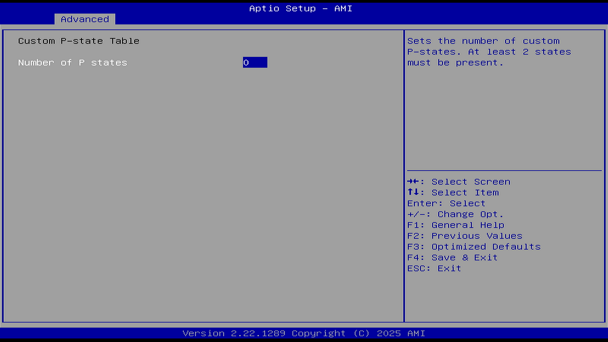

##### Number of custom P states

设置自定义 P 状态（性能状态）的数量。至少必须存在 2 个状态。P 状态越多频率调节越精细化。

0 代表禁用此选项。

#### EC Turbo Control Mode（EC 睿频控制模式）

选项：

Disable（禁用）

Enable（启用）

##### AC Brick Capacity（交流电源适配器容量）

选项：

90W AC Brick

65W AC Brick

75W AC Brick

说明：

指定交流电源适配器（AC 适配器）容量，即交流电源适配器（AC Brick）的额定功率容量（W）

##### EC Polling Period（嵌入式控制器 EC 轮询周期）

查询（轮询）EC 状态或数据的时间间隔

数值从 1 到 255，对应时间范围为 10 毫秒 到 2.55 秒（1 个计数单位 \= 10 毫秒）。

##### EC Guard Band Value（嵌入式控制器 EC 保护带值）

用于定义在执行关键操作（如电源管理、系统初始化、硬件检测等）时，嵌入式控制器（EC）允许的最大误差范围。

计数范围从 1 到 20，对应的功率范围为 1 W 到 20 W。

##### EC Algorithm Selection（嵌入式控制器算法选择）

用于选择算法的数值范围是 1 到 10。每个数值代表一种不同的嵌入式控制器（EC）运行策略。

#### Energy Performance Gain（能效性能增益）

选项：

Disable（禁用）

Enable（启用）

说明：内存电源相关设置。

作用未知

##### EPG DIMM Idd3N（主动待机电流）

来自数据手册的主动待机电流（Active standby current，Idd3N），单位为毫安。必须以每个 DIMM（内存条）为单位进行计算。

##### EPG DIMM Idd3P（主动掉电电流）

来自数据手册的主动掉电电流（Active power-down current，Idd3P），单位为毫安。必须以每个 DIMM（内存条）为单位进行计算。

#### Power Limit 3 Settings（电源限制 3 设置，PL3）

超短峰值功率限制，用于极短时间内处理高强度突发工作

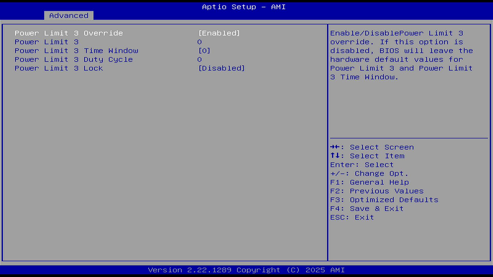

#### Power Limit 3 Override

覆盖电源限制 3，PL 3

选项参数均同 PL1。一旦超过该阈值，PL3 快速功耗限制算法将尝试通过动态限制频率来限制超过 PL3 的功耗峰值的占空比。PL3 默认是禁用的。这是一个可选设置。

#### CPU Lock Configuration（CPU 锁定设置）

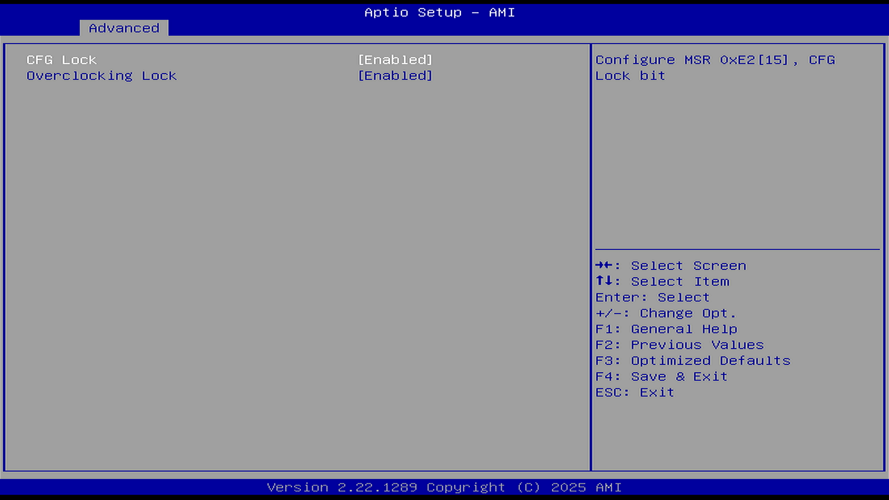

##### CFG Lock（CFG 锁）

选项：

Disable（禁用）

Enable（启用）

说明：

关闭或者开启 MSR 0xe2 寄存器，电源管理相关。控制 MSR 0xE2 的低 16 位（bits [15:0]）开关。

MSR 0xE2 是 Model Specific Register 的一个寄存器位数锁定，属于非标准寄存器，是用来控制 CPU 的工作环境和读取工作状态，例如电压、温度、功耗等非程序性指标。如果 CFG Lock 是开启状态（即 MSR 0xE2 是被锁定的），那么 MSR 0xE2 就是只读的。

如果使用黑苹果（Hackintosh），则需要关闭此选项，允许系统写入此寄存器。

Hyper V 可能某些功能需要关闭此选项。

##### Overclocking Lock（超频锁定）

超频锁定（位于 FLEX_RATIO MSR 寄存器的第 20 位，地址为 194）

Intel 处理器带 K 才能超频。

### GT - Power Management Control（核显电源管理控制）

Intel Graphics Technology 即 GT，图形技术。

#### Maximum GTT frequency（图形执行管理器最大频率）

GTT：Graphics Translation Table，图形地址转换表。

用户限制的最大 GT 频率。可选择 200MHz（RPN）或 400MHz（RP0）。超出范围的数值将被限制到该 SKU 支持的最小值或最大值。

#### Disable Turbo GT frequency（禁用显卡睿频）

选项：

Disable（禁用）

Enable（启用）

说明：

启用：禁用显卡睿频。禁用：显卡频率不受限制。

## PCH-FW Configuration（平台控制器中枢和固件配置）

PCH：Platform Controller Hub，平台控制器中枢（通常称为南桥），用于芯片组与固件相关配置。

### ME State（Intel 管理引擎状态）

选项：

Disable（禁用）

Enable（启用）

说明：

开启或关闭 Intel 管理引擎。

ME：Intel Management Engine，Intel 管理引擎状态。英特尔 ® 管理引擎是一个嵌入式微控制器（集成在某些英特尔芯片组上），运行一个轻量级微内核操作系统，为基于英特尔 ® 处理器的计算机系统提供各种功能和服务。

参见 [什么是英特尔 ® 管理引擎？](https://www.intel.cn/content/www/cn/zh/support/articles/000008927/software/chipset-software.html) [备份](https://web.archive.org/web/20260120162926/https://www.intel.cn/content/www/cn/zh/support/articles/000008927/software/chipset-software.html)

### ME Unconfig on RTC Clear（重置 RTC 时是否重置 ME）

选项：

Disable（禁用）

Enable（启用）

说明：

当设置为 Disabled 时，在执行 RTC Clear（清除实时时钟 RTC 的 CMOS 存储）操作后，不会重置或清除 ME 配置。

当设置为 Enable 时，在执行 RTC Clear（清除实时时钟 RTC 的 CMOS 存储）操作后，会重置或清除 ME 配置。

### Comms Hub Support（Comms 总线支持）

选项：

Disable（禁用）

Enable（启用）

说明：

部分嵌入式设备需要此总线，常见于工业物联网。按需开启。

### JHI Support（JHI 支持）

选项：

Disable（禁用）

Enable（启用）

说明：

需要操作系统支持。工业物联网可能会用到此选项，按需开启。

JHI：Intel® DAL（Dynamic Application Loader）Host Interface Service，Intel 动态应用加载器主机接口服务

英特尔 ® 动态应用加载器（Intel® DAL）是英特尔 ® 平台的一项独特功能，适用于多种形态的设备，包括工作站、台式机、笔记本、平板电脑和物联网设备。它可用于在英特尔 ® 融合安全与管理引擎固件上运行小段 Java\* 代码。

参见 [Intel® Dynamic Application Loader](https://www.intel.com/content/www/us/en/developer/tools/dal/overview.html)

### Core Bios Done Message（核心 BIOS 初始化完成信息）

选项：

Disable（禁用）

Enable（启用）

说明：

BIOS 在完成核心 DXE 阶段后向 ME / BMC 发出的信号，意味着系统已完成对 Option ROM 的初始化。

是否将核心 BIOS 初始化完成信息发送给 Intel 管理引擎。作用：触发安全策略（如 KCS Trust）、同步双方状态，保障后续启动与管理流程顺利进行。

参见 https://github.com/Intel-BMC/host-misc-comm-manager

### Firmware Update Configuration（固件更新配置）

配置 Intel 管理引擎技术参数。

#### ME FW Image Re-Flash（Intel 管理引擎映像重新刷写）

选项：

Disable（禁用）

Enable（启用）

控制是否允许重新刷写 Intel 管理引擎的固件的开关。

#### FW Update（固件更新）

选项：

Disable（禁用）

Enable（启用）

说明：

控制是否允许更新 Intel 管理引擎的固件。

### PTT Configuration（Intel 可信平台技术配置）

PTT：Platform Trust Technology，Intel 可信平台技术。如果要安装 Windows 11，需要开启此功能。

英特尔 ® PTT 是符合 2.0 规范并提供与独立 TPM 相同的功能的集成 TPM，只是它驻留在系统的固件中，因此无需专用处理或内存资源。

参见 [什么是可信平台模型（TPM）及其与英特尔 ® Platform Trust Technology（英特尔 ® PTT）的关系？](https://www.intel.cn/content/www/cn/zh/support/articles/000094205/processors/intel-core-processors.html) [备份](https://web.archive.org/web/20260120210554/https://www.intel.cn/content/www/cn/zh/support/articles/000094205/processors/intel-core-processors.html)

#### TPM Device Selection（TPM 设备选择）

选项：

dTPM

PTT

PTT 在 SkuMgr 中启用 PTT。

dTPM 1.2 在 SkuMgr 中禁用 PTT。

警告！如果要禁用 PTT/dTPM，那么存储在其中的所有数据都将丢失（如 BitLocker 恢复密钥）。

SkuMgr 是 BIOS 中的一个模块，用于管理系统的硬件配置和功能启用。

TPM 或受信任的平台模块是一种驻留在计算机主板或其处理器中的物理或嵌入式安全技术（微控制器）。TPM 使用加密技术来帮助在电脑上安全地存储基本和关键信息，以启用平台身份验证。

### FIPS Configuration（联邦信息处理标准配置）

FIPS 140-2（Federal Information Processing Standard 140-2），联邦信息处理标准 (FIPS) 出版物 140-2 是美国政府标准，它定义了信息技术产品中加密模块的最低安全要求

联邦信息处理标准（FIPS）指定了联邦政府对加密模块的要求。

#### FIPS Mode Select（联邦信息处理标准模式选择）

选项：

Disable（禁用）

Enable（启用）

说明：

在启用 FIPS 模式后，系统将强制使用符合 FIPS 认证的加密算法和操作，确保数据处理的安全性和合规性。

### ME Debug Configuration（Intel 管理引擎调试配置）

#### HECI Timeout（HECI 超时）

选项：

Disable（禁用）

Enable（启用）

说明：

HECI，Host Embedded Controller Interface，增强型主机控制器接口。EHCI 控制 USB 2.0。

控制 HECI 发送/接收超时。

启用此功能后，如果主机操作系统在规定时间内未能与管理引擎建立通信，系统可能会中止该过程并报告超时错误。

增强型主机控制器接口（EHCI）规范描述了通用串行总线（USB）修订版 2.0 的主机控制器的寄存器级接口。该规范包括对系统软件和主机控制器硬件之间的硬件和软件接口的描述。

参见 [Enhanced Host Controller Interface Specification](https://www.intel.com/content/www/us/en/products/docs/io/universal-serial-bus/ehci-specification.html)

#### Force ME DID Init Status（强制初始化 Intel 管理引擎（ME）的设备标识符）

选项：

Disable（禁用）

Enable（启用）

说明：

启用此选项后，系统会在启动时强制初始化 Intel 管理引擎的设备标识符

#### CPU Replaces Polling Disable（禁用 CPU 更换轮询）

选项：

Disable（禁用，禁止 CPU 替代轮询，由其他机制处理轮询任务）

Enable（启用，允许 CPU 进行替代式轮询操作）

说明：

启用此选项将禁用 CPU 更换轮询循环。此设置多见于嵌入式 / IoT 或服务器硬件。

#### ME DID Message（Intel 管理引擎的设备标识符信息）

选项：

Disable（禁用）

Enable（启用）

说明：

控制 Intel 管理引擎的设备标识符消息（禁用将阻止发送设备标识符消息）。Intel 管理引擎需要开启此选项。

#### HECI Message check Disable（禁用 HECI 信息检查）

选项：

Disable（禁用）

Enable（启用）

说明：

HECI 是 USB 2.0 控制器。

BIOS 在自检后等待 Intel 管理引擎应答的总线校验机制。

设置此选项可在发送 BIOS 启动路径消息时禁用消息校验。

#### MBP HOB Skip（跳过 MBP HOB）

选项：

Disable（禁用）

Enable（启用）

说明：

MBP：Memory Based Protection Hand-Off Blocks，基于内存的保护交接块

启用后，BIOS 在启动过程中会跳过 Intel 管理引擎的 Memory‑Based Protection（MBP）的 HOB 区域（主要用于描述内存保护区域的信息），即不创建或不处理该区域内的 HOB（Hand‑Off Blocks）。

用于调试 Intel 管理引擎。

#### HECI2 Interface Communication（HECI2 接口通信）

选项：

Disable（禁用）

Enable（启用）

说明：

添加和移除 PCI 空间中的 HECI2 设备。

HECI2（Host Embedded Controller Interface 2，主机嵌入式控制器接口 2）是 Intel 管理引擎与操作系统之间的通信接口。Intel 管理引擎的部分功能需要启用此选项。

#### KT Device（KT 设备）

用于控制 KT 设备。

Disable（禁用）

Enable（启用）

说明：

KT 设备即 Intel 管理引擎的硬件接口设备，操作系统通过该设备与 Intel 管理引擎进行通信。

#### D0i3 Setting for HECI Disable（D0i3 设置：用于禁用 HECI）

选项：

Disable（禁用）

Enable（启用）

说明：

以软件方式禁用 Intel 管理引擎。

软禁用的工作原理是让系统固件通过主机嵌入式控制器接口（HECI）发送“SET_ME_DISABLE”命令。这会命令管理引擎进入禁用状态。管理引擎将保持禁用状态，直到发送“ENABLE”命令。此方法被视为一种通用方法，因为它不需要实现特定于平台或处理器的代码。

参见 [Disabling the Intel Management Engine (ME)](https://kb.protectli.com/kb/me-disable/) [备份](https://web.archive.org/web/20260120210024/https://kb.protectli.com/kb/me-disable/)

#### MCTP Broadcast Cycle（MCTP 周期性广播）

选项：

Disable（禁用）

Enable（启用）

说明：

用于设置管理组件传输协议的广播周期，并将 PMT 设置为总线所有者。用于配置管理组件传输协议（MCTP）的周期性广播。

MCTP（Management Component Transport Protocol，管理组件传输协议）是一种独立于物理介质的协议，用于计算机系统中各部件之间的信息交互。此协议独立于底层物理总线，是一种独立于总线的“数据链路层”协议。

Intel 管理引擎的设备发现和管理功能需要启用此选项。

参见 [H3C HDM MCTP 技术白皮书 -6W101](https://www.h3c.com/cn/Service/Document_Software/Document_Center/Home/Public/00-Public/Learn_Technologies/White_Paper/H3C_HDM_MCTP_WP-848/)

### Anti-Rollback SVN Configuration（防回滚 SVN 配置）

Anti-Rollback SVN Configuration 是用于配置 Intel 管理引擎（ME）固件版本控制的选项。该功能通过引入安全版本号（SVN），防止系统降级至较旧或潜在存在安全漏洞的固件版本，从而增强系统的安全性。

#### Automatic HW-Enforced Anti-Rollback SVN（自动硬件强制防回滚 SVN）

选项：

Disable（禁用）

Enable（启用）

说明：

启用后，将自动激活硬件强制的防回滚机制：一旦平台成功运行过某个版本的 ME 固件，所有具有更低 ARB-SVN（防回滚安全版本号）的固件将被禁止执行。

#### Set HW-Enforced Anti-Rollback for Current SVN（为当前 SVN 设置硬件强制防回滚机制）

选项：

Disable（禁用）

Enable（启用）

说明：

为当前 ARB-SVN 值（ARB 即 Anti-Rollback，防回滚）启用硬件强制的防回滚机制。具有较低 ARB-SVN 的固件将被禁止执行。该值在命令发送后将恢复为禁用状态。

### OEM Key Revocation Configuration（OEM 密钥吊销配置）

“OEM Key Revocation Configuration”是 BIOS/UEFI 中用于管理 OEM 密钥吊销机制的选项。通常用于控制是否启用针对预装系统 OEM 密钥或证书的废止管理。

让 BIOS 通过 HECI 指令吊销（作废）CSME/ME 中的 OEM 密钥，以提升平台安全、避免旧/受损密钥继续被信任。

该功能可用于安全启动相关场景。

#### Automatic OEM Key Revocation（OEM 密钥自动吊销）

选项：

Disable（禁用）

Enable（启用）

说明：

启用后，BIOS 将自动发送 HECI 命令以吊销 OEM 密钥。

#### Invoke OEM Key Revocation（手动触发 OEM 密钥吊销）

选项：

Disable（禁用）

Enable（启用）

说明：

启用将发送 HECI 命令以吊销 OEM 密钥。

## Intel® Time Coordinated Computing（TCC，公共英特尔®时序协调计算）

Intel® 时间协调计算（Intel® TCC）可为实时应用提供优化的计算和时间性能。支持基于无线和有线融合网络的 IEEE\* 802.1 时间敏感网络（TSN）。

参见 [公共英特尔 ® 时序协调计算（TCC）用户指南](https://www.intel.cn/content/www/cn/zh/content-details/851159/public-intel-time-coordinated-compute-tcc-user-guide.html) [备份](https://web.archive.org/web/20260120205925/https://www.intel.cn/content/www/cn/zh/content-details/851159/public-intel-time-coordinated-compute-tcc-user-guide.html)、[Step 7: Configure Intel® TCC Tools in BIOS](https://www.intel.com/content/www/us/en/docs/tcc-tools/tutorial-vtune-profiler/2022-2/step-7-configure-intel-tcc-tools-in-bios.html)

### Intel® TCC Mode（Intel TCC 模式）

选项：

Disable（禁用）

Enable（启用）

说明：

控制 Intel® TCC 模式。启用后，系统将修改相关设置以提升实时性能。启用 Intel® TCC 模式时，下方将显示完整的设置列表及其当前状态。

### Software SRAM（软 SRAM）

选项：

Disable（禁用）

Enable（启用）

说明：

SRAM 即静态随机存取存储器（Static Random Access Memory）。

软件 SRAM 使你能够为实时应用分配低延迟的内存缓冲区。软件 SRAM 是一种利用硬件能力的软件构造，通过将物理地址空间的一部分分配到缓存中，使这些地址不太可能被自身或其他进程驱逐。

启用后将分配 1 路 LLC（最后一级缓存）；如果可用缓存配置子区域（Cache Configuration subregion）存在，则将根据该子区域进行分配。

### Data Streams Optimizer（数据流优化器）

选项：

Disable（禁用）

Enable（启用）

说明：

控制由数据流优化器工具所选的调优配置。该工具通过多种调优配置，指导 BIOS 将特定值写入寄存器，从而提升处理器子系统之间的数据传输效率。

启用后将使用 DSO 子区域对系统进行调优。DSO 设置将覆盖与 Intel® TCC 模式存在重叠的设置。

### TCC Error Log（TCC 错误日志）

选项：

Disable（禁用）

Enable（启用）

说明：

Intel® TCC 错误日志功能可让你查看 BIOS 启动过程中发生的错误。启用后将把 TCC 流程中的错误转储到内存。

### Intel® TCC Authentication Menu（Intel TCC 认证菜单）

#### IO Fabric Low Latency（IO Fabric 低延迟模式）

选项：

Disable（禁用）

Enable（启用）

说明：

IO Fabric 指 I/O 架构。

启用此选项将关闭部分 PCH IO 架构中的电源管理功能。该选项提供了最激进的 IO Fabric 性能设置，但不支持 S3 睡眠状态。适用于高性能/实时计算。

#### GT CLOS（图形技术服务类别）

选项：

Disable（禁用）

Enable（启用）

说明：

Graphics Technology (GT) Class of Service，图形技术服务类别。

控制图形技术（GT）服务类别。启用后将减少图形的 LLC 分配，以最小化图形工作负载对 LLC（最后一级缓存）的影响。可提高实时性能和系统响应速度。

##### RAPL PL1 Enable（启用运行平均功率限制 1）

长期功率限制，平均功耗

##### RAPL PL2 Enable（启用运行平均功率限制 2）

短期功率限制，峰值功耗

## Trusted computing（可信计算）

### Security Device Support（安全设备支持）

选项：

Disable（禁用）

Enable（启用）

说明：

禁用后，操作系统将不会显示安全设备。TCG EFI 协议和 INT 1Ah 接口将不可用。

启用后，以下所有项目将可用：

#### SHA256 PCR Bank（SHA256 PCR 存储单元）

选项：

Disable（禁用）

Enable（启用）

说明：

TPM 所需的一种算法。随意修改可能影响 BitLocker 恢复密钥的有效性（与特定算法存在绑定关系）。

#### SHA384 PCR Bank（SHA384 PCR 存储单元）

同上。

#### SM3_256 PCR Bank（SM3_256 PCR 存储单元）

同上。

#### Pending Operation（待执行操作）

选项：

None（无）

TPM Clear（重置 TPM）

为安全设备安排操作。注意：你的计算机将重启以完成安全设备状态的更改。以更改安全设备的状态。

#### Platform Hierarchy（平台层级）

选项：

Disable（禁用）

Enable（启用）

说明：

是否允许平台固件使用 TPM 进行密钥管理和固件验证。

平台层级即受平台制造商控制的 TPM 2.0 密钥管理层次。由平台固件控制，主要用于系统启动过程中的安全验证。

#### Storage Hierarchy（存储层级）

选项：

Disable（禁用）

Enable（启用）

说明：

在 TPM 2.0 中，存储层级用于存储密钥、策略和授权值，供平台所有者使用。由平台所有者控制，主要用于密钥和策略管理。启用后，操作系统可以使用 TPM 进行密钥存储和策略管理。

#### Endorsement Hierarchy（批准层级）

选项：

Disable（禁用）

Enable（启用）

说明：

由 TPM 制造商控制，主要用于认证 TPM 的真实性。

#### Physical Presence Spec Version（物理存在规范版本）

选项：

1.2

1.3

说明：

选择此项目将告知 OS 支持 PPI（Physical Presence Interface，物理存在接口）规范版本 1.2 或 1.3。请注意，一些 HCK 测试（一种用于验证硬件设备和驱动程序与 Windows 操作系统的兼容性的测试框架，用于获得数字证书）可能不支持版本 1.3。
物理存在接口利用行业标准的高级配置和电源接口（ACPI）在操作系统和 BIOS 之间提供通信机制，使操作系统和 BIOS 能够协作，提供简单直接的平台用户体验来管理 TPM，而无需牺牲安全性。

#### Device Select（设备选择）

选项：

Auto（自动）

TPM 1.2

TPM 2.0

说明：

使用此项选择支持的 TPM 设备。TPM 1.2 将仅支持 TPM 1.2 设备，TPM 2.0 将仅支持 TPM 2.0 设备，自动（Auto）模式则同时支持两者；在默认情况下，如果未找到 TPM 2.0 设备，将选中 TPM 1.2 设备。

## ACPI Settings（ACPI 设置）

ACPI：Advanced Configuration and Power Interface，高级配置和电源接口。

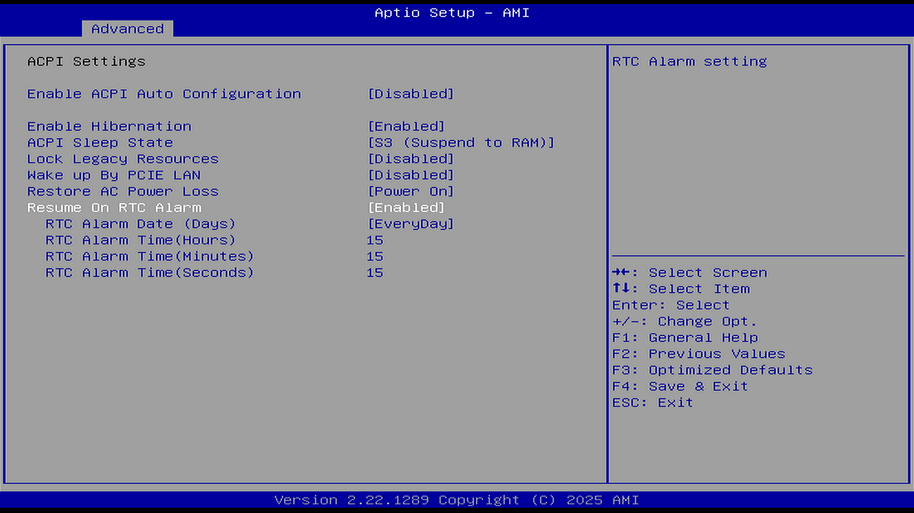

### Enable ACPI Auto Configuration（启用 ACPI 自动配置）

选项：

Disable（禁用）

Enable（启用）

说明：

是否允许系统自动配置 ACPI，此选项决定了此页面全部选项。

#### Enable Hibernation（启用休眠）

选项：

Disable（禁用）

Enable（启用）

是否允许系统进入休眠（操作系统 S4 睡眠状态）的功能。此选项还依赖操作系统的实现。

#### ACPI Sleep State（ACPI 睡眠状态）

选项：

Suspend Disabled 关闭挂起

S3 (Suspend to RAM) S3 挂起到内存

说明：

选择按下挂起（SUSPEND）按钮（睡眠键）时系统将进入的最高 ACPI 睡眠状态。

#### Lock Legacy resources（锁定传统资源）

选项：

Disable（禁用）

Enable（启用）

说明：

防止操作系统更改串行、并行或磁盘控制器的资源。现代计算机可禁用此选项。

#### Wake up By PCIE LAN（PCIE LAN 唤醒）

选项：

Disable（禁用）

Enable（启用）

说明：

Wake on LAN（WOL），网络唤醒功能

#### Restore AC Power Loss（交流电断电恢复）

选项：

Power Off：若系统电源中断后再次连接电源，计算机保持关机状态，不会自动开机

Power On：若系统电源中断后再次连接电源，计算机会自动开机，不需要按压机箱上的开机键

Last State：若系统电源中断后再次连接电源，计算机会恢复到关机前的状态

说明：

用于控制当电源恢复时系统的启动行为的选项。若启用此功能，当电源中断后再次连接时，主板会自动恢复系统的运作，并自动重新启动。这对于在意外的停电或电源中断后迅速恢复系统运行很有用。

如果电源中断前系统处于开机、睡眠或休眠状态之一，那么电源中断后再次连接电源后，系统恢复至对应状态

如果电源中断前，系统是关机状态，那么电源中断后再次连接电源后，系统状态还是关机状态

选项设定的情境要求主板完全断电（建议等待 30 秒），在主板完全断电后再重新连接电源，以确保该功能生效。也就是说断电后立即上电也许不会生效

参考文献：[[主板] BIOS 选项-Restore AC Power Loss 功能介绍](https://www.asus.com.cn/support/faq/1049855/)

#### Resume On RTC Alarm（RTC 定时唤醒）

选项：

Disable（禁用）

Enable（启用）

说明：

RTC 是 BIOS 的实时时钟，用于存储时间数据。定时开机。

- RTC Alarm Date (Days)，选项：Everyday（每天），1-31 天。
- RTC Alarm Time (Hours) 小时
- RTC Alarm Time (Minutes) 分
- RTC Alarm Time (seconds) 秒

如设置 Everyday、13、14、15，那么设备则会在每日 13 时 14 分 15 秒开机。

## Serial Port Console Redirection（串口控制台重定向）

用于配置串口重定向相关选项。

### Console redirections（COMx 的控制台重定向）

选项：

Disable（禁用）

Enable（启用）

说明：

串口 x 控制台的重定向开关设置，将控制台信息重定向到指定的串口中。此选项决定了：

### Console Redirection Settings（COMx 的串口控制台重定向参数设置）

该设置指定主机和远程计算机（用户正在使用的计算机）之间如何交换数据。两台计算机应使用相同或兼容的设置。

#### Console redirections EMS（COMx 的 Windows 紧急管理控制台重定向）

选项：

Disable（禁用）

Enable（启用）

说明：

EMS 控制台重定向开关。

紧急管理控制台是一种在 Windows 操作系统中将控制台输出重定向到串口的技术。

#### Console Redirection Settings（COMx 的控制台重定向设置）

##### Terminal Type（终端类型）

选项：

VT100：ASCII 字符集

VT100+：扩展的 VT100，用于支持颜色显示、功能键等。

VT-UTF8：使用 UTF-8 编码映射 Unicode 字符到 1 个或多个字节。

ANSI：扩展 ASCII 字符集。

说明：

通过此选项可选择仿真类型，BIOS 仿真类型必须与终端程序中选择的模式相匹配。

##### Bits per second（每秒传输比特数/波特率）

选项：

9600

19200

38400

57600

115200

说明：

每秒传输比特数配置，传输速率必须和对端口串口匹配，超长或嘈杂的线路可能需要较低的速度。

##### Data bits（数据位）

选项：

7

8

说明：

串口数据位宽设置，每字节中实际数据所占的比特数配置。

##### Parity（奇偶校验）

选项：

None：无

Even（偶校验）：如果数据位中 1 的个数是偶数，则奇偶位为 0。

Odd（奇校验）：如果数据位中 1 的个数是奇数，则奇偶位为 0。

Mark（奇偶校验）：奇偶位始终为 1。

Space（存储器奇偶校验）：奇偶位始终为 0。

##### Stop Bits（停止位）

选项：

1

2

说明：

停止位用于指示串行数据包的结束。（起始位则表示数据包的开始）标准设置为 1 个停止位。与较慢的设备通信时，可能需要超过 1 个停止位。

##### Flow Control（流控制）

选项：

None（无）

Hardware RTS/CTS：通过硬件请求发送协议/清除发送协议进行流量控制。开启该功能后，如果使用了不支持硬件流控的串口设备（如 USB 转串口线缆）或者未连接串口线缆，可能会导致无法加载板载和外接 PCIe 设备 OptionROM、屏幕黑屏光标闪烁等问题。

说明：

流控制设置，流控可以防止由于缓冲区溢出而导致的数据丢失。

在发送数据时，如果接收端的缓冲区已满，可以发送一个“停止”信号来暂停数据传输。一旦缓冲区有空位，再发送一个“开始”信号以重新启动数据传输。

硬件流控使用 RTS#（请求发送）和 CTS#（清除发送）线路来发送这些开始/停止信号。

##### VT-UTF8 Combo Key Support（VT-UTF8 组合键支持）

选项：

Disable（禁用）

Enable（启用）

说明：

启用对 ANSI/VT100（一种早期终端协议标准）终端的 VT‑UTF8 组合键（比如 Ctrl + Alt + 某键）支持。

##### Recorder Mode（记录器模式）

选项：

Disable（禁用）

Enable（启用）

说明：

当启用此模式时，仅发送文本数据。该功能用于捕获终端数据。

##### Resolution 100x31（扩展终端分辨率到 100×31）

选项：

Disable（禁用）

Enable（启用）

说明：

将终端分辨率扩展到 100 列 × 31 行。

##### Putty Keypad（PuTTY 的功能键和键盘）

选项：

VT100：模拟 DEC VT100 终端，通常用于早期 UNIX 系统。

Intel Linux：模拟 Linux 虚拟终端（如命令行控制台）

XTERMR6：模拟 Xterm R6 终端

SCO：模拟 SCO UNIX 环境

ESCN：使用小键盘时总是发送前缀 `ESC`

VT400：模拟 DEC VT400 终端

说明：

PuTTY 的功能键和键盘设置。

PuTTY 是 Windows 上常用的终端模拟器。

#### Console Redirection Settings (EMS)（Windows 紧急管理控制台重定向设置）

##### Out-of-Band Mgmt Port ()

选项：

COM0

COM1

说明：

该功能用于选择客户端服务器中的串口，以供 Microsoft Windows 紧急管理服务（EMS）用于与远程主机服务器通信。

##### Terminal Type EMS（Windows 紧急管理控制台终端类型）

同上，见 Terminal Type（终端类型）。

##### Bits per second（每秒传输比特数/波特率）

同上，见 Bits per second（每秒传输比特数/波特率）。

##### Flow Control（控制流）

选项：

None

Hardware RTS/CTS

Software Xon/Xoff（软 XON/XOFF）

说明：同上，见 Flow Control（控制流）。

## Acoustic Management Configuration（声学管理配置）

用于控制机械硬盘（HDD）噪声的设置。

需要有机械硬盘才能进行相关设置，否则会提示 HDD not found（找不到机械硬盘）

### Automatic Acoustic Management（自动声学管理）

选项：

Disable（禁用）

Enable（启用）

说明：

大多数现代硬盘驱动器都能够降低磁头移动速度以减少其噪音输出。可设定的值取决于磁盘，某些磁盘可能不支持此功能。

## AMI Graphic Output Protocol Policy（AMI 显卡输出协议行为）

AMI 是该 BIOS 的开发商安迈。Graphic Output Protocol 即 GOP。

黑苹果可能会用到此设置。用于控制 BIOS 的输出画面。

### Output Select（输出选择）

BIOS 输出显卡。

会列出所有接入的显卡。

### Brightness Settings（亮度设置）

选项：

20/40/60/80/100/120/140/160/180/200/220/240/255

说明：

BIOS 输出亮度。

### BIST Enable（启用）

选项：

Disable（禁用）

Enable（启用）

说明：

启动或停止集显上的 BIST（内建自检）。

## USB Configuration（USB 配置）

### Legacy USB Support（传统引导下的 USB 支持）

选项：

Disable（禁用）

Enable（启用）

Auto（自动）

说明：

用于控制非 UEFI 环境下对 USB 设备（如鼠标和键盘）的支持行为。

AUTO 选项：如果没有连接 USB 设备，将禁用传统（Legacy）支持。

禁用选项：USB 设备仅在 EFI 应用中可用，BIOS 阶段不可使用。

### XHCI hand-off（xHCI 控制权切换）

选项：

Disable（禁用）

Enable（启用）

说明：

EHCI 用于支持 USB 2.0，xHCI 用于支持 USB 3.0。

xHCI Hand-off：USB 控制器接口控制权交接。

此选项提供你选择是否针对不支持 xHCI Hand-off 功能的操作系统，强制开启此功能。这是针对不支持 xHCI 接管（xHCI hand-off）的操作系统的一种变通方案。XHCI 的所有权应由 XHCI 驱动程序接管。

XHCI Hand-off 选项的作用是在操作系统不支持 xHCI 的情况下，是否让 BIOS 控制 USB 3.0 控制器。

禁用 XHCI Hand-off：启动时由 BIOS 接管 USB 控制器，可能会将 USB 3.0 降为 USB 2.0，适用于原生不支持 USB 3.0 的旧系统（如 XP）。因此当系统不支持 xHCI 时，USB 3.0 装置在启动阶段或进入系统前可能无法正常使用。

启用 XHCI Hand-off：启动后由操作系统接管 USB 3.0 控制器，适用于原生支持 xHCI 的系统；如果系统对 xHCI 的支持损坏，可能导致 USB 设备无法使用。

### USB Mass Storage Driver Support（USB 大容量存储驱动支持）

选项：

Disable（禁用）

Enable（启用）

说明：

用于控制 BIOS/UEFI 对 USB 大容量存储设备（如 U 盘、移动硬盘）的支持。

关闭后无法从 USB 启动系统，即无法使用 USB 设备安装系统。

### USB hardware delays and time-outs:（USB 硬件延迟和超时）

设置 USB 传输控制信息、中断信息的超时时间。

#### USB Transfer time-out（USB 传输超时）

选项（单位 sec 是秒）：

1 sec

5 sec

10 sec

20 sec

说明：

设置控制传输、批量传输和中断传输的超时时间。

#### Device reset time-out（设备恢复超时）

选项（单位 sec 是秒）：

10 sec

20 sec

30 sec

40 sec

说明：

USB 大容量存储设备启动命令超时时间。遇到老旧或启动较慢的 USB 存储设备时，可适当增加超时时间。

如果设备在该时间内未响应启动命令，系统会判定设备启动失败，可能导致设备无法正常识别或使用。

#### Device power-up delay（设备上电延迟）

选项：

Auto（自动）

Manual（手动）

说明：

设置设备在正确向主机控制器报告自身之前所允许的最长时间。

“Auto”模式使用默认值（对于根端口为 100 毫秒，对于集线器端口则采用集线器描述符中的延迟值）。

即：

- 在系统启动或设备初始化时，设置等待设备完成上电准备的时间。

- 确保设备有足够时间完成内部启动过程，避免因为过早访问导致识别失败或异常。

#### Device power-up delay in seconds（设备上电延迟的秒数）

选项：

1-40（单位秒）

说明：

此选项依赖 Device power-up delay（设备上电延迟）。

## Network Stack configuration（网络堆栈设置）

### Network Stack（网络堆栈）

选项：

Disable（禁用）

Enable（启用）

说明：

网络启动相关设置。

指定是否启用（Enabled）UEFI 网络栈以允许通过 UEFI 进行网络访问。当设置为 Disabled 时，将无法通过 PXE 使用 UEFI 进行系统安装。

此选项决定了以下选项：

#### Ipv4 PXE Support（Ipv4 PXE 启动支持）

选项：

Disable（禁用）

Enable（启用）

说明：

PXE（预启动执行环境）是一项由 Intel 开发的网络启动协议，它能让计算机通过网络从远程服务器获取操作系统并进行引导安装。这个是 PXE 协议，是传统的网络启动方法。

#### Ipv4 HTTP Support（Ipv4 HTTP 启动支持）

选项：

Disable（禁用）

Enable（启用）

说明：

如果禁用，将不会创建 IPv4 HTTP 启动选项。这个是 HTTP 协议，是新的网络启动方法。

#### Ipv6 PXE Support（Ipv6 PXE 启动支持）

同上。

#### Ipv6 HTTP Support（Ipv6 HTTP 启动支持）

同上。

#### PXE boot wait time（PXE 启动等待时间）

值：0-5 秒。

等待按 ESC 键取消 PXE 启动的时间设置。

也就是说如果设置为 5，则必须在 5 秒内按 ESC 键终止 PXE 启动流程，超过 5 秒就启动 PXE 了。

#### Media detect count（介质检测数）

值：1-50

检测介质存在次数。

在启动过程中，系统会多次检查启动设备（如硬盘、光驱或网络介质）是否已连接或准备就绪。

## CSM Configuration（CSM 配置）

CSM：Compatibility Support Module，兼容性支持模块。

Intel 500 系列及更新芯片组（第 11 代及后续处理器）不支持使用 VBIOS 的显示适配器，导致内置核显不支持 legacy boot，因此其 CSM 选项是灰色的。必须使用有支持 VBIOS 的外置独显才能进行配置。参见 [Intel 500 系列开始，在 BIOS 中的 CSM 选项无法选用问题？](https://www.asus.com.cn/support/faq/1045467/) [备份](https://web.archive.org/web/20260120210045/https://www.asus.com.cn/support/faq/1045467/)。

### CSM Support（CSM 支持）

选项：

Disable（禁用）

Enable（启用）

说明：

兼容模式支持开关设置，UEFI 兼容性支持模块，对不支持 UEFI 的操作系统提供兼容性支持。

该选项决定了以下选项：

#### GateA20 Active（A20 地址线激活）

选项：

Upon Request：基于需要

Always：始终

说明：

A20 地址线的控制模式设置。

A20 是一根地址线，这根地址线控制系统对于 1MB 以上的那部分内存空间如何进行访问。控制是否允许 CPU 访问 1MB 以上的内存区域。

#### INT19 Trap Response（INT19 中断捕获响应）

选项：

Immediate：立即响应

Postponed：推迟响应

说明：

中断、捕捉信号响应设置。BIOS 通过可选 ROM 对 INT19 trapping 作出的响应。

当选项 ROM 捕获 INT 19h 中断时，BIOS 会立即执行该中断请求。这意味着设备的启动代码会在 BIOS 处理其他启动选项之前被执行。

当选项 ROM 捕获 INT 19h 中断时，BIOS 会将该请求延迟到传统启动阶段（Legacy Boot）期间再执行。这通常用于 RAID 控制器、网络适配器等设备，以便在操作系统加载之前初始化硬件。

如果在启动过程中遇到设备初始化问题，尝试将此选项设置为 Postponed，以延迟设备初始化。

#### HDD Connection Order（机械硬盘连接顺序）

选项：

Adjust（调整）

Keep（保持）

说明：

此选项依赖 Boot option filter（启动选项过滤）

“80h”是传统 BIOS 中代表第一块硬盘（通常是主启动盘）的编号。

某些操作系统需要调整硬盘驱动器的句柄，例如操作系统安装在 80h 号驱动器上。

#### Boot option filter（启动选项限制）

选项：

UEFI Only：UEFI 模式

Legacy Only：传统模式

UEFI and Legacy：UEFI 和传统模式并存

说明：

启动模式设置，用于控制设备采用 Legacy 或 UEFI 模式进行启动。

#### Option ROM execution（可选 ROM 执行）

选项：

Manual：手动

Auto：自动

说明：

Option ROM 执行策略。该选项用于控制系统中 Legacy Option ROM 与 UEFI Option ROM 的优先级。

Option ROM 是一种嵌入在主板或扩展设备（如显卡、网卡、RAID 控制器）上的固件程序。

当该选项设置为 Auto 时，UEFI Option ROM 会在 UEFI 模式下运行，Legacy Option ROM 会在 Legacy 模式下运行。

当该选项设置为 Manual 时，用户可以根据需要选择运行 UEFI Option ROM 或 Legacy Option ROM；若设置不当，可能导致某些 Option ROM 无法运行。

建议该选项设置为 Auto 模式。

决定了以下选项：

##### Network（网络）

选项：

Do not launch：不执行

Legacy：Legacy 模式，加载网卡的 Legacy Option ROM

UEFI：UEFI 模式，加载网卡的 UEFI Option ROM

说明：

网卡 Option ROM 执行方式设置。

##### Storage（存储）

存储设备 Option ROM 执行方式设置，选项参数同上。

##### Video（显卡）

显卡设备 Option ROM 执行方式设置，选项参数同上。

##### Other PCI devices（其他 PCI 设备）

其他 PCI 设备的 Option ROM 执行方式设置，选项参数同上。

## NVMe configuration（NVMe 配置）

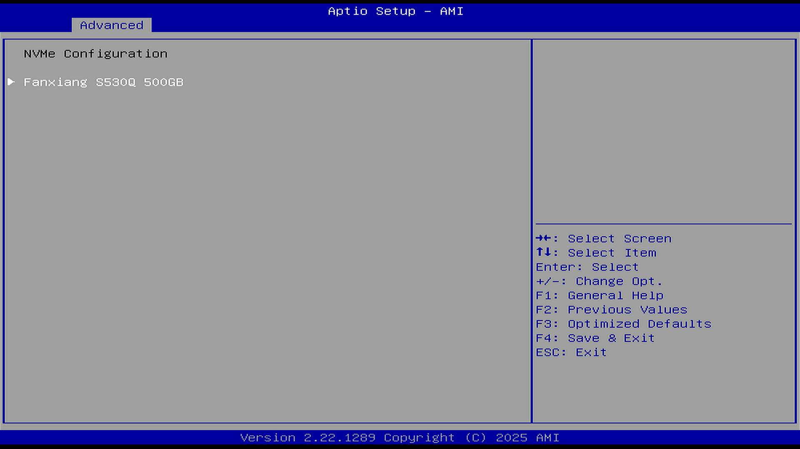

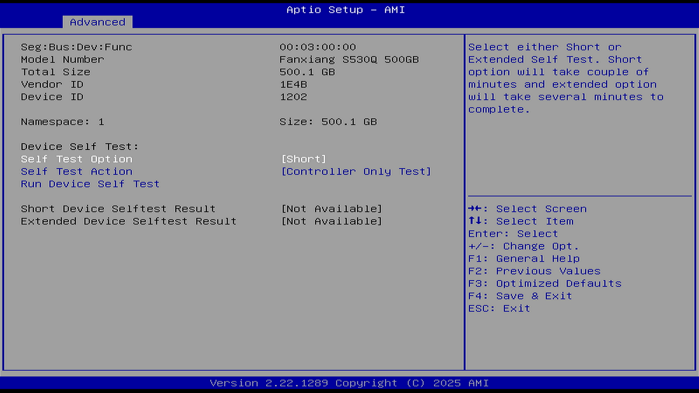

### Self Test Option（自我测试选项）

选项：

Short（简单）

Extended（扩展）

说明：

此选项和 Run Device Self Test（运行设备自我测试）有关。

请选择执行快速自检（Short Self Test）或扩展自检（Extended Self Test）。

快速自检大约需要几分钟完成，而扩展自检则需要更长时间。

### Self Test Action（自我测试行为）

选项：

Controller Only Test（仅控制器测试）

Controller and NameSpace test（控制器和命名空间测试）

说明：

此选项和 Run Device Self Test（运行设备自我测试）有关。

控制器和命名空间测试要更长时间才能完成。

### Run Device Self Test（运行设备自我测试）

此选项依赖 Self Test Option（自我测试选项）和 Self Test Action（自我测试行为）。

执行用户选择的“选项”和“操作”对应的设备自检程序。按下 Esc 键可中止测试。下面显示的结果为设备中最近一次自检的记录。

#### Short Device Selftest Result 简单自我测试

Not Available：不可用，即未测试过。

#### Extended Device Selftest Result 扩展自我测试

Not Available：不可用，即未测试过。

## SDIO Configuration（SDIO 配置）

SDIO 参数配置说明。

SDIO（Secure Digital Input and Output），即安全数字输入输出接口。SDIO 协议是由 SD 卡协议演进而来，向下兼容 SD 卡协议。一般嵌入式设备会使用。

### SDIO Access Mode（SDIO 访问模式）

选项：

Auto（自动）

ADMA（高级 DMA 模式）

SDMA

PIO

说明：

Auto（自动）：如果控制器支持 DMA，就以 DMA 模式访问 SD 设备；否则使用 PIO 模式

SDMA：是 SD/eMMC 控制器中的一种基础的 DMA 模式

ADMA：采用 ADMA（Advanced DMA）或 ADMA2 协议，支持描述符表、散列表调度等特性，适合大块数据或复杂控制，性能更优

PIO：通过 CPU 按指令逐字节处理 USB/SD 设备数据，CPU 参与度高，速度较慢，但兼容性强。

### Bus 0 Dev 1A Func 0

列出当前的 eMMC 设备。

#### eMMC Y20128 (125.0GB)

选项：

Auto（自动）

Floppy（软盘）

Forced FDD（强制将该设备模拟为软盘）

Hard Disk（硬盘）

说明：

大容量存储设备模拟类型。

用于将 eMMC 存储模拟为不同的设备。

Auto（自动）：小于  530 MB 的设备将被识别为软盘（Floppy）。

Forced FDD：可以将硬盘驱动器强制以软盘方式启动。

## Main Thermal Configuration（主要热管理配置）

### Critical Temperature (°C)（临界温度）

选项：

90 / 95 / 100 / 105 / 110 / 115 / 117 / 119（单位是摄氏度）

Disabled（禁用）

说明：

启用后，当温度超过该阈（yù）值时，支持 ACPI 的操作系统将执行关键关机操作。允许的范围为 90℃ 至 119℃（含）。

### Passive Cooling Temperature (°C)（被动冷却温度）

选项：

80 / 85 / 90 / 95 / 100 / 105 / 107 / 109（单位是摄氏度）

Disabled（禁用）

说明：

启用后，超过此阈值后，支持 ACPI 的操作系统开始降低 CPU 速度。允许的范围为 80℃ 至 109℃（含）。

### TC1（热常数 1：ACPI 被动冷却公式的一部分）

ACPI 被动冷却公式参见 [11.1.5.1. Processor Clock Throttling](https://uefi.org/htmlspecs/ACPI_Spec_6_4_html/11_Thermal_Management/thermal-control.html) [备份](https://web.archive.org/web/20260120162733/https://uefi.org/htmlspecs/ACPI_Spec_6_4_html/11_Thermal_Management/thermal-control.html) 。

默认为 1

### TC2（热常数 2：ACPI 被动冷却公式的一部分）

默认为 1

### TSP (tenths of second)（十分之一秒）

被动冷却时的温度采样周期。单位是 100 毫秒，即 0.1 秒。

默认为 5

## LVDS Configuration（LVDS 配置）

LVDS，Low-Voltage Differential Signal（低压差分信号）。

一般笔记本屏幕使用 LVDS 接口和主板相连。所以这部分主要用于设置内置的显示器面板。

### LVDS interface（LVDS 接口）

选项：

Enabled 启用

Disabled 禁用

此选项决定了以下选项：

#### Edid Mode（EDID 模式）

选项：

External（扩展）

Default（默认）

Custom（自定义）

说明：

EDID（Extended Display Identification Data，扩展显示标识数据）包含显示器的分辨率、厂商名称和序列号等信息。

选择用于内部平板显示屏的 EDID。根据所选设置，以下部分选项或全部选项可能会出现或隐藏。

#### EDID（扩展显示标识数据）

选项：

640x480 / 800x480 / 800x600 / 1024x600 / 1024x768 / 1280x720 / 1280x800 /1280x1024 / 1366x768 / 1400x900 / 1600x900 / 1680x1050 / 1920x1080

说明：

仅当 Edid Mode（EDID 模式）选择 Default 才会出现本项。

设置内置显示器的 EDID 分辨率。

#### Color Mode（色彩模式）

选项：

VESA 24bpp（美国标准，VESA 标准的 24 位色深格式）

JEIDA 24bpp（日本标准，JEIDA 标准的 24 位色深格式）

18 bpp（18 位色深格式）

说明：

选择 LVDS 接口的色深。对于 24 位色深，还可以选择 LVDS 通道的色彩映射方式，即选择是否兼容 VESA 标准或 JEIDA 标准。

#### Interface（接口）

选项：

Single Channel（单通道）

Dual Channel（双通道）

说明：

配置 LVDS 接口为单通道或双通道模式。

#### DE Polarity（数据使能极性）

选项：

Active High（高电平有效）

Active Low（低电平有效）

说明：

用于判断“使能状态”对应的是信号的高电平还是低电平。

#### V-Sync Polarity（垂直同步极性）

选项：

Negative（负极性）

Positive（正极性）

说明：

定义显示器垂直同步信号的电平触发方式。

#### H-Sync Polarity（水平同步极性）

选项：

Negative（负极性）

Positive（正极性）

说明：

定义显示器水平同步信号的电平触发方式。

#### LVDS Advanced Options（LVDS 高级选项）

##### Spreading Depth（扩频深度）

选项：

No Spreading（无扩频）

0.5%

1.0%

1.5%

2.0%

2.5%

说明：

设置 LVDS 时钟频率用于扩频的带宽百分比。用于减小电磁干扰。

##### Output Swing（输出摆幅）

选项：

150 mV / 200 mV / 250mV / 300 mV / 350 mV /400 mV / 450 mV

说明：

设置 LVDS（低压差分信号）接口的差分输出摆幅。

输出摆幅分为正向和负向摆幅，也就是 VP+、VP-。输出摆幅指的是信号从最低电压到最高电压之间的电压差，也就是输出信号的电压幅度范围。

用于改善传输质量与信号完整性，调节得当可提升图像或数据传输稳定性。

##### T3 Timing（T3 延时）

参考文献 [LVDS 接口液晶屏点屏流程详解](https://www.cnblogs.com/yuanqiangfei/p/11654412.html) [备份](https://web.archive.org/web/20260120210407/https://www.cnblogs.com/yuanqiangfei/p/11654412.html)，下同

选项范围：

0-255（以 50 毫秒为单位表示）

说明：

面板电源序列中最小 T3 时序限制。默认值为 10（即 500 毫秒）。

用于控制 LVDS 信号输出到背光开启之间的时间延迟。

##### T4 Timing（T4 延时）

选项范围：

0-255（以 50 毫秒为单位表示）

说明：

T4 表示从停止发送 LVDS 数据到关闭背光之间的最小延迟时间。

面板电源序列中最小 T4 时序限制。默认值为 2（即 100 毫秒）。

##### T12 Timing（T12 延时）

选项范围：

0-255（以 50 毫秒为单位表示）

说明：

从关闭面板电源（VDD）之后，到下一次重新开启电源（VDD）之前，必须等待的最小时间间隔。

面板电源序列中最小 T12 时序限制。默认值为 20（即 1 秒）。

##### T2 Delay（T2 延迟）

选项：

Enabled（启用）

Disabled（禁用）

说明：

LVDS T2 延迟（LVDS T2 Delay）是指从 T-CON（Timing Controller）芯片上电到 LVDS 数据输出之间的最小延迟时间。此设置用于确保 T-CON 芯片完成初始化并稳定输出数据，以避免显示异常，如花屏或闪烁。

启用后，T2 延迟增加 20 毫秒，误差范围为正负 50%。

##### T5 Delay（T5 延迟）

选项：

Enabled（启用）

Disabled（禁用）

说明：

从关闭背光电源到停止输出 LVDS 数据之间的延迟时间。

启用后，T5 延迟增加 20 毫秒，误差范围为正负 50%。

##### P/N Pairs Swapping（P/N 对交换）

选项：

Enabled（启用）

Disabled（禁用）

说明：

启用或禁用 LVDS 差分对的交换（正极 ↔ 负极）。

控制交换 LVDS 信号对的 P 和 N 引脚与否。

用于调整 LVDS 信号极性匹配。

##### Pairs Order Swapping（差分对顺序交换）

选项：

Enabled（启用）

Disabled（禁用）

说明：

控制指定的信号线对顺序。LVDS 通道差分对的顺序交换（例如 A 与 D 互换，B 与 CLK 互换，C 与 C 互换）。

##### Bus Swapping（总线交换）

选项：

Enabled（启用）

Disabled（禁用）

说明：

将 LVDS 信号线路中的奇数通道和偶数通道进行互换。总线交换（奇数总线与偶数总线互换）。

##### Firmware PLL（固件级锁相环）

选项：

0: +/- 1.56%

1: +/- 3.12%

2: +/- 6.25%

3: +/- 12.5%

4: +/- 25%

5: +/- 50%

6: +/- 100%

说明：

配置 LVDS 接口的时钟源和频率范围。

LVDS（低压差分信号）接口的时钟信号通常由锁相环（PLL，Phase-Locked Loop）生成。

Firmware PLL 指通过固件（BIOS）对 PLL 参数进行调节，以优化时钟频率和信号稳定性。

## Embedded Controller（嵌入式控制器）

### Embedded Controller information（嵌入式控制器信息）

显示嵌入式控制器相关信息。

### Power Fail Resume Type（断电恢复类型）

选项：

Always ON

Always OFF

Last State

说明：

指定在电源故障（G3 状态，完全断电）后重新加电时系统应进入的状态。

如果是无电池运行模式（Batteryless Operation），芯片组在电源故障后总是自动开机（即 Always ON）：因此，若选择“Always OFF”恢复类型，或选择“Last State”且上一次状态为关机，系统将自动开机后立即关闭。

### No CMOS Battery Handling（无 CMOS 电池处理逻辑）

选项：

Enabled（启用）

Disabled（禁用）

说明：

在没有 CMOS 电池的系统中（例如服务器或嵌入式设备），芯片组通常会在断电后自动上电：  

因此，如果将恢复类型设置为“Always OFF”，或者设置为“Last State”且上一次状态为关机，那么系统将自动开机后立即关闭。

### LID_BTN# Configuration（LID_BTN# 信号配置）

选项：

Force Open（强制开启）

Force Closed（强制关闭）

Normal Polarity（正常极性）

Inverted Polarity（反转极性）

说明：

LID_BTN# 是笔记本等设备上的“盖子开关”信号（LID Button），通常用于感知盖子是否关闭。

配置 LID_BTN# 信号为始终开启或关闭（无论引脚电平如何），或者配置引脚的极性：高电平 \= 打开（正常），低电平 \= 打开（反转）。

### LID_BTN# Wake Configuration（LID_BTN# 唤醒配置）

选项：

No Wake（不唤醒）

Only From S3（仅从 S3 唤醒）

Wake From S3/S4/S5（从 S3/S4/S5 唤醒）

说明：

控制屏盖打开时是否自动唤醒系统。

配置 LID_BTN# 信号的唤醒功能（当前未强制设置为“开启”或“关闭”时）。根据引脚配置，当屏幕盖处于开启状态时，它可以使系统从睡眠状态唤醒。

### OUT 80 serial redirection port（BIOS OUT 80 串口重定向端口）

选项：

None（无）

1

2

1+2

说明：

在 BIOS 中，`OUT 80h` 通常指的是将数据写入 I/O 端口 0x80，这是一个用于调试的标准端口。通过向该端口写入特定的值，系统可以在启动过程中输出调试信息，帮助开发人员定位问题。

用于调试。选择将 OUT 80（POST 代码）重定向到指定的 EC UART（串口）。

### Hardware Monitor（硬件监控）

显示监控的硬件参数和设置。

### Reset Causes Handling（重置原因处理）

用于指定系统在重启时如何响应不同的重置原因。该功能主要用于嵌入式系统或服务器中，以便在系统重启时进行适当的诊断或日志记录。

#### Reset Button Pressed（重置按钮被按下）

选项：

Happened（发生）：按下了重置按钮

Not Happened（未发生）：重置按钮没被按下

说明：

系统是否检测到机箱上的硬件重置按钮被按下。

#### Clear from log（日志清除）

选项：

Enabled（启用）

Disabled（禁用）

说明：

清除 BIOS 中的系统事件日志。

重启后生效。

#### WDT Timeout Expired（看门狗定时器超时触发）

选项：

Happened（发生）：看门狗定时器超时了

Not Happened（未发生）：看门狗定时器未超时

#### Power Failure（电源故障）

选项：

Happened（发生）：电源故障了

Not Happened（未发生）：电源未故障

#### EC Soft Reset（嵌入式控制器软重置）

说明：

Happened（发生）：嵌入式控制器软重置过

Not Happened（未发生）：嵌入式控制器软未重置过

### Super IO Configuration（超级 I/O 配置）

参考文献：[BIOS 实战之 Super IO-Smart Fan](https://blog.csdn.net/u011397314/article/details/111147528) [备份](https://web.archive.org/web/20260120210433/https://blog.csdn.net/u011397314/article/details/111147528)

用于管理主板上的传统 I/O 接口，如串口（COM）、并口（LPT）、PS/2 键盘/鼠标、红外接口（IR）以及环境控制器（EC）等。这些接口通常由 Super I/O 芯片控制，负责处理低速 I/O 设备的通信。

#### Serial Port x（串口 x）

##### Address（地址）

选项：

0x3F8 / 0x3E8 / 0x2F8 / 0x2F0 / 0x2E8 / 0x2E0 / 0x2A8 / 0x2A0 / 0x288 / 0x280

说明：

串口 I/O 基线地址，用于指定串口通信的 I/O 地址。

##### IRQ（来自设备的中断请求）

选项：

3 / 4 / 5 / 6 / 7 / 10 / 11 / 14 / 15

说明：

串口 I/O IRQ（Interrupt Request，来自设备的中断请求），定义串口通信中断请求的硬件资源。

参见 [什么是 IRQ？](https://www.kernel.org/doc/html/v6.9/translations/zh_CN/core-api/irq/concepts.html) [备份](https://web.archive.org/web/20251207044743/https://www.kernel.org/doc/html/v6.9/translations/zh_CN/core-api/irq/concepts.html)

### External FAN/PWM Settings（外部风扇 ／PWM 设置）

当 SMARC（Smart Mobility ARChitecture，智能移动架构）相关配置中的 PWM／风扇管理启用时可见。

参考文献：[PWM 信号占空比，如何影响散热风扇速度？](https://post.smzdm.com/p/a5p056o3/) [备份](https://web.archive.org/web/20260120162439/https://post.smzdm.com/p/a5p056o3/)

#### FAN_PWMOUT device type(FAN_PWMOUT 设备类型)

选项：

3-WIRE FAN（3 线风扇）

4-WIRE FAN（4 线风扇）

Generic PWM（通用 PWM）

说明：

风扇 PWM（脉宽调制）输出接口类型，用于指定风扇类型。

#### Automatic Temperature FAN Control（风扇自动温度控制）

选项：

Enabled（启用）

Disabled（禁用）

说明：

热反馈风扇控制是一种基于温度传感器反馈来动态调节风扇转速的控制机制。

#### FAN PWM Frequency（风扇 PWM 频率）

选项范围：

1-60000

说明：

设置 FAN_PWMOUT 信号的频率。典型值为 100（用于三线风扇）/ 20000（用于四线风扇）。

#### FAN Duty Cycle (%)（风扇占空比）

选项范围：

1-100

说明：

脉冲信号（PWM）高电平的时间占整个周期的比例，来控制风扇的转速。

设置 FAN_PWMOUT 信号的占空比。当占空比增加时，风扇接收到的有效电流增加，转速也随之提升；反之，占空比减少时，风扇转速会降低。简言之，占空比越大，风扇转速越高。

### Watchdog Configuration（看门狗配置）

选项：

Enabled（启用）

Disabled（禁用）

说明：

看门狗定时器机制配置。

### GPIO Configurations（GPIO 配置）

GPIO，General Purpose Input/Output（通用输入/输出），通常用于嵌入式设备。

#### GPIOx (GPIO x)

##### Configuration（配置）

选项：

Input（输入模式）

Output Low（输出低电平）：输出固定的物理低电平（通常是 0 V）。

Output High（输出高电平）：输出固定的物理高电平（通常是 Vcc）。

Output Last（保持上次输出状态）：与上次启动时的状态保持一致，不做更改。

说明：

将引脚配置为输入或带固定初始值的输出。

### MAC address(es) visualization（MAC 地址显示）

显示系统的 MAC 地址。

### SMARC Related Configuration（SMARC 相关配置）

用于将 GPIO 分配给不同的功能。

#### HD Audio Reset（HDA 重置）

选项：

Enabled（启用）

Disabled（禁用）

说明：

当该引脚配置为音频模式时，音频控制器和 Codec 会正常工作；但如果将其配置为通用 GPIO 用途，则音频功能将无法启用

启用此选项后，GPIO4 将被用作高清音频复位信号。GPIO4 → HDA_RST#（高清音频复位引脚）。

#### PWM/FAN Management（PWM/风扇管理）

选项：

Enabled（启用）

Disabled（禁用）

说明：

启用此选项后，GPIO5 将被用作 PWM / 风扇输出信号。GPIO5 → PWM_OUT（脉宽调制输出）。

#### Tachometer（转速计）

选项：

Enabled（启用）

Disabled（禁用）

说明：

启用此选项后，GPIO6 将被用作转速计输入。GPIO6 → TACHIN。

### USB Port Enabling（USB 端口使能）

选项：

Enabled（启用）

Disabled（禁用）

说明：

禁用/启用载板上每个 USB 端口的 VBUS 电源（USB 供电线 +5V）

## RAM Disk Configuration（内存盘配置）

添加或移除内存盘。

### Disk Memory Type:（磁盘内存类型）

选项：

Boot Service Data（启动服务数据）

Reserved（保留）

说明：

指定从系统可用内存池中使用的内存类型，以创建磁盘。

### Create Raw（创建 Raw）

创建一个裸内存盘。

### Create from file（从文件中创建）

从指定文件创建内存盘。

### Remove selected RAM disk(s)（移除所选的内存盘）

移除所选的内存盘

## Tls Auth Configuration（Tls 认证配置）

用以支持 IPv4 或 IPv6 HTTP 启动。

通过“Tls 认证配置”界面，可以进行 TLS 认证的相关配置。

TLS，Transport Layer Security 传输层安全性协议是一种广泛采用的安全性协议，旨在促进互联网通信的私密性和数据安全性。

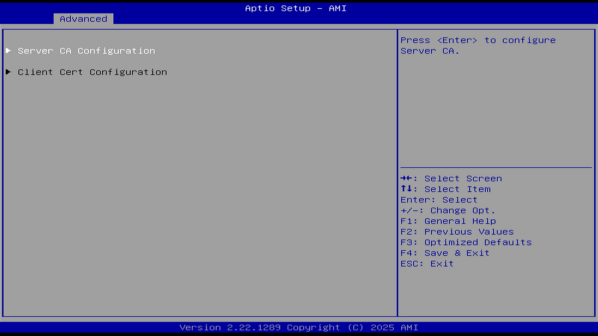

### Server CA Configuration（服务器端 CA 设置）

服务器端 CA 证书配置菜单。

CA(Certification Authority) 认证机构：CA 是可信任的第三方机构，它负责颁发数字证书并验证证书申请者的身份。CA 是数字证书体系中的最高权威，其颁发的数字证书被广泛接受和信任。数字证书中包含了 CA 的公钥和数字签名，用于验证证书的真实性和完整性。

CA 证书是网络环境中具体身份的合法性证明。

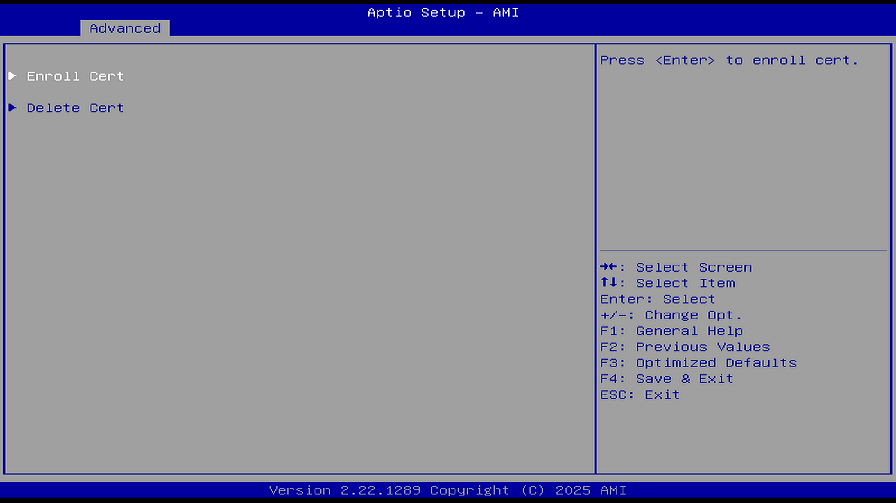

#### Enroll Cert（导入证书）

##### Enroll Cert Using File（通过文件系统导入证书）

##### Cert GUID（证书 GUID）

设置证书的 GUID（Globally Unique Identifier，全局唯一标识符）

GUID 是一种由算法生成的唯一标识。

##### Commit Changes and Exit（保存并退出）

##### Discard Changes and Exit（放弃保存并退出）

#### Delete Cert（删除证书）

当存在证书时，“删除证书”界面中会显示证书列表；不存在证书时，界面则不显示内容。通过该界面，可删除已加载的证书。

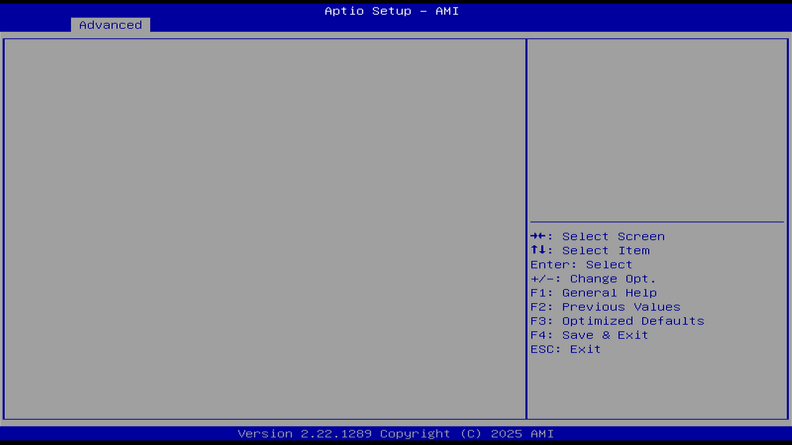

### Client CA Configuration（客户端 CA 设置）

当前无可配置项。

## Intel(R) Ethernet Controller I226-V - 10:02:B5:86:0E:F9（Intel 以太网控制器）

显示以太网卡相关信息。

| 英文        | 中文      | 值                                        |
| ----------- | --------- | ----------------------------------------- |
| UEFI Driver | UEFI 驱动 | Intel(R) 2.5G Ethernet Controller 0.10.04 |
| Device Name | 设备名称  | Intel(R) Ethernet Controller I226‑V       |
| Link Status | 链路状态  | [Disconnected]（未连接）                  |
| MAC Address | MAC 地址  | 10:02:B5:86:0E:F9                         |

## Driver Health（驱动健康）

显示驱动程序或控制器的健康状态。

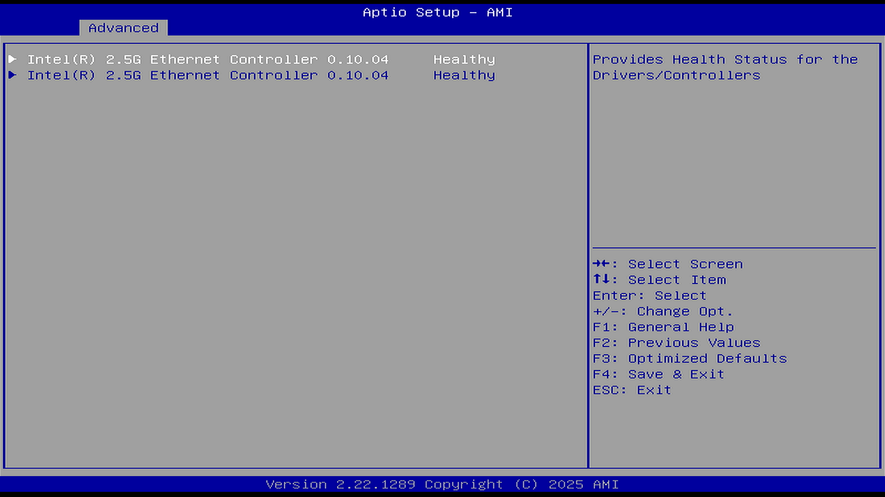

