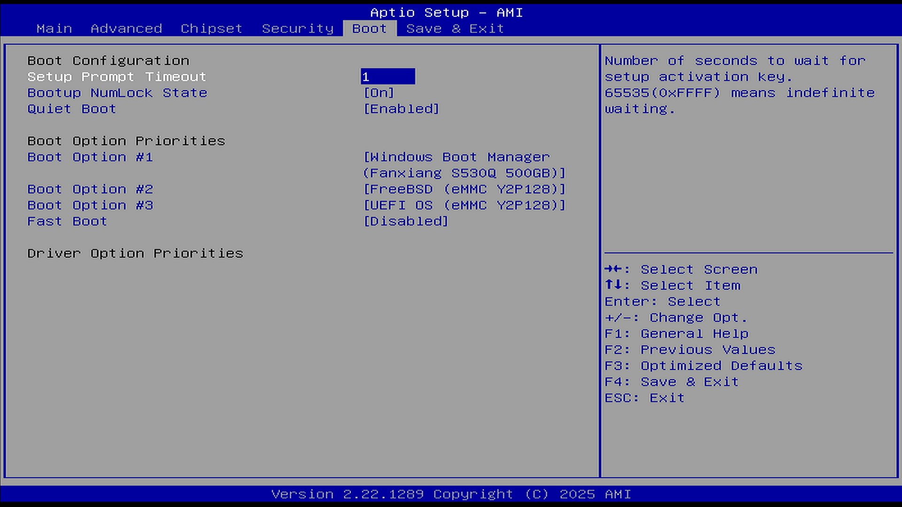

# Boot（启动）

## Setup Prompt Timeout（设置提示超时时间）

值：

0-65535（秒）

说明：

Setup 提示超时设置，设置等待 Setup 激活键的时间，最大值为 65535 秒，表示无限等待。

## Bootup NumLock State（启动时 NumLock 键状态）

选项：

On（开）

Off（关）

说明：

选择键盘 NumLock 状态（锁定/解锁小键盘）。设备启动后，将数字小键盘切换为开启（On，数字输入）或关闭（Off，导航功能）。导航功能：按数字键可上下左右移动界面。

## Quiet Boot（安静启动）

选项：

Enabled（启用）

Disabled（禁用）

说明：

安静模式启动开关设置

设置为 Enabled，开机 Logo 显示为制造商设置的 Logo，设置 Disabled，开机画面为文本模式 Post 界面。在自检期间，启用时（Enabled）显示启动徽标；禁用时（Disabled）则以文本模式显示启动信息。

## Fast Boot（快速启动）

选项：

Enabled（启用）

Disabled（禁用）

说明：

启用或禁用启动时仅初始化启动活动选项所需的最小设备集合。对 BBS 启动选项（非 UEFI 启动项）无效。如果使用外置显卡，则其 VBIOS 需要支持 UEFI GOP。

警告：开启此项后可能再也无法进入 BIOS，因为开启快速启动后，系统在启动阶段会忽略所有 USB 设备——比如键盘。一般来说要么重置 CMOS，要么使用 Windows 的高级启动进入 UEFI 固件设置：参见 [Windows 11/10 如何进入 BIOS 设置界面](https://www.asus.com.cn/support/faq/1008829/)。需要注意的是，此方法并非万能，因为部分主板无法通过此方法进入 BIOS。

## SATA Support（SATA 支持）

选项：

Last Boot SATA Devices Only（仅最后启动的 SATA 设备）

All SATA Devices（全部 SATA 设备）

说明：

如果选择“仅最后启动的 SATA 设备”，则在 POST 过程中仅会检测并显示上次启动所使用的 SATA 设备。

如果选择“全部 SATA 设备”，则所有 SATA 设备都会在操作系统和 POST 过程中可用。

## NVMe Support（NVMe 支持）

选项：

Enabled（启用）

Disabled（禁用）

说明：

若禁用，NVMe 设备将被跳过。m2 固态硬盘一般使用此协议。

## USB Support（USB 支持）

选项：

Disabled（禁用）

Full Initial（完全初始化）

Partial Initial（部分初始化）

说明：

如果禁用，所有 USB 设备（含鼠标键盘等）在操作系统启动前都不可用。（警告：对于部分机器，此项若关闭就是真的永远关闭了，具体参看 BIOS 右上角提示信息，而现在的机器一般都没有 PS/2 接口，会导致机器无法正常使用！）

如果部分初始化，USB 大容量存储设备（U 盘等）和特定的 USB 端口/设备在操作系统启动前不可用。

如果启用，所有 USB 设备在操作系统和启动自检（POST）过程中均可用。

## PS2 Devices Support（PS/2 设备支持）

选项：

Enabled（启用）

Disabled（禁用）

说明：

若禁用，PS/2 设备将被跳过。很老（大概 2009 年左右就被淘汰了）的鼠标键盘摇杆使用此协议。现在的机器一般都没有 PS/2 接口，此项一般无意义。

## Network Stack Driver Support（网络协议栈驱动支持）

选项：

Enabled（启用）

Disabled（禁用）

说明：

PXE 需要。若禁用，网络协议栈驱动将被跳过。

## Redirection Support（重定向支持）

选项：

Enabled（启用）

Disabled（禁用）

说明：

若禁用，重定向功能将被跳过。

## Boot Option #1（启动项 1）

选项：

Hard Disk0（硬盘 0）

Hard Disk1（硬盘 1）

eMMC（嵌入式 eMMC）

CD/DVD（光学介质/光盘）

SD（存储卡）

USB Device（USB 设备，如 U 盘）

Network（网络启动）

Other Device（其他设备）

Disabled（禁用）

说明：

设置系统启动顺序。

## Boot Option #2（启动项 2）

同上。

## Boot Option #3（启动项 3）

同上。

## Boot Option #4（启动项 4）

同上。

## Boot Option #5（启动项 5）

同上。

## Boot Option #6（启动项 6）

同上。

## Boot Option #7（启动项 7）

同上。

## Boot Option #8（启动项 8）

同上。

## Boot Option #9（启动项 9）

同上。

## UEFI EMMC Drive BBS Priorities（UEFI EMMC 驱动 BBS 优先级）

指定来自可用 UEFI eMMC 驱动的启动设备优先顺序。

## UEFI SD Drive BBS Priorities（UEFI SD 驱动 BBS 优先级）

指定来自可用 UEFI SD 驱动的启动设备优先顺序。
