# Chipset（芯片组）

芯片组设置信息

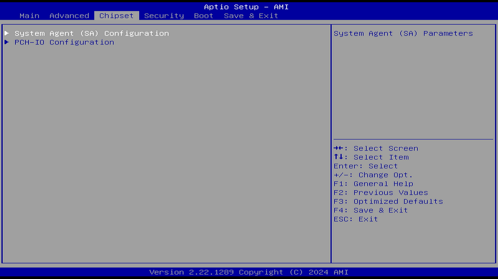

## System Agent (SA) Configuration（系统代理配置）

以下选项可能与 PCH-IO Configuration（平台控制器集线器 I/O 配置）中的部分南桥相关选项存在重叠。因为 System Agent（SA）Configuration（系统代理配置）用于控制由 CPU 直接引出的 PCIe 接口。

在 Intel CPU 架构中（第二代 Sandy Bridge 及以后），System Agent 是一个集成在 CPU 芯片内部的模块，它包含了：

- 内存控制器 (IMC - Integrated Memory Controller)
- PCIe Root Complex（用于 CPU 直连的 PCIe 通道，例如 PEG（PCI Express Graphics）。
- 显示引擎 (如果 CPU 有核显)
- 与 Ring Bus 或 Mesh 的接口
- 电源管理逻辑等

参见 [BIOS PCIe 配置里的 LTR Snoop Latency value of SA PCIE](https://www.cnblogs.com/wanglouxiaozi/p/18946234) [备份](https://web.archive.org/web/20260121061741/https://www.cnblogs.com/wanglouxiaozi/p/18946234)

### Memory Configuration（内存配置）

内存配置参数。

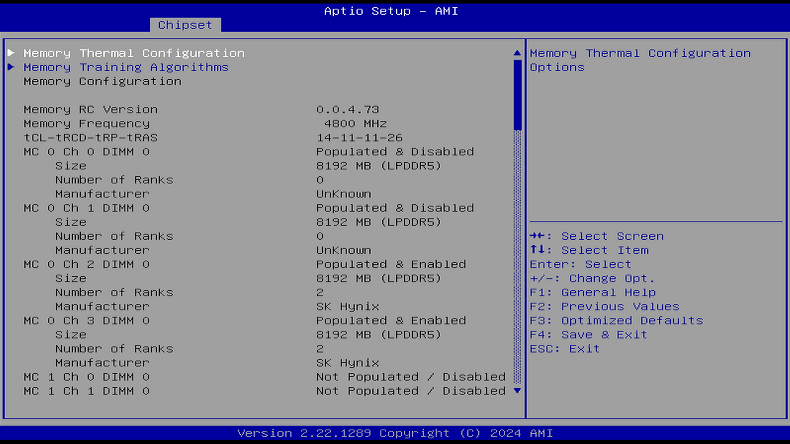

#### Memory Thermal Configuration（内存热效应配置）

##### Memory Power and Thermal Throttling（内存功耗与热容忍）

##### DDR PowerDown and idle counter（DDR 省电模式与空闲计数器）

选项：

BIOS

PCODE

说明：

DDR：Double Data Rate SDRAM，双倍数据速率同步动态随机存取内存，即 DDR 内存

此功能用于决定由 BIOS 还是硬件控制 DDR 的省电模式与空闲计数器。当选择“PCODE”时，由硬件算法控制这些模式；当选择“BIOS”时，则由 BIOS 控制这些模式。默认设置为“BIOS”。

##### For LPDDR Only: DDR PowerDown and idle（仅适用于 LPDDR：DDR 省电与空闲控制）

选项：

BIOS

PCODE

说明：

LPDDR：Low Power Double Data Rate SDRAM，低功耗内存，适用于笔记本平板等移动平台

仅适用于 LPDDR：

BIOS：由 BIOS 控制 DDR 的 CKE 模式和空闲计时器值。

PCODE：由硬件算法管理这些模式。

##### REFRESH_2X_MODE（REFRESH 2X 模式）

选项：

Disabled（禁用）

Enabled for WARM or HOT（仅当温或热时开启）

Enabled HOT only（仅当热时开启）

说明：

此功能用于启用 REFRESH 2X 模式，当温度处于“温”或“热”的状态时，通过提高 DRAM 的刷新率来维持可接受的整体错误率。

禁用

当热状态为“温”或“热”时，iMC 启用 2 倍刷新率模式

仅当热状态为“热”时，iMC 启用 2 倍刷新率模式

默认设置为“Disabled”（禁用）。

##### SelfRefresh Enable（启用自刷新）

选项：

Enabled（启用）

Disabled（禁用）

说明：

DDR 自刷新。

根据 DDR 的存储单元结构，电容会缓慢地泄露电荷，此时存储的数据就会丢失，因此就需要自刷新，即充电，通过充电保持数据信号。

##### SelfRefresh IdleTimer（自刷新定时器）

范围：

[64K-1；512]，单位为 DLCK800s，（默认值为 512）

DLCK800s：表示以 DDR 800 MHz 时钟周期（即 1 DLCK800 ≈ 1.25 ns）为单位的时间间隔。

说明：

DDR 定时自刷新。

##### Throttler CKEMin Defeature（禁用节流器 CKEMin 功能）

选项：

Enabled（启用）

Disabled（禁用）

说明：

用于控制内存低功耗设置。CKE 模式。

CKEMin：Clock Enable Minimum，时钟使能最小值

在进入低功耗状态之前，时钟信号保持开启（使能）的最短时间或最低限度，确保数据传输或内存操作的完整性和稳定性。

##### Throttler CKEMin Timer（节流器 CKEMin 计时器）

CKEMin 的计时器数值，范围 [255；0]。要求最小值为 SC_ROUND_T（系统时钟周期的数量） + BYTE_LENGTH（4）（字节长度，一般是 4）。

##### Allow Opp Ref Below Write Threshold（允许在写入阈值以下的机会刷新）

选项：

Enabled（启用）

Disabled（禁用）

说明：

禁用设置时，集成内存控制器在空闲时不会完成自刷新。

当设置为 Enabled 时，集成内存控制器在空闲一段时间后可能进入自刷新模式。

参见 [PowerEdge: DRAM Refresh and Opportunistic Self-Refresh](https://infohub.delltechnologies.com/zh-cn/l/cpu-best-practices-3/poweredge-dram-refresh-and-opportunistic-self-refresh/)

允许在不退出低功耗状态（power down）的情况下进行机会性刷新（opportunistic refreshes）

##### Write Threshold（写入阈值）

配合 Allow Opp Ref Below Write Threshold（允许在写入阈值以下的机会刷新）使用。

在 CKE（时钟使能）为低电平期间，允许累积的写入次数（内存控制器允许积累的最大写入操作次数。一旦达到此阈值，内存控制器可能会强制退出低功耗模式，处理积累的写入操作），直到重新使能 CKE（CKE 被置为高电平）。

##### For LPDDR Only: Throttler CKEMin Defeature（仅 LPDDR：禁用节流器 CKEMin）

同 Throttler CKEMin Defeature（禁用节流器 CKEMin 功能）。

##### For LPDDR Only: Throttler CKEMin Timer（仅 LPDDR：节流器 CKEMin 计时器）

同 Throttler CKEMin Timer（节流器 CKEMin 计时器）。

##### Memory Thermal Management（内存热效应管理）

选项：

Enabled（启用）

Disabled（禁用）

说明：

Intel® Memory Thermal Management，Intel 内存热效应管理。参见 [12th Generation Intel® Core™ Processors](https://edc.intel.com/content/www/tw/zh/design/ipla/software-development-platforms/client/platforms/alder-lake-desktop/12th-generation-intel-core-processors-datasheet-volume-1-of-2/011/intel-memory-thermal-management/) [备份](https://web.archive.org/web/20260120204806/https://edc.intel.com/content/www/tw/zh/design/ipla/software-development-platforms/client/platforms/alder-lake-desktop/12th-generation-intel-core-processors-datasheet-volume-1-of-2/011/intel-memory-thermal-management/)。一系列控制内存温度的措施。

##### PECI Injected Temperature（通过 PECI 传入温度）

选项：

Enabled（启用）

Disabled（禁用）

说明：

通过 PECI 向处理器传入的内存温度。在典型服务器或嵌入式系统平台中，BMC（或 EC）或管理引擎可以通过 PECI 将 CPU 和内存的温度数据汇总，并提供给风扇控制或功耗管理模块

##### EXTT# via TS-on-Board（通过板载温度传感器连接 EXTT#）

选项：

Enabled（启用）

Disabled（禁用）

说明：

启用或禁用将板载温度传感器（TS-on-Board）的 ALERT# 和 THERM# 信号路由到 PCH 上的 EXTTS# 引脚。

板载温度传感器（TS‑on‑Board）用于检测 PCB 或模块温度。若要让系统统一协调管理风扇或功耗策略，就需要将这些信号注入至 PCH。

##### EXTT# via TS-on-DIMM（通过内存上的温度传感器 连接 EXTT#）

选项：

Enabled（启用）

Disabled（禁用）

说明：

将 DIMM（内存）上的温度传感器（TS-on-DIMM）的 ALERT# 信号路由到芯片组（PCH）的 EXTT# 引脚。

##### Virtual Thermal Sensor (VTS)（虚拟温度传感器）

选项：

Enabled（启用）

Disabled（禁用）

说明：

虚拟温度传感器（VTS）是一种软件机制，可实时、准确地监控零部件在运行条件下的细粒度热行为。用于调试。

#### Memory Training Algorithm（内存训练算法）

选项：

Enabled（启用）

Disabled（禁用）

说明：

内存初始化和测试校准。内存训练是一种在保证内存稳定工作的前提下寻找最大化内存工作效率的方法。

每次的内存训练可能需要数分钟至数十分钟不等的时间才能完成。

内存训练是平台对你或 XMP 配置文件设置的时序和速度进行测试的过程。

如果在 POST 期间检测到以下任何一种情况，则可能会进行内存重新训练：

- UEFI BIOS 中的总内存加密设置发生更改
- UEFI BIOS 更新时内存参考代码（MRC）发生更改

参见 [检测内存重新训练](https://download.lenovo.com/manual/thinkpad_x1_carbon_gen13/user_guide/zh-cn/Detect_memory_retraining.html) [备份](https://web.archive.org/web/20260120204553/https://download.lenovo.com/manual/thinkpad_x1_carbon_gen13/user_guide/zh-cn/Detect_memory_retraining.html)

##### Early Command Training（早期命令训练）

选项：

Enabled（启用）

Disabled（禁用）

说明：

在系统启动时对 DRAM 命令时序进行优化

##### SenseAmp Offset Training（感应放大器偏移训练）

选项：

Enabled（启用）

Disabled（禁用）

说明：

作用未知。

##### Early ReadMPR Timing Centering 2D（内存初始化的早期阶段时序中心化 2D）

选项：

Enabled（启用）

Disabled（禁用）

说明：

2D（Two-Dimensional）：表示训练同时作用于两个维度，例如驱动强度和终端电阻。

作用未知。

##### Read MPR Training（读多用途寄存器训练）

选项：

Enabled（启用）

Disabled（禁用）

说明：

Multi Purpose Register，多用途寄存器

作用未知。

##### Receive Enable Training（接收使能训练）

选项：

Enabled（启用）

Disabled（禁用）

说明：

作用未知。

##### Jedec Write Levelling（JEDEC 写入校准）

选项：

Enabled（启用）

Disabled（禁用）

说明：

JEDEC，Joint Electron Device Engineering Council，联合电子设备工程委员会，发布了一系列 JEDEC 标准。

作用未知。

##### Early Write Time Centering 2D（早期写入时序中心化 2D）

选项：

Enabled（启用）

Disabled（禁用）

说明：

作用未知。

##### Early Read Time Centering 2D（早期读取时序中心化 2D）

选项：

Enabled（启用）

Disabled（禁用）

说明：

作用未知。

##### Write Timing Centering 1D（写入时序中心化 1D）

选项：

Enabled（启用）

Disabled（禁用）

说明：

作用未知。

##### Write Voltage Centering 1D（写入电压中心化 1D）

选项：

Enabled（启用）

Disabled（禁用）

说明：

作用未知。

##### Read Timing Centering 1D（读取时序中心化 1D）

选项：

Enabled（启用）

Disabled（禁用）

说明：

作用未知。

##### Dimm ODT Training\*（内存模块终端电阻训练）

选项：

Enabled（启用）

Disabled（禁用）

说明：

ODT（On-Die Termination，片内端接技术）是在内存芯片内部集成的终端电阻，可改善信号完整性。

通过训练优化 ODT 数值。

##### Max RTT_WR（最大 RTT_WR）

此项依赖 Dimm ODT Training\*（Dimm ODT 训练）。

选项：

ODT Off（禁用 ODT）

120 ohms（Ω）

说明：

设定内存芯片内部终端电阻的 WR（写入端接电阻）。

##### DIMM RON Training\*（内存模块 RON 训练）

选项：

Enabled（启用）

Disabled（禁用）

说明：

控制内存模块（DIMM）上的 RON 终端电阻训练开关。

作用未知。

##### Write Drive Strength/Equalization 2D\*（写入驱动强度/均衡 2D\*）

选项：

Enabled（启用）

Disabled（禁用）

说明：

作用未知。

##### Write Slew Rate Training\*（写入上升/下降斜率训练\*）

选项：

Enabled（启用）

Disabled（禁用）

说明：

优化写入信号的上沿与下沿

##### Read ODT Training\*（读取终端电阻训练\*）

选项：

Enabled（启用）

Disabled（禁用）

说明：

作用未知。

##### Read Equalization Training\*（读取均衡训练\*）

选项：

Enabled（启用）

Disabled（禁用）

说明：

作用未知。

##### Read Amplifier Training\*（读取放大器训练）

选项：

Enabled（启用）

Disabled（禁用）

说明：

训练 DRAM 读取路径中的感应放大器电路

##### Write Timing Centering 2D（写入时序中心化 2D）

选项：

Enabled（启用）

Disabled（禁用）

说明：

作用未知。

##### Read Timing Centering 2D（读取时序中心化 2D）

选项：

Enabled（启用）

Disabled（禁用）

说明：

作用未知。

##### Command Voltage Centering（命令信号电压中心化）

选项：

Enabled（启用）

Disabled（禁用）

说明：

优化命令信号参考电压的设置。

##### Write Voltage Centering 2D（写入电压中心化 2D）

选项：

Enabled（启用）

Disabled（禁用）

说明：

优化写入操作中数据线参考电压和驱动强度的设置

##### Read Voltage Centering 2D（读取电压中心化 2D）

选项：

Enabled（启用）

Disabled（禁用）

说明：

优化读取操作中数据线参考电压和驱动强度的设置

##### Late Command Training（后期命令训练）

选项：

Enabled（启用）

Disabled（禁用）

说明：

优化命令信号在写入操作中的时序和信号完整性

##### Round Trip Latency（RTL 往返延迟）

选项：

Enabled（启用）

Disabled（禁用）

说明：

训练内存 RTL，优化信号往返延迟时间，从而降低内存延迟

##### Turn Around Timing Training（切换延迟训练）

选项：

Enabled（启用）

Disabled（禁用）

说明：

作用未知。

##### CMD CTL CLK Slew Rate Training（命令控制时钟上升/下降速率训练）

选项：

Enabled（启用）

Disabled（禁用）

说明：

作用未知。

##### CMD/CTL DS & E 2D（命令/控制信号驱动强度与均衡 2D）

选项：

Enabled（启用）

Disabled（禁用）

说明：

CMD/CTL：指内存控制器与内存模块之间传输命令和控制信号的线路。

##### Read Timing Centering 1D（读取时序中心化 1D）

选项：

Enabled（启用）

Disabled（禁用）

说明：

减少时序误差并提升读取可靠性

##### TxDqTCO Comp Training\*（TxDqTCO Comp 训练\*）

选项：

Enabled（启用）

Disabled（禁用）

说明：

优化命令信号到数据总线传播延迟

##### ClkTCO Comp Training\*（ClkTCO Comp 训练\*）

选项：

Enabled（启用）

Disabled（禁用）

说明：

优化时钟到数据总线传播延迟

##### TxDqsTCO Comp Training *（TxDqsTCO Comp 训练*）

选项：

Enabled（启用）

Disabled（禁用）

说明：

内存控制器到数据总线信号的传输延迟

##### VccDLL Bypass Training\*（VccDLL 旁路训练\*）

选项：

Enabled（启用）

Disabled（禁用）

说明：

优化 DLL 电压控制的设置

##### CMD/CTL Drive Strength Up/Dn 2D（CMD/CTL 驱动强度上升/下降 2D）

Enabled（启用）

Disabled（禁用）

说明：

对命令和控制信号的驱动强度进行训练

##### DIMM CA ODT Training（DIMM CA ODT 训练）

选项：

Enabled（启用）

Disabled（禁用）

说明：

优化命令/地址总线的 ODT 特性

##### PanicVttDnLp Training *（PanicVttDnLp 训练*）

选项：

Enabled（启用）

Disabled（禁用）

说明：

作用未知。

##### Read Vref Decap Training（读取 Vref Decap 训练）

选项：

Enabled（启用）

Disabled（禁用）

说明：

优化解耦电容路径

##### Vddq Training（Vddq 训练）

选项：

Enabled（启用）

Disabled（禁用）

说明：

针对 VDDQ 的调校

##### Duty Cycle Correction Training（占空比校正训练）

选项：

Enabled（启用）

Disabled（禁用）

说明：

自动校正 DDR/LPDDR 系统中的时钟信号占空比

##### Rank Margin Tool Per Bit（按位排名边际工具）

选项：

Enabled（启用）

Disabled（禁用）

说明：

Margin 测试是电子系统中用于评估设备在参数偏离标称值时工作能力的方法。

##### DIMM DFE Training（DIMM DFE 训练）

选项：

Enabled（启用）

Disabled（禁用）

说明：

用于 DDR 的 Decision Feedback Equalizer（决策反馈均衡器）训练，缓解信号衰减和码间干扰问题。

##### EARLY DIMM DFE Training（早期 DIMM DFE 训练）

选项：

Enabled（启用）

Disabled（禁用）

说明：

在内存系统启动时的早期进行的训练。

##### Tx Dqs Dcc Training（Tx DQS DCC 校准训练）

选项：

Enabled（启用）

Disabled（禁用）

说明：

用于 Tx DQS 信号的占空比校正。

##### DRAM DCA Training（DRAM DCA 校准训练）

选项：

Enabled（启用）

Disabled（禁用）

说明

优化占空比。

##### Write Driver Strength Training（写入驱动强度训练）

选项：

Enabled（启用）

Disabled（禁用）

说明

调整写入信号强度。

##### Rank Margin Tool（排名边际工具）

同 Rank Margin Tool Per Bit（按位排名边际工具）。

##### Memory Test（内存测试）

选项：

Enabled（启用）

Disabled（禁用）

说明

内存测试训练

##### DQS OFFSET ADJUST Training（DQS 偏移调整训练）

选项：

Enabled（启用）

Disabled（禁用）

说明

在 DDR 中，DQS 信号的主要作用是用于在一个时钟周期内准确地区分每个数据传输周期，从而便于接收方准确接收数据。

高级内存信号时序调整

##### DIMM SPD Alias Test（DIMM SPD 别名测试）

选项：

Enabled（启用）

Disabled（禁用）

说明

SPD，Serial Presence Detect，串行存在检测，包含了内存的品牌、容量、时序、电压等参数。

这项测试用于检测内存模块的 SPD 信息是否存在别名或冲突，即确保每个内存模块的 SPD 信息是唯一且正确的。

##### Receive Enable Centering 1D（接收使能中心化 1D）

选项：

Enabled（启用）

Disabled（禁用）

说明

优化接收使能信号的时序对齐

##### Retrain Margin Check（重新训练边际检查）

选项：

Enabled（启用）

Disabled（禁用）

说明

##### Write Drive Strength Up/Dn independently（独立设置上沿和下沿的写入驱动强度）

选项：

Enabled（启用）

Disabled（禁用）

说明：

分别设置上沿和下沿的写入驱动强度。

##### Margin Check Limit（边际检查限制）

选项：

Disabled（禁用）

L1

L2

Both

说明：

功能未知

##### Margin Check Limit L2（边际检查限制 L2）

此选项依赖于 Margin Check Limit 的选项 L2。

L2 检查阈值是 L1 检查阈值的倍数。例如，200 表示是 2 倍的 L1 检查阈值。

#### Debug Value（调试值）

调试和优化 DDR 内存性能的设置项

#### MRC ULT Safe Config（MRC ULT 安全配置）

选项：

Enabled（启用）

Disabled（禁用）

说明

ULT：Ultra‑Low TDP，低功耗移动平台

MRC：Memory Reference Code，BIOS 内存参考代码。用于初始化内存控制器并优化读/写时序和电压以获得最佳表现。

在功耗和热设计受限的条件下保障启动可靠性。安全配置即保守配置。

#### LPDDR DqDqs Re-Training（LPDDR DQ‑DQS 再训练）

选项：

Enabled（启用）

Disabled（禁用）

说明

LPDDR4/4X 内部没有 DLL 来稳定 DQS 与 CK 之间的相位关系，因温度、电压和工艺变化，tDQS‑CK（读路径）和 tDQS2DQ（写路径）会产生漂移，影响数据锁存位置，从而导致读写错误。因此需要动态重新训练，以保证稳定性和可靠性。

参见 [LPDDR4---retraining](https://blog.csdn.net/qq_33473931/article/details/138251131) [备份](https://web.archive.org/web/20260120204757/https://blog.csdn.net/qq_33473931/article/details/138251131)

#### Safe Mode Support（安全模式支持）

选项：

Enabled（启用）

Disabled（禁用）

说明

该选项将用于绕过那些可能影响内存参考代码 MRC 稳定性的问题

启用此选项可能有助于绕过某些已知问题。

#### Memory Test on Warm Boot（在热启动时进行内存测试）

选项：

Enabled（启用）

Disabled（禁用）

说明

重新断电后上电是冷启动，例如你点击关机按钮关机后开机。

重启是热启动，其全程不断电，只清空内存。

控制热启动时是否进行内存训练

#### Maximum Memory Frequency（最大内存频率）

选项：

Auto（自动）

1067, 1333, 1400,1600, 1800, 1867, 2000, 2133, 2200, 2400, 2600, 2667, 2800, 2933, 3000, 3200, 3467, 3600,3733, 4000, 4200, 4267, 4400, 4600, 4800, 5000, 5200, 5400, 5600, 5800, 6000, 6200, 6400,  
10000, 12800

说明：

最大内存频率，单位 MHz。

#### LP5 Bank Mode（LPDDR5 Bank 模式）

选项：

Auto（自动）

LP5 8 Bank Mode

LP5 16 Bank Mode

LP5 BG Mode

说明：

根据内存频率进行选择。

内存 Bank 的电脑系统与内存之间数据总线的基本工作单位。参见 [什么是内存 BANK](https://iknow.lenovo.com.cn/spider/detail/kd/030022)

#### Frequency Limit for Mixed 2DPC DDR4（混合 2DPC DDR4 内存条的频率限制）

值：

0-65535

0 \= Auto（自动）

说明：

2DPC：每个通道插两根内存条

Mixed：插入两个不同品牌或频率/容量的内存条

覆盖混合 2DPC 配置或非 POR 2DPC 配置下的降频限制。0 表示自动决定，否则指定内存速度（单位：MT/s）。

#### Frequency Limit for Mixed 2DPC DDR5 1 Rank 8GB and 8GB（混合 2DPC DDR5 单排 8GB 与 8GB 配置的频率限制）

值：

0-65535

0 \= Auto（自动）

说明：

2DPC DDR5 1 Rank：在每个内存通道（DPC）中各插入一根 8GB 容量、单排名（1R）的内存条，共两根，组成双通道配置。

#### Frequency Limit for Mixed 2DPC DDR5 1 Rank 16GB and 16GB（混合 2DPC DDR5 单排 16GB 与 16GB 配置的频率限制）

值：

0-65535

0 \= Auto（自动）

说明：

2DPC DDR5 1 Rank：在每个内存通道（DPC）中各插入一根 16GB 容量、单排名（1R）的内存条，共两根，组成双通道配置。

#### Frequency Limit for Mixed 2DPC DDR5 1 Rank 8GB and 16GB（混合 2DPC DDR5 单排 8GB 与 16GB 配置的频率限制）

值：

0-65535

0 \= Auto（自动）

说明：

可覆盖混合模式下的 2DPC 配置或非 POR 情况下的 2DPC 配置所默认降低的内存速度。

#### Frequency Limit for Mixed 2DPC DDR5 2 Rank（混合 2DPC DDR5 双面内存配置的频率限制）

值：

0-65535

0 \= Auto（自动）

说明：

Mixed 2DPC：指每个内存通道插入两根不同规格（如品牌、容量、Rank）的 DDR5 模块，共四根内存条。

可覆盖混合模式下的 2DPC 配置或非 POR 情况下的 2DPC 配置所默认降低的内存速度。

#### LCT Cmd Eye Width（LCT Cmd 眼宽）

值：

0-65535

0 \= Auto（自动）

说明：

眼宽（Eye Width）：眼宽是指眼图中信号时钟周期的宽度，即从信号的一个边沿（上升沿或下降沿）到下一个相同边沿的水平距离。眼宽的大小反映了信号的时序稳定性，即信号边沿是否清晰且稳定。

参见：[10 分钟教会你看眼图，太有用了！！](https://www.eet-china.com/mp/a35960.html) [备份](https://web.archive.org/web/20260121062436/https://www.eet-china.com/mp/a35960.html)[DisplayPort 测试中的眼高和眼宽分别是什么？ - 高速信号测试](https://www.claudelab.com/article-item-161.html)

#### HOB Buffer Size（HOB 缓冲区总大小）

选项：

Auto（自动）

1B

1KB

最大值（假设 HOB 总大小为 63KB）

说明：

HOB：Hand-Off Block，是 UEFI 启动流程中用于在 PEI 阶段向 DXE 阶段传递配置信息和系统资源数据的机制。

#### Max TOLUD（最大 TOLUD）

选项：

Dynamic（动态），1 GB, 1.25 GB, 1.5 GB, 1.75 GB, 2 GB, 2.25 GB, 2.5 GB, 2.75 GB, 3 GB, 3.25 GB, 3.5 GB

说明：

设置 TOLUD 的最大值。动态分配会根据已安装图形控制器所需的最大 MMIO 长度，自动调整 TOLUD。

参见 [为何系统识别不全？4GB 内存终极解迷](https://memory.zol.com.cn/130/1302306_all.html#p1302306) [备份](https://web.archive.org/web/20260120205710/https://memory.zol.com.cn/130/1302306_all.html#p1302306)

Top of Low Usable DRAM (TOLUD)，低地址段内存顶端，表示 4GB 以下的可用 DRAM 最大地址边界。其描述的是可设定地址的物理内存总量。TOLUD 寄存器会始终在 4GB 内存地址以下工作。

#### SA GV（SAVG）

Disabled —— 禁用

Enabled —— 启用

Fixed to 1st Point —— 固定到第 1 点

Fixed to 2nd Point —— 固定到第 2 点

Fixed to 3rd Point —— 固定到第 3 点

Fixed to 4th Point —— 固定到第 4 点

说明：

是否启动 System Agent Geyserville（SAGV），系统会根据负载动态调整电压及频率，或固定在特定的控制点。

参见 [12th Generation Intel® Core™ Processors](https://edc.intel.com/content/www/us/en/design/ipla/software-development-platforms/client/platforms/alder-lake-desktop/12th-generation-intel-core-processors-datasheet-volume-1-of-2/011/011/sagv-points/) [备份](https://web.archive.org/web/20260120160736/https://edc.intel.com/content/www/us/en/design/ipla/software-development-platforms/client/platforms/alder-lake-desktop/12th-generation-intel-core-processors-datasheet-volume-1-of-2/011/011/sagv-points/)、[一种借助 SAGV 降低 System Agent 功耗的方式](https://blog.xzr.moe/archives/348/) [备份](https://web.archive.org/web/20260120204438/https://blog.xzr.moe/archives/348/)

SAGV（System Agent Geyserville）是一种使 SoC 能根据内存带宽利用率和/或各类工作负载的延迟需求，动态调整系统代理（System Agent）工作点（电压/频率）的技术，采用动态电压频率调节（DVFS）来提高能效。Pcode 启发式算法通过周期性评估内存利用率和 IA 停顿情况，负责请求合适的 Qclock 工作点。

SAGV 功能可以为内存频率配置四个频点，分别称为低、中、高、最大频率点，系统会根据对内存带宽和延迟的需求，动态地在这四个频率点之间选择频率。对于每个频率点，你还可以通过 Gear 模式来指定内存控制器和内存时钟速度之间的分频比。具体频率参见英特尔手册。

- LowBW — 低频点，最低功耗点。特点是低功耗、低带宽、高延迟。系统在低到中等带宽消耗时会保持在此点。
- MedBW — 在功耗与性能之间取得平衡的调优点。
- HighBW — 特点是高功耗、低延迟、中等带宽，同时也用作 RFI（射频干扰）缓解点。
- MaxBW / lowest latency— 最低延迟点，带宽低但功耗最高。

动态 Gear 技术：内存控制器可以以 DRAM 速度的 1:1（Gear-1，传统模式，内存同频）、1:2（Gear-2 模式，内存分频）或 1:4（Gear-4 模式，内存分频）比例运行。Gear 指的是内存速度（内存频率）与内存控制器时钟（内存控制器频率）之间的比值。内存控制器通道宽度等于 DDR 通道宽度乘以 Gear 比例。注意，内存控制器位于 CPU 上。

Gear 1 模式下，内存控制器和内存同步工作；其他模式下，内存控制器和内存异步工作（更容易超频）

Gear 1 的性能最佳（内存能效最高、内存延迟最低），Gear 4 的性能最差。但是基本上只有 DDR4 才能支持 Gear 1；DDR5 内存频率很高，内存控制器频率几乎不可能达到同等频率（Gear 1），一般最高只能采用 Gear 2（否则可能无法开机）。对于频率特别高的 DDR5 内存条，可能只能达到 Gear 4。如果你在 CPU-Z 等软件中看到内存频率为 2400 MHz（需乘以 2 才是 MT/s，即内存的实际传输速率），而内存控制器频率为 1200 MHz，则说明当前内存工作在 Gear 2 模式。

#### First Point Frequency（第 1 点频率）

值：

0-65535

为指定点设置频率

0 表示由内存参考代码 MRC 自动选择

须填写具体频率的整数值，例如：1333。

#### First Point Gear（第 1 点 Gear）

选项：

0：Auto

1-G1

2-G2

3-G3

4-G4

说明：

SAGV 第 1 点的 Gear 速率。

#### Second Point Frequency（第 2 点频率）

同 First Point Frequency（第 1 点频率）。

#### Second Point Gear（第 2 点 Gear）

同 First Point Gear（第 1 点 Gear）

#### Third Point Frequency（第 3 点频率）

同 First Point Frequency（第 1 点频率）。

#### Third Point Gear（第 3 点 Gear）

同 First Point Gear（第 1 点 Gear）

#### Fourth Point Frequency（第 4 点频率）

同 First Point Frequency（第 1 点频率）。

#### Fourth Point Gear（第 4 点 Gear）

同 First Point Gear（第 1 点 Gear）

#### SAGV Switch Factor IA（SAGV 切换因子 IA）

值：

1-50

用于触发上下切换的 IA（智能加速器）负载百分比的 SAGV 切换因子，根据系统负载（如内存带宽、延迟需求、IA Stall 等）动态调整 System Agent 电压与频率

#### SAGV Switch Factor GT（SAGV 切换因子 GT）

值：

1-50

用于触发上下切换的 GT（核显）负载百分比的 SAGV 切换因子

#### SAGV Switch Factor IO（SAGV 切换因子 IO）

值：

1-50

用于触发上下切换的 IO 负载百分比的 SAGV 切换因子

#### SAGV Switch Factor Stall（SAGV Stall 百分比阈值）

值：

1-50

触发升频和降频所需的 IA/GT 停滞百分比阈值（SAGV 切换因子）。

#### Threshold For Switch Up（触发升频所需的持续时间阈值）

值：

1-50

在高负载持续达到多少毫秒后，SAGV 将触发升频

#### Threshold For Switch Down（触发降频所需的持续时间阈值）

值：

1-50

在高负载持续达到多少毫秒后，SAGV 将触发降频

#### Retrain on Fast Fail（快速失败时重新训练）

选项：

Enabled（启用）

Disabled（禁用）

说明：

如果软件内存测试（SW MemTest）在快速流程（Fast flow）期间失败，则以冷启动模式重新启动 MRC。

#### DDR4_1DPC(DDR4 1DPC 性能特性)

选项：

Disabled（禁用）

Enabled on DIMM0 only（仅 DIMM0 启用）

Enabled on DIMM1 only（仅 DIMM1 启用）

Enabled（启用）

说明：

DDR4 1DPC 性能特性，针对双排（2R）内存条（DIMM）。该特性可以仅在 DIMM0 或 DIMM1 上启用，或者同时在两个插槽上启用。

#### Row Hammer Mode（行敲击模式）

选项：

Disabled（禁用）

RFM（Row Hammer Prevention Mode，行敲击防护模式）

pTRR（pseudo Target Row Refresh，伪目标行刷新）

说明：

行敲击防护模式（Row Hammer Prevention Mode）。如果该模式不可用，RFM 将回退到 pTRR。

行敲击：一种针对 DRAM 内存的攻击或故障现象，通过反复快速访问某一行内存，可能导致相邻内存行的数据发生位翻转（数据破坏）。

参见 [RowHammer 攻击：内存的隐形威胁](https://www.cnblogs.com/zhanggaoxing/p/18099550) [备份](https://web.archive.org/web/20260121095129/https://www.cnblogs.com/zhanggaoxing/p/18099550)

#### RH LFSR0 Mask（行敲击 pTRR 的 LFSR0 掩码）

1/2\^1, 1/2\^2, 1/2\^3, 1/2\^4, 1/2\^5, 1/2\^6, 1/2\^7, 1/2\^8, 1/2\^9, 1/2\^10, 1/2\^11, 1/2\^12, 1/2\^13, 1/2\^14, 1/2\^15

控制行敲击防护机制中 pTRR 的触发频率。

#### RH LFSR1 Mask（行敲击 pTRR 的 LFSR1 掩码）

同 RH LFSR0 Mask（行敲击 pTRR 的 LFSR0 掩码）。

#### MC Refresh Rate（内存控制器刷新速率）

选项：

NORMAL Refresh（正常刷新）

2x Refresh（2 倍刷新）

4x Refresh（4 倍刷新）

说明：

MC（Memory Controller，内存控制器）。

为防止 DRAM 中的数据因为电容泄漏而丢失，必须定期刷新。

#### Refresh Watermarks（刷新水位线）

选项：

Low（低）

High（高）

说明：

设置刷新恐慌水位线（Refresh Panic Watermark）和刷新高优先级水位线（Refresh High-Priority Watermark）为高或低值。控制 DRAM 刷新策略。

#### LPDDR ODT RttWr（LPDDR 写入终端电阻）

值：

0-255

说明：

为 LPDDR4 / LPDDR5 设置初始 RttWr（写终端电阻）ODT（片上终端）覆盖值，单位为欧姆。取值范围 0x01 到 0xFF，默认值 0 表示自动。

用于调试。

#### LPDDR ODT RttCa（LPDDR RttCa 片的 ODT）

值：

0-255

说明：

用于 LPDDR4/LPDDR5 的初始 RttCa 片上终端电阻（ODT）覆盖值，单位为欧姆。范围为  0x01 至 0xFF，默认值 0 表示自动（AUTO）。

用于调试。

#### Exit On Failure (MRC)（内存训练失败后退出）

选项：

Enabled（启用）

Disabled（禁用）

说明：

当 MRC 训练失败时，系统将立刻退出训练流程并重启系统。

#### New Features 1 - MRC（MRC 新功能 1）

选项：

Enabled（启用）

Disabled（禁用）

说明：

启用此选项可能会引入新的内存训练特性或优化

#### New Features 2 - MRC（MRC 新功能 2）

同 New Features 1 - MRC（MRC 新功能 1）

#### Ch Hash Override（覆盖通道哈希）

选项：

Enabled（启用）

Disabled（禁用）

说明：

在多通道内存系统中，内存控制器通过特定的映射策略（如哈希算法）将内存地址分配到不同的内存通道，以实现负载均衡和性能优化。该设置允许用户覆盖默认的通道映射策略。

#### Ch Hash Support（通道哈希支持）

选项：

Enabled（启用）

Disabled（禁用）

说明：

这是只读设置，无法修改。

启用／禁用通道哈希支持。注意：仅在内存交织（Memory Interleaving，即通过在不同内存上的交错访问来提高内存访问性能的技术）模式下有效。

#### Ch Hash Mask（通道哈希掩码）

值：

1-16383

这是个只读设置，无法修改。

设置要包含在 XOR 函数中的位。注意：位掩码对应的是位 [19:6]。

自定义用于通道地址哈希的地址位范围。

#### Ch Hash Interleaved Bit（通道哈希交织的位）

选项：

BIT6, BIT7, BIT8, BIT9, BIT10, BIT11, BIT12, BIT13

说明：

这是个只读设置，无法修改。

选择用于通道交织模式的位。注意：BIT7 对应以 2 个缓存行粒度进行通道交错，BIT8 对应 4 个缓存行，BIT9 对应 8 个缓存行。

#### Extended Bank Hashing（扩展存储单元哈希）

选项：

Enabled（启用）

Disabled（禁用）

说明：

通过选择更多地址位参与哈希运算，从而创建更复杂的 bank 映射模式。

#### Per Bank Refresh（每存储单元刷新）

选项：

Enabled（启用）

Disabled（禁用）

说明：

启用或禁用每个 bank 的刷新（Per Bank Refresh）。此选项仅影响支持 PBR（Per Bank Refresh，每 bank 刷新）技术的内存类型，例如 LPDDR4、LPDDR5 和 DDR5。

当使用全 bank 刷新（All-bank refresh）时，所有的 bank 在发出刷新指令前必须先被预充电（precharge）。这意味着在刷新操作（如 16 Gb 的 DRAM 中为 tRFC ≈ 280 ns）期间，所有 bank 都无法使用。全 bank 刷新会使整个 DRAM 在约 7% 的时间内不可用。

而使用每 bank 刷新（Per-bank refresh）时，系统会对每个 bank 单独发出刷新命令。这样，在某个 bank 正在刷新时，其它 bank 仍然可以继续工作。每 bank 刷新的持续时间较短（如 16 Gb 的 DRAM 中为 tRFCpb ≈ 140 ns），因此每个 bank 的不可用时间约为 3.5%。

使用每 bank 刷新（Per Bank Refresh）可以减少，甚至消除刷新操作带来的性能损失。

参见 [DDRMC5 Memory Controller](https://docs.amd.com/r/en-US/pg456-integrated-mc/Transaction-Size) [备份](https://web.archive.org/web/20260119061410/https://docs.amd.com/r/en-US/pg456-integrated-mc/Transaction-Size)

#### VC1 Read Metering（VC1 读取计量功能）

选项：

Enabled（启用）

Disabled（禁用）

说明：

硬件行为调优项，RdMeter。

#### Strong Weak Leaker（强/弱泄漏）

值：

1-7

说明：

用于设定内存泄漏检测机制的灵敏度。

#### Power Down Mode（CKE 电源关闭模式控制）

选项：

Auto（自动）

No Power Down（禁用 CKE 电源关闭模式）

APD（Active Power-Down，活动电源关闭模式，开启 DLL）

PPD-DLLoff（Precharge Power-Down with DLL Off，预充电低功耗模式，关闭 DLL）

说明：

当启用该选项后，内存控制器会使用 CKE 上升沿信号（Clock Enable）来控制 DRAM 是否进入低功耗电源关闭模式

该选项控制内存在处于活动待机状态时是否进入低功耗模式。

#### Pwr Down Idle Timer（低功耗模式空闲计时器）

值：

0-255

说明：

该计时器决定了系统在空闲状态下等待多长时间后自动进入低功耗状态，以降低能耗。

最小值应等于最坏情况下的往返延迟（Roundtrip delay）加上突发长度（Burst Length）。

0 表示自动（AUTO）：对于 ULX/ULT 平台为 64，对于 DT/Halo 平台为 128。

ULT = Ultra Low TDP（超低 TDP）；ULX = Ultra Low eXtreme TDP（极限 TDP）。

#### Page Close Idle Timeout（页面关闭空闲超时）

选项：

Enabled（启用）

Disabled（禁用）

说明：

当内存控制器检测到某个页面（Page）在一段时间内没有被访问时，会自动关闭该页面，以释放资源并降低功耗。

#### Memory Scrambler（内存扰频）

选项：

Enabled（启用）

Disabled（禁用）

说明：

实际的物理内存单元排列通常不与外部看到的逻辑地址顺序一致（这意味着相邻的逻辑地址不一定对应物理上相邻的内存单元）。内存系统会将外部提供的逻辑地址映射（翻译）为内部实际访问的物理地址，这个过程称为地址扰乱。

内存扰频可提高内存测试的覆盖率和有效性。需要提供地址映射信息来确保测试的准确性和完整性。

参见 [study and implementation of bist for 65nm high speed memory](https://repository.nirmauni.ac.in/jspui/bitstream/123456789/150/1/04MEC005.pdf)

#### Force ColdReset（强制冷重置）

选项：

Enabled（启用）

Disabled（禁用）

说明：

对 DDR 内存执行完整的初始化过程，包括断电后重新上电或复位所有寄存器和状态。

强制冷重置（Force ColdReset）或选择 MrcColdBoot 模式，当在内存参考代码（MRC）执行期间需要进行冷启动（Coldboot）时使用。注意：如果系统中存在管理引擎（ME）5.0MB 版本，则必须使用强制冷重置（ForceColdReset）！

#### Controller 0, Channel 0 Control（控制器 0 通道 0 控制）

选项：

Enabled（启用）

Disabled（禁用）

说明：

控制控制器 0 通道 0 开关。

#### Controller 0, Channel 1 Control（控制器 0 通道 1 控制）

同上。

#### Controller 0, Channel 2 Control（控制器 0 通道 2 控制）

同上。

#### Controller 0, Channel 3 Control（控制器 0 通道 3 控制）

同上。

#### Controller 1, Channel 0 Control（控制器 1 通道 0 控制）

同上。

#### Controller 1, Channel 1 Control（控制器 1 通道 1 控制）

同上。

#### Controller 1, Channel 2 Control（控制器 1 通道 2 控制）

同上。

#### Controller 1, Channel 3 Control（控制器 1 通道 3 控制）

同上。

#### Force Single Rank（强制单 Rank）

选项：

Enabled（启用）

Disabled（禁用）

说明：

启用后，每个 DIMM 中只会使用 Rank 0。

#### In-Band ECC Support（IBECC 带内 ECC 支持）

选项：

Enabled（启用）

Disabled（禁用）

说明：

一般是 DDR5/LPDDR 用。In-Band ECC：IBECC，带内错误纠正代码。DDR5/LPDDR 内置 IBECC 技术。如果内存配置为非对称（asymmetric，内存混用），则该功能将被启用。

使用此技术可在内存传输过程中实时检测和纠正数据错误，提高系统的稳定性和数据完整性。

但 IBECC 会明显降低内存效率，根据实际测试最高可降低五分之一的内存性能。

#### Memory Remap（内存重映射）

选项：

Enabled（启用）

Disabled（禁用）

说明：

4GB 以上内存重映射。该功能允许系统将物理内存地址空间中 4GB 以上的内存重新映射，使操作系统能够识别和使用超过 4GB 的内存容量。

#### Time Measure（时间测量）

选项：

Enabled（启用）

Disabled（禁用）

说明：

启用或禁用打印执行 MRC 所花费的时间。

#### Fast Boot（快速启动）

选项：

Enabled（启用）

Disabled（禁用）

说明：

启用／禁用 MRC 的快速通道。即关闭每次启动时的内存训练过程。

#### Rank Margin Tool Per Task（每任务的边际排名）

选项：

Enabled（启用）

Disabled（禁用）

说明：

启用／禁用在每个主要训练步骤运行 Rank Margin Tool（RMT）边际排名工具。

#### Training Tracing（训练跟踪）

选项：

Enabled（启用）

Disabled（禁用）

说明：

启用／禁用在每个主要训练步骤打印当前的训练状态。

#### Lpddr Mem WL Set（设定内存写入延迟）

选项：

Set A

Set B

说明：

仅适用于 LPDDR，内存写入延迟设置选择（默认使用 A，如果内存设备支持，则使用 B）。

#### BDAT Memory Test Type（BDAT 内存测试类型）

说明：

只读选项，无法设置。

Rank Margin Tool Rank（边际排名工具 Rank 级别）

Rank Margin Tool Bit（边际排名工具 Bit 级别）

Margin 2D（二维扫描）

说明：

BDAT：BIOS Data ACPI Table，BIOS 数据 ACPI 表

该设置决定了在 BDAT（BIOS 数据 ACPI 表）中填充何种类型的内存训练数据。

#### Rank Margin Tool Loop Count（边际排名工具循环计数）

值：

0-32

说明：

指定在边际排名工具测试中使用的循环次数。0 表示自动（AUTO）。

#### ECC DFT（ECC 可测试性设计）

选项：

Enabled（启用）

Disabled（禁用）

说明：

在使用 DFT（Design for Test，可测试性设计）进行检测时，可验证 ECC 电路本身的正确性。

#### Write0（写零）

选项：

Enabled（启用）

Disabled（禁用）

说明：

LP5/DDR5 的 Write0，是一种 Write Pattern Command，即全零写入模式。当有效地使用时，该命令可以通过不在总线上传输数据来节省功耗。

#### Periodic DCC（定期 DCC）

选项：

Enabled（启用）

Disabled（禁用）

说明：

定期运行占空比校正器（Duty‑Cycle Corrector）

Periodic DCC 能在运行一段时间后自动重新校准，确保输出时钟占空比保持正确，从而提升稳定性和信号完整性

#### LPMode（功能未知）

选项：

Auto（自动）

Enabled（启用）

Disabled（禁用）

说明：

控制 LPMode

该功能暂无公开说明。

#### PPR Enable（启用 PPR）

选项：

Enabled（启用）

Hard PPR（hPPR，硬 PPR）

说明：

PPR，Post Package Repair，封装后修复。

参见 [FQXSFMA0026I：DIMM [arg1] 自我修复，尝试进行封装后修复（PPR）成功。[arg2]](https://pubs.lenovo.com/sr635-v3/zh-CN/FQXSFMA0026I)

PPR 会在可能的情况下永久修复出错的行。PPR 是一种内存自我修复过程，在该过程中，系统会将对故障存储单元或地址行的访问替换为对 DRAM 设备中备用行的访问。

#### SAM Overloading（SAM 过载）

选项：

Enabled（启用）

Disabled（禁用）

说明：

启用：复制 SAGV 频率点；禁用：不复制。

该功能暂无公开说明。

### Graphics Configuration（显卡配置）

核显配置参数。

#### Graphics Turbo IMON Current（显卡睿频电流检测电流值）

选项范围：

14-31

说明：

设置显卡在睿频模式下的电流限制。

#### Skip Scanning of External Gfx Card（跳过扫描外部显卡）

选项：

Enabled（启用）

Disabled（禁用）

说明：

禁用独立显卡，仅使用集成显卡。

启用此选项后，系统将不会扫描 PEG（PCI Express Graphics）（PCIe x16，一般是显卡插槽）和 PCH PCIe 端口（如 PCIe x1、x4、x8）上的外部显卡。

#### Primary Display（主显示）

选项：

Auto（自动）

IGFX（Integrated Graphics，核显）

PEG（x 16 插槽，直连 CPU）

PCI

说明：

设置哪个显卡设备作为主显示设备。

#### External Gfx Card Primary Display Conf（外部显卡主显示配置）

选项：

Auto（自动）

PCIEx（选择 PCIE 通道）

说明：

外部显卡主显示配置

#### Internal Graphics（核显）

选项：

Auto（自动）

Disabled（禁用）

Enabled（启用）

说明：

根据设置选项保持启用核显。

#### GTT Size（图形转换表大小）

选项：

2 MB

4 MB

8 MB

说明：

整个 GTT 所能寻址的范围就代表了 GPU 逻辑寻址空间。

用于设置显存大小，将系统内存映射到 GPU 的虚拟地址空间。

参考文献：[https://github.com/freelancer-leon/notes/blob/master/kernel/graphic/Linux-Graphic.md](https://github.com/freelancer-leon/notes/blob/master/kernel/graphic/Linux-Graphic.md)

动态显存技术（Dynamic Video Memory Technology）不再是在内存中为 GPU 开辟专用显存，而是显存和系统按需动态共享整个主存。

GTT：Graphics Translation Table，图形转换表，又称 GART（Graphics Address Remapping Table）是动态显存技术的核心。

#### Aperture Size（显存孔径）

值：

256 MB

说明：

作用：应用程序（如虚拟机的显卡）可能需要直接访问集成显卡专用的系统内存，该项是设置其值的大小，Proxmox VE 或其他虚拟化平台可能会用到此选项。

选择显示内存占用大小。在系统内存中为 GPU 分配的地址空间。使用此选项设置必须留给图形引擎（GFX Engine）的内存总大小。主内存区域中为图形保留的最大大小，操作系统可将其用作显存。

参见 [What is IGD Aperture Size?](https://www.intel.com/content/www/us/en/support/articles/000028294/graphics.html) [备份](https://web.archive.org/web/20260119181804/https://www.intel.com/content/www/us/en/support/articles/000028294/graphics.html)

用于指定分配给集成显卡的 PCIe 基址寄存器 (BAR) 或访问窗口的大小。

应用程序通过访问 BAR，与专用于集成显卡的系统内存或用于 de‑swizzle 的常规系统内存交互。较大的 IGD Aperture Size 并不总是最佳选择，因为它会增加系统地址空间中 BAR 的占用。

核显显存孔径（默认）\= 256 MB（适用于第  10  代及更早  Intel®  处理器）。

注意，核显的总显存大小取决于操作系统，而不等同于此项。

#### PSMI SUPPORT（PSMI 支持）

选项：

Enabled（启用）

Disabled（禁用）

说明：

PSMI，Power Supply Management Interface，电源供应管理接口

控制 PSMI 开关。

PSMI 是一个用于管理和监控电源供应器状态的接口。它允许主机系统通过 SMBus（System Management Bus）或 I²C 与电源供应器进行通信，从而获取实时的电流、电压、功耗、风扇转速和温度等信息。需要操作系统支持。

#### DVMT Pre-Allocated（DVMT 预分配）

选项：

64M / 96M / 128M / 160M / 192M / 224M / 256M / 288M / 320M / 352M / 384M / 416M / 448M / 480M / 512M

说明：

若将此值设置为 512 MB，意味着系统内存将永久预留 512 MB，即使显卡并未实际占用如此多的显存。

选择核显使用的 DVMT 5.0 预分配（固定）显存大小。黑苹果可能需要调大此值。系统在启动时预先保留一部分固定大小的系统内存，专门用作显存。

DVMT，Dynamic Video Memory，动态视频内存技术。DVMT 动态分配系统内存以用作视频内存。

参考文献：[关于旧型英特尔 ® 图形产品内存的常见问题解答](https://www.intel.cn/content/www/cn/zh/support/articles/000006532/graphics/legacy-graphics.html) [备份](https://web.archive.org/web/20260119061914/https://www.intel.cn/content/www/cn/zh/support.html)

#### DVMT Total Gfx Mem（DVMT 总计显存）

选项：

128M

256M

MAX（最大值）

说明：

选择核显设备使用的 DVMT 5.0 总显存大小。显卡在运行时最多可使用的动态显存总量。

可用于图形的动态内存区域的最大大小。当某个软件应用需要图形资源时，可以请求更多内存作为图形内存使用。当该应用关闭后，占用的图形内存将被释放，并重新供操作系统使用。

#### DiSM Size (GB)（DiSM 大小）

值：

0-7（GB）

说明：

2LM 模式下的 DiSM 大小

Intel 傲腾持久内存在 2LM 模式（即傲腾作为系统内存使用）下，分配给图形用途的内存空间大小。

#### Intel Graphics Pei Display Peim（Intel 显卡 PEI 显示 PEIM 模块）

选项：

Enabled（启用）

Disabled（禁用）

说明：

PEIM（Pre-EFI Initialization Module，预 EFI 初始化模块）是在 PEI（Pre-EFI Initialization）阶段运行的小型固件驱动模块，承担硬件早期初始化任务。

控制是否在 PEI 阶段使用核显显示输出。

#### VDD Enable（启用 VDD）

选项：

Enabled（启用）

Disabled（禁用）

说明：

是否允许 BIOS 对 VDD（电压）参数的强制控制。

#### Configure GT for use（配置核显以供使用）

选项：

Enabled（启用）

Disabled（禁用）

说明：

在 BIOS 中启用或禁用核显配置。

#### RC1p Support（RC1p 支持）

选项：

Enabled（启用）

Disabled（禁用）

说明：

如果启用了 RC1p，并且满足其他条件，则向 PMA 发送 RC1p 频率请求。

PMA，Power Management Agent，电源管理代理。

#### PAVP Enable（启用 PAVP）

选项：

Enabled（启用）

Disabled（禁用）

说明：

参见：[使用英特尔 ® 显卡播放蓝光光盘常见问题解答](https://www.intel.cn/content/www/cn/zh/support/articles/000006968/graphics.html) [备份](https://web.archive.org/web/20260119062220/https://www.intel.cn/content/www/cn/zh/support/articles/000006968/graphics.html)

PAVP，Protected Audio Video Path，受保护的音频视频路径。

这是一种英特尔开发的数字版权管理（DRM）技术，在播放蓝光光盘或高清视频时可能会用到。

#### Cdynmax Clamping Enable（启用集成显卡动态最大时钟频率限制）

Cdynmax 指的是集成显卡（Graphics）动态最大时钟频率（Clock Dynamic Maximum）；

选项：

Enabled（启用）

Disabled（禁用）

说明：

是否限制集成显卡的最大时钟频率。

#### Cd Clock Frequency（核显的时钟频率）

选项：

172.8 MHz / 307.2 MHz / 556.8 MHz / 652.8 MHz / 最大核显时钟频率（基于参考时钟）

说明：

Cd，Clock Domain，表示时钟域，通常用于描述 CPU、内存和集成显卡等组件的时钟频率。

#### GT PM Support（核显电源管理支持）

选项：

Enabled（启用）

Disabled（禁用）

说明：

控制核显电源管理开关。

是否允许核显根据当前负载自动调整功耗。

#### Skip Full CD Clock Init（跳过完整时钟初始化）

选项：

Enabled（启用）

Disabled（禁用）

说明：

启用：跳过完整的时钟初始化；

禁用：如果未被图形预初始化模块初始化，则执行完整的时钟初始化。

#### VBT Select（选择 VBT）

选项：

eDP

MIPI

说明：

VBT，Video BIOS Table，显卡 BIOS 表。

选择 GOP 驱动程序的 VBT，VBT 的内容与驱动程序或内核版本无关。

这是专属于 Intel 的配置选项表，用于 Intel 的视频 BIOS 和 Intel 的图形驱动程序。

VBT 是一个包含平台和主板特定配置的二进制数据块，提供给驱动程序，以便在操作系统启动之前正确初始化显示硬件。

#### Enable Display Audio Link in Pre-OS（在系统启动前阶段启用 Display Audio Link）

选项：

Enabled（启用）

Disabled（禁用）

控制在系统启动前阶段启用 Display Audio Link 的开关。

#### IUER Button Enable（启用专用按钮）

选项：

Enabled（启用）

Disabled（禁用）

说明：

启用专用按钮。

作用未知。

#### LCD Control（LCD 液晶显示器控制）

##### Primary IGFX Boot Display（核显主输出显示）

选项：

VBIOS Default（VBIOS 默认）

EFP

LFP

EFP3

EFP2

EFP4

说明：

选择将在 POST 期间激活的视频设备。如果存在外置显卡，则此设置无效。根据你的选择，将出现辅助启动显示设备选项。VGA 模式仅支持主显示设备。

##### LCD Panel Type（LCD 液晶显示器显示类型）

选项：

VBIOS Default

640x480 LVDS

800x600 LVDS

1024x768 LVDS

1280x1024 LVDS

1400x1050 LVDS 1

1400x1050 LVDS 2

1600x1200 LVDS

1280x768 LVDS

1680x1050 LVDS

1920x1200 LVDS

1600x900 LVDS

1280x800 LVDS

1280x600 LVDS

2048x1536 LVDS

1366x768 LVDS

说明：

选择液晶面板类型，用于内置显卡设备，请通过选择相应的设置项来指定。

用于设置 LCD 输出模式。

##### Panel Scaling（显示缩放）

选项：

Auto（自动）

Off（关）

Force Scaling（强制缩放）

说明：

选择核显设备使用的液晶面板缩放选项。

##### Backlight Control（背光控制）

选项：

PWM Inverted（反转）

PWM Normal（正常）

说明：

背光控制

##### Active LFP（激活 LFP）

选项：

No LVDS: VBIOS 不启用 LVDS

Int‑LVDS: VBIOS 通过 集成 编码器启用 LVDS 驱动

SDV0 LVDS: VBIOS 通过 SDV0 编码器启用 LVDS 驱动

No eDP: VBIOS 不启用 eDP

eDP Port‑A: LFP 由 来自 Port‑A 的 Int‑DisplayPort 编码器驱动

说明：

LFP，Low-Voltage Differential Signaling Panel，内置显示器

选择要使用的 LFP 配置。

用于指定内置显示器与核显之间的连接方式。

##### Panel Colour Depth（显示色深）

选项：

18 bit（18 位）

24 bit（24 位)

说明：

设置内置显示器的色深

##### Backlight Brightness（背光亮度）

值：

0-255

说明：

设置内置显示器的背光亮度

#### Intel(R) UltraBook Event Support（Intel 超极本事件支持）

超极本（UltraBook）是英特尔在很久以前（2010）推出的电脑品牌。

##### TUER Slate Enable（启用平板模式）

选项：

Enabled（启用）

Disabled（禁用）

说明：

启用平板模式按钮

##### IUER Dock Enable（启用扩展坞）

选项：

Enabled（启用）

Disabled（禁用）

说明：

启用扩展坞

### DMI/OPI Configuration（DMI/OPI 配置）

Direct Media Interface (DMI)/On Package Interface (OPI，封装版的 DMI) 相关配置。

#### CDR Relock for CPU DMI（CPU DMI 的时钟数据恢复重新锁定）

选项：

Enabled（启用）

Disabled（禁用）

说明：

CDR，Clock Data Recovery，时钟数据恢复。在高速串行接口（如 DMI）中，接收方从输入的数据流中提取出时钟信号，使得数据能被正确地采样。

Relock，重新锁定，当链接不稳定、时钟漂移、链路训练之后，系统会重新同步和校准接收方时钟以恢复数据可靠性。

启用或禁用 CPU DMI 接口的 CDR Relock（时钟数据恢复重新锁定）功能。

#### DMI Gen3 Eq Phase 2（DMI Gen3 链路上的动态均衡的第 2 阶段）

选项：

Auto（自动）

Enabled（启用）

Disabled（禁用）

说明：

EQ，Equalization：均衡

这是 DMI Gen3 链路上的动态均衡第 2 阶段。

Phase 2 是链路均衡中的一个过程，参见 [Gen3 的链路均衡](https://www.intel.cn/content/www/cn/zh/docs/programmable/683621/current/link-equalization-for-gen3.html) [备份](https://web.archive.org/web/20260120205503/https://docs.altera.com/r/docs/683621/current/l-and-h-tile-transceiver-phy-user-guide)

Equalization 是高速串行总线（如 PCIe Gen3/4、DMI Gen3）中确保信号完整性的重要过程。它被分为四个阶段（Phases），每个阶段在链路训练（Link Training）过程中扮演着不同角色：Phase 0、Phase 1、Phase 2、Phase 3。

#### DMI Gen3 Eq Phase 3（DMI Gen3 链路上的动态均衡的第 3 阶段）

参见 DMI Gen3 Eq Phase 2（DMI Gen3 链路上的动态均衡的第 2 阶段）

#### DMI Gen3 ASPM（DMI Gen3 链路的 ASPM）

选项：

Disabled（禁用）

Auto（自动）

ASPM L0s

ASPM L0sL1

说明：

DMI Gen3 链路的主动状态电源管理。

参见 DMI Link ASPM Control（DMI 链路 ASPM 控制）

#### DMI ASPM (DMI ASPM)

参见 DMI Link ASPM Control（DMI 链路 ASPM 控制）

#### DMI Gen3 L1 Exit Latency（DMI Gen3 链路 L1 状态退出延迟）

具体数值未知。

设置 DMI Gen3 在退出 L1 状态时的延迟参数

#### New FOM for CPU DMI（为 CPU DMI 链路设置新的 FOM）

选项：

Enabled（启用）

Disabled（禁用）

说明：

FOM，Figure of Merit，品质因数，表示接收到的信号质量。可根据均衡反馈设置更优 FOM，以获得更佳的信号质量。

参见 [PCIe 学习笔记（4）链路均衡介绍](https://blog.csdn.net/yumimicky/article/details/148234345)

#### DMI Advanced Menu（DMI 高级菜单）

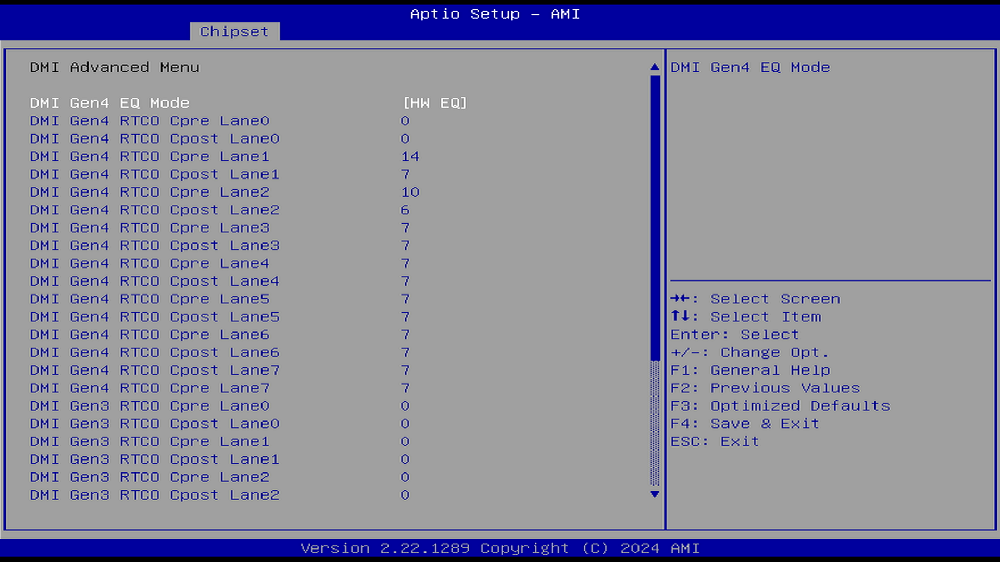

##### DMI Gen4 EQ Mode（DMI Gen4 动态均衡模式）

选项：

Disabled（禁用）

Fixed EQ（固定均衡）

HW EQ（硬件动态均衡）

说明：

作用未知。

##### DMI Gen4 TRC0 Cpre Lan0（DMI Gen4 通道 0 发射器前/后游标系数值）

DMI Gen4 通道发射器前游标和后游标系数值。

##### DMI Gen4 TRC0 Cpost Lan0（DMI Gen4 通道 0 发射器前/后游标系数值）

同上。

##### DMI Gen4 TRC0 Cpre Lan1（DMI Gen4 通道 1 发射器前/后游标系数值）

同上。

##### DMI Gen4 TRC0 Cpost Lan1（DMI Gen4 通道 1 发射器前/后游标系数值）

同上。

##### DMI Gen4 TRC0 Cpre Lan2（DMI Gen4 通道 2 发射器前/后游标系数值）

同上。

##### DMI Gen4 TRC0 Cpost Lan2（DMI Gen4 通道 2 发射器前/后游标系数值）

同上。

##### DMI Gen4 TRC0 Cpre Lan3（DMI Gen4 通道 3 发射器前/后游标系数值）

同上。

##### DMI Gen4 TRC0 Cpost Lan3（DMI Gen4 通道 3 发射器前/后游标系数值）

同上。

##### DMI Gen4 TRC0 Cpre Lan4（DMI Gen4 通道 4 发射器前/后游标系数值）

同上。

##### DMI Gen4 TRC0 Cpost Lan4（DMI Gen4 通道 4 发射器前/后游标系数值）

同上。

##### DMI Gen4 TRC0 Cpre Lan5（DMI Gen4 通道 5 发射器前/后游标系数值）

同上。

##### DMI Gen4 TRC0 Cpost Lan5（DMI Gen4 通道 5 发射器前/后游标系数值）

同上。

##### DMI Gen4 TRC0 Cpre Lan6（DMI Gen4 通道 6 发射器前/后游标系数值）

同上。

##### DMI Gen4 TRC0 Cpost Lan6（DMI Gen4 通道 6 发射器前/后游标系数值）

同上。

##### DMI Gen4 TRC0 Cpre Lan7（DMI Gen4 通道 7 发射器前/后游标系数值）

同上。

##### DMI Gen4 TRC0 Cpost Lan7（DMI Gen4 通道 7 发射器前/后游标系数值）

同上。

DMI Gen3 TRC0 Cpre Lan0（DMI Gen3 通道 0 发射器前/后游标系数值） \*

DMI Gen3 通道发射器前游标和后游标系数值。

作用未知。

##### DMI Gen3 TRC0 Cpost Lan0（DMI Gen3 通道 0 发射器前/后游标系数值）

同上。

##### DMI Gen3 TRC0 Cpre Lan1（DMI Gen3 通道 1 发射器前/后游标系数值）

同上。

##### DMI Gen3 TRC0 Cpost Lan1（DMI Gen3 通道 1 发射器前/后游标系数值）

同上。

##### DMI Gen3 TRC0 Cpre Lan2（DMI Gen3 通道 2 发射器前/后游标系数值）

同上。

##### DMI Gen3 TRC0 Cpost Lan2（DMI Gen3 通道 2 发射器前/后游标系数值）

同上。

##### DMI Gen3 TRC0 Cpre Lan3（DMI Gen3 通道 3 发射器前/后游标系数值）

同上。

##### DMI Gen3 TRC0 Cpost Lan3（DMI Gen3 通道 3 发射器前/后游标系数值）

同上。

##### DMI Gen3 TRC0 Cpre Lan4（DMI Gen3 通道 4 发射器前/后游标系数值）

同上。

##### DMI Gen3 TRC0 Cpost Lan4（DMI Gen3 通道 4 发射器前/后游标系数值）

同上。

##### DMI Gen3 TRC0 Cpre Lan5（DMI Gen3 通道 5 发射器前/后游标系数值）

同上。

##### DMI Gen3 TRC0 Cpost Lan5（DMI Gen3 通道 5 发射器前/后游标系数值）

同上。

##### DMI Gen3 TRC0 Cpre Lan6（DMI Gen3 通道 6 发射器前/后游标系数值）

同上。

##### DMI Gen3 TRC0 Cpost Lan6（DMI Gen3 通道 6 发射器前/后游标系数值）

同上。

##### DMI Gen3 TRC0 Cpre Lan7（DMI Gen3 通道 7 发射器前/后游标系数值）

同上。

##### DMI Gen3 TRC0 Cpost Lan7（DMI Gen3 通道 7 发射器前/后游标系数值）

同上。

##### PEG Port Feature Configuration（PEG 端口功能配置）

选项：

Enabled（启用）

Disabled（禁用）

说明：

PEG，PCI Express Graphics，显卡插槽（x16 PCIe）端口功能配置。

- Detect Non-Compliance Device（检测不规范的设备）

可增强对工业类 PCIe 设备、定制硬件、采集卡的兼容性。

### Stop Grant Configuration（停止授予指令配置）

选项：

Auto（自动）

Manual（手动）

说明：

“Stop Grant mode”是一种低功耗状态（即“停止授予（指令）”模式），为大多数现代 x86 微处理器所支持。

进入该模式的切换是由硬件控制的。

当 CPU 检测到系统空闲（如操作系统空闲线程运行）时，可以通过硬件机制进入该模式以降低功耗。

### VT-d（英特尔 ® 定向 I/O 架构虚拟化技术/IOMMU）

VT-d 即 Intel IOMMU 技术，虚拟化 I/O 技术。

VT-d，Intel® Virtualization Technology for Directed I/O，英特尔 ® 定向 I/O 架构虚拟化技术。用于提高系统的安全性和可靠性，并改善 I/O 设备在虚拟化环境中的性能。

VT-d 是一项位于 CPU、内存和 I/O 设备之间的硬件机制，其主要功能是将 I/O 设备的 DMA 访问请求和中断请求重定向到 VMM 设定的虚拟机中。

参见 [Intel VT-d（1）- 简介](https://zhuanlan.zhihu.com/p/50640466)、[定向 I/O 架构规范英特尔 ® 虚拟化技术](https://www.intel.cn/content/www/cn/zh/content-details/774206/intel-virtualization-technology-for-directed-i-o-architecture-specification.html) [备份](https://web.archive.org/web/20260120205133/https://www.intel.cn/content/www/cn/zh/content-details/774206/intel-virtualization-technology-for-directed-i-o-architecture-specification.html)

虚拟机监控器（VMM）系统可以使用 VT-d 来管理多个虚拟机对同一物理 I/O 设备的访问（即硬件直通）。

### Control Iommu Pre-boot Behavior（控制 IOMMU 预启动行为）

选项：

Disable IOMMU（禁用 IOMMU）

Enable IOMMU during boot（启动时启用 IOMMU）

说明：

如果在 DXE 阶段安装了 DMAR 表，且在 PEI 阶段安装了 VTD_INFO_PPI，则在预启动环境中启用 IOMMU。

雷电 4 所需，在固件阶段尽早启用 IOMMU 可以缓解 PCIe 设备上的恶意 Option ROM，这些 ROM 在操作系统加载之前不应该进行 DMA（防止 DMA 攻击）。

### X2APIC Opt Out（是否关闭第二代高级可编程中断控制器）

选项：

Enabled（启用）

Disabled（禁用）

说明：

x2APIC，Second-Generation Advanced Programmable Interrupt Controller，第二代高级可编程中断控制器。是 xAPIC 架构的扩展，用于支持处理器的 32 位 APIC 地址能力及相关增强功能。中断重映射（Interrupt remapping）使得 x2APIC 能够支持扩展后的 APIC 地址空间，用于外部中断，而无需对中断源（例如 I/OxAPIC 和 MSI/MSIX 设备）进行硬件更改。

控制 X2APIC_OPT_OUT 标志位。

用于控制在 VT-d 功能下是否启用 x2APIC 支持。虚拟化中的设备直通可能会用到此选项。

### DMA Control Guarantee（DMA 控制保护/内存访问保护）

选项：

Enabled（启用）

Disabled（禁用）

说明：

控制 DMA_CONTROL_GUARANTEE 标志位。

借助此功能，操作系统和系统固件可在以下情形中保护系统，以防范针对所有支持 DMA 的设备的恶意和非预期直接内存访问（DMA）攻击。

在操作系统运行时，防范连接到可轻松访问且支持 DMA 功能的内部/外部端口（例如，M.2 PCIe 插槽和 Thunderbolt™3）的设备进行的恶意 DMA。

参见 [适用于 OEM 的内核 DMA 保护（内存访问保护）](https://learn.microsoft.com/zh-cn/windows-hardware/design/device-experiences/oem-kernel-dma-protection) [备份](https://web.archive.org/web/20260120204351/https://learn.microsoft.com/zh-cn/windows-hardware/design/device-experiences/oem-kernel-dma-protection)

### Thermal Device B0:D4:F0（热管理设备 B0:D4:F0）

选项：

Enabled（启用）

Disabled（禁用）

说明：

启用／禁用 SA 热管理设备。

SA Thermal Device 是处理器内部的一个关键组件，用于监测系统代理（System Agent）的温度状态。

对于 ICL A0 步进（Ice Lake，第三代英特尔处理器）版本，始终启用。

### Cpu Crashlog (Device 10)（CPU Crashlog 设备）

选项：

Enabled（启用）

Disabled（禁用）

说明：

CrashLog 功能旨在供 OEM 使用，用于对故障进行初步分诊和一级调试。

CrashLog 使 BIOS 或操作系统能够收集故障数据，其目的在于对这些数据进行收集、分类，并分析故障趋势。

CrashLog 是一种机制，可将调试信息集中到一个位置，并通过多种方式（包括故障系统的 BIOS 和操作系统）访问这些数据。

CrashLog 的启动由 Crash Data Detector（故障数据检测器）触发，当检测到错误条件（如 TCO 看门狗超时、机器检查异常等）时启动。

Crash Data Detector 会将错误状况通知 Crash Data Requester（故障数据请求器），由其从多个不同的 IP 或 Crash Node（故障节点）中收集 Crash Data（故障数据），并在系统重置前将这些数据存储至 Crash Data Storage（片上 SRAM）。

在系统重启后，Crash Data Collector（故障数据收集器）会从 Crash Data Storage 中读取故障数据，并将其提供给软件或上传至中央服务器，用于追踪错误频率和趋势。

参见 [12th Generation Intel® Core™ Processors](https://edc.intel.com/content/www/us/en/design/ipla/software-development-platforms/client/platforms/alder-lake-desktop/12th-generation-intel-core-processors-datasheet-volume-1-of-2/011/platform-crashlog/)

### GNA Device（B0:D8:F0）(高斯与神经网络加速器设备)

选项：

Enabled（启用）

Disabled（禁用）

说明：

SA GNA Device.

GNA，Gaussian and Neural Accelerator，英特尔高斯与神经网络加速器。高斯指高斯模型（Gaussian Model），是一种基于高斯分布（正态分布）的数学模型。

这是一个集成在处理器芯片内的人工智能（AI）协处理器，用于神经网络相关处理。主要用于加速语音识别、噪声抑制、语音唤醒等 AI 工作负载。

### CRID Support（兼容版本标识支持）

选项：

Enabled（启用）

Disabled（禁用）

说明：

系统报告最初发布的芯片组版本标识和 CPU 兼容版本标识信息。

启用／禁用 SA CRID 和 TCSS CRID 控制，以支持 Intel SIPP。

Intel SIPP，The Intel Stable IT Platform Program，英特尔 ® 稳定 IT 平台计划，是 vPro® platform 的一部分。参见 [借助英特尔 ® 稳定 IT 平台计划实现可靠的稳定性](https://www.intel.cn/content/www/cn/zh/architecture-and-technology/vpro/stable-it-platform-program/overview.html) [备份](https://web.archive.org/web/20260120155503/https://www.intel.cn/content/www/cn/zh/architecture-and-technology/vpro/stable-it-platform-program/overview.html)、[什么是英特尔 ® vPro®？](https://www.intel.cn/content/www/cn/zh/architecture-and-technology/vpro/what-is-vpro.html) [备份](https://web.archive.org/web/20260120205253/https://www.intel.cn/content/www/cn/zh/architecture-and-technology/vpro/what-is-vpro.html)

英特尔 ® 稳定 IT 平台计划（英特尔 ® SIPP）能让 IT 部门至少在 15 个月内或在下一代产品发布之前，几乎不用修改平台组件和驱动程序。

### WRC Feature（写缓存功能）

选项：

Enabled（启用）

Disabled（禁用）

说明：

启用／禁用 IOP 的 SA WRC（写缓存）功能。启用后，支持最多 10 个设备分配到环路并进入 LLC（最后一级缓存）。

WRC，Write Cache，写缓存。WRC 功能启用 Intel® 数据直通 I/O 技术（Intel® DDIO），使 I/O 设备能够利用最后一级缓存（LLC）作为中间缓冲区。此功能不对每个 CPU 的最后一级缓存进行分区。

参见 [https://webdls.ieiworld.com/data/\_prod-detail-feature/DRPC-DEV-KIT/Real-Time-Tuning-Guide-11th-Gen-Intel-Core-Processors-1.4.pdf](https://webdls.ieiworld.com/data/_prod-detail-feature/DRPC-DEV-KIT/Real-Time-Tuning-Guide-11th-Gen-Intel-Core-Processors-1.4.pdf) [备份](https://web.archive.org/web/20251207044805/https://webdls.ieiworld.com/data/_prod-detail-feature/DRPC-DEV-KIT/Real-Time-Tuning-Guide-11th-Gen-Intel-Core-Processors-1.4.pdf)、[file:///D:/improving-real-time-performance-of-codesys-control-applications-with-intel-s-real-time-technologies-1723443578.pdf](file:///D:/improving-real-time-performance-of-codesys-control-applications-with-intel-s-real-time-technologies-1723443578.pdf)

### Above 4GB MMIO BIOS assignment（BIOS 4GB 以上 MMIO 分配）

选项：

Enabled（启用）

Disabled（禁用）

说明：

启用／禁用 4GB 以上的内存映射 I/O（Memory Mapped I/O）BIOS 分配。

当 Aperture Size（显存孔径）设置为 2048MB 时，该功能会自动启用。

在 32 位模式下，PCIe 设备在进行内存映射 I/O（MMIO）时最多只能使用到 4GB 的内存地址空间，因为大于 4GB 的地址空间属于 64 位系统才能使用的范围。

在 BIOS 中启用此选项，可以让 64 位 PCIe 设备使用大于 4GB 的地址空间，但操作系统也必须是 64 位系统才能完全支持。

目前该功能通常用于同时使用多张显卡的情况；该功能对于游戏和加密货币挖矿等高性能应用特别有用。参见 [BIOS Above 4GB MMIO BIOS Assignment / Above 4G Decoding](https://432hz.myqnapcloud.com:81/WordPress/above-4gb-mmio-bios-assignment-and-above-4g-decoding/) [备份](https://web.archive.org/web/20260119062020/https://432hz.myqnapcloud.com:81/WordPress/above-4gb-mmio-bios-assignment-and-above-4g-decoding/)

在禁用状态下，双 CPU 显卡及雷电接口设备的使用将受到限制。参见 [为什么使用类似 RocketRAID 840A 的 Legacy 设备，在其自带的 Raid Option 接口下识别不到硬盘，无法组建 RAID?](https://www.asus.com.cn/support/faq/1043356/)

### IPU Device (B0:D5:F0) (IPU 设备)

选项：

Enabled（启用）

Disabled（禁用）

说明：

IPU，Infrastructure Processing Unit，英特尔智能处理单元。

IPU 是一种专门为网络处理设计的处理器，它包含了专门的硬件加速功能，用于提升数据处理和传输效率。

参见 [英特尔 ® Infrastructure Processing Unit（英特尔 ® IPU）](https://www.intel.cn/content/www/cn/zh/products/details/network-io/ipu.html) [备份](https://web.archive.org/web/20260120205008/https://www.intel.cn/content/www/cn/zh/products/details/network-io/ipu.html)

### MIPI Camera Configuration（MIPI 摄像头配置）

MIPI，Mobile Industry Processor Interface，移动行业处理器接口。

MIPI 是一套协议/标准，用于规范化设备内部接口，如摄像头、显示屏等。在嵌入式设备上很常见，如树莓派。

MIPI 包含 CSI（Camera Serial Interface，摄像头接口）和 DSI（Display Serial Interface，显示接口），用于连接摄像头和显示屏等设备。

#### CVF Support（CVF 支持）

选项：

Enabled（启用）

Disabled（禁用）

说明：

启用／禁用通过本地 I/O 或 USB I/O 扩展方式的 CVF 功能。

CVF，Intel Clover Falls，是英特尔推出的一种 AI 协处理器。是一种英特尔集成传感器解决方案。参见 [Dell Laptop Camera Not Working in Teams, Zoom, and Windows Camera Application](https://www.dell.com/support/kbdoc/en-hk/000248760/laptop-mipi-camera-may-not-work-under-windows?lwp=rt)

#### Control Logic 1（控制逻辑 1）

选项：

Enabled（启用）

Disabled（禁用）

说明：

该功能的具体作用尚不明确。

#### Control Logic 2（控制逻辑 2）

同上。

#### Control Logic 3（控制逻辑 3）

同上。

#### Control Logic 4（控制逻辑 4）

同上。

#### Camera 1（摄像头 1）

选项：

Enabled（启用）

Disabled（禁用）

说明：

控制检测到的第一个摄像头。

#### Link option（链路选项）

Camera 1（摄像头 1）启用后才有此项。用于设置摄像头 1 的链路参数。

##### Sensor Model（传感器模型）

选项：

IMX135, OV5693, IMX179, OV8858, OV2740-IVCAM, OV9728, IMX188, IMX208, OV5670, OV8865, HM2051, OV2742, OV9234, OV8856, OV16860, IMX362, IMX488, OVTI01AS, OV13858, OVTI5678, OVTI9738, HIMAX11B1, User Custom（用户自定义）

说明：
选择摄像头的传感器模型。

##### Lanes Clock Division（通道时钟分频）

选项：

- 4 4 2 2
- 4 4 3 1
- 4 4 4 0
- 8 0 2 2
- 8 0 3 1
- 8 0 4 0

设置每个通道的时钟分频。

##### CRD Version（CRD 版本）

PTC, CRD-D, CRD-G, Kilshon-PPV, CRD-G2

作用未知。

##### GPIO control（GPIO 控制）

选项：

No Control Logic（无控制逻辑）

Control Logic 1（控制逻辑 1）

Control Logic 2（控制逻辑 2）

Control Logic 3（控制逻辑 3）

Control Logic 4（控制逻辑 4）

说明：

选择 GPIO 控制逻辑

##### Camera Position（摄像头位置）

选项：

Front（前）

Back（后）

说明：

摄像头机位。

##### Flash Support（闪光灯支持）

选项：

Driver default（驱动默认）

Disabled（禁用）

Enabled（启用）

说明：

作用未知。

##### Privacy LED（隐私指示灯）

选项：

Driver default：使用驱动程序的默认设置。

ILEDA 16mA：设置 ILEDA 引脚的电流为 16 毫安。

ILEDB 2mA：设置 ILEDB 引脚的电流为 2 毫安。

ILEDB 4mA：设置 ILEDB 引脚的电流为 4 毫安。

ILEDB 8mA：设置 ILEDB 引脚的电流为 8 毫安。

ILEDB 16mA：设置 ILEDB 引脚的电流为 16 毫安

说明：

设置隐私指示灯的电流。

##### Rotation（旋转）

选项：

90

180

270

说明：

设置图像旋转角度。

##### Camera module name（摄像头模块名称）

自定义摄像头模块名称

##### MIPI port（MIPI 端口）

选择链路。

##### Lane Used（已使用的通道数）

选项：

x1

x2

x3

x4

说明：

已使用的通道数。

##### PortSpeed（端口速率）

选项：

0 : Sensor Default（传感器默认）

1 : <416Mbps

2 : <1.5Gbps

3 : <2Gbps

4 : <2.5Gbps

5 : <4Gbps

6 : >4Gbps

说明：

设置端口速率。

##### MCLK（主时钟）

MCLK（Master Clock，主时钟）。

具体频率取决于传感器的要求。

##### EEPROM Type（EEPROM 类型）

EEPROM，Electrically Erasable Programmable Read-Only Memory（带电可擦可编程只读存储器），一般用于存储固件或配置数据。

选项：

- ROM_NONE
- ROM_OTP
- ROM_EEPROM_16K_64
- ROM_EEPROM_16K_16
- ROM_OTP_ACPI_ACPI
- ROM_ACPI
- ROM_EEPROM_BRCA016GWZ
- ROM_EEPROM_24AA32
- ROM_EEPROM_CAT24C08
- ROM_EEPROM_M24C64
- ROM_EEPROM_DW98068
- ROM_EEPROM_CAT24C16
- ROM_EEPROM_CAT24C64
- ROM_EEPROM_24AA16

选项 EEPROM 类型。

##### VCM Type（VCM 类型）

VCM，Voice Coil Motor（音圈电机）。摄像头的自动对焦功能会使用 VCM。

选项：

- VCM_NONE
- VCM_AD5823
- VCM_DW9714
- VCM_AD5816
- VCM_DW9719
- VCM_DW9718
- VCM_DW98068
- VCM_WV517S
- VCM_LC898122XA
- VCM_LC898212AXB
- VCM_RESERVED1
- VCM_RESERVED2
- VCM_AK7371
- VCM_BU64297GWZ

选择 VCM 类型。

##### Number of I2C Components（I²C 组件数量）

设置 I²C 组件数量。

##### I2C Channel（I²C 通道）

选项：

I²C0, I²C1, I²C2, I²C3, I²C4, I²C5

说明：

设定 I²C 通道。

##### I2C Address（I²C 地址）

##### Device Type（I²C 设备类型）

选项：

- Sensor（传感器）
- VCM
- EEPROM
- EEPROM_EXT1
- EEPROM_EX2
- EEPROM_EXT3
- EEPROM_EXT4
- EEPROM_EXT5
- EEPROM_EXT6
- EEPROM_EXT7
- IO Expander
- Flash

设定 I²C 设备类型。

##### Flash Driver Selection（闪光灯驱动选择）

选项：

Disabled (禁用)

External（外置）

Internal PMIC（内置电源管理集成电路）

说明：闪光灯驱动选择

#### Camera 2（摄像头 2）

选项：

Enabled（启用）

Disabled（禁用）

说明：

启用后选项同 Camera 1（摄像头 1）。

#### Camera 3（摄像头 3）

选项：

Enabled（启用）

Disabled（禁用）

说明：

启用后选项同 Camera 1（摄像头 1）。

#### Camera 4（摄像头 4）

选项：

Enabled（启用）

Disabled（禁用）

说明：

启用后选项同 Camera 1（摄像头 1）。

## PCH-IO Configuration（平台控制总线配置）

PCH，Platform Controller Hub（平台控制器集线器），即南桥。这个设置即主板 I/O 设置。

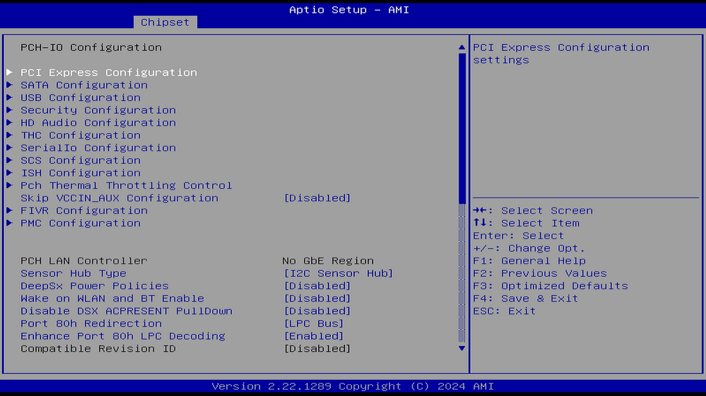

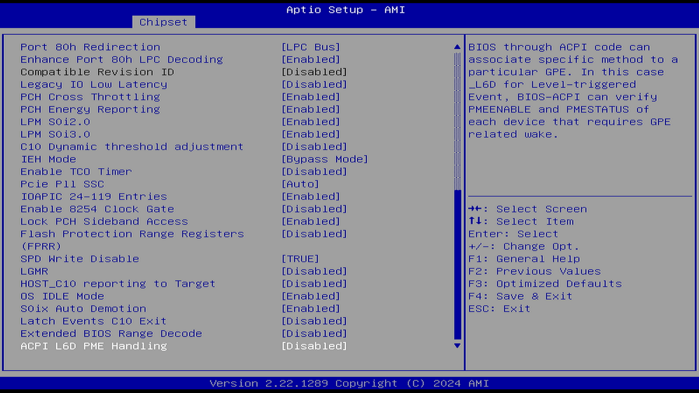

### PCI Express Configuration（PCIe 配置）

PCIe（Peripheral Component Interconnect Express，外围组件快速互连）是一种高带宽扩展总线，通常用于连接显卡、固态硬盘以及采集卡和无线网卡等外设。

参见 [什么是 PCIe 4.0 和 5.0？](https://www.intel.cn/content/www/cn/zh/gaming/resources/what-is-pcie-4-and-why-does-it-matter.html) [备份](https://web.archive.org/web/20260121095630/https://www.intel.cn/content/www/cn/zh/gaming/resources/what-is-pcie-4-and-why-does-it-matter.html)

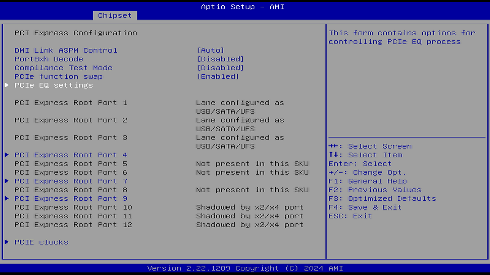

#### Fia Programming（FIA 编程）

选项：

Enabled（启用）

Disabled（禁用）

说明：

对于每个 PCIe 根端口，如果该项启用，BIOS 会加载对应的 FIA（Flexible I/O Adapter）配置。平台在初始化时通过 FIA 设置决定 Root Port 的 Lane 分配、启用状态、速率协商等。

#### DMI Link ASPM Control（DMI 链路 ASPM 控制）

选项：

Disabled（禁用）

L0s

L1

L0sL1

Auto（自动）

说明：

主动状态电源管理（ASPM）是一种针对 PCIe 设备的电源管理机制，旨在设备处于完全活动状态时实现节能。

此选项同时控制了 CPU 和芯片组 DMI 链路的 ASPM。

并非所有 PCIe 通道都以相同的方式工作：CPU PCIe 通道直接与 CPU 相连，而芯片组通道（即“PCH 通道”或南桥通道）通过芯片组并经由 DMI（Direct Media Interface，直接媒体接口）链路连接到 CPU。DMI 其实就是一种 PCIe 通道。

对 DMI 链路主动状态电源管理（Active-state power management，ASPM）的控制。

PCI Express 2.0 规范规定了两种低功耗模式：L0s 和 L1 模式。

对于英特尔® Arc™ 显卡，所有高于 G2 的电源状态都需要启用 ASPM L1。这意味着必须启用 ASPM L1 和全局操作系统设置才能支持英特尔 Arc 显卡低功耗模式。

参考文献：[英特尔 ® 处理器的直接媒体接口（DMI）是什么？](https://www.intel.cn/content/www/cn/zh/support/articles/000094185/processors.html) [备份](https://web.archive.org/web/20260119060854/https://www.intel.cn/content/www/cn/zh/support/articles/000094185/processors.html)

#### Port8xh Decode（PCIE 8xh 端口解码）

选项：

Enabled（启用）

Disabled（禁用）

说明：

打开或关闭 PCIe 8xh 端口解码。

PCIe\* 根端口在设置了 MPC.P8XDE 后，会专门解码并响应地址范围为 80h 到 8Fh 的 I/O 周期。这些 I/O 周期的响应不受标准 PCI 的 I/O 基址/限制寄存器以及 I/O 空间使能字段的限制。这使得 POST 卡可以直接作为 PCI Express 设备连接到根端口，或者通过 PCI Express\* 到 PCI 桥接器以 PCI 卡的形式连接。

所有对该地址范围的 I/O 读写操作都会被原封不动地转发到链路上。连接的设备必须能在 I/O 读操作时返回之前写入的值。BIOS 需要确保同一时刻最多只有一个根端口被启用以响应端口 8xh 范围内的 I/O 周期。

主要用于系统启动和诊断。

参见 [Port 8xh Decode](https://edc.intel.com/content/www/us/en/design/ipla/software-development-platforms/client/platforms/tiger-lake-mobile-y/intel-500-series-chipset-family-on-package-platform-controller-hub-datasheet-v/006/port-8xh-decode/) [备份](https://web.archive.org/web/20260120160914/https://edc.intel.com/content/www/us/en/design/ipla/software-development-platforms/client/platforms/tiger-lake-mobile-y/intel-500-series-chipset-family-on-package-platform-controller-hub-datasheet-v/006/port-8xh-decode/)

#### Compliance Test Mode（合规测试模式）

选项：

Enabled（启用）

Disabled（禁用）

说明：

使用合规负载板时启用。

用于 PCIe 电气一致性测试的功能。

#### PCIe function swap（PCIe 功能交换）

选项：

Enabled（启用）

Disabled（禁用）

说明：

当禁用时，防止 PCIe 根端口功能切换。如果启用了除第 0 功能之外的任何功能，第 0 功能仍将保持可见。

#### PCIe EQ settings（PCIe 均衡设置）

##### PCIe EQ override（覆盖 PCIe 均衡配置）

选项：

Enabled（启用）

Disabled（禁用）

说明：

决定了以下选项：

##### PCIe EQ method（PCIe 均衡方式）

参见 DMI Gen4 EQ Mode（DMI Gen4 动态均衡模式）。

##### PCIe EQ mode（PCIe 均衡模式）

选项：

Use presets during EQ

Use coefficients during EQ

说明：

选择 EQ 模式。预设模式 —— 根端口将在均衡（EQ）过程中使用预设值；系数模式 —— 根端口将在均衡过程中使用系数。

##### EQ PH1 downstream port transmitter preset（在均衡第 1 阶段中下游端口发射器预设值）

选择在均衡第 1 阶段中将使用的预设值。

##### EQ PH1 upstream port transmitter present（在均衡第 1 阶段中上游端口发射器预设。）

选择在均衡第 1 阶段中将使用的预设值。

#### CDR Relock（时钟数据恢复重新锁定）

参见 CDR Relock for CPU DMI（CPU DMI 的时钟数据恢复重新锁定）。

##### Enable EQ phase 2 local transmitter override（启用均衡第二阶段本地发射器覆盖）

选项：

Enabled（启用）

Disabled（禁用）

说明：

均衡第二阶段本地发射器覆盖可用于调试 PCI 设备均衡过程中的问题。

##### Number of presents or coefficients used during phase 3（在第三阶段使用的预设值或系数的数量）

选择在均衡的第三阶段将使用多少个预设值或系数。请注意，你必须将列表中的所有条目设置为有效值。此字段的解释取决于 PCIe 均衡模式。

##### Preset 0

第 0 阶段是链路均衡的第一个阶段。

##### Preset 2

同上。

##### Preset 3

同上。

##### Preset 4

同上。

##### Preset 5

同上。

##### Preset 6

同上。

##### Preset 7

同上。

##### Preset 8

同上。

##### Preset 9

同上。

##### Preset 10

同上。

#### Assertion on Link Down GPIOs（当 GPIO 链路下拉时发生中断）

选项：

Enabled（启用）

Disabled（禁用）

说明：

通过触发一个或多个 GPIO 引脚来发出信号通知或中断

#### PCI Express Slot Selection（PCIe 插槽选择）

选项：

M2（M.2 连接器）

CEMX4 slot（4 通道 PCI Express 插槽，用于连接标准尺寸的 PCIe 扩展卡）

说明：

选择 PCIe 插槽的物理接口。

#### PCI Express Root Port x（PCIe 根端口 x）

为每条单独的 PCIe 根端口设置的参数。

##### PCI Express Root Port x（PCIe 根端口 x）

选项：

Enabled（启用）

Disabled（禁用）

说明：

控制这条 PCI Express 根端口的开关。

##### Connection Type（连接类型）

选项：

Built-in（内置）

Slot（插槽）

说明：

内置设备（Built-In）：该根端口连接了一个内置设备，Slot Implemented 位（表示和当前端口相连的是一个 PCIe 插槽，而不是 PCIe 设备）将被清除。

插槽（Slot）：该根端口连接了一个用户可访问的插槽，Slot Implemented 位将被设置。

##### ASPM（主动状态电源管理）

参见 DMI Link ASPM Control（DMI 链路 ASPM 控制）。

##### L1 Substates（L1 子状态）

选项：

Disabled

L1.1

L1.1 & L1.2

说明：

PCIe L1 子状态选择。

L1 子状态是在标准 L1 低功耗状态的基础上进一步细分的多个更深层次的节能状态。启用此功能可以使 PCIe 链路进入更深层次的低功耗状态，如 L1.1 和 L1.2，从而实现更高效的电源管理。

##### L1 Low（L1 低功耗子状态）

选项：

Enabled（启用）

Disabled（禁用）

说明：

L1 低功耗子状态开关。

##### ACS（访问控制服务）

选项：

Enabled（启用）

Disabled（禁用）

说明：

ACS，Access Control Services Extended Capability，访问控制服务扩展能力

PCIe 和服务器规范中定义的访问控制服务（ACS）功能，是用于维护 IOMMU 组内隔离的硬件标准。

如果没有原生的 ACS，或者硬件供应商没有提供相反的确认，IOMMU 组内的任何多功能设备都存在暴露函数间点对点 DMA 的风险，这些 DMA 操作发生在 IOMMU 保护之外，从而使 IOMMU 组扩展到包括缺乏适当隔离的函数。

用于增强 I/O 虚拟化能力。

参见 [A.2.2.4. Access Control Services (ACS) Capability Structure](https://www.intel.com/content/www/us/en/docs/programmable/683059/24-3/access-control-services-acs-capability.html) [备份](https://web.archive.org/web/20260120204431/https://docs.altera.com/r/docs/683059/current)、[Hardware Considerations for Implementing SR-IOV](https://docs.redhat.com/zh-cn/documentation/red_hat_virtualization/4.2/html/hardware_considerations_for_implementing_sr-iov/index) [备份](https://web.archive.org/web/20260120204650/https://docs.redhat.com/zh-cn/documentation/red_hat_virtualization/4.2/html/hardware_considerations_for_implementing_sr-iov/index)

##### PTM（精确时间测量）

选项：

Enabled（启用）

Disabled（禁用）

说明：

PTM，Precision Time Measurement，精确时间测量

参见 [F-Tile Avalon® Streaming Intel® FPGA IP for PCI Express\* User Guide](https://www.intel.com/content/www/us/en/docs/programmable/683140/25-1/precision-time-measurement-ptm-58323.html) [备份](https://web.archive.org/web/20260120205001/https://docs.altera.com/r/docs/683140/current)

精确时间测量（PTM）使得多个具有独立本地时钟的组件之间能够实现精确的事件协调。通常，由于各自时钟对时间的值和变化速率的认知不同，实现这种精确协调是非常困难的。为了解决这一限制，PTM 允许组件计算其本地时间与共享的 PTM 主时间之间的关系：PTM 主时间是与 PTM 根节点相关联的独立时间域。每个 PTM 根节点为一个 PTM 层级提供 PTM 主时间。

PTM 请求者指能够作为终端点或上游端口关联的消费者使用 PTM 的功能。PTM 响应者指能够为根端口或根复合体提供 PTM 主时间的功能。PTM 根节点是 PTM 层级的 PTM 主时间来源，同时也是 PTM 响应者。F-Tile PCIe 硬件 IP 支持作为终端点模式或 PTM 请求者使用 PTM。

一种用于在 IP 和 FPGA 核架构之间进行精确时间测量的功能。

##### DPC（下行端口控制）

选项：

Enabled（启用）

Disabled（禁用）

说明：

DPC，Downstream Port Containment，下行端口控制

DPC 是 PCIe 标准的建议扩展，设计用于自动禁止发生非致命 (或致命) 错误后的链路以便防止可能扩散的数据损坏以及在软件支持时启动错误恢复。

##### EPDC（增强型下行端口控制）

EDPC，Enhanced Downstream Port Containment（增强型下行端口控制）。

- Hot Plug（热插拔）

热插拔又称为带电插拔或热替换，是指在不切断设备电源的情况下，将主控板、接口板、光模块等部件插入或拔出设备。

选项：

Enabled（启用）

Disabled（禁用）

说明：

控制 PCIe 热插拔。

- URR（PCIe 不支持的请求报告）

URR，Unsupported Request Reporting，PCI Express 不支持的请求报告。用于报告不可纠正的错误状态寄存器，非致命 PCIe 错误

Enabled（启用）

Disabled（禁用）

说明：

参见 [为什么使用适用于 PCI Express * 的 英特尔 ® FPGA P-Tile/H-Tile、Avalon® 流传输和 Avalon® 内存映射 IP 时，在高级错误报告（AER）中记录非严重 PCIe* 错误？](https://www.intel.cn/content/www/cn/zh/support/programmable/articles/000080831.html) [备份](https://web.archive.org/web/20260120161434/https://community.altera.com/kb/knowledge-base/why-are-non-fatal-pcie-errors-logged-in-advanced-error-reporting-aer-when-using-/344197)

- FER（PCIe 设备致命错误报告）

FER，Device Fatal Error Reporting，设备致命错误报告

选项：

Enabled（启用）

Disabled（禁用）

说明：

PCI Express 设备致命错误报告。

- NFER（PCIe 设备非致命错误报告）

选项：

Enabled（启用）

Disabled（禁用）

说明：

NFER，PCI Express Device Non-Fatal Error Reporting，设备非致命错误报告

- CER（PCIe 设备可纠正错误报告）

PCIe 的错误可以分为两种类型：可纠正错误（Correctable Errors）和不可纠正错误（Uncorrectable Errors）。

参见 [PowerEdge：管理可纠正错误阈值事件的第 14 代英特尔和第 15 代服务器](https://www.dell.com/support/kbdoc/zh-cn/000194574/poweredge-%E7%AE%A1%E7%90%86%E5%8F%AF%E7%BA%A0%E6%AD%A3%E9%94%99%E8%AF%AF%E9%98%88%E5%80%BC%E4%BA%8B%E4%BB%B6%E7%9A%84%E7%AC%AC-14-%E4%BB%A3%E8%8B%B1%E7%89%B9%E5%B0%94%E5%92%8C%E7%AC%AC-15-%E4%BB%A3%E6%9C%8D%E5%8A%A1%E5%99%A8) [备份](https://web.archive.org/web/20260120204817/https://www.dell.com/support/kbdoc/zh-cn/000194574/poweredge-%E7%AC%AC-14-%E4%BB%A3%E8%8B%B1%E7%89%B9%E5%B0%94%E5%92%8C%E7%AC%AC-15-%E4%BB%A3%E6%9C%8D%E5%8A%A1%E5%99%A8-%E7%AE%A1%E7%90%86%E5%8F%AF%E7%BA%A0%E6%AD%A3%E7%9A%84%E9%94%99%E8%AF%AF%E9%98%88%E5%80%BC%E4%BA%8B%E4%BB%B6)

选项：

Enabled（启用）

Disabled（禁用）

说明：

CER，Correctable Error Reporting（可纠正错误报告）。

- CTO（PCIe 完成超时）

TO，timeout

CT，Completion Timer，完成计时

选项：

Enabled（启用）

Disabled（禁用）

说明：

PCIe 设备发出的请求中有些请求需要 Completer 反馈 Completion，此时 Requester 会等待 Completion 再进行下一步操作。在某些异常情况下，比如配置不当、系统故障等，Requester 将无法收到或收齐 Completion。

为了不影响进一步使用，需要一种超时退出机制让 Requester 从这种等待状态恢复过来，这就是 Completion Timeout 机制（完成超时退出机制）。

参见 [【PCIe】PCIe 完成超时机制](https://www.cnblogs.com/linhaostudy/p/18958287) [备份](https://web.archive.org/web/20260120161520/https://www.cnblogs.com/linhaostudy/p/18958287)

- SEFE（在发生致命错误时触发根 PCIe 系统错误）

选项：

Enabled（启用）

Disabled（禁用）

说明：

SEFE，System Error on Fatal Error，致命错误时触发系统错误。

在发生致命错误时触发根 PCIe 系统错误，通知系统发生了严重的硬件或链路故障。

- SENFE（在发生非致命错误时触发根 PCIe 系统错误）

选项：

Enabled（启用）

Disabled（禁用）

说明：

SENFE，System Error on Non-Fatal Error，非致命错误时触发系统错误。

在发生非致命错误时触发根 PCIe 系统错误

- SECE（在发生可纠正错误时触发根 PCIe 系统错误）

选项：

Enabled（启用）

Disabled（禁用）

说明：SECE，System Error on Correctable Error，发生可纠正错误时触发系统错误

在发生可纠正错误时触发根 PCIe 系统错误

- PME SCI（PCIe 的电源管理中断和系统控制中断）

参见 [[维修资料] 关于电路图中的 SMI、SCI、PME#三个信号的功能解释](https://www.chinafix.com/thread-1205171-1-1.html)

选项：

Enabled（启用）

Disabled（禁用）

PME，Power Management Events，电源管理事件。电源管理中断。

SCI，System Control Interrupt，系统控制中断。SCI# 主要是在进入 ACPI 后，ACPI 用的中断信号。

用于控制 PCIe 的 PME 和 SCI。

- Advanced Error Reporting（高级错误报告）

选项：

Enabled（启用）

Disabled（禁用）

Advanced Error Reporting 即 AER，

每个符合 PCI Express 标准的设备都必须实现基本级别的错误管理，并且可以选择性地实现高级错误管理。PCI Express 高级错误报告功能（Advanced Error Reporting Capability，AER）是一种可选的扩展能力，可由支持高级错误控制与报告的 PCI Express 设备功能实现。

参见 [P-Tile Avalon® Memory-mapped Intel® FPGA IP for PCI Express\* User Guide](https://www.intel.com/content/www/us/en/docs/programmable/683268/21-1-4-0-0/advanced-error-reporting-aer.html) [备份](https://web.archive.org/web/20260121061835/https://docs.altera.com/r/docs/683268/current)

##### PCIe Speed（PCIe 速率）

选项：

Auto（自动）

Gen1: PCIe 1.0 (2.5 GT/s)

Gen2: PCIe 2.0 (5.0 GT/s)

Gen3: PCIe 3.0 (8.0 GT/s)

说明：

控制 PCIe 速率。

##### Transmitter Half Swing（发送器半摆幅模式）

选项：

Enabled（启用）

Disabled（禁用）

说明：

PCIe 物理层的发送器。如何选取输出摆幅模式的方法是特定于具体实现的。

##### Detect Timeout（检测超时）

值：

0000-FFFF

步长 \= 0001

单位为毫秒

说明：

参考代码等待链路退出检测状态的时间。

在假设端口无设备并可能禁用端口之前，会先检测已启用端口的状态。

##### Extra Bus Reserved（保留额外总线）

值：

0-7，步长 1

说明：

此根桥后方桥接器保留的额外总线（范围 0 到 7）。此选项提供你选择保留给其他接口的总线数量

##### Reserved Memory（保留内存）

值：

1-14，步长 1

说明：

此根桥保留的内存范围（1 到 20 MB）。

##### Reserved I/O（保留 I/O）

值：

04-14，步长 4

说明：

此根桥保留的 I/O 范围（4K、8K、12K、16K 或 20K）。

##### PCIEx CLKREQ Mapping Override（PCIe CLKREQ# 映射覆盖）

No CLKREQ

自定义数值

PCIE CLKREQ 覆盖，用于默认平台映射。设备通过 CLKREQ#管脚通知主机其需要使用时钟信号，以便退出低功耗状态或保持链路活跃。

##### PCH PCIe LTR Configuration（PCH PCIe 延迟容忍报告配置）

LTR，Latency Tolerance Reporting，延迟容忍报告

LTR 是一种新机制，使 Endpoint 能够传递其对内存读写和中断的延迟需求信息，可用于提高系统的电源管理效率。

##### LTR（延迟容忍报告）

选项：

Enabled（启用）

Disabled（禁用）

说明：

控制 LTR 开关。

- Snoop Latency Override（覆盖侦听延迟）

Disabled（禁用）

Manual（手动）

Auto（自动）

在多核 CPU 和缓存一致性系统中，“Snoop”指的是一个核心的缓存监视其他核心或外部代理（如 PCIe 设备通过 DMA）对共享内存的访问，以维护所有缓存数据的一致性。Snoop 操作需要时间，会引入延迟。这个延迟就是 Snoop Latency。

这个 BIOS 设置项不是 PCIe 设备报告的 LTR 值本身。它是系统 (具体是 SA 内的 PCIe 控制器/电源管理逻辑) 在评估 PCIe 设备 LTR 要求时，需要额外考虑的一个内部延迟补偿值。

参见 [BIOS PCIe 配置里的 LTR Snoop Latency value of SA PCIE](https://www.cnblogs.com/wanglouxiaozi/p/18946234) [备份](https://web.archive.org/web/20260121061741/https://www.cnblogs.com/wanglouxiaozi/p/18946234)

- Non Snoop Latency Override（覆盖非侦听延迟）

Disabled（禁用）

Manual（手动）

Auto（自动）

当北桥芯片接收到非侦听读取请求时，它不会侦听处理器的缓存，而是直接从直接内存访问（DMA）缓冲区中读取数据。

##### LTR Lock（锁定 LTR）

选项：

Enabled（启用）

Disabled（禁用）

说明：

锁定 PCIe LTR 的配置。

##### Peer Memory Write（PCIe P2P DMA 点对点内存写入）

选项：

Enabled（启用）

Disabled（禁用）

说明：

Peer Memory Write，PCIe Peer-to-Peer(PCIe P2P) DMA，PCIe 点对点 DMA。

参见 [Peer Memory Write Enable](https://jasonyychiu.blogspot.com/2021/03/peer-memory-write-enable.html) [备份](https://web.archive.org/web/20260121062443/https://jasonyychiu.blogspot.com/2021/03/peer-memory-write-enable.html)

P2P（点对点）通信可使 PCIe 设备之间无需经过内存，直接将数据传输给对方（例如 NVMe SSD ↔️ PCIe GPU），从而实现 PCIe 总线上不同设备之间的数据共享。

#### PCIE clocks（PCIe 时钟）

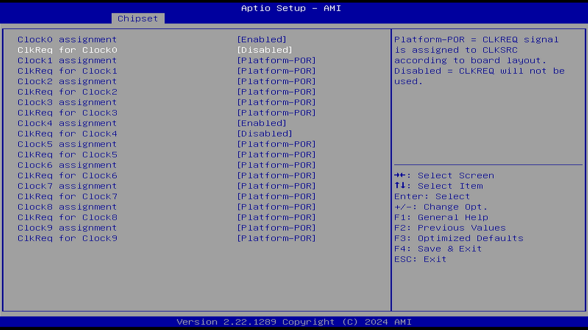

##### Clock0 Assignment（时钟 0 分配）

选项：

Platform-POR（平台上电复位）

Enabled（启用）

Disabled（禁用）

说明：

Platform-POR：时钟根据主板布局分配给 PCIe 接口或 LAN。

启用（Enabled）：即使未使用，也保持时钟启用状态。

禁用（Disabled）：关闭时钟。

禁用 clock1 会禁用 LAN 控制器，但不会禁用其根端口。

参见 [What is “clock0 assignment” and “ClkReq for clock0” BIOS options?](https://winraid.level1techs.com/t/what-is-clock0-assignment-and-clkreq-for-clock0-bios-options/104666) [备份](https://web.archive.org/web/20260120155425/https://winraid.level1techs.com/t/what-is-clock0-assignment-and-clkreq-for-clock0-bios-options/104666)

##### ClkReq for Clock0（时钟 0 的时钟请求引脚）

选项：

Platform-POR（平台上电复位）

Disabled（禁用）

说明：

Platform-POR \= 会根据主板布局，将 CLKREQ 信号分配给 CLKSRC。

Disabled \= 不使用 CLKREQ 信号。

PCIe 中的 CLKREQ# 管脚（Clock Request Pin，时钟请求引脚）用于管理 PCIe 链路中的时钟信号，以实现电源管理。

### SATA Configuration（SATA 配置）

SATA，Serial Advanced Technology Attachment，串行 ATA，串行高级技术附件。SATA 是一种基于行业标准的串行硬件驱动器接口。

#### SATA Controller(s)（SATA 控制器）

选项：

Enabled（启用）

Disabled（禁用）

说明：

控制 SATA 控制器的启用或禁用。

#### SATA Mode Selection（SATA 模式选择）

选项

AHCI（Advanced Host Controller Interface，高级主机控制接口）

RAID（Redundant Array of Independent Disks，独立磁盘冗余阵列）

IDE（Integrated Drive Electronics，集成驱动电子接口）

说明：

需要操作系统支持，否则可能无法启动。选择存储设备与计算机连接的标准方式。

一般只有非常老旧的计算机才会使用 IDE 接口。

现代计算机通常使用 AHCI 模式。大部分非 Windows 操作系统（本身也需要驱动才能支持）都与 RAID 模式不兼容（但是英特尔快速存储技术需要 RAID 模式）。

并且这个 RAID，一般叫做 Fake-RAID/hardware-assisted software RAID，伪 RAID，不是真正的硬 RAID。这种情况下可能需要英特尔快速存储技术（RST）驱动才能正常使用。

参见 [Install Arch Linux with Fake RAID](https://wiki.archlinuxcn.org/wiki/Install_Arch_Linux_with_Fake_RAID) [备份](https://web.archive.org/web/20260119060851/https://wiki.archlinuxcn.org/wiki/Install_Arch_Linux_with_Fake_RAID)

#### SATA Test Mode(SATA 测试模式)

选项：

Enabled（启用）

Disabled（禁用）

说明：

BIOS 的 SATA 测试模式（回环）

启用或禁用 SATA 接口的回环测试模式的选项。该模式主要用于硬件验证和调试，帮助开发人员检查 SATA 接口的功能和性能。

#### Aggressive LPM Support（主动进入链路低功耗状态 ALPM 支持）

选项：

Enabled（启用）

Disabled（禁用）

说明：

Aggressive LPM Support（ALPM）。

使 PCH 主动让 SATA 总线进入链路低功耗状态。此功能仅在 AHCI 模式下受支持。

当该功能设置为 Enabled（启用）时，SATA AHCI 控制器将管理 SATA 链路的电源使用。在 I/O 长时间无活动的情况下，控制器会将链路置于低功耗模式；而当 I/O 活动恢复时，控制器会将链路恢复为活动状态。该选项可设为 Disabled（禁用）或 Enabled（启用）。

#### Software Preserve（软件保留）

Unknown（未知）

此项不可设置。

作用未知。

#### Port x（端口 x）

选项：

Enabled（启用）

Disabled（禁用）

说明：

控制特定的 SATA 端口开关。

#### Hot Plug（热插拔）

参见 PCIe 下面的 Hot Plug（热插拔）。

#### Configured as eSATA（配置为 eSATA）

选项：

此项不可设置。

说明：

Hot Plug support。支持热插拔

eSATA 的全称是 External Serial ATA（外部串行 ATA），它是 SATA 接口的外部扩展规范。换言之，eSATA 就是 "外置" 版的 SATA，它是用来连接外部而非内部 SATA 设备。

参见 [eSATA 接口的介绍和使用](https://www.dell.com/support/kbdoc/zh-cn/000127522/esata-%E6%8E%A5%E5%8F%A3%E7%9A%84%E4%BB%8B%E7%BB%8D%E5%92%8C%E4%BD%BF%E7%94%A8) [备份](https://web.archive.org/web/20260120160623/https://www.dell.com/support/kbdoc/zh-cn/000127522/esata-%E6%8E%A5%E5%8F%A3%E7%9A%84%E4%BB%8B%E7%BB%8D%E5%92%8C%E4%BD%BF%E7%94%A8)

#### External（外置）

选项：

Enabled（启用）

Disabled（禁用）

将此端口标记为外置端口。启用或禁用对外部 SATA 设备的支持。

#### Spin Up Device（启动设备转动）

选项：

Enabled（启用）

Disabled（禁用）

说明：控制 PCH 是否初始化该设备。选择 [Enabled] 将在边沿检测从 0 变为 1 时，开始为设备执行 COMRESET 初始化顺序。

#### SATA Device Type（SATA 设备类型）

选项：

Hard Disk Drive，HDD，机械硬盘

Solid State Drive，SSD，固态硬盘

说明：

使用此功能可指定 SATA 接口连接的硬盘类型。

#### Topology（拓扑结构）

选项：

Unknown（未知）

ISATA

Flex-灵活模式

Direct connect：直连

M2: M.2

说明：

物理硬件接口。识别 SATA 拓扑结构类型。

#### SATA Port 0 DevSlp（SATA 端口 0 的设备休眠）

选项：

Enabled（启用）

Disabled（禁用）

说明：

启用／禁用 SATA 端口 0 的 DevSlp（设备休眠）功能。要使 DevSlp 正常工作，硬盘和 SATA 端口都必须支持 DevSlp 功能，否则可能会出现意外行为。启用前请确认主板设计是否支持此功能。

设备睡眠（或 DevSleep / DevSlp）是某些 SATA 设备中的一种新功能，它允许设备进入低功耗的“设备睡眠”状态。例如，在 DevSleep 模式下，Intel® 固态硬盘 Pro 2500 系列（2.5 英寸）的功耗仅为 5 毫瓦，而处于空闲状态时的功耗为 55 毫瓦。

设备睡眠是 SATA 标准的一部分，理论上所有 SATA 设备（无论固态硬盘还是机械硬盘）均应支持该功能。

参见 [什麼是 dev 睡眠功能以及如何禁用 dev 睡眠功能](https://www.intel.com.tw/content/www/tw/zh/support/articles/000024170/memory-and-storage.html) [备份](https://web.archive.org/web/20260119060931/https://www.intel.com.tw/content/www/tw/zh/support/articles/000024170/memory-and-storage.html)

#### DITO Configuration（驱动空闲超时配置）

选项：

Enabled（启用）

Disabled（禁用）

说明：

DITO，Drive Idle Timeout（驱动空闲超时配置）。

DITO 是指某个端口在硬件可以自动进入 DevSleep 状态之前必须保持空闲的时间。

参见 [https://www.intel.com/content/dam/www/public/us/en/documents/technical-specifications/serial-ata-ahci-tech-proposal-rev1_3_1.pdf](https://www.intel.com/content/dam/www/public/us/en/documents/technical-specifications/serial-ata-ahci-tech-proposal-rev1_3_1.pdf) [备份](https://web.archive.org/web/20251207044815/https://www.intel.com/content/dam/www/public/us/en/documents/technical-specifications/serial-ata-ahci-tech-proposal-rev1_3_1.pdf)

#### DTIO Value（驱动空闲超时时间）

设置 DTIO 值。这是一个最低的时间要求，但不意味着达到此时间就睡眠。

#### DM Value（设备睡眠模式时间）

DM，Device Sleep Mode Value，设备睡眠模式时间

空闲的时间达到此值就会进入睡眠状态。

### USB Configuration（USB 配置）

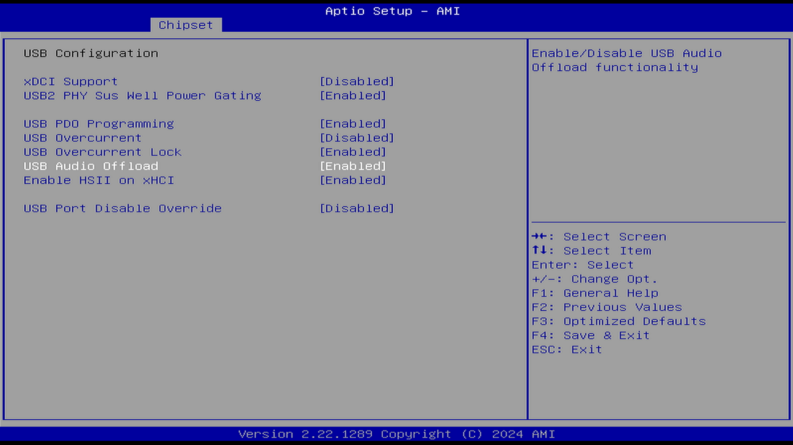

#### XDCI Support（XDCI 支持）

选项：

Enabled（启用）

Disabled（禁用）

说明：

xDCI，Extensible Device Controller Interface，可扩展设备控制器接口。

用于支持 USB OTG 设备。

可扩展设备控制器接口（Extensible Device Controller Interface，简称 xDCI）是一种接口规范，定义了用于通用串行总线（USB 3）的设备控制器，该控制器能够与兼容 USB 1.x、2.0 和 3.x 的设备进行通信。

当计算机作为设备连接到另一台计算机时（例如，平板电脑连接到台式机），xDCI 控制器将在设备端被激活，并与另一台计算机的主机进行通信。

xDCI 控制器支持的最大链路速率为 USB 3.2 Gen 1x1（5 Gbps）。

注意：这些控制器作为独立的 PCI 功能集成在处理器芯片内部，用于支持具备 USB-C\* 功能的端口。

参见 [12th Generation Intel® Core™ Processors](https://edc.intel.com/content/www/tw/zh/design/ipla/software-development-platforms/client/platforms/alder-lake-desktop/12th-generation-intel-core-processors-datasheet-volume-1-of-2/011/extensible-device-controller-interface-xdci/)

#### USB2 PHY Sus Well Power Gating（USB 2.0 物理层的 Sus Well 电源门控）

选项：

Enabled（启用）

Disabled（禁用）

说明：

此项对 PCH-H 无影响，用于控制 USB 2.0 物理层的 Sus Well 电源门控。

节能选项。

#### USB PDO Programming（USB PDO 编程）

选项：

Enabled（启用）

Disabled（禁用）

说明：

PDO，Power Data Objects，供电数据对象

USB PD 2.0 通过 USB PDO 提供标准功能（如电源协议功率）。

此策略选项设置后，BIOS 会在 PEI 阶段配置端口禁用覆盖（Port Disable Override，PDO）寄存器。

如果禁用此选项，BIOS 将不会在 PEI 阶段配置 PDO，并保持 PDO 寄存器未锁定，以便后续进行配置。

若禁用此选项，则平台代码必须在启动操作系统之前自行设置该寄存器。

#### USB Overcurrent（USB 过流）

选项：

Enabled（启用）

Disabled（禁用）

说明：

选择“Disabled”（禁用）将进行基于引脚的调试。如果启用了基于引脚的调试但未禁用 USB 过流功能，USB DbC（USB Debug Class）将无法正常工作。英特尔 DCI DbC 可通过 USB 端口调试英特尔 x86 平台。

#### USB Overcurrent Lock（USB 过流锁定）

选项：

Enabled（启用）

Disabled（禁用）

说明：

可防止电流超过预设的最大限流值。

选择“Enabled”（启用）表示使用过流功能。启用此项后，XHCI 控制器将读取并使用过流引脚映射数据。

此选项用于控制 USB 是否应将过流引脚映射编程到 xHCI 控制器中。

禁用此功能将关闭过流检测功能。

过流引脚映射数据包含在各端口结构中（例如 USB30_PORT_CONFIG 的 OverCurrentPin 字段）。

在默认情况下，过流功能应保持启用，仅在 OBS 调试使用时禁用。

启用：将在相应的 xHCI 控制器寄存器中编程 USB 过流引脚映射

禁用：清除过流引脚映射，允许 OBS 使用过流引脚

#### USB Audio Offload（USB 音频卸载）

选项：

Enabled（启用）

Disabled（禁用）

说明：

硬件卸载的音频处理允许在计算机的主 CPU 之外执行主要音频处理任务。简而言之，这是一项使用声卡进行的音频硬件加速功能。音频处理的大部分工作不再交由 CPU 来完成，

参见 [Hardware-Offloaded 音频处理](https://learn.microsoft.com/zh-cn/windows-hardware/drivers/audio/hardware-offloaded-audio-processing) [备份](https://web.archive.org/web/20260121062425/https://learn.microsoft.com/zh-cn/windows-hardware/drivers/audio/hardware-offloaded-audio-processing)

#### Enable HSII on xHCI（对 xHCI 启用 HSII）

选项：

Enabled（启用）

Disabled（禁用）

说明：

HSII, HS Interrupt IN Alarm

启用／禁用 HSII 功能。启用该功能可能会导致功耗增加。

作用未知。参见 [https://raw.githubusercontent.com/intel/FSP/master/TigerLakeFspBinPkg/Docs/TigerLake_FSP_Integration_Guide.pdf](https://raw.githubusercontent.com/intel/FSP/master/TigerLakeFspBinPkg/Docs/TigerLake_FSP_Integration_Guide.pdf) [备份](https://web.archive.org/web/20260119061422/https://raw.githubusercontent.com/intel/FSP/master/TigerLakeFspBinPkg/Docs/TigerLake_FSP_Integration_Guide.pdf)

#### xHCI Compliance Mode（xHCI 合规模式）

选项：

Enabled（启用）

Disabled（禁用）

说明：

xHCI（eXtensible Host Controller Interface）是 USB 3.0 及更高版本的主机控制器接口规范。

合规模式用于测试 USB 控制器和设备是否符合 USB 标准规范，通常用于硬件开发和调试阶段。

#### USB3 Link Speed Selection（USB3 链路速率选择）

GEN1：5 Gbps

GEN2：10 Gbps

说明：

设置 USB3 链路速率

#### USB Port Disabled Override（USB 端口禁用覆盖）

选项：

Disabled（禁用）

Select Per-Pin（逐引脚选择）

说明：

有选择地启用或禁用相应的 USB 接口，使其是否向控制器报告设备连接状态。

以上重复选项不再赘述。

##### USB SS Physical Connector #0（USB 3.0 物理连接 0 号）

选项：

Enabled（启用）

Disabled（禁用）

说明：

SS，SuperSpeed，超速，代表 USB 3.0 规范

启用或禁用此 USB 物理连接器（物理端口）。一旦禁用，插入该连接器的任何 USB 设备都不会被 BIOS 或操作系统检测到。

##### USB HS Physical Connector #0（USB 2.0 物理连接 0 号）

选项：

Enabled（启用）

Disabled（禁用）

说明：

HS，High Speed，高速，代表 USB 2.0 规范

启用或禁用此 USB 物理连接器（物理端口）。一旦禁用，插入该连接器的任何 USB 设备都不会被 BIOS 或操作系统检测到。

### Security Configuration（安全配置）

#### RTC Memory Lock（RTC 内存锁定）

选项：

Enabled（启用）

Disabled（禁用）

说明：

实时时钟内存锁定

用于保护存储在 RTC RAM 中的特定内存区域。启用后将锁定 RTC RAM 的低/高 128 字节区块中的 38h 到 3Fh 字节。防止未经授权的访问和修改。

启用后可能无法修改主机或 RTC 中的时间。

#### BIOS Lock（BIOS 锁定）

选项：

Enabled（启用）

Disabled（禁用）

说明：

启用此功能是确保闪存的 SMM（系统管理模式）保护所必需的。启用此功能后，只有在 SMM 中运行的代码才能修改 BIOS 区域。

启用后无法使用工具刷写/更新 BIOS。

#### Force unlock on all GPIO pads（强制解锁所有 GPIO 引脚）

选项：

Enabled（启用）

Disabled（禁用）

说明：

启用后，BIOS 将强制所有 GPIO 引脚处于解锁状态。

黑苹果可能会用到此选项，否则触控板可能无法使用。

### HD Audio Configuration（HDA 高清音频配置）

选项：

Enabled（启用）

Disabled（禁用）

说明：

HD Audio，HDA，高清音频，是平台上的音频子系统，并不等同于核显自带声卡。

控制 HD-Audio 设备的检测。启用后，以下相关的菜单项将会出现。

以下重复选项不列出。

#### Audio DSP（音频数字信号处理器）

选项：

Enabled（启用）

Disabled（禁用）

说明：

DSP，Digital Signal Processors，数字信号处理器。

控制音频数字信号处理器开关。其主要作用是对音频信号进行数字处理和优化，以提升音频效果并保持输出一致性。

##### HDA Link（HDA 链路）/ Audio Link Mode（音频链路模式）

选项：

HD Audio Link：HDA 链路

SSP (I2S)：I²S，串行音频接口

SoundWire：MIPI 协会推出的关于音频的规范

Advanced Link Config：高级链路配置

说明：

选择链接模式：

1）HDA-Link(SDIO-1)，DMIC[0-1]

2）SSP[0-5]，DMIC[0-1]

3）SNDW [1-4]

4）“Advanced”模式可分别启用每个接口。

DMIC，Digital Microphone，数字麦克风。

SNDW，SoundWire。

##### DMIC #0（数字麦克风 0 号）

同上。

SSP #0 (串行音频接口 0 号)

同上。

SNDW #0（SoundWire 0 号）

同上。

#### HDA-Link Codec Select（HDA 链路编解码器选择）

选项：

Platform Onboard：平台板载，主板自带的音频芯片

External Kit：外置套件

说明：

选择使用平台板载编解码器（仅安装一个 Verb 表）还是外部编解码器套件（安装多个 Verb 表）。

#### HD Audio Advanced Configuration（HDA 高级配置）

HD Audio 子系统高级配置设置

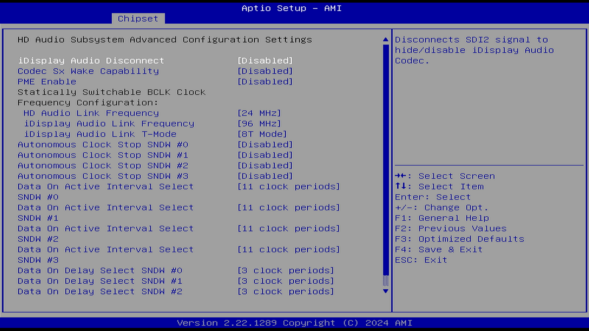

##### iDisplay Audio Disconnect（断开 iDisplay 音频）

选项：

Enabled（启用）

Disabled（禁用）

说明：

iDisplay：Integrated Display Audio，iGPU（核显）的音频。

断开 SDI2 信号以隐藏（禁用）iDisplay 音频编解码器。

控制核显接入显示器后是否启用音频。当启用此选项时，系统会断开显示器的音频连接，可能导致通过 HDMI 和 DisplayPort 输出的音频信号无法传输到显示器（即核显声卡没声音）。

##### Codec Sx Wake Capability（编解码器 Sx 唤醒能力）

选项：

Enabled（启用）

Disabled（禁用）

说明：

在 Sx（即 S1、S2、S3 等）状态下检测由编解码器发起的唤醒的能力（例如通过调制解调器编解码器）。

此设置控制音频编解码器在系统处于低功耗睡眠状态时是否能够触发系统唤醒。

##### PME Enable（启用电源管理事件）

选项：

Enabled（启用）

Disabled（禁用）

说明：

PME，Power Management Event，电源管理事件

启用在 POST 期间通过 PME 唤醒 HD Audio 控制器。

控制系统是否允许在 POST（Power-On Self-Test）期间通过 PME 事件唤醒 HD Audio 控制器。

启用此选项后，系统可以在启动过程中接收来自音频控制器的电源管理事件，从而触发唤醒操作。

##### HD Link Frequency（HD 链路频率）

选项：

6 MHz

12 MHz

24 MHz

说明：

选择 HD Audio Link 频率。仅在 HDA 编解码器支持所选频率时适用。必须选择正确的选项，否则可能无法输出音频。

##### iDisplay Audio Link Frequency（iDisplay 音频链路频率）

选项：

48 MHz

96 MHz

说明：

核显音频链路频率。

必须选择正确的选项，否则会没声音。

##### iDisplay Audio Link T-Mode（iDisplay 音频链路 T-模式）

选项：

2T：每个时钟周期传输 2 个数据位。

4T：每个时钟周期传输 4 个数据位。

8T：每个时钟周期传输 8 个数据位。

16T：每个时钟周期传输 16 个数据位。

说明：

指示 SDI 是以 1T、2T（CNL）模式，还是以 2T、4T、8T（ICL）模式运行。

CNL：Cannon Lake 架构，部分第八代 Intel 酷睿处理器代号。

ICL：Ice Lake 架构，第十代 Intel 酷睿处理器代号

必须选择正确的选项，否则会没声音。

##### Autonomous Clock Stop SNDW #x（SoundWire 链路编号 x 的自主时钟停止）

选项：

Enabled（启用）

Disabled（禁用）

说明：

SoundWire 链路编号 x 的自主时钟停止。“x”表示链路编号。

控制是否启用 SoundWire 链路的自主时钟停止功能。当启用此功能时，特定的 SoundWire 链路（如 LINK4）在不活动时会自动停止时钟，以降低功耗。此功能适用于支持自主时钟停止的 SoundWire 编解码器。

##### Data on Active Interval Select SNDW #x（SoundWire 链路编号 x 活跃间隔期间选择时钟周期的数据）

选项：

3：在活动间隔期间使用 3 个时钟周期进行数据传输。

4：在活动间隔期间使用 4 个时钟周期进行数据传输。

5：在活动间隔期间使用 5 个时钟周期进行数据传输。

6：在活动间隔期间使用 6 个时钟周期进行数据传输。

说明：

选择在 SoundWire 链路的活动间隔期间传输数据的时钟周期数。配置取决于具体设备。

##### Data on Delay Select SNDW #x（SoundWire 链路编号 x 的延迟选择时钟周期数据）

选项：

2：在活动间隔期间使用 2 个时钟周期进行数据传输。

3：在活动间隔期间使用 3 个时钟周期进行数据传输。

说明：

该设置允许用户为指定的 SoundWire 链路（例如 SNDW #1、SNDW #2 等）配置数据传输的延迟周期数。配置取决于具体设备。

#### HDA Codec ALC245 Configuration（HDA 编解码器 ALC245 配置）

选项：

No Dmic to codec（不配置数字麦克风）

4 Dmic to codec（4 个数字麦克风通道）

2 Dmic to codec（2 个数字麦克风通道）

说明：

配置数字麦克风接入 ALC245

### THC Configuration（触控主机控制器配置）

THC，Touch Host Controller，触控主机控制器

触控主机控制器（Touch Host Controller）是芯片组（PCH）中的一个 IP 模块，用于与触控设备（例如：触控屏、触控板等）进行通信。

参见 [Intel Touch Host Controller (THC)](https://docs.kernel.org/hid/intel-thc-hid.html) [备份](https://web.archive.org/web/20260121061724/https://docs.kernel.org/hid/intel-thc-hid.html)

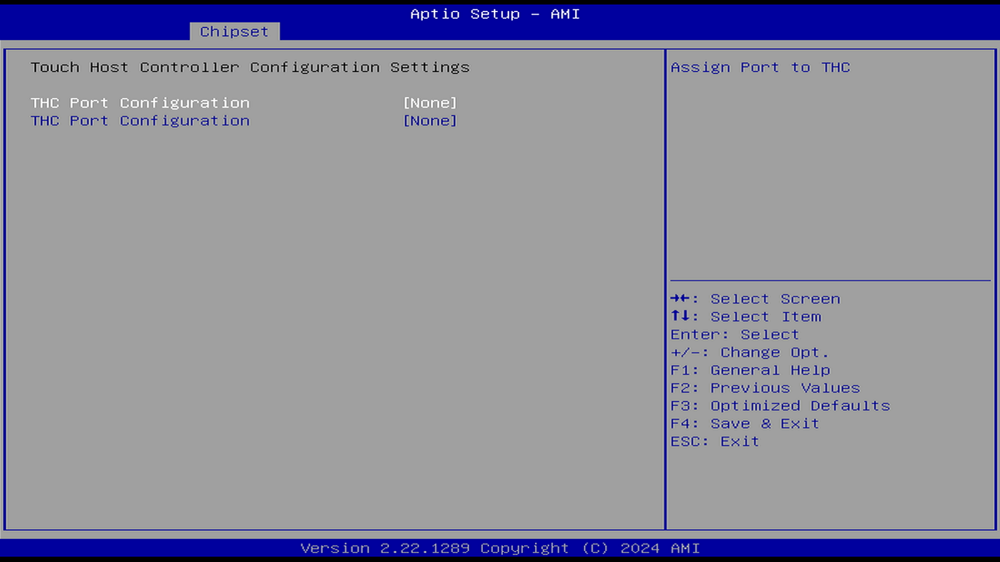

#### THC Port Configuration（触控主机控制器端口配置）

选项：

None（无）

THC0（触控主机控制器端口 0）

说明：

为触控主机控制器分配端口。

### SerialIo Configuration（串行 IO 配置）

#### I2C3 Controller（I²C3 控制器）

选项：

Enabled（启用）

Disabled（禁用）

说明：

以下设备相互依赖：I2C0 和 I2C1-2-3。用于连接低速外围设备。

控制 I²C3 总线开关。触摸屏、触摸板、RTC 等可能会用到。

#### SPI1 Controller（SPI1 控制器）

选项：

Enabled（启用）

Disabled（禁用）

说明：

以下设备相互依赖：UART0、UART1 和 SPI0-1

控制 SPI1 总线开关。用于连接高速外围设备。

#### SPI2 Controller（SPI2 控制器）

选项：

Enabled（启用）

Disabled（禁用）

说明：

依赖于：PCI 模式下的热管理子系统。如果启用了 PSE SPI0、PWM 或 TGPIO，则 SPI2 将被禁用。

控制 SPI2 总线开关。

用于连接高速外围设备。

#### UART0 Controller（串口 0 控制器）

选项：

Enabled（启用）

Disabled（禁用）

说明：

控制串口 0 开关。

以下设备相互依赖：UART0、UART1 和 SPI0-1

当以下情况出现时，UART0（00:30:00）无法被禁用：子设备被启用，例如 CNVi 蓝牙（\_SB.PC00.UA00.BTH0）

当以下情况出现时，UART0（00:30:00）无法被启用：启用了 I²S 音频编解码器（\_SB.PC00.I2C0.HDAC）

#### UART1 Controller（串口 1 控制器）

选项：

Enabled（启用）

Disabled（禁用）

Comm. Port (COM)

说明：

用于与外部设备进行串行通信。

以下设备相互依赖：UART0、UART1 和 SPI0-1

#### GPIO IRQ Route（GPIO 中断路由）

选项：

IRQ14

IRQ15

说明：

将所有 GPIO 路由到一个中断。

#### Serial IO I2Cx Settings（串行 IO I²Cx 设置）

查看 I²Cx 设置。

#### Serial IO SPIx Settings（串行 IO SPIx 设置）

查看 SPIx 设置。

#### Serial IO UARTx Settings（串行 IO 串口 x 设置）

查看串口 x 设置。

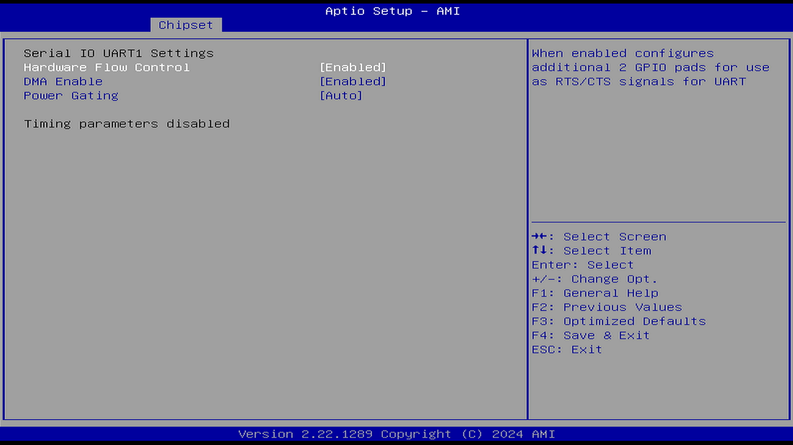

##### Hardware Flow Control（硬件流控）

选项：

Enabled（启用）

Disabled（禁用）

说明：

启用后，将额外配置两个 GPIO 引脚，用作 UART 的 RTS/CTS 信号支持 UART 硬件流控。流控本身可以控制数据传输的进度，进而防止数据丢失。

参见 [什么是硬件流控制](https://www.cnblogs.com/liyu925/p/4671911.html)

##### DMA Enable（启用 DMA）

选项：

Enabled（启用）

Disabled（禁用）

说明：

启用：操作系统的 UART 驱动将在可能的情况下使用 DMA。

禁用：操作系统的 UART 驱动将强制使用 PIO 模式。

PIO，The Programmed Input/Output，编程输入/输出。关闭后由 PIO 设计实例执行从主机处理器到目标器件的内存传输。

##### Power Gating（电源门控）

选项：

Enabled（启用）支持休眠/唤醒

Disabled（禁用）不节能，设备始终工作

Auto（自动）

说明：

禁用（Disabled）：不支持 \_PS0 / \_PS3，设备在初始化后会停留在 D0 状态。

启用（Enabled）：启用 \_PS0 和 \_PS3，用于支持将设备从复位状态中恢复。

自动（Auto）：如果设备在第一次电源门控（PG）之前就已初始化，通过 ACPI 自动检测 \_PS0 和 \_PS3。

如果设备已经被使用（通过 DBG2），则禁用电源门控（PG）。

#### WITT/MITT I2C Test Device（WITT/MITT I²C 测试设备）

选项：

Enabled（启用）

Disabled（禁用）

说明：

启用 SIO（Super I/O，超级 I/O）I²C WITT 设备，并选择使用的控制器。

Windows I²C 测试工具（Windows I²C Test Tool，WITT）和多接口测试工具（Multi-Interface Test Tool，MITT）是一种测试工具，用于验证简单外围总线的硬件和软件。

#### WITT/MITT SPI Test Device（WITT/MITT SPI 测试设备）

选项：

Enabled（启用）

Disabled（禁用）

说明：

启用 SIO SPI WITT 设备，并选择使用哪个控制器。

#### UART Test Device（串口测试设备）

选项：

Enabled（启用）

Disabled（禁用）

说明：

启用 SIO UART 测试设备，并选择使用哪个控制器。

#### LPSS Device D3 State（LPSS 设备 D3 状态）

选项：

Enabled（启用）

Disabled（禁用）

说明：

操作系统启动前的 LPSS D3 状态（D3 是低功率设备的最低功率状态）。就是让该设备在 OS 启动前处于哪种子状态，影响其初始化与唤醒行为。

LPSS，Low Power Subsystem，低功率子系统。

参考文献：[设备低功率状态](https://learn.microsoft.com/zh-cn/windows-hardware/drivers/kernel/device-sleeping-states) [备份](https://web.archive.org/web/20260120155636/https://learn.microsoft.com/zh-cn/windows-hardware/drivers/kernel/device-sleeping-states)

#### Additional Serial IO devices（附加串行 IO 设备）

选项：

Enabled（启用）

Disabled（禁用）

说明：

启用后，ACPI 将报告连接到串行 IO 的附加设备。

启用该设置后，BIOS 会在操作系统启动之前将 LPSS（Serial IO）总线上的控制器（如 I²C、SPI、UART、GPIO 等）通过 ACPI 表（如 DSDT、SSDT）枚举并报告。这样操作系统在启动时能识别并管理这些设备。参见 [ACPI Specification 概述 (基于 ACPI_Spec_6_4_Jan22)](https://blog.csdn.net/anqi8955/article/details/120162679) [备份](https://web.archive.org/web/20260120205219/https://blog.csdn.net/anqi8955/article/details/120162679)

#### SerialIO timing parameters（串行 IO 时序参数）

选项：

Enabled（启用）

Disabled（禁用）

说明：

启用所有串行 IO 控制器的附加时序参数。每个控制器的默认值可在各自的设置中更改。更改此设置后需要重启才能生效。

### SCS Configuration（存储与通信子系统配置）

SCS：Storage and Communication Subsystem，存储与通信子系统。

#### eMMC 5.1 Controller（eMMC 5.1 控制器）

选项：

Enabled（启用）

Disabled（禁用）

说明：

控制 eMMC 5.1 控制器开关。

#### eMMC 5.1 HS400 Mode（eMMC 5.1 HS400 模式）

选项：

Enabled（启用）

Disabled（禁用）

说明：

控制 eMMC 5.1 HS400 模式（总线速度）开关。

HS400，是一种 eMMC 的 HS400 数据传输模式，为 eMMC 数据总线工作于双边采样 (DDR) 模式下的数据传输模式，带宽可达 400MB/s。

#### Enable HS400 software tuning（启用 HS400 软件调优）

选项：

Enabled（启用）

Disabled（禁用）

说明：

软件调优应提高 eMMC HS400 的稳定性，但会以增加启动时间为代价。

#### Driver Strength（驱动强度）

选项：

33

40

50

单位：欧姆 Ω

说明：

#### UFS 2.0 Controller 1（UFS 2.0 控制器 1）

选项：

Enabled（启用）

Disabled（禁用）

说明：

UFS，Universal Flash Storage，通用闪存存储。UFS 是一种存储标准。一般应用于嵌入式。

控制 UFS 2.0 控制器 1 开关。

#### SDCard 3.0 Controller（SD 卡 3.0 控制器）

选项：

Enabled（启用）

Disabled（禁用）

说明：

控制 SCS SDHC 3.0（UHS-I）控制器开关。传输速率最高可达 104 MB/s。

### ISH Configuration（整合传感器中枢配置）

ISH，Integrated Sensor Hub，整合传感器中枢。ISH 内置于 PCH 中，且依赖 PCI 总线。

参见 [Intel Integrated Sensor Hub](https://docs.kernel.org/hid/intel-ish-hid.html) [备份](https://web.archive.org/web/20260121095706/https://docs.kernel.org/hid/intel-ish-hid.html)、[ISH Micro-Controller](https://edc.intel.com/content/www/us/en/design/products/platforms/processor-and-core-i3-n-series-datasheet-volume-1-of-2/002/ish-micro-controller/)

ISH（集成传感器 Hub）由一个微控制器驱动运行。

- 这个微控制器核心可以在本地完成对传感器数据的聚合与处理，  
  从而减轻主处理器负担，降低整个平台的平均功耗。
- 核心内部集成了一个本地 APIC（高级可编程中断控制器），  
  它可以从系统的 IOAPIC 接收消息（例如中断事件）。
- 此微控制器还包含一个本地启动 ROM（Boot ROM），  
  其中集成了用于初始化的固件（FW）。

传感器集线器（Sensor Hub）能将传感器轮询和算法处理的任务卸载给一个专用的低功耗协处理器。这能让核心处理器可以更频繁地进入低功耗模式，从而延长电池续航时间。

目前有许多厂商提供符合 HID Sensor 使用规范的外部传感器集线器。这些设备常见于平板电脑、二合一可转换笔记本电脑以及嵌入式产品中。

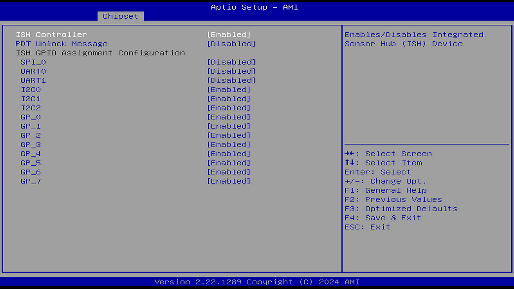

#### ISH Controller（整合传感器中枢控制器）

选项：

Enabled（启用）

Disabled（禁用）

说明：

控制整合传感器中枢控制器（ISH）设备开关。

#### PDT Unlock Message（解锁 PDT 消息）

选项：

Enabled（启用）

Disabled（禁用）

说明：

启用 \= 向 ISH 发送 PDT 解锁消息。

消息发送后，该字段会自动恢复为禁用状态。

作用未知。

#### SPI_0

选项：

Enabled（启用）

Disabled（禁用）

说明：

引脚配置说明

Enabled（启用）：表示该引脚被配置为 ISH 的原生功能。

Enabled（启用）呈灰色：表示存在冲突，例如另一个 Serial IO 控制器占用了该引脚。必须禁用该控制器才能配置此引脚为 ISH 功能。

| ISH 功能  | 与其共享的设备接口 | 适用芯片组     |
| --------- | ------------------ | -------------- |
| ISH UART0 | LPSS I2C2          | PCH-H          |
| ISH UART1 | LPSS UART1         | 不区分         |
| ISH I2C2  | LPSS I2C5 或 I2C3  | PCH-LP / PCH-H |

为了防止引脚冲突让用户手动决定引脚由 ISH 使用还是由其他低功耗控制器（如 I2C、UART）使用。

#### UART0

同上

#### UART1

同上

#### I2C0

同上

#### I2C1

同上

#### I2C2

同上

#### GP_0

GP，GPIO

同上

#### GP_1

同上

#### GP_2

同上

#### GP_3

同上

#### GP_4

同上

#### GP_5

同上

#### GP_6

同上

#### GP_7

同上

### Pch Thermal Throttling（PCH 热容忍）

PCH 热容忍控制。

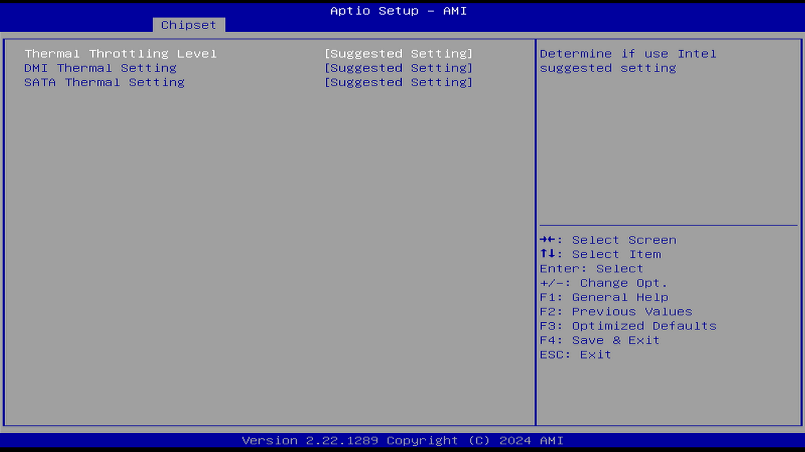

#### Thermal Throttling Level（热容忍级别）

选项：

Suggested Setting（推荐设置）

Manual（手动）

说明：

以下选项仅当本项选择 Manual（手动）才会出现。

##### Thermal Throttling（热节流）

选项：

Enabled（启用）

Disabled（禁用）

说明：

控制热节流开关。

##### TT Status 13（同步电源管理状态 13）

选项：

Enabled（启用）

Disabled（禁用）

说明：

PM Sync 状态 13 将强制系统至少进入 T2 状态。

PM Sync，Power Management Synchronization，同步电源管理。

##### Thermal Throttling Lock（热节流锁定）

选项：

Enabled（启用）

Disabled（禁用）

说明：

锁定整个热节流寄存器。

##### T0 Level（T0 级别）

如果温度触发点（Trip Point Temperature）小于等于 T0 级别，系统处于 T0 状态。

##### T1 Level（T1 级别）

如果温度触发点（Trip Point Temperature）大于 T0 级别且小于等于 T1 级别，系统处于 T1 状态。

##### T2 Level（T2 级别）

如果温度触发点（Trip Point Temperature）大于 T1 级别且小于等于 T2 级别，系统处于 T2 状态。

#### DMI Thermal Settings（DMI 热管理设置）

选项：

Suggested Setting（推荐设置）

Manual（手动）

说明：

以下选项仅当本项选择 Manual（手动）才会出现。

##### DMI Thermal Sensor Autonomous Width（DMI 热传感器自动数据链路宽度协商）

选项：

Enabled（启用）

Disabled（禁用）

说明：

启用／禁用由热传感器发起的自动数据链路宽度协商，即 DMI 热传感器自动数据链路宽度调整功能。

##### Thermal Sensor 0 Width（热传感器 0 数据链路宽度）

选项：

x1

x2

x4

x8

x16

说明：

当热传感器的输出为 T0 时，确定 DMI 链路宽度。

##### Thermal Sensor 1 Width（热传感器 1 数据链路宽度）

同上。

##### Thermal Sensor 2 Width（热传感器 2 数据链路宽度）

同上。

##### Thermal Sensor 3 Width（热传感器 3 数据链路宽度）

同上。

#### SATA Thermal Setting（SATA 热管理设置）

选项：

Suggested Setting（推荐设置）

Manual（手动）

说明：

SATA 控制器的热节流配置，包括控制器 1-3。

以下选项仅当本项选择 Manual（手动）才会出现。

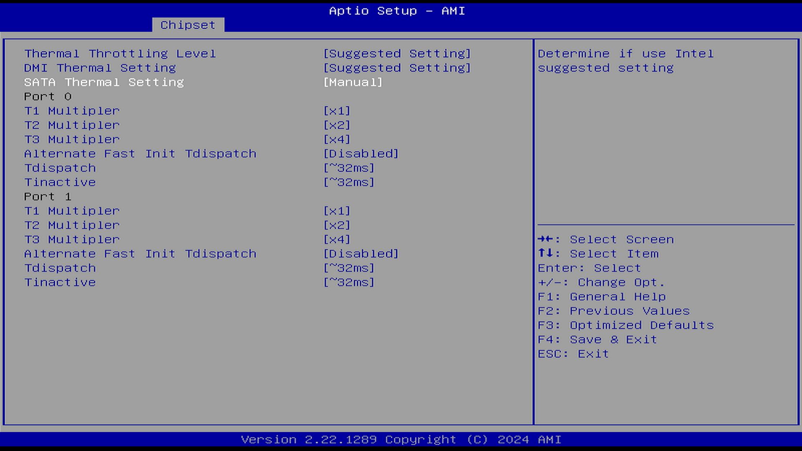

##### T1 Multiplier（T1 端口复用器）

选项：

x1

x2

x4

Disabled（禁用）

说明：

配置 SATA 端口 T1 Multiplier 值。Multiplier，SATA 端口复用器，使多路 SATA 设备能够连接到一个 SATA 主端口上。

##### T2 Multiplier（T2 端口复用器）

同上。

##### T3 Multiplier（T3 端口复用器）

同上。

##### Alternate Fast Init Tdispatch（SATA 端口备用快速初始化）

选项：

Enabled（启用）

Disabled（禁用）

说明：

打开或关闭 SATA 端口备用快速初始化。

作用未知。

##### Tdispatch（SATA 端口备用快速初始化值）

选项：

~32ms

~128ms

~8ms

说明：

设置 SATA 端口备用快速初始化值。

作用未知。

##### Tinactive（SATA 端口 Tinactive 的值）

选项：

- ~32ms
- ~128ms
- ~8ms

说明：

设置 SATA 端口 Tinactive 的值。

作用未知。

### Skip VCC_AUX Configuration（跳过 VCC_AUX 辅助电源轨配置）

选项：

Enabled（启用）

Disabled（禁用）

说明：

VCC_AUX 为辅助电源轨，用于为 FPGA 内部的各种逻辑资源模块提供电源。

参见 [Cyclone® V SoC 设备中使用的 VCC_AUX 和 VCC_AUX_SHARED 电源轨是什么？](https://www.intel.cn/content/www/cn/zh/support/programmable/articles/000086743.html) [备份](https://web.archive.org/web/20260121095128/https://community.altera.com/kb/knowledge-base/what-are-vcc-aux-and-vcc-aux-shared-power-rail-in-cyclone%c2%ae-v-soc-device-used-for/345582)

作用未知。

### FIVR Configuration（全集成电压调节模块配置）

FIVR，Fully Integrated Voltage Regulator，全集成电压调节模块。

处理器集成了多个电压轨，以降低平台的物料清单（BOM）成本，让主板设计变简单，减少了主板上的元器件。并支持处理器可以利用的额外电压级功能。

PCH 上集成了 FIVR，包括 VNN、V1P05 等电压轨，这些电压由 VCCIN_Aux 提供电源。VCCIN_Aux 还为 CPU 内的 VCCSA 电压轨供电。除了 VCCSA 的 FIVR 外，计算芯片（compute die）还集成了另外 4 个 FIVR，分别为 VCCCORE、VCCSA、VCCL2、VCCGT 和 VCCRING 供电，这些电压均从平台上的 VCCIN VR 衍生而来。每个 FIVR 都能控制特定的电压轨。

参见 [Fully Integrated Voltage Regulator (FIVR)](https://edc.intel.com/content/www/us/en/design/ipla/software-development-platforms/servers/platforms/intel-pentium-silver-and-intel-celeron-processors-datasheet-volume-1-of-2/fully-integrated-voltage-regulator-fivr/) [备份](https://web.archive.org/web/20260119182351/https://edc.intel.com/content/www/us/en/design/ipla/software-development-platforms/servers/platforms/intel-pentium-silver-and-intel-celeron-processors-datasheet-volume-1-of-2/fully-integrated-voltage-regulator-fivr/)

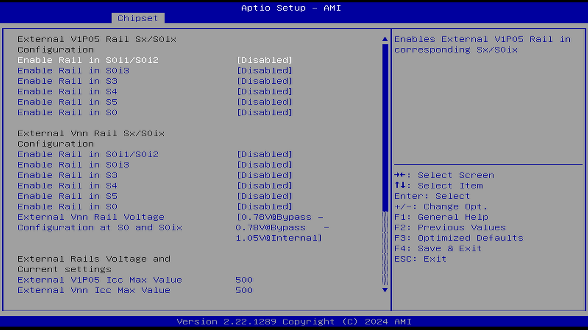

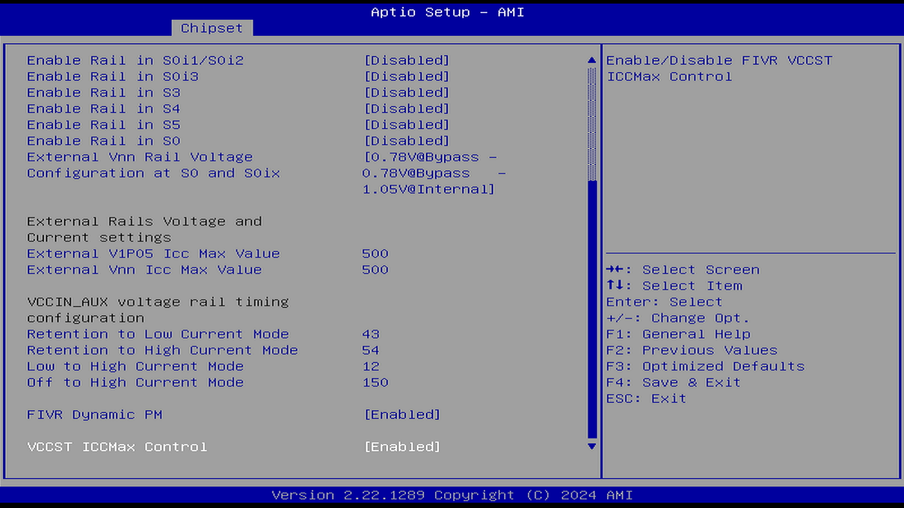

#### External V1P05 Rail S×/S0ix Configuration（外部 V1P05 电压轨 S×/S0ix 配置）

V1P05，VCCRAM，属于外部旁路电压轨。

##### Enable Rail in S0i1/S0i2（启用 S0i1/S0i2 状态下的外部电压轨）

选项：

Enabled（启用）

Disabled（禁用）

说明：

启用与对应的 S×/S0ix 状态相关的外部 V1P05 电压轨。S0ix 即现代待机。

##### Enable Rail in S0i3（启用 S0i3 状态下的电压轨）

同上。

##### Enable Rail in S3（启用 S3 状态下的电压轨）

同上。

##### Enable Rail in S4（启用 S4 状态下的电压轨）

同上。

##### Enable Rail in S5（启用 S5 状态下的电压轨）

同上。

##### Enable Rail in S0（启用 S0 状态下的电压轨）

同上。

#### External Vnn Rail S×/S0ix Configuration（外部 Vnn 电压轨 S×/S0ix 配置）

重复选项忽略。

##### External Vnn Rail Voltage Configuration at S0 and S0ix（外部 Vnn 电压轨在 S0 和 S0ix 状态下的电压配置）

选项：

- 0.78V@Bypass - 0.78V@Bypass - 1.05V@Internal

- 1.05V@Bypass - 1.05V@Bypass - 1.05V@Internal

说明：

为外部电压轨配置 TARGET_VOLT_LEVEL。

作用未知。

#### External Rails Voltage and Current Settings（外部电压轨的电压与电流设置）

##### External V1P05 Icc Max Value（外部 V1P05 ICC 最大值）

外部 V1P05 电压轨的 ICC（静态供电电流）最大值，单位为毫安（mA）。接受的取值范围为 0 到 500 mA。

##### External Vnn Icc Max Value（外部 Vnn ICC 最大值）

外部 Vnn 电压轨的 ICC（静态供电电流）最大值，单位为毫安（mA）。接受的取值范围为 0 到 500 mA。

#### VCC_AUX Voltage rail timing configuration（VCC_AUX 电压轨的时序配置）

指定 VCCAUX 电源轨的电压。有关当前器件系列的详细信息，请参阅该器件的数据手册。

参见 [Altera® Quartus® Prime Standard Edition Settings File Reference Manual](https://www.intel.com/content/www/us/en/docs/programmable/683084/current/vccaux-user-voltage.html) [备份](https://web.archive.org/web/20260119061631/https://docs.altera.com/)

##### Retention to Low Current Mode（Retention 从关闭状态到低功耗模式的时间）

Retention（保留）寄存器是一种低功耗设计技术。

Retention 至低功耗模式的过渡说明如下。

从关闭状态（0V）过渡到高电流模式电压的时间，单位为微秒（μs）。该字段的步进为 1 微秒。

##### Retention to High Current Mode（Retention 到高功耗模式的时间）

从保持模式电压（Retention Mode Voltage）过渡到高电流模式电压（High Current Mode Voltage）的时间，单位为微秒（μs）。

该字段的步进为 1 微秒。

##### Low to High Current Mode（从低功耗到高功耗模式的时间）

从低电流模式电压（Low Current Mode Voltage）过渡到高电流模式电压（High Current Mode Voltage）的时间，单位为微秒（μs）。

该字段的步进为 1 微秒。

##### Off to High Current Mode（从关闭状态到高电流模式电压的时间）

从关闭状态（0V）过渡到高电流模式电压的时间，单位为微秒（μs）。

该字段的步进为 1 微秒。

值为 0 表示禁止过渡到 0V。该数值必须大于或等于 VccST 板上 FET 的上升时间（FET ramp time）。

#### FIVR Dynamic PM（FIVR 动态功率管理器）

选项：

Enabled（启用）

Disabled（禁用）

说明：

FIVR Dynamic PM，Fully Integrated Voltage Regulators Dynamic Power Management，FIVR 动态功率管理器

利用 FIVR 内部机制（AVS、DVFS、各轨电流监控等）对系统各个电压轨进行精细控制和快速切换。

#### VCCST ICCMax Control（FIVR VCCST 最大 ICC 控制）

选项：

Enabled（启用）

Disabled（禁用）

说明：

VCCST Voltage：信号维持电压。

控制 CPU 待机电压轨的最大电流上限设置。

### PMC Configuration（电源管理控制器配置）

PMC，Power Management Controller，电源管理控制器。

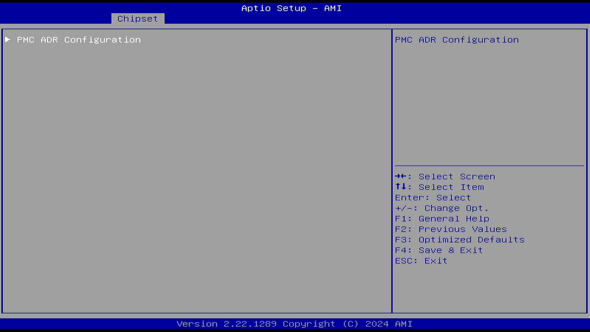

#### PMC ADR Configuration（电源管理控制器 ADR 控制）

异步内存刷新（ADR）功能提供了一种机制，在即将发生全局重置或交流电源故障的情况下，能够在非易失性内存配置中，保护易失性内存子系统中的关键数据。

进入 ADR 状态会强制将特定 ADR 保护的 CPU 内部“写缓冲区”中的数据刷新出去。任何不在这些被 ADR 保护的缓冲区中的写入数据（概念上称为“ADR 保护缓冲区”）在重置或断电时都会丢失。

CPLD（复杂可编程逻辑器件）必须能够检测交流电源故障或即将发生的全局重置，并向 PCH 断言 ADR_TRIGGER 信号。

当 PCH 检测到 ADR_TRIGGER 被断言时，会通过 PM_SYNC 链路通知 CPU，并启动 ADR 计时器。

一旦 CPU 收到通知，就会将 ADR 保护写缓冲区中的数据刷新出去。  

当 ADR 计时器超时后，PCH 会断言 ADR_COMPLETE 信号，从而触发 NVDIMM 上的 SAVE 引脚。

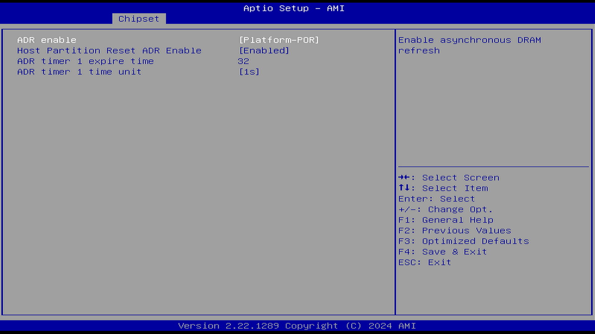

##### ADR enable（启用 ADR）

选项：

Platform-PDR（平台预设）

Enabled（启用）

Disabled（禁用）

说明：

控制异步内存刷新开关。ADR，Asynchronous DRAM Refresh，异步内存刷新。参见“计算机组成原理”相关书籍。

##### Host Partition Reset ADR Enable（发生 Host 分区复位时触发 ADR）

选项：

Platform-PDR（平台预设）

Enabled（启用）

Disabled（禁用）

说明：

该功能的具体作用尚不明确。

##### ADR timer 1 expire time（ADR 定时器 1 到期时间）

输入期望的 ADR 定时器到期时间，有效取值范围为 1 到 256。输入的时间将根据 ADR 定时器的时间单位进行缩放。

##### ADR timer 2 time unit（ADR 定时器 2 时间单元）

选项：

[1us]  
[10us]  
[100us]  
[1ms]  
[10ms]  
[100ms]  
[1s]  
[10s]

说明：

功能未知

### PCH Lan controller（PCH 局域网控制器）

选项：

Enabled（启用）

Disabled（禁用）

说明：

控制内置网卡开关。

以下项目仅在你将 PCH LAN 控制器设置为 [启用] 时才会显示。

#### LAN Wake From DeepSx（通过网络从 DeepSx 唤醒）

选项：

Enabled（启用）

Disabled（禁用）

说明：

DeepSx 表示深度睡眠模式。

通过网络从 DeepSx 唤醒功能。

#### Wake on LAN Enable（启用 WoL）

参见 WoL（网络唤醒）。

#### SLP_LAN# Low on DC Power（在低直流电力状态下的 SLP_LAN# 功能）

选项：

Enabled（启用）

Disabled（禁用）

说明：

此项目可让你启用或关闭在低直流电力状态下的 SLP_LAN# 功能。SLP_LAN# 信号为低（低电平拉低）时，将关闭网卡的物理电源轨，减少功耗。

### Sensor Hub Type（传感器中枢类型）

选项：

None（无）

I2C

USB

说明：

选择“None”将隐藏“I2C Sensor Hub”设置选项；

选择“I2C”将隐藏“ALS”设置选项；

选择“USB”将同时隐藏“I2C”和“ALS”两个设置选项。

### DeepSx Power Policies（深度睡眠电源策略）

选项：

Disabled（禁用）

Enable in S4-S5-Battery（在 S4–S5 电池模式下启用）

Enable in S5-Battery（在 S5 电池模式下启用）

Enable in S4-S5（在 S4–S5 状态下启用）

Enable in S5（在 S5 状态下启用）

说明：

配置深度睡眠模式，若启用设备会自动切换到空闲状态，这是一种功耗最低的模式。

某些功能（例如 Wake on LAN）由于需要设备某些部分保持活动，因此在此状态下将不再可用。

### Wake on WLAN and BT Enable（启用无线局域网和蓝牙唤醒）

参见 WoL（网络唤醒）。

### Disable DSX ACPRESENT PullDown（在退出 DeepSx 或 G3 状态时，禁用 PCH 内部的 ACPRESENT 下拉电阻）

选项：

Enabled（启用）

Disabled（禁用）

说明：

在退出 DeepSx 或 G3 状态时，禁用 PCH 内部的 ACPRESENT 下拉电阻。这意味着在系统从深度睡眠（DeepSx）或完全关机（G3）状态恢复时，PCH 不会主动拉低 ACPRESENT 信号线（桥的适配器检测信号）。

启用此选项可能会导致某些功能（例如 Wake on LAN）在系统处于低功耗状态时无法正常工作。

### Port 80h Redirection（端口 80h 重定向）

选项：

LPC Bus

PCIE Bus

说明：

LPC，Low Pin Count，英特尔低引脚数总线。

控制 Port 80h 的周期发送位置。用于调试。

### Enhance Port 80h LPC Decoding（增强端口 80h LPC 解码）

选项：

Enabled（启用）

Disabled（禁用）

说明：

增强 Port 80h 的 LPC 解码功能：支持 LPC 总线后端对 Port 80h 的字（word）/双字（dword）解码。调试用，可支持更多调试硬件。

### Compatible Revision ID（CRID 兼容版本 ID）

选项：

Enabled（启用）

Disabled（禁用）

说明：

Compatible Revision ID，CRID：兼容版本 ID。RID 寄存器的默认上电值为 SRID。该值根据产品的版本（stepping）进行分配。

### Legacy IO Low Latency（传统 IO 低延迟）

选项：

Enabled（启用）

Disabled（禁用）

说明：

设置以启用传统 IO 的低延迟。某些系统无论功耗如何都需要更低的 IO 延迟。这是在功耗与 IO 延迟之间的权衡。

有资料表明，启用该选项在部分场景下可能改善游戏体验。

### PCH Cross Throttling（PCH 交叉节流）

选项：

Enabled（启用）

Disabled（禁用）

说明：

只有 UTL 支持此功能。UTL 是什么未知。

为了防止过热，对 PCH 功率进行节流管理。

PCH 交叉节流可能导致总线和外设性能受限，影响实时任务的执行。禁用后避免总线带宽受限，确保实时任务对总线和外设的访问效率。

用于控制系统中多个设备共享 PCIe 根节点时的带宽分配。当多个设备同时向根节点发送数据时，PCH Cross Throttling 可通过降低单个设备的带宽，保证整体带宽的均衡分配，避免某一设备过度占用带宽。

参见 [【实时性】实时性优化的一些参数设置和心得](https://blog.csdn.net/qq_31985307/article/details/130791459)、[【原创】有利于提高 xenomai /PREEMPT-RT 实时性的一些配置建议](https://www.cnblogs.com/wsg1100/p/12730720.html) [备份](https://web.archive.org/web/20260120204504/https://www.cnblogs.com/wsg1100/p/12730720.html)

### PCH Energy Reporting（PCH 能耗报告）

选项：

Enabled（启用）

Disabled（禁用）

说明：

用于监测能耗的 PCH 能耗报告功能。

启用能耗报告。BIOS 提示必须设置为启用。此选项仅供测试用途。

### LPM S0i2.0（链路低功耗状态 S0i2.0）

选项：

Enabled（启用）

Disabled（禁用）

启用／禁用 S0ix 子状态。

此设置仅用于测试目的。

在量产环境中应启用 S0ix 子状态。

### LPM S0i3.0（链路低功耗状态 S0i3.0）

同上。

### C10 Dynamic threshold adjustment（C10 动态阈值调整）

选项：

Enabled（启用）

Disabled（禁用）

说明：

与 C10 低功耗状态相关。

### IEH Mode（隔离执行加固模式）

选项：

Bypass Mode（旁路模式）

Disabled（禁用）

说明：

IEH，Isolated Execution Hardening，隔离执行加固。

IEH 模式，可提升系统安全性。

### Enable TC0 Timer（启用 TC0 计时器）

选项：

Enabled（启用）

Disabled（禁用）

说明：

启用或禁用 TCO 计时器。禁用时，将关闭 PCH ACPI 计时器，停止 TCO 计时器，并且不会发布 ACPI MDAT 表。

### Pcie PLL SSC（PCIe PLL 扩频时钟）

选项：

Auto（自动）

Disabled（禁用）

0.0%–2.0%，步进为 0.1%。

说明：

PCIe PLL 扩频百分比。AUTO —— 保持硬件默认值，不由 BIOS 覆盖。

该功能的具体作用尚不明确。

### IOAPIC 24-119 Entries（IOAPIC 24-119 条目）

选项：

Enabled（启用）

Disabled（禁用）

说明：

IRQ24–119 可能会被 PCH 设备使用。禁用这些中断可能会导致某些设备无法正常工作。

用于设置是否使用超过 24 个 IOAPIC 条目以确保兼容性。I/O APIC 包含一个重定向表，用于将来自外部总线的中断路由到一个或多个本地 APIC。控制 IOAPIC 24–119 项可扩展至 PIROI–PIROX 与否。

### Enable 8254 Clock Gate（启用 8254 时钟门控）

选项：

Enabled（启用）

Disabled（禁用）

说明：

在早期阶段启用／禁用 8254 时钟门控。启用 8254CGE（CGE，Clock Gating Enable，启用时钟门控）是支持 SLP_SO 所必需的。平台也可以在后期阶段禁用该策略并设置 8254CGE。

8254 是一种 PIT（Programmable Interval Timer，可编程定时器），它利用若干个寄存器来进行定时和计时的操作。GATE 门控信号实现定时控制与事件计数功能。

### Lock PCH Sideband Access（锁定 PCH 侧带访问）

选项：

Enabled（启用）

Disabled（禁用）

说明：

侧带信号用于处理器与 PCH 之间的通信。

锁定 PCH 侧带访问，包括特定端点（例如 PSFx）的侧带接口锁定和侧带 PortID 掩码。如果已设置 POSTBOOT SAI，则该选项无效。

### Flash Protection Range Registers (FPRR)（Flash 保护范围寄存器）

选项：

Enabled（启用）

Disabled（禁用）

说明：

BIOS 写保护机制，可防止恶意软件对 BIOS 进行直接篡改。通过 Flash 保护范围寄存器实现。

### SPD Write Disable（SPD 写保护）

选项：

True（启用）

False（禁用）

说明：

参见 [What is SPD?](https://www.lenovo.com/us/en/glossary/spd/) [备份](https://web.archive.org/web/20260119062204/https://www.lenovo.com/us/en/glossary/?cid=flash_redirect_2p3o1i)

BIOS 提示：出于安全考虑，必须设置 SPD 写保护位。

SPD 代表串行存在检测（Serial Presence Detect），是一种标准化的方法，用于访问计算机内存模块的信息。SPD 数据存储在内存上的 EEPROM 芯片中，允许系统 BIOS 读取内存的详细信息，如速度、容量和时序，从而确保内存的最佳性能和兼容性。

禁用该选项可能会影响 XMP（英特尔®至尊内存配置文件）设置，即内存超频功能。

### LGMR（LPC 内存范围解码）

选项：

Enabled（启用）

Disabled（禁用）

说明：

LGMR，LPC Memory Range Decode，LPC 内存范围解码

用于 LPC 内存范围解码的 64 KB 内存块。允许系统将 64KB 的内存块映射到 LPC 接口。用于调试。低针数总线（LPC）是一种传统总线，是为取代工业标准架构（ISA）总线而开发的。嵌入式控制器（EC）、基板管理控制器（BMC）和超级 I/O（SIO）是通过低针数总线（LPC）连接到芯片组的。

### HOST_C10 reporting to Target（向目标设备报告 HOST_C10）

选项：

Enabled（启用）

Disabled（禁用）

说明：

此选项用于启用通过 eSPI 虚拟线向目标设备报告 HOST_C10 状态。eSPI 是 Intel 推出的新一代总线接口，用于替代 LPC。

eSPI，Enhanced Serial Peripheral Interface，增强型串行外设接口

参见 [增强型串行外设接口（eSPI）接口基本规格（适用于客户端和服务器平台）](https://www.intel.cn/content/www/cn/zh/content-details/841685/enhanced-serial-peripheral-interface-espi-interface-base-specification-for-client-and-server-platforms.html) [备份](https://web.archive.org/web/20260119061912/https://www.intel.cn/content/www/cn/zh/content-details/841685/enhanced-serial-peripheral-interface-espi-interface-base-specification-for-client-and-server-platforms.html)

### OS IDLE Mode（系统待机状态）

选项：

Enabled（启用）

Disabled（禁用）

说明：

### S0ix Auto Demotion（S0ix 自动降级）

选项：

Enabled（启用）

Disabled（禁用）

说明：

主机在进入 S0ix 低功耗状态失败时，自动降级（Auto-Demotion）到较浅层低功耗状态（如 S0 Idle / S0i1 / S0i0 等）。

### Latch Events C10 Exit（退出 C10 状态时锁存事件）

选项：

Enabled（启用）

Disabled（禁用）

说明：

在退出 C10 状态时锁存事件。

该功能的具体作用尚不明确。

### Extend BIOS Range Decode（扩展 BIOS 解码范围）

选项：

Enabled（启用）

Disabled（禁用）

说明：

启用此项后，落入特定内存区域的内存周期（memory cycles）将被重定向到 SPI 闪存控制器。

作用未知。

### ACPI L6D PME Handling（ACPI 中 L6D（_L6D）PME 事件处理）

选项：

Enabled（启用）

Disabled（禁用）

说明：

BIOS 可以通过 ACPI 代码将特定方法关联到某个特定的 GPE。在本例中，\_L6D 是一个电平触发事件的方法。BIOS-ACPI 可以检查每个需要通过 GPE 唤醒的设备的 PMEENABLE 和 PMESTATUS。

作用未知。

### Beep On（蜂鸣器）

选项：

Enabled（启用）

Disabled（禁用）

说明：

用于启用或禁用蜂鸣器。

### PSE Configuration（可编程服务引擎配置）

PSE，Programmable Service Engine，可编程服务引擎。

参见 [借助英特尔的首个物联网增强型平台，推动性能、集成和多功能性](https://www.intel.cn/content/www/cn/zh/products/docs/processors/embedded/enhanced-for-iot-platform-brief.html)

英特尔 ® 可编程服务引擎是专为物联网功能打造的卸载引擎，采用了 ARM Cortex-M7 微控制器。该引擎可为物联网应用程序提供独立的低 DMIPS 计算和低速输入/输出，还能为实时计算和时间敏感型同步提供专门服务。

英特尔 ® 可编程服务引擎配备了新的功能，如远程带外设备管理、网络代理、嵌入式控制器精简版和传感器控制中心。通过开源代码或预置固件二进制，可以使用灵活的编程方式对其进行配置，从而满足应用需求，并运行基于 ARM 的实时应用程序。

#### PSE Controller（可编程服务引擎控制器）

选项：

Enabled（启用）

Disabled（禁用）

说明：

启用或禁用英特尔 ® 可编程服务引擎（PSE）。启用后，将显示以下菜单项。

##### LOG OUTPUT OFFSET（日志输出偏移）

确定内存中 PSE 日志输出区域的偏移量。

##### LOG OUTPUT SIZE（日志输出大小）

确定内存中 PSE 日志输出区域的大小限制。

##### Shell (PSE Shell)

选项：

Enabled（启用）

Disabled（禁用）

说明：

PSE Shell

##### Eclite

选项：

Enabled（启用）

Disabled（禁用）

说明：

PSE Eclite 服务。嵌入式控制器替代方案。参见 [Intel ISHTP eclite controller Driver](https://www.kernelconfig.io/config_intel_ishtp_eclite) [备份](https://web.archive.org/web/20260119062118/https://www.kernelconfig.io/config_intel_ishtp_eclite)

用于访问 PSE（可编程服务引擎）——一种类似嵌入式控制器的 IP，通过 ISHTP（集成传感器集线器传输协议）从平台获取电池、温度和 UCSI（USB Type-C 连接器系统软件接口）相关数据。

对于不想在英特尔 Elkhart Lake 平台（J/N 系列 ATOM E 系列）上使用独立嵌入式控制器的用户，可以利用作为 PSE 子系统一部分的集成解决方案 ECLite。

##### CPU Temp Read（CPU 温度读取）

选项：

Enabled（启用）

Disabled（禁用）

说明：

PSE Eclite CPU 温度读取。

##### OOB（远程带外管理）

PSE OOB 服务。专为物联网（IoT）和嵌入式应用设计。

选项：

Enabled（启用）

Disabled（禁用）

说明：

OOB，Remote Out-of-Band，远程带外管理。

##### WoL（网络唤醒）

选项：

Enabled（启用）

Disabled（禁用）

说明：

PSE GBE Wake On Lan（WoL），PSE 千兆网网络唤醒。

##### PSE Debug (JTAG/SWD) Enable（启用 PSE JTAG/SWD 调试）

SWD（Serial Wire Debug，串行线调试）和 JTAG（Joint Test Action Group，联合测试工作组）是两种常用的调试接口协议。

选项：

Enabled（启用）

Disabled（禁用）

说明：

控制 PSE JTAG/SWD 调试开关。

##### PSE JTAG/SWD PIN MUX（PSE JTAG 引脚多路复用）

选项：

Enabled（启用）

Disabled（禁用）

说明：

控制 PSE JTAG 引脚多路复用（Pin Mux）。如果 Sci 引脚多路复用已启用，则不允许启用此项。

##### CAN0（CAN0 总线）

选项：

None（无）

PSE owned（PSE 所有权）

Host owned（主机所有权）

说明：

CAN0 与 I²S0 及 TGPIO 16-17 存在引脚冲突。控制 CAN0 总线的所有权。

##### CAN1（CAN1 总线）

选项：

None（无）

PSE owned（PSE 所有权）

Host owned（主机所有权）

说明：

CAN1 与 I²S0 以及 TGPIO 14–15 存在引脚冲突，用于控制 CAN1 总线的所有权。

##### DMA0（DMA0 通道）

选项：

None（无）

PSE owned（PSE 所有权）

Host owned（主机所有权）

说明：

选择 DMA0 的所有权。

##### DMA1（DMA1 通道）

选项：

None（无）

PSE owned（PSE 所有权）

Host owned（主机所有权）

说明：

选择 DMA1 的所有权。

##### DMA2（DMA2 通道）

None（无）

PSE owned（PSE 所有权）

Host owned（主机所有权）

说明：

选择 DMA2 的所有权。

##### GBE0（GBE 0 千兆网）

选项：

None（无）

PSE owned（PSE 所有权）

Host owned（主机所有权）

说明：

选择 GBE0 的所有权。

##### PSE GBE0 DLL Override（PSE GBE0 DLL 覆盖）

选项：

Enabled（启用）

Disabled（禁用）

说明：

启用或禁用 PSE GBE0 的 DLL（Delay-Locked Loop，延迟锁相环）。启用此功能前，必须先启用 GBE0。

##### PSE GBE0 Tx_Delay（PSE GBE0 Tx 延时）

配置 DLL 从属模块中延迟元件的总数量。默认值为 16，最小值为 1，最大值为 63。

##### GBE2（GBE 2 千兆网）

选项：

None（无）

PSE owned（PSE 所有权）

Host owned（主机所有权）

说明：

选择 GBE2 的所有权。

##### PSE GBE1 DLL Override（PSE GBE1 DLL 覆盖）

选项：

Enabled（启用）

Disabled（禁用）

说明：

启用或禁用 PSE GBE1 的 DLL（延迟锁相环）。要启用此功能，必须先启用 GBE1 控制器。

##### PSE GBE1 Tx_Delay（PSE GBE1 Tx 延时）

配置 DLL 从属模块中延迟元件的总数量。默认值为 16，最小值为 1，最大值为 63。

##### GPIO/TGPIO 0 MUX SELECTION（GPIO/TGPIO 0 多路复用选择）

选项：

LOWER（低区段）

MID（中区段）

TOP（顶区段）

All GPIO（所有 GPIO）

说明：

TGPIO：Time-Aware GPIO，时间感知 GPIO。

Lower：TGPIO(0-19),GPIO(20-29)

Mid: TGPIO(0-9,20-29),GPIO(10-19)

Top：TGPIO(10-29) GPIO(0-9)

All：GPIO(0-29)

##### GPIO/TGPIO 0 Pin Selection（GPIO/TGPIO 0 引脚选择）

启用或禁用单个 GPIO/TGPIO 0 引脚。

##### GPIO/TGPIO 1 MUX SELECTION（GPIO/TGPIO 1 多路复用选择）

选项：

LOWER（低区段）

MID（中区段）

TOP（顶区段）

All GPIO（所有 GPIO）

说明：

Lower: TGPIO(30-49) GPIO(50-59)

Mid: TGPIO(30-39, 50-59) GPIO(40-49)

Top: TGPIO(40-59) GPIO(30-39)

All:GPIO(30-59)

##### GPIO/TGPIO 1 Pin Selection（GPIO/TGPIO 1 引脚选择）

启用或禁用单个 GPIO/TGPIO 1 引脚。

##### List of PSE peripherals that can generate interrupts（可以产生中断的 PSE 外设列表）

选项：

Enabled（启用）

Disabled（禁用）

说明：

为可以产生中断的 PSE 外设设置中断模式。

启用＝中断设置为 SB 模式；SB 模式（Sideband Mode）也称为传统的 INTx 中断，该方式存在中断线数量有限、共享资源等限制。

禁用＝使用 MSI 模式；MSI 模式（Message Signaled Interrupts，消息信号中断）引入于 PCI 2.2 规范，支持更高效的中断处理。

##### DMA Test（DMA 测试）

选项：

Enabled（启用）

Disabled（禁用）

说明：

DMA 测试设备。

### TSN GBE Configuration（时间敏感网络千兆以太网配置）

TSN：Time Sensitive Network，时间敏感网络

GBE：Gigabit Ethernet，千兆以太网

#### PCH TSN LAN Controller（平台控制器中枢的时间敏感网络局域网控制器）

选项：

Enabled（启用）

Disabled（禁用）

说明：

启用／禁用时间敏感局域网控制器。

#### PCH TSN GBE Multi-Vc（平台控制器中枢的时间敏感网络千兆以太网多虚拟通道）

选项：

Enabled（启用）

Disabled（禁用）

说明：

用于控制时间敏感网络的多虚拟通道功能。

#### PCH TSN GBE SGMII Support（平台控制器中枢的时间敏感网络千兆以太网 SGMII 模式支持）

选项：

Enabled（启用）

Disabled（禁用）

说明：

SGMII：Serial Gigabit Media Independent Interface，串行千兆媒体独立接口，可促进网络设备之间的高速通信。

为 PCH TSN GBE 启用／禁用 SGMII 模式。处于同一 PLL 公共通道上的 SGMII 模式端口必须使用相同的链路速度。如果 TSN 端口使用了相同的 PLL 公共通道，可能需要禁用 SATA 或 UFS。请确保 IFWI 为 SGMII 设置了正确的引导配置。确保 Flex IO 通道分配不为 NONE。

#### PCH TSN Link Speed（平台控制器中枢的时间敏感网络链接速率）

选项：

24MHz 2.5 Gbps

24MHz 1 Gbps

38.4MHz 2.5 Gbps

38.4MHz 1 Gbps

说明：

PCH TSN 链路速度配置

#### PCH TSN GBE x Multi-Vc（平台控制器中枢的时间敏感网络千兆以太网 x 的多虚拟通道）

选项：

Enabled（启用）

Disabled（禁用）

说明：

启用／禁用 TSN 多虚拟通道。TSN GBE x 必须归主机所有。

#### PCH TSN GBE x SGMII Support（平台控制器中枢的时间敏感网络千兆以太网 x 的 SGMII 模式支持）

选项：

Enabled（启用）

Disabled（禁用）

说明：

启用／禁用 PCH TSN GBE x 的 SGMII 模式。处于 SGMII 模式且使用同一 PLL 公共通道的端口必须使用相同的链路速率。由于该 TSN 端口使用相同的 PLL 公共通道，必须禁用 UFS。请确保 IFWI 已为 SGMII 正确设置了跳线。请确保 Flex IO 通道分配不为 NONE。

#### PCH TSN GBE x Link Speed（平台控制器中枢的时间敏感网络千兆以太网 x 的链路速率）

选项：

24MHz 2.5 Gbps

24MHz 1 Gbps

38.4MHz 2.5 Gbps

38.4MHz 1 Gbps

说明：

PCH TSN GBE x 链路速率配置

### PCIe Ref PLL SSC（PCIe 参考锁相环扩频百分比）

SSC：Spread Spectrum Clocking，扩频时钟

PLL：Phase Locked Loop，锁相环

### Flash Protection Range Registers（FPRR，闪存保护范围寄存器）

关闭后，可使用 FPT 工具直接修改 BIOS，无需使用编程器。

### PinCntrl Driver GPIO Scheme（引脚控制驱动 GPIO 方案）

功能未知。
