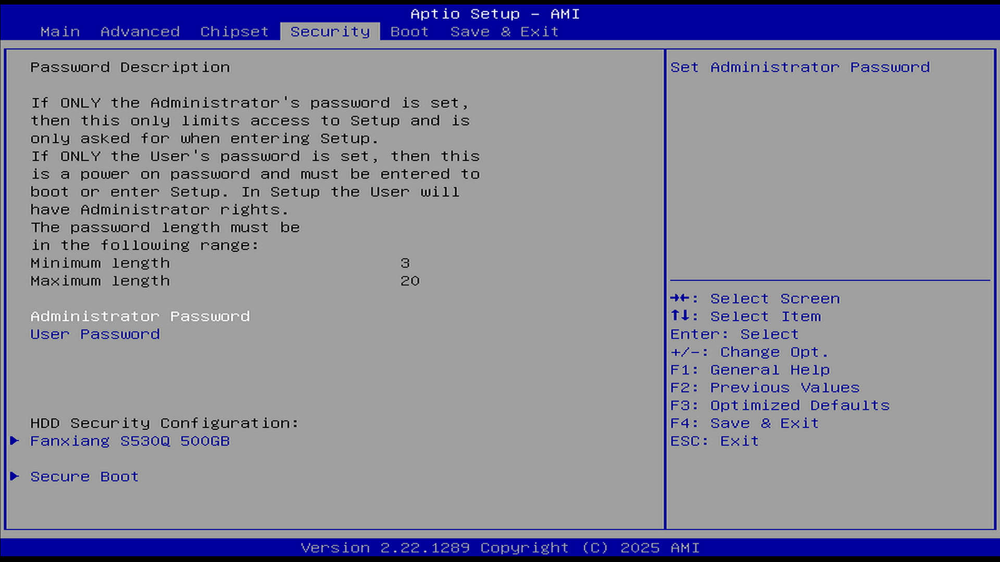

# Security（安全）

参见 [如何设置或解决忘记 BIOS 密码/UEFI 密码/开机密码](https://www.asus.com.cn/support/faq/1046347/)

BIOS (基本输入/输出系统) 密码是一种安全功能，用来阻止计算机启动时未经授权的访问。BIOS 密码也称为系统设置密码、UEFI 密码、开机密码、安全密码。

当设备启动时，它会提示用户输入 BIOS 密码，只有在输入正确的密码后，才能访问和修改 BIOS 设置，以及进入操作系统。这提供了一层额外的安全性，防止未经授权的人员更改硬件配置或启动过程。

密码说明（Password Description）：

若仅设置了管理员密码，则仅限定进入设置程序 (BIOS 或 UEFI)。你必须输入管理员密码才能读取和修改 BIOS 设置。

若仅设置了用户密码，则此为开机密码，并且需在开机进入 Windows 或进入 BIOS 时输入此密码。在 BIOS 设置中，使用者将拥有管理员权限。

如果你同时设置管理员密码和用户密码。当你进入 BIOS 设置时，你必须输入管理员密码才能读取和变更 BIOS 设置。若输入的是用户密码，你仅能浏览而不能修改 BIOS 设置。

只有当你的设备处于未设置 BIOS 密码的状态时，你才可以设置新的 BIOS 密码。

密码长度要求：

最短长度：3

最长长度：20

如果确认不再使用密码，请在 New Password (新密码) 的字段中保留空白（直接回车即可）。清除密码时，将会出现是否确定要清除密码的确认，请点击 Ok。

## Administrator Password（管理员密码）

设置管理员密码。

## User Password（用户密码）

设置用户密码。

## HDD Security Configuration（硬盘安全配置）

此选项只有在连接硬盘时，才会出现。此选项列出所有已连接的硬盘清单，并可针对选择的硬盘设定密码。若设置了 HDD 密码，启动设备或进入 BIOS 设置时，系统会要求输入 HDD 密码。只有在正确的密码输入后，硬盘才会解锁，允许设备正常启动或访问存储在硬盘上的数据。

注意：此硬盘锁是直接将密码写死在硬盘的固件区的。即使将硬盘拆走，接到另一个电脑上，硬盘也是不可能被识别出来的。

包括机械硬盘和固态硬盘。图中是固态硬盘。

HDD 密码说明：

可设置、修改和清除硬盘用户密码和主密码。

用户密码是启用硬盘安全功能的前提。

如果已设置主密码（可选），也可用其解锁硬盘。

| 项目                                | 状态                    |
| ----------------------------------- | ----------------------- |
| 支持安全功能（Security Supported）  | 是（Yes）               |
| 安全功能启用（Security Enabled）    | 否（No）                |
| 安全锁定（Security Locked）         | 否（No）                |
| 安全冻结（Security Frozen）         | 否（No）                |
| 用户密码状态（HDD User Pwd Status） | 未安装（NOT INSTALLED） |
| 主密码状态（HDD Master Pwd Status） | 已安装（INSTALLED）     |

设置硬盘密码后，建议重启系统以确保设置生效。

在 BIOS 中“放弃更改”或“保存更改”不会影响已设置或移除的硬盘密码。

如果“设置用户密码”（Set User Password）选项被隐藏，请重启系统以重新启用该选项。

若要清除硬盘密码，只需要将硬盘主密码的新密码设置为空（在输入密码的地方直接回车）。

## Secure Boot（安全启动）

配置安全启动参数。安全启动共有 4 种模式，Setup Mode、User Mode、Audit Mode、Deployed Mode。系统处于用户模式（User Mode）时，才能启用安全启动。

### Secure Boot（安全启动）

选项：

Enabled（启用）

Disabled（禁用）

说明：

对于非 Windows 操作系统（如 Linux、FreeBSD 等），通常需要关闭此项才能被引导。

当启用此项、平台密钥（Platform Key，PK）已注册且系统处于用户模式时，安全启动功能处于激活状态。更改模式需要重启。平台密钥（Platform key，PK）在平台的所有者和平台固件之间建立信任关系，平台所有者将密钥的一半注册到平台固件中

当未注册 PK 时，安全启动在 Setup Mode 模式下运行，在修改 PK、KEK、DB 和 DBX 变量时 BIOS 无需认证，此时通过编写 PK、KEK、DB 和 DBX 变量来配置安全启动策 略。BIOS 可工作在 Setup Mode 和 Audit Mode 模式，且从 Setup Mode 模式可以直接修改为 Audit Mode。

当注册了 PK 后，且 BIOS 在 User Mode 模式下运行时，User Mode 模式要求所有可执行文件在运行之前都要经过认证。此时 BIOS 可工作在 User Mode 和 Deployed Mode 模式下，且从 User Mode 模式可以直接修改为 Deployed Mode。

Audit Mode 是 Setup Mode 的一种延伸，Deployed Mode 是 User Mode 的一种延伸。Audit Mode 和 User Mode 都可以直接转换到 Deployed Mode，但 Deployed Mode 转换到其他安全模式需要删除 PK 或者是特定安全转换方法。

注意，如果安全启动默认为开启状态且无法关闭，你可能需要先设置一个 Administrator Password（管理员密码）/User Password（用户密码）才能对其进行关闭，你可以在关闭安全启动后再取消密码设置。同样的，如果无法开启安全启动，你可能也需要先行设置 Administrator Password（管理员密码）/User Password（用户密码）。

### Secure Boot Mode（安全启动模式）

选项：

Standard（标准）

Custom（自定义）

说明：

安全启动模式选择器

在自定义模式下，物理存在的用户可以在无需完全认证的情况下配置安全启动策略变量。在自定义模式下多种指令可以灵活使用。在自定义模式下更新 PK、KEK 变量不需要原始 PK 签署，且更新 Image signature database (db/dbx) 或 Authorized Timestamp Database (dbt) 也不需要 PK 或 KEK 的签署

标准模式：是 UEFI 规范描述的默认模式

### Restore Factory Keys（恢复出厂密钥）

选项：

Yes（是）

No（否）

说明：

强制系统进入用户模式。安装出厂默认的安全启动的密钥数据库。

### Reset To Setup Mode（重置为设置模式）

选项：

Yes（是）

No（否）
说明：

从 NVRAM（非易失性随机存取内存，BIOS/UEFI 固件设置通常存储在里面）删除所有安全启动密钥数据库

### Key management（密钥管理）

对安全启动的密钥进行管理，包括密钥的查看，添加，删除，授权和恢复出厂设置等操作

#### Factory Key Provision（下发出厂密钥）

选项：

Enabled（启用）

Disabled（禁用）

说明：

在平台重启后且系统处于设置模式时，安装出厂默认的安全启动密钥。

#### Restore Factory Keys（恢复出厂密钥）

选项：

Yes（是）

No（否）

说明：

强制系统进入用户模式。安装出厂默认的安全启动密钥数据库。

#### Reset To Setup Mode（重置为设置模式）

选项：
Yes（是）

No（否）

说明：

从 NVRAM 中删除所有安全启动的密钥数据库。

#### Enroll Efi Image（注册 EFI 映像）

文件系统映像

允许该镜像在安全启动模式下运行。将 PE 镜像的 SHA256 哈希证书注册到授权签名数据库（db）中。

#### Remove 'UEFI CA' from DB（从数据库中删除 UEFI CA）

对于已经启用 Device Guard（微软的一种增强系统安全的技术）的系统，授权签名数据库（db）中不应包含“Microsoft UEFI CA”证书。

#### Restore DB defaults（恢复默认数据库）

将授权签名数据库（DB）变量恢复到出厂默认值。

#### PK（平台密钥）

Set New Var：设置新变量

Append Key：追加密钥

注册出厂默认值或从文件加载证书：

1. 公钥证书格式包括：  
   a）EFI_SIGNATURE_LIST  
   b）EFI_CERT_X509（DER 编码）  
   c）EFI_CERT_RSA2048（二进制）  
   d）EFI_CERT_SHAxxx
2. 经过认证的 UEFI 变量
3. EFI PE/COFF 镜像（SHA256），密钥来源：出厂、外部、混合

#### Key Exchange Keys (密钥交换密钥）

同上。

#### Authorized Signatures（授权签名）

同上。

#### Forbidden Signatures（禁止签名）

同上。

#### Authorized Timestamps（授权时间戳）

同上。

#### OS Recovery Signatures（操作系统恢复签名）
