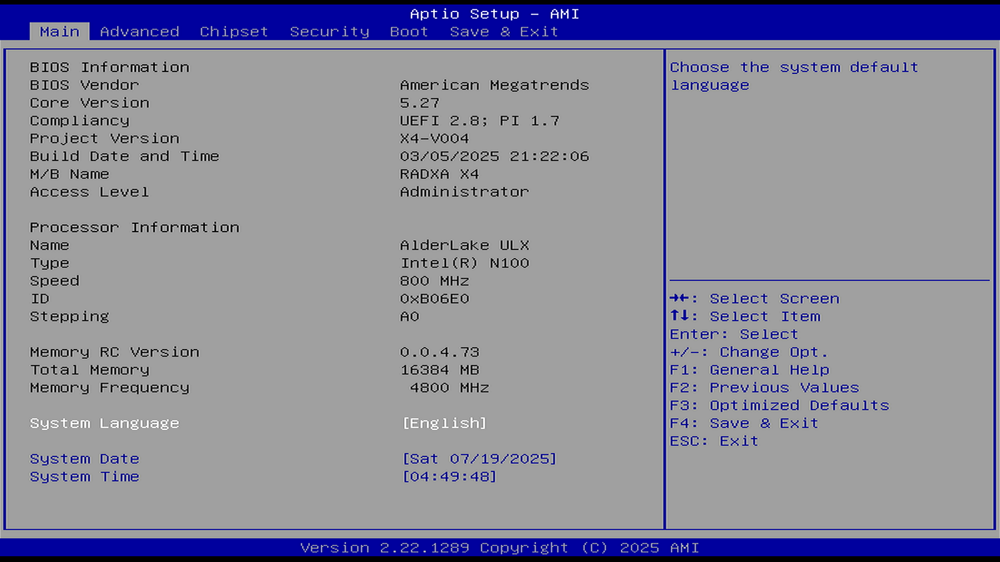

# Main 主菜单

BIOS 主菜单是 UEFI/BIOS 配置界面的入口和核心组织结构，提供系统硬件信息概览和基础配置的访问路径。

## 顶部标题

顶部标题区域位于 BIOS 界面顶部，显示 BIOS 固件的名称和版本信息，用于标识当前使用的 BIOS 类型，例如“Aptio Setup - AMI”（Aptio 设置 - AMI）。该区域帮助用户识别固件供应商和版本号，对于系统维护和故障排除至关重要。

## 菜单选项

菜单选项区域位于 BIOS 界面左侧或顶部，用户可通过键盘方向键在各选项之间切换。BIOS 主菜单包含以下主要功能选项，每个选项对应不同的配置页面：

| 英文菜单 | 中文翻译 |
| -------- | -------- |
| Main | 主菜单 |
| Advanced | 高级 |
| Chipset | 芯片组 |
| Security | 安全 |
| Boot | 启动 |
| Save & Exit | 保存并退出 |

## 主页面内容

主页面内容区域显示系统的核心硬件信息和基本配置选项，用户可在此区域查看 BIOS 版本、处理器信息、内存信息等关键参数。

### BIOS Information（BIOS 信息）

BIOS 信息子页面显示 BIOS 固件的详细属性，包括厂商、版本、兼容性等关键参数，帮助用户了解当前系统的固件版本和兼容性信息：

- BIOS Vendor（BIOS 厂商）: American Megatrends（安迈科技）
- Core Version（核心版本）: 5.27
- Compliancy（兼容性）: UEFI 2.8; PI 1.7
- Project Version（项目版本）: X4-V004
- Build Date and Time（构建日期和时间）: 03/05/2025 21:22:06（2025 年 03 月 05 日 21:22:06）
- M/B Name（主板名称）: RADXA X4
- Access Level（访问级别）: Administrator（管理员）

### Processor Information（处理器信息）

处理器信息子页面显示中央处理器的详细规格，包括名称、类型、频率、步进等关键参数。这些信息由 BIOS 通过 CPUID 指令从处理器内部寄存器读取，用于系统识别和配置处理器相关功能：

- Name（名称）: AlderLake ULX - 处理器微架构代号
- Type（类型）: Intel(R) N100 - 处理器型号
- Speed（频率）: 800 MHz - 当前运行频率（可能为节能状态下的低频）
- ID（编号）: 0xB06E0 - 处理器标识符
- Stepping（步进）: A0 - 处理器修订版本

步进（Stepping）是处理器制造过程中的版本标识，当制造工艺改进或功能修复时，会创建新的步进代码。Intel 处理器步进通常由“一位字母 + 一位数字”组成，字母越靠后、数字越大，通常表示步进版本越高，处理器相对较新。根据 [英特尔® 处理器 N100](https://www.intel.cn/content/www/cn/zh/products/sku/231803/intel-processor-n100-6m-cache-up-to-3-40-ghz/ordering.html) 的官方资料，其当前步进为“N0”（一般消费者获得的均为该步进）。但上图 BIOS 显示该 N100 处理器的步进为“A0”，这通常表明其为工程样片。

参考文献：

- 英特尔公司. 英特尔® 处理器步进意味着什么？[EB/OL]. [2024-01-15]. <https://www.intel.cn/content/www/cn/zh/support/articles/000057218/processors.html>.
- CPU“步进”介绍[EB/OL]. [2024-01-15]. <https://iknow.lenovo.com.cn/detail/320528>.

### Memory Information（内存信息）

内存信息子页面显示系统内存的配置情况，包括版本、总容量、运行频率等参数：

- Memory RC Version（内存 RC 版本）: 0.0.4.73
- Total Memory（总内存）: 16384 MB
- Memory Frequency（内存频率）: 4800 MHz

### Language and Time（语言与时间）

语言与时间子页面用于配置系统的语言偏好、日期和时间设置。这些设置存储在 CMOS/NVRAM 中，由实时时钟（RTC）芯片维持。系统日期和时间是操作系统时间的基础，许多应用程序和系统服务依赖准确的时间信息：

- System Language（系统语言）: [English]（[英语]）- 控制 BIOS 界面显示语言
- System Date（系统日期）: [Sat 07/19/2025]（[2025 年 07 月 19 日 星期六]）- 系统当前日期
- System Time（系统时间）: [04:49:48] - 系统当前时间

## 右侧帮助信息

右侧帮助信息区域显示当前选中菜单项的详细说明，帮助用户理解各项功能的作用和配置方法：

Choose the system default language（选择系统默认语言）

## 键盘帮助（底部右侧）

底部右侧的键盘帮助区域列出 BIOS 界面中常用的操作快捷键，帮助用户快速导航和操作 BIOS 界面：

- →↑↓←: Select Screen / Item

  →↑↓←：选择页面 / 项目

- Enter: Select

  Enter：选择

- +/-: Change Opt.

  +/-：更改选项

- F1: General Help

  F1：常规帮助

- F2: Previous Values

  F2：上一次的值

- F3: Optimized Defaults

  F3：加载优化默认值

- F4: Save & Exit

  F4：保存并退出

- ESC: Exit

  ESC：退出

- K/k：对右上角的提示内容向上翻页
- M/m：对右上角的提示内容向下翻页

## 底部版本信息

底部版本信息区域显示 BIOS 固件的版本号和版权声明，用于标识固件的发布信息，例如“Version 2.22.1289 Copyright (C) 2025 AMI（版本 2.22.1289 版权所有 (C) AMI 2025）”。

## 课后习题

1. 使用 FreeBSD 的 dmidecode 工具提取 BIOS 信息。

2. 恢复 BIOS 优化默认值，保存并重启后记录系统启动行为。观察启动时间、硬件初始化过程和操作系统加载的变化。

3. 修改 BIOS 语言和时间设置，在 FreeBSD 中验证这些设置的影响。使用 date 命令检查系统时间，分析 BIOS 时间与操作系统时间的同步机制。
