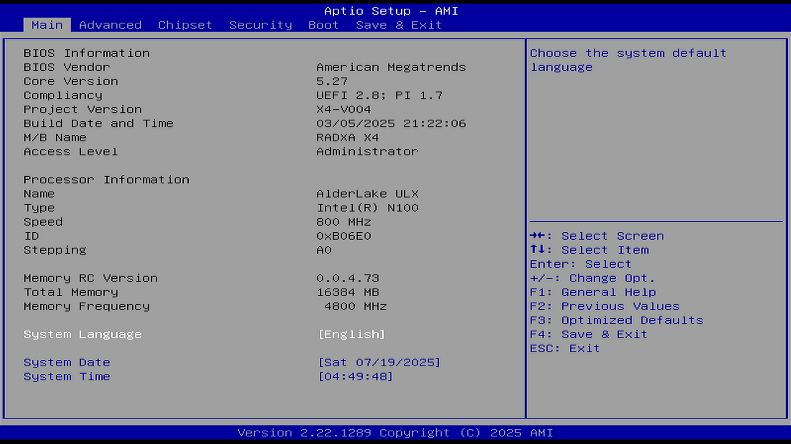

# Main（主菜单）

## 顶部标题

Aptio Setup - AMI

Aptio 设置 - AMI

## 菜单选项

| 英文菜单    | 中文翻译   |
| ----------- | ---------- |
| Main        | 主菜单     |
| Advanced    | 高级       |
| Chipset     | 芯片组     |
| Security    | 安全性     |
| Boot        | 启动       |
| Save & Exit | 保存并退出 |

## 主页面内容

### BIOS Information（BIOS 信息）

- BIOS Vendor（BIOS 厂商）: American Megatrends（安迈科技）
- Core Version（核心版本）: 5.27
- Compliancy（兼容性）: UEFI 2.8; PI 1.7
- Project Version（项目版本）: X4-V004
- Build Date and Time（构建日期和时间）: 03/05/2025 21:22:06（2025 年 03 月 05 日 21:22:06）
- M/B Name（主板名称）: RAXDA X4
- Access Level（访问级别）: Administrator（管理员）

### Processor Information（处理器信息）

- Name（名称）: AlderLake ULX
- Type（类型）: Intel(R) N100
- Speed（频率）: 800 MHz
- ID（编号）: 0xB06E0
- Stepping（步进）: A0

步进（Stepping）：当制造过程有所改进或者功能被修复/删除时，将为英特尔 ® 处理器创建步进代码。现在常见的 Intel 处理器的步进值都是由“一位字母+一位数字”组成的，比如根据 [英特尔 ® 处理器 N100](https://www.intel.cn/content/www/cn/zh/products/sku/231803/intel-processor-n100-6m-cache-up-to-3-40-ghz/ordering.html)，可知 N100 处理器的当前步进为“N0”（一般消费者得到的都是这个步进的处理器）。字母越靠近 z，数字越大，表明步进越高，处理器越新。但是上图 BIOS 显示此 n100 处理器步进为“A0”，很明显这是一颗工程样片。

参见

- [英特尔 ® 处理器步进意味着什么？](https://www.intel.cn/content/www/cn/zh/support/articles/000057218/processors.html)
- [CPU“步进”介绍](https://iknow.lenovo.com.cn/detail/320528)

### Memory Information（内存信息）

- Memory RC Version（内存 RC 版本）: 0.0.4.73
- Total Memory（总内存）: 16384 MB
- Memory Frequency（内存频率）: 4800 MHz

### Language and Time（语言与时间）

- System Language（系统语言）: [English]（[英语]）
- System Date（系统日期）: [Sat 07/19/2025]（[2025 年 07 月 19 日 星期六]）
- System Time（系统时间）: [04:49:48]

## 右侧帮助信息

Choose the system default language（选择系统默认语言）

## 键盘帮助（底部右侧）

- →↑↓←: Select Screen / Item

  →↑↓←：选择页面 / 项目

- Enter: Select

  Enter：选择

- +/-: Change Opt.

  +/-：更改选项

- F1: General Help

  F1：常规帮助

- F2: Previous Values

  F2：上一次的值

- F3: Optimized Defaults

  F3：加载优化默认值

- F4: Save & Exit

  F4：保存并退出

- ESC: Exit

  ESC：退出

- K/k 对右上角的提示内容向上翻页
- M/m：对右上角的提示内容向下翻页

## 底部版本信息

Version 2.22.1289 Copyright (C) 2025 AMI（版本 2.22.1289 版权所有 (C) AMI 2025）