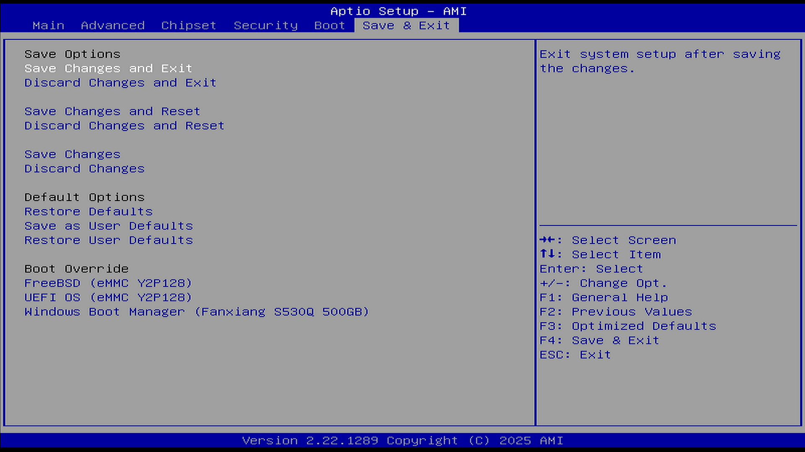

# Save & Exit（保存与退出）

| 英文                                          | 中文翻译                    |
| --------------------------------------------- | --------------------------- |
| Save Changes and Exit                         | 保存更改并退出系统设置      |
| Exit system setup after saving the changes.   | 保存更改后退出系统设置      |
| Discard Changes and Exit                      | 放弃更改并退出系统设置      |
| Exit system setup without saving any changes. | 在未保存任何更改的情况下退出系统设置  |
| Save Changes and Reset                        | 保存更改并重启系统          |
| Reset the system after saving the changes.    | 保存更改后重启系统          |
| Discard Changes and Reset                     | 放弃更改并重启系统          |
| Reset the system without saving any changes.  | 在未保存任何更改的情况下重启系统    |
| Save Changes                                  | 保存当前所有设置的更改       |
| Discard Changes                               | 放弃当前所有设置的更改     |
| Restore Defaults                              | 恢复或加载所有设置项的默认值 |
| Save as User Defaults                         | 将当前设置的更改保存为用户默认值  |
| Restore User Defaults                         |将用户默认值恢复到所有设置项  |
| List of EFI boot managers available           | 可用的 EFI 启动管理器列表  |
| Boot override to selected boot manager        | 启动时覆盖为选定的启动管理器  |

