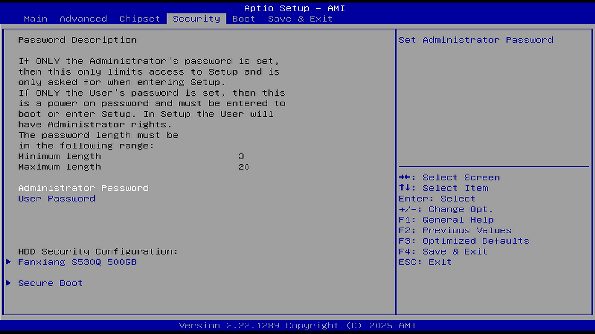
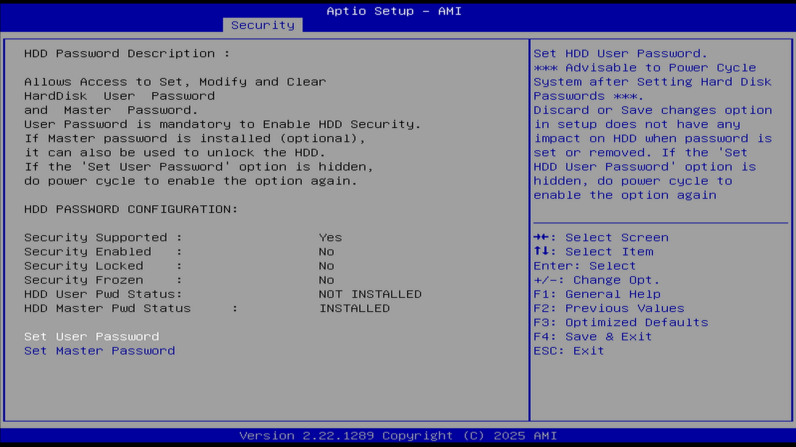
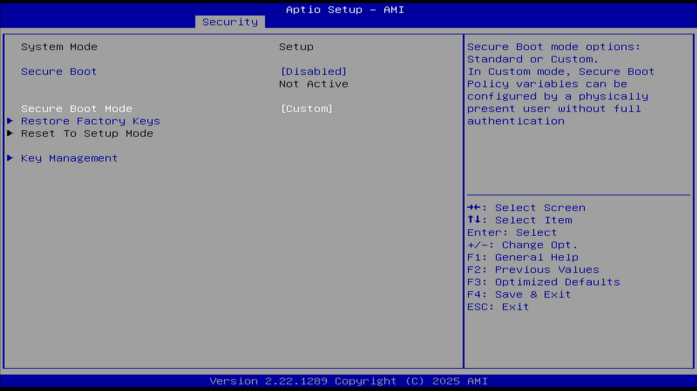
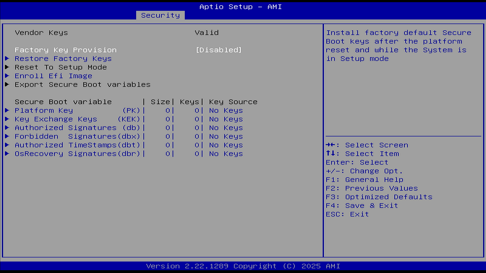

# Security 安全

本章介绍 BIOS 中与系统安全相关的设置选项，包括管理员密码、用户密码、安全启动、TPM（可信平台模块）等重要安全功能。

参见：华硕. 如何设置或解决忘记 BIOS 密码/UEFI 密码/开机密码[EB/OL]. [2026-03-26]. <https://www.asus.com.cn/support/faq/1046347/> 提供 BIOS/UEFI 密码设置与重置的详细指导。

BIOS（基本输入输出系统，Basic Input/Output System）密码是一种固件层面的安全功能，用于阻止计算机在预启动阶段遭到未经授权的访问。BIOS 密码也常被称为系统设置密码、UEFI 密码、开机密码或安全密码。

当设备启动时，系统会提示用户输入 BIOS 密码，只有在输入正确密码后，才能访问和修改 BIOS 设置，并进入操作系统。这提供了一层额外的物理安全屏障，防止未经授权的人员更改硬件配置或篡改启动流程。

## 密码说明（Password Description）

若仅设置了管理员密码，则仅限制进入固件设置程序（BIOS 或 UEFI）。必须输入管理员密码才能读取和修改 BIOS 设置。

若仅设置了用户密码，则此为开机密码，需在开机进入 Windows 或进入 BIOS 时输入此密码。在 BIOS 设置中，使用者将拥有管理员权限。

如果同时设置了管理员密码和用户密码，进入 BIOS 设置时，必须输入管理员密码才能读取和变更 BIOS 设置。若输入的是用户密码，仅能浏览而不能修改 BIOS 设置。

只有当设备处于未设置 BIOS 密码的状态时，才可以设置新的 BIOS 密码。

密码长度要求如下：

最短长度：3

最长长度：20

如果确认不再使用密码，请在 New Password（新密码）字段中保留空白（直接回车即可）。清除密码时，系统将提示是否确认清除密码，请点击 OK。

## Administrator Password（管理员密码）

本选项用于设置 BIOS 的管理员密码。通过该选项可以配置系统设置的访问权限。

设置管理员密码。

## User Password（用户密码）

本选项用于设置 BIOS 的用户密码。该密码可用于控制开机访问权限。用户密码与管理员密码独立存储，提供不同级别的访问控制。设置用户密码后，系统启动时需要输入密码才能继续引导过程。

设置用户密码。

## HDD Security Configuration（硬盘安全配置）

本选项用于配置硬盘的安全保护功能，包括设置硬盘密码等。

此选项仅在检测到已连接硬盘时才会显示。此选项列出所有已连接的硬盘清单，并可针对选择的硬盘设定密码。若设置了 HDD 密码，启动设备或进入 BIOS 设置时，系统会要求输入 HDD 密码。只有在正确的密码输入后，硬盘才会解锁，允许设备正常启动或访问存储在硬盘上的数据。

注意：此硬盘锁会将密码直接写入硬盘的固件存储区域。即使将硬盘物理拆卸并连接到另一台计算机上，该硬盘也无法被正常识别与访问。

该功能适用于机械硬盘（HDD）和固态硬盘（SSD）两种存储介质，图中所示为固态硬盘。

HDD 密码说明：

可设置、修改和清除硬盘的用户密码和主密码。

用户密码是启用硬盘安全功能的前提条件。

如果已设置主密码（可选），也可用其解锁硬盘。

| 项目 | 状态 |
| ---- | ---- |
| 支持安全功能（Security Supported） | 是（Yes） |
| 安全功能启用（Security Enabled） | 否（No） |
| 安全锁定（Security Locked） | 否（No） |
| 安全冻结（Security Frozen） | 否（No） |
| 用户密码状态（HDD User Pwd Status） | 未安装（NOT INSTALLED） |
| 主密码状态（HDD Master Pwd Status） | 已安装（INSTALLED） |

设置硬盘密码后，建议重启系统以确保设置生效。

在 BIOS 中选择“放弃更改”或“保存更改”不会影响已经设置或清除的硬盘密码。

如果“设置用户密码”（Set User Password）选项被隐藏，请重启系统以重新启用该选项。

若要清除硬盘密码，只需将硬盘主密码的新密码设置为空（在输入密码的地方直接回车）。

## Secure Boot（安全启动）

本小节用于配置安全启动参数。安全启动共有 4 种模式：Setup Mode、User Mode、Audit Mode 和 Deployed Mode。系统处于用户模式（User Mode）时，才能启用安全启动功能。

### Secure Boot（安全启动）

本选项用于启用或禁用安全启动功能。

选项：

Enabled（启用）

Disabled（禁用）

说明：

对于非 Windows 操作系统（如 Linux、FreeBSD 等），通常需要关闭此项才能被引导。

当启用此选项、平台密钥（Platform Key，PK）已注册且系统处于用户模式时，安全启动功能将处于激活状态。更改模式需要重启。平台密钥（Platform Key，PK）用于在平台所有者与平台固件之间建立信任关系，平台所有者会将密钥的一部分注册到平台固件中。

当未注册 PK 时，安全启动在 Setup Mode 模式下运行，在修改 PK、KEK、DB 和 DBX 变量时 BIOS 无需认证，此时可通过写入 PK、KEK、DB 和 DBX 变量来配置安全启动策略。BIOS 可工作在 Setup Mode 和 Audit Mode 模式，且从 Setup Mode 可以直接切换为 Audit Mode。

当注册了 PK 后，且 BIOS 在 User Mode 模式下运行时，User Mode 模式要求所有可执行文件在运行之前都要经过认证。此时 BIOS 可工作在 User Mode 和 Deployed Mode 模式下，且从 User Mode 模式可以直接修改为 Deployed Mode。

Audit Mode 是 Setup Mode 的一种延伸，Deployed Mode 是 User Mode 的一种延伸。Audit Mode 和 User Mode 都可以直接转换到 Deployed Mode，但 Deployed Mode 转换到其他安全模式需要删除 PK 或者是特定安全转换方法。

注意：如果安全启动默认处于启用状态且无法关闭，可能需要先设置 Administrator Password（管理员密码）或 User Password（用户密码）才能进行关闭；在关闭安全启动后，可以再取消密码设置。同样地，如果无法开启安全启动，也可能需要先设置 Administrator Password（管理员密码）或 User Password（用户密码）。

### Secure Boot Mode（安全启动模式）

本选项用于选择安全启动的工作模式。

选项：

Standard（标准）

Custom（自定义）

说明：

用于选择安全启动模式。

在自定义模式下，物理存在的用户可以在无需完全认证的情况下配置安全启动策略变量。在自定义模式下，可以灵活使用多种指令。在自定义模式下更新 PK、KEK 变量不需要原始 PK 签署，且更新 Image signature database (db/dbx) 或 Authorized Timestamp Database (dbt) 也不需要 PK 或 KEK 的签署。

标准模式：UEFI 规范中定义的默认模式。

### Restore Factory Keys（恢复出厂密钥）

本选项用于恢复安全启动的出厂密钥。

选项：

Yes（是）

No（否）

说明：

强制系统进入用户模式。安装出厂默认的安全启动的密钥数据库。

### Reset To Setup Mode（重置为设置模式）

本选项用于将安全启动重置为设置模式。

选项：

Yes（是）

No（否）

说明：

从 NVRAM（非易失性随机存取存储器，BIOS/UEFI 固件设置通常存储在里面）删除所有安全启动密钥数据库。

### Key management（密钥管理）

本小节用于管理安全启动相关密钥，包括查看、添加、删除、授权以及恢复出厂设置等操作。

#### Factory Key Provision（预置出厂密钥）

本选项用于配置是否预置出厂密钥。

选项：

Enabled（启用）

Disabled（禁用）

说明：

在平台重启后且系统处于设置模式时，安装出厂默认的安全启动密钥。

#### Restore Factory Keys（恢复出厂密钥）

本选项用于恢复安全启动的出厂密钥。

选项：

Yes（是）

No（否）

说明：

强制系统进入用户模式。安装出厂默认的安全启动密钥数据库。

#### Reset To Setup Mode（重置为设置模式）

本选项用于将安全启动重置为设置模式。

选项：

Yes（是）

No（否）

说明：

从 NVRAM 中删除所有安全启动的密钥数据库。

#### Enroll Efi Image（注册 EFI 映像）

本选项用于注册可信任的 EFI 映像文件。通过该功能，可以将特定的 EFI 映像添加到信任列表中。

文件系统中的映像文件。

允许该映像在安全启动模式下运行。将 PE 镜像的 SHA256 哈希值注册到授权签名数据库（db）中。

#### Remove 'UEFI CA' from DB（从数据库中删除 UEFI CA）

本选项用于从授权数据库中删除 UEFI CA 证书。

对于已启用 Device Guard（微软提供的一种增强系统安全性的技术）的系统，授权签名数据库（db）中不应包含“Microsoft UEFI CA”证书。

#### Restore DB defaults（恢复默认数据库）

本选项用于将授权签名数据库恢复到出厂默认值。

将授权签名数据库（DB）变量恢复到出厂默认值。

#### PK（平台密钥）

本选项用于管理平台密钥。

Set New Var：设置新变量

Append Key：追加密钥

注册出厂默认值或从文件加载证书：

1. 公钥证书格式包括：
 a）EFI_SIGNATURE_LIST
 b）EFI_CERT_X509（DER 编码）
 c）EFI_CERT_RSA2048（二进制）
 d）EFI_CERT_SHAxxx
 
2. 经过认证的 UEFI 变量

3. EFI PE/COFF 镜像（SHA256），密钥来源：出厂、外部、混合

#### Key Exchange Keys（密钥交换密钥）

本选项用于管理密钥交换密钥。密钥交换密钥用于建立平台与操作系统之间的信任关系。

其操作方式与平台密钥类似。

#### Authorized Signatures（授权签名）

本选项用于管理授权签名。授权签名数据库用于存储可信任的签名证书。

其操作方式与平台密钥类似。

#### Forbidden Signatures（禁止签名）

本选项用于管理禁止签名。禁止签名数据库用于存储不可信任的签名证书。

其操作方式与平台密钥类似。

#### Authorized Timestamps（授权时间戳）

本选项用于管理授权时间戳。授权时间戳用于验证签名的时间有效性。

其操作方式与平台密钥类似。

#### OS Recovery Signatures（操作系统恢复签名）

本选项用于管理操作系统恢复签名。

## 课后习题

1. 生成自签名的 X.509 证书，在安全启动自定义模式下将其注册为 PK，测试 FreeBSD 启动镜像的签名与验证流程。

2. 禁用安全启动后配置 HDD 密码，在另一台机器上尝试访问该硬盘。

3. 从安全启动数据库中删除 Microsoft UEFI CA，记录系统引导行为的变化。
