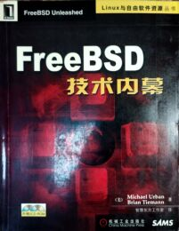
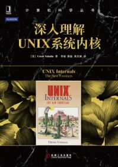
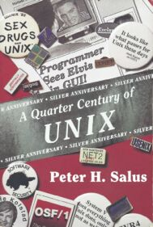
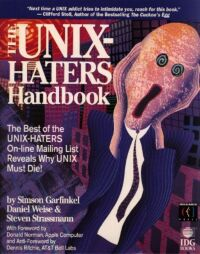
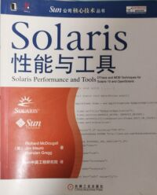

# 参考书目

部分书籍可通过[微信读书](https://weread.qq.com/)、[番茄免费小说](https://fanqienovel.com/)、[QQ 阅读](https://book.qq.com/)、[京东读书](https://cread.jd.com/custom/custom_pcDownload.action)等软件免费阅读。

部分书籍可能已经绝版，可尝试通过社交媒体联系出版社、译者或作者推动再版，或通过[多抓鱼](https://www.duozhuayu.com/)、[孔夫子旧书网](https://www.kongfz.com/)等专业二手书平台进行购买。

如需无 DRM 电子书，请读者自行探索。

## 主要参考书目

| 封面/书名 |  作者/译者 | ISBN/出版社 | 说明 |
| :---: | :---: | :---: | :--- |
|     《FreeBSD 技术内幕》 | [美] Michael Urban、Brian Tiemann 等著    智慧东方工作室 译| 9787111102010    机械工业出版社 |  本书出版于 2002 年，但部分内容至今仍具有参考价值，体现了 FreeBSD 的稳健发展。本书推荐选读第 1、4、8、9、10、11、12、13 章|
|     《Unix & Linux 大学教程》 | [美] Harley Hahn 著    张杰良 译| 9787302209560    清华大学出版社 | 命令行基础 |
|     《UNIX/Linux 系统管理技术手册（第 5 版）》 | [美] Evi Nemeth、Garth Snyder、Trent R. Hein、Ben Whaley、Dan Mackin 等著    门佳 译 | 9787115532763    人民邮电出版社 |命令行进阶与 UNIX 基础知识|
|     《大教堂与集市》 |[美] Eric S. Raymond    卫剑钒 译| 9787111452478    机械工业出版社 | 主要介绍开源运动的发展历史|
|     《4.4BSD 操作系统设计与实现》 | [美] Marshall Kirk McKusick 等著   李善平、刘文峰、马天驰 等译| 9787111366478    机械工业出版社 | 介绍 4.4BSD 操作系统的设计与实现 |
|     《深入理解 FreeBSD 设备驱动程序开发》 | [加] Joseph Kong 著    陈毅东 译| 9787111411574    机械工业出版社 |  介绍 FreeBSD 设备驱动程序的开发方法 |
|     《UNIX 环境高级编程（第 3 版）》 | [美] W. Richard Stevens、Stephen A. Rago 等著  张毅峰、马树超 等译| 9787121478338    电子工业出版社 | 深入介绍驱动 UNIX 内核的编程接口及相关实用知识 |
|     《UNIX 网络编程 卷 1：套接字联网 API（第 3 版）》 | [美] W. Richard Stevens、Bill Fenner、Andrew M. Rudoff 等著| 9787115517791    人民邮电出版社 | 如何使用套接字 API 进行网络编程 |
|     《UNIX 网络编程 卷 2：进程间通信（第 2 版）》 | [美] W. Richard Stevens 著 | 9787115517807    人民邮电出版社 | 深入介绍各种进程间通信形式。原作者未出版第 3 版|
|     《深入理解 UNIX 系统内核》 | [美] Uresh Vahalia 著  薛磊、黄庆新、李雨 等译| 9787111491453   机械工业出版社 | UNIX 内核基础 |
|     《Unix 四分之一世纪》|  Peter H. Salus | 9780201547771    Addison-Wesley Professional | 历史类书籍，中译本在 [此](https://freebsd.gitbook.io/unix-er-shi-wu-nian) |
|     《Unix 痛恨者手册》 | Simson Garfinkel、Daniel Weise、Steven Strassmann | 9781568842035     IDG Books Worldwide, Inc. |  历史书，中译本在 [此](https://book.bsdcn.org/unix-tong-hen-zhe-shou-ce)   
|    《Solaris 性能与工具》 | [美] Richard McDougall、Jim Mauro、Brendan Gregg 等著    Sun 中国工程研究院 译| 9787111214038    机械工业出版社 | 介绍常用性能监测工具及 DTrace 使用方法。本书基于 Solaris 10，同时适用于 FreeBSD |
|  《Oracle® Solaris ZFS 管理指南》  | Oracle |  文件号码 819–7065–17（版本 [Oracle Solaris 10 8/11](https://docs.oracle.com/cd/E24847_01/)）  | [在线阅读地址](https://docs.oracle.com/cd/E24847_01/html/819-7065/index.html)、[PDF](https://docs.oracle.com/cd/E24847_01/pdf/819-7065.pdf)；注意 ZFS 存储池（ZFS pool）版本不应高于 28。（因此通常搜索引擎提供的版本是不正确的，下同），ZFS 闭源开发自 28 开始分支，Oracle 后续发布的文档不一定与当前及早期版本的 FreeBSD ZFS 兼容  |
|  《DTrace 用户指南》  | Oracle | 文件号码 E22192（版本 [Oracle Solaris 10 8/11](https://docs.oracle.com/cd/E24847_01/)）    |  [在线阅读地址](https://docs.oracle.com/cd/E24847_01/html/E22192/index.html)、[PDF](https://docs.oracle.com/cd/E24847_01/pdf/E22192.pdf)；很短的小册子。任何 Oracle 后续文档不一定与当前及以前的 FreeBSD DTrace 兼容。|
|  《Solaris 动态跟踪指南》  | Oracle | 文件号码 819-6959-10（版本 [Oracle Solaris 10 8/11](https://docs.oracle.com/cd/E24847_01/)）   | [在线阅读地址](http://download.oracle.com/docs/cd/E19253-01/819-6959/index.html)、[PDF](http://download.oracle.com/docs/cd/E19253-01/819-6959/819-6959.pdf)；《DTrace 用户指南》的增强版本。任何 Oracle 后续文档不一定与当前及以前的 FreeBSD DTrace 兼容。 |

## 选读书目

| 封面/书名 | 作者/译者 | ISBN/出版社 |
| :---:  | :---: | :---: |
|     《UNIX 传奇——历史与回忆》 | [美] Brian W Kernighan 著    韩磊 译| 9787115557179    人民邮电出版社 |  

《UNIX 传奇——历史与回忆》主要介绍 UNIX 的发展历史，整体内容相对概括。

| 封面/书名 | 作者/译者 | ISBN/出版社 |
| :----: | :----: | :----: |
|     《UNIX 编程艺术》（TAOUP） | [美] Eric Raymond 著    姜宏、何源、蔡晓骏 等译 | 9787121176654    电子工业出版社 |

《UNIX 编程艺术》主要讲解了 UNIX 的设计思路与软件工程理论。需要说明的是，本书并不涉及哲学层面的讨论。书中许多设计原则源于特定历史背景下的现实选择，后续被部分读者赋予了过度解读。

本书作者虽然是 OSI 创始人，深度参与了开源事业，但其对开源和 UNIX 哲学理解与自由软件基金会等传统观点存在明显的张力。

| 封面/书名 | 作者/译者 | ISBN/出版社 |
| :---: | :---: | :---: |
|     《FreeBSD 操作系统设计与实现（原书第 2 版）》 |[美] Marshall McKusick、George Neville-Neil、Robert N.M. Watson 等著    陈向群、郭立峰、叶顺平 等译| 9787111689973    机械工业出版社 |  

《FreeBSD 操作系统设计与实现（原书第 2 版）》主要讲解了内核。

该书采用轻型纸印刷，且部分章节需要读者自行通过[网络](https://course.cmpreading.com/web/refbook/detail/9661/215)下载获取。

该书阅读难度较高。据韩国 FreeBSD 社区的相关反馈，即使部分专业读者也认为其内容较为晦涩。

主要作者：Marshall Kirk McKusick 在其网站上有提供多款 BSD 相关的 [录制课程](https://www.mckusick.com/buylist.html)，大致价格为 1945 美元。目前正在撰写推出第三版，见 2025 年 6 月 BSDCan 大会 [A History of the BSD Daemon by Marshall Kirk McKusick](https://www.youtube.com/watch?v=SGC0191nDp0)（BSD 守护进程史，作者 Marshall Kirk McKusick。见 42:35-50:23）。

## 需谨慎对待的书目

### FreeBSD Mastery（FreeBSD 精通）系列丛书

- *FreeBSD Mastery: Storage Essentials*（可译为《FreeBSD 精通：存储基础》）
- *FreeBSD Mastery: Specialty Filesystems*（可译为《FreeBSD 精通：特殊文件系统》）
- *FreeBSD Mastery: ZFS*（可译为《FreeBSD 精通：ZFS》）
- *FreeBSD Mastery: Advanced ZFS*（可译为《FreeBSD 精通：ZFS 高级教程》）
- *FreeBSD Mastery: Jails*（可译为《FreeBSD 精通：Jail》）

说明见下。

### *Absolute FreeBSD, 3rd Edition: The Complete Guide to FreeBSD*（可译为《FreeBSD 完全指南》第三版）

|封面/书名 | 作者 | ISBN/出版社 |
| :---: | :---: | :---: |
|     ***Absolute FreeBSD, 3rd Edition: The Complete Guide to FreeBSD***   （可译为《FreeBSD 完全指南》第三版） | Michael W. Lucas | 9781593278922    No Starch Press |

说明：

打开美国亚马逊官网作者 Michael W. Lucas 的 [页面](https://www.amazon.com/stores/Michael-W.-Lucas/author/B004MNWSFG?language=zh_TW&ref=ap_rdr&isDramIntegrated=true&shoppingPortalEnabled=true)，你会惊讶地发现竟有人如此著作等身，博闻强识。从 ZFS 到 FreeBSD，从 OpenBSD 到 GPG，居然出版了近五十本。

笔者随机抽取了几本进行泛读，并对 *Absolute FreeBSD, 3rd Edition*（本人曾在中亚购买过正版印刷版）进行了深入阅读。

观察到，作者撰写的内容整体较为基础，许多章节都花费较多篇幅介绍对多数人来说较为常识性的内容，例如“电脑应安装杀毒软件”、“应开启电脑防火墙”等等（这在一定程度上和美国教科书的风格相吻合）。

虽然书中包含大量代码示例和指令，但在技术深度上，部分内容甚至低于大学公共计算机课程中 Windows 和 Office 的教学要求。整体内容更接近我国本世纪初夜校及基层计算机培训的教学需求，这在当时具有一定现实背景。笔者观察到该作者的 *Absolute BSD* 就是 2002 年出版的。

鉴于其较高的定价与相对有限的技术深度，书籍在深度和专业性方面仍有提升空间。经过随机选读，该作者的其他书籍总体情况大致相同（同样不建议阅读）。

综上所述，以上评述基于笔者个人阅读体会，供读者参考。

购买凭证（中亚已经关闭历史订单，只能通过这种方式获取数据）："亚马逊", "C03-7970199-0880003", "2018-11-20T02:45:08Z", "Not Applicable", "CNY", "261.56", "0", "0", "'-2.31'", "259.25", "261.56", "0", "1593278926", "New", "1", "Gift Certificate/Card", "Closed", "Shipped", "2018-11-20T09:28:35Z", "std-cn-d2d", "此处地址、邮编、联系人已隐去 China", "Not Available", "HEBKD(221461786692)", "Absolute FreeBSD, 3rd Edition", "Not Available", "Not Available", "Not Available", "Not Available"。可以看到当时这本书最后售价为 261.56 元，实收 259.25 元。

### 二十一世纪初中国人对 FreeBSD 的探索

- 王波. FreeBSD 使用大全[M]. 北京: 机械工业出版社, 1999. ISBN 9787111074823.
- 王波. FreeBSD 使用大全（第 2 版）[M]. 北京: 机械工业出版社, 2002. ISBN 9787111102861.

该书内容与 FreeBSD 的关联度较低，实际更接近 Linux 基础入门类读物。

作者使用了较大篇幅介绍了一些在当前技术背景下已显得不再实用的内容。但这不是批评或质疑，这是必然的，也是合理的。

因为在千禧年代，只有极个别家庭拥有自己的 PC 和网络连接（根据中国互联网络信息中心《第十四次中国互联网络发展状况统计报告》统计，2004 年网民总数为 8700 万，仅仅约占时年人口总数的 6.69%）。如果内容在当时写得过于学术和深入，其出版价值可能会受到影响。

此第二版的确在台湾地区出版过，但是无人问津，连图片也难以搜寻。作者也在本书第二版出版后就难寻踪迹，其网站也在不久后关停。

站在当初的时间节点上，有这样一本书，或许就能够帮助很多人入门，享受 FreeBSD 世界带来的快乐！但不可否认的是，该书具有作为国内早期 FreeBSD 相关书籍的重要历史地位。作者王波是早期 FreeBSD 中文社区的推动者和深入参与者。

内容已基本过时。对于当前读者而言，除非出于历史研究目的，否则没有必要阅读本书。

- 冯宝坤, 陈子鸿. 《FreeBSD》完全攻略[M]. 北京: 中国物资出版社; 北京希望电子出版社, 2004. ISBN 9787504721600.

内容已基本过时。对于当前读者而言，除非出于历史研究目的，否则没有必要阅读本书。
