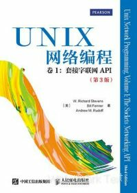

# 参考书目

相关书籍：新的变化也不是很大。不像 Linux 有这么多入门书籍。出于历史上的原因，看 UNIX 相关书籍即可。

> **技巧**
>
> 以下有多本书籍可通过微信读书免费阅读。

| 封面 | 书名 | 作者 | ISBN | 出版社 | 说明 |
| :---: | :---: | :---: | :---: | :---: | :---: |
| | 《FreeBSD 技术内幕》 | Brian Tiemann、Michael Urban | 9787111102010 | 机械工业出版社 |  2002 年的书，居然还能用。你该说 BSD 没有发展，还是该说他稳定？本书推荐选读第 1、4、8、9、10、11、12、13 章|
|  | 《Unix & Linux 大学教程》 | Harley Hahn | 9787302209560 | 清华大学出版社 | 命令行基础 |
|  | 《UNIX/Linux 系统管理技术手册（第 5 版）》 | Evi Nemeth、Garth Snyder、Trent R.Hein、Ben Whaley、Dan Mackin | 9787115532763 | 人民邮电出版社 |命令行进阶与 UNIX 基础 |
|  | 《FreeBSD 操作系统设计与实现（原书第 2 版）》 | Marshall McKusick、George Neville-Neil、Robert N.M. Watson | 9787111689973 | 机械工业出版社 |  主要讲解了内核。轻型纸，居然还有几个章节要自己在网络自己下载？ |
|  | 《UNIX 编程艺术》（TAOUP） | Eric Raymond | 9787121176654 | 电子工业出版社 | 主要讲解了 UNIX 的设计哲学与软件工程理论。 |
|  | 《大教堂与集市》 | Eric S. Raymond | 9787111452478 | 机械工业出版社 | 主要介绍了开源运动的发展史。 |
|  | 《4.4BSD 操作系统设计与实现》 | Marshall Kirk McKusick | 9787111366478 | 机械工业出版社 | 4.4BSD 操作系统设计与实现 |
|  | 《深入理解 FreeBSD 设备驱动程序开发》 | Joseph Kong | 9787111411574 | 机械工业出版社 |  FreeBSD 设备驱动程序开发 |
|  | 《UNIX 环境高级编程（第 3 版）》 | W. Richard Stevens、Stephen A. Rago | 9787115352118 | 人民邮电出版社 |  深入了解驱动 UNIX 内核的编程接口的实用知识 |
|  | 《UNIX 网络编程 卷 1：套接字联网 API（第 3 版）》 | W. Richard Stevens、Bill Fenner、Andrew M. Rudoff | 9787115367198 | 人民邮电出版社 | 如何使用套接字 API 进行网络编程 |
|  | 《UNIX 网络编程 卷 2：进程间通信（第 2 版）》 | W. Richard Stevens | 9787115367204 | 人民邮电出版社 | 深入了解各种进程间通信形式。**这书原作者没出第 3 版，不用再找了** |
|  | 《深入理解 UNIX 系统内核》 | Uresh Vahalia | 9787111491453 | 机械工业出版社 | UNIX 内核基础 |
|  | 《Unix 四分之一世纪》|  Peter H. Salus | 9780201547771| Addison-Wesley Professional | 历史书，中译本在[此](https://freebsd.gitbook.io/unix-er-shi-wu-nian) |
|  | 《Unix 痛恨者手册》 | Simson Garfinkel、Daniel Weise、Steven Strassmann | 9781568842035 |  IDG Books Worldwide, Inc. |  历史书，中译本在[此](https://book.bsdcn.org/unix-tong-hen-zhe-shou-ce) |

## 选读书目

| 封面 | 书名 | 作者 | ISBN | 出版社 |说明 |
| :---: | :---: | :---: | :---: | :---: | :---: |
|  | 《UNIX 传奇——历史与回忆》 | Brian W Kernighan | 9787115557179 | 人民邮电出版社 | 主要讲解了 UNIX 的发展历史。写的比较粗略。 |

## 不建议阅读

|封面 | 书名 | 作者 | ISBN | 出版社 |说明 |
| :---: | :---: | :---: | :---: | :---: | :---: |
|  | ***Absolute FreeBSD 3rd*** | Michael W. Lucas | 9781593278922 | No Starch Press |见下 |

打开美国亚马逊官网作者 Michael W. Lucas 的[页面](https://www.amazon.com/stores/Michael-W.-Lucas/author/B004MNWSFG?language=zh_TW&ref=ap_rdr&isDramIntegrated=true&shoppingPortalEnabled=true)，你会惊讶地发现竟有人如此著作等身，博闻强识。从 ZFS 到 FreeBSD，从 OpenBSD 到 GPG，居然出版了近五十本。

笔者随机抽取了几本进行泛读，并对 *Absolute FreeBSD, 3rd Edition* 进行了深入阅读。观察到，作者撰写的内容整体较为基础，许多章节都花费较多篇幅介绍对多数人来说较为常识性的内容，例如“电脑应安装杀毒软件”、“应开启电脑防火墙”等等。虽然书中包含大量代码示例和指令，但在难度和深度上，甚至难以与大学公共计算机课程中 Windows 和 Office 的内容相提并论，整体上更接近我国在本世纪初于夜校和农村举办的计算机培训。

基于本人曾在中亚购买过该书正版印刷版且价格不菲的经验，认为其内容质量与售价之间存在一定差距。该作者的其他书籍总体情况大致相同。

以上为笔者的个人阅读感受，仅供参考。

