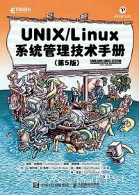
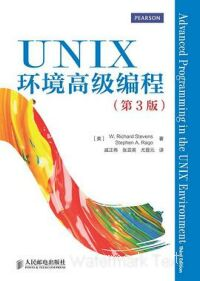
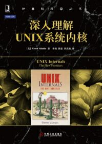
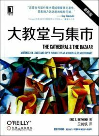
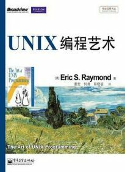
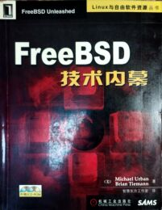
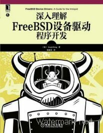
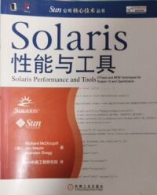

# 参考书目

本附录为 FreeBSD 学习者与研究者提供系统性的文献参考框架，涵盖命令行基础、UNIX 内核原理、FreeBSD 技术体系及网络协议等多个领域的核心著作。

部分书籍可通过中文数字阅读平台获取，包括 [微信读书](https://weread.qq.com/)、[QQ 阅读](https://book.qq.com/)、[京东读书](https://cread.jd.com/custom/custom_pcDownload.action) 等。这些平台提供技术类书籍的数字版本，便于读者在线阅读。

部分书籍可能已经绝版，可尝试通过专业二手书交易平台购买，如 [多抓鱼](https://www.duozhuayu.com/)、[孔夫子旧书网](https://www.kongfz.com/) 等。

## 主要参考书目

本部分列出本书编写过程中参考的主要书籍，涵盖命令行基础、UNIX 内核、FreeBSD 技术等多个领域，读者可根据自身需求进一步查阅。

### 命令行基础

本小节介绍命令行学习的基础与进阶书籍，适合不同层次的读者选择阅读。

| 封面/书名 | 作者/译者 | ISBN/出版社 | 说明 |
| --------- | --------- | ----------- | ---- |
|     《Unix & Linux 大学教程》 | [美] Harley Hahn 著    张杰良 译 | 978-7-302-20956-0    清华大学出版社 | 命令行操作与 Shell 编程基础教程，涵盖 Unix/Linux 系统的基本命令使用和脚本编写 |
|     《UNIX/Linux 系统管理技术手册（第 5 版）》 | [美] Evi Nemeth、Garth Snyder、Trent R. Hein、Ben Whaley、Dan Mackin 等著    门佳 译 | 978-7-115-53276-3    人民邮电出版社 | 系统管理技术手册，涵盖 UNIX/Linux 系统运维的核心技术，包括用户管理、文件系统、网络配置等内容 |

### UNIX 基础

本小节收录 UNIX 操作系统核心技术书籍，涵盖编程接口、网络通信、内核实现等关键领域。

| 封面/书名 | 作者/译者 | ISBN/出版社 | 说明 |
| --------- | --------- | ----------- | ---- |
|     《UNIX 环境高级编程（第 3 版）》 | [美] W. Richard Stevens、Stephen A. Rago 等著  张毅峰、马树超 等译 | 978-7-121-47833-8    电子工业出版社 | UNIX 系统编程技术书籍，详细讲解系统调用、文件 I/O、进程控制等编程接口 |
|     《UNIX 网络编程 卷 1：套接字联网 API（第 3 版）》 | [美] W. Richard Stevens、Bill Fenner、Andrew M. Rudoff 等著 | 978-7-115-51779-1    人民邮电出版社 | 网络编程技术书籍，系统讲解套接字 API、TCP/IP 协议栈实现等网络编程技术 |
|     《UNIX 网络编程 卷 2：进程间通信（第 2 版）》 | [美] W. Richard Stevens 著 | 978-7-115-51780-7    人民邮电出版社 | 进程间通信技术书籍，详细讲解管道、消息队列、共享内存、信号量等 IPC 机制 |
|     《深入理解 UNIX 系统内核》 | [美] Uresh Vahalia 著  薛磊、黄庆新、李雨 等译 | 978-7-111-49145-3    机械工业出版社 | UNIX 内核技术书籍，讲解进程管理、内存管理、文件系统等内核设计原理 |
|     《4.4BSD 操作系统设计与实现》 | [美] Marshall Kirk McKusick 等著   李善平、刘文峰、马天驰 等译 | 978-7-111-36647-8    机械工业出版社 | 4.4BSD 操作系统技术书籍，讲解 BSD 系统的设计与实现细节 |

### 开源与自由软件运动

本小节介绍开源与自由软件运动的历史背景与核心文献，帮助读者理解相关文化与思想。

| 封面/书名 | 作者/译者 | ISBN/出版社 | 说明 |
| --------- | --------- | ----------- | ---- |
|     《Unix 四分之一世纪》 | Peter H. Salus | 978-0-20154-777-1    Addison-Wesley Professional | UNIX 发展历史书籍，详细记录了 Unix 从诞生到普及的技术演进历程 |
|     《Unix 痛恨者手册》 | Simson Garfinkel、Daniel Weise、Steven Strassmann | 978-1-56884-203-5    IDG Books Worldwide, Inc. | Unix 技术批评书籍，从批评视角分析 Unix 系统的设计缺陷和技术局限性 |
|     《大教堂与集市》 | [美] Eric S. Raymond    卫剑钒 译 | 978-7-111-45247-8    机械工业出版社 | 开源运动历史书籍，阐释集中式与分布式两种软件开发模式的差异 |
|     《UNIX 传奇——历史与回忆》 | [美] Brian W. Kernighan 著    韩磊 译 | 978-7-115-55717-9    人民邮电出版社 | UNIX 发展历史书籍，记录 Unix 技术发展的关键节点和历史背景 |

以下书籍阐述了 UNIX 的设计理念，有助于读者理解其软件工程思想与技术哲学。

| 封面/书名 | 作者/译者 | ISBN/出版社 | 说明 |
| --------- | --------- | ----------- | ---- |
|     《UNIX 编程艺术》（TAOUP） | [美] Eric Raymond 著    姜宏、何源、蔡晓骏 等译 | 978-7-121-17665-4    电子工业出版社 | UNIX 系统设计理念书籍，阐述软件工程思想与技术哲学 |

《UNIX 编程艺术》讲解 UNIX 系统的设计思路与软件工程理论，涵盖类 Unix 系统的设计原则和实践方法。该书聚焦工程实践领域，阐述许多源于特定历史背景的设计原则。

### FreeBSD 基础

本小节收录 FreeBSD 操作系统的核心技术书籍，包括基础入门、设备驱动开发及内核设计等方面的著作。

| 封面/书名 | 作者/译者 | ISBN/出版社 | 说明 |
| --------- | --------- | ----------- | ---- |
|     《FreeBSD 技术内幕》 | [美] Michael Urban、Brian Tiemann 等著    智慧东方工作室 译 | 978-7-111-10201-0    机械工业出版社 | FreeBSD 技术书籍，出版于 2002 年，系统讲解 FreeBSD 系统架构与核心组件。部分内容如系统架构概述仍具参考价值，适合了解 FreeBSD 的发展脉络 |
|     《深入理解 FreeBSD 设备驱动程序开发》 | [加] Joseph Kong 著    陈毅东 译 | 978-7-111-41157-4    机械工业出版社 | FreeBSD 驱动开发技术书籍，详细讲解内核模块编程、设备驱动架构和驱动程序开发技术 |

以下是 FreeBSD 内核设计的权威著作，内容深入且专业，为高级研究者提供核心技术参考。

| 封面/书名 | 作者/译者 | ISBN/出版社 | 说明 |
| --------- | --------- | ----------- | ---- |
|     《FreeBSD 操作系统设计与实现（原书第 2 版）》 | [美] Marshall McKusick、George Neville-Neil、Robert N.M. Watson 等著    陈向群、郭立峰、叶顺平 等译 | 978-7-111-68997-3    机械工业出版社 | FreeBSD 内核设计权威著作，详解现代 FreeBSD 内核架构与实现细节 |

《FreeBSD 操作系统设计与实现（原书第 2 版）》是 FreeBSD 技术体系中的权威学术著作，详解现代 FreeBSD 内核架构与实现细节。

该书采用轻型纸印刷，且部分章节需要读者自行通过 [网络](https://course.cmpreading.com/web/refbook/detail/9661/215) 下载获取。

该书阅读难度较高，属于高级技术专著范畴，需要具备一定的操作系统理论基础方能深入理解。

主要作者 MCKUSICK M K 在其网站上提供多款 BSD 相关的录制课程[EB/OL]. [2026-03-26]. <https://www.mckusick.com/buylist.html>。目前正在撰写推出第三版，相关信息可参见 2025 年 6 月 BSDCan 大会 A History of the BSD Daemon by MCKUSICK M K[EB/OL]. [2026-03-26]. <https://www.youtube.com/watch?v=SGC0191nDp0>，这一信息对于追踪 FreeBSD 技术演进具有重要的文献价值。

### IPv6 网络堆栈

以下书籍逐行讲解 FreeBSD IPv6 网络堆栈（KAME 项目）的设计与实现，是网络协议领域的深度技术专著，适合深入学习网络协议的读者进行系统性研读。

- LI Q, JINMEI T, SHIMA K. IPv6 详解：卷 1，核心协议实现[M]. 陈涓, 赵振平, 译. 北京: 人民邮电出版社, 2009: 846. ISBN: 978-7-115-18950-9（英文影印版本 ISBN: 978-7-115-19551-7）. 详解 IPv6 核心协议实现，基于 FreeBSD KAME 项目代码分析。
- LI Q, JINMEI T, SHIMA K. IPv6 详解：卷 2，高级协议实现[M]. 王嘉祯, 等译. 北京: 人民邮电出版社, 2009: 869. ISBN: 978-7-115-20891-0（英文影印版本 ISBN: 978-7-115-19519-7）. 详解 IPv6 高级协议与扩展机制，包含移动 IPv6 等关键技术。

### ZFS

本小节介绍 ZFS 文件系统的相关参考资料，帮助读者掌握这一先进的存储技术。

| 封面/书名 | 作者/译者 | ISBN/出版社 | 说明 |
| --------- | --------- | ----------- | ---- |
| 《Oracle® Solaris ZFS 管理指南》 | Oracle | 文件号码 819–7065–17（版本 [Oracle Solaris 10 8/11](https://docs.oracle.com/cd/E24847_01/)） | [在线阅读地址](https://docs.oracle.com/cd/E24847_01/html/819-7065/index.html)、[PDF](https://docs.oracle.com/cd/E24847_01/pdf/819-7065.pdf)。ZFS 管理技术文档，详解 Solaris ZFS 架构与管理操作。注意 ZFS 存储池版本兼容性限制 |

### DTrace 与系统调优

本小节收录系统性能调优与动态跟踪相关的参考资料，帮助读者掌握系统调试与性能优化技术。

| 封面/书名 | 作者/译者 | ISBN/出版社 | 说明 |
| --------- | --------- | ----------- | ---- |
|     《Solaris 性能与工具》 | [美] Richard McDougall、Jim Mauro、Brendan Gregg 等著    Sun 中国工程研究院 译 | 978-7-111-21403-8    机械工业出版社 | 介绍常用性能监测工具及 DTrace 使用方法。本书基于 Solaris 10，同时适用于 FreeBSD。系统性能调优权威指南，详解性能分析工具与 DTrace 动态跟踪技术 |

| 封面/书名 | 作者/译者 | ISBN/出版社 | 说明 |
| --------- | --------- | ----------- | ---- |
| 《DTrace 用户指南》 | Oracle | 文件号码 E22192（版本 [Oracle Solaris 10 8/11](https://docs.oracle.com/cd/E24847_01/)） | [在线阅读地址](https://docs.oracle.com/cd/E24847_01/html/E22192/index.html)、[PDF](https://docs.oracle.com/cd/E24847_01/pdf/E22192.pdf)。DTrace 入门技术文档，讲解动态跟踪框架的基本概念与使用方法 |
| 《Solaris 动态跟踪指南》 | Oracle | 文件号码 819-6959-10（版本 [Oracle Solaris 10 8/11](https://docs.oracle.com/cd/E24847_01/)） | [在线阅读地址](http://download.oracle.com/docs/cd/E19253-01/819-6959/index.html)、[PDF](http://download.oracle.com/docs/cd/E19253-01/819-6959/819-6959.pdf)。DTrace 高级技术文档，讲解动态跟踪框架的高级技巧与性能分析方法 |

## 文献评述与历史文献

### FreeBSD Mastery 系列丛书

本系列丛书由 Michael W. Lucas 撰写，涵盖 FreeBSD 多个技术领域，包括：

- *FreeBSD Mastery: Storage Essentials*
- *FreeBSD Mastery: Specialty Filesystems*
- *FreeBSD Mastery: ZFS*
- *FreeBSD Mastery: Advanced ZFS*
- *FreeBSD Mastery: Jails*

该系列书籍类似非计算机专业的计算机导论课程，注重 **基础** 操作。该书的历史意义重于实践价值。

### *Absolute FreeBSD, 3rd Edition: The Complete Guide to FreeBSD*

| 封面/书名 | 作者 | ISBN/出版社 |
| --------- | ---- | ----------- |
|     ***Absolute FreeBSD, 3rd Edition: The Complete Guide to FreeBSD*** | Michael W. Lucas | 978-1-59327-892-2    No Starch Press |

*Absolute FreeBSD* 系列初版于 2002 年，第三版出版于 2018 年。该书作为 FreeBSD 入门综合指南，内容覆盖系统安装、配置管理、基本运维等主题。

### 《莱昂氏 UNIX 源代码分析》

LIONS J. 莱昂氏 UNIX 源代码分析[M]. 尤晋元, 译. 北京:机械工业出版社, 2000. UNIX 早期教学核心文献，带注释的 UNIX v6 源代码汇编。

该书原作名为 *Lion's Commentary on UNIX with Source Code*，由 LIONS J 撰写，最初作为澳大利亚新南威尔士大学的课程讲义，是 UNIX 早期教学的核心文献。该书的中文翻译历程颇具历史意义，反映了中国开源社区对经典技术文献的重视（参见：中华读书报. 《莱昂氏 UNIX 源代码分析》出版一波三折[EB/OL]. [2026-03-26]. <https://www.gmw.cn/01ds/2000-08/02/GB/2000%5E311%5E0%5EDS1418.htm>）。

从学术文献分类的角度看，该书更接近“带注释的源代码汇编”而非系统的理论分析，其价值在于提供 UNIX 早期实现的原始文本。它在 UNIX 教学史上具有重要地位，但随着技术演进，其直接技术参考价值已让位于历史研究价值，成为技术史研究的重要文献。

### 早期中文 FreeBSD 文献（2000 年代）

- 王波. FreeBSD 使用大全[M]. 北京:机械工业出版社, 1999. ISBN: 978-7-111-07482-3. 国内最早的 FreeBSD 中文入门书籍之一，出版于 1999 年。作者王波是早期 FreeBSD 中文社区的重要推动者。
- 王波. FreeBSD 使用大全：第 2 版[M]. 北京:机械工业出版社, 2002. ISBN: 978-7-111-10286-1. FreeBSD 中文入门书籍修订版，技术内容更新并在台湾地区发行。
- 冯宝坤, 陈子鸿. FreeBSD 完全攻略[M]. 北京:中国物资出版社; 北京希望电子出版社, 2004. ISBN: 978-7-5047-2160-0. 早期 FreeBSD 中文入门文献。

这些书籍反映了二十一世纪初中文世界对 FreeBSD 操作系统的早期探索，具有历史研究价值。由于技术快速迭代，书中的具体技术内容可能已过时。
