# 存储设备基础

## microSD 卡（存储卡/TF 卡/SD 卡/内存卡）参数简介

存储卡规范是由 [SD 协会](https://www.sdcard.org/) 制定的。

SD 卡的标准十分混乱，甚至与 USB-IF 协会制定的 USB 标准相比，其混乱程度亦难分伯仲——SD 卡协会难辞其咎。

SD 卡的标准之所以这么混乱，根源是因为在随时代发展的同时，SD 卡协会并不会弃用先前的旧标准（如放弃英制单位，使用公制单位），更不会提升之前的标准（如刷版本号），而是另行创建一个更高段的标准。**简言之，SD 卡存在多种并行的度量衡，且量程各有重叠和差异。**

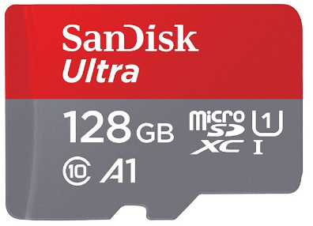

上图是一张 microSD（微型）SD 卡，即树莓派、手机所使用的。

>**注意**
>
>仅最老款的树莓派使用标准 SD 卡，目前标准 SD 卡“大卡”主要用于相机。

microSD 也即我们所说的 TF 卡（类似于 EFI 和 UEFI 的关系）、手机存储卡。

这块闪迪的 microSD 卡，上面标有：

- `SanDisk Ultra`：`SanDisk` 是商标品牌名“闪迪”的英语；`Ultra` 是闪迪自己的型号款式——至尊高速款。
- `128 GB`：存储卡的容量是 128 GB。
- `C10`（`10` 环绕着圆形“C”符号）：该参数无效，不用看。现在所有卡标的都是 10，想找低于 10 的都难。
- `microSDXC`（microSDXC）：指该卡容量位于 32G-2TB 间；2G-32G 为“micro SDHC”。其他的，现在基本上见不到——容量小于 2G（microSD）或容量大于 2TB（microSDUC）。这个参数也没什么意义，因为必定是个卡上就标了容量大小。
- `U1`（`1` 环绕着圆形“U”符号）: `U1` 最低写入速度为 10MB/秒；U3 则为 30MB/秒。**没有 U2**。**只有老产品（U3）或低速设备（U1）会标**
- `1`（XC 右侧，U1 下方）：使用 UHS-I：总线最高为 104MB/秒；UHS-II 则为 312MB/秒。该总线决定了存储卡的速度上限。
- `A1`：随机读写速率。目前只有 A1、A2 两等，如果没标就是连 A1 都没到。树莓派须使用 A2 卡。

## 补充

- `667x`、`1066x`：雷克沙等卡会标 667x、或 1066x，这种标识方法目前只有 CD 机、磁带机、光盘还在用，相当古老（二十世纪 80 年代）。

①667x = 150KB/s x 667 ≈ 83MB/S；

②1066x = 150KB/s x 1066 ≈ 156MB/S。

- `V30`：新产品一般将 `U3` 标为 **V30**。不用找 V60，有但是非常贵（正常的 A2 卡 1 元 1G；V60 3 元 1G，但是似乎 V60 A2 没有共存的）V90 的 microSD 卡我没有见过。低于 V30 的也没见过，一般就标成 `U1`。速率标准换算：***C10 = U1 = V10*** 这 3 个东西其实是一回事，但同时标着。

总结：这块闪迪 microSD 存储卡上面标了 7 个参数，其中 4 个都是没用的。并且从参数上看，这款存储卡并不具有什么优势，很平凡。

## 存储卡挑选总结

总结：对于树莓派：容量（推荐至少为 32G）、连续读写（至少 V30）、随机读写（A2）。但是现在是个卡就是这么标的，且除了树莓派 5，其他的设备（比如 Switch）本身大都达不到其 SD 卡设计的总线速率，**所以仅须看是 A1、还是 A2 这一个参数就可以了。**

### 参数标称就符合？

>>**扩容卡看起来已不再是常态**
>
>在过去，廉价的大容量存储卡往往是扩容的，但是这种卡连树莓派启动盘制作工具都通不过，因为该工具内置了镜像校验程序。如果标称容量和实际对不上，就无法完成镜像写入。所以，对于树莓派不必考虑这种问题。另外现在的存储颗粒已经非常廉价了，一般不至于再这么做。如果不是容量非常离谱（> 128G)，一般都不存在这种问题。

>>**部分标称参数与实际测试不符且会掉盘**
>
>**移速（MOVE SPEED）**
>
>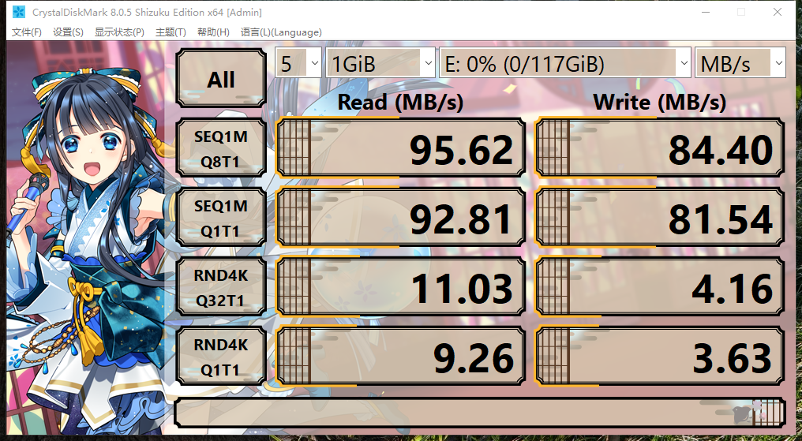
>
>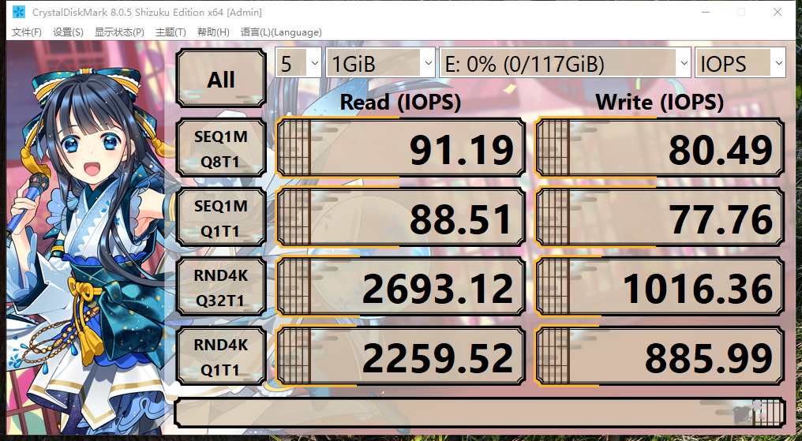
>
>**移速（MOVE SPEED）** 这张卡速度甚至比三星还快。~~这是用空间换时间了吗？~~ 某些 A2 存储卡，实际测试 4k 读写只有不到 1.5MB/s，快赶上那个金士顿 DT100G3 了。这已经不是虚标的问题了。
>
>但是经过实测，移速 128G A2 U3 V30 128G 存储卡，仅仅写入约 60 GB 就会掉盘。变成这样：
>
>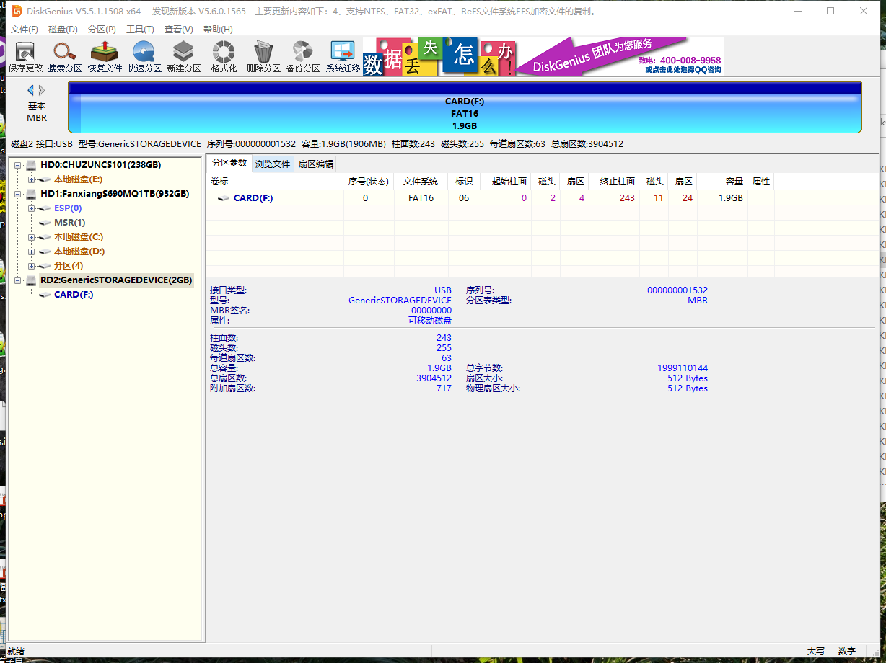
>
>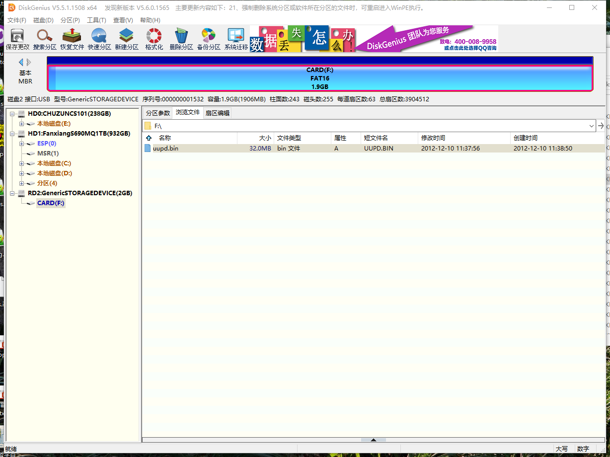

## 如何测试存储卡和硬盘？

我们可以用 `CrystalDiskInfo` 查看硬盘的 S.M.A.R.T. 信息及基本参数。还可以用 `CrystalDiskMark` 测试硬盘和存储卡的读写（请使用 USB 3.0 的读卡器！）

上述两款软件是同开发者开发的，但是其 [官方网站](https://crystalmark.info/en/) 不知道为什么，插了很多虚假广告，诱导下载错误的文件。

请从 **[这里](https://sourceforge.net/projects/crystaldiskinfo)** 下载 CrystalDiskInfo；请从 **[这里](https://sourceforge.net/projects/crystaldiskmark/files/)** 下载 CrystalDiskMark；

而 **不要** 去访问他的网站，因为上面才是最终存放文件的地方，你访问网站最终也会被转跳到这里。

在撰写本文时，笔者下载使用的是 `CrystalDiskInfo9_3_2Shizuku.exe` 和 `CrystalDiskMark8_0_5Shizuku.exe`。因为好看，如果不需要花哨的颜色，你可以分别选择“CrystalDiskInfo9_3_2.exe”、“CrystalDiskMark8_0_5.exe”代替之。

>**注意**
>
>在选购固态硬盘时，不能一味地看读写速度，这没有意义，因为市面上的固态读写速度都大同小异。更重要的是要看固态的主控、NVMe 协议版本及支持状态。
>
>比如大多数杂牌固态都不会支持 ASPM（Active State Power Management，活动状态电源管理）技术。此技术能在保证固态运行效率的情况下尽可能地对固态进行降温，实际测试可降温约 20 ℃。而一些杂牌固态，因为无法很好的适配，开启后就会掉盘，于是主动对该技术在固态的固件中予以关闭。
>
>还有一些杂牌固态仍在使用 NVMe 1.4 协议版本。甚至连硬盘的序列号都是一模一样的，硬盘序列号的重要性可比网卡的 MAC 地址，绝不允许重复，否则会造成无法识别多块硬盘的后果。

### 使用 CrystalDiskInfo 查看梵想 S690（1TB）NVMe SSD PCIe4.0 硬盘参数

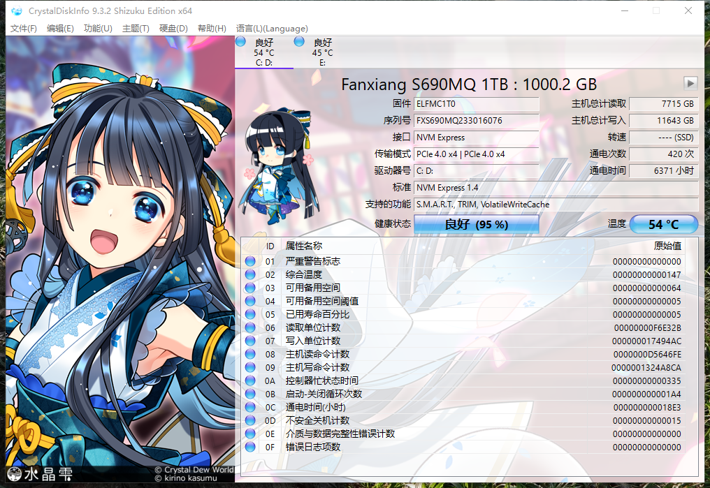

### 使用 CrystalDiskMark 测试梵想 S690（1TB）NVMe SSD PCIe4.0 读写速率

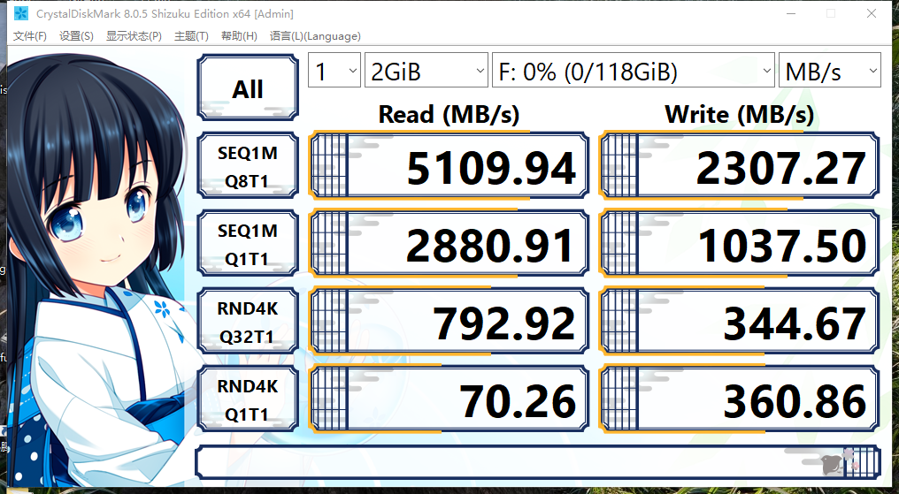

### 使用 CrystalDiskMark 测试雷克沙 1066x A2 U3 128GB 存储卡读写速率（使用 USB 3.0 读卡器）

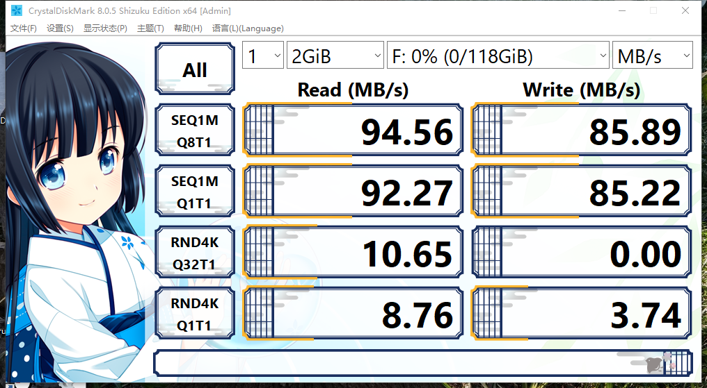

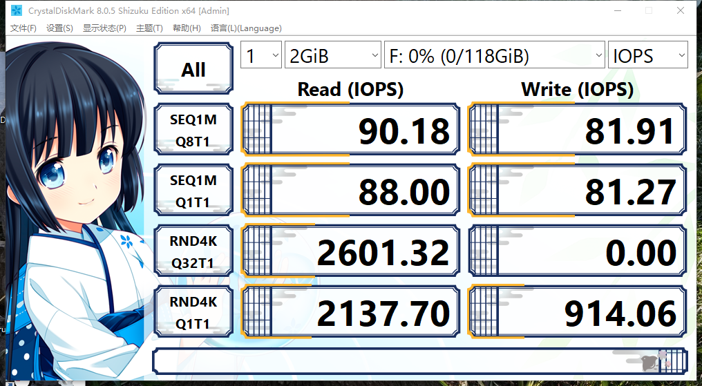

可以明显地看到，雷克沙 1066x A2 U3 128GB 存储卡实际测试与页面标称严重不符：标称 A2，应达到读 4000 IOPS，写 2000 IOPS。实际上，无论随机读还是随机写都只有一半；连续读写更是无稽之谈。这是为什么？

#### 任何速度超过 104MB/秒的 microSD 存储卡无意义

这是为什么？一方面因为使用的不是超频读卡器（即雷克沙配套的读卡器，用于支持其自定义协议），因为 UHS-I 协议速度上限是 104MB/秒（SDR 104），任何存储卡在理论上无法超越，除非使用 UHS-II（两排金手指），但是对于 microSD 来说，几乎没有使用 UHS-II 的，只有标准大小的 SD 卡才有（相机使用）。故，市场上无论三星还是闪迪，只要速度超越了 UHS-I 速度上限，又非 UHS-II，必定是使用了非标准的协议。**这种非标准协议只有他们的官方读卡器才能支持（售价极高且一般捆绑销售）。其他设备都是不支持这种速率的，故没有意义。**

### 使用 CrystalDiskMark 测试三星 BAR 升级版 + USB3.1 闪存盘 64G 读写速率

即金属款。

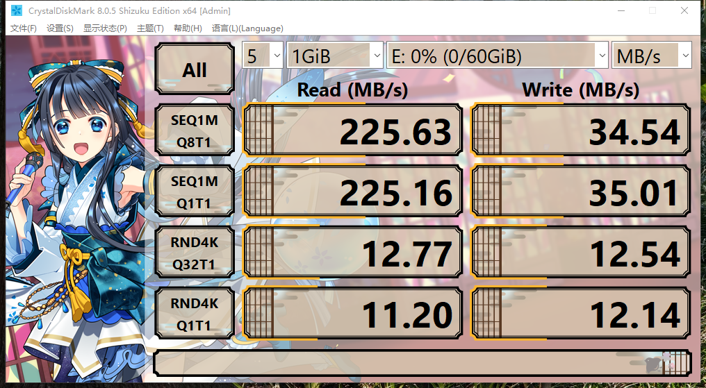

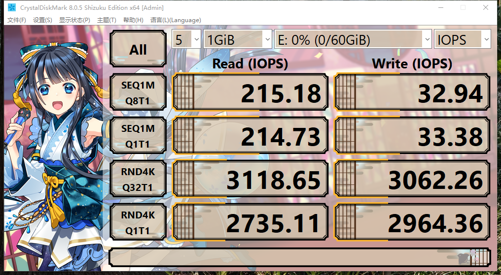

## 参考文献

- [Raspberry Pi 树莓派中文文档](https://rpicn.bsdcn.org)
- [Inside the Raspberry Pi: The story of the $35 computer that changed the world](https://www.techrepublic.com/article/inside-the-raspberry-pi-the-story-of-the-35-computer-that-changed-the-world/)
- [SD 卡和 microSD 卡类型指南](https://www.kingston.com/cn/blog/personal-storage/microsd-sd-memory-card-guide)
- [SD 卡 和 microSD 卡速度等级指南](https://www.kingston.com/cn/blog/personal-storage/memory-card-speed-classes)
- [了解 SD 卡和 microSD 卡的命名惯例和标签](https://www.kingston.com/cn/blog/personal-storage/microsd-sd-memory-card-naming-conventions)
- [電腦概論中的考古題，關於光碟機的倍數是指什麼](https://www.mobile01.com/topicdetail.php?f=300&t=2126605&p=3)
- [移速（MOVE SPEED）64GB TF（MicroSD）存储卡测试](https://www.bilibili.com/read/mobile?id=21681916)
- [移速这个卡虚标了，速度只有标注的二分之一](https://post.m.smzdm.com/talk/p/az6o8zkr/)
- [Mvespeed 移速 400G 内存卡简单测评](https://post.m.smzdm.com/p/arq759g7/)
- [移速 TF 卡翻不翻车？看来没翻（附游戏测试）](https://post.m.smzdm.com/p/awzqn9z4/)
- [闪迪至尊超极速移动 ™ microSDXC™ UHS-I 存储卡 - 128GB](https://www.westerndigital.com/zh-cn/products/memory-cards/sandisk-extreme-pro-uhs-i-microsd?sku=SDSQXCY-128G-ZN6MA)（参见注释 8：“采用专利技术”）
- [存储卡也超频？实测结果非常意外](https://mp.weixin.qq.com/s/CMioVrUx0YJbF_v7zvQMRA)
- [BAR 升级版 + USB3.1 闪存盘](https://www.samsung.com.cn/memory-storage/usb-flash-drive/usb-3-1-flash-drive-bar-plus-64gb-titanium-gray-muf-64be4-cn/)

