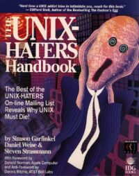

# 前言

## 目标平台

目前版本兼容 FreeBSD 14.2-RELEASE 及 FreeBSD 15.0-CURRENT，并尽量向下兼容。

主要面向 x86-64（amd64）、AArch64（arm64），并尽可能多的支持其他体系平台。

Windows 测试环境为 Windows 10、11，并尽量使用最新版本的 Windows。

## pkg 与 ports

因为 FreeBSD 有两种安装软件的方式（但个别软件不支持 pkg 安装）：因此为了方便，在本教程中已经尽可能地列出了两种方式的安装说明。但希望大家明白，只是为了方便，而并非不能使用 ports 或者 pkg 进行安装或必须使用二者其一进行安装。

## 本书中命令及符号含义

`#` 代表 `root` 下的操作，基本等同 `su`、`sudo` 和 `doas`。

`$`、`%` 代表普通用户账户权限。

>**注意**
>
>提示一些注意事项。

>**技巧**
>
>提示一些技巧。

>**警告**
>
>如果不知道、不做就无法完成或造成重大危害的事项。

---

章节：

```
故障排除与未竟事宜
```

旨在将现存的问题和改进的方向/建议或谜团留置其中，以期后人的智慧。

## 对用户的要求

以高等院校计算机科学与技术学科一般本科毕业生所能达到的及格或及格以上水平为编写难度基准。

## 本书定位

本书涉及了 FreeBSD 14.3-RELEASE 和 13.5-RELEASE 的安装和日常使用，还包含一些 15.0-CURRENT 的内容。

## 参考书目

相关书籍：新的变化也不是很大。不像 Linux 有这么多入门书籍。出于历史上的原因，看 UNIX 相关书籍即可。


> **技巧**
>
> 以下有多本书籍可通过微信读书免费阅读。


| 封面 | 书名 | 作者 | ISBN | 出版社 | 说明 |
| :---: | :---: | :---: | :---: | :---: | :---: |
| | 《FreeBSD 技术内幕》 | Brian Tiemann、Michael Urban | 9787111102010 | 机械工业出版社 |  2002 年的书，居然还能用。你该说 BSD 没有发展，还是该说他稳定？本书推荐选读第 1、4、8、9、10、11、12、13 章|
|  | 《Unix & Linux 大学教程》 | Harley Hahn | 9787302209560 | 清华大学出版社 | 命令行基础 |
|  | 《UNIX/Linux 系统管理技术手册（第 5 版）》 | Evi Nemeth、Garth Snyder、Trent R.Hein、Ben Whaley、Dan Mackin | 9787115532763 | 人民邮电出版社 |命令行进阶与 UNIX 基础 |
|  | 《FreeBSD 操作系统设计与实现（原书第 2 版）》 | Marshall McKusick、George Neville-Neil、Robert N.M. Watson | 9787111689973 | 机械工业出版社 |  主要讲解了内核。轻型纸，居然还有几个章节要自己在网络自己下载？ |
|  | 《UNIX 编程艺术》（TAOUP） | Eric Raymond | 9787121176654 | 电子工业出版社 | 主要讲解了 UNIX 的设计哲学与软件工程理论。 |
|  | 《大教堂与集市》 | Eric S. Raymond | 9787111452478 | 机械工业出版社 | 主要介绍了开源运动的发展史。 |
|  | 《4.4BSD 操作系统设计与实现》 | Marshall Kirk McKusick | 9787111366478 | 机械工业出版社 | 4.4BSD 操作系统设计与实现 |
|  | 《深入理解 FreeBSD 设备驱动程序开发》 | Joseph Kong | 9787111411574 | 机械工业出版社 |  FreeBSD 设备驱动程序开发 |
|  | 《UNIX 环境高级编程（第 3 版）》 | W. Richard Stevens、Stephen A. Rago | 9787115352118 | 人民邮电出版社 |  深入了解驱动 UNIX 内核的编程接口的实用知识 |
|  | 《UNIX 网络编程 卷 1：套接字联网 API（第 3 版）》 | W. Richard Stevens、Bill Fenner、Andrew M. Rudoff | 9787115367198 | 人民邮电出版社 | 如何使用套接字 API 进行网络编程 |
|  | 《UNIX 网络编程 卷 2：进程间通信（第 2 版）》 | W. Richard Stevens | 9787115367204 | 人民邮电出版社 | 深入了解各种进程间通信形式。**这书原作者没出第 3 版，不用再找了** |
|  | 《深入理解 UNIX 系统内核》 | Uresh Vahalia | 9787111491453 | 机械工业出版社 | UNIX 内核基础 |
|  | 《Unix 四分之一世纪》|  Peter H. Salus | 9780201547771| Addison-Wesley Professional | 历史书，中译本在[此](https://freebsd.gitbook.io/unix-er-shi-wu-nian) |
|  | 《Unix 痛恨者手册》 | Simson Garfinkel、Daniel Weise、Steven Strassmann | 9781568842035 |  IDG Books Worldwide, Inc. |  历史书，中译本在[此](https://book.bsdcn.org/unix-tong-hen-zhe-shou-ce) |

### 选读书目

| 封面 | 书名 | 作者 | ISBN | 出版社 |说明 |
| :---: | :---: | :---: | :---: | :---: | :---: |
|  | 《UNIX 传奇——历史与回忆》 | Brian W Kernighan | 9787115557179 | 人民邮电出版社 | 主要讲解了 UNIX 的发展历史。写的比较粗略。 |
|  | ***Absolute FreeBSD 3rd*** | Michael W. Lucas | 9781593278922 | No Starch Press |英文版，目前没有译文。词汇包括内容都非常基础。切记，有计算机基础的人不需要阅读。 |


## 本书的组织结构

**第 1 章 FreeBSD 初见**

围绕自由软件运动与开源运动，为读者介绍 BSD UNIX 的历史与哲学。

**第 2 章 安装 FreeBSD**

指导用户在物理机、虚拟机、云平台以 `bsdinstall` 或手动方式安装 FreeBSD。

**第 3 章 FreeBSD 基础**

涉及一些 Unix 基础知识和 FreeBSD 特色功能。主要面向 Windows 用户和 Linux 用户。即使你认为自己掌握了一些，也应该阅读一下。

**第 4 章 包管理器与系统更新**

本章涵盖：使用 pkg 命令安装二进制包，使用 Ports 编译安装软件；系统更新。

**第 5 章 桌面环境**

尽可能地罗列了所有可在 FreeBSD 上运行的桌面环境和窗口管理器。

**第 6 章 中文环境配置**

包括中文输入法和中文世界常用软件，如 QQ、微信和 WPS。

**第 7 章 多媒体与外设**

如何使用 FreeBSD 进行音视频播放功能。还讲解了蓝牙、打印机等常用设备。

**第 8 章 代理服务器**

中文世界不可或缺的一类软件。

**第 9 章 Jail**

FreeBSD 的特色功能。

**第 10 章 虚拟化与容器**

主要讲解了 FreeBSD 上的虚拟机以及容器。

**第 11 章 计算机概论**

考虑拆分此章节。

**第 12 章 引导恢复与 TTY 配置**

考虑拆分此章节。

**第 13 章 FreeBSD 系统管理**

考虑拆分此章节。

**第 14 章 网络管理**

IPv4、IPv6 及常用网络命令。

**第 15 章 FreeBSD 防火墙**

FreeBSD 防火墙

**第 16 章 服务器**

一些非 web 服务器。

**第 17 章 网络服务器**

常用的网络服务器和监控平台。

**第 18 章 嵌入式（树莓派、RISCV）**

主要介绍了如何在树莓派、RISCV 等设备上运行 BSD。

**第 19 章 文学故事**

一些往事。

**第 20 章 游戏与科学**

游戏和科研教育工具。

**第 21 章 Linux 兼容层**

如何在 FreeBSD 上运行各式 Linux。

**第 22 章 编程环境与软件开发**

如何在 FreeBSD 上搭建各种常用开发环境。

**第 23 章 文件系统与磁盘管理**

主要介绍了 ZFS、UFS 以及常见的 Windows、Linux 文件系统的使用方法。

**第 24 章 DragonFly BSD**

面向桌面用户和 X86 平台的蜻蜓 BSD。

**第 25 章 TwinCAT/BSD**

倍福自动化。

**第 26 章 OpenBSD**

一款安全至上的操作系统，OpenBSD。

**第 27 章 NetBSD**

NetBSD。


