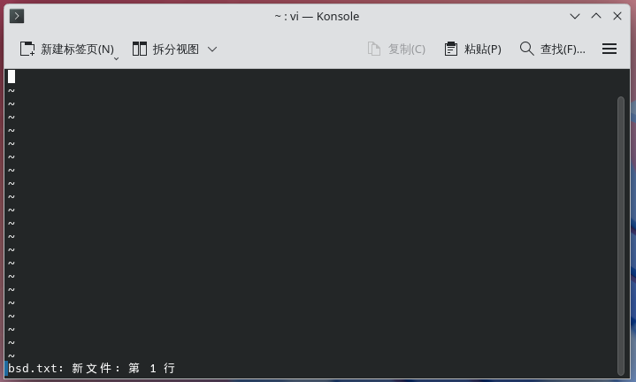
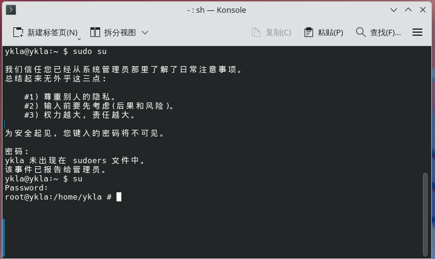

# 致读者：解放思想，回归本真，高扬人道主义，不走苦难哲学的邪路

对大部分读者而言，理解全文可能是困难的，甚至是不可能的。“与恶龙缠斗过久，自身亦成为恶龙；凝视深渊过久，深渊将回以凝视。”因此，阅读此文本身或许会被视为一种“苦难哲学”的体验。若读者在阅读过程中感到障碍，大可跳过相关段落乃至全文，直接寻找所需内容即可。

## 你并不孤单

两个经典问题是：

- 1.“vi 到底怎么退出？”



一眼望去，整个界面没有任何操作提示或帮助信息。

作为与记事本同属文本编辑软件，vi 在保存与退出方面对初学者而言并不直观，其编辑操作也更为复杂。

>**思考题**
>
>我们讨论的究竟是 vi、nvi、Vim，还是 Neovim？在发行版中，它们可能都被链接到 `vi` 命令。对于上述发行版，vi 是真实存在的吗？当我们讨论“vi”难用时，我们究竟在说什么？


>**思考题**
>
>回溯历史，分析为何 vi/vim 必须先按 **ESC 键**，再输入英文冒号 `:` 和字母 `q`（强制退出需加叹号 `!`），最后按 **回车键** 才能实现不保存退出。这种技术债务应如何被理解，其历史设计所带来的代价又应由谁来承担？


>**思考题**
>
>>有人将 vi/vim 与其他编辑器比作 F1 赛车和家用小轿车的区别。也有人将 vi/vim 与其他编辑器比作“五笔输入法”与“拼音输入法”的区别。
>
>你认为上述比喻间存在根本差别吗？
>
>>如果一件事物想要被更多人所使用，被大众所接纳，而不是固步自封自诩“F1 赛车”或“高端学术论坛”等类似存在，那么它势必要在功能性与用户友好之间进行取舍，而这种“退化”又几乎是必然的，因为这会将其拉到大众平均水平，无论是认知还是其他。即使是一向只有业内人会使用的专业软件，也始终有更大众化用户体验更佳的版本对其进行挑战。
>
>>哪怕是 F1 赛车也在速度与安全性（如 HALO 系统）之间存在张力，这何尝不是一种用户友好设计呢？有人自称 F1 赛车是“手动挡”，其实这也是一大误区，F1 赛车既不是手动挡也不是自动挡，而且将二者结合的“手自一体”。并且 FIA 在历史上确实对这两种方案都分别进行过应用。一个显而易见的事实是，无论是纯粹手动挡还是纯粹自动挡都会影响 F1 的公平性与观赏性。如果单纯考虑速度，那么自动驾驶技术无疑才是最佳路径。但这在事实上取消了比赛，或者将其转为了遥控车大赛。因此问题绝不在于 F1 为什么不是自动挡，这是一个伪问题和虚构想象。也可以看出，FIA 始终以观赏性优先，而不是一味地追求最佳的速度和成绩。因此 F1 和其他传统体育竞技存在一种张力，必须考虑用户友好性且视之为决定性因素，不仅体现在观众接受度，也在于竞技本身的风险远高于其他体育运动。如果他不考虑用户友好为首要优先级，那么观众必然会拒绝这种形式的比赛，那么整个比赛就会自然地被市场取消掉。在这种意义上，奥地利红牛对极限运动的赞助同样也是为了获得这种在市场上的支配地位而牺牲了一定的安全性，或者根本就是不安全。在这种比赛中，参赛者的用户友好性被异化为了观赏者的用户友好性。旁观者总是期待更极限的比赛。用户友好性不会被取消，只会被资本转移。由此可以得出一个有争议的判断：某些高度商业化的赛事并非以人的主体性发展为核心，而更侧重于资本化运作。如果仅从运动本身进行分析，就会落入被包装好的陷阱。这种比赛是不人道的。一个简单的道理就是，观众爱看什么，他就应该怎么发展，否则自身存在的合理性将彻底失去。一切以资本化和效率化优先。
>
>>要发展体育必须取消体育。体育的真实性和竞技性是存在张力的，如果你认为某些靠激素药物等人体“增强体育”是违背真实性的，那么他的确提高了竞技性，且这无关伦理取向，是职业体育盲目的必然的追求。传统体育会强调竞技的教育功能，认为可以带动群众运动健身。现在实践证明，这完全是荒唐的观点，造就了这种只是为了排名和荣誉，并非为了发展体育事业的扭曲局面。你必然可以筛选出成绩异常优秀的运动员，但是他对于人类的体育事业来说，毫无意义和作用，体育事业沦为政治的牺牲品。他只会使全国的体育资源高度集中到几个人身上。你必须承认这实际上就是一种表演赛，职业体育的公平公正只是虚伪的，只是相对于业余原则下的体育更加隐蔽罢了。每个人的自由时间，身体素质，拥有的场地环境，接受的体育教育都是不同的，并且差异比狗和人都大。体育运动职业化将永远只有少部分头部运动员享受了高度集中的资源和资本。这对所有人包括他们自己以及观众都是不公平的。所谓“全国运动会”，他分明是职业运动员的运动会，职业运动员职业水平评定大会。这种情况下，将其称为“全国运动会”是否恰当，值得商榷。
>>
>>体育精神不是一种形而上的东西，他本质上是使人发展的物质力量。而现在的专业化职业化国家化的运动员才是真实违背了体育精神的存在者。使体育转向场外为核心才是真正的全民体育，发扬了奥运精神。现在问题是使得场外人成为了观众而不是参与者，也没有自由时间成为参与者，观看他们的比赛也不过只是不拿工资的被异化的非参赛运动员罢了，甚至观众被讥讽“旁观者的姓名永远爬不到比赛的计分板上。”他们意识不到，如果没有观众，他们的比赛本身就是不成立的。他们没有意识到，如果没有观众，连计分板也不会存在，比赛本身也会被取消掉。他们更没有意识到，无论观众在形式上在不在场，观众本身即是比赛不可或缺的一部分，比赛可以没有运动员，可以没有裁判，但是观众是必然的。持有这种认为观众是旁观者而非参与者，运动员本身的观点，是不可理解的。
>>
>>如果你真的认为用户友好是次要的，你所谓的专业性 = 复杂性 = 困难性 = 学习曲线陡峭，那么理应支持“增强运动会”。因为无论怎么看，“更快更高更强更团结”带来的无疑是这种“增强运动会”，在 1990 之前奥运会在反对职业运动员（纯业余原则）的时候，顾拜旦究竟在反对什么呢？应该取消职业运动员。这违背了真正的奥林匹克精神，本来就是为了让普通人拥有健康的身心，通过体育促进世界团结“更团结”，现在变成了一小撮的人狂欢，反过来异化大众，侮辱大众。说探索人类极限也是伪命题，那是生物学的事情。而且本身大部分比赛都禁止人类增强技术。他和体育的精神完全相悖。本身是鼓励所有人运动，参与，而不是围观别人。而且现实是通过围观别人促使自己也有想法的例子微乎其微。让一些人花很长时间投入到体育项目本身，取得更好的成绩，而不是去发展这个项目本身，本身就是一种异化。甚至连规则都不研究，等自己吃亏又奋起，而且发展了这么久话语权寥寥。除了沦为表演赛和政治工具，究竟还有什么用处？
>>
>>这和电子竞技一样荒谬。一排五个人的网吧还收费，去现场看投影仪？一群人看他们怎么露天打游戏？真打假打还不一定。他有每次找公证处公证都是真打吗？所有人都想当第一，这是可能的吗？而只要不是第一，就绝对的等于失去一切。不明白体育等级的意义是什么。而且看人打和看一个同等水平 AI 打的本质区别是什么？从最早的足球，乒乓外交，女子排球，甚至也搞过全民棒球。在一些体育商业属性有待发掘的国家，历史上体育运动的发展几乎完全不取决于体育事业本身的发展，其发展方向和资源分配过去完全由政治目标决定，商业和群众体育的价值被边缘化，最终导致了体育异化和资源浪费。而我们注意到，体育商业化不仅无法扭转这种异化，反而会加重。因此，取消体育是必然的合理的，是符合历史与现实的。
>
>你怎么看待这种现象？以及为什么说“退化”是必然的？当我们在进行比喻时，是否真正了解进行比喻的对象（有人误以为 F1 赛车是手动挡，只考虑速度不考虑用户友好）？业余原则究竟是虚伪的，还是现实的？有这种本质区别吗？
>
>>用户友好还体现在“防呆”或者“失效安全”上面，无论是机械工厂、核电站、加工厂、还是建筑工地，军事设施，盾构机施工现场，高铁机车，地下金库/冷库，你都会发现这种用户友好并不是一种抽象的概念，也并非是一味地取悦用户：
>>
>>- 机械工厂大部分需要切割的机器都需要两只手分别按在两个方向才能启动，并且会检测是否是真手，而非其他重物；
>>- 核电站的大部分操作都需要不同的人进行确认核验；
>>- 加工厂有的地方必须要戴手套，而有的地方则严格禁止戴手套；
>>- 军事设施也有类似机械工程的设计；
>>- 盾构机施工现场在施工完一般就会就地掩埋，并且其存在本身就是一种用户友好。
>>- 高铁机车要求驾驶员在特定时间内都必须踩下踏板，必须口呼手指。
>>- 地下金库/冷库都会检测入侵，防止人员被意外关在门内，内部还有电话、棉毯、消防斧等物品。
>
>你能否自行举出更多例证？归纳推理不具有普遍必然性。我们有必要通过演绎论证进一步探讨用户友好在各领域的合理性，此任务留给读者自行完成。


- 2.“我的密码为什么一直输入不了？”



因为屏幕上的密码输入区域始终是空白的，连 `****` 这样的掩码都不会显示，即无任何视觉反馈，其设计便是如此。

提示语“密码不可见”在语义表达上不够明确。

实际上，早在 2007 年，常用的提权工具 sudo 就已提供 `pwfeedback` 选项来启用此功能，但默认启用该选项的发行版寥寥无几，且其相关代码曾被报告存在多个 CVE 漏洞。

>**思考题**
>
>大多数发行版倾向于不使用 `pwfeedback` 的一种原因是其相关代码可能会引入更多的安全漏洞。你认为是 sudo 让我们陷入了平衡安全与便捷的讨论泥潭，还是 sudo 本身设计有问题？了解那些替代实现（[sudo-rs](https://github.com/trifectatechfoundation/sudo-rs)、[doas](https://man.openbsd.org/doas)），你能否在保证安全的前提下，为这些工具实现 `pwfeedback`？如果在现有的安全模型下永远也无法实现，你认为我们还能做些什么？

许多人经常打错或混淆命令、参数及选项，但这并非读者的错。

在当今时代，一些中科院院士仍需要学习如何使用计算机和手机，并可能感到操作不够便利。你或许认为这是设计问题，但如何解释同一年龄群体（老年人）却能熟练操作短视频应用呢？这是否在一定程度上说明，短视频类软件在用户体验设计上更为友好？

由于许多命令或受历史条件限制，或受开发者和维护者能力所限，其设计并不统一，也不便于记忆或使用。从历史角度看，上述命令的设计或许是当时的“最优解”。我们常见的家用门锁，在输入的密码中，只需要包括正确的密码片段，即可开门。而今日操作系统的某些提示依然违背最小惊讶原则（不应让用户承担糟糕设计带来的后果）。

>**思考题**
>
>你认为这种评价是公允的，还是“事后诸葛亮”？你怎么看？

查询 [man 页面](https://man.freebsd.org/cgi/man.cgi) 就会知道专门有个条目叫“BUGS”，专门用来表述当前软件的缺陷。

就笔者个人体验而言，若一款开源软件几乎没有严重影响使用的 Bug，往往并不符合人们对典型大型开源项目的常见印象。大多数维护者对此无能为力，因为 Bug 数量过多，或现实情况令人迷茫，且他们缺乏进行修缮的经济动力。绝大多数拥有百万乃至千万用户量的开源软件，其维护者大多从未从中获得任何经济报酬或显著声誉。

>**思考题**
>
>我们常面临的现实是，维护者一意孤行，拒绝或反对你的 PR（拉取请求）。说服他们几乎不可能，而独立分支又不可行。在这种情况下，问题似乎是无解的。

>**思考题**
>
>那些大公司是否应出于道德义务为开源软件提供经济支持，而非仅通过代码贡献来逐渐掌控其发展方向？

请相信笔者，你并不是一个人觉得这些东西难用，甚至想砸键盘。这也是人们不断“造轮子”（重头实现一款工具）的原因之一。如果你觉得 GCC 难用，那么可以改用 Clang/LLVM。你绝非第一个感到 GCC 难用的人，也不会是最后一个。

很多人强调命令行的重要性，并以傲慢态度鄙视使用 IDE 等 GUI 软件的用户，这实无必要。许多人会故意唱反调，强调这些工具的所谓优势。这类观点有时表现出对高使用成本的过度合理化倾向，可被视为一种“苦难哲学”的体现。Unix 的哲学精髓不在于恪守亘古不变的祖宗之法，而是强调以人为本。这就是在今天，21 世纪的四分之一处，我们仍需强调 Unix 哲学意义的原因。大多数人都被苦难哲学所蒙蔽，一味强调追根溯源，恨不得从计算机的 0 和 1 开始做，而那些看似清醒的人，实则更为糊涂。“人是会思想的蒹葭”，我们不是只能被动接受而不去改变的主体，我们有责任有义务去改造这个世界，改变这变态的一切，而不是让人强忍不适接受一套蹩脚的设计原则。面对不合理的设计，我们有必要站出来说一句话：“这个软件在设计上确实存在问题，这不是你的错。”。我们可以不断尝试改变这一切，通过提交补丁和反馈来表达我们的态度。

一种十分经典的观点认为：“必须完全掌握某些命令行工具或传统的编译环境，才能彻底理解 UNIX 操作系统”。其中的工具之一就是 vim。在今天讨论图形界面与命令行的优劣，实际上会让我们错失重点，最终得出的平凡且看似理性的结论，无非是二者在不同环境下各有其用。笔者真正质疑的是一种优绩主义（其核心观点是类似能者上，庸者下的社会达尔文主义），凡是命令行就一定是难用的，凡是选项就必须要背诵的这种观点，凡是要精通就必须走这条路，凡是偏好图形化界面和桌面用户就要对其进行无端攻击。无论是基督教主张的超越性的爱世人、爱神，儒家的有差等之爱，还是墨家的无差别兼爱，都启示我们：长久以来，这样做并无益处。计算机应服务于人类，而非规训人类。归根结底，不应让大部分人被极小群体的黑客文化所异化。过去大多数人难以接触计算机，无法获得良好教育，这本质上滋养了一种文化霸权，亦是文化不自信、“缺钙”的表现。凡是圈子越小的地方，这种话语权垄断现象就往往越是严重，越是脱离大众文化，背离大众单纯朴素的认知。而我们要做的就是正视一切神话，没有任何天然的，如此的，神圣的不可侵犯之存在。这看似是观点冲突，实则是不同文明间的碰撞。这本质上或许是工业文明对效率优先、压制一切人性的渴求。理解这种观点的要义在于，它将所有的人的人生目标都一律统一定义为“我要成为第一名”，一律否定“我只是普通用户，为了好玩，我不想学什么编译原理”这种大部分人的实际预设，它决不会允许你不会任何命令行就能在操作系统上实现你的一切合理需求。凡不会使用者，皆被视为末位淘汰，被筛选和过滤掉。我们使用技术、发展科学，是为了解放人类，而非让科技代替宗教或儒学，重新奴役人类。更非为了让走出大山的人，去嘲笑仍留在山里的人。


>**思考题**
>
>>“撰写简洁的程序—不要耍小聪明”。
>>
>>——Brian W. Kernighan, P. J. Plauger. 编程格调［M］. 北京: 人民邮电出版社, 2015: 2. ISBN：9787115379528。
>
>你认为这称得上一种用户友好设计吗？AI 编程有无必要遵守此种风格？

只要人们用得快乐、开心，又有何不可呢？人们总强调，这些是知识，应当背下来。真正的问题在于：何为知识？知识与学位是挂钩的吗？那你如何解释大多数本科毕业生分不清显示器与主机？

美国哲学家 B.F. Skinner 曾言“教育就是当一个人把在学校所学全部忘光之后剩下的东西。”不同于强调记忆的传统西方观念（如柏拉图的回忆说、奥古斯丁的光照与上帝记忆、洛克的白板说）、儒家学说（如“学而时习之”）乃至民俗（如孟婆汤致失忆），庄子更强调“忘”——这也是对老子“行不言之教”（《道德经》第二章）的发挥。庄子在《逍遥游》中强调“小知不及大知”，我们日常所学大抵皆是“小知”。庄子认为，无论古今，学习在根本上都是外物对人的异化；人所接受的是现代社会的规训，是工业革命的文化，而非真知。

>**思考题**
>
>本书已尽量列出日常所需的命令和选项。
>
>一个命令的选项或参数可能有数十上百个，而字典或文档（无论是 man 还是 info）是供查阅而非背诵的。
>
>你如何看待“吾生也有涯，而知也无涯。以有涯随无涯，殆已”（《庄子·内篇·养生主第三》）？

人们曾认为工业化和互联网会加速世界形成“地球村”。从 2G 通话到 3G、4G 视频通话，“在一起”的渠道已然畅通。但你会真切发现，找到一个能说上话的“人”，依然是不可能的。我们会明白，真正决定距离的不是时间，不是空间，也不是科技水平，更不是我们有没有时间，而是我们自己。当你读到书中这些文字时，或许 FreeBSD、乃至操作系统这个概念，包括计算机本身，都已消亡。但你会发现，这里有一种声音在告诉你：你是对的。你并不孤单！

一切苦难都不值得被提倡，那只是一种类似宗教救赎的神话叙事结构。苦难并不会使人变得优秀，只会让人隐藏真实的主体性。在这种结构中，苦难被别有用心者包装成为通达幸福的必由之路。即便在宗教内部，如佛教面对苦难也分裂为两派对立的观点。苦难即是莱布尼茨所论世界中的“恶”，也是一个恒久的神学命题。我们可以看到，苦难无处不在。这些“恶”与我们的幸福之间存在强大的张力。历经苦难者，其主体性已被苦难所异化。提倡这种恶，表面上的唯一可取之处在于一种超越的可能性。然而，这种超越性反而否定了苦难本身的合法性。这种超越性不以苦难为目的，仅将其当作通往彼岸或来世的方法。综上，凡是强调苦难意义、推崇苦难本身者，皆有其潜在的龌龊目的。它强调人们去适应甚至病态地享受一切苦难，而非高扬人的主体性去改造世界，亦不相信这种主体性的真正力量，这实际上背叛了人民。恶无处不在，问题不在于与恶和解，而在于认清其存在的根源。不要因为自己曾与恶龙缠斗太久，便将这种战斗视为必然。不愿正视苦难之无意义，其本身就是一种形式主义。恶仅充当了叙事合法性的形式，却无视了神话最终指向的至善与幸福。这最多只能充当精神鸦片，维持人片刻的稳定。这反而更说明恶存在的现实基础，但这绝不意味着恶值得推崇和提倡。这种“苦难哲学”的目的不在于发展人，而在于筛选人，并赋予被筛选者一种神圣感与道德优越感。使之看似拥有了批判那些拒绝被苦难化之人的合法叙事武器。需要反思的是，苦难哲学的本真性意义究竟是什么？是理解一种虚构世界的秩序与规则不可更改，还是认识到存在一个满目疮痍的真实世界，将人消解为其中破败的一分子？一个简单的事实是，人是“会思想的芦苇”，是能够制作、使用并发展工具以改造世界的。对于任何质疑这一事实的苦难观点，我们都有必要考量其背后不可告人的真实目的。真正能发展人、解放人的从来不是苦难，而是人自身的主体性——它让人认识到自己是谁、想做什么、如何获得幸福与快乐。真正值得推崇的社会是具有包容性的社会，能让人老有所养、老有所为、老有所依，而非让人适应孤独与死亡。在这种苦难哲学下，人失去了一切反抗的行动力与实践的可能性。必须警惕这种“苦难哲学”的道德宣言与方法论。这是一条反对革命与改革、用于消解潜在革命火种与改革动力的邪路，是既得利益者对权力再分配的实质拒绝，亦是背离人民群众、背离解放的邪路。一个简单的表述可能是“苦难能不能发展人我不知道，但是苦难绝对能让人不再是个人”。值得宣扬的从来不是苦难本身，而是在面对一个充满“恶”的世界时，仍保有试图让其更美好、包容更多人的主体性，并思考如何避免他人陷入同样的苦难，推动社会与政策的革新。人类总是乐观的，反对虚无和宿命，这不在于人类认识不到恶的存在，而在于认识到之后，在面对恶时，人类文明不会屈服，不相信自己无能为力。无论中国神话中的精卫填海、愚公移山、大禹治水，还是《圣经》中的诺亚方舟、巴别塔建造，都说明先民面对恶劣世界时，并非一味祈求神祇、图腾、圣物或祖先帮助，也非宣扬“苦难哲学”的必要性。先民认识到，真正的尘世并无净土，“上帝之城”仅存于书卷，一切都要靠自己的双手创造。人类绝不应将自身成就归因于苦难，而应正视自身的伟力。认识到苦难的普遍性与不可避免性，与反对苦难本身并无矛盾。这绝不意味着苦难是不可或缺的。最荒谬的现实是，让人人都承受本不必要的、人为施加的苦难，最后却发现自己仅是普通人。这是“苦难哲学”的真正破产，因为“人人如龙”是不切实际的幻想，苦难无法使之改变；而“苦难哲学”却又宣称，你受的苦不及他人，故无资格发言。那么谁有资格？靠优绩主义吗？你找不出这样一个人，因为他在逻辑上根本不存在。这一点在察举制时期便已被古人察觉，如“二十四孝”中的卧冰求鲤（一说剖冰）。可见，这是一种彻头彻尾的谎言与骗局，其核心主旨在于遮蔽人的思想，规训人的身体，消解人的主体性。

如果你读完本书后全部忘光，只知用 AI 查询命令用法，或干脆“从入门到跑路”，那么，祝贺你！你已掌握了本书最精髓的部分。

对于一本自诩应归类于“TP316.81”的书籍，书中大量可复制粘贴的内容，可能在撰写时便已过时。但我相信，无论你反对抑或支持，其实都不重要。我们必须承认，我们对世界唯一确知的事情，便是我们一无所知。

对于那些希冀从本书中获得具体计算机原理、实现或类似词典的工具书的读者，可能会感到失望或认为本书毫无价值。这都在预料之中。因为笔者亦不擅长，更毫无兴致。在漫漫时间长河与人类文明中，即便你是科举状元，也难留下痕迹。哪怕你是统一大陆的征服者，也将深埋地下，甚至被后人怀疑你与你的帝国是否真实存在。古埃及人认为现世与死亡是人生的同一阶段，二者无异，死亡是另一种形式的新生。你看地球是多么巨大的一个球体，再看银河系全景，看目前科技所能拍摄的可见宇宙，你会发现，一切都如北岛《一切》（北岛.履历[M].生活·读书·新知三联书店:北京,2015:16）诗言：

>一切都是命运
>
>一切都是烟云
>
>一切都是没有结局的开始
>
>一切都是稍纵即逝的追寻
>
>一切欢乐都没有微笑
>
>一切苦难都没有泪痕
>
>一切语言都是重复
>
>一切交往都是初逢
>
>一切爱情都在心里
>
>一切往事都在梦中
>
>一切希望都带着注释
>
>一切信仰都带着呻吟
>
>一切爆发都有片刻的宁静
>
>一切死亡都有冗长的回声

### 参考文献

- [【文汇报】何积丰：以“积”累迎来“丰”收](https://www.cas.cn/xw/cmsm/201404/t20140402_4084616.shtml)，和年轻人一样，71 岁的何院士现在也在使用智能手机
- [New methods and new aims in teaching](https://www.bfskinner.org/wp-content/uploads/2014/02/New-Methods-aims-in-Teach.pdf)，“教育就是当一个人把在学校所学全部忘光之后剩下的东西”这句话并非爱因斯坦所述。现在以讹传讹，人们获取的知识，真的是那么正确无误吗？
- 谢延龙.庄子“忘”的教育图景阐释 [J].大学教育科学,2022,(01):105-112.
- 卡斯 (James P. Carse). 有限与无限的游戏: 一个哲学家眼中的竞技世界[M]. 马小悟, 余倩 译. 北京: 电子工业出版社, 2019-05-01. ISBN 9787121364259.

## Talk 与 Code

>Date Fri, 25 Aug 2000 11:09:12 -0700 (PDT)
>
>From	Linus Torvalds < >
>
>Subject	Re: SCO: " thread creation is about a thousand times faster than on native
>
>
>On Fri, 25 Aug 2000, Jamie Lokier wrote:
>
>> Well well.  I think it's possible to over the best of user-space "fake"
>>threads plus the advantages of "true" kernel threads in one blindingly
>> fast combination, in less than 8kB per thread.
>
>Talk is cheap. Show me the code.
>
>Linus
>
>——引自 <https://lkml.org/lkml/2000/8/25/132>


>**思考题**
>
>请读者自行查阅 Jamie Lokier 对 Linux 内核线程性能的影响。

>A：换行符是不是骗局，回车在 Windows 是 `\r\n`，换行在 Unix 是 `\n`，Word 的换行符是不是 Word 自己定义的？其他文本编辑器不识别。
>
>B：Word 我用 GPT 生成的都是换行符，不是回车符，整得我每个都要删除再按回车。
>
>A：你往哪复制的？或者纯文本粘贴，Word 粘贴的时候可以选不带格式啊。
>
>B：生成的文件啊，我往哪里复制？
>
>A：就算是软回车也不用挨个删除啊，你可以查找替换成普通回车啊。输入查找内容：在“查找内容”框中输入 `^l`，这代表软回车符号（手动换行符）。输入替换内容：在“替换为”框中输入 `^p`，这代表硬回车符号（段落标记）。查找替换就行了啊。
>
>B：我怎么知道这个符号的标识？
>
>A：ChatGPT 会告诉您，您首先要提出一个想法，至于怎么实现那一点也不重要。Code is cheap. Show me the talk. AI 可以快速地将任何想法付诸实践，即使现在难以实现，日后也可以轻易完成。

>“提出一个问题往往比解决一个问题更重要。”
>
>——[美] 阿尔伯特·爱因斯坦 / [波] 利奥波德·英费尔德. 物理学的进化 [M]. 北京: 中信出版集团, 2019: 88. ISBN 9787521701418.

>“哲学家们只是用不同的方式解释世界，问题在于改变世界。”
>
>——《关于费尔巴哈的提纲》第十一条，马克思 1845 年稿本（马克思, 恩格斯. 马克思恩格斯选集(第 1 卷) [M]. 北京: 人民出版社, 1995: 57.）

>夫国者人之积也，人者心之器也，而国事者一人群心理之现象也。是故政治之隆污，系乎人心之振靡。吾心信其可行，则移山填海之难，终有成功之日；吾心信其不可行，则反掌折枝之易，亦无收效之期也。心之为用大矣哉！夫心也者，万事之本源也。满清之颠覆者，此心成之也；民国之建设者，此心败之也。夫革命党之心理，于成功之始，则被“知之非艰，行之惟艰”之说所奴，而视吾策为空言，遂放弃建设之责任。如是则以后之建设责任，非革命党所得而专也。迨夫民国成立之后，则建设之责任当为国民所共负矣，然七年以来，犹未睹建设事业之进行，而国事则日形纠纷，人民则日增痛苦。午夜思维，不胜痛心疾首！夫民国之建设事业，实不容一刻视为缓图者也。
>
>国民！国民！究成何心？不能乎？不行乎？不知乎？吾知其非不能也，不行也；亦非不行也，不知也。倘能知之，则建设事业亦不过如反掌折枝耳。
>
>……予之所以不惮其烦，连篇累牍以求发明“行易知难”之理者，盖以此为救中国必由之道也。夫中国近代之积弱不振、奄奄待毙者，实为“知之非艰，行之惟艰”一说误之也。此说深中于学者之心理，由学者而传于群众，则以难为易，以易为难。遂使暮气畏难之中国，畏其所不当畏，而不畏其所当畏。由是易者则避而远之，而难者又趋而近之。始则欲求知而后行，及其知之不可得也，则惟有望洋兴叹，而放去一切而已。间有不屈不挠之士，费尽生平之力以求得一知者，而又以行之为尤难，则虽知之而仍不敢行之。如是不知固不欲行，而知之又不敢行，则天下事无可为者矣。此中国积弱衰败之原因也。夫畏难本无害也，正以有畏难之心，乃适足导人于节劳省事，以取效呈功。此为经济之原理，亦人生之利便也。惟有难易倒置，使欲趋避者无所适从，斯为害矣。
>
>——孙中山.建国方略[M].生活·读书·新知三联书店:北京,2014:建国方略之一孙文学说——行易知难（心理建设）自序、第五章知行总论 ISBN 9787108040749

>人们争论马克思理论的可信性，但对其影响毫无争议。历史上没有任何哲学家能宣称有如此大比例的、国际性的、有组织的积极追随者。然而，这个哲学家的光环和他的生活之间的差别是一个惊人的讽刺。卡尔·马克思的名字实际上成了革命的符号。然而，马克思很少把时间花在直接的街头政治运动上。相反，构成他生活的是在大英博物馆图书室里无休无止的研究和写作，他每天在那里的同一张书桌前从早上 9 点工作到晚上 7 点闭馆。他在家里继续这一天的工作这几个小时之久，直到精疲力竭，需要睡觉来结束这一天为止。讽刺的是，虽然他的思想塑造了 20 世纪的很大一部分，马克思却过着一种相对隐秘和孤独的生活。如果不是因为他的家庭和一小群密友与政治朋友陪伴，隐居在书籍和手稿世界中的他很难与中世纪僧侣区分开来。更讽刺的是，尽管他经常轻视文字和观念的力量（他称之为“哲学家头脑中的幻影”），他却表明了它们可以是多么可怕的武器。作为他理论的成果，政府被推翻，地图被改写，他的名字成了 20 世纪家喻户晓的词。
>
>——[美] 威廉·F.劳黑德. 哲学的历程 [M]. 第 4 版. 北京: 中国轻工业出版社, 2017: 448. ISBN 9787518412600.


>**思考题**
>
>结合上述内容，你究竟怎样理解 Talk 与 Code？

## 从入门到跑路

现有如下场景描述：

- “按任意键继续”

我们会得到：

>“‘任意键’到底是哪个键？键盘上似乎没有叫‘任意键’的按键，搜索也搜不到。”

- “请将文件夹名改为英语”

我们又会得到：

```sh
$ ls
英语 
English
```

- “请打开我的电脑”

我们会得到：

“这是我的电脑，不是你的电脑”

- “请关闭计算机”

我们会得到：

“显示器已断电，但主机仍在运行，散热风扇依旧在转。”


有观点认为语言是文字的家，折射人的主体性；也有观点认为自然语言存在边界，我们只能理解所能理解之事，对语言不及之处应保持沉默；还有人试图创建全新的人工语言，以数学、逻辑学替代问题重重的自然语言。有观点认为不同语言体现不同的世界观与文化差异；还有观点认为语言是一种结构，将人类文明局限其中。另有观点认为圣人“行不言之教”，真正美妙的语言便是沉默（全部沉默，即一无所知）。

以上对语言的种种探索启示我们，不能简单将上述情境中的当事人视为负面存在而放弃教育的可能性。而应反思自身的教学方式。孔子面对不同学生，强调因材施教。我们确实可用更完善、无歧义的方式说明，问题在于我们往往预设了读者与作者享有相同的“前理解”与“前意识”。因此，随着讨论深入，分歧只会越来越多。

诚然，将一切公理化在形式上似乎能消解此问题：

请按你键盘上的字母 A，可能表现为 a 或者 A（附不同类型的键盘图片）。如果你不知道什么是键盘，请参见下图（附图片）。“按”的意思是用手指压后即抬起，时间约 1 秒。如果你没有键盘，请购买一个（附购买链接，付款），如果你没有钱……如果你不知道 1 秒有多长请眨 3 次眼睛……如果你不知道眨眼睛是……

但问题在于会陷入解释学循环。可见，这种因果倒退的唯一解决方式是回到起点。我们本意是让其按任意键，却演变为如何挑选购买键盘……实际上，以往做法是：若读者不识键盘或 26 个字母，便中断对话，而非无穷倒退。因为他们认为这实际上超越了（理解的）边界。认为存在一种边界，这是实证主义科学中的一种典型思路。

对此类问题的研究与理解是困难的。很少有人正视此问题，正如他们自称存在语言的边界那样。那不是语言的边界，而是你自身理论的边界。

因此，指望靠一本书让所有人理解，是困难的。我们有必要思考：真正困难的是撰写经同行评审、编辑推荐的核心期刊文章，还是编写简单的基础入门文章。

我们需要解决的从来不是“任意键在哪”、“文件夹叫什么”、“电脑如何关机”。而是解决“为何要按键”、“为何不支持中文”、“为何关机需多次操作”等问题。这才是真正的边界，或曰结构性限制。我们为何如此？计算机起初便是如此吗？不，那时更为麻烦。为何到了现在，不知晓、不理解这些反而成了部分人的“错误”？这种“权力”究竟由谁定义？

若我们一开始便选择“从入门到跑路”，避免被此结构框住后又反遭指责，不亦乐乎！《现代汉语词典》（ISBN：9787100124508，中国社会科学院语言研究所词典编辑室编，商务印书馆，第 7 版，第 982 页）对“跑路”的定义是“1. 走路；2. 逃跑，出逃。”从字面看，“跑路”未尝不是从预设的知识牢笼中挣脱？

如今翻开当年的甲种本、乙种本，甚至在你正学习的那一刻，知识便已过时。例如，国际纯粹与应用化学联合会（IUPAC）对元素周期表的修订已持续数十年（自 1988 年起），但课本仍沿用主族、副族划分。实际上，对许多学科或专业而言，学生直至博士毕业，也不过刚刚叩开 20 世纪的大门。但他们似乎对一切都能指点一二，并直接中止与自认为无共识者的对话。笔者认为并无必要。有人来自大山，毕业后又回到大山；正如我们在城市化，而他国在逆城市化。这均属合理。问题在于，我们终将把这些注定过时的、被称为知识的东西完全抛弃。那时，是否会有人指责我们：“你为何连‘按任意键’都不懂？”而不愿简单地将空间留给乐于助人者，或只说一句“按回车键就行”。

你现在或许知晓一些，或许不知；学过或未学过什么，笔者认为也不重要。真正重要的是什么，完全由读者定义。笔者完全理解，因为笔者才是那个什么都不会、从来学不明白、永远有疑惑、永远不正确的人。读者大可轻松地“从入门到跑路”。无论读者作何选择，皆无不可。

“入门”是一种快乐，“跑路”亦是一种豁达。“本乘兴而行，兴尽而反，何必 FreeBSD 邪！”
