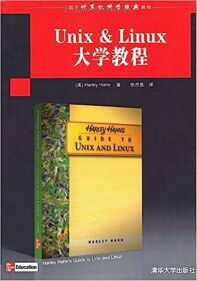

# 序言

## 好望角与塔吊（2021-2024 代序）

FreeBSD 是一款开源的类 UNIX 操作系统，直接继承自 BSD UNIX。被广泛应用于苹果产品，车机 QNX 系统，奈飞网络等等。

自 2002 年 9 月后，中文世界就再也没有一本 FreeBSD 的入门和基础教程了。知网上的硕博论文，有关 FreeBSD 的也只有区区 10 篇，均为硕士论文；而 Linux 则有 2 万余篇，百余篇博士论文。在国内招聘网站上也找不到任何 FreeBSD 有关的工作岗位，学校也不会开设相关课程。看起来市场完全不需要了，是这样吗？


当初那些推广宣传 FreeBSD 的人，如今在哪里？是否还会偶尔访问一下 <https://freebsd.org> 呢？水木年华的《一生有你》中唱道，“多少人曾爱慕你年轻时的容颜/可知谁愿承受岁月无情的变迁/多少人曾在你生命中来了又还/可知一生有你我都陪在你身边”。只有与你同行的才是你的朋友，无论在先，还是在后，都会被遗忘。

这个世界的确很大，但是对于大部分人，穷极一生也不会到达非洲的好望角。受墨卡托投影法的限制，人们意识不到非洲有多么广阔。人们只觉得俄罗斯很大，格陵兰岛更大。事实上，二者加起来，哪怕再加上中国都远不足非洲面积的三分之二。这个世界果真很大，就像开源世界一样；面对头顶无垠的星空，人们是会选择继续抬头前行，掉进泥沼；还是低头用忙碌充实自己？有的人可能一辈子都住在乡村里，从未出过几次远门，但这并不妨碍人们了解他那深邃的思想世界。即使人们完全没有能力读懂他，也会每年去纪念。世界的确很大，大到穷极一生也无法到达。世界真的很小，小到每天来来回回却连镇子都没有踏出一步。我们的好望角究竟在哪里？世界越大，世界也就越小。

《FreeBSD 从入门到跑路》项目从 [2021 年 12 月 19 日](https://github.com/FreeBSD-Ask/FreeBSD-Ask/commit/ffed3c20e2857c79dac123fa10e70490e3ae2477)到今天（2024 年 12 月 18 日）已经过去了 3 年整，有 5333 次 Commit。在 1095 天中，平均每天有 5 次提交。虽然不都是我的提交，但看起来也足够自我感动了。

自我接触 FreeBSD 至今亦 7 年有余。我从未直接对 FreeBSD 项目做出任何贡献，没有向 `src` 提交过任何代码。但我已经尽最大程度去延续我的敝帚自珍。

之所以将这一系列教程和文章作为一本开源书籍来呈现，根本上是因为：我希望此书能像 BSD 一样得到最大程度上的使用，产生最广泛的利益。

法国哲学家让-保罗·萨特认为，存在先于本质（参见《存在主义是一种人道主义》）；君子不器，人的存在没有固定本质，人的本质是动态地建构于实践中的。很明显，现在大多数人也是这么想的，人要去创造意义，才能同时获得意义。看起来似乎是对意义问题的终极回答了。那么，事实果真如此吗？萨特早年认为人的自由是绝对无限的，不承认任何所谓客观限制。我可以做，但我还没有做，因为我在找到做此事之意义。

现在想起来，刘震云《一句顶一万句》中有个角色叫“老詹”，从意大利到中国来传教，结果传教没成效，成了卖葱的；当中还有一个角色叫“老汪”，时常不知道在走些什么，就一直四处乱走。在这个世界中，我们除了安慰自己这已经是可能世界中最善的那个，已经是上帝的全能意志的体现，还有什么借口，说这个世界的美好？我时常乱走，我不认识任何人。就像在看 VR 电影一样。这个世界会不会是场电影？我们除了是自我感知意识的集合体以外，和电影中的人有什么区别？我在一场影像的放映之中，我并不存在。这个幼儿园的墙壁摸起来很粗糙，看起来是黄色的，敲击发现很硬。但不是无中生有。是有工人搭建如此。但这和这一切是场电影并不冲突。仔细想来，是谁让我看到的围栏？是谁让我摸了一下这根柱子。真的没有人吗？有一个原因可以解释吗？我有不去摸的自由吗？我真的有自由不去摸这根硬的粗糙的黄色的柱子吗？为什么我到处彳亍，仍旧回到了原点？

除了疾病外我一无所有。生命真的存在吗？正如加缪所说的那样，我一直是个局外人。我却用《庄子·山木》中的“君子之交淡如水”慰藉自己。我十几年前常去的图书批发市场，它还在，它也不在了，我再也找不到教辅书以外的任何书籍了；当初和我一起看书的人，他还在，他也不在了，我再也和他说不上话了。也许二者根本就从未存在过，只是我看过的一段电影罢了。电影结束后，剧组也就该解散了。我当时还在和众人打《三国杀》，不知道是谁丢的铁盒，塑封的三国杀。最后我赢了。我以为以后还会有很多如此快乐的日子，但是那却是结束。我再也找不到能凑齐的人去打三国杀了。无论线上还是线下。甚至 2V2 都找不到人。胜地不常，盛筵难再；兰亭已矣，梓泽丘墟。我已经很久很久没有玩过三国杀了。

我可能这辈子也无法去 BSD 的诞生地求学，甚至看一眼都是不可能的。我也永永远远无法获取他们要求的哲学博士学位。我的好望角在哪，它真的存在吗？如今，我抬头除了一片雾霾，什么也望不到。我以为是月亮，结果发现那是塔吊的照射灯。

## 存在即破烂（2025 代序）

再美好的东西，也只是一堆破烂。很多美好的东西即使再用心去推广宣传也终究消逝。所有的开源项目迟早都会变成数字墓地，后遂无问津者。

事实是，每天都会和无数人错过。北岛诗言“一切交往都是初逢”。即使是认识的人。也会永远离开，我这个意思不是说人死了。而是比如像群里的群友，他就不说话了，等于死了，没区别，你找回来他说话，也没有意义。第一你不想这么干，第二他不想这么干。所有人在一起不都是短暂的几年？对于实际意义来说，不说话就是死了。只有能说的上话的，对于自己来说才算活人。和这个人生理健康无关。这种死人遍地都是，我们不是一直活在墓地之上吗？ 聊天群也会消失变不见，人还在，群没了，再拉回来也是死人。他把你们用的聊天软件都卸载了，你即使舔过去和他用一样的，也没什么用。所有聊天群都迟早变成数字墓地。没意思啊，现实和群就是吹牛。什么也留不下，现实也一样。截图不就是赛博照片，没区别。这世界很大吗？为什么感觉这么小。没意思啊，无论群还是现实就是吹牛。和你待的时间最长的人你几乎都不认识，也不想认识，那就是工具人。谁会想和同事同学真正交朋友？忙起来好啊，都不记得了，多好。大家都忙起来，那这个世界该有多美好。事实是，他们只是换了一个地方吹牛罢了。反而安慰自己很充实。那些未与我们同行的人，真实存在吗？我对他们的影像，是他们的墓志铭吗？

我一直是个局外人。从未参与过任何 FreeBSD 开发与维护。对于 FreeBSD 项目来说，我就像是南阳刘子骥，再也找不到桃花源了。我为什么没有参加？我可以做，但我还没有做，因为我在找到做此事之意义。我也的确做过，我也从未做过。

## 编撰说明

### 目标平台

目前版本兼容 FreeBSD 14.1-RELEASE 及 FreeBSD 15.0-CURRENT，并尽量向下兼容。

主要面向 X86、AArch64 架构，并支持尽可能多的架构。

Windows 测试环境为 Windows 10、11，并尽量使用最新版本的 Windows。

### pkg 与 ports

因为 FreeBSD 有两种安装软件的方式（但并非所有软件都支持 pkg 的安装方式），因此为了方便，在本跑路教程中已经尽可能地列出了两种方式的安装说明。但希望大家明白，只是为了方便，而并非不能使用 ports 或者 pkg 进行安装或必须使用二者其一进行安装。

> **请注意，ports 一般是 HEAD 分支，你的 pkg 最好与 ports 保持在同一主线上，即都选择 `latest`。**


示例：

要安装软件 `yyy`，`yyy` 在 ports 里是 `xxx/yyy`，即路径是 `/usr/ports/xxx/yyy`。

- 那么首先可以通过 pkg 安装二进制软件包，和绝大多数 Linux 用法一样，下同：

```sh
# pkg install yyy
```

还可以这样：

```sh
# pkg install xxx/yyy
```

或者这样简写：

```sh
# pkg ins yyy
```

- 那么还可以通过 Ports 编译安装：

```sh
# cd /usr/ports/xxx/yyy
# make install clean
```

将会不断地弹出来窗口询问你怎么选。如果是使用默认选项，请这样做，则：

```sh
# cd /usr/ports/xxx/yyy
# make BATCH=yes install clean
```

如果你想一次性完成所有配置：

```sh
# cd /usr/ports/xxx/yyy
# make config-recursive # 会一直问你，直到结束依赖
# make install clean
```


### 本书中命令前的符号含义

`#` 代表 `root` 下的操作，基本等同 `sudo`。

`$`、`%` 代表普通用户账户权限。

### 对用户的要求

以高等院校计算机科学与技术学科一般本科毕业生所能达到的及格或及格以上水平为编写难度基准。如未能达到要求，请自行学习。

### 本书定位

本书旨在敉平新手与进阶之间的台阶。

## 贡献者名单

注：（A-Z 排序）

- [凌莞](https://clansty.com)
- [柳离枝](https://github.com/liulitchi)
- [魔王酱](https://github.com/maou-sama-desu)
- [清热解毒口服液](https://linuxacme.cn)
- [星不萌](https://www.moebsd.cn)
- [Alex6357](https://github.com/Alex6357)
- [bduath](https://github.com/bduath)
- [blu10ph](https://github.com/blu10ph)
- [dongdigua](https://github.com/dongdigua)
- [DogeW](https://github.com/DogeW)
- [fanyang1997](https://github.com/fanyang1997)
- [heguru5](https://github.com/heguru5)
- [matatabi-wang](https://github.com/matatabi-wang)
- [matatabi-wang](https://github.com/matatabi-wang)
- [orzyyyy](https://github.com/orzyyyy)
- [peiyafei](https://github.com/peiyafei)
- [pengxingwei](https://github.com/pengxingwei)
- [puffinjiang](https://github.com/puffinjiang)
- [qinghecyn](https://github.com/qinghecyn)
- [Rintim](https://github.com/Rintim)
- [safreya](https://github.com/safreya)
- [tomblackwhite](https://github.com/tomblackwhite)
- [ykla](https://github.com/ykla)
- 201724
- 地铁卡
- 兜率
- 杭永聪
- 极品盗号
- 李大鹏
- 墨子
- 奇点
- 施主
- 心即理物即心
- 星不萌
- 艳阳天
- 仰望天空
- 雨天
- April Simone🍥
- fjh1997
- freyr
- isNijikawa
- Jack
- kuntop
- liguangsheng
- livrth
- ruur
- Shengyun
- tergel93
- Voosk
- X-Ray
- Zomby7e

>**注意**
>
>如果缺少了你的信息或者不想被列出，请发起 Issue。


## 参考书目

相关书籍：新的变化也不是很大。不像 Linux 有这么多入门书籍。出于历史上的原因，看 UNIX 相关书籍即可。


> **技巧**
>
> 以下有多本书籍可通过微信读书免费阅读。

|                                                     封面                                                    |                书名                |                             作者                             |      ISBN     |       出版社       |                                         原版书名                                        |                     说明                    |
| :-------------------------------------------------------------------------------------------------------: | :------------------------------: | :--------------------------------------------------------: | :-----------: | :-------------: | :---------------------------------------------------------------------------------: | :---------------------------------------: |
|  |    _**Absolute FreeBSD 3rd**_    |                      Michael W. Lucas                      | 9781593278922 | No Starch Press |                                          /                                          | 英文版，目前没有译文。词汇包括内容都非常基础。**有计算机基础的人不需要阅读。** |
|                                                          |        《Unix & Linux 大学教程》       |                         Harley Hahn                        | 9787302209560 |     清华大学出版社     |                     _**Harley Hahn's Guide to Unix and Linux**_                     |                   命令行基础                   |
|                                                  |   《UNIX/Linux 系统管理技术手册（第 5 版）》   | Evi Nemeth、Garth Snyder、Trent R.Hein、Ben Whaley、Dan Mackin | 9787115532763 |     人民邮电出版社     |           _**UNIX and Linux System Administration Handbook 5th Edition**_           |               命令行进阶与 UNIX 基础              |
|                                             |   《FreeBSD 操作系统设计与实现（原书第 2 版）》   |  Marshall McKusick、George Neville-Neil、Robert N.M. Watson  | 9787111689973 |     机械工业出版社     |         _**Design and Implementation of the FreeBSD Operating System, 2nd**_        |                  主要讲解了内核。                 |
|                                                       |         《UNIX 传奇——历史与回忆》         |                      Brian W Kernighan                     | 9787115557179 |     人民邮电出版社     |                          _**UNIX: A History and a Memoir**_                         |             主要讲解了 UNIX 的发展历史。             |
|                                                             |            《UNIX 编程艺术》           |                        Eric Raymond                        | 9787121176654 |     电子工业出版社     | _**The Art of UNIX Programming (The Addison-Wesley Professional Computng Series)**_ |          主要讲解了 UNIX 的设计哲学与软件工程理论。         |
|                                                               |             《大教堂与集市》             |                       Eric S. Raymond                      | 9787111452478 |     机械工业出版社     |                           _**The Cathedral & the Bazaar**_                          |               主要介绍了开源运动的发展史。              |
|                                                           |        《4.4BSD 操作系统设计与实现》        |                   Marshall Kirk McKusick                   | 9787111366478 |     机械工业出版社     |          _**The Design and Implementation of the 4.4BSD Operating System**_         |              4.4BSD 操作系统设计与实现             |
|                                                    |      《深入理解 FreeBSD 设备驱动程序开发》     |                         Joseph Kong                        | 9787111411574 |     机械工业出版社     |                _**FreeBSD Device Drivers: A Guide for the Intrepid**_               |              FreeBSD 设备驱动程序开发             |
|                                                            |       《UNIX 环境高级编程（第 3 版）》       |              W.Richard Stevens、Stephen A.Rago              | 9787115352118 |     人民邮电出版社     |          _**Advanced Programming in the UNIX Environment, Third Edition**_          |          深入了解驱动 UNIX 内核的编程接口的实用知识         |
|                                              | 《UNIX 网络编程 卷 1：套接字联网 API（第 3 版）》 |       W. Richard Stevens、Bill Fenner、Andrew M. Rudoff      | 9787115367198 |     人民邮电出版社     | _**UNIX Network Programming, Volume 1: The Sockets Networking API, Third Edition**_ |             如何使用套接字 API 进行网络编程            |
|                                                  |   《UNIX 网络编程 卷 2：进程间通信（第 2 版）》   |                     W. Richard Stevens                     | 9787115367204 |     人民邮电出版社     |  _**UNIX Network Programming,Vovum 2：Interprocess Communications,Second Edition**_  |    深入了解各种进程间通信形式。**这书原作者没出第 3 版，不用再找了**   |

